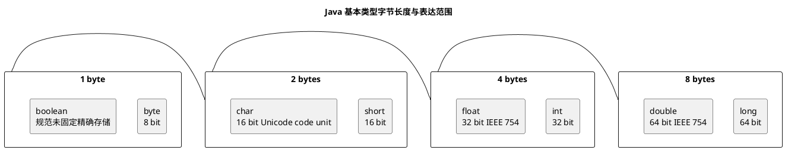

# Java 基本类型与 char 字节长度

## 问题索引

- Q1：为什么 `char` 在 Java 中占两个字节？
- Q2：其他基本类型为什么占用不同的字节长度？

## Q1：为什么 `char` 在 Java 中占两个字节？

### 核心结论

Java 的 `char` 占 2 个字节，因为它被设计为 16 位无符号类型，用来表示一个 UTF-16 编码单元。

Java 早期设计时选择 Unicode 作为字符表示方案。当时 Unicode 主要位于 16 位编码空间内，所以 `char` 被定义成 16 位，也就是 2 字节。

### 需要注意的点

现在 Unicode 已经超过 16 位范围，一个 `char` 不一定能表示所有 Unicode 字符。

对于超过 `U+FFFF` 的字符，例如部分 emoji、生僻字，需要使用两个 `char` 组成代理对，Surrogate Pair。

也就是说：

- 一个 Java `char` = 一个 UTF-16 code unit。
- 一个 Unicode 字符 = 可能是一个 `char`，也可能是两个 `char`。

### 示例

```java
public class CharDemo {
    public static void main(String[] args) {
        String a = "A";
        String emoji = "😊";

        System.out.println(a.length());      // 1
        System.out.println(emoji.length());  // 2
        System.out.println(emoji.codePointCount(0, emoji.length())); // 1
    }
}
```

`emoji.length()` 是 2，因为 `String.length()` 返回的是 UTF-16 code unit 数量，不是 Unicode 字符数量。

## Q2：其他基本类型为什么占用不同的字节长度？


### PlantUML 示意图：Java 基本类型位宽关系



### 核心结论

Java 基本类型的字节长度由语言规范固定，主要是为了在数值范围、精度、内存占用和执行效率之间做权衡。

| 类型 | 字节 | 位数 | 说明 |
|---|---:|---:|---|
| `byte` | 1 | 8 | 小整数、二进制数据 |
| `short` | 2 | 16 | 较小整数 |
| `int` | 4 | 32 | 默认整数类型，运算常用 |
| `long` | 8 | 64 | 大范围整数 |
| `float` | 4 | 32 | IEEE 754 单精度浮点数 |
| `double` | 8 | 64 | IEEE 754 双精度浮点数 |
| `char` | 2 | 16 | UTF-16 编码单元 |
| `boolean` | 不固定 | 不固定 | JVM 规范没有规定固定占用，取决于 JVM 实现和存储场景 |

### 为什么不统一成同一种长度

如果所有类型都用 8 字节，会浪费大量内存。

如果所有类型都用 1 字节，又无法表达足够大的数值范围和精度。

所以不同类型承担不同职责：

- `byte` 适合网络、文件、图片等二进制数据。
- `int` 是最常用整数类型，也是很多表达式运算时的默认提升类型。
- `long` 用于大范围 ID、时间戳、计数器。
- `float` 和 `double` 用于不同精度的浮点计算。
- `char` 用于 UTF-16 编码单元。

### 面试话术

> Java 的 `char` 占 2 个字节，是因为 Java 早期采用 Unicode 作为字符表示，`char` 被设计为 16 位无符号类型，用来表示一个 UTF-16 编码单元。其他基本类型占用不同字节，是语言规范对表达范围、精度、内存占用和运算效率的权衡，例如 `int` 是 32 位、`long` 是 64 位、`float` 和 `double` 分别对应 IEEE 754 单精度和双精度浮点数。需要注意，现在 Unicode 超过了 16 位，所以一个 `char` 不一定能表示所有字符，部分字符需要代理对表示。

## 高频追问

- Q：`char` 能不能表示中文？
  A：大部分常用中文可以，因为它们位于 BMP 范围内，一个 `char` 可以表示。但部分生僻字可能超过 `U+FFFF`，需要代理对。

- Q：`String.length()` 返回的是字符数吗？
  A：严格说不是。它返回 UTF-16 code unit 数量。对于 emoji 等补充字符，可能一个字符返回长度 2。

- Q：`boolean` 占几个字节？
  A：Java 语言规范没有规定固定字节数。单独变量、数组元素、对象字段在不同 JVM 实现和内存布局下可能不同。

- Q：为什么 Java 的基本类型长度是固定的？
  A：为了跨平台一致性。比如 `int` 在 Java 中总是 32 位，不会像某些 C/C++ 环境那样依赖平台。

## 复习清单

- [ ] 能说明 `char` 是 16 位无符号类型
- [ ] 能区分 UTF-16 code unit 和 Unicode code point
- [ ] 能解释代理对
- [ ] 能列出 Java 基本类型的大致字节数
- [ ] 能解释 `boolean` 为什么不能简单说固定 1 字节

