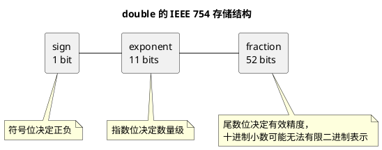

# 浮点数精度丢失

## 问题索引

- Q1：解释一下浮点数运算精度丢失问题是如何产生的

## Q1：解释一下浮点数运算精度丢失问题是如何产生的

### 背景

Java 中 `float` 和 `double` 经常出现看起来“算错”的现象，例如：

```java
public class FloatPrecisionDemo {
    public static void main(String[] args) {
        // 0.1 和 0.2 在二进制浮点数中都不能被精确表示
        double result = 0.1 + 0.2;

        // 输出通常不是 0.3，而是 0.30000000000000004
        System.out.println(result);
    }
}
```

这不是 Java 算术有 bug，而是二进制浮点数表示十进制小数时天然存在近似。

### 核心结论

浮点数精度丢失主要来自三个原因：

1. 十进制小数转成二进制时，很多数无法有限表示。
2. `float` 和 `double` 位数有限，只能保存近似值。
3. 运算过程中会不断舍入，误差可能累积或放大。

所以 `0.1 + 0.2 != 0.3` 的本质是：参与运算的 `0.1`、`0.2`、`0.3` 在 `double` 里本来就不是精确的十进制值。

### 十进制小数为什么不能精确表示

十进制中，`1 / 10 = 0.1` 可以有限表示。

但计算机中的浮点数通常用二进制表示。二进制只能精确表示可以拆成 `1/2`、`1/4`、`1/8`、`1/16` 这类分母为 2 的幂的小数。

例如：

- `0.5 = 1/2`，二进制可以精确表示。
- `0.25 = 1/4`，二进制可以精确表示。
- `0.125 = 1/8`，二进制可以精确表示。
- `0.1 = 1/10`，分母不是 2 的幂，二进制无法有限表示。

`0.1` 转成二进制会变成循环小数，类似十进制里 `1/3 = 0.333333...`。由于 `double` 位数有限，只能截断或舍入保存一个近似值。

### double 的存储结构


### PlantUML 示意图：double 二进制组成



Java 的 `double` 遵循 IEEE 754 双精度浮点数标准，占 64 位，大致分为：

| 部分 | 位数 | 含义 |
|---|---:|---|
| 符号位 | 1 位 | 表示正负 |
| 指数位 | 11 位 | 表示数量级 |
| 尾数位 | 52 位 | 表示有效数字 |

可以粗略理解为：

```text
double = 符号 * 尾数 * 2^指数
```

因为尾数位只有有限的 52 位，所以很多小数只能近似保存。

### 为什么打印出来是 0.30000000000000004

当代码写：

```java
double result = 0.1 + 0.2;
```

实际过程更接近：

```text
0.1 -> 保存为接近 0.1 的二进制近似值
0.2 -> 保存为接近 0.2 的二进制近似值
相加 -> 得到接近 0.3 但略大一点的近似值
打印 -> 转回十进制显示为 0.30000000000000004
```

这类误差通常很小，但在金额、库存、结算、对账、税费等场景中不能接受。

### float 和 double 的区别

`float` 是单精度，占 32 位，尾数位更少，精度更低。

`double` 是双精度，占 64 位，尾数位更多，精度更高。

但它们本质上都是二进制浮点数，所以 `double` 只是误差更小，不代表能精确表示所有十进制小数。

### 为什么不能用 == 比较浮点数

因为浮点数可能有微小误差，直接用 `==` 容易得到不符合业务直觉的结果。

```java
public class FloatCompareDemo {
    public static void main(String[] args) {
        double a = 0.1 + 0.2;
        double b = 0.3;

        // 这里通常是 false，因为 a 和 b 的二进制近似值并不完全相同
        System.out.println(a == b);

        // 用误差范围判断两个浮点数是否“足够接近”
        double epsilon = 1e-9;
        System.out.println(Math.abs(a - b) < epsilon);
    }
}
```

对于科学计算，可以用误差范围 `epsilon` 判断是否足够接近。

但对于金额计算，不建议用 `double` 加 `epsilon` 兜底，而应该用 `BigDecimal` 或整数分单位存储。

### BigDecimal 的正确用法

金额计算常用 `BigDecimal`，但要注意构造方式。

错误示例：

```java
import java.math.BigDecimal;

public class BigDecimalWrongDemo {
    public static void main(String[] args) {
        // 不推荐：0.1 先被解析成 double 近似值，再传给 BigDecimal
        BigDecimal value = new BigDecimal(0.1);

        // 输出会包含一长串二进制浮点误差
        System.out.println(value);
    }
}
```

正确示例：

```java
import java.math.BigDecimal;
import java.math.RoundingMode;

public class BigDecimalRightDemo {
    public static void main(String[] args) {
        // 推荐：用字符串构造，BigDecimal 能拿到精确的十进制文本
        BigDecimal price = new BigDecimal("0.1");
        BigDecimal count = new BigDecimal("3");

        // 金额乘法使用 BigDecimal 运算，避免二进制浮点误差
        BigDecimal total = price.multiply(count);
        System.out.println(total);

        // 除法要指定小数位和舍入模式，避免除不尽时报 ArithmeticException
        BigDecimal avg = BigDecimal.ONE.divide(new BigDecimal("3"), 2, RoundingMode.HALF_UP);
        System.out.println(avg);
    }
}
```

也可以使用：

```java
BigDecimal value = BigDecimal.valueOf(0.1);
```

`BigDecimal.valueOf(double)` 内部会使用 `Double.toString(double)` 的结果来构造，通常比 `new BigDecimal(0.1)` 更符合直觉。但金额等强精度场景，最稳妥的方式仍然是从字符串、数据库 decimal 字段或整数分单位进入系统。

### 业务场景

业务系统中这些场景要避免直接使用 `float` / `double` 做精确计算：

- 金额、优惠券、积分、税费。
- 订单结算、退款、对账。
- 库存扣减、计量单位换算。
- 需要严格相等比较的规则判断。

推荐方案：

- 金额用 `BigDecimal`。
- 金额也可以用 `long` 存“分”，例如 1999 表示 19.99 元。
- 数据库使用 `DECIMAL`，不要用 `FLOAT` / `DOUBLE` 存金额。
- 接口传金额时统一约定单位和精度，避免前后端各自四舍五入。

### 踩坑点

- 不要用 `new BigDecimal(double)` 构造金额。
- 不要直接用 `==` 比较浮点数。
- `BigDecimal.divide` 遇到除不尽时必须指定精度和舍入模式。
- `BigDecimal.equals` 会比较数值和 scale，`1.0` 和 `1.00` 不相等；业务上只比较数值时用 `compareTo`。

示例：

```java
import java.math.BigDecimal;

public class BigDecimalCompareDemo {
    public static void main(String[] args) {
        BigDecimal a = new BigDecimal("1.0");
        BigDecimal b = new BigDecimal("1.00");

        // false：equals 会比较数值和小数位 scale
        System.out.println(a.equals(b));

        // true：compareTo 只比较数值大小
        System.out.println(a.compareTo(b) == 0);
    }
}
```

### 面试话术

> 浮点数精度丢失的根本原因是 `float` 和 `double` 使用二进制浮点表示，而很多十进制小数，比如 0.1、0.2，转成二进制后是无限循环小数。由于浮点数位数有限，只能保存近似值，运算时还会继续发生舍入，所以可能出现 `0.1 + 0.2` 结果不是精确 `0.3` 的情况。科学计算里可以用误差范围比较浮点数，但金额、结算、对账这类强精度场景不能用 `double`，应该用 `BigDecimal` 或用整数存最小货币单位。

## 高频追问

- Q：为什么 `0.5` 可以精确表示，`0.1` 不行？
  A：因为 `0.5 = 1/2`，分母是 2 的幂；`0.1 = 1/10`，分母含有 5，转成二进制会变成循环小数。

- Q：`double` 精度比 `float` 高，为什么仍然会丢精度？
  A：`double` 只是尾数位更多，能保存更多有效数字，但仍然是有限位二进制浮点数，不能精确表示所有十进制小数。

- Q：金额计算为什么不能用 `double`？
  A：金额要求十进制精确，`double` 的二进制近似误差可能导致结算、对账、舍入结果不一致。

- Q：`BigDecimal` 为什么不推荐 `new BigDecimal(0.1)`？
  A：因为传入构造器前，`0.1` 已经是一个不精确的 `double` 近似值，`BigDecimal` 会把这个近似值完整保存下来。

- Q：`BigDecimal.equals` 和 `compareTo` 有什么区别？
  A：`equals` 同时比较数值和 scale，`1.0` 和 `1.00` 不相等；`compareTo` 只比较数值大小，业务数值比较通常用 `compareTo`。

## 复习清单

- [ ] 能解释十进制小数为什么转二进制可能无限循环
- [ ] 能说清 `float` / `double` 为什么只能保存近似值
- [ ] 能举出 `0.1 + 0.2` 的例子
- [ ] 能说明为什么不能用 `==` 比较浮点数
- [ ] 能说出 `BigDecimal` 的正确构造方式
- [ ] 能解释金额场景为什么建议用 `BigDecimal` 或整数分单位

