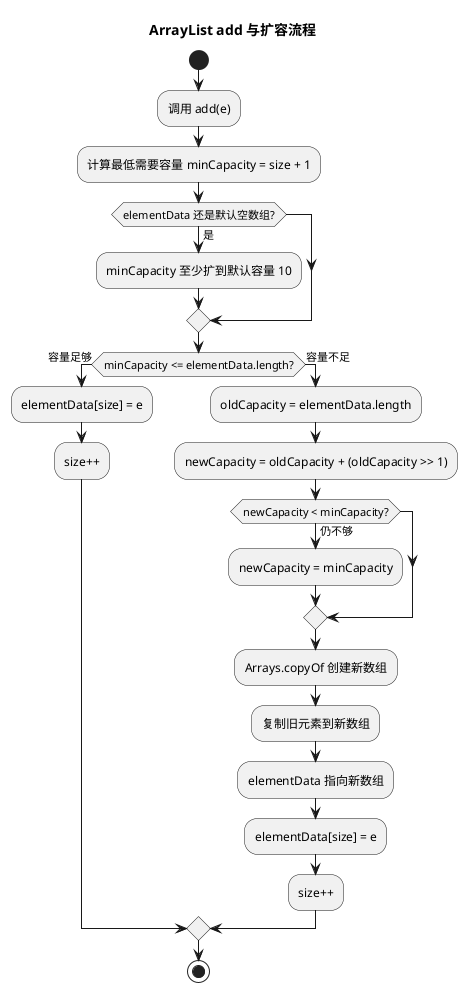

# ArrayList 扩容机制

## 问题索引

- Q1：ArrayList 的扩容机制

## Q1：ArrayList 的扩容机制

### 背景

`ArrayList` 底层是动态数组。数组本身长度固定，所以当元素数量超过当前数组容量时，`ArrayList` 必须创建一个更大的新数组，并把旧数组中的元素拷贝过去。

因此，理解 `ArrayList` 扩容机制，本质是在理解三个问题：

1. 初始容量是多少。
2. 什么时候扩容。
3. 扩容到多大，以及扩容成本是什么。

### 核心结论

以 JDK 8 之后的常见实现为例：

- `new ArrayList<>()` 创建时，底层数组通常还是空数组，不会立刻分配长度为 10 的数组。
- 第一次 `add` 时，如果是默认空数组，会扩容到默认容量 10。
- 后续容量不够时，通常按 1.5 倍扩容。
- 扩容公式近似为：`newCapacity = oldCapacity + (oldCapacity >> 1)`。
- 扩容底层依赖 `Arrays.copyOf`，会创建新数组并复制旧元素。
- 如果一次性新增的元素很多，1.5 倍还不够，会直接扩到满足最小需求的容量。

一句话：

```text
ArrayList 默认构造是懒分配，第一次添加扩到 10，之后容量不够时通常扩到原来的 1.5 倍，并复制数组。
```

### 底层结构

`ArrayList` 的核心字段可以简化理解为：

```java
public class ArrayList<E> {
    // 真正保存元素的数组。
    // transient 表示默认序列化时不直接按这个字段完整序列化。
    transient Object[] elementData;

    // 当前已经存放的元素个数，不等于数组容量。
    private int size;
}
```

重点区分：

| 概念 | 含义 |
| --- | --- |
| `size` | 当前实际元素数量 |
| `elementData.length` | 当前数组容量 |

例如：

```text
size = 3
elementData.length = 10
```

表示当前放了 3 个元素，但底层数组最多可以暂时容纳 10 个元素，不需要立刻扩容。

### 默认构造与懒分配

很多人会说 `ArrayList` 默认容量是 10，这句话要说准确：

```java
List<String> list = new ArrayList<>();
```

这一步通常不会马上创建长度为 10 的数组，而是使用一个共享的空数组。等第一次 `add` 时，才真正扩容到默认容量 10。

原因：

1. 避免创建了大量空 `ArrayList` 却不用时浪费内存。
2. 把真实数组分配延迟到第一次添加元素时。

所以更严谨的说法是：

```text
默认构造的 ArrayList 初始是空数组，第一次添加元素时默认扩到 10。
```

### add 触发扩容的流程

`add(E e)` 的大致流程：

```text
1. 判断 size + 1 是否超过 elementData.length
2. 如果没超过，直接把元素放到 elementData[size]
3. 如果超过，先扩容
4. 扩容完成后再放入元素
5. size 加 1
```

伪代码：

```java
public boolean add(E e) {
    // 确保数组至少能容纳 size + 1 个元素。
    // 如果容量不够，ensureCapacityInternal 内部会触发扩容。
    ensureCapacityInternal(size + 1);

    // size 是当前元素数量，也正好是下一个元素应该写入的位置。
    elementData[size++] = e;
    return true;
}
```

### PlantUML 示意图：add 与扩容流程



### 扩容到多大

扩容核心逻辑可以简化为：

```java
private void grow(int minCapacity) {
    int oldCapacity = elementData.length;

    // oldCapacity >> 1 等价于 oldCapacity / 2。
    // 所以新容量大约是旧容量的 1.5 倍。
    int newCapacity = oldCapacity + (oldCapacity >> 1);

    // 如果 1.5 倍之后仍然不够，就直接扩到最低需要容量。
    // 例如 addAll 一次添加大量元素时会走到这里。
    if (newCapacity < minCapacity) {
        newCapacity = minCapacity;
    }

    // 创建新数组，并把旧数组中的元素复制过去。
    elementData = Arrays.copyOf(elementData, newCapacity);
}
```

举例：

| 旧容量 | 新容量 |
| --- | --- |
| 10 | 15 |
| 15 | 22 |
| 22 | 33 |
| 33 | 49 |
| 49 | 73 |

由于是整数运算，所以不是严格乘以 1.5 后保留小数，而是通过位移得到整数结果。

### 扩容为什么是 1.5 倍

扩容倍数是在空间浪费和扩容次数之间做平衡。

如果扩容倍数太小：

- 扩容更频繁。
- 数组复制次数更多。
- 写入大量元素时性能更差。

如果扩容倍数太大：

- 一次性浪费更多空闲空间。
- 大列表扩容时可能造成明显内存浪费。

1.5 倍是一个折中选择：比每次只增加固定长度更少扩容，又比 2 倍扩容更省空间。

### 扩容成本

`ArrayList` 扩容不是原地变长，而是：

```text
创建新数组 -> 复制旧元素 -> 引用指向新数组 -> 旧数组等待 GC
```

成本主要有：

1. 时间成本：复制已有元素，复杂度是 `O(n)`。
2. 内存成本：扩容瞬间新旧数组可能同时存在。
3. GC 成本：旧数组后续需要被回收。

这也是为什么在明确数据量时，建议指定初始容量。

```java
// 已知大概要放 10 万条数据时，提前指定容量可以减少扩容次数和数组复制成本。
List<Long> ids = new ArrayList<>(100_000);
```

### addAll 的扩容特点

`addAll(Collection<? extends E> c)` 一次可能新增多个元素，所以扩容时的 `minCapacity` 不是 `size + 1`，而是 `size + c.size()`。

如果 1.5 倍容量仍然不够，`ArrayList` 会直接扩到本次需要的最小容量。

例如：

```text
当前容量 10，size = 10
addAll 一次新增 100 个元素
最低需要容量 minCapacity = 110
1.5 倍只到 15，不够
最终会直接扩到 110
```

### 最大容量

`ArrayList` 不是无限扩容。

它受几个因素限制：

1. `int` 下标范围。
2. JVM 最大数组长度限制。
3. 堆内存大小。
4. 对象引用数组本身占用的连续内存。

源码里通常有类似 `MAX_ARRAY_SIZE = Integer.MAX_VALUE - 8` 的保护值。超过限制可能抛出 `OutOfMemoryError`。

### 与 LinkedList 的对比

`ArrayList` 扩容成本来自数组复制，但它有连续内存和随机访问优势。

| 维度 | ArrayList | LinkedList |
| --- | --- | --- |
| 底层结构 | 动态数组 | 双向链表 |
| 随机访问 | 快，`O(1)` | 慢，`O(n)` |
| 尾部追加 | 大多数时候快，扩容时慢 | 稳定但节点分配有成本 |
| 中间插入删除 | 需要移动元素 | 找到节点后改指针 |
| 内存占用 | 存引用数组，较紧凑 | 每个节点有前后指针，额外开销大 |

实际业务中，`ArrayList` 使用频率远高于 `LinkedList`，因为遍历和随机访问更常见，CPU 缓存友好性也更好。

### 业务场景

如果项目里要批量查询、批量转换、组装 DTO：

```java
List<OrderDTO> result = new ArrayList<>(orders.size());
for (Order order : orders) {
    // 提前用 orders.size() 指定容量，避免循环 add 时多次扩容。
    result.add(convert(order));
}
```

如果没有指定容量，随着元素不断增加，可能发生多次数组扩容和复制。数据量小时无感，数据量大时会带来明显 CPU 和内存抖动。

### 踩坑点

#### 默认容量不是构造时立刻分配 10

`new ArrayList<>()` 通常只是空数组，第一次添加才扩到 10。

#### size 不是 capacity

`size()` 返回的是元素数量，不是底层数组容量。

#### 扩容不是免费操作

扩容涉及数组复制，大列表扩容会有明显成本。

#### ArrayList 不是线程安全的

多线程并发 `add` 可能导致数据覆盖、元素丢失、数组越界等问题。并发场景要考虑 `Collections.synchronizedList`、`CopyOnWriteArrayList` 或其他并发容器。

### 面试话术

可以这样回答：

> ArrayList 底层是 Object 数组。默认构造时通常不会立即分配长度为 10 的数组，而是使用空数组，第一次 add 时扩到默认容量 10。后续每次 add 前会检查 `size + 1` 是否超过当前数组长度，如果容量不够就扩容。扩容时新容量通常是旧容量的 1.5 倍，公式大致是 `oldCapacity + (oldCapacity >> 1)`；如果 1.5 倍仍然小于本次最低需要容量，比如 addAll 一次添加很多元素，就直接扩到最低需要容量。扩容底层用 `Arrays.copyOf` 创建新数组并复制旧元素，所以扩容是有 `O(n)` 成本的。实际开发中，如果能预估元素数量，建议用 `new ArrayList<>(expectedSize)` 减少扩容次数。

## 高频追问

- Q：ArrayList 默认容量是多少？
  A：更严谨地说，默认构造时底层是空数组，第一次添加元素时扩到默认容量 10。

- Q：ArrayList 为什么是 1.5 倍扩容？
  A：这是空间和扩容次数之间的折中。倍数太小会频繁扩容，倍数太大会浪费更多内存。

- Q：ArrayList 扩容时元素地址会变吗？
  A：底层数组对象会变，因为创建了新数组；但数组里保存的是对象引用，元素对象本身不会因为数组扩容而复制出新对象，只是引用被复制到新数组。

- Q：size 和 capacity 有什么区别？
  A：`size` 是实际元素数量，capacity 是底层数组容量。`size()` 只能看到元素数量，看不到底层数组容量。

- Q：为什么提前指定容量能优化性能？
  A：可以减少扩容次数，减少数组复制和扩容瞬间的内存占用。

- Q：ArrayList 删除元素会缩容吗？
  A：普通删除不会自动缩容。可以手动调用 `trimToSize()`，但生产中要谨慎，因为后续再添加可能又触发扩容。

## 复习清单

- [ ] 能说清默认构造和第一次 add 的容量变化
- [ ] 能写出 1.5 倍扩容公式
- [ ] 能解释 `size` 和数组容量的区别
- [ ] 能说明 `Arrays.copyOf` 带来的复制成本
- [ ] 能解释为什么 `addAll` 可能直接扩到最低需要容量
- [ ] 能结合业务说明为什么要预估容量

