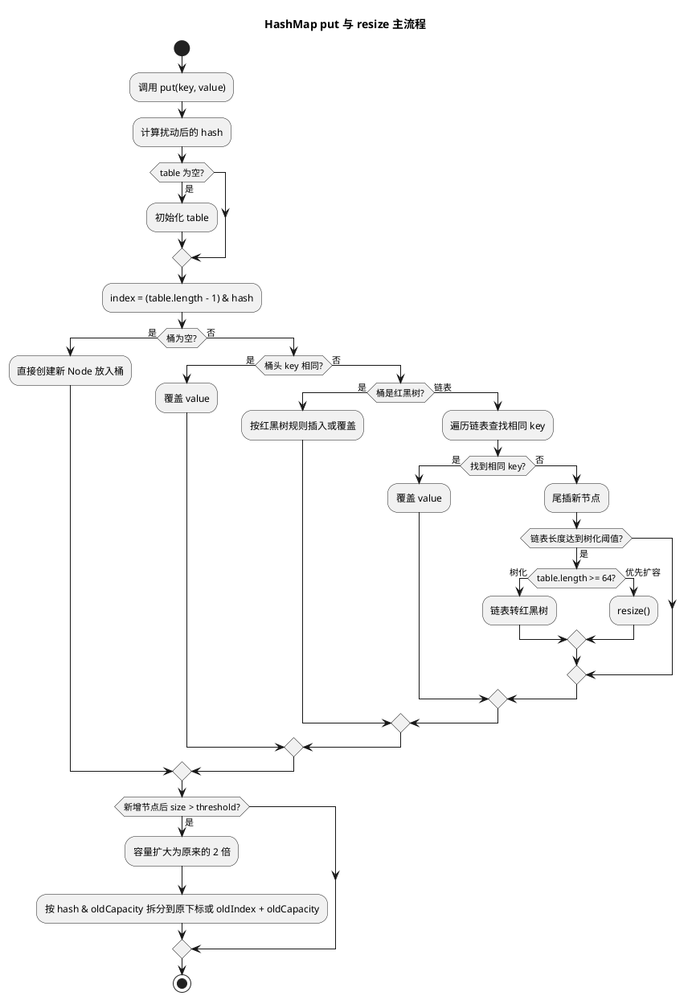
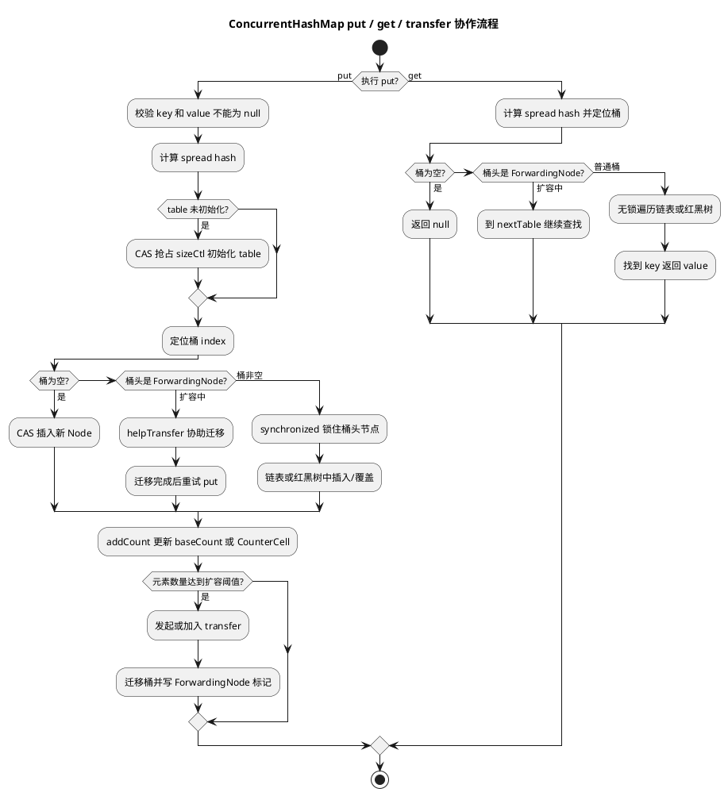

# HashMap 与 ConcurrentHashMap

## 问题索引

- Q1：HashMap 和 ConcurrentHashMap

## Q1：HashMap 和 ConcurrentHashMap

### 背景

`HashMap` 和 `ConcurrentHashMap` 都是基于哈希表的 Map 实现，但定位不同：

- `HashMap`：普通非线程安全 Map，适合单线程或外部保证同步的场景。
- `ConcurrentHashMap`：线程安全并发 Map，适合高并发读写场景。

面试里不能只说“一个线程安全，一个不安全”，还要能讲清楚底层结构、扩容、哈希冲突、并发控制、为什么 `ConcurrentHashMap` 不允许 `null`。

### 核心对比

| 维度 | HashMap | ConcurrentHashMap |
| --- | --- | --- |
| 线程安全 | 不安全 | 安全 |
| 底层结构 | 数组 + 链表 + 红黑树 | 数组 + 链表 + 红黑树 |
| JDK 8 并发控制 | 无 | CAS + synchronized + volatile |
| 读操作 | 无锁 | 大多数情况下无锁，依赖 volatile 可见性 |
| 写操作 | 无锁 | 桶为空 CAS，桶非空锁桶头节点 |
| 扩容 | 单线程 resize | 支持多线程协助迁移 |
| null key/value | 允许一个 null key，多个 null value | 不允许 null key 和 null value |
| 迭代器 | fail-fast | 弱一致性 |
| 适用场景 | 单线程、局部变量、只读初始化后使用 | 多线程共享缓存、状态表、计数辅助结构 |

### HashMap 底层结构

JDK 8 中，`HashMap` 底层主要是：

```text
Node<K,V>[] table
  -> 每个数组位置是一个桶
  -> 桶中可能是链表
  -> 链表过长时可能树化为红黑树
```

核心字段：

```java
public class HashMap<K, V> {
    // 哈希桶数组，长度始终是 2 的幂，便于通过位运算定位下标。
    transient Node<K,V>[] table;

    // 当前键值对数量。
    transient int size;

    // 扩容阈值，通常等于 capacity * loadFactor。
    int threshold;

    // 默认负载因子是 0.75，在空间和冲突概率之间折中。
    final float loadFactor;
}
```

### HashMap put 流程

`put` 的大致流程：

```text
1. 计算 key 的 hash
2. 如果 table 为空，先初始化
3. 根据 (n - 1) & hash 定位桶下标
4. 如果桶为空，直接放新节点
5. 如果桶不为空，比较 key：
   - key 相同，覆盖 value
   - key 不同，追加到链表或插入红黑树
6. 如果链表长度达到阈值，尝试树化
7. size 增加，如果超过 threshold，触发扩容
```

简化伪代码：

```java
V put(K key, V value) {
    int hash = hash(key);

    // table 为空时先初始化数组。
    if (table == null || table.length == 0) {
        resize();
    }

    int index = (table.length - 1) & hash;
    Node<K, V> first = table[index];

    if (first == null) {
        // 桶为空时直接放入新节点。
        table[index] = new Node<>(hash, key, value, null);
    } else {
        // 桶不为空时，需要在链表或红黑树中查找 key。
        // 找到相同 key 就覆盖；找不到就追加新节点。
        putIntoBucket(first, hash, key, value);
    }

    // 元素数量超过阈值后触发扩容。
    if (++size > threshold) {
        resize();
    }

    return value;
}
```

### PlantUML 示意图：HashMap put 与扩容流程



### 为什么容量是 2 的幂

HashMap 用下面方式计算下标：

```text
index = (table.length - 1) & hash
```

当数组长度是 2 的幂时，`table.length - 1` 的二进制低位全是 1，可以用位运算快速取模。

例如长度 16：

```text
16 - 1 = 15
15 的二进制 = 1111
hash & 1111 等价于 hash % 16
```

好处：

1. 位运算比取模快。
2. 扩容时元素位置迁移更简单。
3. 扩容后节点要么留在原位置，要么移动到 `oldIndex + oldCapacity`。

### HashMap 扩容机制

默认容量通常是 16，默认负载因子是 0.75，所以默认阈值是：

```text
16 * 0.75 = 12
```

当 `size > threshold` 时扩容，容量变为原来的 2 倍。

JDK 8 扩容时有一个重要优化：

```text
如果节点 hash & oldCapacity == 0，留在原下标
如果节点 hash & oldCapacity != 0，移动到 oldIndex + oldCapacity
```

这样不需要重新完整计算 hash，只需要看新增的那一位。

### HashMap 树化条件

JDK 8 为了解决哈希冲突严重时链表查询退化问题，引入红黑树。

树化条件主要包括：

1. 单个桶链表长度达到 `TREEIFY_THRESHOLD`，通常是 8。
2. 数组容量至少达到 `MIN_TREEIFY_CAPACITY`，通常是 64。

如果链表长度达到 8，但数组容量还小于 64，优先扩容，而不是树化。

原因：

```text
容量太小时，冲突可能只是数组太小导致的，扩容比树化更合适。
```

### HashMap 为什么线程不安全

`HashMap` 没有并发控制，多线程同时写可能出现：

1. 数据覆盖。
2. size 统计不准。
3. 扩容期间数据丢失。
4. JDK 7 头插法扩容在并发下可能出现链表成环。
5. 迭代时并发修改触发 `ConcurrentModificationException`。

JDK 8 改成尾插法后，缓解了 JDK 7 扩容成环问题，但 `HashMap` 仍然不是线程安全容器。

### ConcurrentHashMap 底层结构

JDK 8 的 `ConcurrentHashMap` 和 `HashMap` 一样，也是：

```text
数组 + 链表 + 红黑树
```

但它在并发控制上做了很多设计：

| 机制 | 作用 |
| --- | --- |
| `volatile Node<K,V>[] table` | 保证 table 引用可见性 |
| `volatile Node.val` | 保证 value 更新可见性 |
| CAS | 桶为空时无锁插入、初始化 table、更新计数 |
| `synchronized` | 桶非空时锁住桶头节点 |
| `sizeCtl` | 控制初始化、扩容阈值、扩容状态 |
| `ForwardingNode` | 标记桶已经迁移到新表 |
| `CounterCell` | 分散计数，降低 size 统计竞争 |

### ConcurrentHashMap put 流程

JDK 8 `put` 可以简化为：

```text
1. key/value 不能为 null
2. 计算 hash
3. table 未初始化则初始化
4. 定位桶下标
5. 桶为空：CAS 放入新节点
6. 桶正在迁移：帮助扩容
7. 桶非空：synchronized 锁住桶头节点，插入链表或红黑树
8. 更新元素计数
9. 必要时触发扩容
```

伪代码：

```java
V putVal(K key, V value) {
    if (key == null || value == null) {
        // ConcurrentHashMap 禁止 null，避免并发语义歧义。
        throw new NullPointerException();
    }

    int hash = spread(key.hashCode());

    for (;;) {
        Node<K, V>[] tab = table;

        if (tab == null || tab.length == 0) {
            // 多线程下只有一个线程能 CAS 成功并完成初始化。
            tab = initTable();
            continue;
        }

        int index = (tab.length - 1) & hash;
        Node<K, V> first = tabAt(tab, index);

        if (first == null) {
            // 桶为空时用 CAS 插入，避免加锁。
            if (casTabAt(tab, index, null, new Node<>(hash, key, value))) {
                break;
            }
        } else if (first.hash == MOVED) {
            // 当前桶正在扩容迁移，当前线程可以帮助迁移。
            tab = helpTransfer(tab, first);
        } else {
            // 桶非空时锁桶头节点，只影响当前桶，不锁整个 Map。
            synchronized (first) {
                putIntoBin(first, hash, key, value);
            }
            break;
        }
    }

    // 通过 baseCount + CounterCell 分散更新元素数量。
    addCount(1L);
    return null;
}
```

### PlantUML 示意图：ConcurrentHashMap put / get / 协助扩容



### JDK 7 与 JDK 8 ConcurrentHashMap 区别

| 版本 | 并发控制 |
| --- | --- |
| JDK 7 | Segment 分段锁 |
| JDK 8 | CAS + synchronized 锁桶头节点 |

JDK 7 中，`ConcurrentHashMap` 由多个 `Segment` 组成，每个 `Segment` 类似一个小 HashMap，并继承 `ReentrantLock`。并发度主要由 Segment 数决定。

JDK 8 去掉 Segment 数组作为核心结构，改为直接操作 Node 数组。桶为空时 CAS，桶非空时锁桶头节点，锁粒度更细，也减少了 Segment 结构复杂度。

### ConcurrentHashMap 为什么不允许 null

`HashMap` 允许 `null` key 和 `null` value，但 `ConcurrentHashMap` 不允许。

核心原因是并发语义歧义。

例如：

```java
V value = map.get(key);
if (value == null) {
    // 在 HashMap 中，这可能表示 key 不存在，也可能表示 key 存在但 value 为 null。
    // 在 ConcurrentHashMap 并发场景中，containsKey + get 之间还可能被其他线程修改。
}
```

如果允许 `null` value，在并发环境里 `get(key) == null` 很难判断：

1. key 不存在。
2. key 存在但 value 是 null。
3. 刚才存在，但被其他线程删除了。

所以 `ConcurrentHashMap` 禁止 null，让 `get(key) == null` 可以明确表示当前没有这个映射。

### get 是否加锁

`ConcurrentHashMap#get` 通常不加锁。

它依赖：

1. `table` 引用的 `volatile` 可见性。
2. 节点 `val`、`next` 的可见性设计。
3. 链表或红黑树查找时只读遍历。
4. 扩容期间遇到 `ForwardingNode` 可以到新表继续查找。

所以读多写少场景下，`ConcurrentHashMap` 性能比较好。

### size 为什么不是简单 int

高并发下，如果所有线程都 CAS 更新同一个 `size`，竞争会非常激烈。

`ConcurrentHashMap` 借鉴了 `LongAdder` 的思路：

```text
低竞争时更新 baseCount
高竞争时分散到多个 CounterCell
统计 size 时再累加 baseCount + CounterCell[]
```

所以 `size()` 在并发修改时只能得到一个近似瞬时结果，不适合做强一致判断。

### 业务场景

选择建议：

- 方法内部临时 Map：优先 `HashMap`。
- 初始化后只读 Map：可以用 `HashMap`，注意安全发布。
- 多线程共享缓存：使用 `ConcurrentHashMap`。
- 需要原子“没有则创建”：使用 `computeIfAbsent`。
- 需要固定容量淘汰：考虑 Caffeine、Guava Cache，而不是裸 `ConcurrentHashMap`。

示例：

```java
private final ConcurrentHashMap<Long, UserProfile> cache = new ConcurrentHashMap<>();

public UserProfile getProfile(Long userId) {
    // computeIfAbsent 可以保证同一个 key 的初始化逻辑具备并发协调能力。
    // 但 mappingFunction 不要执行过重逻辑或反向修改同一个 map，避免阻塞当前桶。
    return cache.computeIfAbsent(userId, id -> loadProfileFromDb(id));
}
```

### 面试话术

可以这样回答：

> HashMap 是非线程安全的哈希表，JDK 8 底层是数组、链表和红黑树。put 时先计算 hash，通过 `(n - 1) & hash` 定位桶，桶为空直接插入，桶不为空则在链表或红黑树中查找 key，相同则覆盖，不同则追加。元素超过阈值会按 2 倍扩容；链表长度达到 8 且数组容量达到 64 时会树化。ConcurrentHashMap 面向并发场景，JDK 8 也是数组、链表和红黑树，但通过 CAS、volatile、synchronized 控制并发。桶为空时 CAS 插入，桶非空时锁桶头节点，扩容时多个线程可以协助迁移。它不允许 null key/value，避免并发下 get 返回 null 的语义歧义。简单说，HashMap 适合无并发共享的场景，ConcurrentHashMap 适合多线程共享读写。

## 高频追问

- Q：HashMap 为什么容量是 2 的幂？
  A：为了用 `(n - 1) & hash` 快速定位下标，并且扩容时节点迁移只需要判断 `hash & oldCapacity`。

- Q：HashMap 什么时候树化？
  A：桶中链表长度达到 8，且数组容量至少 64 时树化；如果容量小于 64，优先扩容。

- Q：HashMap 线程不安全体现在哪里？
  A：并发写会导致覆盖、size 不准、扩容数据丢失；JDK 7 还可能因头插法并发扩容导致链表成环。

- Q：ConcurrentHashMap JDK 8 为什么不用 Segment？
  A：JDK 8 通过 CAS 和 synchronized 锁桶头节点实现更细粒度控制，结构更简单，读写并发性更好。

- Q：ConcurrentHashMap get 要加锁吗？
  A：通常不加锁，依赖 volatile 可见性和节点结构设计；遇到扩容迁移节点时会去新表继续查找。

- Q：ConcurrentHashMap 为什么不允许 null？
  A：为了避免并发下 `get(key) == null` 无法区分 key 不存在还是 value 本身为 null 的语义歧义。

## 复习清单

- [ ] 能画出 HashMap 的数组、链表、红黑树结构
- [ ] 能说清 HashMap put、resize、treeify 流程
- [ ] 能解释 HashMap 为什么线程不安全
- [ ] 能说清 ConcurrentHashMap 的 CAS + synchronized 机制
- [ ] 能解释 JDK 7 Segment 和 JDK 8 桶锁差异
- [ ] 能说明 ConcurrentHashMap 为什么不允许 null

