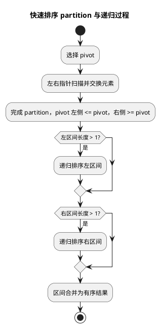

# 排序算法

## 问题索引

- Q1：说一下常见排序算法

## Q1：说一下常见排序算法

### 背景

排序算法是数据结构和算法里的基础问题，面试通常不会只问“有哪些排序”，而是追问：

- 时间复杂度和空间复杂度。
- 是否稳定。
- 是否原地排序。
- 什么场景选什么算法。
- 快排为什么平均快、最坏为什么退化。
- 归并排序为什么稳定但需要额外空间。
- 堆排序为什么适合 Top K。

### 核心对比

| 算法 | 平均时间 | 最坏时间 | 空间复杂度 | 稳定性 | 典型特点 |
| --- | --- | --- | --- | --- | --- |
| 冒泡排序 | O(n^2) | O(n^2) | O(1) | 稳定 | 简单，基本不用在生产排序 |
| 选择排序 | O(n^2) | O(n^2) | O(1) | 不稳定 | 交换次数少，但不稳定 |
| 插入排序 | O(n^2) | O(n^2) | O(1) | 稳定 | 小数组或近乎有序时效果好 |
| 希尔排序 | 取决于 gap | 取决于 gap | O(1) | 不稳定 | 插入排序改进版 |
| 快速排序 | O(n log n) | O(n^2) | O(log n) | 不稳定 | 平均性能好，工程常用 |
| 归并排序 | O(n log n) | O(n log n) | O(n) | 稳定 | 稳定排序，适合链表和外部排序 |
| 堆排序 | O(n log n) | O(n log n) | O(1) | 不稳定 | 原地排序，适合 Top K 思想 |
| 计数排序 | O(n + k) | O(n + k) | O(k) | 可稳定 | 适合整数且范围不大 |
| 桶排序 | 近似 O(n) | O(n^2) | O(n + k) | 取决于桶内排序 | 适合数据均匀分布 |
| 基数排序 | O(d * (n + k)) | O(d * (n + k)) | O(n + k) | 稳定 | 适合定长整数、字符串 |

### 稳定性是什么

稳定排序指：如果两个元素的排序关键字相等，排序后它们的相对顺序不变。

例如：

```text
排序前：
张三 90，李四 90，王五 80

按分数升序排序后，如果张三仍然在李四前面，就是稳定排序。
```

稳定性在多字段排序中很重要。

例如先按创建时间排序，再按状态排序，如果第二次排序稳定，就能保留同状态内的创建时间顺序。

### 冒泡排序

冒泡排序每轮比较相邻元素，把较大的元素逐步交换到后面。

```java
static void bubbleSort(int[] arr) {
    for (int i = 0; i < arr.length - 1; i++) {
        boolean swapped = false;

        for (int j = 0; j < arr.length - 1 - i; j++) {
            if (arr[j] > arr[j + 1]) {
                // 相邻元素逆序时交换，大元素向右移动。
                int temp = arr[j];
                arr[j] = arr[j + 1];
                arr[j + 1] = temp;
                swapped = true;
            }
        }

        if (!swapped) {
            // 一整轮没有发生交换，说明数组已经有序，可以提前结束。
            break;
        }
    }
}
```

特点：

- 稳定。
- 原地排序。
- 时间复杂度 O(n^2)。
- 主要用于教学，很少用于大数据量生产场景。

### 选择排序

选择排序每轮从未排序区间中选择最小值，放到当前起点位置。

特点：

- 不稳定。
- 原地排序。
- 比较次数固定为 O(n^2)。
- 交换次数少，但整体性能一般。

为什么不稳定：

```text
排序前：[5a, 5b, 1]
第一轮选择最小值 1，与 5a 交换
排序后：[1, 5b, 5a]
5a 和 5b 的相对顺序改变
```

### 插入排序

插入排序把数组分为已排序区间和未排序区间，每次取一个元素插入到已排序区间的合适位置。

特点：

- 稳定。
- 原地排序。
- 平均 O(n^2)。
- 对小数组、近乎有序数组效果很好。

很多高级排序在小分区时会退化成插入排序，因为它常数小、缓存友好。

### 快速排序


### PlantUML 示意图：快速排序分区递归



快速排序使用分治思想：

```text
选择基准值 pivot
  -> 小于 pivot 的放左边
  -> 大于 pivot 的放右边
  -> 对左右区间递归排序
```

代码示例：

```java
static void quickSort(int[] arr, int left, int right) {
    if (left >= right) {
        return;
    }

    int pivotIndex = partition(arr, left, right);

    // 分别递归排序 pivot 左右两部分。
    quickSort(arr, left, pivotIndex - 1);
    quickSort(arr, pivotIndex + 1, right);
}

static int partition(int[] arr, int left, int right) {
    int pivot = arr[right]; // 简化写法：选择最右元素作为基准值。
    int lessEnd = left - 1; // lessEnd 表示小于等于 pivot 区间的右边界。

    for (int i = left; i < right; i++) {
        if (arr[i] <= pivot) {
            lessEnd++;
            swap(arr, lessEnd, i);
        }
    }

    // 把 pivot 放到最终位置：左边都 <= pivot，右边都 > pivot。
    swap(arr, lessEnd + 1, right);
    return lessEnd + 1;
}

static void swap(int[] arr, int i, int j) {
    int temp = arr[i];
    arr[i] = arr[j];
    arr[j] = temp;
}
```

特点：

- 平均 O(n log n)。
- 最坏 O(n^2)。
- 原地排序。
- 不稳定。
- 实际工程中性能很好。

快排最坏情况通常发生在每次基准值都选得极差，例如数组已经有序但总选第一个或最后一个元素作为 pivot。

优化方式：

- 随机选择 pivot。
- 三数取中。
- 小区间切换插入排序。
- 递归深度过深时切换堆排序，这就是内省排序的思想。

### 归并排序

归并排序也是分治思想：

```text
先把数组不断二分
  -> 左半部分排序
  -> 右半部分排序
  -> 合并两个有序数组
```

特点：

- 时间复杂度稳定 O(n log n)。
- 稳定。
- 需要 O(n) 额外空间。
- 适合链表排序和外部排序。

为什么稳定：

合并两个有序数组时，如果左右元素相等，优先取左边元素，就能保留相对顺序。

```java
if (leftValue <= rightValue) {
    // 相等时优先取左侧元素，保证稳定性。
    temp[k++] = leftValue;
} else {
    temp[k++] = rightValue;
}
```

### 堆排序

堆排序基于二叉堆。

升序排序通常使用大顶堆：

```text
1. 建立大顶堆
2. 堆顶是最大值
3. 把堆顶和数组末尾交换
4. 缩小堆范围并重新堆化
5. 重复直到有序
```

特点：

- 时间复杂度 O(n log n)。
- 空间复杂度 O(1)。
- 不稳定。
- 适合理解优先队列和 Top K 问题。

Top K 思路：

- 找最大的 K 个：维护大小为 K 的小顶堆。
- 找最小的 K 个：维护大小为 K 的大顶堆。

### 计数排序

计数排序适合数据范围不大的整数。

例如年龄排序，范围 0 到 120，就可以统计每个年龄出现次数。

特点：

- 时间复杂度 O(n + k)，k 是数据范围。
- 空间复杂度 O(k)。
- 不适合范围极大但数据很少的场景。

### 桶排序

桶排序把数据分到多个桶中，每个桶内部再排序，最后按桶顺序合并。

适用条件：

- 数据分布相对均匀。
- 能设计合理的桶映射函数。

如果数据严重倾斜，大量元素进入同一个桶，性能会退化。

### 基数排序

基数排序按位排序，例如先按个位、十位、百位依次排序。

适合：

- 非负整数。
- 固定位数编号。
- 字符串、手机号、固定长度编码等。

它要求每一轮按位排序是稳定的，否则前面低位排序结果会被破坏。

### Java 中的排序实现

Java 中常见排序 API：

- `Arrays.sort(int[])`：基本类型数组排序，常用 Dual-Pivot QuickSort，不稳定。
- `Arrays.sort(Object[])`：对象数组排序，使用 TimSort，稳定。
- `Collections.sort(List)`：底层也是稳定排序。

为什么基本类型和对象类型不同：

- 基本类型不需要保持对象相对顺序，稳定性意义较小，更关注性能。
- 对象排序常用于业务数据，多字段排序时稳定性更有价值。

### 业务场景

1. 数据量小、近乎有序

   可以考虑插入排序思想，很多库内部也会在小区间使用插入排序优化。

2. 通用内存排序

   快排平均性能好，但要处理最坏情况风险。

3. 需要稳定排序

   优先考虑归并排序、TimSort。

4. Top K

   使用堆，不需要把全部数据排序。

5. 范围有限的整数排序

   使用计数排序，例如年龄、分数、状态码统计排序。

6. 海量数据外部排序

   使用归并思想：先分块排序，再多路归并。

### 踩坑点

1. 快排最坏时间复杂度是 O(n^2)，不是永远 O(n log n)。
2. 稳定排序不是指排序结果稳定不变，而是相等元素相对顺序不变。
3. 堆排序适合 Top K，但全量排序时缓存局部性不如快排。
4. 计数排序只适合范围不大的整数，不适合直接排序任意对象。
5. 多字段排序要关注稳定性，否则可能破坏前一字段排序结果。

### 面试话术

> 常见排序可以分为比较排序和非比较排序。冒泡、选择、插入适合理解基础思想，复杂度通常是 O(n^2)；快排、归并、堆排序是重点，平均或稳定复杂度是 O(n log n)。快排平均性能好、原地排序，但不稳定且最坏会退化到 O(n^2)；归并排序稳定，时间复杂度稳定 O(n log n)，但需要 O(n) 额外空间；堆排序原地且最坏也是 O(n log n)，但不稳定，常用于 Top K 思想。非比较排序包括计数、桶、基数排序，适合特定数据范围或分布，能突破 O(n log n)，但通用性较弱。

## 高频追问

- Q：哪些排序是稳定的？
  A：冒泡、插入、归并、计数排序、基数排序通常可以做到稳定；选择、快排、堆排序通常不稳定。

- Q：快排为什么最坏会退化？
  A：如果每次 pivot 都选到最大或最小值，分区会极度不均衡，递归深度变成 n，总复杂度退化为 O(n^2)。

- Q：为什么归并排序适合外部排序？
  A：因为外部排序常常无法一次把全部数据放入内存，可以先分块排序，再对多个有序文件做多路归并。

- Q：Top K 为什么用堆？
  A：因为不需要全量排序，只维护 K 个候选元素即可，复杂度通常是 O(n log K)。

- Q：Java 对象排序为什么强调稳定性？
  A：对象排序常涉及业务多字段排序，稳定排序能保留相等关键字元素之前的相对顺序。

## 复习清单

- [ ] 能列出常见排序的时间复杂度、空间复杂度和稳定性
- [ ] 能解释稳定排序的业务意义
- [ ] 能手写快排核心 partition
- [ ] 能说明快排退化原因和优化手段
- [ ] 能对比快排、归并、堆排序
- [ ] 能说明 Top K 为什么适合堆
- [ ] 能区分比较排序和非比较排序

