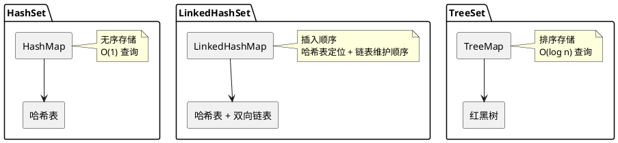
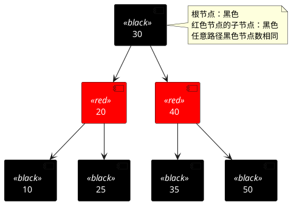

# HashSet、LinkedHashSet、TreeSet 对比

## 问题索引

- Q1：HashSet、LinkedHashSet、TreeSet 的区别和底层实现
- Q2：三种 Set 的性能对比
- Q3：红黑树的特点和应用

## Q1：HashSet、LinkedHashSet、TreeSet 的区别和底层实现

### 背景

Java 提供了三种常用的 Set 实现：HashSet、LinkedHashSet 和 TreeSet。它们都保证元素不重复，但在底层数据结构、元素顺序、性能特征上有明显差异。理解它们的区别有助于在不同场景下做出正确选择。

### 核心原理

#### HashSet

**底层实现**：基于 `HashMap` 实现，元素作为 HashMap 的 key，value 是固定的 `PRESENT` 对象（一个空的 Object）。

```java
public class HashSet<E> extends AbstractSet<E> {
    private transient HashMap<E,Object> map;
    
    // 所有元素的 value 都是这个对象
    private static final Object PRESENT = new Object();
    
    public boolean add(E e) {
        // 将元素作为 key 存入 HashMap，value 固定为 PRESENT
        return map.put(e, PRESENT) == null;
    }
}
```

**特点**：
- 无序：不保证元素的顺序，遍历顺序与插入顺序无关
- 允许 null 元素（最多一个）
- 非线程安全
- 通过元素的 `hashCode()` 和 `equals()` 判断重复

#### LinkedHashSet

**底层实现**：基于 `LinkedHashMap` 实现，继承自 HashSet。LinkedHashMap 在 HashMap 的基础上维护了一个双向链表，记录元素的插入顺序。

```java
public class LinkedHashSet<E> extends HashSet<E> {
    // 构造方法调用父类的特殊构造器，创建 LinkedHashMap
    public LinkedHashSet() {
        super(16, .75f, true); // true 表示创建 LinkedHashMap
    }
}
```

**特点**：
- 有序：按插入顺序维护元素
- 允许 null 元素（最多一个）
- 非线程安全
- 比 HashSet 略慢（需要维护链表），但遍历性能更好（链表遍历比哈希表遍历快）

#### TreeSet

**底层实现**：基于 `TreeMap` 实现（红黑树），元素作为 TreeMap 的 key。

```java
public class TreeSet<E> extends AbstractSet<E> {
    private transient NavigableMap<E,Object> m;
    
    private static final Object PRESENT = new Object();
    
    public TreeSet() {
        // 默认使用自然排序的 TreeMap
        this(new TreeMap<E,Object>());
    }
    
    public boolean add(E e) {
        return m.put(e, PRESENT) == null;
    }
}
```

**特点**：
- 有序：按元素的自然顺序（Comparable）或自定义比较器（Comparator）排序
- 不允许 null 元素（会抛出 NullPointerException，因为需要比较）
- 非线程安全
- 通过 `compareTo()` 或 `compare()` 判断重复（返回 0 表示相等）

### 数据结构对比



## Q2：三种 Set 的性能对比

### 时间复杂度对比

| 操作 | HashSet | LinkedHashSet | TreeSet |
|------|---------|---------------|---------|
| 插入 add() | O(1) | O(1) | O(log n) |
| 查询 contains() | O(1) | O(1) | O(log n) |
| 删除 remove() | O(1) | O(1) | O(log n) |
| 遍历 iterator | O(n) | O(n) | O(n) |

**说明**：
- HashSet 和 LinkedHashSet 的基本操作都是 O(1)，但 LinkedHashSet 需要额外维护链表，常数因子略大
- TreeSet 的基本操作都是 O(log n)，因为需要在红黑树中定位
- 遍历时，LinkedHashSet 最快（链表顺序遍历），HashSet 次之（需要跳过空桶），TreeSet 最慢（需要中序遍历红黑树）

### 空间复杂度对比

- **HashSet**：O(n)，需要额外空间存储哈希表的桶数组和节点
- **LinkedHashSet**：O(n)，比 HashSet 多一个双向链表的指针开销（before、after）
- **TreeSet**：O(n)，红黑树节点需要存储左右子节点、父节点、颜色标记

空间占用：LinkedHashSet > TreeSet > HashSet

### 使用场景

#### HashSet
- 只需要去重，不关心顺序
- 需要高性能的插入、查询、删除
- 例如：判断元素是否存在、去重集合

```java
// 快速去重
Set<String> uniqueIds = new HashSet<>(userList.stream()
    .map(User::getId)
    .collect(Collectors.toList()));
```

#### LinkedHashSet
- 需要保持插入顺序
- 需要去重且遍历顺序重要
- 例如：LRU 缓存、保持用户操作顺序

```java
// 保持用户访问顺序
Set<String> visitedPages = new LinkedHashSet<>();
visitedPages.add("/home");
visitedPages.add("/product");
visitedPages.add("/home"); // 不会重复添加，顺序仍是 /home, /product
```

#### TreeSet
- 需要排序的去重集合
- 需要范围查询（subSet、headSet、tailSet）
- 需要获取最小/最大元素（first、last）
- 例如：排行榜、时间窗口内的唯一事件

```java
// 自动排序的唯一分数集合
TreeSet<Integer> scores = new TreeSet<>();
scores.add(85);
scores.add(92);
scores.add(78);
// 遍历时自动有序：78, 85, 92

// 范围查询：获取 80 到 90 分之间的分数
Set<Integer> rangeScores = scores.subSet(80, true, 90, true);
```

## Q3：红黑树的特点和应用

### 红黑树特点

红黑树是一种自平衡的二叉搜索树，通过对节点着色（红色或黑色）和旋转操作，保证树的高度始终维持在 O(log n)。

#### 五条性质

1. **节点颜色**：每个节点要么是红色，要么是黑色
2. **根节点**：根节点必须是黑色
3. **叶子节点**：所有叶子节点（NIL 节点）都是黑色
4. **红色节点限制**：红色节点的两个子节点必须是黑色（不能有连续的红色节点）
5. **黑色高度一致**：从任意节点到其每个叶子节点的路径上，黑色节点的数量相同

#### 红黑树结构示意



### 红黑树 vs AVL 树

| 特性 | 红黑树 | AVL 树 |
|------|--------|--------|
| 平衡条件 | 较宽松（黑色高度一致） | 严格（左右子树高度差 ≤ 1） |
| 树高度 | ≤ 2log₂(n+1) | ≤ 1.44log₂(n+2) |
| 插入/删除 | 最多 3 次旋转 | 可能多次旋转 |
| 查询性能 | 稍慢 | 稍快 |
| 适用场景 | 插入删除频繁 | 查询频繁 |

**Java 中选择红黑树的原因**：TreeMap/TreeSet 需要频繁的插入和删除操作，红黑树的旋转次数更少，性能更稳定。

### 红黑树的应用

#### Java 集合框架
- **TreeMap**：键按红黑树排序
- **TreeSet**：元素按红黑树排序
- **HashMap**（JDK 1.8+）：当链表长度 ≥ 8 且数组长度 ≥ 64 时，链表转换为红黑树

#### Linux 内核
- **进程调度**：完全公平调度器（CFS）使用红黑树管理进程
- **虚拟内存管理**：vm_area_struct 使用红黑树组织内存区域

#### 数据库
- **MySQL InnoDB**：虽然主要使用 B+ 树，但某些内部索引使用红黑树
- **内存数据库**：Redis 的 ZSet 在某些实现中使用跳表（性能类似红黑树）

### TreeSet/TreeMap 的注意事项

#### 1. 元素必须可比较

```java
// 方式一：实现 Comparable 接口
class Student implements Comparable<Student> {
    private String name;
    private int score;
    
    @Override
    public int compareTo(Student other) {
        // 按分数升序排序
        return Integer.compare(this.score, other.score);
    }
}

TreeSet<Student> students = new TreeSet<>();

// 方式二：提供 Comparator
TreeSet<Student> students = new TreeSet<>((s1, s2) -> 
    s2.score - s1.score  // 按分数降序排序
);
```

#### 2. compareTo 和 equals 一致性

```java
// 错误示例：compareTo 只比较分数，equals 比较所有字段
class Student implements Comparable<Student> {
    private String name;
    private int score;
    
    @Override
    public int compareTo(Student other) {
        return Integer.compare(this.score, other.score);
    }
    
    @Override
    public boolean equals(Object obj) {
        // equals 比较 name 和 score
        Student s = (Student) obj;
        return this.name.equals(s.name) && this.score == s.score;
    }
}

TreeSet<Student> set = new TreeSet<>();
set.add(new Student("张三", 90));
set.add(new Student("李四", 90)); // 不会添加！compareTo 返回 0
```

**建议**：如果 `compareTo()` 返回 0，`equals()` 应该返回 true，保持一致性。

#### 3. null 值处理

```java
TreeSet<String> set = new TreeSet<>();
set.add("a");
set.add(null); // 抛出 NullPointerException

// 解决方法：使用自定义 Comparator 处理 null
TreeSet<String> set = new TreeSet<>((s1, s2) -> {
    if (s1 == null && s2 == null) return 0;
    if (s1 == null) return -1; // null 最小
    if (s2 == null) return 1;
    return s1.compareTo(s2);
});
```

## 面试追问

- **Q：HashMap 的链表什么时候转红黑树？**  
  A：JDK 1.8 开始，当链表长度 ≥ 8 且哈希表容量 ≥ 64 时，链表转红黑树；当红黑树节点 ≤ 6 时，红黑树退化为链表。选择 8 是因为泊松分布下，链表长度达到 8 的概率极低（约 0.00000006），是时间和空间的平衡点。

- **Q：为什么 LinkedHashSet 遍历比 HashSet 快？**  
  A：HashSet 遍历需要扫描整个哈希表数组，包括空桶；LinkedHashSet 维护了双向链表，直接按链表顺序遍历，跳过空桶，遍历效率更高。

- **Q：TreeSet 如何保证线程安全？**  
  A：TreeSet 本身不是线程安全的。可以使用 `Collections.synchronizedSortedSet()` 包装，或使用 `ConcurrentSkipListSet`（基于跳表实现，支持并发）。

- **Q：红黑树的插入和删除为什么比 AVL 树快？**  
  A：红黑树的平衡条件更宽松（黑色高度一致即可），插入和删除时最多 3 次旋转即可恢复平衡；AVL 树要求严格的高度平衡（左右子树高度差 ≤ 1），可能需要多次旋转。红黑树牺牲了一定的查询性能（树高稍高），换取更快的插入删除。

- **Q：能否用 TreeSet 实现 LRU 缓存？**  
  A：不适合。LRU 需要记录访问顺序（最近访问的排在前面），每次访问元素都需要更新其位置。TreeSet 的排序依据是元素的比较结果，更新位置需要先删除再插入，且无法高效追踪访问时间。应使用 LinkedHashMap（访问顺序模式）实现 LRU。

## 复习清单

- [ ] 能说出 HashSet、LinkedHashSet、TreeSet 的底层实现（HashMap、LinkedHashMap、TreeMap）
- [ ] 能画出三种 Set 的数据结构示意图
- [ ] 能对比三种 Set 的时间复杂度和适用场景
- [ ] 能解释红黑树的五条性质和自平衡原理
- [ ] 能说明 TreeSet 的 compareTo 和 equals 一致性问题
- [ ] 能回答 HashMap 链表转红黑树的条件和原因
- [ ] 能选择合适的 Set 实现解决实际问题
