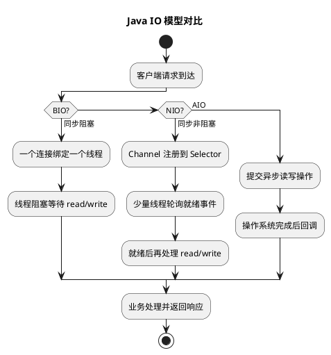

# Java IO 模型详解

## 问题索引

- Q1：Java IO 模型详解

## Q1：Java IO 模型详解


### PlantUML 示意图：BIO / NIO / AIO 处理模型



### 背景

Java IO 模型通常围绕网络 IO 展开，核心不是只背 BIO、NIO、AIO 三个名字，而是要理解：

- 阻塞和非阻塞区别是什么。
- 同步和异步区别是什么。
- BIO、NIO、AIO 分别怎么处理连接和读写。
- select、poll、epoll 解决了什么问题。
- Reactor 模式和 Netty 为什么适合高并发。

### 核心结论

Java 常见 IO 模型可以这样对比：

| 模型 | Java API | 核心特点 | 适合场景 |
|---|---|---|---|
| BIO | `java.io`、`Socket`、`ServerSocket` | 同步阻塞，一个连接通常占一个线程 | 连接少、逻辑简单 |
| NIO | `java.nio`、`Channel`、`Buffer`、`Selector` | 同步非阻塞，一个线程可以管理多个连接 | 高并发网络服务 |
| AIO | `AsynchronousSocketChannel` | 异步非阻塞，完成后回调或 Future | 操作系统支持较好、异步任务 |

一句话：

```text
BIO：线程等 IO。
NIO：线程轮询一批连接，哪个连接就绪就处理哪个。
AIO：线程提交 IO 请求，完成后由系统通知。
```

### 阻塞与非阻塞

阻塞和非阻塞关注的是：调用 IO 操作时，如果数据没准备好，当前线程会不会卡住。

阻塞 IO：

```text
调用 read()
  -> 没有数据
  -> 当前线程阻塞等待
  -> 数据到了再返回
```

非阻塞 IO：

```text
调用 read()
  -> 没有数据
  -> 立即返回
  -> 线程可以去处理别的连接
```

所以阻塞/非阻塞描述的是调用方线程的等待方式。

### 同步与异步

同步和异步关注的是：IO 完成这件事由谁来负责等待和推进。

同步 IO：

- 应用线程自己发起 IO。
- 应用线程自己判断 IO 是否完成。
- BIO 和 NIO 都属于同步 IO。

异步 IO：

- 应用线程提交 IO 请求。
- 操作系统或底层机制完成 IO 后通知应用。
- 应用通过回调或 Future 获取结果。

所以 NIO 虽然是非阻塞，但它仍然是同步 IO，因为还是应用线程通过 Selector 轮询就绪事件，然后自己调用 `read` / `write`。

### BIO 模型

BIO 是 Blocking IO，同步阻塞 IO。

典型模型：

```text
主线程 accept 阻塞等待连接
  -> 来一个连接
  -> 创建一个线程处理该连接
  -> 该线程 read 阻塞等待数据
```

示例：

```java
import java.io.InputStream;
import java.net.ServerSocket;
import java.net.Socket;

public class BioServerDemo {
    public static void main(String[] args) throws Exception {
        ServerSocket serverSocket = new ServerSocket(8080);

        while (true) {
            // accept 会阻塞，直到有客户端连接进来
            Socket socket = serverSocket.accept();

            // 每个连接交给一个线程处理，连接多时线程数会膨胀
            new Thread(() -> handle(socket)).start();
        }
    }

    private static void handle(Socket socket) {
        try (InputStream inputStream = socket.getInputStream()) {
            byte[] buffer = new byte[1024];

            while (true) {
                // read 会阻塞，直到有数据、连接关闭或异常
                int len = inputStream.read(buffer);
                if (len == -1) {
                    break;
                }
                System.out.println(new String(buffer, 0, len));
            }
        } catch (Exception e) {
            e.printStackTrace();
        }
    }
}
```

BIO 的优点：

- 编程简单。
- 逻辑直观。
- 适合连接数少、并发低的场景。

BIO 的问题：

- 一个连接通常占一个线程。
- 线程阻塞时仍然占用资源。
- 高并发下线程数暴涨，导致上下文切换、内存占用、调度压力变大。

### NIO 模型

NIO 是同步非阻塞 IO。

核心组件：

- `Channel`：连接通道，类似传统 IO 的流，但可以非阻塞。
- `Buffer`：读写数据的缓冲区。
- `Selector`：多路复用器，一个线程监听多个 Channel 的就绪事件。

典型流程：

```text
ServerSocketChannel 注册到 Selector
  -> Selector 监听 accept/read/write 事件
  -> 某些 Channel 就绪
  -> 线程处理就绪事件
  -> 没就绪的连接不阻塞线程
```

NIO 的关键是：线程不是阻塞在某一个连接上，而是阻塞在 Selector 上，等待一批连接中哪些已经就绪。

### NIO 示例

```java
import java.net.InetSocketAddress;
import java.nio.ByteBuffer;
import java.nio.channels.SelectionKey;
import java.nio.channels.Selector;
import java.nio.channels.ServerSocketChannel;
import java.nio.channels.SocketChannel;
import java.util.Iterator;

public class NioServerDemo {
    public static void main(String[] args) throws Exception {
        Selector selector = Selector.open();

        ServerSocketChannel serverChannel = ServerSocketChannel.open();
        serverChannel.bind(new InetSocketAddress(8080));

        // 设置为非阻塞，否则无法配合 Selector 使用
        serverChannel.configureBlocking(false);

        // 注册 accept 事件，表示关注新连接到来
        serverChannel.register(selector, SelectionKey.OP_ACCEPT);

        while (true) {
            // select 会阻塞，直到有已注册事件就绪
            selector.select();

            Iterator<SelectionKey> iterator = selector.selectedKeys().iterator();
            while (iterator.hasNext()) {
                SelectionKey key = iterator.next();

                // 移除已处理 key，避免下次循环重复处理
                iterator.remove();

                if (key.isAcceptable()) {
                    ServerSocketChannel server = (ServerSocketChannel) key.channel();
                    SocketChannel client = server.accept();
                    client.configureBlocking(false);

                    // 新连接注册 read 事件，后续有数据可读时再处理
                    client.register(selector, SelectionKey.OP_READ);
                } else if (key.isReadable()) {
                    SocketChannel client = (SocketChannel) key.channel();
                    ByteBuffer buffer = ByteBuffer.allocate(1024);

                    // 非阻塞 read，没有数据时不会一直卡住线程
                    int len = client.read(buffer);
                    if (len == -1) {
                        client.close();
                        continue;
                    }

                    buffer.flip();
                    byte[] data = new byte[buffer.remaining()];
                    buffer.get(data);
                    System.out.println(new String(data));
                }
            }
        }
    }
}
```

NIO 的优点：

- 一个线程可以管理多个连接。
- 适合高并发连接。
- 避免大量线程阻塞。

NIO 的问题：

- 编程复杂。
- 需要处理半包、粘包、缓冲区状态。
- Selector 空轮询、事件处理不当会导致 CPU 异常。
- 业务逻辑不能在 IO 线程里长时间阻塞。

### AIO 模型

AIO 是 Asynchronous IO，异步非阻塞 IO。

典型流程：

```text
应用提交 read 请求
  -> 当前线程返回
  -> IO 完成后系统回调 CompletionHandler
```

示例：

```java
import java.net.InetSocketAddress;
import java.nio.ByteBuffer;
import java.nio.channels.AsynchronousServerSocketChannel;
import java.nio.channels.AsynchronousSocketChannel;
import java.nio.channels.CompletionHandler;

public class AioServerDemo {
    public static void main(String[] args) throws Exception {
        AsynchronousServerSocketChannel server =
                AsynchronousServerSocketChannel.open().bind(new InetSocketAddress(8080));

        // accept 是异步的，连接到来后回调 completed
        server.accept(null, new CompletionHandler<AsynchronousSocketChannel, Void>() {
            @Override
            public void completed(AsynchronousSocketChannel client, Void attachment) {
                // 继续注册下一次 accept，避免只能接收一个连接
                server.accept(null, this);

                ByteBuffer buffer = ByteBuffer.allocate(1024);

                // read 也是异步的，读完成后回调 completed
                client.read(buffer, buffer, new CompletionHandler<Integer, ByteBuffer>() {
                    @Override
                    public void completed(Integer len, ByteBuffer buf) {
                        buf.flip();
                        byte[] data = new byte[buf.remaining()];
                        buf.get(data);
                        System.out.println(new String(data));
                    }

                    @Override
                    public void failed(Throwable exc, ByteBuffer buf) {
                        exc.printStackTrace();
                    }
                });
            }

            @Override
            public void failed(Throwable exc, Void attachment) {
                exc.printStackTrace();
            }
        });

        Thread.currentThread().join();
    }
}
```

AIO 的优点：

- 应用线程不需要主动轮询。
- 编程模型更接近“完成通知”。

AIO 的现实情况：

- 在 Linux 上 Java AIO 的使用并没有 Netty NIO 普遍。
- 高性能网络框架主流仍是 NIO + Reactor。
- 实际项目中更常见 Netty，而不是直接使用 AIO。

### select、poll、epoll

select、poll、epoll 是操作系统层面的 IO 多路复用机制。

它们解决的问题是：一个线程如何同时监听多个 socket。

| 模型 | 特点 | 问题 |
|---|---|---|
| select | 使用固定大小 fd 集合 | fd 数量有限，需要遍历 |
| poll | 使用链表，突破 fd 数量限制 | 仍然需要遍历 |
| epoll | 事件驱动，维护就绪队列 | Linux 高并发场景性能更好 |

Java NIO 的 `Selector` 在不同系统上会使用不同底层实现。Linux 下常见是 epoll。

### Reactor 模式

Reactor 是基于同步非阻塞 IO 的事件驱动模型。

核心思想：

```text
Selector 监听事件
  -> 事件就绪
  -> 分发给对应 Handler
  -> Handler 处理连接、读写、业务逻辑
```

常见模型：

- 单 Reactor 单线程。
- 单 Reactor 多线程。
- 主从 Reactor 多线程。

单 Reactor 单线程：

```text
一个线程负责 accept、read、write、业务处理
```

简单，但业务处理慢会阻塞所有连接。

单 Reactor 多线程：

```text
Reactor 线程负责 IO 事件
业务线程池负责业务处理
```

解决业务阻塞 IO 线程的问题。

主从 Reactor 多线程：

```text
主 Reactor 负责 accept
从 Reactor 负责 read/write
业务线程池负责业务逻辑
```

Netty 常用的 BossGroup / WorkerGroup 就接近这种思想。

### Netty 与 Java NIO

Netty 是对 Java NIO 的高性能封装。

它解决了直接使用 NIO 的复杂问题：

- 连接管理。
- 事件循环。
- 编解码。
- 粘包拆包。
- ByteBuf 内存管理。
- 线程模型。
- 空轮询 bug 规避。
- 心跳、超时、异常处理。

Netty 核心组件：

- `EventLoop`：事件循环线程。
- `EventLoopGroup`：事件循环线程组。
- `Channel`：连接抽象。
- `ChannelPipeline`：处理链。
- `ChannelHandler`：业务处理器。
- `ByteBuf`：高性能缓冲区。

### 粘包和拆包

TCP 是字节流协议，没有消息边界。

所以可能出现：

- 粘包：多条消息一起到达。
- 拆包：一条消息被拆成多次到达。

常见解决方案：

- 固定长度消息。
- 分隔符。
- 消息头记录消息体长度。
- Netty 的 `LengthFieldBasedFrameDecoder`。

这也是为什么使用 NIO/Netty 时要设计协议，而不能假设一次 `read` 就是一条完整消息。

### 零拷贝

零拷贝是减少数据在用户态和内核态之间复制的技术。

常见方式：

- `FileChannel.transferTo`
- `sendfile`
- `mmap`
- Netty `CompositeByteBuf`
- Netty 使用 Direct Buffer 减少拷贝

典型文件传输中，传统方式可能经历：

```text
磁盘 -> 内核缓冲区 -> 用户缓冲区 -> Socket 缓冲区 -> 网卡
```

零拷贝尽量减少用户态参与，降低 CPU 和内存拷贝成本。

### BIO、NIO、AIO 对比

| 维度 | BIO | NIO | AIO |
|---|---|---|---|
| 阻塞性 | 阻塞 | 非阻塞 | 非阻塞 |
| 同步性 | 同步 | 同步 | 异步 |
| 线程模型 | 连接和线程强绑定 | 少量线程管理大量连接 | 提交请求后回调 |
| 编程复杂度 | 低 | 高 | 中到高 |
| 高并发能力 | 弱 | 强 | 理论强 |
| Java 实战热度 | 普通业务少量连接 | Netty 等框架主流 | 相对较少 |

### 业务场景

选择建议：

- 普通文件读写：传统 IO 足够。
- 少量连接、内部工具：BIO 可以接受。
- 高并发长连接、网关、RPC、IM：NIO / Netty。
- 文件传输、大数据拷贝：关注零拷贝。
- 强异步回调模型：可以了解 AIO，但生产更常见 Netty。

项目中常见：

- Spring MVC 默认是 Servlet 线程模型，不等同于 Netty NIO。
- Spring WebFlux / Reactor Netty 使用事件循环模型。
- Dubbo、RocketMQ、Elasticsearch 客户端等大量使用 Netty。
- 网关、RPC、长连接服务常用 Netty。

### 踩坑点

- NIO 的非阻塞不代表业务逻辑不会阻塞。
- 不要在 Netty EventLoop 中执行耗时业务。
- 一次 `read` 不等于一条完整消息。
- Direct Buffer 可能造成堆外内存压力。
- 连接多不等于吞吐一定高，业务处理、序列化、数据库仍可能是瓶颈。
- AIO 不等于一定比 NIO 更快，取决于操作系统和实现。

### 面试话术

> Java IO 模型可以从 BIO、NIO、AIO 三类讲。BIO 是同步阻塞 IO，一个连接通常对应一个线程，编程简单但高并发下线程资源压力很大。NIO 是同步非阻塞 IO，核心是 Channel、Buffer、Selector，一个线程可以监听多个连接的就绪事件，适合高并发网络服务，但编程复杂，需要处理缓冲区、粘包拆包和事件分发。AIO 是异步非阻塞 IO，应用提交请求后由系统完成并回调。实际服务端高并发场景中，主流是基于 NIO 的 Reactor 模式，比如 Netty，用 EventLoop、Pipeline、Handler 封装连接管理、事件循环、编解码和业务处理。

## 高频追问

- Q：NIO 是异步 IO 吗？
  A：不是。NIO 是同步非阻塞 IO。它不阻塞在单个连接上，但仍然需要应用线程通过 Selector 获取就绪事件并自己执行 read / write。

- Q：Selector 的作用是什么？
  A：Selector 用于一个线程监听多个 Channel 的就绪事件，避免一个连接一个线程。

- Q：epoll 比 select 好在哪里？
  A：select 有 fd 数量限制且每次需要遍历；epoll 使用事件驱动和就绪队列，更适合大量连接。

- Q：Netty 为什么不直接一个连接一个线程？
  A：高并发下线程数过多会带来内存和上下文切换成本。Netty 使用 EventLoop 让少量线程管理大量连接。

- Q：为什么不能在 EventLoop 里执行耗时任务？
  A：EventLoop 负责处理多个连接的 IO 事件，如果被业务阻塞，会影响该线程上所有连接的读写。

- Q：TCP 为什么会粘包拆包？
  A：TCP 是字节流协议，没有应用层消息边界。发送端多次写入可能合并到达，一次写入也可能拆成多次到达。

## 复习清单

- [ ] 能区分阻塞/非阻塞、同步/异步
- [ ] 能说明 BIO、NIO、AIO 的核心差异
- [ ] 能解释 Channel、Buffer、Selector 的作用
- [ ] 能说明 select、poll、epoll 的区别
- [ ] 能画出 Reactor 模式基本流程
- [ ] 能解释 Netty 为什么适合高并发网络服务
- [ ] 能说明粘包拆包和零拷贝的基本思路

