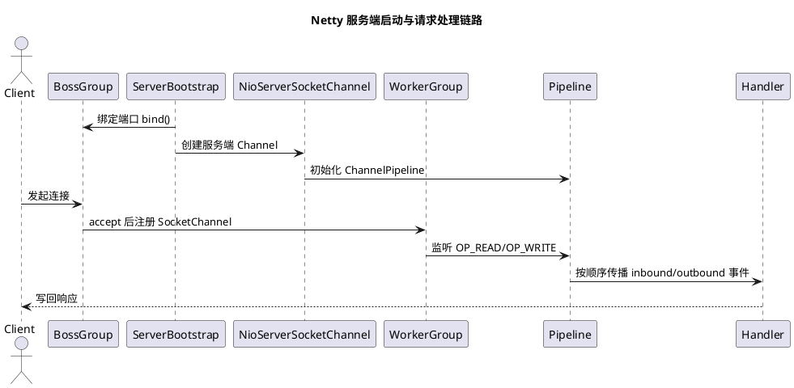

# Netty 核心流程与原理

## 问题索引

- Q1：Netty 核心流程 / 原理详解
- Q2：Netty 为何还要自研一套 Native Epoll？

## Q1：Netty 核心流程 / 原理详解

### 背景

Netty 是基于 Java NIO 的高性能网络通信框架。它把原生 NIO 中复杂的 Selector、Channel、Buffer、线程模型、粘包拆包、编解码、异常处理都封装起来，让开发者更关注协议和业务逻辑。

面试或项目里讲 Netty，最好围绕一条主线：

```text
服务启动
  -> 绑定端口
  -> 接收连接
  -> 注册 Channel
  -> EventLoop 监听 IO 事件
  -> Pipeline 处理入站 / 出站事件
  -> ByteBuf 读写数据
  -> Handler 执行业务逻辑
```

### 核心结论

Netty 的核心原理可以拆成五块：

| 核心组件 | 作用 |
|---|---|
| `EventLoopGroup` | 线程组，负责管理多个 EventLoop |
| `EventLoop` | 单线程事件循环，负责监听和处理 Channel 事件 |
| `Channel` | 对 socket 连接的封装 |
| `ChannelPipeline` | 责任链，管理多个 ChannelHandler |
| `ByteBuf` | Netty 自己实现的高性能缓冲区 |

一句话：

> Netty 用少量 EventLoop 线程管理大量 Channel，通过 Selector 监听 IO 事件，再把事件交给 Pipeline 中的 Handler 链处理。

### 服务端启动流程


### PlantUML 示意图：Netty 服务端启动与请求处理



一个典型 Netty 服务端：

```java
import io.netty.bootstrap.ServerBootstrap;
import io.netty.channel.ChannelInitializer;
import io.netty.channel.ChannelPipeline;
import io.netty.channel.EventLoopGroup;
import io.netty.channel.nio.NioEventLoopGroup;
import io.netty.channel.socket.SocketChannel;
import io.netty.channel.socket.nio.NioServerSocketChannel;

public class NettyServerDemo {
    public static void main(String[] args) throws InterruptedException {
        // bossGroup 负责接收客户端连接
        EventLoopGroup bossGroup = new NioEventLoopGroup(1);

        // workerGroup 负责处理已建立连接的读写事件
        EventLoopGroup workerGroup = new NioEventLoopGroup();

        try {
            ServerBootstrap bootstrap = new ServerBootstrap();
            bootstrap.group(bossGroup, workerGroup)
                    // 指定服务端 Channel 类型，底层基于 Java NIO ServerSocketChannel
                    .channel(NioServerSocketChannel.class)
                    // 给每个新接入的客户端连接初始化 Pipeline
                    .childHandler(new ChannelInitializer<SocketChannel>() {
                        @Override
                        protected void initChannel(SocketChannel ch) {
                            ChannelPipeline pipeline = ch.pipeline();

                            // 按顺序添加处理器，入站事件会从前往后传播
                            pipeline.addLast(new BusinessHandler());
                        }
                    });

            // 绑定端口并同步等待启动完成
            bootstrap.bind(8080).sync();
        } finally {
            // 实际项目里通常在应用关闭钩子中优雅关闭线程组
        }
    }
}
```

启动过程：

```text
创建 bossGroup / workerGroup
  -> 配置 ServerBootstrap
  -> 创建 NioServerSocketChannel
  -> 初始化服务端 Channel
  -> 注册到 boss EventLoop 的 Selector
  -> 绑定端口
  -> 等待客户端连接
```

### BossGroup 和 WorkerGroup

Netty 服务端通常使用主从 Reactor 模型：

```text
BossGroup
  -> 负责 accept 新连接
  -> 把新连接注册给 WorkerGroup

WorkerGroup
  -> 负责 read / write
  -> 执行 Pipeline 中的 Handler
```

BossGroup 不处理具体业务，它只负责接收连接。

WorkerGroup 负责已建立连接的 IO 事件。如果业务 Handler 也在 Worker 线程里执行，那么耗时业务会阻塞该 EventLoop 上的其他连接。

### EventLoop 原理

`EventLoop` 本质是一个单线程事件循环。

它负责：

- 监听 Selector 上的 IO 事件。
- 处理注册到它上面的 Channel。
- 执行普通任务队列。
- 执行定时任务队列。

核心循环可以简化为：

```text
while (true) {
    selector.select();
    processSelectedKeys();
    runAllTasks();
}
```

一个 Channel 一旦注册到某个 EventLoop，后续这个 Channel 的 IO 事件通常都由同一个 EventLoop 线程处理。

这样做的好处：

- 同一个 Channel 的事件串行执行，降低并发锁竞争。
- 线程模型清晰。
- 避免一个连接频繁在线程之间切换。

### Channel 注册流程

客户端连接进来后：

```text
Boss EventLoop 监听到 OP_ACCEPT
  -> accept 得到 SocketChannel
  -> 封装成 NioSocketChannel
  -> 选择一个 Worker EventLoop
  -> 注册到 Worker EventLoop 的 Selector
  -> 初始化该 Channel 的 Pipeline
  -> 开始监听 OP_READ
```

这一步非常关键：Boss 只接连接，Worker 才处理连接后续读写。

### Pipeline 和 Handler

`ChannelPipeline` 是 Netty 的责任链。

每个 Channel 都有自己的 Pipeline，Pipeline 中有多个 Handler。

入站事件：

```text
Socket 读到数据
  -> ByteBuf
  -> ChannelInboundHandler 1
  -> ChannelInboundHandler 2
  -> 业务 Handler
```

出站事件：

```text
业务调用 writeAndFlush
  -> ChannelOutboundHandler N
  -> ChannelOutboundHandler N-1
  -> 编码
  -> 写入 Socket
```

常见 Handler：

- 解码器：把 ByteBuf 转成业务对象。
- 编码器：把业务对象转成 ByteBuf。
- 心跳处理器：处理空闲连接。
- 业务处理器：执行业务逻辑。
- 日志处理器：记录请求和响应。

### 入站和出站

Netty 事件分为入站和出站。

入站是从网络进入应用：

```text
网络 -> Channel -> Pipeline -> 业务 Handler
```

典型事件：

- `channelActive`
- `channelRead`
- `channelReadComplete`
- `exceptionCaught`

出站是从应用写回网络：

```text
业务 Handler -> Pipeline -> Channel -> 网络
```

典型操作：

- `bind`
- `connect`
- `write`
- `flush`
- `close`

### ByteBuf 原理

Netty 没有直接使用 Java NIO 的 `ByteBuffer`，而是实现了 `ByteBuf`。

`ByteBuf` 的核心优势：

- 读写指针分离：`readerIndex` 和 `writerIndex`。
- 支持池化，减少频繁分配。
- 支持堆内和堆外内存。
- 支持引用计数。
- API 比 ByteBuffer 更好用。

读写模型：

```text
0 <= readerIndex <= writerIndex <= capacity

已丢弃区域 | 可读区域 | 可写区域
```

使用注意：

- `ByteBuf` 可能需要手动释放。
- 引用计数不当会内存泄漏。
- 堆外内存泄漏不一定体现在 Java 堆里。

### 请求读取流程

一次读请求大致流程：

```text
客户端发送数据
  -> 操作系统 socket 缓冲区可读
  -> Selector 监听到 OP_READ
  -> EventLoop 处理 read 事件
  -> Channel 从 socket 读取数据到 ByteBuf
  -> 触发 pipeline.fireChannelRead
  -> 解码器处理粘包拆包
  -> 业务 Handler 执行业务逻辑
```

业务 Handler 示例：

```java
import io.netty.channel.ChannelHandlerContext;
import io.netty.channel.SimpleChannelInboundHandler;

public class BusinessHandler extends SimpleChannelInboundHandler<String> {
    @Override
    protected void channelRead0(ChannelHandlerContext ctx, String msg) {
        // 当前方法通常由该 Channel 所属的 EventLoop 线程执行
        // 不要在这里执行长时间阻塞任务，否则会影响同一 EventLoop 上的其他连接
        String response = "server receive: " + msg;

        // 写回响应，出站事件会沿 Pipeline 传播
        ctx.writeAndFlush(response);
    }
}
```

### 响应写出流程

响应写出流程：

```text
业务 Handler 调用 writeAndFlush
  -> 出站 Handler 编码
  -> 业务对象转 ByteBuf
  -> 写入 ChannelOutboundBuffer
  -> EventLoop 监听 OP_WRITE
  -> 数据写入 socket 发送缓冲区
  -> 操作系统发送给客户端
```

`write` 和 `flush` 的区别：

- `write`：写入 Netty 的出站缓冲区。
- `flush`：真正尝试把缓冲区数据刷到 socket。
- `writeAndFlush`：写入并刷新。

### 粘包拆包处理

TCP 是字节流协议，没有消息边界。

Netty 通过解码器解决粘包拆包：

- `FixedLengthFrameDecoder`：固定长度。
- `LineBasedFrameDecoder`：按换行符分隔。
- `DelimiterBasedFrameDecoder`：自定义分隔符。
- `LengthFieldBasedFrameDecoder`：消息头中包含长度字段。

业务协议常用长度字段：

```text
magic | version | length | body
```

读取时先根据 `length` 判断完整包是否到齐，没到齐就继续等待。

### 线程模型和业务线程池

Netty 的 EventLoop 线程应该尽量只做 IO 和轻量处理。

如果业务逻辑耗时，比如：

- 数据库查询。
- 远程 HTTP 调用。
- 大量 CPU 计算。
- 文件读写。

应该扔到业务线程池处理，避免阻塞 EventLoop。

思路：

```text
EventLoop 收到请求
  -> 快速解码
  -> 投递到业务线程池
  -> 业务线程处理完成
  -> 再通过 ctx.writeAndFlush 写回
```

### Netty 为什么高性能

Netty 高性能来自多个方面：

- 基于 NIO 多路复用，一个线程管理多个连接。
- Reactor 线程模型，减少线程数量。
- EventLoop 单线程处理 Channel，减少锁竞争。
- ByteBuf 池化和堆外内存，减少内存分配和拷贝。
- Pipeline 责任链清晰，编解码和业务逻辑解耦。
- 支持零拷贝和高效文件传输。
- 对 Selector 空轮询等问题做了工程化处理。

### 常见业务场景

Netty 常见用于：

- RPC 框架。
- 网关。
- IM 长连接。
- MQ 客户端或 Broker 通信。
- 游戏服务器。
- 自定义 TCP 协议。
- 高性能 HTTP 或 WebSocket 服务。

很多中间件底层也使用 Netty，例如 Dubbo、RocketMQ、部分 Elasticsearch 客户端等。

### 踩坑点

- 不要在 EventLoop 里执行阻塞业务。
- 不要忘记处理粘包拆包。
- ByteBuf 引用计数要正确释放。
- Handler 是否可共享要谨慎，使用 `@Sharable` 前要确认无状态。
- 连接空闲要有心跳和超时机制。
- 出站写入过快要考虑背压和高低水位。
- 堆外内存要监控，避免 Direct Memory OOM。

### 面试话术

> Netty 是基于 Java NIO 的高性能网络框架，核心是 Reactor 线程模型。服务端通常有 BossGroup 和 WorkerGroup，Boss 负责 accept 新连接，Worker 负责已建立连接的 read/write。每个 Channel 会注册到某个 EventLoop，一个 EventLoop 单线程循环处理多个 Channel 的 IO 事件和任务队列。数据读入后会进入 ChannelPipeline，按 Handler 链进行解码、业务处理、编码和写出。Netty 用 ByteBuf 替代 ByteBuffer，支持读写指针分离、池化、堆外内存和引用计数。它适合高并发网络服务，但要注意不要阻塞 EventLoop、正确处理粘包拆包和 ByteBuf 释放。

## Q2：Netty 为何还要自研一套 Native Epoll？

### 背景

Netty 本身可以基于 Java NIO 的 `Selector` 工作，例如常见的 `NioEventLoopGroup` 和 `NioSocketChannel`。在 Linux 上，Java NIO 的 `Selector` 底层通常也会使用 epoll。

那为什么 Netty 还要提供 `netty-transport-native-epoll`，也就是 `EpollEventLoopGroup`、`EpollServerSocketChannel`、`EpollSocketChannel` 这一套 native transport？

核心原因是：**Java NIO 的 Selector 是跨平台抽象，能力和控制粒度比较通用；Netty native epoll 直接通过 JNI 调用 Linux epoll 和 socket 相关能力，可以绕开一部分 JDK 抽象成本，并暴露更多 Linux 专属网络特性。**

### 核心结论

Netty 自研 native epoll 不是因为 Java NIO 不能用，而是为了在 Linux 高并发场景下获得更强的性能、稳定性和系统能力控制。

可以概括为五点：

1. 减少 Java NIO `Selector` 抽象层带来的额外开销。
2. 规避或缓解历史上的 JDK Selector 空轮询等问题。
3. 直接使用 Linux epoll，减少 selector key 集合维护和对象处理成本。
4. 暴露更多 Linux 专属 socket 参数和能力。
5. 更好地配合 Netty 自己的内存、事件循环和边缘触发模型优化。

### Java NIO Selector 的局限

Java NIO 的优点是跨平台，Windows、Linux、macOS 都能通过同一套 `Selector` API 使用。

但跨平台抽象也意味着它只能暴露各个平台的公共能力，不能充分使用 Linux 的一些专属特性。

常见限制包括：

- 需要维护 `SelectionKey`、selected key set 等 Java 层对象。
- 部分 JDK 版本存在 Selector 空轮询问题，导致 EventLoop CPU 飙高。
- 对 epoll 的 LT/ET、部分 socket option 暴露不够直接。
- 对 Linux 文件描述符、事件数组、native 内存的控制粒度不如直接调用 native API。

所以 `NioEventLoopGroup` 是通用方案，`EpollEventLoopGroup` 是 Linux 高性能专项方案。

### Native Epoll 的结构

Netty native epoll 的使用方式大致如下：

```java
EventLoopGroup bossGroup = new EpollEventLoopGroup(1);
EventLoopGroup workerGroup = new EpollEventLoopGroup();

ServerBootstrap bootstrap = new ServerBootstrap();
bootstrap.group(bossGroup, workerGroup)
        // 使用 Linux native epoll 服务端 Channel。
        // 它不走 JDK NIO 的 NioServerSocketChannel，而是走 Netty native transport。
        .channel(EpollServerSocketChannel.class)
        .childHandler(new ChannelInitializer<EpollSocketChannel>() {
            @Override
            protected void initChannel(EpollSocketChannel ch) {
                // Pipeline 仍然是 Netty 的统一编程模型。
                // 底层 transport 从 Java NIO 切换成 native epoll，不影响业务 Handler 写法。
                ch.pipeline().addLast(new BusinessHandler());
            }
        });
```

从编程模型看：

```text
NIO transport:
NioEventLoopGroup -> NioServerSocketChannel -> Java Selector -> JDK epoll 实现

Native epoll transport:
EpollEventLoopGroup -> EpollServerSocketChannel -> JNI -> epoll_create / epoll_ctl / epoll_wait
```

Netty 上层仍然是：

```text
EventLoop -> Channel -> Pipeline -> Handler
```

变化的是底层 IO transport。

### 原因一：减少抽象层开销

Java NIO 的 `Selector` 是 JDK 层统一抽象。它要管理：

- `SelectionKey`。
- interestOps。
- readyOps。
- selectedKeys 集合。
- cancelledKeys 集合。
- Java Channel 与底层 fd 的映射。

Netty native epoll 可以更贴近 Linux 的事件模型，直接管理 fd 和事件数组，减少一些 JDK 层对象和集合处理。

这类优化在少量连接下不一定明显，但在高并发长连接、频繁 IO 事件场景下，会减少一些 CPU 和 GC 压力。

### 原因二：规避 Selector 空轮询问题

历史上部分 JDK 版本或系统条件下，`Selector.select()` 可能在没有事件就绪时异常快速返回，导致 EventLoop 进入空转：

```text
while (true) {
    selector.select();  // 没有事件也立即返回
    processSelectedKeys();
}
```

表现是：

- 某个 EventLoop 线程 CPU 异常升高。
- 业务没有明显流量，但线程持续空转。
- 线程栈经常停留在 Selector 相关逻辑。

Netty 对 Java NIO 做过工程化规避，例如检测连续空轮询并重建 Selector。native epoll 进一步减少对 JDK Selector 实现的依赖，直接使用自己的 epoll 等待和唤醒机制。

### 原因三：支持更多 Linux 专属能力

Native epoll 能暴露更多 Linux socket option 和能力，例如：

| 能力 | 作用 |
| --- | --- |
| `SO_REUSEPORT` | 多个 socket 绑定同一端口，提高多进程/多线程 accept 分摊能力 |
| `TCP_CORK` | 尽量合并小包，适合某些批量写场景 |
| `TCP_FASTOPEN` | 减少 TCP 建连阶段的数据发送延迟 |
| `EPOLLET` | epoll 边缘触发模式 |
| `EPOLLONESHOT` | 一次性事件通知，用于更精细的事件控制 |
| Unix Domain Socket | 本机进程间高效通信 |

Java NIO 的标准 API 为了跨平台，不会完整暴露这些 Linux 专属能力。

所以如果项目强依赖 Linux 部署，并且需要更细的网络调优，native epoll 更有发挥空间。

### 原因四：更贴合 Netty 的事件循环

Netty 的 `EventLoop` 本来就是一套高度定制的事件循环：

```text
等待 IO 事件
  -> 处理 selected keys / epoll events
  -> 执行普通任务队列
  -> 执行定时任务
  -> 处理写出和 flush
```

native epoll 让 Netty 可以更直接地控制：

- epoll 等待时间。
- wakeup 唤醒方式。
- fd 注册和删除。
- 就绪事件数组。
- 边缘触发读写策略。
- native fd 生命周期。

这比完全依赖 JDK `Selector` 更贴合 Netty 自己的线程模型和性能优化。

### 原因五：提升高并发场景稳定性

高并发网络服务里，性能不只是平均耗时，还包括稳定性：

- EventLoop 是否容易空转。
- 大量连接注册和注销是否高效。
- 大量小包写出是否可调优。
- 连接负载是否能更均匀分摊。
- GC 压力是否更可控。

native epoll 通过减少部分 Java 对象和 JDK Selector 依赖，在 Linux 上通常能提供更稳定的尾延迟和更低的 CPU 抖动。

### NIO 与 Native Epoll 如何选择

| 场景 | 建议 |
| --- | --- |
| 跨平台运行 | 使用 Java NIO transport |
| Linux 生产环境，高并发长连接 | 优先考虑 native epoll |
| 普通 HTTP 服务，连接量不大 | NIO 通常足够 |
| RPC、网关、MQ、IM、游戏长连接 | native epoll 更有价值 |
| 需要 Linux 专属 socket option | native epoll |
| 不想引入 native 依赖和平台包 | NIO 更简单 |

需要注意：native epoll 需要引入对应平台依赖，部署环境也必须匹配 Linux 架构，例如 x86_64、aarch64 等。

### native epoll 不是银弹

native epoll 解决的是底层 IO 事件发现和网络能力控制问题。

如果瓶颈在这些地方，它不会自动救场：

- EventLoop 中执行阻塞业务。
- 数据库慢查询。
- 序列化反序列化慢。
- 日志同步刷盘。
- 锁竞争严重。
- 下游服务延迟高。
- ByteBuf 泄漏或堆外内存不足。

所以面试或项目复盘时要说清楚：native epoll 是 IO transport 层优化，不是全链路性能优化的全部。

### 面试话术

可以这样回答：

> Netty 提供 native epoll 不是因为 Java NIO 不能用，而是因为 Java NIO 的 Selector 是跨平台抽象，能力比较通用，存在一定对象管理和抽象层成本，也受 JDK Selector 实现影响。Netty native epoll 通过 JNI 直接调用 Linux 的 epoll_create、epoll_ctl、epoll_wait，可以更直接地管理 fd 和就绪事件，减少部分 SelectionKey 和 selectedKeys 处理开销，也能规避一些历史 Selector 空轮询问题。同时 native epoll 能暴露 Linux 专属能力，比如 SO_REUSEPORT、TCP_CORK、TCP_FASTOPEN、EPOLLET、Unix Domain Socket 等，更适合 Linux 高并发长连接、RPC、网关、MQ、IM 这类场景。不过它不是银弹，如果瓶颈在业务线程阻塞、数据库慢、序列化慢，换成 native epoll 也不会根治。

## 高频追问

- Q：BossGroup 和 WorkerGroup 分别做什么？
  A：BossGroup 负责接收新连接，WorkerGroup 负责已建立连接的读写事件和 Pipeline 处理。

- Q：为什么一个 Channel 通常绑定一个 EventLoop？
  A：这样同一个连接的事件由同一个线程串行处理，减少锁竞争和线程切换。

- Q：Pipeline 是什么设计模式？
  A：典型责任链模式。入站事件从前往后传播，出站事件通常从后往前传播。

- Q：为什么不能在 EventLoop 里执行耗时任务？
  A：一个 EventLoop 管理多个 Channel，如果它被阻塞，该线程上的所有连接读写都会受影响。

- Q：ByteBuf 为什么比 ByteBuffer 好用？
  A：ByteBuf 有独立读写指针，支持池化、堆外内存、引用计数和更友好的 API。

- Q：Netty 如何解决粘包拆包？
  A：通过解码器按协议切分消息，常见有固定长度、分隔符、长度字段等方式，最常用的是 `LengthFieldBasedFrameDecoder`。

## 复习清单

- [ ] 能画出 Netty 服务端启动流程
- [ ] 能解释 BossGroup 和 WorkerGroup 分工
- [ ] 能说明 EventLoop 的事件循环
- [ ] 能说清 Channel、Pipeline、Handler、ByteBuf 的关系
- [ ] 能描述一次请求从 socket 到业务 Handler 的流程
- [ ] 能解释 write 和 flush 的区别
- [ ] 能说明 Netty 高性能原因和常见踩坑点

