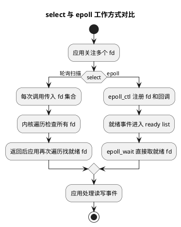

# select 与 epoll 对比

## 问题索引

- Q1：详细对比 select 和 epoll，并说清楚 epoll 的结构
- Q2：epoll 惊群问题

## Q1：详细对比 select 和 epoll，并说清楚 epoll 的结构

### 背景

`select` 和 `epoll` 都是操作系统提供的 IO 多路复用机制，用来解决“一个线程如何同时监听多个 socket”的问题。

在 Java NIO 中，我们通常使用 `Selector`，但它的底层会根据操作系统选择不同实现。在 Linux 高并发网络服务里，常见底层就是 `epoll`。Netty、Redis、Nginx 这类高性能网络组件也大量依赖事件驱动模型。

### 核心结论

`select` 的核心特点是：每次调用都把 fd 集合从用户态传到内核态，内核遍历一遍找就绪 fd，返回后用户态还要再遍历一遍找哪些 fd 就绪。

`epoll` 的核心特点是：先通过 `epoll_ctl` 把 fd 注册到内核维护的数据结构里，后续 `epoll_wait` 只返回已经就绪的事件。它避免了每次重复传递全部 fd，也避免了每次都全量扫描所有 fd。

一句话对比：

```text
select：把一批 fd 交给内核，内核每次帮你扫一遍。
epoll：先把 fd 注册到内核，谁就绪谁自己进就绪队列，epoll_wait 直接取结果。
```

### select 的工作过程


### PlantUML 示意图：select 与 epoll 就绪发现方式



`select` 的典型流程：

```text
1. 应用维护一组 fd，例如 1 万个 socket
2. 调用 select，把 fd_set 从用户态拷贝到内核态
3. 内核遍历 fd_set，逐个检查是否可读、可写或异常
4. 如果没有 fd 就绪，当前线程阻塞
5. 某些 fd 就绪后，select 返回
6. 应用再次遍历 fd_set，找出真正就绪的 fd
7. 对就绪 fd 执行 read/write
```

关键问题：

1. 每次调用都要传入完整 fd 集合。
2. 内核每次都要线性扫描 fd 集合。
3. 返回后用户态还要再次线性扫描。
4. `fd_set` 有大小限制，常见默认是 1024。
5. 连接很多但活跃连接少时，扫描成本很浪费。

### epoll 的工作过程

`epoll` 把“注册 fd”和“等待事件”拆开。

典型流程：

```text
1. epoll_create 创建一个 epoll 实例
2. epoll_ctl 把 socket fd 注册到 epoll 实例
3. 内核为这些 fd 绑定回调，当 fd 就绪时加入就绪队列
4. 应用调用 epoll_wait 等待事件
5. epoll_wait 只返回已经就绪的 fd
6. 应用直接处理这些就绪 fd
```

关键优势：

1. fd 只需要注册一次，后续不用每次重复传递完整集合。
2. 内核不需要每次全量扫描所有 fd。
3. 就绪 fd 会被放入就绪队列，`epoll_wait` 直接取就绪事件。
4. fd 数量上限通常远高于 `select`，主要受系统资源和 `ulimit` 限制。
5. 大量连接、少量活跃的场景下性能优势明显。

### epoll 的核心结构

可以把一个 epoll 实例理解为内核里的一个对象，里面主要维护两类结构：

```text
eventpoll
  -> 红黑树 rbr：保存所有被监听的 fd
  -> 就绪链表 rdllist：保存已经就绪的 fd
  -> 等待队列 wq：保存调用 epoll_wait 后阻塞等待的线程
  -> 回调机制：fd 就绪时触发回调，把对应节点加入 rdllist
```

#### eventpoll

`eventpoll` 是 epoll 实例在内核中的核心对象。应用调用 `epoll_create` 后，内核会创建这个对象。

它大致负责：

- 管理所有被监听的 fd。
- 维护已经就绪的事件。
- 管理阻塞在 `epoll_wait` 上的线程。
- 在 fd 就绪时唤醒等待线程。

#### 红黑树 rbr

红黑树保存所有注册到 epoll 实例中的 fd。

为什么用红黑树：

1. `epoll_ctl(ADD)` 注册 fd 时，要插入一个节点。
2. `epoll_ctl(DEL)` 删除 fd 时，要快速找到节点。
3. `epoll_ctl(MOD)` 修改监听事件时，也要快速定位节点。
4. 红黑树的查找、插入、删除复杂度是 `O(logN)`，适合维护大量 fd。

需要注意：红黑树不是用来保存“就绪事件”的，它保存的是“所有被监听的 fd”。

#### 就绪链表 rdllist

就绪链表保存已经发生事件的 fd。

例如某个 socket 收到数据，内核协议栈发现它可读，就会触发该 fd 对应的回调，把这个 fd 对应的节点加入 `rdllist`。

`epoll_wait` 真正取的主要是这个就绪链表里的事件。

关键点：

1. 没有事件时，`rdllist` 为空，`epoll_wait` 可以阻塞。
2. 有事件时，fd 被加入 `rdllist`，等待线程被唤醒。
3. `epoll_wait` 返回的是就绪队列里的 fd，而不是所有被监听 fd。

#### 等待队列 wq

如果应用调用 `epoll_wait` 时没有事件就绪，当前线程会阻塞，并挂到 epoll 的等待队列上。

当某个 fd 就绪后，内核把事件放入 `rdllist`，然后唤醒等待队列上的线程。

#### 回调机制

这是 epoll 和 select 思路差异最大的地方。

`select` 是调用时主动扫描：

```text
你问内核：这些 fd 里面谁好了？
内核每次都扫一遍回答你。
```

`epoll` 是事件到来时被动通知：

```text
你先告诉内核：这些 fd 我关心。
某个 fd 好了，内核自己把它放入就绪队列。
你调用 epoll_wait 时直接拿结果。
```

所以 epoll 常被说成是事件驱动。

### select 与 epoll 详细对比

| 维度 | select | epoll |
| --- | --- | --- |
| fd 注册方式 | 每次调用都传入 fd 集合 | `epoll_ctl` 注册一次，后续复用 |
| 内核检查方式 | 每次线性扫描所有 fd | fd 就绪时通过回调进入就绪队列 |
| 用户态检查方式 | 返回后还要遍历 fd 集合 | `epoll_wait` 返回的就是就绪事件 |
| fd 数量限制 | 通常受 `FD_SETSIZE` 限制，常见 1024 | 主要受系统资源、文件句柄上限限制 |
| 数据拷贝 | 每次都要拷贝 fd 集合 | 注册时拷贝，等待时只返回就绪事件 |
| 时间复杂度 | 近似 `O(N)` | 活跃事件处理接近 `O(ready)` |
| 适合场景 | fd 少、并发低、兼容性要求高 | 大量连接、少量活跃、高并发 |
| 平台 | 跨平台相对好 | Linux 特有 |

### 为什么 epoll 高并发更强

高并发网络服务常见特点是：

```text
连接数很多，但同一时刻真正有读写事件的连接占比不高。
```

例如 10 万个长连接里，某一瞬间只有 200 个连接有数据。

用 `select`：

```text
每次都扫描 10 万个连接
返回后用户态还要再找哪 200 个就绪
```

用 `epoll`：

```text
10 万个连接提前注册到红黑树
真正有数据的 200 个连接进入就绪链表
epoll_wait 直接返回这 200 个
```

所以 epoll 的优势不是“任何场景都比 select 快”，而是在“大量连接、少量活跃”的场景下，避免了大量无效扫描。

### epoll 的两种触发模式

epoll 支持两种触发模式：

1. LT：Level Trigger，水平触发。
2. ET：Edge Trigger，边缘触发。

#### LT 水平触发

只要 fd 还处于就绪状态，`epoll_wait` 就会持续返回它。

例如 socket 缓冲区里还有数据没读完，下次 `epoll_wait` 还会继续通知。

优点：

- 编程简单。
- 不容易漏事件。
- Java NIO 和大多数默认场景更接近这种思路。

缺点：

- 如果应用没有及时处理完数据，可能反复收到同一个事件。

#### ET 边缘触发

只有 fd 状态发生变化时才通知一次。

例如从“不可读”变成“可读”时通知一次。如果应用没有把数据读完，后续不一定再次通知。

因此 ET 模式通常要求：

1. fd 必须设置为非阻塞。
2. 一次事件到来后，要循环读到 `EAGAIN` 或 `EWOULDBLOCK`。
3. 写事件也要循环写到不能再写。

伪代码：

```java
while (true) {
    // 非阻塞 read：把当前内核缓冲区中能读的数据尽量读完。
    // 如果不读到 EAGAIN，ET 模式下可能不会再次收到通知，导致数据滞留。
    int n = channel.read(buffer);

    if (n > 0) {
        // 读取到了数据，继续循环尝试读取剩余数据。
        handle(buffer);
        buffer.clear();
        continue;
    }

    if (n == 0) {
        // 非阻塞模式下返回 0，表示暂时没有更多数据可读。
        break;
    }

    if (n == -1) {
        // 对端关闭连接，需要释放 Channel 和注册事件。
        channel.close();
        break;
    }
}
```

### epoll 是否完全没有扫描

严格说，epoll 不是完全没有遍历。

它仍然需要：

1. 在 `epoll_ctl` 时维护红黑树。
2. 在 `epoll_wait` 返回时，从就绪链表拷贝事件到用户态数组。
3. 应用处理返回的就绪事件数组。

但它避免了 `select` 那种每次都对全部 fd 做线性扫描的模式。它处理的是已经就绪的事件集合，而不是全部监听集合。

### select、poll、epoll 的补充对比

`poll` 可以看作对 `select` 的一个改进：

- `select` 使用固定大小的 bitset，fd 数量有明显上限。
- `poll` 使用 `pollfd` 数组，突破了固定 `FD_SETSIZE` 限制。
- 但 `poll` 仍然需要每次传入完整 fd 数组，内核仍然要线性扫描。

所以三者可以这样记：

```text
select：固定集合，有数量限制，线性扫描。
poll：动态数组，突破数量限制，但仍然线性扫描。
epoll：内核维护监听集合，就绪事件进队列，避免全量扫描。
```

### 业务场景

在项目里可以这样关联：

1. Netty 的 `EventLoop` 本质是事件循环线程，底层在 Linux 上常借助 epoll 等多路复用机制等待 IO 事件。
2. 高并发网关、RPC、MQ 客户端、长连接服务适合 epoll 模型，因为连接数多但同时活跃连接有限。
3. 如果 EventLoop 里执行业务慢逻辑，即使 epoll 能快速发现就绪事件，应用层也会被业务处理拖慢。
4. epoll 解决的是“如何高效发现 IO 就绪”，不解决“业务处理慢、数据库慢、序列化慢”这些问题。

### 踩坑点

#### epoll 不等于业务一定高性能

epoll 只优化 IO 就绪事件发现。如果业务线程池、数据库、缓存、序列化、锁竞争是瓶颈，使用 epoll 也不会自动变快。

#### ET 模式容易漏读

ET 模式下必须使用非阻塞 IO，并尽量一次读到 `EAGAIN`。否则缓冲区里有残留数据，但状态没有新的边沿变化，就可能不再通知。

#### 写事件不要长期关注

socket 大多数时候都是可写的。如果一直注册写事件，可能导致事件循环不断收到可写通知。一般只在有待发送数据且上次没写完时关注写事件。

#### 惊群问题

早期多线程或多进程同时等待同一个 fd 时，事件到来可能唤醒多个等待者，但最终只有一个能处理，造成无效唤醒。新版内核通过一些机制缓解，比如 `EPOLLEXCLUSIVE`。

## Q2：epoll 惊群问题

### 背景

惊群问题指的是：**一个事件本来只需要一个线程或进程处理，但内核却唤醒了多个等待者，最后只有一个抢到资源，其余线程或进程被白白唤醒，又发现无事可做，只能再次睡眠。**

放到网络 IO 里，典型场景是：

```text
多个线程 / 多个进程同时等待同一个监听 socket
  -> 一个新连接到来
  -> 多个等待者被唤醒
  -> 只有一个 accept 成功
  -> 其他等待者 accept 返回 EAGAIN 或发现没有连接
  -> 这些等待者再次进入等待
```

这个过程会带来无效唤醒、上下文切换、锁竞争和 CPU 浪费。

### 核心结论

epoll 惊群主要不是指“一个 epoll 实例里有很多 fd 就绪”，而是指**多个等待者竞争同一个事件源**。

常见有三类：

1. 多进程或多线程同时 `accept` 同一个监听 socket。
2. 多个线程同时 `epoll_wait` 同一个 epoll 实例。
3. 多个 epoll 实例都监听同一个 fd，事件到来后多个 epoll 都被唤醒。

Linux 内核和应用框架对惊群做过多轮优化，所以现代系统里惊群问题比早期少很多，但在高并发服务器设计里仍然需要理解。

### 场景一：accept 惊群

早期服务端常见模型：

```text
master 创建 listen fd
fork 多个 worker 进程
多个 worker 都阻塞在 accept(listenFd)
```

当一个新连接到来时，如果多个 worker 都被唤醒，就会发生：

```text
worker-1 accept 成功
worker-2 被唤醒，但 accept 失败
worker-3 被唤醒，但 accept 失败
worker-4 被唤醒，但 accept 失败
```

问题：

- 多个进程被无效唤醒。
- 多次上下文切换。
- 多个进程竞争同一个监听队列。
- 高并发短连接下浪费明显。

现代 Linux 对阻塞 `accept` 已经做过优化，通常只唤醒一个等待者，accept 惊群已经明显缓解。

### 场景二：epoll_wait 惊群

如果多个线程共享同一个 epoll 实例，并且同时调用：

```text
epoll_wait(epfd, ...)
```

当某个 fd 就绪时，多个线程可能被唤醒。尤其在 LT 水平触发场景下，如果事件状态一直满足，多个等待线程都可能观察到同一个就绪事件。

这会导致：

1. 多个线程争抢同一个 fd 的读写处理。
2. 需要额外同步保护业务状态。
3. 事件处理顺序更复杂。
4. CPU 被无效唤醒消耗。

所以像 Netty 这类框架通常采用：

```text
一个 Channel 绑定一个 EventLoop
一个 EventLoop 单线程处理自己负责的 Channel
```

这样可以避免多个线程同时处理同一个连接的 IO 事件。

### 场景三：多个 epoll 实例监听同一个 fd

还有一种更容易和 `EPOLLEXCLUSIVE` 关联的场景：

```text
epoll 实例 A 监听 listenFd
epoll 实例 B 监听 listenFd
epoll 实例 C 监听 listenFd
```

当 `listenFd` 上有新连接时，如果所有 epoll 实例都被唤醒，就会出现多个 worker 被唤醒但只有一个 accept 成功的问题。

这类问题在多进程网络服务器里很常见。

### EPOLLEXCLUSIVE 的作用

Linux 4.5 引入了 `EPOLLEXCLUSIVE`，用于缓解多个 epoll 实例监听同一个 fd 时的惊群。

使用方式是在 `epoll_ctl(ADD)` 注册监听 fd 时带上 `EPOLLEXCLUSIVE`。

它的核心语义是：

```text
当目标 fd 就绪时，只唤醒部分等待者，通常至少唤醒一个，而不是唤醒所有监听该 fd 的 epoll 实例。
```

注意点：

1. `EPOLLEXCLUSIVE` 主要缓解多个 epoll 实例监听同一个 fd 的惊群。
2. 它不是为了让一个 epoll 实例里的所有事件只返回一个。
3. 它常用于多线程或多进程 accept 同一个监听 socket 的场景。
4. 它不能和所有 epoll flag 随意组合，使用时要看内核约束。

### SO_REUSEPORT 的作用

`SO_REUSEPORT` 是另一个常见方案。

它允许多个 socket 绑定同一个 IP 和端口：

```text
worker-1 拥有 listenFd-1，绑定 8080
worker-2 拥有 listenFd-2，绑定 8080
worker-3 拥有 listenFd-3，绑定 8080
```

内核会把新连接分发到不同监听 socket 上。

和多个 worker 共享同一个 listen fd 相比，`SO_REUSEPORT` 的好处是：

1. 每个 worker 有自己的监听 socket。
2. 内核可以做连接负载分发。
3. 减少多个 worker 竞争同一个 accept 队列。
4. 多核场景下扩展性更好。

### EPOLLEXCLUSIVE 与 SO_REUSEPORT 对比

| 机制 | 解决思路 | 适合场景 |
| --- | --- | --- |
| `EPOLLEXCLUSIVE` | 同一个 fd 被多个 epoll 监听时，减少一次事件唤醒太多等待者 | 多个 epoll 实例监听同一个 listen fd |
| `SO_REUSEPORT` | 多个 worker 各自拥有 listen fd，由内核分发新连接 | 多进程 / 多线程网络服务器负载分摊 |

简单记：

```text
EPOLLEXCLUSIVE：少唤醒。
SO_REUSEPORT：分散监听队列和连接入口。
```

### Netty 与惊群

Netty 的线程模型天然规避了很多同 fd 多线程竞争问题：

```text
BossGroup 负责 accept
WorkerGroup 负责 read/write
一个 Channel 注册到一个 EventLoop
同一个 Channel 的 IO 事件由同一个 EventLoop 串行处理
```

这样设计的好处是：

- 同一个连接不会被多个线程同时读写。
- 减少锁竞争。
- 避免同一个 Channel 的事件处理乱序。
- 降低 epoll_wait 惊群类问题在业务层的影响。

如果使用 native epoll transport，还可以结合 Linux 的 `SO_REUSEPORT` 等能力做更细粒度调优。

### 业务场景

如果你在做高并发网关、RPC Server、IM 长连接服务，遇到这些现象时要想到惊群或事件分发问题：

1. 连接建立很频繁，但 CPU sys 占比高。
2. 多个 worker 被频繁唤醒，但 accept 成功数不均衡。
3. 线程上下文切换非常多。
4. 多线程同时处理同一类 IO 事件，需要大量锁保护。
5. 短连接压测下吞吐上不去，但业务逻辑并不重。

排查方向：

- 看线程模型是否多个线程等待同一个 listen fd。
- 看是否启用 `SO_REUSEPORT`。
- 看内核版本是否支持 `EPOLLEXCLUSIVE`。
- 看框架是否一个连接绑定一个固定事件循环线程。
- 看 accept 线程数量是否过多。

### 踩坑点

#### 不是所有唤醒多个线程都叫严重惊群

如果一次确实有多个连接或多个 fd 就绪，唤醒多个线程处理是合理的。惊群强调的是“一个资源只够一个处理者消费，却唤醒了一群等待者”。

#### EPOLLEXCLUSIVE 不是万能开关

它主要解决多个 epoll 实例监听同一个 fd 的唤醒问题，不能替代合理线程模型，也不能解决业务线程阻塞。

#### SO_REUSEPORT 要关注负载均衡效果

`SO_REUSEPORT` 让多个 socket 绑定同一端口，但实际分发效果受内核策略、连接四元组、进程数量等影响。压测时要观察各 worker 的连接数和处理量是否均衡。

### 面试话术

可以这样回答：

> epoll 惊群指的是多个线程或进程等待同一个事件源，一个事件到来时多个等待者被唤醒，但最终只有一个能处理成功，其余都是无效唤醒。典型场景是多个 worker 同时 accept 同一个监听 socket，或者多个 epoll 实例监听同一个 fd。惊群会导致上下文切换、CPU 浪费和锁竞争。现代 Linux 对阻塞 accept 已经做了优化，另外可以用 `EPOLLEXCLUSIVE` 减少多个 epoll 实例监听同一 fd 时的无效唤醒，也可以用 `SO_REUSEPORT` 让多个 worker 各自拥有 listen socket，由内核分发连接。像 Netty 这类框架通过 Boss/Worker 和一个 Channel 绑定一个 EventLoop 的模型，也减少了同一个连接被多个线程同时处理的问题。

### 面试话术

可以这样回答：

> select 和 epoll 都是 IO 多路复用机制。select 每次调用都需要把 fd 集合传给内核，内核线性扫描所有 fd，返回后用户态还要再遍历一遍找就绪 fd，而且 fd 集合通常有大小限制。epoll 把注册和等待拆开，先通过 epoll_ctl 把 fd 注册到内核，内核用红黑树维护所有监听 fd；当某个 fd 就绪时，通过回调把它加入就绪链表，epoll_wait 只返回就绪链表中的事件。所以 epoll 在大量连接、少量活跃的场景下比 select 更适合高并发。epoll 的核心结构可以概括为：红黑树保存监听集合，就绪链表保存已就绪事件，等待队列保存阻塞在 epoll_wait 上的线程，再配合 fd 就绪回调完成事件驱动。

## 高频追问

- Q：epoll 为什么比 select 快？
  A：主要因为 epoll 避免了每次重复传递全部 fd 集合，也避免每次全量扫描所有 fd。就绪 fd 会通过回调进入就绪队列，`epoll_wait` 直接返回就绪事件。

- Q：epoll 的红黑树保存的是什么？
  A：保存的是所有被监听的 fd 节点，便于 `epoll_ctl` 新增、删除、修改监听事件。就绪事件不是放在红黑树里，而是放在就绪链表里。

- Q：epoll 的就绪链表保存的是什么？
  A：保存已经发生事件的 fd。某个 socket 可读或可写时，内核回调会把对应节点加入就绪链表，`epoll_wait` 从这里取事件返回给用户态。

- Q：epoll 是不是完全 O(1)？
  A：不严谨。`epoll_ctl` 维护红黑树是 `O(logN)`，`epoll_wait` 返回就绪事件也要遍历就绪集合。更准确地说，它避免了每次对全部 fd 做 `O(N)` 扫描，处理成本更接近就绪事件数量。

- Q：ET 和 LT 有什么区别？
  A：LT 只要状态满足就持续通知，编程简单；ET 只有状态变化时通知一次，性能更好但更容易漏事件，必须配合非阻塞 IO 并读写到 `EAGAIN`。

- Q：为什么 ET 模式必须非阻塞？
  A：因为 ET 模式要求一次事件中尽量读完或写完。如果使用阻塞 IO，循环读写可能卡住事件循环线程，影响其他连接。

- Q：Java NIO 的 Selector 和 epoll 是什么关系？
  A：`Selector` 是 Java 层抽象。不同操作系统有不同底层实现，在 Linux 上常见实现会使用 epoll。

## 复习清单

- [ ] 能说清 select 的两次遍历和 fd 集合拷贝问题
- [ ] 能画出 epoll 的红黑树、就绪链表、等待队列结构
- [ ] 能解释 `epoll_create`、`epoll_ctl`、`epoll_wait` 各自作用
- [ ] 能区分红黑树保存监听 fd、就绪链表保存就绪事件
- [ ] 能说明 LT 和 ET 的区别，以及 ET 为什么要读到 `EAGAIN`
- [ ] 能把 epoll 和 Java NIO、Netty EventLoop 联系起来

