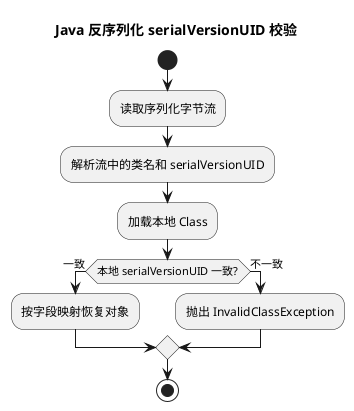

# Java 序列化与 serialVersionUID

## 问题索引

- Q1：为什么需要显式指定 serialVersionUID？

## Q1：为什么需要显式指定 serialVersionUID？


### PlantUML 示意图：serialVersionUID 兼容校验



### 背景

`serialVersionUID` 是 Java 原生序列化机制用来判断“字节流中的类版本”和“当前 JVM 中的类版本”是否兼容的版本号。

只要一个类实现了 `Serializable`，它就具备被 `ObjectOutputStream` 写成二进制流、再通过 `ObjectInputStream` 反序列化回对象的能力。

问题在于：对象被序列化后，类代码可能发生变化。例如：

- 新增字段。
- 删除字段。
- 修改字段类型。
- 修改方法、构造器、访问修饰符。
- 不同服务之间使用了不同版本的 jar 包。

如果没有显式指定 `serialVersionUID`，JVM 会根据类结构自动计算一个默认值。类结构稍微变化，默认值就可能变化，导致老数据反序列化时报错。

### 核心原理

反序列化时，JVM 会比较两个值：

1. 字节流里保存的 `serialVersionUID`。
2. 当前本地类的 `serialVersionUID`。

如果两个值不一致，会抛出：

```text
java.io.InvalidClassException:
local class incompatible:
stream classdesc serialVersionUID = xxx,
local class serialVersionUID = yyy
```

也就是说，`serialVersionUID` 不是用来控制对象字段值的，而是用来判断“这个序列化数据能不能交给当前类来解析”。

### 为什么要显式指定

#### 1. 避免类结构小改动导致反序列化失败

如果不写 `serialVersionUID`，JVM 会根据类名、字段、方法、修饰符等信息自动计算。这个计算结果对类结构比较敏感。

例如你只是新增了一个字段：

```java
public class User implements Serializable {
    private String name;
}
```

修改为：

```java
public class User implements Serializable {
    private String name;
    private Integer age;
}
```

如果没有显式指定 `serialVersionUID`，默认值可能变化，老版本序列化出来的数据在新版本类里反序列化时就可能失败。

如果显式指定：

```java
public class User implements Serializable {
    // 显式指定序列化版本号，表示当前类仍然愿意兼容旧版本序列化数据
    private static final long serialVersionUID = 1L;

    private String name;

    // 新增字段反序列化旧数据时会得到默认值 null，不会因为类结构变化直接失败
    private Integer age;
}
```

只要保持 `serialVersionUID = 1L` 不变，JVM 就会认为新旧类版本兼容。旧数据没有 `age` 字段，反序列化后 `age` 为默认值 `null`。

#### 2. 明确表达版本兼容策略

显式指定 `serialVersionUID` 相当于告诉 JVM 和维护者：

- 这个类的序列化格式我有意识地维护。
- 这次类变更是否兼容旧数据，由我决定。
- 如果兼容，就保持原值不变。
- 如果不兼容，就主动修改 `serialVersionUID`，让旧数据反序列化失败。

这比让 JVM 自动计算更可控。

#### 3. 避免不同编译器或构建环境产生差异

默认 `serialVersionUID` 的计算依赖类结构细节。不同编译器、不同 JDK、不同编译参数下，极端情况下可能产生不一致结果。

显式指定后，服务之间、版本之间、构建环境之间都使用同一个版本号，行为更稳定。

### 业务场景

显式指定 `serialVersionUID` 常见于这些场景：

- Java 原生序列化落盘，例如对象缓存文件。
- HTTP Session 钝化和恢复。
- 分布式 Session 复制。
- RPC 框架或老系统使用 Java 原生序列化。
- MQ 消息体、缓存对象、定时任务参数使用 Java 序列化。
- 异常对象、DTO、VO 实现了 `Serializable`。

但在现代系统中，如果使用的是 JSON、Protobuf、Avro、Kryo 等序列化协议，`serialVersionUID` 不一定参与这些协议的兼容判断。它主要服务于 Java 原生序列化。

### 兼容与不兼容变更

#### 通常兼容的变更

在 `serialVersionUID` 不变时，以下变更通常可以兼容：

- 新增字段：旧数据没有该字段，反序列化后为默认值。
- 删除字段：字节流里多出来的字段会被忽略。
- 新增方法：方法一般不影响对象数据恢复。
- 修改方法内部实现：序列化关注对象数据，不关注方法逻辑。

#### 容易不兼容的变更

以下变更即使 `serialVersionUID` 不变，也可能造成业务问题或反序列化异常：

- 修改字段类型，例如 `Integer age` 改成 `String age`。
- 修改类继承结构。
- 修改字段含义，例如 `status` 从数字枚举变成字符串枚举。
- 删除关键字段后业务逻辑无法处理默认值。
- 把非 `transient` 字段改成 `transient`，或反过来。

所以 `serialVersionUID` 只能控制“版本是否允许反序列化”，不能保证业务语义一定兼容。

### 解决方案

#### 推荐写法

```java
import java.io.Serializable;

public class UserDTO implements Serializable {
    // 建议显式指定，避免类结构变化导致 JVM 自动计算出的版本号变化
    private static final long serialVersionUID = 1L;

    private Long id;
    private String name;

    // 新增字段时，如果希望兼容旧序列化数据，保持 serialVersionUID 不变
    private Integer age;
}
```

#### 什么时候修改 serialVersionUID

保持不变：

- 新增非关键字段。
- 删除不再使用的字段。
- 修改方法实现。
- 仍希望兼容老的序列化数据。

主动升级：

- 字段类型变化，旧数据无法正确解释。
- 类语义变化，旧数据继续解析会造成业务错误。
- 安全或数据结构升级后，不希望再接受旧版本序列化数据。

### 踩坑点

#### 1. 不要以为 serialVersionUID 能做数据迁移

它只是版本兼容判断，不负责字段转换。如果老字段 `status = 1`，新版本希望变成 `status = "PAID"`，需要自己做兼容逻辑。

#### 2. 不要频繁随意修改 serialVersionUID

每次修改都意味着旧数据可能无法反序列化。对于缓存、Session、落盘对象、跨服务传输对象，这可能造成线上兼容问题。

#### 3. 不要误以为 JSON 也依赖 serialVersionUID

Jackson、Fastjson、Gson 这类 JSON 序列化通常按字段名映射，不使用 `serialVersionUID` 判断版本。`serialVersionUID` 主要是 Java 原生序列化机制的概念。

#### 4. 实现 Serializable 的类最好固定下来

如果 DTO 经常变化，又要长期跨服务传输，优先考虑 JSON、Protobuf 等更明确的协议演进方式，而不是依赖 Java 原生序列化。

### 面试追问

- Q：不写 `serialVersionUID` 会怎样？
  A：JVM 会根据类结构自动计算一个默认值。类结构变化后默认值可能变化，导致老版本序列化数据无法被新版本类反序列化。

- Q：`serialVersionUID` 不一致会发生什么？
  A：反序列化时会抛出 `InvalidClassException`，提示 stream class 和 local class 的 `serialVersionUID` 不一致。

- Q：新增字段时要不要改 `serialVersionUID`？
  A：如果希望兼容旧数据，一般不改。旧数据没有这个字段，反序列化后该字段使用默认值，例如对象类型为 `null`，基本类型为 `0` 或 `false`。

- Q：修改字段类型但 `serialVersionUID` 不变可以吗？
  A：不建议。即使绕过版本校验，也可能因为字段类型不匹配或业务语义变化导致异常。字段类型变化通常属于不兼容变更，应考虑升级版本或做迁移。

- Q：`transient` 字段会参与序列化吗？
  A：不会。`transient` 字段不会被默认序列化，反序列化后是默认值。它通常用于密码、临时计算值、连接对象等不应该或不能序列化的字段。

### 复习清单

- [ ] 能说明 `serialVersionUID` 是 Java 原生序列化的版本兼容标识。
- [ ] 能解释不显式指定时 JVM 会自动计算，类结构变化可能导致反序列化失败。
- [ ] 能说清新增字段、删除字段、修改字段类型的兼容性差异。
- [ ] 能回答什么时候保持 `serialVersionUID` 不变，什么时候主动修改。
- [ ] 能区分 Java 原生序列化和 JSON 序列化对 `serialVersionUID` 的依赖差异。

