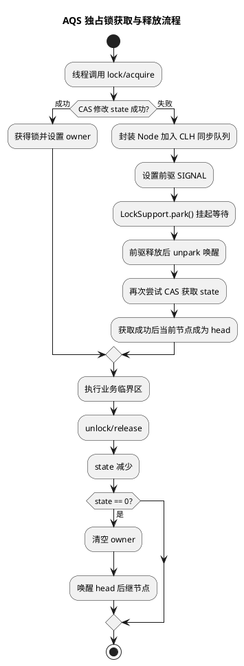

# AQS 同步器

## 问题索引

- Q1：说一下 AQS
- Q2：CLH / Condition 如何实现公平锁和非公平锁？
- Q3：说一下 CLH 结构以及运行过程
- Q4：基于 CLH 的结构，AQS 是怎么实现非公平锁的？
- Q5：非公平锁入队后是否就退化为公平锁？
- Q6：synchronized 为什么不支持公平锁？是否所有线程都自旋 CAS？
- Q7：线程池和 AQS 如何一起理解？

## Q1：说一下 AQS

### 背景

AQS，全称 `AbstractQueuedSynchronizer`，是 JUC 中很多同步器的基础框架。

常见基于 AQS 的组件包括：

- `ReentrantLock`
- `Semaphore`
- `CountDownLatch`
- `ReentrantReadWriteLock`
- `FutureTask` 的部分同步逻辑

AQS 的价值在于：把线程排队、阻塞、唤醒、CAS 修改状态这些通用逻辑抽象出来，让具体同步器只需要关心“如何获取和释放同步状态”。

### 核心原理

AQS 可以概括为：

```text
volatile int state + CAS + CLH FIFO 等待队列
```

### PlantUML 示意图



#### state

AQS 内部维护一个 `volatile int state` 表示同步状态。

不同同步器对 `state` 的解释不同：

- `ReentrantLock`：`state` 表示锁重入次数。
- `Semaphore`：`state` 表示剩余许可证数量。
- `CountDownLatch`：`state` 表示剩余倒计数。
- `ReentrantReadWriteLock`：`state` 的高低位分别表示读锁和写锁状态。

#### CAS

AQS 通过 CAS 修改 `state`。

例如独占锁抢锁时，线程会尝试把 `state` 从 0 CAS 修改为 1：

- 成功：获得锁。
- 失败：说明锁被占用，需要进入等待队列。

#### CLH 等待队列

抢锁失败的线程会被封装成 `Node` 节点，加入 AQS 的 FIFO 等待队列。

队列里的线程通常会通过 `LockSupport.park()` 挂起，等待前驱节点释放同步状态后被唤醒。

### 独占模式

独占模式指同一时刻只有一个线程能获取同步状态。

典型代表：

- `ReentrantLock`
- `synchronized` 思想上也是互斥锁，但它不是基于 AQS 实现

`ReentrantLock` 加锁简化流程：

```text
lock()
  -> tryAcquire()
  -> CAS 修改 state
  -> 成功：当前线程获得锁
  -> 失败：封装 Node 加入等待队列
  -> LockSupport.park() 挂起
  -> 前驱释放锁后唤醒
  -> 再次尝试获取锁
```

释放锁简化流程：

```text
unlock()
  -> tryRelease()
  -> state 减 1
  -> state == 0 时释放成功
  -> 唤醒后继节点
```

### 共享模式

共享模式指同一时刻可以有多个线程获取同步状态。

典型代表：

- `Semaphore`
- `CountDownLatch`
- `ReentrantReadWriteLock` 的读锁

例如 `Semaphore` 中，`state` 表示许可证数量。线程获取许可证时 CAS 减少 `state`，释放许可证时增加 `state`。

### AQS 留给子类实现什么

AQS 使用模板方法模式。

它自己负责：

- 队列维护
- CAS 状态修改封装
- 线程阻塞
- 线程唤醒
- 独占 / 共享获取流程

子类主要实现：

```java
tryAcquire(int arg)
tryRelease(int arg)
tryAcquireShared(int arg)
tryReleaseShared(int arg)
isHeldExclusively()
```

也就是说：

- AQS 负责通用排队调度。
- 子类负责定义 `state` 的获取和释放语义。

### 为什么需要等待队列

如果没有等待队列，所有线程抢不到锁后会不断 CAS 重试，导致 CPU 空转。

AQS 使用队列的好处：

- 抢锁失败的线程有序排队。
- 线程可以被挂起，减少 CPU 空转。
- 当前驱节点释放锁后，再唤醒后继节点。
- 更容易实现公平锁、非公平锁、条件队列等能力。

### Condition 队列

`Condition` 是 AQS 中另一套等待队列机制，配合 `ReentrantLock` 使用。

一个 `Lock` 可以创建多个 `Condition`。

例如：

```java
Condition notEmpty = lock.newCondition();
Condition notFull = lock.newCondition();
```

这比 `Object.wait()` / `notify()` 更灵活，因为可以按不同条件维护不同等待队列。

## Q2：CLH / Condition 如何实现公平锁和非公平锁？

### 先澄清关系

公平锁 / 非公平锁主要由 AQS 的同步队列和获取锁策略决定。

更准确地说：

- CLH 同步队列负责维护抢锁失败线程的排队顺序。
- 公平锁会检查队列里是否已有前驱节点，尊重先来后到。
- 非公平锁允许新线程先 CAS 抢锁，可能插队。
- Condition 是条件等待队列，负责 `await()` / `signal()`，不直接决定锁是否公平。

Condition 被唤醒后，线程不是直接获得锁，而是从 Condition 队列转移到 AQS 同步队列，再重新竞争锁。

### AQS 同步队列如何支持公平锁

公平锁的关键判断是：

```java
hasQueuedPredecessors()
```

它用于判断当前线程前面是否已经有排队线程。

公平锁获取锁的大致逻辑：

```java
protected final boolean tryAcquire(int acquires) {
    Thread current = Thread.currentThread();
    int c = getState();

    if (c == 0) {
        if (!hasQueuedPredecessors()
                && compareAndSetState(0, acquires)) {
            setExclusiveOwnerThread(current);
            return true;
        }
    } else if (current == getExclusiveOwnerThread()) {
        setState(c + acquires);
        return true;
    }

    return false;
}
```

重点是：

```text
!hasQueuedPredecessors() && CAS state
```

如果队列里已经有人排在当前线程前面，即使当前锁刚好空闲，当前线程也不能插队。

### 非公平锁如何插队

非公平锁会先尝试直接 CAS 抢锁，不先检查队列。

非公平锁加锁大致逻辑：

```java
final void lock() {
    if (compareAndSetState(0, 1)) {
        setExclusiveOwnerThread(Thread.currentThread());
    } else {
        acquire(1);
    }
}
```

如果锁刚好释放，新来的线程可以直接 CAS 成功，即使队列中已经有等待线程。

这就是非公平锁的“插队”。

非公平锁吞吐量通常更高，因为减少了线程唤醒和上下文切换，但可能导致等待线程更久。

### 具体示例

假设线程执行顺序如下：

```text
T1 持有锁
T2 获取锁失败，进入 AQS 队列
T3 获取锁失败，进入 AQS 队列
T1 释放锁
T4 此时刚好来抢锁
```

公平锁：

```text
T4 检查 hasQueuedPredecessors()
发现 T2 / T3 已经在队列中
T4 不能插队
T2 先获得锁
```

非公平锁：

```text
T4 先 CAS state
如果 CAS 成功，T4 直接获得锁
T2 / T3 继续等待
```

这就是公平锁和非公平锁的核心区别。

### Condition 的 await / signal 流程

Condition 有自己的条件队列。

调用 `await()` 时：

```text
当前线程必须已经持有锁
  -> 加入 Condition 条件队列
  -> 释放当前持有的锁
  -> 当前线程 park 挂起
```

调用 `signal()` 时：

```text
当前线程必须已经持有锁
  -> 从 Condition 条件队列取出等待最久的节点
  -> 转移到 AQS 同步队列
  -> 被唤醒后重新竞争锁
```

注意：`signal()` 不是让线程直接继续执行，而是把它从 Condition 队列转移到 AQS 同步队列。它还需要重新获得锁。

### Condition 示例：生产者消费者

```java
class BoundedBuffer<T> {
    private final ReentrantLock lock = new ReentrantLock(true); // 公平锁
    private final Condition notEmpty = lock.newCondition();
    private final Condition notFull = lock.newCondition();

    private final Queue<T> queue = new ArrayDeque<>();
    private final int capacity = 10;

    public void put(T item) throws InterruptedException {
        lock.lock();
        try {
            while (queue.size() == capacity) {
                notFull.await();
            }
            queue.add(item);
            notEmpty.signal();
        } finally {
            lock.unlock();
        }
    }

    public T take() throws InterruptedException {
        lock.lock();
        try {
            while (queue.isEmpty()) {
                notEmpty.await();
            }
            T item = queue.poll();
            notFull.signal();
            return item;
        } finally {
            lock.unlock();
        }
    }
}
```

这里有三个队列概念：

- AQS 同步队列：抢锁失败的线程排队。
- `notEmpty` 条件队列：消费者发现队列为空后等待。
- `notFull` 条件队列：生产者发现队列满后等待。

公平性由 `new ReentrantLock(true)` 决定，Condition 只负责区分不同等待条件。

### 综合面试话术

> AQS 的 CLH 同步队列负责维护抢锁失败线程的 FIFO 排队。公平锁会在 CAS 获取锁前调用 `hasQueuedPredecessors()` 判断前面是否有排队线程，如果有就不允许插队；非公平锁会先直接 CAS 抢锁，成功就获得锁，所以吞吐更高但可能让队列中的线程等更久。Condition 不是用来决定公平性的，它是条件等待队列。线程调用 await 后会释放锁并进入 Condition 队列，signal 后只是转移到 AQS 同步队列，后续仍然要按锁的公平或非公平策略重新竞争锁。

## Q3：说一下 CLH 结构以及运行过程

### 核心结论

CLH，全称 Craig, Landin, and Hagersten queue，是一种 FIFO 队列锁思想。

AQS 的同步队列借鉴了 CLH，但它不是传统纯自旋 CLH，而是 CLH 的变体：

- 用 FIFO 双向队列维护等待线程。
- 抢锁失败的线程封装成 `Node` 入队。
- 线程不是一直自旋，而是通过 `LockSupport.park()` 挂起。
- 前驱节点释放锁后，通过 `LockSupport.unpark()` 唤醒后继节点。

### CLH 队列结构

AQS 中每个等待线程会被封装为一个 `Node`。

```java
static final class Node {
    // 前驱节点：当前节点需要观察前驱状态，判断自己是否有资格竞争锁
    volatile Node prev;

    // 后继节点：当前节点释放或取消时，用来找到后面需要唤醒的线程
    volatile Node next;

    // 当前节点绑定的线程；线程被唤醒后会继续尝试获取同步状态
    volatile Thread thread;

    // 等待状态：例如 SIGNAL、CANCELLED、CONDITION
    volatile int waitStatus;
}
```

AQS 同步队列大致如下：

```text
head -> node1 -> node2 -> node3 <- tail
```

- `head`：队列头，通常是哑节点，代表当前已经获得锁或刚释放锁的节点位置。
- `tail`：队列尾，新节点通过 CAS 追加到队尾。
- `prev`：保证节点能找到前驱，用于判断是否轮到自己竞争。
- `next`：用于释放锁时找到后继节点并唤醒。

### 入队过程

当线程获取锁失败时，会进入 AQS 同步队列。

```text
T1 持有锁

T2 抢锁失败
  -> 创建 T2 对应 Node
  -> CAS 把该 Node 设置为 tail
  -> 接到原 tail 后面

T3 抢锁失败
  -> 创建 T3 对应 Node
  -> CAS 追加到 T2 后面
```

队列变成：

```text
head -> T2 -> T3
```

入队关键点：

- 多线程可能同时入队，所以更新 `tail` 必须用 CAS。
- 入队后，节点会记录自己的前驱。
- 只有排在队列前面的线程才有机会被唤醒并竞争锁。

### 等待过程

线程入队后，不是立刻挂起，而是先判断自己是否有资格竞争锁。

核心判断：

```text
如果当前节点的前驱是 head
  -> 当前节点有资格尝试获取锁
如果获取失败
  -> park 挂起

如果当前节点的前驱不是 head
  -> 当前节点还没轮到
  -> park 挂起等待前驱释放后唤醒
```

这能避免所有等待线程同时竞争锁，减少无意义 CAS 和 CPU 消耗。

### 唤醒过程

当持锁线程释放锁时：

```text
释放 state
  -> 找到 head 的后继节点
  -> unpark 后继节点绑定的线程
```

被唤醒的线程会再次尝试获取锁：

```text
如果获取成功
  -> 当前节点成为新的 head
  -> 原 head 出队，帮助 GC
```

流程示意：

```text
释放前：
head -> T2 -> T3

T2 被唤醒并获取锁成功：
head(T2) -> T3
```

### waitStatus 的作用

`waitStatus` 用来描述节点状态。

常见状态：

- `SIGNAL`：当前节点释放或取消时，需要唤醒后继节点。
- `CANCELLED`：节点取消等待，例如超时或中断。
- `CONDITION`：节点在 Condition 条件队列中，还没有进入同步队列竞争锁。

可以简单理解为：

```text
waitStatus 告诉 AQS：这个节点后续应该被唤醒、跳过，还是仍在条件队列里等待。
```

### 为什么 AQS 不用纯自旋 CLH

传统 CLH 锁中，线程通常自旋等待前驱状态变化。

但 Java 应用线程数量可能很多，如果大量线程一直自旋，会浪费 CPU。

AQS 的做法是：

```text
先短暂判断是否能获取锁
  -> 不能获取就进入队列
  -> 设置前驱状态
  -> park 挂起当前线程
  -> 前驱释放后 unpark 唤醒后继
```

所以 AQS 更适合阻塞式同步器，而不是纯自旋锁。

### 面试话术

> AQS 的同步队列是 CLH 的变体。线程获取锁失败后，会被封装成 Node，通过 CAS 追加到队列尾部。队列中每个节点保存 prev、next、thread 和 waitStatus。只有前驱是 head 的节点才有资格尝试获取锁，如果获取失败就通过 LockSupport.park 挂起。当前持锁线程释放锁后，会唤醒 head 的后继节点，后继节点获取锁成功后成为新的 head。AQS 借鉴了 CLH 的 FIFO 排队思想，但没有使用纯自旋，而是结合 park/unpark 降低 CPU 消耗。

## Q4：基于 CLH 的结构，AQS 是怎么实现非公平锁的？

### 核心结论

CLH 队列负责维护等待线程的 FIFO 排队顺序，但非公平锁并不是“完全不排队”。

非公平锁的关键是：**新线程在进入 CLH 队列之前，会先尝试一次直接 CAS 抢锁**。

- 如果 CAS 成功：新线程直接获得锁，即使 CLH 队列里已经有等待线程。
- 如果 CAS 失败：新线程才会进入 CLH 队列，按 AQS 队列规则等待。

所以非公平锁的“不公平”发生在入队之前的抢锁阶段，而不是 CLH 队列内部乱序。

### 非公平锁的加锁入口

`ReentrantLock` 默认是非公平锁。非公平锁的入口逻辑可以简化为：

```java
final void lock() {
    // 非公平锁的关键：不先检查 CLH 队列，先直接 CAS 抢 state
    if (compareAndSetState(0, 1)) {
        // CAS 成功后，当前线程直接成为独占锁持有者
        setExclusiveOwnerThread(Thread.currentThread());
    } else {
        // CAS 失败说明锁被占用，再进入 AQS 的 acquire 流程
        acquire(1);
    }
}
```

这一步没有调用 `hasQueuedPredecessors()`，所以它不会先问：“队列里有没有比我早来的线程？”

这就是新线程可能插队的原因。

### acquire 之后仍然会使用 CLH 队列

如果新线程第一次 CAS 没抢到锁，就会进入 AQS 标准流程：

```text
acquire(1)
  -> tryAcquire(1)
  -> 失败则 addWaiter(Node.EXCLUSIVE)
  -> 节点加入 CLH 队列尾部
  -> acquireQueued()
  -> 前驱是 head 时才有资格再次抢锁
  -> 抢不到则 park 挂起
```

也就是说：

```text
非公平锁 = 入队前允许插队 + 入队后仍按 CLH 队列排队
```

### 具体示例

假设当前情况：

```text
T1 正在持有锁
CLH 队列中已有：head -> T2 -> T3
```

此时 T1 释放锁，刚好 T4 新线程来了。

非公平锁中可能发生：

```text
T1 释放锁，state 变为 0
T4 还没有入队，先执行 compareAndSetState(0, 1)
T4 CAS 成功
T4 直接获得锁
T2 / T3 继续在 CLH 队列里等待
```

队列并没有乱：

```text
head -> T2 -> T3
```

只是 T4 在入队之前抢到了锁，所以看起来像“插队”。

### 和公平锁的对比

公平锁会在 CAS 前检查 CLH 队列：

```java
protected final boolean tryAcquire(int acquires) {
    Thread current = Thread.currentThread();
    int c = getState();

    if (c == 0) {
        // 公平锁关键：先检查当前线程前面是否已经有排队节点
        if (!hasQueuedPredecessors()
                && compareAndSetState(0, acquires)) {
            // 队列中没有前驱，才允许当前线程获取锁
            setExclusiveOwnerThread(current);
            return true;
        }
    }

    // 如果当前线程已经持有锁，则允许重入
    if (current == getExclusiveOwnerThread()) {
        setState(c + acquires);
        return true;
    }

    return false;
}
```

公平锁：

```text
先看 CLH 队列有没有前驱
  -> 没有前驱才 CAS 抢锁
  -> 有前驱就老实排队
```

非公平锁：

```text
先 CAS 抢锁
  -> 抢不到再看队列并排队
```

### 为什么非公平锁吞吐量更高

公平锁严格唤醒队列中的下一个线程，但被唤醒线程从阻塞到真正运行需要线程调度成本。

非公平锁允许刚好正在 CPU 上运行的新线程直接 CAS 抢锁，减少线程切换和唤醒成本。

代价是：

- 队列中的老线程可能等待更久。
- 极端情况下可能出现饥饿。
- 延迟公平性更差，但整体吞吐通常更高。

### 面试话术

> AQS 的 CLH 队列本身仍然是 FIFO 的，非公平锁不是把队列顺序打乱。它的不公平体现在入队之前：新线程调用 lock 时，会先直接 CAS 尝试把 state 从 0 改成 1，如果成功就直接获得锁，不检查 CLH 队列里是否已有等待线程；只有 CAS 失败后，才进入 AQS 的 acquire 流程并加入 CLH 队列。所以非公平锁可以理解为“入队前允许插队，入队后仍按 CLH 队列规则等待”。这能减少线程唤醒和上下文切换，提高吞吐，但可能让队列中的线程等待更久。

## Q5：非公平锁入队后是否就退化为公平锁？

### 核心结论

不能简单说“入队后退化为公平锁”。

更准确的说法是：

> 非公平锁入队后，队列内部仍按 CLH 前驱关系推进；但每次锁释放后的重新竞争阶段，仍然可能被新来的线程通过直接 CAS 插队。

也就是说：

- 已经进入 CLH 队列的线程，内部排队关系基本是 FIFO。
- 队列头后继节点被唤醒后，需要重新 CAS 获取锁。
- 在它真正 CAS 成功之前，新来的线程仍可能先执行非公平入口 CAS 抢到锁。

所以非公平性不只发生在第一次入队前，也可能发生在每次锁释放后的竞争窗口。

### 具体时间线

假设：

```text
T1 持有锁
CLH 队列：head -> T2 -> T3
```

T1 释放锁时：

```text
T1 unlock()
  -> state = 0
  -> unpark(T2)
```

此时 T2 被唤醒，但线程调度需要时间。

如果 T4 刚好来了：

```text
T4 lock()
  -> 非公平入口先 CAS state 0 -> 1
  -> CAS 成功
  -> T4 获得锁
```

T2 虽然是队列中最早等待的线程，但它还没来得及执行 CAS，就被 T4 抢走了锁。

这说明：

```text
CLH 队列内部是 FIFO 推进
但非公平锁允许队列外新线程在竞争窗口插队
```

### 为什么不是严格公平

严格公平要求：

```text
只要 CLH 队列里已有等待线程，新来的线程就不能直接获取锁
```

这正是公平锁通过 `hasQueuedPredecessors()` 做的事情。

非公平锁没有这个检查，所以只要 `state == 0`，新线程就可能 CAS 成功。

### 面试话术

> 不能说非公平锁入队后就退化成公平锁。入队后的线程确实按 CLH 的前驱关系排队，只有前驱是 head 时才有资格竞争；但锁释放后，被唤醒的队列线程和新来的线程之间仍然存在竞争窗口。非公平锁的新线程会先直接 CAS 抢 state，不检查队列，所以可能在队列线程真正恢复运行前抢到锁。因此它是“队列内部有序，但队列外线程仍可插队”。

## Q6：synchronized 为什么不支持公平锁？是否所有线程都自旋 CAS？

### synchronized 为什么不支持公平锁

`synchronized` 是 JVM 内置锁，语义重点是互斥、可见性和可重入，而不是提供可配置的调度策略。

它不支持公平锁，主要原因：

1. 语言层面没有暴露公平性参数

   `synchronized` 语法非常简单：

   ```java
   synchronized (lock) {
       // JVM 负责 monitorenter / monitorexit
   }
   ```

   你无法像 `new ReentrantLock(true)` 那样传入公平策略。

2. JVM 更倾向于吞吐优先

   公平锁会增加排队检查、线程唤醒和上下文切换成本。

   JVM 内置锁通常更关注整体吞吐，而不是严格先来先服务。

3. Monitor 的调度不承诺 FIFO

   重量级锁中，等待线程会进入 Monitor 相关队列，例如 EntryList / cxq / WaitSet 等。

   JVM 可以根据实现和调度策略选择唤醒哪个线程，但 Java 语言规范没有承诺 `synchronized` 是公平的。

4. 公平性可以交给 JUC 显式锁

   如果业务确实需要公平性，可以使用：

   ```java
   // true 表示公平锁：获取锁前会检查 AQS 队列中是否已有前驱节点
   ReentrantLock fairLock = new ReentrantLock(true);
   ```

### synchronized 是否所有线程都自旋 CAS

不是。

`synchronized` 的不同阶段有不同策略：

1. 偏向锁阶段

   主要优化同一线程重复进入同步块，基本不需要竞争 CAS。

2. 轻量级锁阶段

   线程会通过 CAS 尝试把对象头 Mark Word 指向自己栈帧中的 Lock Record。

   CAS 失败后，可能会短暂自旋。

3. 重量级锁阶段

   竞争激烈时，锁会膨胀为重量级锁。

   未获取锁的线程不会一直自旋，而是进入阻塞状态，等待 JVM / OS 后续唤醒。

所以不能理解为：

```text
所有线程一直自旋 CAS
```

更准确是：

```text
低竞争时 CAS + 短暂自旋
竞争激烈时膨胀为重量级锁，线程阻塞等待
```

### synchronized 和 ReentrantLock 公平性的对比

| 特性 | synchronized | ReentrantLock |
|---|---|---|
| 是否支持公平锁 | 不支持配置 | 支持 `new ReentrantLock(true)` |
| 调度策略 | JVM 实现决定，不承诺 FIFO | 公平锁通过 AQS 队列判断前驱 |
| 是否一直自旋 | 不是，竞争激烈会阻塞 | 抢锁失败入 AQS 队列并 park |
| 使用方式 | JVM 自动加锁释放 | 需要手动 lock/unlock |

### 面试话术

> synchronized 不支持公平锁，因为它是 JVM 内置锁，语言层面没有暴露公平策略参数，Monitor 的等待和唤醒也不承诺严格 FIFO。JVM 对 synchronized 的优化目标更多是低成本和高吞吐。如果需要公平性，可以使用 ReentrantLock(true)。另外 synchronized 也不是所有线程都一直自旋 CAS，它在轻量级锁阶段会 CAS 和短暂自旋，但竞争激烈时会膨胀为重量级锁，线程会阻塞挂起，等待后续唤醒。

### 综合面试话术

> AQS 是 JUC 同步器的基础框架，核心是一个 `volatile int state`、CAS 修改状态，以及一个 FIFO 的 CLH 等待队列。线程获取同步状态失败后，会被封装成 Node 加入队列，并通过 `LockSupport.park()` 挂起；当前驱节点释放同步状态后，再唤醒后继节点继续竞争。AQS 支持独占和共享两种模式，`ReentrantLock` 是独占模式，`Semaphore` 和 `CountDownLatch` 是共享模式。AQS 本身负责排队、阻塞、唤醒这些通用逻辑，具体获取和释放 `state` 的语义由子类实现。

## Q7：线程池和 AQS 如何一起理解？

### 核心结论

线程池和 AQS 都属于 Java 并发体系里的核心组件，但它们解决的问题不同。

| 组件 | 主要解决什么问题 | 排队对象 |
| --- | --- | --- |
| 线程池 | 控制任务执行、线程复用、任务排队、拒绝策略 | 任务 |
| AQS | 管理同步状态、线程排队、阻塞和唤醒 | 抢锁失败的线程 |

可以简单理解：

```text
线程池关注：任务怎么被有限线程执行
AQS 关注：线程抢不到同步资源时怎么排队等待
```

### 线程池主流程不是 AQS 驱动

`ThreadPoolExecutor` 的核心控制字段是 `ctl`。

`ctl` 同时保存：

- 线程池运行状态。
- 当前工作线程数量。

线程池通过 CAS 修改 `ctl`，完成线程数量增加、状态转换等操作。

所以不能简单说：

```text
线程池是基于 AQS 实现的
```

更准确的说法是：

```text
ThreadPoolExecutor 主体通过 ctl + CAS 管理状态和工作线程；
但它内部部分组件或相关队列会用到 AQS 思想或 AQS 实现。
```

### Worker 为什么继承 AQS

`ThreadPoolExecutor` 内部的 `Worker` 继承了 `AbstractQueuedSynchronizer`。

它不是为了让多个线程排队竞争一个 Worker，而是把 AQS 当作一个简单的不可重入独占锁使用。

主要作用：

- 标识当前 Worker 是否正在执行任务。
- 辅助 `interruptIdleWorkers()` 判断是否可以中断空闲线程。
- 避免任务执行中被不恰当地中断。

简化理解：

```text
Worker 空闲
  -> 可以被线程池尝试中断回收

Worker 正在执行任务
  -> 持有 Worker 自身的独占锁
  -> 不应该被当作空闲线程中断
```

### 阻塞队列和 AQS 的关系

线程池的 `workQueue` 用来存放等待执行的任务。

不同阻塞队列实现不同，其中一些会使用基于 AQS 的锁：

- `ArrayBlockingQueue` 使用 `ReentrantLock` 和 `Condition`。
- `LinkedBlockingQueue` 也使用锁和条件队列协调生产者、消费者。
- `SynchronousQueue` 直接进行任务移交，内部实现更复杂。

而 `ReentrantLock` 基于 AQS。

所以线程池提交任务时，如果任务进入阻塞队列，队列内部的并发控制可能间接依赖 AQS。

### 对比流程

#### 线程池任务排队

```text
提交任务
  -> 核心线程未满：创建线程执行
  -> 核心线程已满：任务进入 workQueue
  -> 队列已满：尝试扩容非核心线程
  -> 线程也满：执行拒绝策略
```

这里排队的是任务。

#### AQS 线程排队

```text
线程获取锁
  -> CAS 获取 state 成功：继续执行
  -> CAS 失败：封装成 Node 进入 CLH 队列
  -> park 挂起
  -> 前驱释放后被 unpark 唤醒
```

这里排队的是线程。

### 面试话术

> 线程池和 AQS 都是并发基础设施，但关注点不一样。线程池解决的是任务如何由有限线程执行，核心是线程复用、任务队列、线程池状态和拒绝策略；AQS 解决的是线程竞争同步状态失败后如何排队、阻塞和唤醒，核心是 state、CAS 和 CLH 队列。ThreadPoolExecutor 主流程不是基于 AQS，而是通过 ctl 这个原子变量管理线程池状态和工作线程数。不过它内部的 Worker 继承了 AQS，用作不可重入独占锁来标识 Worker 是否空闲；另外线程池使用的阻塞队列可能通过 ReentrantLock 和 Condition 间接使用 AQS。

## 高频追问

- Q：AQS 的核心是什么？
  A：`state`、CAS、CLH FIFO 等待队列。

- Q：AQS 的 state 有什么含义？
  A：AQS 只定义它是同步状态，具体含义由子类决定。例如 `ReentrantLock` 表示重入次数，`Semaphore` 表示许可证数量。

- Q：AQS 为什么要用队列？
  A：为了让抢锁失败的线程有序等待并挂起，避免大量线程持续 CAS 自旋浪费 CPU。

- Q：AQS 独占模式和共享模式有什么区别？
  A：独占模式同一时刻只有一个线程能成功获取状态；共享模式允许多个线程同时获取状态。

- Q：ReentrantLock 为什么可重入？
  A：同一个线程再次获取锁时，不需要重新竞争，只增加 `state`。释放时 `state` 递减到 0，才真正释放锁。

- Q：AQS 和 synchronized 有什么关系？
  A：它们都能实现同步，但实现体系不同。`synchronized` 是 JVM 内置锁，AQS 是 JUC 框架层的同步器基础。

- Q：公平锁和非公平锁的核心区别是什么？
  A：公平锁获取锁前会检查 `hasQueuedPredecessors()`，尊重队列顺序；非公平锁会先 CAS 抢锁，允许插队。

- Q：Condition 的 signal 后线程是不是立刻执行？
  A：不是。signal 只是把节点从 Condition 队列转移到 AQS 同步队列，线程还要重新竞争锁。

- Q：Condition 是否决定公平性？
  A：不直接决定。公平性由锁的获取策略决定，Condition 只负责条件等待和唤醒。

- Q：AQS 中的 CLH 是传统 CLH 吗？
  A：不是完全相同。AQS 借鉴 CLH 的 FIFO 排队思想，但改造成双向队列，并使用 park/unpark 阻塞唤醒线程，而不是纯自旋。

- Q：为什么只有前驱是 head 的节点才尝试获取锁？
  A：这样可以让队列按顺序推进，避免所有等待线程同时 CAS 竞争锁，减少无效竞争。

- Q：非公平锁是不是完全不遵守 CLH 队列？
  A：不是。非公平锁只是在入队前允许直接 CAS 抢锁；一旦抢锁失败并进入 CLH 队列，仍然按队列规则等待。

- Q：非公平锁为什么吞吐量通常更高？
  A：因为新线程可能直接在当前 CPU 时间片内 CAS 获得锁，减少唤醒队列线程和上下文切换的成本。

- Q：非公平锁入队后是不是就公平了？
  A：不是严格公平。队列内部按前驱关系推进，但锁释放后的竞争窗口里，新线程仍可能直接 CAS 插队。

- Q：synchronized 能不能设置公平锁？
  A：不能。`synchronized` 是 JVM 内置锁，没有公平性参数。如果需要公平锁，应使用 `ReentrantLock(true)`。

- Q：synchronized 竞争时是不是所有线程一直 CAS？
  A：不是。轻量级锁阶段会 CAS 和短暂自旋，竞争激烈时会膨胀为重量级锁，线程阻塞等待唤醒。

- Q：线程池是不是基于 AQS 实现的？
  A：不能这么简单说。线程池主流程靠 `ctl + CAS` 管理状态和工作线程数；但 `Worker` 继承 AQS，阻塞队列中的锁也可能间接依赖 AQS。

## 复习清单

- [ ] 能说清 `state + CAS + CLH 队列`
- [ ] 能解释独占模式和共享模式
- [ ] 能用 ReentrantLock 讲清加锁和释放流程
- [ ] 能说出 Semaphore / CountDownLatch 中 state 的含义
- [ ] 能说明 AQS 为什么需要等待队列
- [ ] 能区分 AQS 和 synchronized
- [ ] 能解释公平锁中的 `hasQueuedPredecessors()`
- [ ] 能解释非公平锁为什么可能插队
- [ ] 能画出 Condition 队列到 AQS 同步队列的转移流程
- [ ] 能画出 AQS 的 CLH 队列结构
- [ ] 能说明 Node 中 prev / next / thread / waitStatus 的作用
- [ ] 能解释 AQS 为什么使用 park/unpark 而不是纯自旋
- [ ] 能解释非公平锁“不公平”发生在入队前
- [ ] 能对比公平锁的 `hasQueuedPredecessors()` 和非公平锁的直接 CAS
- [ ] 能说明非公平锁入队后为什么仍不是严格公平
- [ ] 能解释 synchronized 为什么不支持公平锁
- [ ] 能说明 synchronized 竞争时不是所有线程一直自旋 CAS
- [ ] 能区分线程池任务排队和 AQS 线程排队
