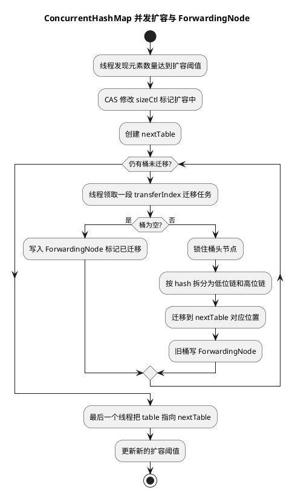

# ConcurrentHashMap 并发机制

## 问题索引

- Q1：ConcurrentHashMap 的并发机制
- Q2：ConcurrentHashMap 扩容时 get 为什么遇到 ForwardingNode 要去新表查？

## Q1：ConcurrentHashMap 的并发机制

### 背景

`ConcurrentHashMap` 是 Java 并发容器中最常用的 Map。它解决的问题不是“让所有操作都串行加锁”，而是在保证线程安全的前提下，尽量提高并发读写能力。

### 核心结论

JDK 8 的 `ConcurrentHashMap` 可以概括为：

```text
数组 + 链表 + 红黑树
+ volatile 保证可见性
+ CAS 处理无锁初始化、空桶插入、计数更新
+ synchronized 锁桶头节点处理冲突写入
+ 多线程协助扩容
```

它不是锁整个 Map，也不是 JDK 7 的固定 Segment 分段锁，而是尽量把锁粒度缩小到单个桶。

### put 的并发控制

写入时主要分三种情况：

1. table 未初始化：通过 CAS 抢初始化权。
2. 目标桶为空：通过 CAS 放入新节点。
3. 目标桶非空：对桶头节点 `synchronized`，只锁当前桶。

这样不同桶上的写入可以并发执行。

### get 为什么通常无锁

`get` 通常不加锁，因为它只是读取结构：

- `table` 使用 volatile 语义读取。
- 节点 value、next 保证可见性。
- 链表和红黑树查找是只读操作。
- 扩容时遇到 `ForwardingNode` 可以去新表继续查找。

所以 `ConcurrentHashMap` 在读多写少场景中性能较好。

### sizeCtl 的作用

`sizeCtl` 是 JDK 8 `ConcurrentHashMap` 的关键控制字段。

它在不同状态下含义不同：

| 状态 | 含义 |
| --- | --- |
| `sizeCtl < 0` | 正在初始化或扩容 |
| `sizeCtl == 0` | table 还未初始化，使用默认容量 |
| `sizeCtl > 0` | 下一次扩容阈值 |

初始化时，线程会 CAS 修改 `sizeCtl` 抢占初始化权。扩容时，`sizeCtl` 也用于标记扩容状态和协助扩容线程数量。

### 扩容机制


### PlantUML 示意图：ConcurrentHashMap 并发扩容



扩容不是单线程独自完成，而是多个线程可以协助迁移。

大致流程：

```text
1. 元素数量超过阈值，触发扩容
2. 创建 nextTable，容量通常是旧表 2 倍
3. 多个线程领取不同区间的桶进行迁移
4. 已迁移的桶放置 ForwardingNode
5. 其他线程遇到 ForwardingNode，会帮助迁移或去新表查找
6. 全部迁移完成后，table 指向 nextTable
```

`ForwardingNode` 的作用非常关键：

- 标记当前桶已经迁移。
- 保存新表引用。
- 让读线程能到新表继续查找。
- 让写线程知道当前正在扩容，可以协助迁移。

### 计数机制

`ConcurrentHashMap` 统计元素数量不是简单维护一个 int。

它使用类似 `LongAdder` 的思路：

```text
低竞争：CAS 更新 baseCount
高竞争：分散更新 CounterCell[]
统计时：baseCount + 所有 CounterCell
```

这样可以降低大量线程同时更新 size 造成的 CAS 热点竞争。

### 为什么不允许 null

并发场景下，如果允许 null value，`get(key) == null` 会产生歧义：

- key 不存在。
- key 存在，但 value 是 null。
- 查询前后被其他线程修改。

所以 `ConcurrentHashMap` 禁止 null key 和 null value，让 `get` 返回 null 可以明确表示当前没有映射。

### 常见使用建议

1. 需要“没有则创建”时，优先使用 `computeIfAbsent`。
2. `computeIfAbsent` 的计算逻辑不要太重，因为可能阻塞当前桶上的其他操作。
3. 不要用 `size()` 做强一致并发判断。
4. 如果需要过期淘汰、容量淘汰，优先用 Caffeine 这类缓存框架。

示例：

```java
private final ConcurrentHashMap<String, Object> locks = new ConcurrentHashMap<>();

public Object getLock(String key) {
    // computeIfAbsent 可以避免多个线程为同一个 key 重复创建锁对象。
    // lambda 中只做轻量对象创建，避免长时间占用当前 key 所在桶的锁。
    return locks.computeIfAbsent(key, k -> new Object());
}
```

### 面试话术

> JDK 8 的 ConcurrentHashMap 底层是数组、链表、红黑树，线程安全主要靠 CAS、volatile 和 synchronized。put 时如果 table 没初始化，先 CAS 初始化；桶为空时 CAS 插入；桶不为空时锁住桶头节点，只影响当前桶。get 通常不加锁，依赖 volatile 可见性和节点结构保证读取安全。扩容时会创建 nextTable，并允许多个线程协助迁移，迁移完成的桶会放 ForwardingNode，读写线程遇到它可以去新表查找或帮忙迁移。计数上使用 baseCount + CounterCell 分散竞争。相比 JDK 7 的 Segment 分段锁，JDK 8 锁粒度更细，结构也更直接。

## Q2：ConcurrentHashMap 扩容时 get 为什么遇到 ForwardingNode 要去新表查？

### 背景

JDK 8 `ConcurrentHashMap` 扩容时不是一次性把所有桶搬完，而是多个线程分段协助迁移。迁移期间，旧表和新表会短时间并存：

```text
旧 table：部分桶还没迁移，部分桶已经迁移完成
新 nextTable：保存已经迁移过去的节点
```

所以 `get` 不能简单假设“当前正在访问的旧 table 一定是最新数据所在位置”。

### 核心结论

当 `get` 在旧表某个桶位上遇到 `ForwardingNode` 时，含义不是“这里还有旧数据，可以继续在旧桶找”，而是：

```text
这个桶已经迁移完成，旧桶位只剩一个转发节点，真实数据已经在 nextTable 里。
```

因此，读线程必须根据 `ForwardingNode.nextTable` 去新表继续查。

### 为什么不直接在老表返回

主要有三个原因。

#### 1. 老桶已经不再是完整数据源

扩容迁移某个桶时，`ConcurrentHashMap` 会把该桶里的节点拆到新表的两个位置：

```text
旧下标 i
迁移后可能分布到：
新下标 i
新下标 i + oldCapacity
```

原因是容量扩大 2 倍后，hash 的新增高位会决定节点留在原位置，还是移动到 `i + oldCapacity`。

如果旧桶已经被替换成 `ForwardingNode`，说明迁移已经完成。此时旧桶位不再保存原链表或红黑树，读线程无法再从这个桶里找到完整数据。

#### 2. 迁移完成后，后续写入会发生在新表

如果某个桶已经迁移完成，后续对这个桶相关 key 的 `put/remove` 会被引导到新表处理。

假设 `get` 仍然只读旧表，就可能出现：

```text
T1：桶 i 迁移完成，旧表 table[i] = ForwardingNode
T2：put(k, newValue) 被写入 nextTable
T3：get(k) 如果还在旧表找，就可能读不到新值，甚至误判不存在
```

`ConcurrentHashMap` 的单次 `get` 需要尽量读到当前结构下可见的最新位置。遇到 `ForwardingNode` 后转向新表，是保持读路径正确性的关键。

#### 3. ForwardingNode 是并发扩容的路由标记

`ForwardingNode` 的 `hash` 是特殊值 `MOVED`，它不是普通业务节点，而是一个转发节点。

可以把它理解成旧表桶位上的路牌：

```text
这里已经搬家了，请去 nextTable 查。
```

这让读线程不需要加全局锁，也不需要等待整个扩容完成，只要看到路牌就继续沿着新表查找。

### get 的简化流程

```java
V get(Object key) {
    // 计算扰动后的 hash，用于定位 table 桶位。
    int h = spread(key.hashCode());

    // tabAt 是 volatile 语义读，保证能看到其他线程发布的节点或 ForwardingNode。
    Node<K,V>[] tab = table;
    Node<K,V> e = tabAt(tab, (tab.length - 1) & h);

    if (e == null) {
        // 桶为空，说明当前可见结构下没有这个 key。
        return null;
    }

    if (e.hash == MOVED) {
        // MOVED 表示当前桶已经迁移完成。
        // 不能继续在旧桶查，必须通过 ForwardingNode 指向的新表继续找。
        return e.find(h, key);
    }

    // 普通节点、链表或树节点，直接在当前桶内查找。
    return findInBin(e, h, key);
}
```

注意：真实 JDK 源码比这个更复杂，这里只是为了说明读路径上的关键分支。

### 容易误解的点

- 不是所有扩容期间的 `get` 都去新表。只有读到 `ForwardingNode`，才说明该桶已经迁移完成，需要转发到新表。
- 如果读到的是普通旧桶，说明该桶还没迁移完成，可以直接在旧桶查。
- `get` 通常不会帮助迁移，写线程遇到扩容更常见的是协助 `transfer`；读线程主要是通过 `ForwardingNode.find` 保证查找路径正确。
- `ForwardingNode` 不是为了性能才去新表，而是为了正确性：旧桶已经被替换成迁移标记，真实数据位置已经改变。

### 面试话术

> ConcurrentHashMap 扩容时旧表和新表会并存，但不是所有桶都同时迁移。某个桶迁移完成后，旧表对应位置会被设置成 ForwardingNode，它里面保存了 nextTable 引用。这个标记表示旧桶数据已经迁移完成，真实节点已经分布到新表的两个位置，后续写入也会发生在新表。如果 get 仍然只在旧表查，就可能读不到已经迁移或后续写入的数据。因此 get 遇到 ForwardingNode 时必须通过它转发到新表继续查；如果遇到普通桶，才继续在旧表查。

## 高频追问

- Q：ConcurrentHashMap 是强一致的吗？
  A：单个操作如 `put/get/remove` 是线程安全的，但迭代和 `size()` 在并发修改下是弱一致的，不适合做强一致判断。

- Q：为什么桶非空时用 synchronized？
  A：JDK 8 中 synchronized 已经有锁优化，锁桶头节点可以把竞争限制在单个桶内，结构比 Segment 更简单。

- Q：扩容时读请求怎么办？
  A：如果读到普通桶，就按旧表查；如果遇到 `ForwardingNode`，说明桶已迁移，会根据其中的新表引用到新表继续查。

- Q：扩容时 get 为什么不能遇到 ForwardingNode 后继续在老表查？
  A：因为该桶已经迁移完成，旧桶位已经被转发节点替换，真实节点已经在 `nextTable` 中，后续写入也会落到新表。继续查老表会破坏读路径正确性。

- Q：computeIfAbsent 一定只执行一次吗？
  A：对同一个 key 的最终插入有并发协调，但 mapping function 不应依赖被调用次数做强语义设计，也不应执行过重或递归修改同一个 Map 的逻辑。

## 复习清单

- [ ] 能说清 JDK 8 ConcurrentHashMap 的 CAS + synchronized 机制
- [ ] 能解释 get 为什么通常无锁
- [ ] 能说明 sizeCtl 的多重含义
- [ ] 能解释 ForwardingNode 在扩容中的作用
- [ ] 能解释扩容期间 get 遇到 ForwardingNode 为什么必须去新表查
- [ ] 能说明 baseCount + CounterCell 的计数思路
- [ ] 能说清为什么不允许 null

