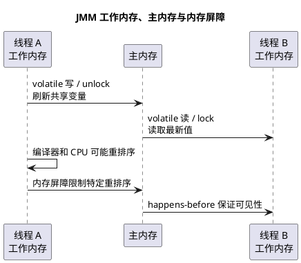

# JMM Java 内存模型

## 问题索引

- Q1：解释并描述 JMM
- Q2：volatile 如何保证一定的有序性？
- Q3：volatile 如何保证变量的可见性？

## Q1：解释并描述 JMM

### 核心结论

JMM，全称 Java Memory Model，Java 内存模型。

它不是 JVM 运行时数据区里的堆、栈、方法区，而是 Java 为多线程并发定义的一套规则，用来规定线程之间如何读写共享变量，以及一个线程的修改什么时候能被另一个线程看到。

JMM 主要解决三个问题：

- 原子性
- 可见性
- 有序性

### 为什么需要 JMM

现代 CPU 和 JVM 为了性能，会做很多优化：

- CPU 有多级缓存，不是每次都直接读写主内存。
- 编译器和 CPU 可能对指令进行重排序。
- 线程可能把变量值暂存在寄存器、CPU 缓存或工作内存中。

这些优化在单线程下通常没有问题，但在多线程下可能导致：

- 一个线程修改了共享变量，另一个线程看不到。
- 代码真实执行顺序和源码顺序不完全一致。
- 多个线程同时读写共享变量，结果不可预测。

JMM 的作用是给这些优化划定边界：允许编译器和 CPU 优化，但必须满足 Java 并发语义。

### 原子性

原子性指一个操作要么完整执行，要么完全不执行，中间不会被其他线程打断。

例如：

```java
i++;
```

这不是原子操作，它大致包含：

1. 读取 `i`
2. 加 1
3. 写回 `i`

多线程同时执行时可能出现丢失更新。

常见保证原子性的方式：

- `synchronized`
- `Lock`
- `AtomicInteger` 等原子类
- CAS

### 可见性

可见性指一个线程修改共享变量后，其他线程能及时看到这个修改。

示例：

```java
boolean flag = false;

// 线程 A
flag = true;

// 线程 B
while (!flag) {
    // 可能一直循环
}
```

如果 `flag` 没有可见性保证，线程 B 可能一直读到旧值。

常见保证可见性的方式：

- `volatile`
- `synchronized`
- `Lock`
- 线程启动、结束、`join()` 等 happens-before 规则

### 有序性

有序性指程序执行顺序是否符合预期。

编译器和 CPU 可能为了性能进行重排序，只要单线程语义不变即可。但在多线程下，重排序可能导致问题。

示例：

```java
int data = 0;
boolean ready = false;

// 线程 A
data = 1;
ready = true;

// 线程 B
if (ready) {
    System.out.println(data);
}
```

如果没有有序性和可见性保证，线程 B 看到 `ready == true` 时，不一定能看到 `data == 1`。

### JMM 的核心机制


### PlantUML 示意图：JMM 可见性与有序性



JMM 主要通过以下机制建立并发语义：

1. `volatile`

   - 保证可见性。
   - 禁止相关指令重排序。
   - 不保证复合操作的原子性，例如 `i++`。

2. `synchronized`

   - 保证互斥。
   - 保证可见性。
   - 释放锁 happens-before 后续获取同一把锁。

3. `final`

   - 保证对象正确构造后，其他线程能看到 final 字段的初始化值。
   - 前提是构造期间不要让 `this` 逃逸。

4. happens-before

   happens-before 是 JMM 中判断可见性和有序性的核心规则。

   如果操作 A happens-before 操作 B，那么 A 的执行结果对 B 可见，并且 A 的执行顺序排在 B 之前。

### 常见 happens-before 规则

- 程序顺序规则：同一线程内，前面的操作 happens-before 后面的操作。
- 锁规则：对一个锁的解锁 happens-before 后续对同一把锁的加锁。
- volatile 规则：对 volatile 变量的写 happens-before 后续对这个变量的读。
- 线程启动规则：`Thread.start()` happens-before 新线程中的操作。
- 线程终止规则：线程中的所有操作 happens-before 其他线程检测到该线程结束，例如 `join()` 返回。
- 中断规则：一个线程调用另一个线程的 `interrupt()` happens-before 被中断线程检测到中断。
- 传递性：A happens-before B，B happens-before C，则 A happens-before C。

### JMM 和 JVM 内存结构的区别

JMM 是并发语义规范，关注线程之间如何安全读写共享变量。

JVM 内存结构是运行时数据区，关注程序运行时内存如何划分，例如：

- 堆
- 虚拟机栈
- 本地方法栈
- 方法区
- 程序计数器

面试中不要把两者混在一起。

### 面试话术

> JMM 是 Java 内存模型，它不是堆栈方法区那种运行时内存结构，而是 Java 为多线程并发定义的一套可见性、有序性和原子性规则。因为 CPU 缓存、编译器优化和指令重排序会导致线程之间读写共享变量出现不可见或乱序问题，所以 JMM 通过 volatile、synchronized、final 和 happens-before 规则约束这些行为。我们平时说 volatile 保证可见性、synchronized 释放锁和获取锁建立可见性，本质上都是 JMM 规则的体现。

## Q2：volatile 如何保证一定的有序性？

### 核心结论

`volatile` 保证一定的有序性，靠的是禁止特定类型的指令重排序，底层通常通过内存屏障实现。

它不是禁止所有重排序，而是围绕 volatile 读写建立有序边界：

- volatile 写之前的普通读写，不能被重排序到 volatile 写之后。
- volatile 读之后的普通读写，不能被重排序到 volatile 读之前。
- 对同一个 volatile 变量的写 happens-before 后续对它的读。

### 示例

```java
int data = 0;
volatile boolean ready = false;

// 线程 A
data = 1;
ready = true;

// 线程 B
if (ready) {
    System.out.println(data);
}
```

在这个例子里：

- `ready = true` 是 volatile 写。
- `if (ready)` 是 volatile 读。

JMM 会保证：

1. 线程 A 中，`data = 1` 不会被重排序到 `ready = true` 后面。
2. 线程 B 中，读取 `data` 不会被重排序到读取 `ready` 前面。
3. 线程 A 对 `ready` 的 volatile 写 happens-before 线程 B 对 `ready` 的 volatile 读。

所以只要线程 B 看到 `ready == true`，就能看到线程 A 在写 `ready` 之前对 `data` 的写入。

### release / acquire 语义

可以把 volatile 理解成发布-获取语义：

```text
普通写
普通写
volatile 写   // release，发布

volatile 读   // acquire，获取
普通读
普通读
```

- volatile 写具有 release 语义：保证它前面的普通写先完成，并对后续读可见。
- volatile 读具有 acquire 语义：保证它后面的普通读不会跑到 volatile 读之前。

### 内存屏障

volatile 的有序性通常通过内存屏障实现。

可以粗略理解为：

- volatile 写前后插入写屏障，防止前面的普通写被重排到 volatile 写之后，并促使修改对其他线程可见。
- volatile 读后插入读屏障，防止后面的普通读被重排到 volatile 读之前，并读取到最新值。

不同 CPU 架构的屏障实现不同，但 JMM 对上层提供统一语义。

### volatile 不保证复合操作原子性

```java
volatile int count = 0;

count++;
```

`count++` 仍然不是线程安全的，因为它包含：

1. 读 count
2. 加 1
3. 写 count

volatile 只能保证读写本身的可见性和有序性，不能把这一组操作变成不可分割的原子操作。

### 面试话术

> volatile 通过禁止特定重排序来保证一定的有序性。对 volatile 写来说，它前面的普通读写不能被重排序到 volatile 写之后；对 volatile 读来说，它后面的普通读写不能被重排序到 volatile 读之前。同时 volatile 写 happens-before 后续对同一个 volatile 变量的读，所以它可以实现发布-获取语义。底层通常通过内存屏障实现，但 volatile 不保证复合操作的原子性。

## Q3：volatile 如何保证变量的可见性？

### 核心结论

`volatile` 保证可见性，核心依赖 JMM 对 volatile 读写定义的内存语义：

- 对 volatile 变量的写，会把该线程工作内存中的修改刷新出去。
- 对 volatile 变量的读，会让当前线程重新从主内存或符合缓存一致性语义的位置读取最新值。
- 对同一个 volatile 变量的写 happens-before 后续对这个变量的读。

一句话：

```text
线程 A 写 volatile 变量，相当于发布修改；
线程 B 读到这个 volatile 变量的新值，相当于获取 A 发布前的修改。
```

### 为什么普通变量可能不可见

现代 CPU 和 JVM 为了性能，不会每次读写变量都直接访问主内存。

线程可能把变量值缓存到：

- CPU cache。
- 寄存器。
- 线程工作内存。
- 编译器优化后的临时位置。

例如：

```java
class StopDemo {
    private boolean stop = false;

    public void stop() {
        // 线程 A 修改 stop。
        // 如果 stop 不是 volatile，线程 B 不一定及时看到这个修改。
        stop = true;
    }

    public void run() {
        while (!stop) {
            // 线程 B 可能一直读取到旧值 false。
            // JIT 甚至可能基于没有同步语义做循环优化。
        }
    }
}
```

如果没有同步手段，线程 A 把 `stop` 改成 `true` 后，线程 B 可能仍然读到旧值。

### volatile 写的语义

对 volatile 变量执行写操作时，JMM 要求这次写对其他线程可见。

可以粗略理解为：

```text
普通变量修改
普通变量修改
volatile 写
  -> 刷新当前线程之前的修改
  -> 让其他线程后续 volatile 读能看到
```

示例：

```java
class ConfigHolder {
    private Map<String, String> config;
    private volatile boolean initialized = false;

    public void init() {
        Map<String, String> temp = new HashMap<>();
        temp.put("timeout", "3000");

        // 普通写：先准备配置对象。
        config = temp;

        // volatile 写：发布初始化完成信号。
        // 看到 initialized == true 的线程，也应该能看到前面对 config 的写入。
        initialized = true;
    }

    public String get(String key) {
        if (initialized) {
            // volatile 读之后，能看到 init 线程在 volatile 写之前发布的 config。
            return config.get(key);
        }
        return null;
    }
}
```

这里 `initialized = true` 不只是写了一个布尔值，它还承担了“发布前面普通写”的作用。

### volatile 读的语义

对 volatile 变量执行读操作时，JMM 要求当前线程看到其他线程对该 volatile 变量的最新写入，并看到该写入之前的相关修改。

可以粗略理解为：

```text
volatile 读
  -> 获取其他线程发布的最新值
  -> 后续普通读不能使用过期缓存
普通变量读取
普通变量读取
```

所以在线程 B 中：

```java
if (initialized) {
    return config.get(key);
}
```

只要 B 读到了 `initialized == true`，根据 volatile happens-before 规则，A 在线程中写 `initialized = true` 之前对 `config` 的写入，对 B 可见。

### happens-before 规则

JMM 中有一条明确规则：

```text
对一个 volatile 变量的写 happens-before 后续对这个 volatile 变量的读。
```

配合传递性：

```text
线程 A：
config = temp;
initialized = true; // volatile 写

线程 B：
if (initialized) {  // volatile 读
    config.get(key);
}
```

可以得到：

```text
config = temp
  happens-before initialized = true
  happens-before 线程 B 读 initialized == true
  happens-before 线程 B 读取 config
```

因此线程 B 能看到线程 A 在 volatile 写之前的普通写。

### 底层如何做到

从底层实现看，volatile 通常依赖内存屏障和 CPU 缓存一致性协议。

大致效果：

| 操作 | 效果 |
| --- | --- |
| volatile 写 | 禁止前面的普通写被拖到 volatile 写之后，并推动修改对其他线程可见 |
| volatile 读 | 禁止后面的普通读被提前到 volatile 读之前，并读取到符合可见性语义的值 |

在具体 CPU 上，JVM 会根据平台插入合适的内存屏障或使用带有屏障语义的指令。不同 CPU 架构实现不同，但 JMM 对 Java 层提供统一语义。

不要把它简单理解成“每次都直接读写物理主内存”。更准确的说法是：

```text
volatile 通过 JMM 规则、内存屏障和缓存一致性机制，
保证线程之间按 volatile 读写建立可见性关系。
```

### volatile 不保证原子性

可见性不等于原子性。

```java
class Counter {
    private volatile int count = 0;

    public void increment() {
        // count++ 包含读、加一、写三步。
        // volatile 只能保证每次读写可见，不能保证这三步整体不可分割。
        count++;
    }
}
```

两个线程可能同时读到 `count = 0`，各自加一后都写回 `1`，结果丢失一次更新。

如果要保证递增原子性，应使用：

- `synchronized`
- `ReentrantLock`
- `AtomicInteger`
- `LongAdder`

### volatile 适合什么场景

适合：

- 状态标记，例如停止标识。
- 配置发布。
- 双重检查锁中的实例引用。
- 一个线程写，多个线程读，并且写入不是依赖旧值的复合操作。

不适合：

- 计数器自增。
- 多字段之间有一致性约束。
- 读-改-写复合逻辑。

### 面试话术

> volatile 保证可见性依赖 JMM 对 volatile 读写的特殊规则。对 volatile 变量的写，会把当前线程在写 volatile 之前的修改发布出去；其他线程后续读到这个 volatile 新值时，也能看到该 volatile 写之前的普通变量修改。JMM 规定对同一个 volatile 变量的写 happens-before 后续对它的读，底层通常通过内存屏障和 CPU 缓存一致性协议实现。需要注意的是，volatile 保证的是单次读写的可见性和一定有序性，不保证 `count++` 这类复合操作的原子性。

## 高频追问

- Q：JMM 是不是 JVM 内存结构？
  A：不是。JMM 是并发语义规范，JVM 内存结构是堆、栈、方法区等运行时数据区划分。

- Q：volatile 能保证什么？
  A：保证可见性和一定的有序性，但不保证 `i++` 这类复合操作的原子性。

- Q：volatile 为什么只说保证一定的有序性？
  A：因为它不是禁止所有重排序，只是禁止 volatile 读写前后会破坏可见性语义的特定重排序。

- Q：volatile 写和 volatile 读分别是什么语义？
  A：volatile 写是 release 发布语义，volatile 读是 acquire 获取语义。

- Q：synchronized 为什么能保证可见性？
  A：线程释放锁前会把共享变量修改刷新出去，线程获取同一把锁后能看到之前释放锁线程的修改。这对应 happens-before 的锁规则。

- Q：happens-before 是什么？
  A：它是 JMM 判断可见性和有序性的规则。如果 A happens-before B，那么 A 的结果对 B 可见，并且 A 的执行顺序排在 B 之前。

## 复习清单

- [ ] 能区分 JMM 和 JVM 运行时数据区
- [ ] 能说清原子性、可见性、有序性
- [ ] 能解释 volatile、synchronized、final 的 JMM 语义
- [ ] 能列出常见 happens-before 规则
- [ ] 能用 ready/data 示例说明重排序和可见性问题
- [ ] 能说明 volatile 的 release / acquire 语义
- [ ] 能解释 volatile 为什么不保证 `count++` 原子性

