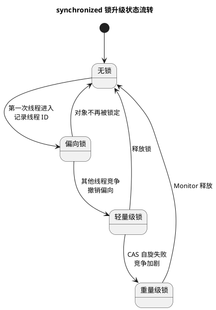

# Java 锁与锁升级

## 问题索引

- Q1：解释 Java 中的各种锁以及 synchronized 锁升级过程
- Q2：ReentrantLock 和 synchronized 的可重入分别如何实现？
- Q3：notifyAll 是否也有无效唤醒问题？唤醒顺序如何决定？
- Q4：为什么尽量不要使用 synchronized(String a)？

## Q1：解释 Java 中的各种锁以及 synchronized 锁升级过程

### 背景

Java 中的锁可以从两个层面理解：

1. JVM / 语言层面的锁：主要是 `synchronized`。
2. JUC 工具层面的锁：例如 `ReentrantLock`、`ReadWriteLock`、`StampedLock`、`Semaphore` 等。

面试中如果问“锁升级过程”，通常重点考察的是 `synchronized` 对象锁从无锁到重量级锁的升级。

### synchronized 对象锁

`synchronized` 锁的是对象。

每个 Java 对象都有对象头，对象头中包含 Mark Word。Mark Word 会根据对象状态记录不同信息，例如：

- hashCode
- GC 年龄
- 锁标志位
- 偏向线程 ID
- 指向锁记录的指针
- 指向重量级 Monitor 的指针

所以 `synchronized` 的锁状态变化，本质上就是对象头 Mark Word 中锁相关信息的变化。

### 锁升级流程


### PlantUML 示意图：synchronized 锁升级状态流转



历史上的 `synchronized` 锁状态大致是：

```text
无锁 -> 偏向锁 -> 轻量级锁 -> 重量级锁
```

需要注意：JDK 15 之后偏向锁默认禁用，后续版本逐渐移除相关机制。但面试中仍然常问这套经典锁升级过程。

### 无锁

对象刚创建且没有线程进入同步块时，通常处于无锁状态。

无锁状态下没有同步竞争，也不需要额外加锁成本。

### 偏向锁

偏向锁优化的是“同一个线程反复进入同步块，没有其他线程竞争”的场景。

第一次线程进入同步块时，JVM 会尝试把对象头 Mark Word 里的偏向线程 ID 设置为当前线程。

之后同一个线程再次进入同步块时，只需要检查对象头里记录的是不是自己：

- 如果是自己，直接进入同步块。
- 如果不是自己，说明可能有其他线程竞争，需要撤销偏向。

特点：

- 几乎不需要 CAS。
- 适合单线程重复加锁。
- 一旦出现其他线程竞争，需要撤销偏向锁。

### 轻量级锁

轻量级锁优化的是“有竞争，但竞争不激烈，锁持有时间很短”的场景。

线程进入同步块时，会在自己的栈帧中创建 Lock Record，然后用 CAS 尝试把对象头 Mark Word 替换为指向 Lock Record 的指针。

- CAS 成功：获得轻量级锁。
- CAS 失败：说明有竞争，线程会尝试自旋。

轻量级锁不一定比重量级锁永远更好。它依赖自旋，如果锁很快释放，自旋成本低；如果锁长时间不释放，自旋会浪费 CPU。

### 重量级锁

当竞争激烈，自旋失败，或者锁持有时间较长时，轻量级锁会膨胀为重量级锁。

重量级锁依赖操作系统的互斥量，未获得锁的线程会被阻塞和唤醒，涉及用户态和内核态切换，成本较高。

适合场景：

- 竞争激烈。
- 锁持有时间较长。
- 自旋会浪费大量 CPU。

### 锁升级是否会降级

锁升级通常是单向的：

```text
偏向锁 -> 轻量级锁 -> 重量级锁
```

一般不会从重量级锁直接降回轻量级锁。

原因是频繁升降级会增加额外成本。JVM 更倾向于根据竞争程度逐步升级，而不是频繁来回切换。

### synchronized 锁升级简化流程

```text
对象处于无锁状态
  -> 第一个线程进入同步块
  -> 尝试偏向当前线程
  -> 同一线程再次进入，直接通过偏向锁进入
  -> 其他线程竞争，撤销偏向锁
  -> 升级为轻量级锁
  -> CAS 尝试获取锁，失败则自旋
  -> 自旋仍失败或竞争激烈
  -> 膨胀为重量级锁
  -> 竞争线程阻塞，等待操作系统唤醒
```

### JUC 中常见锁

#### ReentrantLock

可重入锁，基于 AQS 实现。

特点：

- 支持公平锁和非公平锁。
- 支持可中断获取锁。
- 支持超时获取锁。
- 支持多个 `Condition` 条件队列。
- 需要手动 `unlock()`，通常放在 `finally` 中。

#### ReentrantReadWriteLock

读写锁，适合读多写少场景。

规则：

- 读读共享。
- 读写互斥。
- 写写互斥。

#### StampedLock

`StampedLock` 支持：

- 写锁
- 悲观读锁
- 乐观读

它适合读多写少，并且读操作很频繁的场景。乐观读不阻塞写，但读取后需要校验 stamp 是否有效。

注意：`StampedLock` 不可重入，使用复杂度高。

#### Condition

`Condition` 配合 `ReentrantLock` 使用，类似 `wait/notify`，但更灵活。

一个 `Lock` 可以创建多个 `Condition` 队列，适合区分不同等待条件。

#### Semaphore

信号量，用于控制同时访问某个资源的线程数量。

它不是传统意义上的互斥锁，更像许可证机制。

#### CountDownLatch

倒计时门闩，用于一个线程等待多个线程完成任务。

特点：一次性使用，计数归零后不能重置。

#### CyclicBarrier

循环屏障，用于多个线程互相等待，到达同一个阶段后再继续执行。

特点：可以重复使用。

### 乐观锁与悲观锁

这是一种思想分类，不是某个具体类。

悲观锁：

- 认为竞争大概率会发生。
- 操作前先加锁。
- 典型代表：`synchronized`、`ReentrantLock`。

乐观锁：

- 认为竞争不一定发生。
- 先操作，提交时检查是否冲突。
- 典型代表：CAS、版本号机制。

CAS 是 Java 中乐观锁的典型实现。

### 公平锁与非公平锁

公平锁：

- 按线程等待顺序获取锁。
- 减少饥饿。
- 吞吐量通常较低。

非公平锁：

- 新来的线程可以插队竞争。
- 吞吐量通常更高。
- 可能导致部分线程等待更久。

`ReentrantLock` 支持公平和非公平，默认非公平。

### 可重入锁

可重入锁指同一个线程已经获得锁后，可以再次进入同一把锁保护的代码块。

例如：

```java
synchronized void a() {
    b();
}

synchronized void b() {
    // 同一个线程可以再次获得同一把锁
}
```

`synchronized` 和 `ReentrantLock` 都是可重入锁。

## Q2：ReentrantLock 和 synchronized 的可重入分别如何实现？

### synchronized 的可重入实现

`synchronized` 的可重入由 JVM 的对象 Monitor 实现。

每个重量级锁关联一个 Monitor。Monitor 内部会记录：

- `_owner`：当前持有锁的线程。
- `_recursions`：当前线程重入次数。
- `_EntryList`：阻塞等待锁的线程队列。
- `_WaitSet`：调用 `wait()` 后进入等待的线程集合。

当线程第一次进入同步块：

```text
_owner == null
  -> CAS 设置 _owner = 当前线程
  -> 获得锁
```

当同一个线程再次进入同一把锁：

```text
_owner == 当前线程
  -> _recursions + 1
  -> 直接进入
```

退出同步块时：

```text
_recursions > 0
  -> _recursions - 1

_recursions == 0
  -> 清空 _owner
  -> 真正释放锁
  -> 唤醒等待线程
```

所以 `synchronized` 不会因为同一线程再次进入同一把锁而阻塞自己。

示例：

```java
class SyncReentrantDemo {
    synchronized void a() {
        b();
    }

    synchronized void b() {
        // 同一个线程已经持有 this 锁，仍然可以再次进入
    }
}
```

`a()` 和 `b()` 都锁同一个 `this` 对象。如果 `synchronized` 不可重入，调用 `a()` 后进入 `b()` 会发生自我死锁。

### ReentrantLock 的可重入实现

`ReentrantLock` 的可重入由 AQS 的 `state` 和独占线程字段实现。

核心字段：

- `state`：表示重入次数。
- `exclusiveOwnerThread`：表示当前持有锁的线程。

第一次加锁：

```text
state == 0
  -> CAS state 从 0 改为 1
  -> exclusiveOwnerThread = 当前线程
```

同一个线程再次加锁：

```text
exclusiveOwnerThread == 当前线程
  -> state + 1
  -> 直接成功
```

释放锁：

```text
unlock()
  -> state - 1
  -> state == 0 时清空 exclusiveOwnerThread
  -> 真正释放锁并唤醒后继节点
```

示例：

```java
class LockReentrantDemo {
    private final ReentrantLock lock = new ReentrantLock();

    void a() {
        lock.lock();
        try {
            b();
        } finally {
            lock.unlock();
        }
    }

    void b() {
        lock.lock();
        try {
            // 同一线程再次获取同一把 ReentrantLock
        } finally {
            lock.unlock();
        }
    }
}
```

注意：加锁几次，就必须释放几次。否则 `state` 不能归零，锁不会真正释放。

### 对比总结

| 锁 | 持有者记录 | 重入次数记录 | 释放条件 |
|---|---|---|---|
| `synchronized` | Monitor 的 `_owner` | Monitor 的 `_recursions` | 重入次数归零后清空 owner |
| `ReentrantLock` | AQS 的 `exclusiveOwnerThread` | AQS 的 `state` | state 归零后清空 owner |

### 面试话术

> synchronized 和 ReentrantLock 都是可重入锁。synchronized 的可重入由 JVM Monitor 实现，Monitor 会记录 owner 和 recursions，同一线程再次进入时递增重入次数，退出时递减，归零才真正释放。ReentrantLock 基于 AQS 实现，state 表示重入次数，exclusiveOwnerThread 表示持锁线程，同一线程再次 lock 时直接 state 加一，unlock 时 state 减一，直到 state 为 0 才释放锁。

### 综合面试话术

> Java 锁可以分为 synchronized 对象锁和 JUC 显式锁。synchronized 的锁升级主要依赖对象头 Mark Word，历史上会从无锁、偏向锁、轻量级锁升级到重量级锁。偏向锁优化单线程重复进入，轻量级锁通过 CAS 和自旋优化低竞争场景，重量级锁依赖操作系统互斥量，适合竞争激烈或锁持有时间长的场景。JUC 里常见的有 ReentrantLock、ReadWriteLock、StampedLock，它们提供了公平锁、可中断、条件队列、读写分离等更灵活的能力。

## Q3：notifyAll 是否也有无效唤醒问题？唤醒顺序如何决定？

### 背景

`Object.wait()`、`notify()`、`notifyAll()` 都必须在持有同一把对象锁的 `synchronized` 代码块或方法中调用。

对象 Monitor 内部可以粗略理解为有两类队列：

| 结构 | 作用 |
| --- | --- |
| `_WaitSet` | 调用 `wait()` 后进入等待的线程集合 |
| `_EntryList` / 入口竞争队列 | 等待获取 synchronized 锁的线程集合 |

当线程调用 `obj.wait()` 时，它会释放 `obj` 的 Monitor 锁，并进入该对象 Monitor 的 `_WaitSet`。

当其他线程调用 `obj.notifyAll()` 时，`_WaitSet` 中的等待线程会被唤醒，并转移到锁竞争队列中。它们不是立刻继续执行，而是要重新竞争 `obj` 这把锁。

### 核心结论

`notifyAll()` 确实可能带来类似“无效唤醒”的效果：

```text
一批线程都被 notifyAll 唤醒
  -> 但同一时刻只有一个线程能重新获得 synchronized 锁
  -> 其他线程要继续阻塞在入口队列
  -> 即使拿到锁，也可能发现条件已经不满足
  -> 然后再次 wait
```

它和 epoll 惊群有相似点：都可能唤醒多个等待者，但最终真正能继续推进的线程有限。

但它们不完全相同：

- epoll 惊群是 IO 事件源上的无效唤醒。
- `notifyAll` 是 JVM Monitor 条件等待上的批量唤醒和锁重新竞争。
- `notifyAll` 很多时候是有意为之，用来避免 `notify` 唤错条件导致线程永久等待。

### notifyAll 的完整流程

假设多个线程都在等待同一个条件：

```java
synchronized (obj) {
    while (!condition) {
        // wait 会释放 obj 锁，并让当前线程进入 obj Monitor 的 WaitSet。
        obj.wait();
    }

    // 被唤醒并重新拿到 obj 锁后，才能继续执行这里。
    doWork();
}
```

另一个线程修改条件并调用：

```java
synchronized (obj) {
    condition = true;

    // notifyAll 会唤醒 WaitSet 中等待 obj 的所有线程。
    // 这些线程不会立刻并发执行，而是转去竞争 obj 锁。
    obj.notifyAll();

    // 当前线程仍然持有 obj 锁。
    // 只有当前 synchronized 块退出后，被唤醒的线程才有机会重新抢锁。
}
```

流程是：

```text
1. T1/T2/T3 调用 obj.wait()
2. T1/T2/T3 释放 obj 锁，进入 obj 的 WaitSet
3. T4 获得 obj 锁，修改 condition
4. T4 调用 obj.notifyAll()
5. T1/T2/T3 从 WaitSet 被转移出来，进入锁竞争状态
6. T4 继续执行 synchronized 块中的代码
7. T4 退出 synchronized，释放 obj 锁
8. T1/T2/T3 竞争 obj 锁
9. 只有一个线程先拿到锁
10. 其他线程继续阻塞等待锁
```

所以：`notifyAll()` 调用后，被唤醒线程并不是马上运行；它们必须等通知线程释放锁，并重新竞争成功。

### 是否会继续唤醒

会。

`notifyAll()` 的语义是唤醒在该对象 Monitor 的 WaitSet 中等待的所有线程。这个动作不会因为其中某个线程后来拿到了锁而停止。

更准确地说：

```text
notifyAll 执行时：
  -> JVM 会把 WaitSet 中的等待线程批量唤醒或转移到竞争队列
  -> 这个批量转移动作和后续谁抢到锁是两件事
```

所以即使后面已经有一个线程拿到锁，其他被 `notifyAll` 唤醒的线程也已经离开 WaitSet，正在入口队列或调度队列里等待锁。

### 唤醒顺序如何决定

不能依赖固定顺序。

Java 语言规范没有承诺 `notify()` 或 `notifyAll()` 的唤醒顺序。实际顺序受很多因素影响：

- JVM 实现。
- 操作系统线程调度。
- Monitor 内部队列策略。
- 锁竞争状态。
- 线程优先级。
- 是否发生偏向锁、轻量级锁、重量级锁膨胀。

对于 `notify()`：

```text
从 WaitSet 中选择一个线程唤醒，但选择哪个线程没有规范保证。
```

对于 `notifyAll()`：

```text
WaitSet 中的线程都会被唤醒，但它们重新竞争锁的顺序没有规范保证。
```

所以不能写依赖唤醒顺序的业务代码。

### 为什么必须用 while 判断条件

等待条件必须用 `while`，不能用 `if`。

错误写法：

```java
synchronized (queue) {
    if (queue.isEmpty()) {
        // 错误：线程被唤醒后不重新检查条件，可能在条件不满足时继续执行。
        queue.wait();
    }

    // 如果多个消费者被 notifyAll 唤醒，只有第一个消费者取到数据。
    // 后续消费者如果不重新检查 queue.isEmpty()，可能取不到数据或抛异常。
    Object item = queue.remove();
}
```

正确写法：

```java
synchronized (queue) {
    while (queue.isEmpty()) {
        // 使用 while 是为了在被唤醒、抢到锁后重新检查业务条件。
        // 这可以处理 notifyAll 批量唤醒、条件被其他线程消费、虚假唤醒等情况。
        queue.wait();
    }

    Object item = queue.remove();
}
```

原因：

1. `notifyAll` 会唤醒多个线程，但资源可能只够一个线程消费。
2. 被唤醒线程抢到锁时，条件可能已经被其他线程改变。
3. JVM 允许虚假唤醒，线程可能在没有明确通知时从 wait 返回。
4. `while` 能保证线程继续执行前重新确认条件成立。

### notify 和 notifyAll 的取舍

`notify()` 只唤醒一个线程，减少无效唤醒，但可能唤错线程。

例如同一个锁上有两类等待者：

```text
生产者等待队列不满
消费者等待队列不空
```

如果用 `notify()`，可能队列已经有数据了，却唤醒另一个生产者，而真正该唤醒的消费者没醒，导致线程继续等待。

`notifyAll()` 会唤醒所有等待者，让它们各自重新检查条件，正确性更稳，但性能成本更高。

所以：

| 方法 | 优点 | 风险 |
| --- | --- | --- |
| `notify` | 唤醒少，开销低 | 可能唤错条件队列中的线程 |
| `notifyAll` | 正确性更稳，不容易遗漏条件变化 | 可能造成批量唤醒和无效竞争 |

这也是为什么 `ReentrantLock + Condition` 更灵活：它可以为不同条件创建不同等待队列。

### Condition 如何减少无效唤醒

`Condition` 可以拆分等待队列。

例如阻塞队列里：

```text
notEmpty：消费者等待队列
notFull：生产者等待队列
```

生产者放入元素后，只需要唤醒 `notEmpty` 上的消费者。

消费者取走元素后，只需要唤醒 `notFull` 上的生产者。

这样比所有线程都在同一个对象 Monitor 的 WaitSet 中等待更精细。

示例：

```java
class BoundedBuffer<E> {
    private final ReentrantLock lock = new ReentrantLock();
    private final Condition notEmpty = lock.newCondition();
    private final Condition notFull = lock.newCondition();
    private final Queue<E> queue = new ArrayDeque<>();
    private final int capacity = 100;

    public void put(E e) throws InterruptedException {
        lock.lock();
        try {
            while (queue.size() == capacity) {
                // 只有生产者在 notFull 条件队列等待。
                notFull.await();
            }

            queue.add(e);

            // 放入元素后，只唤醒等待“非空”的消费者。
            notEmpty.signal();
        } finally {
            lock.unlock();
        }
    }

    public E take() throws InterruptedException {
        lock.lock();
        try {
            while (queue.isEmpty()) {
                // 只有消费者在 notEmpty 条件队列等待。
                notEmpty.await();
            }

            E value = queue.remove();

            // 取走元素后，只唤醒等待“非满”的生产者。
            notFull.signal();
            return value;
        } finally {
            lock.unlock();
        }
    }
}
```

### 和 epoll 惊群的对比

| 维度 | epoll 惊群 | notifyAll 批量唤醒 |
| --- | --- | --- |
| 场景 | 多线程/多进程等待 IO 事件 | 多线程等待对象条件 |
| 资源 | fd、连接、IO 事件 | synchronized 锁和业务条件 |
| 现象 | 多个等待者醒来，一个处理成功 | 多个线程醒来，一个先拿到锁或条件 |
| 成本 | 上下文切换、CPU、accept 竞争 | 上下文切换、锁竞争、条件重查 |
| 缓解 | `EPOLLEXCLUSIVE`、`SO_REUSEPORT`、合理线程模型 | `while` 重查条件、减少 notifyAll、使用 Condition |

### 面试话术

可以这样回答：

> `notifyAll` 确实可能造成类似无效唤醒的效果。调用 `wait` 的线程在对象 Monitor 的 WaitSet 中等待，`notifyAll` 会把 WaitSet 中等待同一对象的线程都唤醒或转移到锁竞争队列，但这些线程不会马上执行，它们必须等当前持锁线程退出 synchronized 后重新竞争锁。同一时刻只有一个线程能拿到锁，其他线程继续阻塞；即使后续拿到锁，也可能发现条件已经被其他线程消费，只能再次 wait。所以必须用 while 重查条件。至于唤醒顺序，Java 规范不保证顺序，受 JVM 和操作系统调度影响；`notifyAll` 的批量唤醒不会因为某个线程已经拿到锁而停止。为了减少无效唤醒，可以用 `ReentrantLock` 的多个 `Condition` 把不同等待条件拆开。

## Q4：为什么尽量不要使用 synchronized(String a)？

### 背景

`synchronized` 锁住的是对象引用指向的对象，而不是变量名。

如果把 `String` 当作锁对象，风险在于：字符串常量池会缓存和复用字符串对象。两个看起来无关的代码位置，只要使用了相同的字符串字面量，就可能锁住同一个对象，导致意外串行、性能下降，甚至死锁。

### 核心结论

尽量不要这样写：

```java
synchronized ("order") {
    // 错误示例：字符串字面量 "order" 来自字符串常量池。
    // 项目中其他地方如果也 synchronized("order")，会竞争同一把锁。
    updateOrder();
}
```

因为 `"order"` 是字符串字面量，JVM 会把它放入字符串常量池。后续其他类、其他模块里再出现同样的 `"order"`，大概率会复用同一个 `String` 对象。

这意味着：

```java
class OrderService {
    void update() {
        synchronized ("bizLock") {
            // 这里锁的是字符串常量池中的 "bizLock" 对象。
            saveOrder();
        }
    }
}

class CouponService {
    void issue() {
        synchronized ("bizLock") {
            // 这里看似是另一个业务模块，实际也锁住同一个 "bizLock" 对象。
            sendCoupon();
        }
    }
}
```

`OrderService` 和 `CouponService` 业务上没有关系，却因为使用了相同字符串字面量，互相阻塞。

### 字符串常量池为什么会导致锁共享

Java 为了减少重复字符串对象，会维护字符串常量池。

例如：

```java
String a = "lock";
String b = "lock";

// true，a 和 b 指向字符串常量池中的同一个对象。
System.out.println(a == b);
```

所以如果写：

```java
synchronized (a) {
    // 实际锁住的是 a 指向的那个 String 对象。
}
```

只要 `a` 指向的是常量池中被复用的字符串对象，就可能和其他代码共享同一把锁。

### 更隐蔽的 intern 风险

即使不是直接写字符串字面量，调用 `intern()` 后也可能进入常量池：

```java
String lock = new String("user:1001").intern();

synchronized (lock) {
    // intern 后，lock 指向字符串常量池中的对象。
    // 其他地方只要拿到相同内容并 intern，也会竞争同一把锁。
    updateUser();
}
```

这类代码在“按业务 key 加锁”时尤其容易出现。

### 正确做法

#### 使用私有 final 锁对象

如果是类内部互斥，优先使用私有锁对象：

```java
class OrderService {
    private final Object orderLock = new Object();

    void update() {
        synchronized (orderLock) {
            // orderLock 是当前对象私有字段，不会被外部模块意外复用。
            saveOrder();
        }
    }
}
```

`private final Object` 的好处：

- 外部代码拿不到这个锁对象。
- 不会因为常量池复用导致跨模块竞争。
- 锁语义更清楚。

#### 使用 ConcurrentHashMap 管理业务 key 锁

如果确实要按业务 key 加锁，不建议直接锁 `String`，可以使用专门的锁对象容器：

```java
class KeyLockService {
    private final ConcurrentHashMap<String, Object> lockMap = new ConcurrentHashMap<>();

    void handle(String bizKey) {
        // 为每个业务 key 创建一个独立锁对象。
        // computeIfAbsent 可以保证同一个 key 拿到同一个锁对象。
        Object lock = lockMap.computeIfAbsent(bizKey, key -> new Object());

        synchronized (lock) {
            // 这里只会让相同 bizKey 的任务互斥，不会和字符串常量池发生耦合。
            processByKey(bizKey);
        }
    }
}
```

注意：这种方式还要考虑 `lockMap` 的清理问题，否则业务 key 很多时可能造成内存增长。实际项目可以使用带过期能力的缓存，或者选择成熟的分段锁、Striped Lock、Redis 分布式锁等方案。

### 踩坑点

1. 不要锁字符串字面量，例如 `synchronized("LOCK")`。
2. 不要锁可能来自外部输入的字符串，例如用户 ID、订单号、业务编码。
3. 不要锁 `intern()` 后的字符串。
4. 不要锁公共对象，例如 `Boolean.TRUE`、包装类型常量、全局可访问的对象。
5. 锁对象应该尽量私有、稳定、语义明确。

### 面试话术

可以这样回答：

> 不建议使用 `synchronized(String a)`，因为 synchronized 锁的是对象本身，而 String 可能来自字符串常量池。相同字符串字面量会被 JVM 缓存并复用，两个无关模块如果都锁同一个字符串内容，实际会竞争同一把锁，造成意外阻塞，严重时还可能和其他锁组合形成死锁。更好的做法是使用 `private final Object lock = new Object()` 作为私有锁对象；如果要按业务 key 加锁，也应该用专门的锁对象映射或成熟的分段锁方案，而不是直接锁 String。

## 高频追问

- Q：锁升级为什么要分这么多阶段？
  A：为了根据竞争程度选择不同成本的同步方式。无竞争时偏向锁成本最低，低竞争时轻量级锁避免线程阻塞，高竞争时重量级锁避免自旋浪费 CPU。

- Q：轻量级锁一定比重量级锁快吗？
  A：不一定。轻量级锁依赖自旋，如果锁很快释放就划算；如果锁持有时间长，自旋会浪费 CPU，不如阻塞等待。

- Q：为什么锁升级通常不降级？
  A：频繁升降级会增加额外成本，JVM 通常让锁按竞争程度逐步升级。

- Q：synchronized 和 ReentrantLock 有什么区别？
  A：`synchronized` 是 JVM 级锁，自动加锁释放锁；`ReentrantLock` 是 JUC 显式锁，支持公平锁、可中断、超时获取锁、多个 Condition，但需要手动释放。

- Q：什么是可重入？
  A：同一个线程拿到锁后，可以再次进入同一把锁保护的代码，而不会自己把自己阻塞。

- Q：ReentrantLock 重入后少 unlock 一次会怎样？
  A：`state` 无法归零，锁不会真正释放，其他线程会一直等待，可能造成死锁或线程堆积。

- Q：偏向锁现在还重要吗？
  A：新版本 JDK 中偏向锁默认禁用甚至被移除，但理解它有助于理解 synchronized 早期优化思路，面试仍可能问。

- Q：除了 String，还有哪些对象不适合作为锁？
  A：不适合锁公共可访问对象、包装类型常量、Class 对象、Boolean 常量、来自外部传入且无法控制生命周期的对象。锁对象应尽量私有、final、不可被外部代码拿到。

## 复习清单

- [ ] 能画出 `无锁 -> 偏向锁 -> 轻量级锁 -> 重量级锁`
- [ ] 能解释对象头 Mark Word 的作用
- [ ] 能说明偏向锁、轻量级锁、重量级锁分别优化什么场景
- [ ] 能区分 synchronized 和 ReentrantLock
- [ ] 能说明读写锁、StampedLock、Semaphore 的适用场景
- [ ] 能解释乐观锁、悲观锁、公平锁、非公平锁、可重入锁
- [ ] 能说清 synchronized 的 Monitor owner / recursions
- [ ] 能说清 ReentrantLock 的 state / exclusiveOwnerThread
- [ ] 能解释为什么不应该使用 `synchronized(String)`

