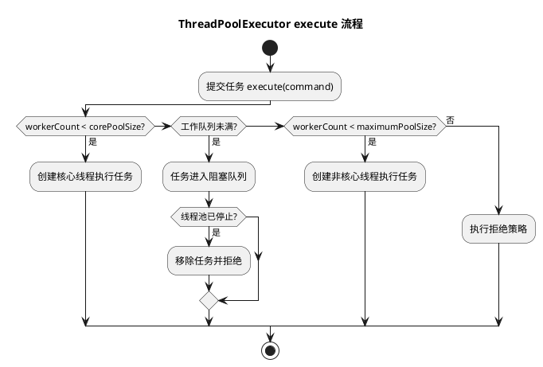

# 线程池核心原理

## 问题索引

- Q1：说一下线程池

## Q1：说一下线程池

### 背景

线程池用于复用线程、限制并发数量、统一管理任务队列和拒绝策略。

如果每来一个请求就创建一个线程，会有几个问题：

- 线程创建和销毁成本高。
- 线程数量不可控，容易把 CPU、内存和数据库连接打满。
- 缺少统一的排队、超时、降级和监控入口。

所以在 Web 请求、异步任务、消息消费、批量处理、定时任务等场景中，通常都需要线程池。

### 核心结构

`ThreadPoolExecutor` 的核心参数包括：

| 参数 | 作用 |
| --- | --- |
| `corePoolSize` | 核心线程数，长期保留的基础处理能力 |
| `maximumPoolSize` | 最大线程数，队列满后允许扩容到的上限 |
| `keepAliveTime` | 非核心线程空闲多久后回收 |
| `workQueue` | 任务等待队列 |
| `threadFactory` | 线程创建工厂，用于命名线程、设置异常处理器等 |
| `handler` | 拒绝策略，线程池和队列都无法接收任务时触发 |

线程池可以理解成：

```text
提交任务
  -> 核心线程能否处理？
  -> 队列能否排队？
  -> 最大线程数能否扩容？
  -> 触发拒绝策略
```

### 任务提交流程


### PlantUML 示意图：线程池任务提交流程



`execute()` 的核心流程是：

```text
1. 当前工作线程数 < corePoolSize
   -> 创建核心线程执行任务

2. 当前工作线程数 >= corePoolSize
   -> 尝试把任务放入 workQueue

3. 队列已满，并且当前工作线程数 < maximumPoolSize
   -> 创建非核心线程执行任务

4. 队列已满，并且线程数已经达到 maximumPoolSize
   -> 执行拒绝策略
```

这个顺序很关键。

很多人误以为线程池会先扩容到 `maximumPoolSize`，再放队列。实际不是。默认逻辑是核心线程满了以后先入队，队列满了才扩容非核心线程。

### 线程池状态

`ThreadPoolExecutor` 内部用一个 `AtomicInteger ctl` 同时保存：

- 高 3 位：线程池运行状态。
- 低 29 位：工作线程数量。

常见状态：

| 状态 | 含义 |
| --- | --- |
| `RUNNING` | 接收新任务，也处理队列任务 |
| `SHUTDOWN` | 不接收新任务，但继续处理队列任务 |
| `STOP` | 不接收新任务，不处理队列任务，并中断正在执行的任务 |
| `TIDYING` | 所有任务结束，工作线程数为 0，准备执行 terminated |
| `TERMINATED` | 线程池完全终止 |

把状态和线程数量合并到一个原子变量里，是为了在并发环境下用一次 CAS 同时判断和更新两个维度，减少锁竞争。

### 常见队列选择

| 队列 | 特点 | 适用场景 |
| --- | --- | --- |
| `ArrayBlockingQueue` | 有界数组队列 | 需要明确限制积压量 |
| `LinkedBlockingQueue` | 链表队列，可有界也可近似无界 | 任务量较平稳，但要避免无界堆积 |
| `SynchronousQueue` | 不存储任务，直接移交线程 | 任务突发、希望快速扩容线程 |
| `PriorityBlockingQueue` | 优先级队列 | 任务有优先级，但要防止低优先级饥饿 |
| `DelayQueue` | 延迟队列 | 定时、超时、延迟执行 |

线上业务更推荐有界队列。无界队列容易隐藏问题：请求高峰时任务不断堆积，最终可能导致 OOM 或延迟雪崩。

### 拒绝策略

JDK 内置拒绝策略：

| 策略 | 行为 |
| --- | --- |
| `AbortPolicy` | 直接抛出异常，默认策略 |
| `CallerRunsPolicy` | 由提交任务的线程自己执行任务 |
| `DiscardPolicy` | 直接丢弃任务，不抛异常 |
| `DiscardOldestPolicy` | 丢弃队列中最旧的任务，再尝试提交新任务 |

业务系统中通常不建议静默丢弃，除非任务本身允许丢失。更稳的做法是：

- 记录日志和监控指标。
- 返回明确失败结果。
- 降级到消息队列。
- 使用调用方执行形成反压。

### 参数怎么设置

线程池参数不能只靠固定公式，要结合任务类型、响应时间、下游容量和压测结果。

#### CPU 密集型

CPU 密集型任务主要消耗 CPU，例如加密、压缩、复杂计算。

建议：

```text
核心线程数接近 CPU 核数或 CPU 核数 + 1
队列不要太大
重点观察 CPU 使用率和上下文切换
```

#### IO 密集型

IO 密集型任务大量等待数据库、Redis、HTTP、文件 IO。

建议：

```text
线程数可以大于 CPU 核数
但必须受下游连接池、接口限流和超时控制约束
```

如果数据库连接池只有 30 个连接，线程池配置 200 个线程并不会让数据库更快，反而可能造成线程堆积和超时放大。

### 推荐写法

不要直接使用 `Executors.newFixedThreadPool()`、`newCachedThreadPool()` 这类快捷工厂作为线上默认方案，因为它们可能隐藏无界队列或无限线程数风险。

推荐显式创建：

```java
ThreadPoolExecutor executor = new ThreadPoolExecutor(
        16,
        32,
        60,
        TimeUnit.SECONDS,
        // 使用有界队列，避免高峰期无限堆积任务导致 OOM。
        new ArrayBlockingQueue<>(1000),
        runnable -> {
            Thread thread = new Thread(runnable);
            // 给线程命名，方便日志、线程栈和监控中快速定位来源。
            thread.setName("order-async-worker-" + thread.getId());
            return thread;
        },
        (task, pool) -> {
            // 自定义拒绝策略：拒绝时要有日志、指标或降级动作，不能悄悄丢任务。
            throw new RejectedExecutionException("order async executor overloaded");
        }
);
```

### 监控指标

线上排查线程池问题时重点看：

| 指标 | 说明 |
| --- | --- |
| `activeCount` | 正在执行任务的线程数 |
| `poolSize` | 当前线程数 |
| `largestPoolSize` | 曾经达到过的最大线程数 |
| `queue.size()` | 当前任务积压量 |
| `completedTaskCount` | 已完成任务数 |
| 拒绝次数 | 是否触发过拒绝策略 |
| 任务耗时 | 是否有慢任务占住线程 |

常见问题和判断：

- `activeCount` 长期接近 `maximumPoolSize`：线程池可能打满。
- `queue.size()` 持续增长：消费速度低于提交速度。
- 拒绝次数增加：容量不足或下游变慢。
- CPU 不高但线程池满：大概率是 IO 等待、锁等待或下游阻塞。
- CPU 很高且上下文切换高：线程数可能过大，或任务本身 CPU 消耗过重。

### 和 AQS 的关系

线程池本身不是直接基于 AQS 实现的核心同步器，它的主控制字段是 `ctl`，通过 CAS 管理线程池状态和工作线程数量。

但线程池和 AQS 有几个重要关联：

1. `Worker` 继承了 AQS

   `ThreadPoolExecutor.Worker` 继承 `AbstractQueuedSynchronizer`，用于实现一个不可重入的独占锁，主要用来标识 Worker 是否正在执行任务，并辅助处理中断。

2. 阻塞队列可能依赖 AQS / Condition

   例如 `ArrayBlockingQueue` 内部使用 `ReentrantLock` 和 `Condition`，而 `ReentrantLock` 基于 AQS。

3. 线程池排队和 AQS 排队思想相似

   线程池的 `workQueue` 排的是任务；AQS 的 CLH 队列排的是抢同步状态失败的线程。两者都在解决“资源有限时如何排队和唤醒”的问题，但排队对象不同。

### 业务场景

在订单系统中，支付成功后可能需要异步执行：

- 发送短信。
- 推送站内信。
- 同步营销系统。
- 生成操作日志。

这些任务不应该阻塞支付主链路，可以投递到线程池或消息队列。

如果使用本地线程池，需要注意：

- 任务是否允许丢失。
- 应用重启时未完成任务如何处理。
- 下游接口慢时是否有超时和熔断。
- 拒绝策略是否会影响主流程。

如果任务必须可靠执行，优先使用 MQ；线程池更适合进程内、可降级、短耗时的异步任务。

### 踩坑点

1. 使用无界队列导致任务堆积和 OOM。
2. 线程数配置大于下游容量，导致数据库、Redis、HTTP 连接池被打满。
3. 拒绝策略静默丢任务，线上没有感知。
4. 任务没有超时，慢任务长期占用工作线程。
5. 多个业务共用一个线程池，互相影响。
6. 没有线程命名，线程栈排查困难。
7. `submit()` 吞异常，如果不调用 `Future.get()`，异常可能不明显。

### 面试话术

> 线程池的核心价值是复用线程、控制并发、任务排队和统一拒绝处理。`ThreadPoolExecutor` 的关键参数包括核心线程数、最大线程数、空闲回收时间、阻塞队列、线程工厂和拒绝策略。任务提交时，先看核心线程是否满，核心线程满了就入队，队列满了才扩容到最大线程数，仍然无法处理才触发拒绝策略。线上配置要结合任务类型、下游容量和压测结果，通常要使用有界队列、明确拒绝策略、线程命名和监控指标。它和 AQS 的关系在于：线程池的 `Worker` 继承了 AQS，阻塞队列里的锁也可能基于 AQS，但线程池主流程主要靠 `ctl` 和 CAS 管理状态与线程数量。

## 高频追问

- Q：为什么不推荐直接用 `Executors`？
  A：因为部分快捷工厂会使用无界队列或不受控的最大线程数，容易导致 OOM 或线程数量失控。

- Q：线程池为什么先入队再扩容到最大线程数？
  A：这是 `ThreadPoolExecutor` 默认任务提交流程。核心线程满后优先用队列缓冲任务，队列满了才说明积压严重，需要扩容非核心线程。

- Q：线程池满了怎么办？
  A：先看队列、活跃线程数、任务耗时和下游耗时。处理上可以限流、降级、调大合理参数、拆分线程池、优化慢任务，可靠任务应转 MQ。

- Q：线程池和 AQS 是什么关系？
  A：线程池主状态不是 AQS 管的，而是 `ctl` 管理；但 `Worker` 继承 AQS，阻塞队列中的锁也可能基于 AQS。

## 复习清单

- [ ] 能说清核心线程、最大线程和队列的关系
- [ ] 能画出 `execute()` 提交流程
- [ ] 能解释为什么线上要使用有界队列
- [ ] 能说出四种拒绝策略
- [ ] 能结合 CPU / IO 密集型说明参数设置思路
- [ ] 能说明线程池和 AQS 的关系
- [ ] 能列出线程池线上监控指标

