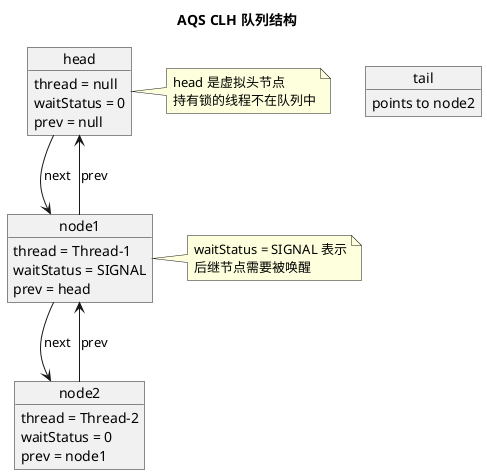
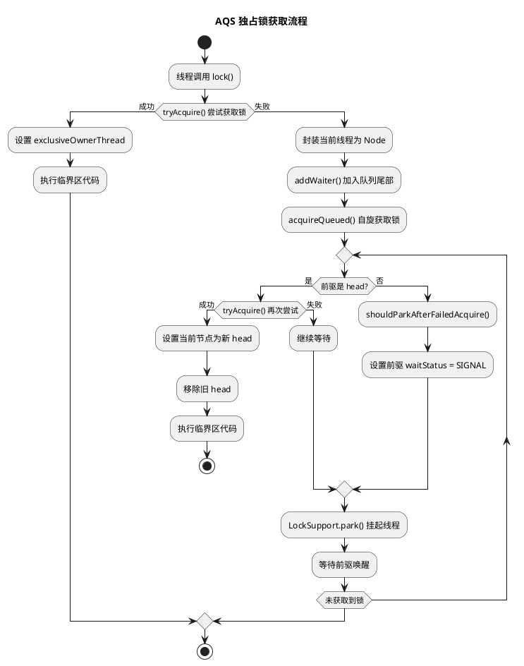
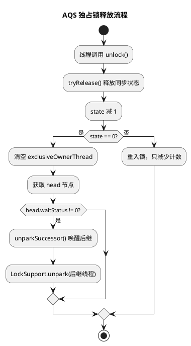
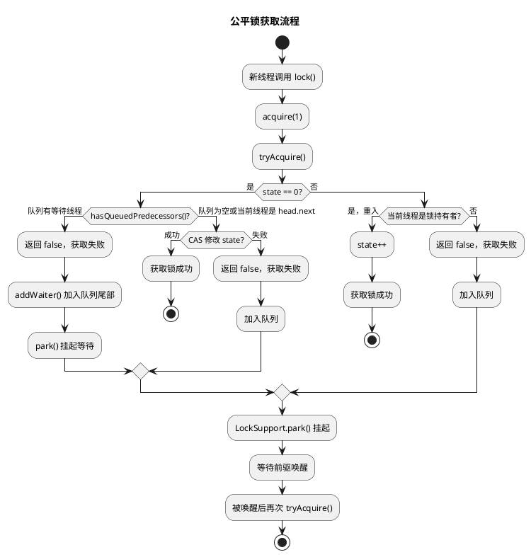

# AQS 与 ReentrantLock 公平锁

## 问题索引

- Q1：AQS 的核心思想是什么？
- Q2：ReentrantLock 的公平锁和非公平锁有什么区别？
- Q3：volatile 的"写前读后"语义是什么？

## Q1：AQS 的核心思想是什么？

### 背景

AQS（AbstractQueuedSynchronizer）是 JUC 并发包中很多同步器的基础框架，理解 AQS 是掌握 Java 并发编程的关键。

### 核心原理

AQS 的核心思想可以概括为：**状态 + 队列**。

```text
volatile int state + CAS + CLH FIFO 等待队列
```

#### 同步状态 state

AQS 内部维护一个 `volatile int state` 表示同步状态。

不同同步器对 `state` 的解释不同：

- `ReentrantLock`：`state` 表示锁重入次数（0 表示未加锁，> 0 表示持有锁的次数）。
- `Semaphore`：`state` 表示剩余许可证数量。
- `CountDownLatch`：`state` 表示剩余倒计数。
- `ReentrantReadWriteLock`：`state` 的高 16 位表示读锁状态，低 16 位表示写锁状态。

通过 `volatile` 保证可见性，通过 CAS 保证修改的原子性。

#### CLH 等待队列

当线程无法获取同步状态时（例如锁已被占用），线程会被封装成 `Node` 节点加入 CLH FIFO 双向链表队列。

队列结构：



关键字段：

- `head`：队列头节点，通常是虚拟节点或刚获取到锁的节点。
- `tail`：队列尾节点，新加入的线程节点添加到尾部。
- `Node.thread`：封装的等待线程。
- `Node.waitStatus`：节点状态，常用值包括：
  - `SIGNAL(-1)`：后继节点需要被唤醒。
  - `CANCELLED(1)`：节点已取消。
  - `CONDITION(-2)`：节点在条件队列中。
  - `0`：初始状态。
- `Node.prev / next`：前驱和后继指针。

#### 独占模式和共享模式

AQS 支持两种模式：

**独占模式（Exclusive）**：

- 同一时刻只有一个线程能获取同步状态。
- 典型代表：`ReentrantLock`、`ReentrantReadWriteLock` 的写锁。
- 核心方法：`tryAcquire()` 和 `tryRelease()`。

**共享模式（Shared）**：

- 同一时刻可以有多个线程获取同步状态。
- 典型代表：`Semaphore`、`CountDownLatch`、`ReentrantReadWriteLock` 的读锁。
- 核心方法：`tryAcquireShared()` 和 `tryReleaseShared()`。

### AQS 工作流程

以独占锁为例：



释放流程：



关键点：

1. **只有前驱是 head 的节点才有资格尝试获取锁**，这保证了 FIFO 顺序。
2. 线程在获取锁失败后会通过 `LockSupport.park()` 挂起，避免空自旋浪费 CPU。
3. 前驱释放锁时会通过 `LockSupport.unpark()` 唤醒后继节点。

### 为什么使用双向链表

AQS 的 CLH 队列是双向链表而非单向链表，原因包括：

- **取消节点的移除**：当线程因超时或中断取消等待时，需要修改前驱的 `next` 指针，双向链表更高效。
- **唤醒后继节点**：释放锁时需要找到后继节点唤醒，`next` 指针可能为 null（新节点正在入队），此时需要从 `tail` 向前遍历找到最靠前的有效后继。

## Q2：ReentrantLock 的公平锁和非公平锁有什么区别？

### 背景

`ReentrantLock` 支持公平锁和非公平锁两种策略，默认是非公平锁。

### 核心原理

#### 非公平锁（默认）

```java
// 非公平锁的 lock() 流程
final void lock() {
    // 直接尝试 CAS 抢锁，不管队列里是否有等待线程
    if (compareAndSetState(0, 1))
        setExclusiveOwnerThread(Thread.currentThread());
    else
        acquire(1); // 失败后才进入队列
}

// 非公平锁的 tryAcquire()
protected final boolean tryAcquire(int acquires) {
    final Thread current = Thread.currentThread();
    int c = getState();
    if (c == 0) {
        // 直接 CAS，不检查队列
        if (compareAndSetState(0, acquires)) {
            setExclusiveOwnerThread(current);
            return true;
        }
    } else if (current == getExclusiveOwnerThread()) {
        // 重入逻辑
        setState(c + acquires);
        return true;
    }
    return false;
}
```

#### 公平锁

```java
// 公平锁的 lock() 流程
final void lock() {
    acquire(1); // 直接调用 acquire，不抢
}

// 公平锁的 tryAcquire()
protected final boolean tryAcquire(int acquires) {
    final Thread current = Thread.currentThread();
    int c = getState();
    if (c == 0) {
        // 关键：先检查队列中是否有前驱等待
        if (!hasQueuedPredecessors() &&
            compareAndSetState(0, acquires)) {
            setExclusiveOwnerThread(current);
            return true;
        }
    } else if (current == getExclusiveOwnerThread()) {
        // 重入逻辑
        setState(c + acquires);
        return true;
    }
    return false;
}

// hasQueuedPredecessors() 检查是否有前驱
public final boolean hasQueuedPredecessors() {
    Node t = tail;
    Node h = head;
    Node s;
    // 队列不为空 && (head 的后继不是当前线程)
    return h != t &&
        ((s = h.next) == null || s.thread != Thread.currentThread());
}
```

### 公平锁如何保证 FIFO

公平锁的 FIFO 保证依赖两个关键机制：

#### 1. 入队前检查：hasQueuedPredecessors()

新线程尝试获取锁时，会先调用 `hasQueuedPredecessors()` 检查队列中是否有等待线程：

- 如果队列为空（`head == tail`），返回 `false`，允许当前线程尝试获取锁。
- 如果队列不为空且 `head.next` 不是当前线程，返回 `true`，当前线程必须排队。

这避免了新线程"插队"。



#### 2. 队列内部的 FIFO 唤醒

一旦线程进入队列，AQS 的 `acquireQueued()` 方法保证：

- 只有前驱是 `head` 的节点才有资格尝试 `tryAcquire()`。
- 其他节点会被 `park()` 挂起，直到前驱释放锁并唤醒它。

这保证了队列内部严格按照入队顺序获取锁。

### 公平锁 vs 非公平锁对比

| 特性 | 公平锁 | 非公平锁 |
|------|--------|----------|
| **获取策略** | 严格按照队列 FIFO 顺序 | 新线程可以直接抢锁 |
| **是否检查队列** | `hasQueuedPredecessors()` 检查队列 | 直接 CAS 抢锁 |
| **吞吐量** | 较低 | 较高 |
| **上下文切换** | 频繁挂起/唤醒 | 减少线程切换 |
| **线程饥饿** | 不会饥饿 | 可能饥饿 |
| **适用场景** | 需要严格公平性的场景 | 追求吞吐量的场景 |

### 公平锁的性能开销

公平锁的性能开销主要来自：

1. **频繁的线程切换**：
   - 即使锁刚释放，新线程也必须排队，导致更多的 `park()/unpark()` 调用。
   - 非公平锁允许新线程抢锁，如果成功则避免了一次线程切换。

2. **缓存失效**：
   - 线程切换会导致 CPU 缓存失效，影响性能。
   - 非公平锁如果新线程抢锁成功，可能刚好在同一个 CPU 核心上运行，缓存命中率更高。

3. **额外的队列检查**：
   - `hasQueuedPredecessors()` 需要读取 `head` 和 `tail`，增加了开销。

**性能差异**：

在高并发场景下，非公平锁的吞吐量通常是公平锁的几倍到十几倍。

**何时使用公平锁**：

- 需要严格保证等待顺序（例如按照请求时间处理任务）。
- 避免线程饥饿的场景（例如某些线程可能长时间得不到锁）。
- 对吞吐量要求不高，但对公平性要求高的场景。

大多数情况下，**非公平锁是更好的选择**。

## Q3：volatile 的"写前读后"语义是什么？

### 背景

`volatile` 是 Java 中最轻量级的同步机制，它保证了可见性和有序性，但不保证原子性。

理解 `volatile` 的语义对掌握 JMM（Java Memory Model）和并发编程至关重要。

### 核心原理

#### volatile 的两大语义

**1. 可见性**：

对 `volatile` 变量的写操作会立即刷新到主内存，对 `volatile` 变量的读操作会直接从主内存读取最新值。

```java
volatile boolean flag = false;

// 线程 A
flag = true; // 写入后立即刷新到主内存

// 线程 B
if (flag) { // 从主内存读取最新值
    // ...
}
```

**2. 有序性**：

`volatile` 通过插入内存屏障禁止指令重排序，保证：

- `volatile` 写之前的所有操作不会被重排序到 `volatile` 写之后。
- `volatile` 读之后的所有操作不会被重排序到 `volatile` 读之前。

#### volatile 的 happens-before 规则

JMM 定义的 `volatile` 变量规则（Happens-Before）：

```text
对一个 volatile 变量的写操作 happens-before 后续对该变量的读操作。
```

这意味着：

- 线程 A 写 `volatile` 变量之前的所有操作，对线程 B 读 `volatile` 变量之后的所有操作可见。

```java
class VolatileExample {
    int a = 0;
    volatile boolean flag = false;

    // 线程 A
    public void writer() {
        a = 1;           // 1
        flag = true;     // 2 volatile 写
    }

    // 线程 B
    public void reader() {
        if (flag) {      // 3 volatile 读
            int i = a;   // 4 一定能看到 a = 1
        }
    }
}
```

**执行顺序分析**：

1. 线程 A 执行 `a = 1`（普通写）。
2. 线程 A 执行 `flag = true`（volatile 写）。
3. 线程 B 执行 `if (flag)`（volatile 读），如果读到 `true`。
4. 线程 B 执行 `int i = a`，此时一定能看到 `a = 1`。

**关键**：`volatile` 写之前的所有操作（包括普通变量的写）对后续的 `volatile` 读及其之后的操作可见。

#### 什么是"写前读后"

`volatile` 的"写前读后"是对其语义的简化表述：

**写前**：

- `volatile` 写之前的所有操作（包括普通变量）不会被重排序到 `volatile` 写之后。
- `volatile` 写会插入 `StoreStore` 屏障（写-写屏障）和 `StoreLoad` 屏障（写-读屏障）。

```text
普通写 1
普通写 2
StoreStore 屏障  // 禁止前面的写与后面的 volatile 写重排序
volatile 写
StoreLoad 屏障   // 禁止 volatile 写与后面的读重排序
```

**读后**：

- `volatile` 读之后的所有操作不会被重排序到 `volatile` 读之前。
- `volatile` 读会插入 `LoadLoad` 屏障（读-读屏障）和 `LoadStore` 屏障（读-写屏障）。

```text
LoadLoad 屏障    // 禁止后面的读与前面的 volatile 读重排序
volatile 读
LoadStore 屏障   // 禁止后面的写与前面的 volatile 读重排序
普通读 1
普通写 1
```

### volatile 为什么不能保证原子性

`volatile` 只保证可见性和有序性，**不保证原子性**。

#### 示例：volatile 的原子性问题

```java
public class VolatileAtomicityTest {
    volatile int count = 0;

    public void increment() {
        count++; // 非原子操作
    }

    public static void main(String[] args) throws InterruptedException {
        VolatileAtomicityTest test = new VolatileAtomicityTest();
        Thread[] threads = new Thread[10];
        
        for (int i = 0; i < 10; i++) {
            threads[i] = new Thread(() -> {
                for (int j = 0; j < 1000; j++) {
                    test.increment();
                }
            });
            threads[i].start();
        }
        
        for (Thread thread : threads) {
            thread.join();
        }
        
        System.out.println("Final count: " + test.count); 
        // 预期 10000，实际可能小于 10000
    }
}
```

#### 原因分析

`count++` 不是原子操作，它包含三个步骤：

1. **读取** `count` 的值到寄存器。
2. **计算** 寄存器值 + 1。
3. **写回** 结果到 `count`。

即使 `count` 是 `volatile`，多个线程执行 `count++` 时仍可能发生：

```text
线程 A：读取 count = 0
线程 B：读取 count = 0
线程 A：计算 0 + 1 = 1
线程 A：写回 count = 1（刷新到主内存）
线程 B：计算 0 + 1 = 1
线程 B：写回 count = 1（覆盖了线程 A 的结果）
```

结果：两次 `count++` 操作，`count` 只增加了 1。

#### 解决方案

1. **使用 synchronized**：

```java
public synchronized void increment() {
    count++;
}
```

2. **使用 Lock**：

```java
private final Lock lock = new ReentrantLock();

public void increment() {
    lock.lock();
    try {
        count++;
    } finally {
        lock.unlock();
    }
}
```

3. **使用 AtomicInteger**：

```java
private AtomicInteger count = new AtomicInteger(0);

public void increment() {
    count.incrementAndGet(); // CAS 保证原子性
}
```

### volatile 的适用场景

`volatile` 适合以下场景：

1. **状态标志**：

```java
volatile boolean shutdown = false;

// 线程 A
public void shutdown() {
    shutdown = true;
}

// 线程 B
public void doWork() {
    while (!shutdown) {
        // 执行任务
    }
}
```

2. **单次安全发布（双重检查锁定）**：

```java
public class Singleton {
    private volatile static Singleton instance;

    public static Singleton getInstance() {
        if (instance == null) { // 第一次检查，避免不必要的同步
            synchronized (Singleton.class) {
                if (instance == null) { // 第二次检查，避免重复创建
                    instance = new Singleton(); // volatile 防止指令重排序
                }
            }
        }
        return instance;
    }
}
```

`volatile` 的作用：

- 防止 `instance = new Singleton()` 的指令重排序。
- 该语句包含：分配内存 → 初始化对象 → 引用指向内存。
- 如果重排序为：分配内存 → 引用指向内存 → 初始化对象，其他线程可能读到未初始化的对象。

3. **读多写少的场景**：

```java
public class Config {
    private volatile Map<String, String> config = new HashMap<>();

    // 读操作（高频）
    public String get(String key) {
        return config.get(key); // volatile 保证可见性
    }

    // 写操作（低频）
    public synchronized void update(Map<String, String> newConfig) {
        config = newConfig; // volatile 保证引用的可见性
    }
}
```

## 面试追问

**Q1：AQS 的 CLH 队列为什么是双向链表而不是单向链表？**

A：主要是为了支持节点取消和反向遍历。当线程因超时或中断取消等待时，需要修改前驱的 `next` 指针跳过当前节点，双向链表更高效。另外，释放锁唤醒后继时，`next` 指针可能为 null（新节点正在入队），此时需要从 `tail` 向前遍历找到有效后继。

**Q2：公平锁一定不会发生线程饥饿吗？**

A：公平锁保证了 FIFO 顺序，理论上不会饥饿。但如果持有锁的线程长时间不释放（例如死锁、死循环），队列中的所有线程都会饥饿。公平锁解决的是"抢锁顺序"的公平，不解决"锁持有时间"的问题。

**Q3：为什么 ReentrantLock 默认是非公平锁？**

A：因为非公平锁性能更好。非公平锁允许新线程直接抢锁，如果成功则避免了线程切换和缓存失效的开销。在高并发场景下，非公平锁的吞吐量通常是公平锁的几倍。除非业务场景明确需要公平性，否则非公平锁是更好的选择。

**Q4：volatile 能替代 synchronized 吗？**

A：不能完全替代。`volatile` 只保证可见性和有序性，不保证原子性，只适合读多写少且操作本身是原子的场景（例如状态标志、单次安全发布）。`synchronized` 保证原子性、可见性和有序性，适合复合操作（例如 `count++`、`if-then-act`）。

**Q5：双重检查锁定为什么需要 volatile？**

A：防止指令重排序。`instance = new Singleton()` 包含三个步骤：分配内存、初始化对象、引用指向内存。如果重排序为"分配内存 → 引用指向内存 → 初始化对象"，其他线程可能读到 `instance != null` 但对象未初始化的情况，导致 NPE 或使用未初始化的字段。`volatile` 禁止这种重排序。

**Q6：AQS 如何避免虚假唤醒？**

A：AQS 的 `acquireQueued()` 方法使用 `for (;;)` 循环，线程被唤醒后会再次检查条件（`tryAcquire()`），只有成功获取锁才退出循环。即使发生虚假唤醒（spurious wakeup），线程也会重新进入等待状态，不会错误地执行临界区代码。

**Q7：volatile 的内存屏障具体是什么？**

A：内存屏障（Memory Barrier）是 CPU 指令，用于禁止特定类型的指令重排序和强制缓存刷新：

- `LoadLoad`：禁止读-读重排序。
- `StoreStore`：禁止写-写重排序。
- `LoadStore`：禁止读-写重排序。
- `StoreLoad`：禁止写-读重排序（开销最大，相当于全屏障）。

`volatile` 写会插入 `StoreStore` 和 `StoreLoad` 屏障，`volatile` 读会插入 `LoadLoad` 和 `LoadStore` 屏障。

## 复习清单

- [ ] 能用"状态 + 队列"概括 AQS 核心思想
- [ ] 能画出 AQS CLH 队列结构和节点状态
- [ ] 能说清独占模式和共享模式的区别
- [ ] 能解释公平锁的 `hasQueuedPredecessors()` 原理
- [ ] 能对比公平锁和非公平锁的性能差异
- [ ] 能说清 `volatile` 的可见性和有序性语义
- [ ] 能解释 `volatile` 的 happens-before 规则
- [ ] 能举例说明 `volatile` 为什么不保证原子性
- [ ] 能说出 `volatile` 的三种典型应用场景
- [ ] 能解释双重检查锁定为什么需要 `volatile`
