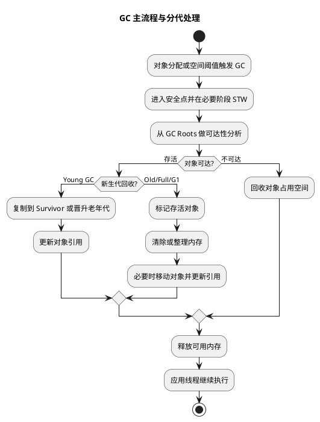

# GC 过程

## 问题索引

- Q1：说一下 GC 的过程
- Q2：GC Roots 为什么包含虚拟机栈中的局部变量引用？局部变量不是会随线程结束消亡吗？
- Q3：新生代复制算法会改变对象地址吗？引用如何更新？内存碎片会导致什么问题？
- Q4：说一下卡表和记忆集
- Q5：对比 GC 收集器，从 STW 等方面解释分析
- Q6：并发标记如何保证最终回收的对象是正确的，并且尽可能减少遗漏？

## Q1：说一下 GC 的过程

### 背景

GC 是 JVM 自动内存管理的核心。面试里问“GC 的过程”，不是只问“垃圾回收是什么”，而是希望能说清楚：

- 什么时候触发 GC。
- JVM 怎么判断一个对象是不是垃圾。
- 垃圾对象怎么被回收。
- 新生代、老年代、G1 等不同场景下 GC 流程有什么差异。

### 核心结论

GC 的核心过程可以概括为四步：

1. 触发 GC：对象分配失败、老年代空间不足、元空间不足、主动调用 `System.gc()`、G1 预测需要回收等。
2. 判断对象是否存活：从 GC Roots 出发做可达性分析，不可达对象就是可回收对象。
3. 执行垃圾回收算法：常见有复制、标记-清除、标记-整理。
4. 整理内存并恢复程序执行：回收无用对象，必要时移动存活对象，更新引用关系。

简单说就是：

```text
触发 GC
  -> 从 GC Roots 找存活对象
  -> 清理不可达对象
  -> 复制或整理存活对象
  -> 释放空间，应用线程继续执行
```

### PlantUML 示意图



### 第一步：什么时候触发 GC

常见触发场景：

- Eden 区空间不足：触发 Minor GC / Young GC。
- 老年代空间不足：可能触发 Major GC 或 Full GC。
- 元空间不足：可能触发 Full GC，尝试卸载无用类。
- 大对象分配失败：对象直接进入老年代或 Humongous Region 时空间不足。
- `System.gc()`：建议 JVM 执行 Full GC，但不保证一定执行。
- G1 达到 IHOP 阈值：启动并发标记，为后续 Mixed GC 做准备。

实际项目中最常见的是对象分配太快，Eden 很快被填满，于是频繁 Young GC。

### 第二步：怎么判断对象是否存活

现代 JVM 通常使用可达性分析，而不是单纯引用计数。

可达性分析的思路：

从一组 GC Roots 作为起点，沿着引用链向下搜索。能被搜索到的对象是存活对象；搜索不到的对象就是不可达对象，可以被回收。

常见 GC Roots 包括：

- 虚拟机栈中的局部变量引用，例如方法参数、局部变量。
- 方法区中的静态变量引用。
- 方法区中的常量引用。
- 本地方法栈中 JNI 引用。
- 被 synchronized 持有的对象。
- JVM 内部引用，例如 Class 对象、系统类加载器等。

为什么不用引用计数？

引用计数很简单，但解决不了循环引用问题。例如 A 引用 B，B 引用 A，如果它们和 GC Roots 都不可达，引用计数仍然不为 0，但实际上应该被回收。

### 第三步：执行什么回收算法

不同内存区域和垃圾收集器会选择不同算法。

#### 复制算法

复制算法常用于新生代。

流程：

1. 将内存分成 Eden、Survivor From、Survivor To。
2. 新对象优先进入 Eden。
3. Young GC 时，把 Eden 和 From 中存活对象复制到 To。
4. 清空 Eden 和 From。
5. From 和 To 角色交换。

优点：

- 回收速度快。
- 没有内存碎片。

缺点：

- 需要预留一块 Survivor 空间。
- 如果存活对象太多，复制成本会升高。

#### 标记-清除

标记-清除常用于老年代早期算法或部分回收阶段。

流程：

1. 标记所有存活对象。
2. 清除未标记对象。

优点：

- 不需要移动对象，过程相对直接。

缺点：

- 会产生内存碎片。
- 碎片太多时，大对象可能分配失败。

#### 标记-整理

标记-整理常用于老年代。

流程：

1. 标记所有存活对象。
2. 将存活对象向一端移动。
3. 清理边界外的内存。

优点：

- 解决内存碎片问题。

缺点：

- 移动对象需要更新引用，成本比单纯清除更高。

### 第四步：不同 GC 类型的过程

#### Young GC / Minor GC

Young GC 主要回收新生代。

典型过程：

1. 新对象不断分配到 Eden。
2. Eden 空间不足，触发 Young GC。
3. JVM 暂停用户线程，也就是 STW。
4. 从 GC Roots 扫描，找出 Eden 和 Survivor 中的存活对象。
5. 存活对象复制到另一个 Survivor 区，年龄加 1。
6. 年龄达到阈值，或者 Survivor 放不下的对象晋升到老年代。
7. 清空 Eden 和原 Survivor，用户线程恢复执行。

Young GC 通常频率较高，但单次停顿时间相对较短。

#### Major GC / Old GC

Major GC 通常指针对老年代的回收，但不同资料和不同收集器里叫法不完全统一。

老年代对象一般生命周期更长，存活率更高，所以回收成本更高。

典型场景：

- 老年代空间不足。
- 新生代对象晋升时老年代放不下。
- 大对象直接进入老年代导致空间紧张。

老年代常用标记-清除或标记-整理思路。因为老年代对象存活率较高，如果用复制算法，复制成本会很高。

#### Full GC

Full GC 通常会回收整个 Java 堆，并可能涉及方法区或元空间。

常见触发场景：

- 老年代空间不足。
- 元空间不足。
- 显式调用 `System.gc()`。
- Minor GC 前空间担保失败。
- CMS 并发失败或 G1 晋升失败。

Full GC 的特点：

- 通常会 STW。
- 回收范围大。
- 停顿时间明显长于 Young GC。
- 线上系统要重点关注 Full GC 频率和耗时。

#### G1 GC 的过程

G1 的堆被划分为多个 Region，不再是简单连续的新生代和老年代。

G1 的常见过程：

1. Young GC：回收 Eden 和 Survivor Region。
2. 并发标记：当老年代占用达到阈值，开始标记整个堆的存活对象。
3. Remark：短暂停顿，修正并发标记期间引用变化。
4. Cleanup：统计每个 Region 的垃圾比例和回收价值。
5. Mixed GC：选择部分收益高的 Old Region，和 Young Region 一起回收。

G1 的核心思想不是一次性回收整个老年代，而是优先回收垃圾最多、收益最高的 Region，尽量把停顿控制在目标范围内。

### STW 在 GC 中的作用

STW 是 Stop The World，表示暂停用户线程。

为什么需要 STW？

因为 GC 在判断对象引用关系时，如果用户线程还在持续修改引用，GC 看到的对象图就可能不一致。暂停用户线程可以让 JVM 在某些关键阶段获得相对稳定的对象关系。

不过现代垃圾收集器会尽量减少 STW 时间，例如把标记、清理、复制等步骤拆成并发阶段和短暂停顿阶段。

### 对象晋升过程

对象不一定一直待在新生代。

常见晋升规则：

- 对象年龄达到阈值，晋升到老年代。
- Survivor 区空间不足，部分对象提前晋升。
- 大对象可能直接进入老年代。
- 动态年龄判断：如果某个年龄段对象总大小超过 Survivor 的一半，大于等于该年龄的对象可能直接晋升。

这也是为什么业务代码中大量创建大对象、长生命周期集合、缓存不释放，很容易导致老年代压力增大。

### 业务场景

项目中 GC 过程常用于解释这些问题：

- 接口偶发慢：可能是 Young GC 或 Full GC 造成 STW。
- CPU 升高：可能是频繁 GC，应用线程和 GC 线程都在抢 CPU。
- 服务吞吐下降：对象创建太快，Eden 很快打满，GC 频率过高。
- Full GC 频繁：老年代对象过多、缓存未释放、大对象过多、晋升过快。
- 容器 OOM：不只看堆，还要结合元空间、直接内存、线程栈。

### 排查思路

排查 GC 问题时，一般按这个顺序：

1. 先看 GC 日志：确认是 Young GC 频繁，还是 Full GC 频繁。
2. 看 GC 前后内存变化：确认每次 GC 是否能有效回收。
3. 看对象分配速率：判断是否存在短时间大量对象创建。
4. 看老年代增长趋势：判断是否有对象长期存活或内存泄漏。
5. 导出堆 dump：用 MAT 分析大对象、引用链、泄漏嫌疑对象。
6. 结合业务代码：检查缓存、集合、批量查询、大对象、线程池任务堆积。

### 面试话术

> GC 的过程可以分为触发、标记、回收和整理。首先，当 Eden 空间不足、老年代空间不足、元空间不足或大对象分配失败时，会触发不同类型的 GC。然后 JVM 会从 GC Roots 出发做可达性分析，能被访问到的对象认为是存活对象，不可达对象就是垃圾对象。接着根据不同区域使用不同算法，新生代通常使用复制算法，把存活对象从 Eden 和一个 Survivor 复制到另一个 Survivor，年龄增长后可能晋升老年代；老年代因为对象存活率高，通常使用标记-清除或标记-整理。Full GC 会回收范围更大，停顿更明显。像 G1 会把堆拆成 Region，通过并发标记和 Mixed GC 优先回收收益最高的 Region，从而控制停顿时间。

## Q2：GC Roots 为什么包含虚拟机栈中的局部变量引用？局部变量不是会随线程结束消亡吗？

### 核心结论

局部变量确实会随着方法结束、栈帧出栈，或者线程结束而消亡。

但 GC 判断对象是否存活时，看的不是“这个局部变量将来会不会消亡”，而是“GC 发生的这一刻，这个局部变量所在的栈帧是否还活着，以及它是否还引用着堆里的对象”。

只要方法还没执行完，当前栈帧还在线程栈里，局部变量表里的对象引用就可能作为 GC Roots。它引用到的堆对象就被认为是可达对象，不能被回收。

### 为什么局部变量能作为 GC Roots

Java 对象本体通常在堆里，局部变量表里存的是对象引用。

例如：

```java
public void handleOrder() {
    // order 是局部变量，变量本身在当前方法的栈帧局部变量表里
    // new Order() 创建出来的对象在堆里
    Order order = new Order();

    // 当前方法还没有结束时，order 仍然引用堆中的 Order 对象
    // 如果此时发生 GC，GC 会从当前线程栈帧的局部变量表出发扫描到 order
    doSomething(order);
}
```

这时关系是：

```text
当前线程栈帧的局部变量表
  -> order 引用
    -> 堆中的 Order 对象
```

如果 GC 在 `handleOrder()` 方法执行期间发生，那么 `order` 所引用的对象是从 GC Roots 可达的，所以不能回收。

### 方法结束后会怎样

方法执行结束后，当前栈帧会出栈，局部变量表也就失效了。此时如果没有其他地方引用这个 `Order` 对象，它就不再可达，下一次 GC 时可以被回收。

也就是说：

```text
方法执行中：
线程栈帧还存在 -> 局部变量引用还存在 -> 堆对象可达 -> 不能回收

方法执行结束：
栈帧出栈 -> 局部变量引用消失 -> 如果没有其他引用 -> 堆对象可回收
```

### 线程结束后会怎样

线程结束时，它的 Java 虚拟机栈会整体销毁，栈帧里的局部变量引用也都会消失。

所以你的理解“局部变量会随着线程结束而消亡”是对的，只是要补一个时间点：

- 线程还活着、方法还在执行：局部变量引用可能是 GC Roots。
- 方法结束：对应栈帧消失，局部变量引用失效。
- 线程结束：整个线程栈消失，里面所有栈帧引用都失效。

GC Roots 是一个“当前时刻”的概念，不是永久身份。

### 局部变量不再使用但方法还没结束时会怎样

这里还有一个容易被追问的点：如果方法还没结束，但局部变量后面已经不再使用，它引用的对象还能不能被回收？

答案是：有可能可以，取决于局部变量槽位是否还被认为有效，以及 JIT 编译优化后的结果。

看一个例子：

```java
public void process() {
    // data 引用一个很大的 byte 数组，对象本体在堆里
    byte[] data = new byte[100 * 1024 * 1024];

    // 使用 data 完成业务处理
    use(data);

    // 如果后续代码很长，而 data 不再使用，可以主动置空，帮助 GC 更早判断它不可达
    data = null;

    // 当前方法还没结束，但 data 已经不再引用那个大数组
    doOtherLongTask();
}
```

`data = null` 的意义是让局部变量槽位不再持有大对象引用。这样如果 `doOtherLongTask()` 执行期间发生 GC，那个大数组就更有机会被回收。

不过在现代 JVM 中，JIT 可能通过活跃变量分析发现 `data` 后续不再使用，即使不手动置空，也可能不再把它当作有效引用。但在解释执行、调试场景、复杂控制流或者大对象占用明显时，手动置空仍然是一种可以理解的优化手段。

### 和局部变量表 Slot 的关系

虚拟机栈中的局部变量不是一个抽象概念，具体落在栈帧的局部变量表 Slot 里。

如果某个 Slot 里还保存着对象引用，GC 扫描线程栈时就可能把这个引用作为根。

如果这个 Slot 被复用，或者被赋值为 `null`，原来的对象引用就不存在了。

例如：

```java
public void slotReuse() {
    {
        // buffer 引用堆上的大数组
        byte[] buffer = new byte[100 * 1024 * 1024];
        use(buffer);
    }

    // 局部作用域结束不等于方法栈帧立刻结束
    // 如果对应 Slot 没有被复用，某些情况下引用可能还残留在局部变量表里
    int value = 1;

    // 后续发生 GC 时，是否还能扫描到 buffer，取决于 Slot 复用和 JIT 活跃变量分析
    useValue(value);
}
```

所以面试里更准确的说法是：GC Roots 包含“当前线程虚拟机栈中仍然有效的引用”，不是所有历史上出现过的局部变量。

### 面试话术

> 局部变量会随着方法结束或线程结束而消亡，这个没错。但 GC Roots 是看 GC 发生那一刻的对象可达性。如果某个方法还在执行，它的栈帧还在线程栈中，局部变量表里的对象引用仍然指向堆对象，那么这个引用就可以作为 GC Roots，被它引用的对象就是存活对象。等方法结束栈帧出栈，或者线程结束整个栈销毁后，这些局部变量引用就消失了。如果没有其他引用，堆对象下一次 GC 就可以被回收。

## Q3：新生代复制算法会改变对象地址吗？引用如何更新？内存碎片会导致什么问题？

### 核心结论

新生代复制算法会把存活对象从 Eden / From Survivor 复制到 To Survivor，复制后对象地址通常会发生变化。既然对象地址变了，所有仍然指向这个对象的引用都必须更新为新地址，否则程序后续访问到的就是旧地址。

标记-整理也有同样问题。它会把存活对象向一端移动，移动后对象地址也会变化，所以同样需要更新引用。

标记-清除不移动对象，因此通常不需要因为“对象移动”而更新引用，但它会留下不连续的空闲内存，也就是内存碎片。碎片太多时，即使总空闲内存足够，也可能找不到一块连续空间来分配大对象。

### 复制后对象地址为什么会变

复制算法的核心动作就是移动存活对象。

```text
GC 前：
Eden: [对象A][垃圾][对象B][垃圾]
From: [对象C][垃圾]
To:   [空]

GC 后：
Eden: [清空]
From: [清空]
To:   [对象A'][对象B'][对象C']
```

这里的 `对象A'`、`对象B'`、`对象C'` 是复制到新区域后的对象。它们的内容来自原对象，但内存地址已经变了。

### 引用为什么必须更新

对象地址变化后，原来所有指向旧地址的引用都要改成新地址。

例如：

```java
public class CopyGcExample {
    public void run() {
        // user 引用保存在当前方法的栈帧局部变量表中
        // new User() 创建出来的对象在堆中的 Eden 区
        User user = new User();

        // order 对象内部也可能持有 user 的引用
        Order order = new Order(user);

        // 如果此时发生 Young GC，user 被复制到 To Survivor 后地址会变化
        // JVM 必须把局部变量表里的 user 引用，以及 order 内部的 user 引用，都更新为新地址
        use(order);
    }
}
```

GC 需要更新的引用来源包括：

- 线程栈中的局部变量引用。
- 对象字段里的引用。
- 静态变量引用。
- JNI 引用。
- 老年代对象引用新生代对象的跨代引用。
- 其他 GC Roots 或已扫描对象中的引用。

如果不更新引用，程序继续执行时就可能访问旧地址，而旧地址所在区域已经被清空或重新分配，这是绝对不允许的。

### JVM 怎么知道旧地址对应的新地址

对象复制时，GC 会记录旧对象到新对象的映射关系。不同 JVM 和收集器实现细节不同，但核心思想是：移动对象时要能找到“旧地址 -> 新地址”的对应关系，然后在扫描引用时把引用修正到新地址。

常见做法包括：

- 在对象头或转发表中记录转发地址。
- 复制对象后，扫描 GC Roots 和存活对象字段，把旧引用改写为新引用。
- 对跨代引用使用卡表、记忆集等结构缩小扫描范围。

可以把它理解成搬家：对象搬到了新房子，所有通讯录里写着旧地址的地方都要改成新地址。

### 标记-整理是否也要更新引用

要。

标记-整理的过程是：

1. 标记存活对象。
2. 计算存活对象移动后的新位置。
3. 移动存活对象，让它们在内存中更紧凑。
4. 更新所有指向这些对象的引用。
5. 清理边界外的空闲区域。

所以标记-整理解决了碎片问题，但代价是移动对象和更新引用的成本更高。

对比一下：

| 算法 | 是否移动对象 | 是否需要更新引用 | 是否产生碎片 |
|---|---|---|---|
| 复制算法 | 是 | 是 | 基本不产生 |
| 标记-清除 | 否 | 通常不需要因移动更新 | 会产生 |
| 标记-整理 | 是 | 是 | 基本不产生 |

### 标记-清除产生碎片有什么影响

标记-清除只把垃圾对象占用的空间释放出来，但不会移动存活对象。

结果可能是：

```text
GC 后：
[存活对象][空闲 2M][存活对象][空闲 3M][存活对象][空闲 4M]
```

这时总空闲空间是 9M，但如果要分配一个 6M 的大对象，就可能失败，因为没有连续的 6M 空间。

碎片太多的影响主要有：

- 大对象分配失败。
- 分配器查找合适空闲块的成本升高。
- 触发额外 GC 或 Full GC。
- 老年代空间看起来还有剩余，但可用连续空间不足。
- 系统吞吐下降，停顿变长。

### 碎片太多时，大对象是否会直接进入老年代

要分场景看，不能简单说“碎片太多，大对象就直接进入老年代”。

如果大对象本来是在新生代分配，但新生代放不下，JVM 可能会尝试让它直接进入老年代。很多收集器也有类似“大对象直接进入老年代”的策略，例如对象超过 `-XX:PretenureSizeThreshold` 时可能直接在老年代分配。

但如果问题发生在老年代本身，比如老年代使用标记-清除后碎片太多，那么大对象已经要在老年代分配了。这时如果找不到连续空间，通常会触发一次 GC 或 Full GC，尝试通过回收或整理获得连续空间。如果整理后仍然没有足够空间，就可能 OOM。

更准确地说：

- 新生代放不下大对象：可能直接尝试老年代分配。
- 老年代总空间够但连续空间不够：可能触发 Full GC 或压缩整理。
- Full GC / 整理后仍然放不下：抛出 `OutOfMemoryError`。
- G1 中特别大的对象会进入 Humongous Region，Humongous 分配失败也可能触发 GC，严重时导致 Full GC 或 OOM。

### 为什么新生代常用复制算法

新生代对象大多“朝生夕死”，Young GC 时存活对象通常较少。复制算法只需要移动少量存活对象，然后把 Eden 和 From Survivor 整块清空，效率很高。

如果新生代存活对象很多，复制算法的成本就会上升，还可能出现 Survivor 放不下，导致对象提前晋升到老年代。

这就是为什么大量中等生命周期对象很麻烦：它们没有短到能在新生代被快速回收，又可能不断晋升到老年代，最后引发老年代压力和 Full GC。

### 面试话术

> 新生代复制算法会移动对象，存活对象从 Eden 和 From Survivor 复制到 To Survivor 后，地址通常会变化，所以 JVM 必须更新所有仍然指向这些对象的引用，包括栈上的局部变量引用、对象字段引用、静态变量引用以及跨代引用。标记-整理也会移动对象，因此同样需要更新引用。标记-清除不移动对象，通常不需要因为移动而修正引用，但会产生内存碎片。碎片太多时，总空闲空间可能够，但没有足够大的连续空间分配大对象，于是可能触发 Full GC 或压缩整理；如果整理后仍然没有连续空间，就可能 OOM。大对象是否直接进入老年代要看分配场景，新生代放不下时可能进入老年代，但老年代碎片导致失败时更多是触发整理或 Full GC。

## Q4：说一下卡表和记忆集

### 背景

卡表和记忆集主要解决一个问题：分代或分区回收时，GC 不想每次都扫描整个堆。

比如 Young GC 只回收新生代，但老年代对象可能引用新生代对象：

```text
老年代 OrderServiceCache
  -> 新生代 OrderDTO
```

如果 Young GC 只扫描新生代和常规 GC Roots，可能漏掉这个从老年代指向新生代的引用，误以为 `OrderDTO` 不可达，从而错误回收。

最笨的办法是每次 Young GC 都扫描整个老年代，找有没有老年代对象引用新生代对象。但老年代通常很大，这样成本太高。

所以 JVM 引入卡表和记忆集，用空间换时间，记录“哪些区域可能存在跨代或跨 Region 引用”。

### 核心结论

记忆集是一个抽象概念，表示“记录非收集区域到收集区域引用关系的数据结构”。

卡表是记忆集的一种具体实现方式。HotSpot 常用卡表把堆划分成很多小块，每一小块叫卡页。卡表数组里的每个元素对应一个卡页，用来标记这个卡页是否可能存在跨代引用。

一句话区分：

- 记忆集：我要记录跨区域引用，这是逻辑概念。
- 卡表：我用一个字节数组记录哪些卡页变脏，这是具体实现。
- 卡页：堆内存被划分出来的一小块区域，通常一个卡页覆盖一段连续堆内存。

### 为什么需要卡表

以 Young GC 为例，GC 需要知道：

- 新生代对象被哪些 GC Roots 直接引用。
- 新生代对象被哪些新生代对象引用。
- 新生代对象是否被老年代对象引用。

前两类可以通过扫描 GC Roots 和新生代解决。麻烦的是第三类：老年代对象引用新生代对象。

如果没有卡表：

```text
Young GC
  -> 扫描 GC Roots
  -> 扫描整个新生代
  -> 为了找老年代到新生代的引用，还要扫描整个老年代
```

有了卡表：

```text
Young GC
  -> 扫描 GC Roots
  -> 扫描整个新生代
  -> 只扫描老年代中被标记为 dirty 的卡页
```

这就把“扫描整个老年代”缩小成了“扫描少量可能有跨代引用的内存块”。

### 卡表如何工作

卡表通常可以理解成一个字节数组：

```text
CardTable: byte[]

card[0] -> 堆中第 0 个卡页
card[1] -> 堆中第 1 个卡页
card[2] -> 堆中第 2 个卡页
```

如果某个老年代对象字段被赋值，并且这个字段可能引用了新生代对象，JVM 就把这个对象所在的卡页标记为 dirty。

示例：

```java
public class CardTableExample {
    private Object cached;

    public void update(Object youngObject) {
        // cached 所在对象如果已经在老年代，而 youngObject 在新生代
        // 这次引用赋值会通过写屏障把 cached 所在卡页标记为 dirty
        this.cached = youngObject;
    }
}
```

这里真正关键的不是 Java 代码本身，而是这次引用写入动作。JVM 会在引用写入前后插入写屏障，维护卡表状态。

### 写屏障是什么

写屏障可以理解为 JVM 在“对象引用字段写入”时插入的一小段额外逻辑。

当执行类似下面的赋值时：

```java
oldObject.field = youngObject;
```

JVM 不只是完成字段赋值，还会额外记录：

```text
oldObject 所在卡页可能存在跨代引用
  -> 标记 card 为 dirty
```

这样 Young GC 时就能根据 dirty card 找到需要扫描的老年代小范围区域。

注意，写屏障不是 Java 语法层面的代码，而是 JVM / JIT / 解释器在运行时维护 GC 元数据的机制。

### dirty card 是精确的吗

dirty card 不是完全精确的。

它只表示：“这个卡页里可能存在跨代引用。”

它不保证：

- 一定有跨代引用。
- 一定指向当前要回收的新生代对象。
- 卡页里的每个对象都有跨代引用。

所以 Young GC 时，JVM 仍然需要扫描 dirty card 覆盖的那段内存，找出真正的引用。

这是一种典型的取舍：卡表记录得粗一点，维护成本低；GC 时多扫描一点点，但避免扫描整个老年代。

### 记忆集和卡表的关系

记忆集是逻辑概念，卡表是实现方式。

在传统分代收集里，可以粗略理解为：

```text
记忆集
  -> 用卡表实现
  -> 记录老年代哪些卡页可能引用新生代
```

但在 G1 里，记忆集更重要。因为 G1 把堆拆成很多 Region，每个 Region 都可能被单独或组合回收。它不仅要知道“老年代是否引用新生代”，还要知道“哪些 Region 引用了当前 Region”。

G1 中常说的 RSet，也就是 Remembered Set，通常是每个 Region 都有自己的记忆集，用于记录其他 Region 到当前 Region 的引用来源。

### G1 中的记忆集

G1 的回收单位是 Region。每次 GC 可能只选择一部分 Region 作为 Collection Set。

问题来了：如果只回收某几个 Region，怎么知道其他 Region 有没有对象引用它们？

G1 的 RSet 就是为了解决这个问题。

```text
Region A 中的对象
  -> 引用了 Region B 中的对象

Region B 的 RSet
  -> 记录 Region A 的某些卡页可能引用了 Region B
```

当 G1 回收 Region B 时，不需要扫描整个堆，只需要扫描：

- GC Roots。
- Collection Set 内部对象。
- Region B 的 RSet 记录的外部引用来源。

这让 G1 可以选择少量 Region 回收，而不是每次都全堆扫描。

### 卡表带来的成本

卡表和记忆集不是免费的。

它们会带来：

- 额外内存开销：需要存储卡表、RSet 等结构。
- 写屏障开销：每次引用字段写入时，需要维护 GC 元数据。
- dirty card 扫描成本：GC 时要扫描脏卡对应区域。
- RSet 维护成本：G1 中跨 Region 引用多时，RSet 可能变大。

所以 G1 很怕大量跨 Region 引用和引用频繁变更的场景，因为 RSet 维护成本会上升。

### 和业务场景的关系

在业务系统里，这些场景可能增加跨代或跨 Region 引用：

- 老年代缓存对象频繁引用新创建对象。
- 长生命周期集合持有短生命周期对象。
- 大 Map / 本地缓存不断写入新对象。
- 队列中长期堆积任务对象。
- 对象图特别复杂，引用关系频繁变化。

这类代码不一定直接导致 OOM，但可能增加 GC 扫描和记忆集维护成本，表现为 Young GC 变慢、G1 RSet 扫描耗时高、停顿时间不稳定。

### 面试话术

> 卡表和记忆集主要是为了解决跨代引用或跨 Region 引用的问题。比如 Young GC 只回收新生代，但老年代对象可能引用新生代对象，如果每次都扫描整个老年代成本太高，所以 JVM 用记忆集记录非收集区域到收集区域的引用关系。卡表是记忆集的一种常见实现，它把堆划分成很多卡页，用一个字节数组标记哪些卡页是 dirty。对象引用字段发生写入时，JVM 通过写屏障把对应卡页标脏。Young GC 时只需要扫描这些 dirty card，就能找到老年代到新生代的引用。G1 中每个 Region 通常都有自己的 Remembered Set，用来记录其他 Region 对当前 Region 的引用来源，这样 G1 才能按 Region 局部回收。

## Q5：对比 GC 收集器，从 STW 等方面解释分析

### 背景

对比 GC 收集器时，不要只背名字和算法。面试或项目调优里更关键的是：

- 哪些阶段会 STW。
- 是否有并发阶段。
- 更偏吞吐还是低延迟。
- 是否会产生内存碎片。
- 适合什么业务场景。
- 失败时会不会退化成 Full GC。

### 核心结论

GC 收集器大体可以按目标分成三类：

| 类型 | 代表收集器 | 核心目标 | STW 特点 |
|---|---|---|---|
| 简单低开销 | Serial | 单线程、实现简单 | 基本全程 STW |
| 吞吐优先 | Parallel Scavenge / Parallel Old | 最大化吞吐量 | 多线程 STW，停顿可能较长 |
| 延迟优先 | CMS / G1 / ZGC / Shenandoah | 降低单次停顿 | 尽量把标记、整理、转移并发化 |

从演进方向看，GC 收集器一直在减少 STW 时间：从“全程暂停回收”，逐渐变成“短暂停顿做关键步骤，大部分工作和用户线程并发执行”。

### STW 是什么

STW 是 Stop The World，表示 JVM 暂停所有用户线程，让 GC 线程执行某些关键工作。

GC 需要 STW 的原因是：对象引用关系一直在被业务线程修改，如果 GC 在完全不暂停的情况下扫描对象图，就可能看到不一致的对象关系。

但 STW 会直接影响接口延迟。一次 500ms 的 STW，就意味着这 500ms 内 Java 应用基本无法处理业务请求。

### Serial 收集器

Serial 是最基础的单线程收集器。

特点：

- 新生代 Serial 使用复制算法。
- 老年代 Serial Old 使用标记-整理算法。
- GC 时单线程执行。
- 回收期间用户线程全部暂停。

STW 特点：

```text
用户线程运行
  -> STW
  -> 单个 GC 线程完成回收
  -> 用户线程恢复
```

适用场景：

- Client 模式。
- 单核或资源很少的环境。
- 小堆内存应用。

不适合高并发服务端，因为 STW 明显，且单线程 GC 回收速度有限。

### ParNew 收集器

ParNew 可以理解为 Serial 新生代收集器的多线程版本，常和 CMS 搭配使用。

特点：

- 新生代使用复制算法。
- 多线程 GC。
- 仍然会 STW。
- 常见组合是 ParNew + CMS。

STW 特点：

```text
用户线程运行
  -> STW
  -> 多个 GC 线程并行回收新生代
  -> 用户线程恢复
```

它比 Serial 快在 GC 线程并行，但并不代表没有停顿。

### Parallel Scavenge / Parallel Old

Parallel 系列是吞吐优先收集器。

特点：

- 新生代 Parallel Scavenge 使用复制算法。
- 老年代 Parallel Old 使用标记-整理算法。
- 多线程回收。
- 目标是提高吞吐量，而不是追求最低停顿。

吞吐量可以理解为：

```text
吞吐量 = 用户代码运行时间 / (用户代码运行时间 + GC 时间)
```

STW 特点：

- Young GC 是多线程 STW。
- Old GC 也是多线程 STW。
- 单次停顿可能较长，但整体吞吐可能很好。

适用场景：

- 后台任务。
- 批处理。
- 对停顿不敏感，但追求总体处理效率的系统。

不太适合对 P99 延迟敏感的在线接口。

### CMS 收集器

CMS 是 Concurrent Mark Sweep，并发标记清除收集器，目标是降低老年代停顿。

典型流程：

1. 初始标记：STW，标记 GC Roots 直接关联对象。
2. 并发标记：和用户线程并发，继续遍历对象图。
3. 重新标记：STW，修正并发期间引用变化。
4. 并发清除：和用户线程并发，清理垃圾对象。

STW 特点：

```text
初始标记 STW：短
并发标记：不暂停用户线程
重新标记 STW：相对较短，但可能比初始标记长
并发清除：不暂停用户线程
```

优点：

- 老年代大部分回收工作和用户线程并发。
- 相比 Parallel Old，老年代停顿更短。

缺点：

- 使用标记-清除，会产生内存碎片。
- 并发阶段会和业务线程抢 CPU。
- 浮动垃圾无法在本轮完全回收。
- 可能出现 Concurrent Mode Failure，退化为 Serial Old Full GC，停顿会很长。

CMS 适合追求较低停顿的老系统，但在 JDK 9 后被标记废弃，JDK 14 被移除。

### G1 收集器

G1 是面向服务端的低停顿收集器，核心思想是把堆划分成多个 Region，优先回收收益高的 Region。

典型流程：

1. Young GC：STW，回收年轻代 Region。
2. 初始标记：STW，通常借助 Young GC 完成。
3. 并发标记：和用户线程并发，标记整个堆的存活对象。
4. Remark：STW，修正并发标记期间变化。
5. Cleanup：部分 STW，统计 Region 回收价值。
6. Mixed GC：STW，回收年轻代和部分老年代 Region。

STW 特点：

- Young GC 和 Mixed GC 都会 STW。
- 并发标记阶段不暂停用户线程。
- G1 通过选择回收集合控制单次停顿目标。
- `-XX:MaxGCPauseMillis` 是软目标，不是绝对保证。

优点：

- Region 化，避免整堆连续分代限制。
- 可以预测停顿，优先回收垃圾最多的 Region。
- 通过整理和复制减少碎片。
- 适合大堆和在线服务。

缺点：

- RSet / 卡表维护有额外成本。
- 跨 Region 引用多时，Remembered Set 成本会上升。
- Humongous 对象过多可能导致回收压力。
- 调参不当或晋升失败时仍可能 Full GC。

### ZGC

ZGC 是低延迟收集器，目标是把 STW 控制在非常短的时间内。

特点：

- 大部分标记、转移、重定位工作并发执行。
- 使用染色指针、读屏障等机制。
- 停顿时间通常不随堆大小线性增长。
- 适合大堆、低延迟服务。

STW 特点：

- 仍然有非常短的 STW 阶段，比如初始标记、最终标记等关键同步点。
- 大部分耗时工作与用户线程并发。
- 目标是毫秒级甚至更低的停顿。

代价：

- 需要额外 CPU。
- 有读屏障开销。
- 对 JDK 版本要求更高。

### Shenandoah

Shenandoah 也是低延迟收集器，目标和 ZGC 类似：尽量让标记、整理、对象移动与用户线程并发执行。

特点：

- 并发标记。
- 并发疏散 / 移动对象。
- 使用读屏障或写屏障维护并发移动对象的正确性。

STW 特点：

- 仍有短暂停顿阶段。
- 对象移动可以和用户线程并发，降低长停顿。

它更强调低延迟，但也会带来屏障和并发线程的运行成本。

### 核心对比表

| 收集器 | 新生代 / 老年代 | 是否并发 | STW 特点 | 优点 | 主要问题 |
|---|---|---|---|---|---|
| Serial | 新生代 + 老年代 | 否 | 单线程全程 STW | 简单、低额外开销 | 停顿长，不适合服务端 |
| ParNew | 新生代 | 否 | 多线程 STW | 可配合 CMS | 只解决新生代，多线程仍暂停 |
| Parallel | 新生代 + 老年代 | 否 | 多线程 STW | 吞吐高 | 延迟不可控 |
| CMS | 老年代 | 部分并发 | 初始标记和重新标记 STW | 老年代停顿较短 | 碎片、浮动垃圾、并发失败 |
| G1 | 全堆 Region | 部分并发 | Young / Mixed STW，并发标记 | 可预测停顿，适合大堆 | RSet 成本、Humongous、仍可能 Full GC |
| ZGC | 全堆 | 大部分并发 | 极短 STW | 超低延迟，大堆友好 | 屏障和 CPU 成本 |
| Shenandoah | 全堆 | 大部分并发 | 极短 STW | 并发移动对象，低延迟 | 屏障和 CPU 成本 |

### 如何按业务选择

如果是批处理、离线任务、吞吐优先：

- 可以考虑 Parallel。
- 接受较长 STW，换取整体吞吐。

如果是普通在线服务：

- JDK 8 常见选择 G1 或 CMS。
- 新版本更推荐 G1 作为通用选择。

如果是大堆、强低延迟服务：

- 可以考虑 ZGC 或 Shenandoah。
- 适合对 P99 / P999 延迟非常敏感的系统。

如果是小工具、小堆、资源少：

- Serial 可能反而简单高效。

### 面试话术

> 对比 GC 收集器时，我会从 STW、并发能力、吞吐和延迟目标来看。Serial 是单线程全程 STW，适合小堆或客户端。Parallel 是多线程 STW，目标是吞吐优先，适合批处理但不适合低延迟接口。CMS 通过初始标记和重新标记短暂停顿，把并发标记和并发清除放到用户线程运行期间，降低老年代停顿，但会产生碎片和并发失败问题。G1 把堆拆成 Region，通过并发标记和 Mixed GC 选择收益高的 Region 回收，停顿更可控，但 RSet 和 Humongous 对象有成本。ZGC 和 Shenandoah 进一步把标记、转移、重定位并发化，STW 很短，适合大堆低延迟场景，但会有屏障和 CPU 开销。

## Q6：并发标记如何保证最终回收的对象是正确的，并且尽可能减少遗漏？

### 背景

并发标记的难点是：GC 线程在标记对象图时，用户线程还在运行，并且会不断修改对象引用。

如果 GC 看到的是一个不断变化的对象图，就可能出现两个问题：

- 错误回收活对象：对象其实还被业务线程引用，但 GC 没标到它，最后把它回收了。这是严重错误，必须避免。
- 漏回收垃圾对象：对象在并发标记开始时还活着，后来变成垃圾，但本轮没有回收。这是允许的，叫浮动垃圾，下一轮 GC 再处理。

并发标记的设计原则是：宁可保守一点，多标一些对象，让它们晚一轮回收，也不能漏标活对象。

### 核心结论

并发标记依靠这些机制保证正确性：

1. 三色标记：用白、灰、黑表示对象扫描状态。
2. 写屏障：在用户线程修改引用时记录变化。
3. SATB 或增量更新：解决并发期间引用变化导致的漏标问题。
4. 重新标记 Remark：短暂 STW，处理并发阶段记录下来的引用变化。
5. 保守回收策略：无法确定的对象宁可当作存活，避免误删。

### 三色标记是什么

三色标记把对象分成三类：

| 颜色 | 含义 |
|---|---|
| 白色 | 还没有被 GC 访问到，标记结束后仍是白色就认为可回收 |
| 灰色 | 已经被访问到，但它引用的对象还没有全部扫描 |
| 黑色 | 已经被访问到，并且它引用的对象也扫描完成 |

正常标记过程：

```text
GC Roots
  -> 标记直接可达对象为灰色
  -> 扫描灰色对象的字段
  -> 把它引用的白色对象标成灰色
  -> 当前灰色对象扫描完后变成黑色
  -> 所有灰色对象处理完，剩下白色对象就是垃圾
```

如果用户线程不运行，这个过程很简单。但并发标记时，用户线程会修改引用，问题就来了。

### 并发标记为什么会漏标

典型危险场景：

```text
1. GC 已经把 A 扫描完成，A 变成黑色。
2. B 还是白色，暂时还没被扫描到。
3. 用户线程执行：A.field = B。
4. 同时，原来某个灰色对象到 B 的引用被删除。
5. GC 后续不会再扫描 A，因为 A 已经是黑色。
6. B 仍然是白色，但它其实被 A 引用了。
```

如果没有补救机制，B 会被误判为垃圾，这就是严重错误。

三色标记中，漏标通常需要同时满足两个条件：

- 黑色对象新增了对白色对象的引用。
- 原本某个灰色对象到这个白色对象的引用被删除。

只要破坏其中一个条件，就能避免活对象被误回收。

### SATB 如何保证正确

SATB 是 Snapshot At The Beginning，意思是“按标记开始那一刻的对象图快照来判断存活”。

它的核心思想是：如果某个对象在并发标记开始时是活的，那本轮就尽量把它当作活对象，即使它后来变成垃圾，也留到下一轮再回收。

SATB 关注的是引用删除。

当用户线程执行：

```java
holder.ref = newObject;
```

如果 `holder.ref` 原来指向 `oldObject`，SATB 写屏障会把旧引用 `oldObject` 记录下来，避免因为引用被覆盖而漏标。

示意代码：

```java
public class SatbExample {
    private Object ref;

    public void update(Object newObject) {
        // 假设 ref 原来指向 oldObject
        // SATB 写屏障会在覆盖前记录 oldObject，保证并发标记仍能追踪旧引用
        this.ref = newObject;
    }
}
```

这样即使用户线程删除了旧引用，GC 仍然能从 SATB 队列里找到旧对象，把它作为本轮快照中的存活对象处理。

G1 的并发标记主要使用 SATB 思路。

### 增量更新如何保证正确

增量更新关注的是引用新增。

它的核心思想是：如果黑色对象新增了对白色对象的引用，就把这个新增引用记录下来，或者把相关对象重新变成灰色，确保后续还能扫描到白色对象。

示意：

```java
public class IncrementalUpdateExample {
    private Object ref;

    public void link(Object whiteObject) {
        // 如果当前对象已经被 GC 扫描成黑色
        // 增量更新会记录这次新增引用，避免 whiteObject 被漏标
        this.ref = whiteObject;
    }
}
```

CMS 更偏向使用增量更新思路，通过写屏障记录并发期间发生变化的引用，最后在重新标记阶段修正。

### Remark 阶段做什么

Remark 是重新标记阶段，通常会 STW。

它的任务不是从头再标一遍，而是处理并发标记期间用户线程记录下来的变化：

- SATB 队列中记录的旧引用。
- 写屏障记录的脏卡、变更引用。
- 并发阶段还没有处理完的标记队列。
- 线程本地缓冲中的引用变化记录。

通过短暂 STW，JVM 可以让对象图暂时稳定下来，把并发期间积累的变化补齐，尽可能减少漏标风险。

### 为什么仍然会有浮动垃圾

浮动垃圾是并发标记期间产生的新垃圾。

例如：

```text
1. 并发标记开始时，对象 X 是存活的。
2. GC 已经把 X 标成存活。
3. 用户线程随后删除了最后一个到 X 的引用。
4. X 实际上已经变成垃圾。
5. 但本轮 GC 仍然认为 X 存活。
```

这不是错误，而是保守策略。

因为如果要在并发运行中精确捕捉所有“刚刚变垃圾”的对象，成本会非常高，还可能增加长时间 STW。JVM 选择让这些浮动垃圾留到下一轮 GC，这样能保证不会误回收活对象。

### 如何尽可能减少遗漏

这里的“遗漏”要分两类看：

- 漏标活对象：必须避免，通过写屏障、SATB、增量更新、Remark 保证。
- 漏回收垃圾对象：可以接受，通过下一轮 GC 回收，称为浮动垃圾。

减少漏回收垃圾和停顿波动的手段包括：

- 尽早启动并发标记，避免老年代快满才开始。
- 控制对象分配速率，减少并发标记期间产生大量新对象。
- 避免大对象和长生命周期对象频繁变化引用。
- G1 中关注 IHOP、Mixed GC、RSet 更新和 Humongous 对象。
- CMS 中预留足够老年代空间，减少 Concurrent Mode Failure。

### 和 G1 的关系

G1 并发标记使用 SATB。

这意味着 G1 更接近“标记开始时的快照”。并发期间被删除引用的对象，可能仍被认为存活，成为浮动垃圾。

G1 后续会根据标记结果统计各 Region 的垃圾比例，并在 Mixed GC 中优先回收收益高的 Region。

所以 G1 的正确性核心是：

```text
SATB 写屏障记录旧引用
  -> 并发标记期间不漏掉快照中的活对象
  -> Remark 阶段 STW 补处理队列
  -> Mixed GC 根据结果选择 Region 回收
```

### 和 CMS 的关系

CMS 的并发标记期间也会遇到对象引用变化问题。

CMS 通过写屏障和重新标记阶段修正并发期间的变化，更偏增量更新思路。

CMS 的问题是：

- 使用标记-清除，容易产生碎片。
- 并发清理期间用户线程继续分配对象，会产生浮动垃圾。
- 如果预留空间不足，可能 Concurrent Mode Failure，退化为 Full GC。

### 面试话术

> 并发标记的难点是 GC 线程标记对象图时，用户线程还在修改引用。JVM 通常用三色标记描述对象状态，但并发修改可能导致黑色对象新增对白色对象的引用、灰色对象删除对白色对象的引用，从而产生漏标风险。为了解决这个问题，GC 会使用写屏障记录引用变化。G1 主要使用 SATB，记录被覆盖前的旧引用，按标记开始时的快照保证对象不被误回收；CMS 更偏增量更新，关注新增引用。最后通过 Remark 短暂 STW 处理并发阶段记录的队列和脏数据。并发标记允许浮动垃圾存在，因为宁可让垃圾晚一轮回收，也不能把活对象误删。

## 高频追问

- Q：Minor GC 一定只回收新生代吗？
  A：通常是回收新生代，但过程中会涉及老年代引用新生代对象的问题，需要通过记忆集或卡表辅助判断跨代引用。

- Q：Full GC 为什么慢？
  A：因为 Full GC 回收范围大，通常涉及老年代甚至元空间，存活对象多，标记和整理成本高，而且往往伴随较长 STW。

- Q：为什么新生代适合复制算法？
  A：因为新生代对象大多朝生夕死，存活对象少，复制少量存活对象后直接清空原区域，效率高且没有碎片。

- Q：为什么老年代不适合复制算法？
  A：老年代对象存活率高，如果复制算法要移动大量对象，成本很高，还需要额外预留空间，所以更适合标记-清除或标记-整理。

- Q：G1 为什么能控制停顿时间？
  A：G1 会把堆拆成 Region，根据每个 Region 的垃圾比例和回收成本选择回收集合，优先回收收益高的 Region，并通过预测模型尽量满足停顿目标。

- Q：局部变量作为 GC Roots 是永久的吗？
  A：不是。只有当前方法栈帧还存在，并且局部变量表中仍然保存有效对象引用时，它才可能作为 GC Roots。方法结束、栈帧出栈、线程结束、Slot 被复用或引用被置空后，这个根关系就不存在了。

- Q：复制算法和标记-整理为什么都要更新引用？
  A：因为这两个算法都会移动存活对象，对象地址变化后，栈、对象字段、静态变量、JNI、跨代引用等地方保存的旧地址都要修正为新地址。

- Q：碎片太多一定会 OOM 吗？
  A：不一定。JVM 可能先触发 GC 或压缩整理来获得连续空间。只有整理后仍然没有足够空间，或者回收效果很差时，才可能 OOM。

- Q：卡表和记忆集是什么关系？
  A：记忆集是记录跨区域引用的抽象概念，卡表是记忆集的一种具体实现。卡表用 dirty card 标记哪些内存块可能存在跨代引用。

- Q：dirty card 是否表示一定存在跨代引用？
  A：不一定。dirty card 只表示对应卡页可能存在跨代引用，GC 仍然需要扫描这个卡页来确认真实引用。

- Q：G1 是不是没有 STW？
  A：不是。G1 的 Young GC、Mixed GC、Remark 等阶段仍然会 STW，只是它通过 Region 和停顿预测尽量控制单次停顿时间。

- Q：CMS 为什么可能退化成长时间 Full GC？
  A：CMS 并发清理期间用户线程还在运行，如果老年代空间不够或碎片严重，可能出现 Concurrent Mode Failure，退化为 Serial Old 进行 Full GC。

- Q：ZGC 和 Shenandoah 为什么停顿短？
  A：它们把标记、对象移动、重定位等大部分工作并发化，只在少数关键同步点短暂 STW，但代价是读写屏障、并发线程和额外 CPU 成本。

- Q：并发标记为什么允许浮动垃圾？
  A：因为保证不误回收活对象比本轮回收所有垃圾更重要。并发期间刚变成垃圾的对象可能已经被标记为存活，本轮不回收，下一轮再处理。

- Q：SATB 和增量更新的区别是什么？
  A：SATB 关注引用删除，记录被覆盖前的旧引用，保证标记开始时快照中的对象不漏；增量更新关注引用新增，记录黑色对象新增到白色对象的引用。

## 复习清单

- [ ] 能说清 GC 的四个核心步骤：触发、标记、回收、整理
- [ ] 能解释 GC Roots 和可达性分析
- [ ] 能区分复制、标记-清除、标记-整理
- [ ] 能说清 Young GC、Major GC、Full GC 的区别
- [ ] 能描述 G1 的 Young GC、并发标记、Mixed GC 流程
- [ ] 能结合接口变慢、Full GC 频繁说明排查思路
- [ ] 能解释为什么虚拟机栈中的局部变量引用可以作为 GC Roots
- [ ] 能解释对象移动后为什么必须更新引用
- [ ] 能说明标记-清除产生碎片后对大对象分配的影响
- [ ] 能解释卡表、卡页、dirty card、写屏障和记忆集的关系
- [ ] 能说明 G1 为什么需要每个 Region 的 Remembered Set
- [ ] 能从 STW、吞吐、延迟角度对比 Serial、Parallel、CMS、G1、ZGC
- [ ] 能说明 CMS、G1、ZGC 分别如何减少停顿以及各自代价
- [ ] 能解释三色标记下并发修改为什么会导致漏标
- [ ] 能说清 SATB、增量更新、写屏障、Remark 和浮动垃圾的关系
