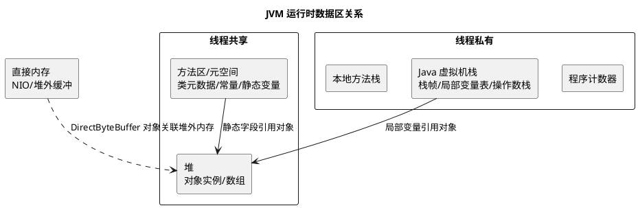

# JVM 内存模型

## 问题索引

- Q1：说一下 JVM 内存模型
- Q2：为什么 Direct Memory 达到上限时可能被容器 OOMKilled？堆外内存一般存储什么？

## Q1：说一下 JVM 内存模型


### PlantUML 示意图：JVM 运行时内存结构



### 背景

面试里问“JVM 内存模型”时，通常不是问 JMM，而是问 JVM 运行时数据区，也就是 Java 程序运行后，JVM 会把内存划分成哪些区域，每个区域存什么、是否线程共享、会不会发生 OOM。

需要先区分两个容易混淆的概念：

- JVM 内存模型 / JVM 运行时数据区：关注 JVM 运行时内存怎么划分，例如堆、方法区、虚拟机栈、本地方法栈、程序计数器。
- JMM / Java Memory Model：关注多线程下变量可见性、有序性、原子性，以及 happens-before、volatile、synchronized 等语义。

### 核心结论

JVM 运行时数据区主要分为五大部分：

| 区域 | 是否线程共享 | 主要存放内容 | 常见异常 |
|---|---|---|---|
| 程序计数器 | 线程私有 | 当前线程正在执行的字节码行号指示器 | 基本不会 OOM |
| Java 虚拟机栈 | 线程私有 | 栈帧、局部变量表、操作数栈、动态链接、方法出口 | `StackOverflowError`、`OutOfMemoryError` |
| 本地方法栈 | 线程私有 | Native 方法调用栈 | `StackOverflowError`、`OutOfMemoryError` |
| 堆 | 线程共享 | 对象实例、数组，GC 管理的主要区域 | `OutOfMemoryError: Java heap space` |
| 方法区 | 线程共享 | 类元信息、运行时常量池、静态变量、JIT 编译后的代码缓存相关数据 | 元空间 OOM、常量池 OOM |

在 HotSpot JVM 中，JDK 8 之后方法区的主要实现是元空间，元空间使用的是本地内存，而不是堆内存。

### 程序计数器

程序计数器可以理解为当前线程执行字节码的位置记录。

为什么它是线程私有的？

因为 Java 是多线程执行的，线程切换之后需要恢复到原来的执行位置。每个线程都必须有自己的程序计数器，否则线程切回来时不知道继续执行哪条字节码指令。

特点：

- 每个线程一份。
- 执行 Java 方法时，记录当前字节码指令地址。
- 执行 Native 方法时，值通常为空。
- 是 JVM 规范中唯一一个没有规定 OOM 的区域。

### Java 虚拟机栈

Java 虚拟机栈描述的是 Java 方法执行的线程内存模型。每个方法调用都会创建一个栈帧，方法执行完毕后栈帧出栈。

一个栈帧里主要包含：

- 局部变量表：存放方法参数和局部变量，例如基本类型、对象引用、`returnAddress`。
- 操作数栈：字节码指令执行时的临时计算区域。
- 动态链接：指向运行时常量池中该方法所属的符号引用，用于支持方法调用过程中的解析。
- 方法返回地址：方法正常返回或异常退出后，调用方应该继续执行的位置。

常见异常：

- `StackOverflowError`：方法调用层级太深，例如无限递归。
- `OutOfMemoryError`：线程太多或单个线程栈设置太大，导致无法继续创建线程栈。

### 本地方法栈

本地方法栈服务于 Native 方法，例如 JVM 调用 C/C++ 实现的底层方法。

它和 Java 虚拟机栈的区别主要是服务对象不同：

- Java 虚拟机栈：服务 Java 方法。
- 本地方法栈：服务 Native 方法。

在 HotSpot 中，本地方法栈和虚拟机栈的实现边界并不总是特别明显，但面试回答时按 JVM 规范区分即可。

### 堆

堆是 JVM 中最大的一块内存，也是 GC 管理的核心区域，几乎所有对象实例和数组都在堆上分配。

堆是线程共享的，所以多个线程可以访问同一个对象。也正因为它共享，才会涉及对象可见性、并发安全、GC 停顿等问题。

从分代角度看，传统堆结构通常可以分为：

- 新生代：存放新创建、生命周期较短的对象。
- 老年代：存放经过多次 GC 后仍然存活的对象，或者大对象。

新生代又常见分为：

- Eden 区：大部分新对象优先分配到这里。
- Survivor From / To：Minor GC 后仍然存活的对象会在两个 Survivor 区之间复制和年龄增长。

在 G1 中，堆不再按连续的新生代和老年代大块划分，而是拆成多个 Region。每个 Region 可以动态扮演 Eden、Survivor、Old、Humongous 等角色。

常见异常：

- `OutOfMemoryError: Java heap space`：堆空间不足。
- `GC overhead limit exceeded`：GC 消耗大量时间但回收效果很差。

### 方法区与元空间

方法区是 JVM 规范中的概念，用于存储类相关信息。

主要包括：

- 类元信息：类名、父类、接口、字段、方法等描述信息。
- 运行时常量池：字面量、符号引用等。
- 静态变量。
- JIT 编译后的代码缓存相关内容。

HotSpot 的实现变化：

- JDK 7 及以前：方法区主要由永久代实现。
- JDK 8 之后：永久代被移除，改为元空间，元空间使用本地内存。

为什么移除永久代？

永久代受 JVM 堆相关参数限制明显，容易因为类加载过多、动态代理过多、反射生成类过多导致 `PermGen space`。元空间改用本地内存后，空间上限更灵活，但仍然需要通过 `-XX:MaxMetaspaceSize` 控制，避免无限增长挤占机器内存。

### 直接内存

直接内存不是 JVM 运行时数据区的一部分，但在实际排查内存问题时非常重要。

典型场景：

- NIO 的 `DirectByteBuffer`。
- Netty 的堆外内存。
- 文件传输、网络 IO、零拷贝相关场景。

直接内存使用的是本地内存，不受 `-Xmx` 直接限制，但会受机器物理内存和 `-XX:MaxDirectMemorySize` 影响。

常见问题是：堆看起来不高，但进程 RSS 很高，甚至触发容器 OOM。这时要考虑直接内存、元空间、线程栈、JIT Code Cache 等堆外部分。

### 对象创建与内存分配流程

一个对象创建时，大致流程是：

1. 类加载检查：JVM 先确认这个类是否已经被加载、解析和初始化。
2. 分配内存：在堆中为对象分配空间，常见方式有指针碰撞和空闲列表。
3. 初始化零值：把对象内存初始化为默认值。
4. 设置对象头：写入 Mark Word、类型指针等信息。
5. 执行构造方法：执行 `<init>`，完成业务层面的初始化。

为了减少多线程分配对象时的竞争，JVM 通常会使用 TLAB。

TLAB 是 Thread Local Allocation Buffer，也就是线程本地分配缓冲区。每个线程先在自己的 TLAB 中分配小对象，避免每次分配对象都在堆上进行全局 CAS 竞争。

### 业务场景

在项目里理解 JVM 内存模型主要用于排查这些问题：

- 接口突然变慢：可能是频繁 GC、老年代压力大、对象创建过多。
- 服务启动失败：可能是元空间不足、线程栈不足、容器内存限制过小。
- 递归或深层调用报错：重点看虚拟机栈和 `StackOverflowError`。
- 堆内存持续上涨：重点看堆对象引用链、缓存未释放、集合无限增长。
- 堆不高但进程内存很高：重点看直接内存、线程栈、元空间、Code Cache。

### 排查思路

如果线上出现 JVM 内存问题，可以按区域拆解：

1. 先看堆：用 `jstat` 看 GC 频率，用 `jmap` 或 MAT 分析堆 dump。
2. 再看栈：用 `jstack` 看线程数量、线程状态、是否有大量阻塞或递归。
3. 再看元空间：看类加载数量、动态代理、反射、CGLIB、Groovy、脚本引擎等。
4. 再看直接内存：关注 Netty、NIO、文件上传下载、大 ByteBuffer。
5. 最后结合容器：检查 `-Xmx`、`MaxMetaspaceSize`、线程栈大小和容器 memory limit 是否匹配。

### 面试话术

> JVM 内存模型通常指 JVM 运行时数据区，主要包括程序计数器、Java 虚拟机栈、本地方法栈、堆和方法区。其中程序计数器、虚拟机栈、本地方法栈是线程私有的；堆和方法区是线程共享的。堆主要存放对象实例，是 GC 管理的核心区域；虚拟机栈存放方法调用产生的栈帧，包括局部变量表、操作数栈、动态链接和方法出口；方法区存放类元信息、运行时常量池、静态变量等，JDK 8 之后 HotSpot 用元空间实现方法区。实际排查问题时，还要关注直接内存、线程栈、元空间这些堆外内存，因为很多线上 OOM 并不只发生在 Java 堆里。

## 高频追问

- Q：JVM 内存模型和 JMM 是一回事吗？
  A：不是。JVM 内存模型通常说的是运行时数据区，关注堆、栈、方法区等内存区域；JMM 是 Java 内存模型，关注多线程下可见性、有序性、原子性和 happens-before。

- Q：为什么程序计数器是线程私有的？
  A：因为线程会发生上下文切换，每个线程都需要记录自己下一条要执行的字节码位置，恢复执行时才能继续原来的流程。

- Q：对象一定分配在堆上吗？
  A：从 JVM 规范和常规理解看，对象主要分配在堆上。但 HotSpot 经过逃逸分析后，可能通过标量替换、栈上分配等优化，让对象不以完整对象形式真实分配到堆上。

- Q：JDK 8 为什么要移除永久代？
  A：永久代大小比较难合理设置，动态类加载多时容易 OOM。元空间使用本地内存，上限更灵活，但仍建议设置 `MaxMetaspaceSize` 防止无限增长。

- Q：堆内存不高，为什么进程还是 OOM？
  A：因为 JVM 进程内存不只有堆，还包括元空间、线程栈、直接内存、Code Cache、JNI 内存等。容器环境下尤其要关注这些堆外部分。

## 复习清单

- [ ] 能区分 JVM 运行时数据区和 JMM
- [ ] 能说清五大运行时数据区及线程共享关系
- [ ] 能解释堆、栈、方法区分别存什么
- [ ] 能说出 JDK 8 元空间和永久代的区别
- [ ] 能结合 OOM 场景说明应该排查哪个内存区域

## Q2：为什么 Direct Memory 达到上限时可能被容器 OOMKilled？堆外内存一般存储什么？

### 问题一：为什么不是 Java OOM，而是容器 OOMKilled

`-XX:MaxDirectMemorySize=2g` 只是 JVM 对部分 DirectBuffer 使用量设置的上限，并不代表整个 Java 进程最多只能使用 2GB，也不会为进程预留 2GB 内存。容器的 memory limit 约束的是 cgroup 统计到的进程总内存，通常包括：

- Java Heap：`-Xmx` 限制的堆。
- Direct Memory：NIO `DirectByteBuffer`、Netty 堆外缓冲区等。
- Metaspace：类元数据和动态生成的类。
- 线程栈：每个 Java 线程的 native stack。
- Code Cache：JIT 编译后的机器码。
- JNI、压缩库、TLS、数据库驱动和其他 native 库申请的内存。
- 内存映射文件和部分由操作系统计入 cgroup 的文件页。

例如容器只有 2GiB，却配置：

```text
-Xmx1g
-XX:MaxDirectMemorySize=1g
```

这两个参数的上限相加就已经达到 2GiB，还没有给元空间、线程栈、JIT 和 native 库留下预算。即使实际堆只使用了 700MiB，只要进程总 RSS 超过 cgroup limit，内核就可能直接触发 OOM Killer，进程收到 `SIGKILL`，JVM 没有机会构造并打印 `OutOfMemoryError`。

两种失败的差异是：

| 现象 | 触发者 | 是否通常能看到 Java 异常 |
| --- | --- | --- |
| DirectBuffer 计数达到 `MaxDirectMemorySize` | JVM 的 Direct Memory 预留检查 | 通常能看到 `OutOfMemoryError: Direct buffer memory` |
| 进程总内存超过容器 cgroup limit | Linux 内核 OOM Killer | 通常来不及打印 Java 异常，容器显示 `OOMKilled` |

因此，`MaxDirectMemorySize` 不是容器内存预算。生产配置应该为所有内存区域预留余量，而不是把 Heap 上限和 Direct Memory 上限简单相加到容器 limit。

### 容器场景的排查方法

1. 查看 Pod 或容器的 memory limit、实际使用量和 OOM 事件，例如 `kubectl describe pod`、`kubectl top pod` 或 `docker stats`。
2. 在 Linux cgroup 中检查 `memory.max` / `memory.current`（cgroup v2）或对应的 memory limit / usage 文件（cgroup v1）。
3. 检查 JVM 的 `-Xmx`、`-XX:MaxDirectMemorySize`、`-XX:MaxMetaspaceSize`、线程数量和 `-Xss`。
4. 通过 `java.nio:type=BufferPool,name=direct` 查看 DirectBuffer 使用量。
5. 使用 NMT（`-XX:NativeMemoryTracking=summary`）和 `jcmd VM.native_memory summary` 拆分 JVM native memory；NMT 未覆盖的第三方 native 库还要结合进程 RSS、JFR 或应用组件指标判断。
6. 查看节点内核日志和容器事件，确认是 cgroup OOM，而不是 JVM 自己抛出的 Direct Memory OOM。

JDK 10 之后 HotSpot 默认支持容器感知；JDK 8 需要确认所使用的更新版本是否包含相应的容器支持。即使 JVM 正确识别了容器，cgroup 的总内存限制仍然会统计 JVM 不同区域和第三方 native 内存的合计。

### 问题二：堆外内存一般存储什么

“堆外内存”是一个较宽泛的概念；“Direct Memory”通常特指 NIO 直接缓冲区，两者不能完全画等号。

#### 1. NIO 直接缓冲区

`ByteBuffer.allocateDirect()` 的字节数据存放在 native memory，Java 堆中只保存包装对象和地址信息。它常用于网络读写、文件 IO、序列化和压缩等大块临时缓冲。

#### 2. Netty 等网络框架的缓冲区

Netty 可以使用池化的 direct `ByteBuf`，减少 Java 堆对象复制和 GC 压力，适合高吞吐网络服务。引用计数没有正确 `release()` 时，容易出现堆外内存持续增长。

#### 3. 内存映射文件

`MappedByteBuffer` 把文件映射到进程地址空间，数据页由操作系统按需加载。它适合大文件随机访问，但使用量和回收时机不能简单按普通 Java 堆对象理解，也不能只依赖 `MaxDirectMemorySize` 判断所有映射内存。

#### 4. JVM 自身的 native 区域

这些通常也被归入广义堆外内存，但不一定计入 Direct Memory：

- JDK 8 之后的 Metaspace。
- JIT 编译代码所在的 Code Cache。
- Java 线程和 Native 方法的线程栈。
- JNI、SSL、压缩库、数据库驱动等 native 库分配的内存。

#### 5. 第三方组件的 native 缓存

RocksDB、部分搜索组件、零拷贝框架、共享内存组件可能在 JVM 堆外维护索引、缓存或临时数据。这类内存往往需要查看组件自己的指标和释放接口，不能只看 Java Heap 或 DirectBuffer 指标。

### 为什么使用堆外内存

- 减少 Java 堆和内核缓冲区之间的数据复制。
- 降低大块临时数据对 GC 的压力。
- 便于网络框架和 native 库共享内存地址。
- 支持文件映射、零拷贝和高吞吐 IO。

代价是生命周期管理更复杂、监控不如 Java 堆直观，并且可能绕过普通 Heap Dump。因此使用堆外内存时必须同时设计容量上限、池化策略、释放责任、泄漏检测和容器总内存预算。

### 面试话术

> `MaxDirectMemorySize` 只限制 DirectBuffer 这一类内存，不限制整个 JVM 进程。容器限制的是 Heap、Direct Memory、Metaspace、线程栈、Code Cache、JNI 和其他 native 内存的总和。如果总 RSS 先超过 cgroup limit，内核会直接 OOMKill 进程，JVM 还来不及抛出 Java 异常；只有进程没有先被内核杀死，且 JVM 的 DirectBuffer 预留检查达到上限时，才更可能看到 `OutOfMemoryError: Direct buffer memory`。堆外内存常见用途包括 NIO/Netty 缓冲区、内存映射文件、Metaspace、线程栈、Code Cache 和第三方 native 库缓存，但广义堆外内存不等于 Direct Memory。

### 复习清单

- [ ] 能区分 JVM 的 Direct Memory 上限和容器 cgroup 总内存限制。
- [ ] 能解释为什么 OOMKilled 可能没有 Java 异常堆栈。
- [ ] 能列出 Heap、Direct Memory、Metaspace、线程栈、Code Cache 和 JNI 内存。
- [ ] 能说明 `DirectByteBuffer`、Netty `ByteBuf` 和 `MappedByteBuffer` 的典型用途。
- [ ] 能用 `BufferPoolMXBean`、NMT、容器指标和内核事件建立排查链路。

