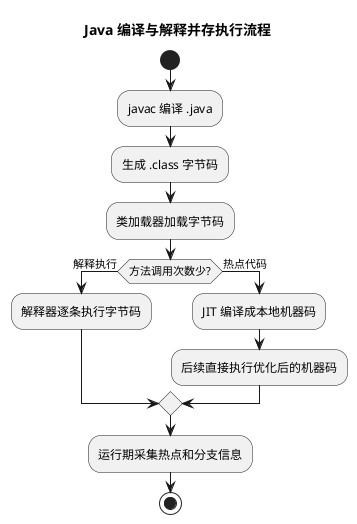

# Java 编译与解释并存

## 问题索引

- Q1：为什么说 Java 语言“编译与解释并存”？
- Q2：JIT 选择热点代码的策略以及具体实现方式是什么？
- Q3：反优化通常出现在哪些场景？
- Q4：热点探测信息存放在哪里？服务重启后 JIT 的实战价值是什么？

## Q1：为什么说 Java 语言“编译与解释并存”？

### 背景

面试中常见问题：为什么说 Java 语言是“编译与解释并存”？这个问题考察的是 Java 源码从编写到执行的完整链路，以及 JVM 中解释器和 JIT 编译器的协作方式。

### 核心结论

Java 不是单纯的编译型语言，也不是单纯的解释型语言，而是：

1. 先编译：`.java` 源文件通过 `javac` 编译成 `.class` 字节码。
2. 再执行：JVM 加载字节码后，可以通过解释器逐条解释执行。
3. 再优化：热点代码会被 JIT 编译器编译成本地机器码，后续直接执行机器码。

所以 Java 的执行过程同时包含“编译”和“解释”，运行期还会进行即时编译优化。

### 执行流程


### PlantUML 示意图：编译、解释与 JIT 执行链路



```text
Java 源码 .java
  -> javac 编译
字节码 .class
  -> 类加载器加载
JVM 解释器解释执行
  -> 发现热点代码
JIT 编译成本地机器码
  -> 后续直接执行机器码
```

### 为什么需要字节码

字节码是 Java 跨平台能力的关键。

- `javac` 编译出的 `.class` 文件不是某个操作系统或 CPU 的机器码。
- 不同平台有不同 JVM。
- JVM 负责把同一份字节码解释或编译成当前平台能执行的机器指令。

这就是“一次编译，到处运行”的基础。

### 解释执行

解释执行是指 JVM 解释器逐条读取字节码指令并执行。

优点：

- 启动快，不需要一开始就把所有代码编译成本地机器码。
- 适合只执行少量次数的代码。
- 支持动态特性，例如类加载、反射、动态代理等。

缺点：

- 每次执行都要解释字节码，性能比本地机器码低。

### JIT 即时编译

JIT 是 Just-In-Time Compilation，即即时编译。

JVM 会统计方法或循环的执行频率。当某段代码执行次数很高，就会被识别为热点代码。热点代码会被 JIT 编译成本地机器码，并进行优化。

常见优化包括：

- 方法内联
- 逃逸分析
- 锁消除
- 标量替换
- 循环优化

这样后续再执行热点代码时，就不需要逐条解释字节码，而是直接执行机器码。

## Q2：JIT 选择热点代码的策略以及具体实现方式是什么？

### JIT 如何选择热点代码

HotSpot JVM 选择热点代码的核心策略是：运行时计数、阈值触发、分层编译。

热点代码主要有两类：

- 热点方法：方法被频繁调用。
- 热点循环：方法调用次数不一定多，但内部循环执行次数非常多。

JVM 在解释执行时会维护计数器：

- 方法调用计数器：统计方法被调用的次数。
- 回边计数器：统计循环回跳次数，用于判断循环是否很热。

当计数器达到阈值后，JVM 会把对应方法或循环提交给 JIT 编译线程处理。

### 分层编译

HotSpot 通常通过解释器、C1 编译器、C2 编译器协作执行代码。

- 解释器：启动快，负责初始执行，并收集运行时信息。
- C1 编译器：编译速度快，优化较轻，适合启动阶段和中等热点代码。
- C2 编译器：编译较慢，但优化更激进，适合长期运行的高热点代码。

大致流程：

```text
解释执行
  -> 收集调用次数、循环次数、类型信息
  -> 达到阈值后 C1 编译
  -> 热度继续上升后 C2 深度优化
  -> 执行优化后的本地机器码
```

### OSR 栈上替换

如果一个方法只调用了一次，但内部有一个超长循环，这种代码也应该被优化。

这时 JVM 会使用 OSR，On-Stack Replacement，栈上替换。

OSR 的作用是：循环还在运行时，把当前解释执行的栈帧切换到已经编译好的机器码版本，让当前这次循环直接加速，而不是等下一次方法调用。

### 反优化

JIT 优化依赖运行时假设。例如某个接口调用长期只有一个实现类，JIT 可能会做内联优化。

如果后续加载了新的实现类，原来的优化假设失效，JVM 会触发反优化，从机器码退回解释执行，或者重新编译。

## Q3：反优化通常出现在哪些场景？

### 核心结论

反优化是 JIT 为了性能做了“大胆假设”后，在运行时发现假设不再成立，于是撤销已编译机器码，退回解释执行或重新编译。

它不是异常，而是 JVM 动态优化体系的一部分。

### 常见场景

1. 类层次结构变化

   JIT 可能基于 CHA，Class Hierarchy Analysis，判断某个接口或父类目前只有一个实现，于是把虚方法调用直接内联。

   如果后续动态加载了新的子类或实现类，原来的“只有一个实现”的假设失效，就可能触发反优化。

2. 虚方法调用从单态变成多态

   某个接口调用长期只出现一个具体类型，JIT 会按单态调用优化。

   后续如果出现多个实现类型，调用点变成多态或超多态，原来的内联和类型假设就不再合适。

3. 罕见分支突然被执行

   JIT 会根据运行时分支统计，把极少执行的分支当成 uncommon path，不放进主要优化路径。

   如果这个罕见分支后来真的频繁执行，就可能触发 uncommon trap，退回解释器重新收集信息。

4. 类型假设失败

   例如某段代码运行时一直传入 `ArrayList`，JIT 可能按这个类型做优化。后续传入 `LinkedList` 或其他实现，类型 profile 失效，就需要反优化。

5. 类重定义或 Java Agent 增强

   调试、热部署、Java Agent、JVMTI redefine class 等机制可能改变类结构或方法实现，使已编译代码失效。

6. OSR 编译假设失效

   热点循环通过 OSR 进入编译代码后，如果循环中的类型、分支、异常路径和之前收集的信息差异很大，也可能退回解释执行。

### 反优化怎么做到退回解释器

JIT 编译后的机器码里不只是机器指令，还带有调试信息和栈帧映射信息。

当发生反优化时，JVM 可以根据这些元数据把当前机器码执行状态还原成解释器能理解的栈帧、局部变量表和操作数栈，然后继续解释执行。

大致流程：

```text
JIT 基于运行时 profile 做优化
  -> 生成机器码和反优化元数据
  -> 运行时假设失效
  -> 触发 uncommon trap / dependency invalidation
  -> 当前 compiled frame 还原成 interpreter frame
  -> 回到解释器执行并继续收集 profile
  -> 必要时重新 JIT 编译
```

### 面试话术

> 反优化是 JIT 动态优化的兜底机制。JIT 会基于运行时 profile 做一些投机优化，比如虚方法内联、类型推断、分支预测。如果后续类加载、调用类型、分支行为发生变化，原来的优化假设不成立，JVM 就会通过反优化把机器码执行状态还原成解释器栈帧，退回解释执行并重新收集信息，后续可能再次编译。

## Q4：热点探测信息存放在哪里？服务重启后 JIT 的实战价值是什么？

### 热点探测信息存放在哪里

JIT 的热点探测信息主要存放在当前 JVM 进程的运行时内存里，而不是写回 `.class`、jar 包或部署产物。

在 HotSpot 中，相关信息大致包括：

- 方法调用计数器：记录方法调用热度。
- 回边计数器：记录循环执行热度。
- MethodData / MDO：记录分支、类型 profile、调用点类型等运行时信息。
- Code Cache：存放 JIT 编译后的本地机器码，也就是 nmethod。

这些数据都属于当前 JVM 进程的运行时状态。服务一旦重启，这些 profile 和已编译机器码通常都会丢失，新进程要重新解释执行、重新收集热点、重新 JIT 编译。

### 为什么全部提前编译会增加启动成本

如果 JVM 一启动就把所有字节码全部编译成本地机器码，会有几个问题：

1. 编译本身消耗 CPU 和时间，会拖慢启动。
2. 很多代码只执行一次或很少执行，提前编译浪费资源。
3. 没有真实运行时 profile，提前编译无法知道真实热点、真实类型分布和分支概率，优化质量可能不如 JIT。
4. 业务代码依赖动态类加载、反射、代理、配置差异，运行期信息比静态编译时更准确。

所以 JIT 的策略是：先解释执行，以较低成本启动；运行中收集真实 profile；只把真正热的代码编译优化。

### 异地打包和服务重启对 JIT 的影响

异地打包上传只改变 jar 包生成和分发方式，不会把线上 JVM 运行时的热点 profile 一起带过去。

每次服务重启后：

- 新 JVM 进程重新加载 class。
- 方法调用计数器、回边计数器重新统计。
- MethodData 重新收集。
- Code Cache 重新生成机器码。

所以生产服务确实会经历“预热期”。刚启动时，部分接口可能还没有达到最佳性能；运行一段时间后，热点路径被 JIT 编译，性能才逐步稳定。

### JIT 在实战中的价值

JIT 不只是“加快代码执行”，更准确地说是：

1. 加快热点代码执行

   高频接口、核心循环、序列化、集合操作、框架调用链等热点路径会被编译成本地机器码。

2. 利用运行时信息做更准确的优化

   JIT 可以知道真实类型、真实分支概率、真实调用频率，这是静态编译很难准确知道的。

3. 支撑长期运行服务的吞吐优化

   对后端服务来说，启动后的绝大多数时间都在稳定运行，JIT 对吞吐量和延迟都有实际意义。

4. 带来预热成本

   服务刚启动时，JIT 还没有完成热点编译，所以可能出现冷启动阶段性能较弱的问题。生产中可以通过预热流量、灰度发布、滚动发布来降低影响。

### 面试话术

> HotSpot 的热点探测数据主要在当前 JVM 进程内存里，比如方法调用计数器、回边计数器、MethodData 里的类型和分支 profile，以及 Code Cache 里的编译后机器码。它不会写回 jar 包，所以服务重启后通常要重新预热。JIT 在实战中的价值主要是根据真实运行时信息优化热点路径，提升长期运行服务的吞吐和延迟表现；代价是启动后会有一段预热期，所以生产中常配合预热流量、灰度和滚动发布。

### JIT 热点探测面试话术

> HotSpot JIT 通过热点探测选择要编译的代码，主要依赖方法调用计数器和回边计数器。方法调用频繁会触发方法编译，循环执行频繁会触发 OSR 编译。JVM 先解释执行并收集运行时信息，达到阈值后交给 C1/C2 编译器做分层编译，热点越高优化越深入。JIT 还会基于运行时类型、分支概率等信息做方法内联、逃逸分析、锁消除等优化；如果优化假设失效，则会反优化回解释执行。

## 面试回答

可以这样答：

> Java 之所以说编译与解释并存，是因为 Java 源码首先会被 `javac` 编译成平台无关的 `.class` 字节码；运行时 JVM 会加载这些字节码，解释器可以逐条解释执行。同时，JVM 还有 JIT 即时编译器，会把执行频繁的热点代码编译成本地机器码并优化。所以 Java 既有编译阶段，也有解释执行阶段，运行期还会进行即时编译优化。

## 高频追问

- Q：Java 是编译型语言还是解释型语言？
  A：更准确地说是编译与解释并存。源码先编译成字节码，运行时既可以解释执行，也可以通过 JIT 编译为机器码。

- Q：为什么不一开始全部编译成本地机器码？
  A：一开始全部编译会增加启动成本，而且很多代码可能只执行一次。JVM 采用热点探测，只优化高频代码，是启动速度和运行性能之间的折中。

- Q：JIT 编译后的机器码还跨平台吗？
  A：不跨平台。跨平台的是字节码，JIT 生成的是当前操作系统和 CPU 对应的本地机器码。

- Q：解释器和 JIT 是互斥的吗？
  A：不是。它们是协作关系。代码开始通常由解释器执行，热点代码再交给 JIT 编译优化。

- Q：JIT 怎么判断代码是不是热点？
  A：主要看方法调用计数器和回边计数器。方法调用频繁说明方法热，循环回跳频繁说明循环热。

- Q：什么是 OSR？
  A：OSR 是栈上替换，用于优化正在解释执行中的热点循环，让当前循环直接切换到编译后的机器码执行。

- Q：反优化是不是性能问题？
  A：少量反优化是正常的动态优化兜底机制；如果频繁反优化，才可能说明类型分布不稳定、动态类加载频繁或代码形态不利于 JIT 优化。

- Q：热点探测信息会不会随着 jar 一起发布？
  A：不会。热点 profile 和编译后的机器码属于当前 JVM 进程的运行时状态，服务重启后通常要重新收集和编译。

- Q：生产服务重启后 JIT 是否还有效？
  A：有效。只是重启后需要重新预热。服务进入稳定运行后，JIT 仍然会优化热点代码，提高吞吐和降低热点路径延迟。

## 复习清单

- [ ] 能说清 `.java -> .class -> JVM` 的链路
- [ ] 能解释字节码为什么能跨平台
- [ ] 能区分解释执行和 JIT 编译
- [ ] 能说明热点代码为什么会被优化
- [ ] 能说明方法调用计数器和回边计数器
- [ ] 能解释 C1 / C2 分层编译和 OSR
- [ ] 能举例说明反优化场景
- [ ] 能说清热点 profile、MethodData、Code Cache 和服务预热的关系

