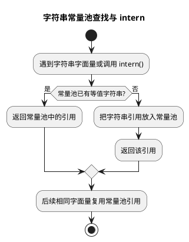

# 字符串常量池

## 问题索引

- Q1：JVM 字符串常量池存储的是字符串值还是堆的引用？

## Q1：JVM 字符串常量池存储的是字符串值还是堆的引用？

### 背景

字符串常量池是 Java 面试里很容易问细的问题，尤其是：

- `String s = "abc"` 创建了什么？
- `new String("abc")` 创建了几个对象？
- `intern()` 做了什么？
- 字符串常量池到底在方法区、永久代、元空间，还是堆？
- 常量池里存的是字符串值，还是对象引用？

这些问题要结合 JDK 版本回答，不能只背一句“字符串常量池在堆里”。

### 核心结论

在 HotSpot JVM 的 JDK 7 及以后，字符串常量池已经从永久代移动到了 Java 堆中。更准确地说：

字符串常量池本质上是一张全局字符串驻留表，里面保存的是对 `String` 对象的引用。真正的 `String` 对象在堆里，字符串内容也随着 `String` 对象相关结构存放在堆中。

所以回答这个问题时可以说：

> 字符串常量池不是简单存一份“字符串值文本”，而是维护字符串字面量到 `String` 对象的映射。JDK 7 以后，常量池中保存的是堆中 `String` 对象的引用，`String` 对象本体在堆里。

### JDK 6 和 JDK 7+ 的差异

JDK 6 及以前：

- 字符串常量池位于永久代。
- `intern()` 会把字符串内容复制到永久代的字符串常量池中。
- 永久代空间有限，字符串过多可能导致 `PermGen space`。

JDK 7 及以后：

- 字符串常量池移动到堆中。
- `intern()` 不一定复制对象内容，更常见的是把堆中已有 `String` 对象的引用放入字符串常量池。
- JDK 8 移除永久代，方法区主要由元空间实现，但字符串常量池仍在堆中。

### 字符串字面量的执行过程


### PlantUML 示意图：字符串常量池与 intern 流程



代码：

```java
public class StringPoolDemo {
    public static void main(String[] args) {
        // 字符串字面量 "abc" 会进入字符串常量池
        // s 保存的是常量池中对应 String 对象的引用
        String s = "abc";
    }
}
```

大致过程：

1. 类加载时，Class 文件常量池中有 `"abc"` 这个字面量符号。
2. 执行到 `String s = "abc"` 时，JVM 会在字符串常量池中查找是否已有内容为 `"abc"` 的 `String`。
3. 如果没有，就在堆中创建对应 `String` 对象，并把它的引用记录到字符串常量池。
4. 如果已有，就直接返回常量池中保存的那个引用。
5. 局部变量 `s` 保存这个 `String` 对象引用。

可以理解为：

```text
字符串常量池
  "abc" -> 堆中的 String 对象引用

局部变量 s
  -> 同一个堆中的 String 对象
```

### new String("abc") 创建了什么

代码：

```java
public class NewStringDemo {
    public static void main(String[] args) {
        // "abc" 是字面量，会确保常量池中有一个内容为 abc 的 String 对象引用
        // new String("abc") 会在堆上再创建一个新的 String 对象
        String s = new String("abc");
    }
}
```

通常可以这样理解：

- `"abc"`：保证字符串常量池中存在一个内容为 `"abc"` 的 `String` 对象引用。
- `new String("abc")`：在堆上创建一个新的 `String` 对象。
- 变量 `s`：指向 `new` 出来的堆对象，不是直接指向常量池里的对象。

所以常见说法是：如果常量池之前没有 `"abc"`，这行代码可能涉及两个对象；如果常量池已有 `"abc"`，则主要是 `new` 出来的那个新对象。

### intern 做了什么

`intern()` 的作用是返回字符串常量池中与当前字符串内容相同的那个规范引用。

代码：

```java
public class InternDemo {
    public static void main(String[] args) {
        // heapStr 指向堆中新创建的 String 对象
        String heapStr = new String("abc");

        // pooledStr 指向字符串常量池中内容为 abc 的 String 对象引用
        String pooledStr = heapStr.intern();

        // false：heapStr 指向 new 出来的对象，pooledStr 指向常量池对象
        System.out.println(heapStr == pooledStr);
    }
}
```

如果常量池中已经有相同内容的字符串，`intern()` 返回常量池里已有对象的引用。

如果常量池中没有，JDK 7+ 通常会把当前堆中这个 `String` 对象的引用放入常量池，然后返回这个引用。

### 为什么说常量池存的是引用

从 JDK 7+ 的实现角度看，字符串常量池可以理解成一个类似哈希表的结构。它根据字符串内容查找对应的 `String` 对象。

这个表里保存的是到 `String` 对象的引用，而不是把字符串对象本体塞进表项里。

可以粗略画成：

```text
StringTable
  hash("abc") -> oop/reference -> Java Heap 中的 String 对象

Java Heap
  String 对象
    -> value 字节数组或字符数组
```

这里的 `oop/reference` 就是 HotSpot 中对象引用的概念。

### 字符串内容存在哪里

字符串内容跟 JDK 版本也有关系。

JDK 8 及以前，`String` 内部主要是 `char[] value`。

JDK 9 引入 Compact Strings 后，`String` 内部主要是：

- `byte[] value`：保存字符串内容。
- `byte coder`：标记使用 LATIN1 还是 UTF16 编码。

但不管是 `char[]` 还是 `byte[]`，它们都是普通堆对象或对象字段关联的数据。所以不要把“字符串内容”理解成还放在永久代或元空间。

### 字符串常量池和运行时常量池的区别

这两个概念容易混。

运行时常量池：

- 属于方法区的逻辑部分。
- 来自 Class 文件常量池。
- 存放字面量、符号引用等信息。
- JDK 8 之后方法区主要由元空间实现。

字符串常量池：

- 是字符串驻留机制使用的全局表。
- JDK 7+ 位于堆中。
- 保存字符串内容到堆中 `String` 对象引用的映射。

所以 `Class` 文件里有 `"abc"` 这个字面量信息，不等于 `String` 对象本体就在运行时常量池里。

### 业务场景

理解字符串常量池主要有几个价值：

- 避免误用 `new String()` 创建不必要对象。
- 理解 `==` 和 `equals` 的区别。
- 理解 `intern()` 可能降低重复字符串内存，但也可能增加常量池维护成本。
- 排查大量重复字符串导致的堆内存浪费。
- 理解 JVM 参数和 GC 对字符串去重的影响，例如 G1 的 String Deduplication。

### 踩坑点

- 不要说 JDK 8 字符串常量池在元空间。JDK 8 的元空间替代永久代，但字符串常量池在堆里。
- 不要把 Class 文件常量池、运行时常量池、字符串常量池混成一个东西。
- 不要认为常量池里存的是纯文本值。更准确的是存字符串内容到 `String` 对象引用的映射。
- 不要用 `==` 比较字符串内容，业务比较用 `equals`。

### 面试话术

> JDK 7 以后，HotSpot 的字符串常量池在堆中。更准确地说，字符串常量池是一张全局的字符串驻留表，里面维护的是字符串内容到 `String` 对象的映射，表项保存的是堆中 `String` 对象的引用，而不是把字符串值本体放在方法区里。`String s = "abc"` 会优先从常量池取已有引用，没有就创建并登记；`new String("abc")` 会在堆上再创建一个新对象；`intern()` 返回的是常量池中相同内容字符串对应的规范引用。

## 高频追问

- Q：字符串常量池在堆还是方法区？
  A：JDK 7+ HotSpot 中字符串常量池在堆里。JDK 6 及以前位于永久代。

- Q：字符串常量池存的是值还是引用？
  A：更准确地说，保存的是字符串内容到堆中 `String` 对象引用的映射，表项里是对象引用。

- Q：`new String("abc")` 一定创建两个对象吗？
  A：不一定。如果常量池之前没有 `"abc"`，可能涉及常量池对象和 new 出来的对象；如果常量池已有 `"abc"`，主要只创建 new 出来的对象。

- Q：`intern()` 在 JDK 7+ 和 JDK 6 有什么差异？
  A：JDK 6 中通常会把字符串复制到永久代常量池；JDK 7+ 中常量池在堆里，更多是把已有堆对象的引用放入常量池。

- Q：运行时常量池和字符串常量池一样吗？
  A：不一样。运行时常量池属于方法区逻辑，主要来自 Class 文件常量池；字符串常量池是字符串驻留表，JDK 7+ 在堆中。

## 复习清单

- [ ] 能说清 JDK 6 和 JDK 7+ 字符串常量池位置差异
- [ ] 能解释字符串常量池保存的是 `String` 对象引用
- [ ] 能说明 `String s = "abc"` 的执行过程
- [ ] 能说明 `new String("abc")` 可能创建几个对象
- [ ] 能解释 `intern()` 的作用
- [ ] 能区分 Class 文件常量池、运行时常量池和字符串常量池

