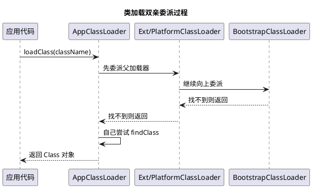

# 类加载机制

## 问题索引

- Q1：说一下类的加载

## Q1：说一下类的加载

### 背景

面试里问“类的加载”，通常不是只问 loading 这个单独阶段，而是问 Java 类从 `.class` 文件到可以被 JVM 使用的完整过程，也就是类加载机制。

完整流程是：

```text
加载 -> 验证 -> 准备 -> 解析 -> 初始化 -> 使用 -> 卸载
```

其中验证、准备、解析合起来叫连接。

```text
加载 -> 连接(验证、准备、解析) -> 初始化
```

### 核心结论

类加载机制主要做三件事：

1. 把 `.class` 字节码加载进 JVM。
2. 校验、准备和解析类的元数据。
3. 执行类初始化逻辑，让类真正可用。

类加载完成后，JVM 会在方法区 / 元空间中保存类元数据，并在堆中创建对应的 `Class` 对象，作为 Java 程序访问类元信息的入口。

### 加载阶段

加载阶段主要做三件事：

1. 通过类的全限定名获取定义这个类的二进制字节流。
2. 把字节流代表的静态存储结构转换为方法区中的运行时数据结构。
3. 在堆中生成一个 `java.lang.Class` 对象，作为访问这个类元数据的入口。

字节流来源不一定是本地 `.class` 文件，也可能来自：

- jar 包。
- 网络。
- 动态代理生成的字节码。
- CGLIB / ByteBuddy / ASM 生成的字节码。
- 加密 class 解密后的字节码。

这也是为什么 Java 的类加载机制很灵活，框架可以在运行期生成类。

### 验证阶段

验证阶段保证加载进来的字节码是安全、合法、符合 JVM 规范的。

主要包括：

- 文件格式验证：是否符合 Class 文件格式。
- 元数据验证：类继承关系、字段、方法是否合法。
- 字节码验证：方法体字节码是否安全，例如操作数栈类型是否匹配。
- 符号引用验证：引用的类、字段、方法是否可访问。

验证阶段的目标是防止恶意或错误字节码破坏 JVM 安全。

### 准备阶段

准备阶段为类变量，也就是 `static` 变量分配内存，并设置默认初始值。

注意：这里不是执行 Java 代码里的显式赋值。

示例：

```java
public class PrepareDemo {
    // 准备阶段 value 的值是 0
    // 初始化阶段执行 putstatic 后，value 才变成 10
    private static int value = 10;

    // static final 编译期常量可能在准备阶段就直接赋值为 20
    private static final int CONST = 20;
}
```

准备阶段：

- `value = 0`
- `CONST = 20`，如果是编译期常量

初始化阶段：

- 执行类构造器 `<clinit>()`
- `value = 10`

### 解析阶段

解析阶段把常量池中的符号引用转换为直接引用。

符号引用可以理解为“用名字描述目标”。

直接引用可以理解为“可以直接定位到目标的引用”。

例如，字节码常量池里可能记录：

```text
java/lang/String.length:()I
```

解析后，JVM 会把它转换成可以直接定位到目标方法的引用。

解析对象包括：

- 类或接口。
- 字段。
- 类方法。
- 接口方法。
- 方法类型。
- 方法句柄。

解析不一定一次性全部完成，JVM 可以按需解析。

### 初始化阶段

初始化阶段才真正执行类里的 Java 初始化代码。

JVM 会执行类构造器 `<clinit>()`。

`<clinit>()` 由这些内容合并生成：

- 静态变量显式赋值。
- 静态代码块。

示例：

```java
public class InitDemo {
    private static int value = 10;

    static {
        // 静态代码块会被编译进 <clinit>() 中
        value = 20;
    }
}
```

初始化后，`value` 的最终值是 `20`。

初始化特点：

- JVM 保证一个类的 `<clinit>()` 在多线程环境下被正确加锁同步。
- 如果多个线程同时初始化一个类，只会有一个线程执行 `<clinit>()`。
- 如果初始化失败，这个类后续可能进入错误状态，再使用可能抛出 `NoClassDefFoundError`。

### 什么时候触发初始化

主动使用类时会触发初始化。

常见触发场景：

- `new` 创建对象。
- 读取或设置类的静态字段，编译期常量除外。
- 调用类的静态方法。
- 使用反射调用类。
- 初始化子类时，父类会先初始化。
- JVM 启动时包含 `main` 方法的主类会初始化。

示例：

```java
public class InitTriggerDemo {
    public static void main(String[] args) {
        // 访问静态方法，会触发 Target 初始化
        Target.work();
    }
}

class Target {
    static {
        System.out.println("Target init");
    }

    static void work() {
        System.out.println("work");
    }
}
```

不会触发初始化的常见场景：

- 通过子类引用父类静态字段，只初始化父类。
- 访问编译期常量。
- 创建对象数组。
- 使用 `ClassLoader.loadClass` 加载但不主动初始化。

### Class.forName 和 ClassLoader.loadClass

这两个经常一起问。

`Class.forName("com.demo.User")` 默认会加载并初始化类。

`ClassLoader.loadClass("com.demo.User")` 默认只加载类，不会主动初始化。

示例：

```java
public class LoadClassDemo {
    public static void main(String[] args) throws Exception {
        // 默认会触发类初始化
        Class.forName("demo.User");

        // 默认只加载，不主动初始化
        ClassLoader.getSystemClassLoader().loadClass("demo.User");
    }
}
```

如果想 `Class.forName` 只加载不初始化，可以使用重载方法：

```java
Class.forName("demo.User", false, Thread.currentThread().getContextClassLoader());
```

第二个参数 `false` 表示不立即初始化。

### 类加载器

类加载器负责把类的字节码加载到 JVM 中。

常见类加载器：

| 类加载器 | 作用 |
|---|---|
| Bootstrap ClassLoader | 加载 Java 核心类库 |
| Platform ClassLoader | 加载平台类库，JDK 9+ |
| Extension ClassLoader | JDK 8 及以前加载扩展目录 |
| Application ClassLoader | 加载应用 classpath 下的类 |
| 自定义 ClassLoader | 加载自定义来源的类 |

JDK 8 常见说法是：

```text
Bootstrap -> Extension -> Application
```

JDK 9+ 模块化后，Extension 被 Platform 替代。

### 双亲委派机制


### PlantUML 示意图：双亲委派加载过程



双亲委派是类加载器的一种委派模型。

流程：

1. 一个类加载器收到加载请求。
2. 先把请求委派给父加载器。
3. 父加载器继续向上委派。
4. 到顶层后，如果父加载器能加载，就由父加载器加载。
5. 父加载器加载不了，子加载器才尝试自己加载。

好处：

- 避免类重复加载。
- 保护 Java 核心类库，防止用户自定义 `java.lang.String` 替换核心类。
- 保证核心 API 类型一致。

### 什么时候打破双亲委派

一些场景会打破或绕开双亲委派：

- JDBC SPI：父加载器定义接口，子加载器加载数据库驱动实现。
- Tomcat：不同 Web 应用需要隔离自己的 classpath。
- OSGi：模块化环境下类加载关系更复杂。
- 热部署、插件化：需要动态加载和卸载类。
- 字节码增强框架：运行期生成类。

打破双亲委派不是坏事，它是为了解决隔离、扩展、插件化等问题，但要注意类冲突和内存泄漏。

### 类卸载

类不是随便就能卸载。

类卸载通常需要满足：

- 该类的所有实例都不可达。
- 加载该类的 ClassLoader 不可达。
- 该类对应的 `Class` 对象不可达。

所以在应用服务器、插件系统、脚本引擎、热部署场景里，如果 ClassLoader 被线程、静态变量、ThreadLocal 持有，就可能导致类无法卸载，进而引发元空间泄漏。

### 业务场景

理解类加载机制能帮助解决这些问题：

- `ClassNotFoundException`：类加载器找不到类。
- `NoClassDefFoundError`：编译时存在，运行时找不到，或者类初始化失败。
- `LinkageError`：类冲突、重复加载、版本不兼容。
- 元空间 OOM：动态生成类或 ClassLoader 泄漏。
- SPI 加载失败：线程上下文类加载器设置不对。
- Tomcat 多应用类冲突：类加载隔离问题。

### 踩坑点

- 加载不等于初始化。
- 准备阶段给 static 变量赋默认值，不是代码里的显式值。
- `static final` 编译期常量可能不触发类初始化。
- `Class.forName` 默认初始化，`loadClass` 默认不初始化。
- 判断两个类是否相同，要看类全限定名和类加载器是否相同。
- 热部署和插件化要重点关注 ClassLoader 泄漏。

### 面试话术

> Java 类加载机制可以分为加载、验证、准备、解析、初始化几个阶段。加载阶段通过类全限定名获取字节流，把 class 文件结构转换为 JVM 方法区中的运行时数据结构，并在堆中生成对应的 Class 对象。验证阶段保证字节码安全合法；准备阶段给 static 类变量分配内存并设置默认值；解析阶段把符号引用转换为直接引用；初始化阶段执行类构造器 `<clinit>()`，也就是静态变量显式赋值和静态代码块。类加载器一般遵循双亲委派模型，优先让父加载器加载，避免重复加载并保护核心类库。但像 JDBC SPI、Tomcat、插件化、热部署这类场景会打破或绕开双亲委派。

## 高频追问

- Q：加载和初始化有什么区别？
  A：加载是把 class 字节码读入 JVM 并生成 Class 对象；初始化是执行 `<clinit>()`，处理静态变量显式赋值和静态代码块。

- Q：准备阶段 static 变量是什么值？
  A：普通 static 变量是默认值，例如 int 是 0；初始化阶段才变成代码里的显式值。编译期常量可能在准备阶段就赋常量值。

- Q：`Class.forName` 和 `loadClass` 区别是什么？
  A：`Class.forName` 默认会触发初始化；`ClassLoader.loadClass` 默认只加载，不主动初始化。

- Q：双亲委派有什么好处？
  A：避免重复加载，保护核心类库，保证核心 API 类型一致。

- Q：为什么 Tomcat 要打破双亲委派？
  A：因为不同 Web 应用需要加载自己的依赖版本并互相隔离，不能完全交给父加载器统一加载。

- Q：什么情况下类会卸载？
  A：类实例不可达、Class 对象不可达、加载它的 ClassLoader 也不可达时，类才有机会被卸载。

## 复习清单

- [ ] 能说出加载、验证、准备、解析、初始化的流程
- [ ] 能解释准备阶段和初始化阶段的区别
- [ ] 能说明 `<clinit>()` 由什么组成
- [ ] 能说出主动触发类初始化的场景
- [ ] 能区分 `Class.forName` 和 `ClassLoader.loadClass`
- [ ] 能解释双亲委派机制和打破场景
- [ ] 能结合元空间 OOM 说明 ClassLoader 泄漏风险

