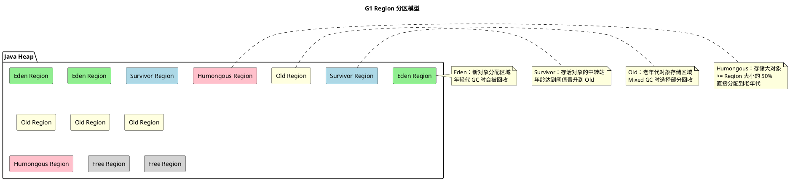
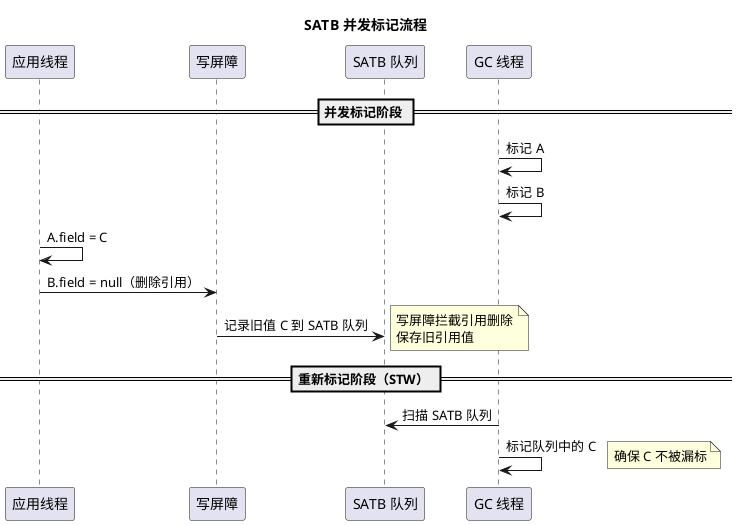
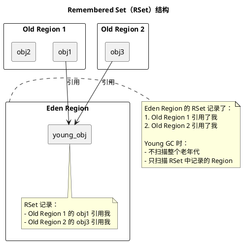
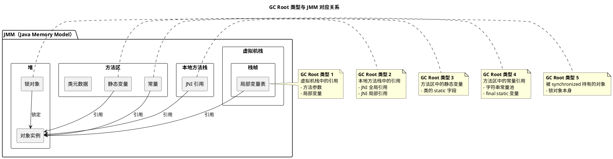

# G1 垃圾回收器详解

## 问题索引

- Q1：G1 垃圾回收器的设计目标和核心特点
- Q2：SATB（Snapshot At The Beginning）机制
- Q3：写屏障（Write Barrier）的作用
- Q4：Remembered Set（RSet）和卡表（Card Table）
- Q5：GC Root 结合 JMM 记忆

## Q1：G1 垃圾回收器的设计目标和核心特点

### 背景

G1（Garbage First）是 JDK 7 引入、JDK 9 成为默认 GC 的低延迟垃圾回收器。它的设计目标是在大堆内存（几个 GB 到几十 GB）场景下，提供可预测的停顿时间，同时保持高吞吐量。

### G1 的设计目标

1. **可预测的停顿时间**：通过 `-XX:MaxGCPauseMillis=200`（默认 200ms）设置目标停顿时间
2. **支持大堆**：适合 4GB 以上的堆内存
3. **高吞吐量**：在满足停顿时间目标的前提下，尽可能提高吞吐量
4. **避免内存碎片**：通过复制算法和 Region 设计避免碎片化

### Region 分区模型

G1 将堆内存划分为多个大小相等的 Region（默认 1MB，范围 1MB~32MB），每个 Region 可以动态扮演不同角色：



**四种 Region 类型**：

1. **Eden Region**：新对象分配区域，Young GC 时会被回收
2. **Survivor Region**：Young GC 后存活对象的中转站
3. **Old Region**：老年代对象存储区域，Mixed GC 时选择部分回收
4. **Humongous Region**：存储大对象（>= Region 大小的 50%），直接分配到老年代

### G1 的 GC 类型

1. **Young GC**：
   - 触发条件：Eden Region 用完
   - 回收范围：所有 Eden + Survivor Region
   - 采用复制算法，STW（Stop-The-World）
   - 存活对象复制到 Survivor 或晋升到 Old

2. **Mixed GC**：
   - 触发条件：老年代占用达到 `-XX:InitiatingHeapOccupancyPercent`（默认 45%）
   - 回收范围：所有 Young Region + **部分** Old Region
   - G1 会根据停顿时间目标，选择收益最高的 Old Region 回收（Garbage First）

3. **Full GC**：
   - 触发条件：Mixed GC 无法跟上分配速度、Humongous 对象分配失败、元空间不足
   - 回收范围：整个堆
   - 单线程 Serial Old，性能极差，应尽量避免

### G1 的核心优势

1. **分代收集**：保留年轻代和老年代的概念，但物理上不连续
2. **并发标记**：老年代标记阶段大部分工作并发执行
3. **空间整合**：Region 之间采用复制算法，避免碎片
4. **可预测停顿**：根据历史数据预测每个 Region 的回收时间，优先选择收益高的 Region

## Q2：SATB（Snapshot At The Beginning）机制

### 什么是 SATB

SATB（Snapshot At The Beginning，起始快照）是 G1 在并发标记阶段使用的算法，用于解决**并发标记过程中对象引用关系变化导致的漏标问题**。

### 为什么需要 SATB

在并发标记期间，应用线程继续运行，可能发生以下情况导致对象被错误回收（漏标）：

```java
// 初始状态：A -> B -> C
// 并发标记线程已经标记了 A 和 B

// 应用线程执行：
A.field = C;  // A 直接引用 C
B.field = null;  // B 断开对 C 的引用

// 如果没有 SATB：
// 1. 标记线程已经扫描过 A，不会再扫描 A.field
// 2. C 失去了 B 的引用，标记线程认为 C 不可达
// 3. C 被错误回收（漏标）
```

### SATB 的核心思想

**SATB 认为"标记开始时活着的对象，就应该被认为是活着的"**。具体做法：

1. **标记开始时拍摄快照**：逻辑上记录标记开始时的对象引用关系
2. **记录引用删除**：当删除引用时（`B.field = null`），将**被删除的引用值**（旧值）记录到 SATB 队列
3. **重新标记阶段处理队列**：在最终的 STW 重新标记阶段，扫描 SATB 队列，确保旧引用指向的对象不被漏标



### SATB 的权衡

**优点**：
- 简单高效，只需记录删除的引用
- 并发标记阶段对应用线程影响小

**缺点**：
- **浮动垃圾**（Floating Garbage）：标记开始后死亡的对象会被认为是活的，本轮 GC 不会回收，留到下一轮

```java
// 标记开始时：A -> B
// 标记期间：A.field = null（B 变成垃圾）
// SATB 不记录这种情况（只记录旧值删除）
// B 会在本轮 GC 中存活，下一轮才会被回收
```

### 业务场景

在高并发场景下，G1 的 SATB 机制保证了并发标记的正确性，避免了对象被错误回收。但需要注意：

- **浮动垃圾**会增加堆内存占用，触发更频繁的 GC
- 可以通过 `-XX:ConcGCThreads` 调整并发 GC 线程数，加快标记速度

## Q3：写屏障（Write Barrier）的作用

### 什么是写屏障

写屏障是在**写入对象引用字段时插入的一小段代码**，用于在引用关系变化时执行额外的记录操作。可以理解为 AOP 切面，在赋值操作前后插入钩子。

```java
// 原始代码：
obj.field = newValue;

// 编译后插入写屏障：
// 前置写屏障（Pre-Write Barrier）
if (G1 并发标记中 && newValue != null) {
    记录 obj.field 的旧值到 SATB 队列;  // 用于 SATB
}

// 实际赋值
obj.field = newValue;

// 后置写屏障（Post-Write Barrier）
if (newValue != null && obj 和 newValue 在不同 Region) {
    记录跨 Region 引用到 RSet;  // 用于 RSet 维护
}
```

### 写屏障的两种类型

#### 1. 前置写屏障（Pre-Write Barrier）

**作用**：服务于 SATB，记录被删除的引用（旧值）

```java
// JVM 伪代码
void pre_write_barrier(Object* obj, Object** field) {
    if (is_marking_active()) {  // 并发标记进行中
        Object* old_value = *field;  // 读取旧值
        if (old_value != NULL) {
            satb_enqueue(old_value);  // 旧值入队
        }
    }
}
```

**关键点**：
- 只在并发标记阶段激活
- 只记录旧值，不关心新值
- 旧值会在重新标记阶段被扫描

#### 2. 后置写屏障（Post-Write Barrier）

**作用**：维护 RSet，记录跨 Region 的引用关系

```java
// JVM 伪代码
void post_write_barrier(Object* obj, Object** field, Object* new_value) {
    if (new_value != NULL) {
        Region* obj_region = get_region(obj);
        Region* new_value_region = get_region(new_value);
        
        if (obj_region != new_value_region) {  // 跨 Region 引用
            rset_update(new_value_region, obj_region);  // 记录到 RSet
        }
    }
}
```

**关键点**：
- 全程激活（不仅在并发标记期间）
- 记录新值的跨 Region 引用
- 用于 Young GC 时缩小 GC Root 扫描范围

### 写屏障的性能开销

写屏障会增加每次引用赋值的开销，但 G1 做了优化：

1. **条件判断**：只有满足特定条件才执行记录操作
2. **批量处理**：SATB 队列和 RSet 更新是异步批量处理
3. **硬件支持**：现代 CPU 的分支预测和流水线优化

**实测开销**：通常在 5%~10% 之间，对于低延迟场景是可接受的。

## Q4：Remembered Set（RSet）和卡表（Card Table）

### 为什么需要 RSet

在分代 GC 中，Young GC 需要找到所有指向年轻代对象的引用（GC Root）。传统做法是扫描整个老年代，但老年代可能有几个 GB，扫描时间过长。

**RSet 的作用**：记录**谁引用了我**，缩小 GC Root 扫描范围。

```
传统做法（扫描整个老年代）：
Young GC 时间 = 扫描老年代时间 + 复制存活对象时间
扫描时间与老年代大小成正比，停顿时间长

G1 做法（只扫描 RSet）：
Young GC 时间 = 扫描 RSet 时间 + 复制存活对象时间
扫描时间与跨 Region 引用数量成正比，停顿时间短
```

### RSet 的数据结构

**每个 Region 都有自己的 RSet**，记录**其他 Region 中哪些对象引用了本 Region 的对象**。



**RSet 的维护时机**：通过**后置写屏障**维护

```java
// 当执行：old_obj.field = young_obj
// 后置写屏障会：
1. 检测到 old_obj 和 young_obj 在不同 Region
2. 在 young_obj 所在 Region 的 RSet 中记录：old_obj 所在 Region 引用了我
```

### 卡表（Card Table）

卡表是 RSet 的底层实现，将堆内存划分为固定大小的卡片（Card），通常 512 字节。

**卡表的结构**：

```
堆内存：[对象1] [对象2] [对象3] ...
         |______|______|______|
卡表：    Card0  Card1  Card2  ...
         [0]    [1]    [0]     // 0=干净，1=脏（有跨代引用）
```

**卡表的作用**：
1. **粗粒度记录**：不记录具体哪个对象引用了我，只记录哪个卡片（512 字节）有引用
2. **减少空间开销**：1 个字节对应 512 字节堆内存，空间开销 0.2%
3. **加速扫描**：Young GC 时只扫描标记为脏的卡片

**RSet vs 卡表的关系**：

- **卡表**：全局数据结构，记录整个堆的跨代引用情况
- **RSet**：每个 Region 的本地数据结构，记录谁引用了我，底层通过卡表实现

```java
// RSet 的实现（简化版）
class RememberedSet {
    Set<CardIndex> cards;  // 记录哪些卡片引用了本 Region
    
    void add_reference(Region* from_region) {
        cards.add(from_region.card_index);
    }
    
    void scan_references(Closure* closure) {
        for (CardIndex card : cards) {
            scan_card(card, closure);  // 扫描卡片中的对象
        }
    }
}
```

### RSet 的空间开销

RSet 本身会占用内存（通常 5%~10%），G1 提供了参数调整：

- `-XX:G1ReservePercent`：预留空间百分比，防止 RSet 膨胀导致 Full GC
- `-XX:G1HeapRegionSize`：Region 大小，越大则 RSet 越少，但停顿时间可能增加

## Q5：GC Root 结合 JMM 记忆

### GC Root 的定义

GC Root 是垃圾回收的起点，从 GC Root 出发可达的对象被认为是存活的，不可达的对象会被回收。

### GC Root 的类型



**详细说明**：

#### 1. 虚拟机栈中的引用
```java
public void method() {
    Object obj = new Object();  // obj 是 GC Root（局部变量）
    // obj 引用的对象不会被回收
}  // 方法结束，obj 出栈，对象可能被回收
```

**JMM 对应**：每个线程的虚拟机栈 → 栈帧 → 局部变量表

#### 2. 本地方法栈中的引用
```java
// JNI 代码
JNIEXPORT void JNICALL Java_Test_nativeMethod(JNIEnv *env, jobject obj) {
    jobject globalRef = (*env)->NewGlobalRef(env, obj);  // GC Root
    // globalRef 引用的对象不会被回收，直到显式删除
    (*env)->DeleteGlobalRef(env, globalRef);
}
```

**JMM 对应**：本地方法栈 → JNI 引用表

#### 3. 方法区中的静态变量
```java
public class Config {
    private static Connection conn = DriverManager.getConnection(...);  // GC Root
    // conn 引用的对象永远不会被回收（除非类卸载）
}
```

**JMM 对应**：方法区（JDK 8+ 是 Metaspace）→ 类的静态字段

#### 4. 方法区中的常量引用
```java
public class Constants {
    public static final String NAME = "Java";  // GC Root
    // 字符串常量池中的 "Java" 不会被回收
}
```

**JMM 对应**：方法区 → 运行时常量池

#### 5. 被 synchronized 持有的对象
```java
Object lock = new Object();
synchronized (lock) {  // lock 是 GC Root
    // lock 对象不会被回收
}
```

**JMM 对应**：Monitor 监视器锁 → 锁定的对象

### GC Root 扫描优化

G1 通过 RSet 优化了 GC Root 扫描：

```
传统 GC：
GC Root = 虚拟机栈 + 本地方法栈 + 方法区 + 整个老年代
扫描时间长，停顿时间不可控

G1：
GC Root = 虚拟机栈 + 本地方法栈 + 方法区 + RSet 记录的 Region
扫描时间短，停顿时间可预测
```

### 记忆技巧

结合 JMM 记忆 GC Root：

1. **栈上的都是 Root**：虚拟机栈、本地方法栈
2. **方法区的静态/常量是 Root**：static 字段、常量池
3. **正在使用的锁是 Root**：synchronized 锁对象

**口诀**：**栈方锁**（栈、方法区、锁）

## 踩坑点

### 1. G1 不是万能的

**场景**：小堆（< 4GB）或要求极致吞吐量的场景

**问题**：G1 的 RSet、写屏障、并发标记都有开销，小堆场景下反而不如 Parallel GC

**解决**：
- 堆 < 4GB：使用 Parallel GC（`-XX:+UseParallelGC`）
- 堆 >= 4GB 且关注延迟：使用 G1（`-XX:+UseG1GC`）

### 2. Full GC 仍然会发生

**场景**：高并发、大对象频繁分配

**问题**：Mixed GC 无法跟上分配速度，触发 Full GC

**解决**：
- 增大堆内存：`-Xmx`
- 降低 IHOP 阈值：`-XX:InitiatingHeapOccupancyPercent=35`（默认 45）
- 增加并发 GC 线程：`-XX:ConcGCThreads=4`
- 避免大对象：拆分或使用对象池

### 3. RSet 占用过多内存

**场景**：大量跨 Region 引用

**问题**：RSet 占用堆内存 10% 以上，触发 Full GC

**解决**：
- 增大 Region 大小：`-XX:G1HeapRegionSize=16m`（减少 Region 数量）
- 预留更多空间：`-XX:G1ReservePercent=15`（默认 10）
- 优化代码：减少老年代引用年轻代的情况

### 4. Humongous 对象分配失败

**场景**：大对象（> Region 50%）频繁分配

**问题**：Humongous Region 无法及时回收，触发 Full GC

**解决**：
- 增大 Region 大小：`-XX:G1HeapRegionSize=32m`
- 拆分大对象：改为流式处理
- 提前触发 Mixed GC：`-XX:G1MixedGCLiveThresholdPercent=65`（默认 85）

## 面试追问

### 1. G1 的 Region 大小如何确定？

**回答**：
- 默认根据堆大小自动计算，目标是 2048 个 Region
- 可通过 `-XX:G1HeapRegionSize` 手动指定（1MB~32MB，必须是 2 的幂）
- 计算公式：`Region 大小 = 堆大小 / 2048`（向上取整到 2 的幂）

**示例**：
- 堆 4GB：Region 大小 = 4GB / 2048 = 2MB
- 堆 16GB：Region 大小 = 16GB / 2048 = 8MB

### 2. G1 如何实现可预测的停顿时间？

**回答**：
- G1 维护历史数据，记录每个 Region 的回收时间和存活对象数量
- Mixed GC 时，根据 `-XX:MaxGCPauseMillis` 目标，选择收益最高的 Region
- 使用衰减平均算法预测回收时间，优先回收"垃圾多、耗时短"的 Region
- 如果预测时间超过目标，停止选择更多 Region

### 3. SATB 和 CMS 的增量更新有什么区别？

**回答**：

| 对比项 | SATB（G1） | 增量更新（CMS） |
|-------|-----------|---------------|
| 核心思想 | 记录删除的引用（旧值） | 记录新增的引用（新值） |
| 写屏障类型 | 前置写屏障 | 后置写屏障 |
| 浮动垃圾 | 多（标记开始后死亡的对象） | 少（只有新分配的对象） |
| 漏标风险 | 无 | 无 |
| 适用场景 | 对象引用变化频繁 | 对象引用变化较少 |

### 4. G1 的 Young GC 和 Mixed GC 有什么区别？

**回答**：

| 对比项 | Young GC | Mixed GC |
|-------|---------|---------|
| 触发条件 | Eden Region 用完 | 老年代占用超过 IHOP 阈值 |
| 回收范围 | 所有 Eden + Survivor | 所有 Young + 部分 Old |
| 标记阶段 | 无需标记（全部回收） | 需要并发标记 |
| 停顿时间 | 短（几十 ms） | 稍长（受 Old Region 数量影响） |
| 频率 | 高（分配速度快） | 低（老年代增长慢） |

### 5. G1 什么时候会触发 Full GC？

**回答**：

1. **Mixed GC 无法跟上分配速度**：老年代持续增长，Mixed GC 来不及回收
2. **Humongous 对象分配失败**：没有足够连续的 Region 存储大对象
3. **元空间不足**：Metaspace 达到 MaxMetaspaceSize
4. **显式调用 System.gc()**：应用代码主动触发
5. **RSet 占用过多内存**：导致堆空间不足

**避免 Full GC 的方法**：
- 增大堆内存
- 降低 IHOP 阈值，提前触发 Mixed GC
- 增加并发 GC 线程
- 避免大对象
- 监控 GC 日志，调整参数

### 6. 写屏障对性能的影响有多大？

**回答**：
- **开销**：通常 5%~10%，具体取决于应用的引用赋值频率
- **优化**：JIT 编译器会优化写屏障，现代 CPU 的分支预测也能减少开销
- **权衡**：虽然写屏障增加了吞吐量开销，但换来了低延迟和可预测的停顿时间

### 7. G1 的并发标记分为哪几个阶段？

**回答**：

1. **初始标记（Initial Mark）**：STW，标记 GC Root 直接引用的对象，通常与 Young GC 一起执行
2. **并发标记（Concurrent Mark）**：并发，遍历对象图，标记存活对象
3. **最终标记（Final Mark / Remark）**：STW，处理 SATB 队列，确保标记完整
4. **清理（Cleanup）**：STW（部分），统计每个 Region 的存活对象，选择回收候选集

### 8. RSet 和 Card Table 的关系是什么？

**回答**：
- **Card Table**：全局数据结构，将堆划分为固定大小的卡片（512 字节），标记是否有跨代引用
- **RSet**：每个 Region 的本地数据结构，记录**哪些卡片**引用了本 Region
- **关系**：RSet 底层通过 Card Table 实现，卡表是粗粒度的位图，RSet 是细粒度的引用记录

### 9. G1 如何处理跨 Region 的大对象？

**回答**：
- 大对象（>= Region 大小 50%）会被分配到 **Humongous Region**
- 一个大对象可能占用多个连续的 Humongous Region
- Humongous 对象直接分配到老年代，不经过 Eden
- 回收时机：Mixed GC 或 Full GC 时回收

### 10. G1 适合什么样的应用场景？

**回答**：

**适合**：
- 大堆内存（>= 4GB）
- 要求低延迟、可预测的停顿时间
- 服务端应用、Web 应用、微服务
- 对象存活率差异大（G1 可以选择性回收）

**不适合**：
- 小堆内存（< 4GB）：开销相对较大
- 要求极致吞吐量：Parallel GC 更合适
- 对象存活率非常高：复制算法开销大
- 实时系统：应该考虑 ZGC 或 Shenandoah

## 复习清单

- [ ] 能画出 G1 的 Region 分区模型，说明 Eden、Survivor、Old、Humongous 的作用
- [ ] 能解释 Young GC、Mixed GC、Full GC 的区别和触发条件
- [ ] 能说明 SATB 如何解决并发标记的漏标问题
- [ ] 理解写屏障的两种类型（前置、后置）及其作用
- [ ] 能解释 RSet 和 Card Table 的关系，以及如何优化 GC Root 扫描
- [ ] 能结合 JMM 说明 GC Root 的 5 种类型
- [ ] 知道 G1 的适用场景和不适合的场景
- [ ] 了解 G1 的常见踩坑点及优化方法
- [ ] 能回答 G1 如何实现可预测的停顿时间
- [ ] 理解 Humongous 对象的分配和回收机制
