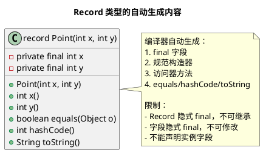

# Java 16 Record 类型与 Java 17 密封类

## 问题索引

- Q1：Java 16 Record 类型的核心特性
- Q2：Record 不可变的好处与实战场景
- Q3：Record 对可扩展性的影响与取舍
- Q4：Java 17 密封类与模式匹配

## Q1：Java 16 Record 类型的核心特性

### 背景

在 Java 16 之前，创建不可变数据类需要大量样板代码：

```java
// 传统方式：不可变数据类
public final class Point {
    private final int x;
    private final int y;
    
    public Point(int x, int y) {
        this.x = x;
        this.y = y;
    }
    
    public int x() { return x; }
    public int y() { return y; }
    
    @Override
    public boolean equals(Object o) {
        if (this == o) return true;
        if (!(o instanceof Point)) return false;
        Point point = (Point) o;
        return x == point.x && y == point.y;
    }
    
    @Override
    public int hashCode() {
        return Objects.hash(x, y);
    }
    
    @Override
    public String toString() {
        return "Point[x=" + x + ", y=" + y + "]";
    }
}
```

Java 16 引入 Record 类型，一行代码实现相同功能：

```java
// Record 方式：简洁的不可变数据类
public record Point(int x, int y) {}

// 自动生成：
// - private final 字段
// - public 访问器方法（x()、y()）
// - 构造器
// - equals()、hashCode()、toString()
```

### Record 的核心特性



#### 1. 自动生成的规范构造器

```java
public record User(String name, int age) {}

// 等价于：
public record User(String name, int age) {
    public User(String name, int age) {  // 规范构造器
        this.name = name;
        this.age = age;
    }
}

// 可以自定义规范构造器（紧凑形式）
public record User(String name, int age) {
    public User {  // 紧凑构造器，无需声明参数
        // 参数校验
        if (age < 0) {
            throw new IllegalArgumentException("Age cannot be negative");
        }
        // 无需手动赋值，编译器自动生成
    }
}

// 也可以声明额外的构造器（必须委托规范构造器）
public record User(String name, int age) {
    public User(String name) {
        this(name, 0);  // 委托规范构造器
    }
}
```

#### 2. 访问器方法

```java
public record Point(int x, int y) {}

Point p = new Point(10, 20);

// 访问器方法：无 get 前缀
int x = p.x();  // 而非 p.getX()
int y = p.y();

// 可以自定义访问器
public record Point(int x, int y) {
    @Override
    public int x() {
        System.out.println("Accessing x");
        return x;
    }
}
```

#### 3. equals、hashCode、toString

```java
public record Point(int x, int y) {}

Point p1 = new Point(10, 20);
Point p2 = new Point(10, 20);

// equals：基于所有字段的值比较
System.out.println(p1.equals(p2));  // true

// hashCode：基于所有字段
System.out.println(p1.hashCode() == p2.hashCode());  // true

// toString：格式化输出
System.out.println(p1);  // Point[x=10, y=20]

// 可以自定义
public record Point(int x, int y) {
    @Override
    public String toString() {
        return "(" + x + ", " + y + ")";
    }
}
```

#### 4. 静态成员和实例方法

```java
public record Point(int x, int y) {
    // 静态字段：允许
    public static final Point ORIGIN = new Point(0, 0);
    
    // 静态方法：允许
    public static double distance(Point p1, Point p2) {
        int dx = p1.x - p2.x;
        int dy = p1.y - p2.y;
        return Math.sqrt(dx * dx + dy * dy);
    }
    
    // 实例方法：允许
    public double distanceFromOrigin() {
        return Math.sqrt(x * x + y * y);
    }
    
    // 实例字段：不允许！
    // private int cachedHashCode;  // 编译错误
}
```

#### 5. 接口实现

```java
public interface Drawable {
    void draw();
}

public record Circle(int x, int y, int radius) implements Drawable {
    @Override
    public void draw() {
        System.out.println("Drawing circle at (" + x + ", " + y + ") with radius " + radius);
    }
}
```

### 核心约束

1. **隐式 final**：Record 不能被继承，也不能继承其他类（可以实现接口）
2. **字段隐式 final**：所有字段都是 `private final`，创建后不可修改
3. **不能声明实例字段**：只能声明静态字段
4. **规范构造器必须存在**：可以是编译器生成或手动声明

## Q2：Record 不可变的好处与实战场景

### 不可变的优势

#### 1. 线程安全

```java
// Record 天然线程安全，无需同步
public record UserProfile(String userId, String name, List<String> roles) {}

// 多线程并发访问，无并发问题
UserProfile profile = new UserProfile("user123", "Alice", List.of("admin", "user"));

// 线程 1
Thread t1 = new Thread(() -> {
    String name = profile.name();  // 读操作，安全
});

// 线程 2
Thread t2 = new Thread(() -> {
    String userId = profile.userId();  // 读操作，安全
});

// 注意：如果字段是可变对象（如 List），需要防御性复制
public record UserProfile(String userId, String name, List<String> roles) {
    public UserProfile {
        roles = List.copyOf(roles);  // 防御性复制，确保不可变
    }
}
```

#### 2. 简化并发编程

```java
// 不可变对象可以安全地共享和传递
public record Order(String orderId, BigDecimal amount, LocalDateTime createdAt) {}

// 生产者-消费者模式，无需加锁
BlockingQueue<Order> queue = new LinkedBlockingQueue<>();

// 生产者
executor.submit(() -> {
    Order order = new Order("ORD001", new BigDecimal("99.99"), LocalDateTime.now());
    queue.put(order);  // 安全传递
});

// 消费者
executor.submit(() -> {
    Order order = queue.take();
    process(order);  // 安全使用，无并发问题
});
```

#### 3. 作为 HashMap 的 key

```java
// Record 的 equals 和 hashCode 基于值，适合作为 Map 的 key
public record Coordinate(int x, int y) {}

Map<Coordinate, String> map = new HashMap<>();
map.put(new Coordinate(10, 20), "Point A");

// 可以用新对象查询（值相等即可）
String value = map.get(new Coordinate(10, 20));  // "Point A"

// 不可变保证 hashCode 不会改变，避免 Map 失效
```

#### 4. 缓存友好

```java
// 不可变对象可以安全缓存
public record Product(String id, String name, BigDecimal price) {}

// 缓存 Record 对象，无需担心被修改
private final Map<String, Product> cache = new ConcurrentHashMap<>();

public Product getProduct(String id) {
    return cache.computeIfAbsent(id, k -> fetchFromDB(k));
}

// 返回的 Product 对象可以被多个调用者共享，无并发问题
```

### 实战场景

#### 场景 1：DTO（数据传输对象）

```java
// API 响应对象
public record UserResponse(
    String userId,
    String username,
    String email,
    LocalDateTime createdAt
) {}

// 微服务间调用
@RestController
public class UserController {
    @GetMapping("/users/{id}")
    public UserResponse getUser(@PathVariable String id) {
        User user = userService.findById(id);
        return new UserResponse(
            user.getId(),
            user.getUsername(),
            user.getEmail(),
            user.getCreatedAt()
        );
    }
}
```

#### 场景 2：查询结果封装

```java
// 数据库查询结果
public record OrderSummary(
    String orderId,
    String customerName,
    BigDecimal totalAmount,
    int itemCount
) {}

// MyBatis 查询
@Select("SELECT order_id, customer_name, total_amount, item_count FROM orders WHERE order_id = #{orderId}")
OrderSummary findOrderSummary(String orderId);

// Spring Data JPA 查询
interface OrderRepository extends JpaRepository<Order, String> {
    @Query("SELECT new com.example.OrderSummary(o.id, o.customer.name, o.totalAmount, size(o.items)) FROM Order o WHERE o.id = :orderId")
    OrderSummary findSummary(@Param("orderId") String orderId);
}
```

#### 场景 3：事件溯源（Event Sourcing）

```java
// 领域事件（不可变，便于审计和重放）
public sealed interface OrderEvent {
    record OrderCreated(String orderId, String customerId, LocalDateTime timestamp) implements OrderEvent {}
    record OrderPaid(String orderId, BigDecimal amount, LocalDateTime timestamp) implements OrderEvent {}
    record OrderShipped(String orderId, String trackingNumber, LocalDateTime timestamp) implements OrderEvent {}
    record OrderCancelled(String orderId, String reason, LocalDateTime timestamp) implements OrderEvent {}
}

// 事件存储
List<OrderEvent> events = List.of(
    new OrderEvent.OrderCreated("ORD001", "CUST001", LocalDateTime.now()),
    new OrderEvent.OrderPaid("ORD001", new BigDecimal("99.99"), LocalDateTime.now()),
    new OrderEvent.OrderShipped("ORD001", "TRACK123", LocalDateTime.now())
);

// 状态重建（不可变事件保证可靠重放）
Order rebuildOrder(List<OrderEvent> events) {
    Order order = new Order();
    for (OrderEvent event : events) {
        order = applyEvent(order, event);
    }
    return order;
}
```

#### 场景 4：配置对象

```java
// 不可变配置（避免运行时被意外修改）
public record DatabaseConfig(
    String url,
    String username,
    String password,
    int maxPoolSize,
    Duration connectionTimeout
) {
    // 配置校验
    public DatabaseConfig {
        if (maxPoolSize <= 0) {
            throw new IllegalArgumentException("maxPoolSize must be positive");
        }
        if (connectionTimeout.isNegative()) {
            throw new IllegalArgumentException("connectionTimeout cannot be negative");
        }
    }
    
    // 默认配置
    public static DatabaseConfig defaults() {
        return new DatabaseConfig(
            "jdbc:mysql://localhost:3306/mydb",
            "root",
            "password",
            10,
            Duration.ofSeconds(30)
        );
    }
}
```

#### 场景 5：值对象（Value Object）

```java
// DDD 值对象
public record Money(BigDecimal amount, Currency currency) {
    public Money {
        if (amount.compareTo(BigDecimal.ZERO) < 0) {
            throw new IllegalArgumentException("Amount cannot be negative");
        }
    }
    
    // 业务方法
    public Money add(Money other) {
        if (!currency.equals(other.currency)) {
            throw new IllegalArgumentException("Currency mismatch");
        }
        return new Money(amount.add(other.amount), currency);
    }
    
    public Money multiply(int factor) {
        return new Money(amount.multiply(BigDecimal.valueOf(factor)), currency);
    }
}

public record Email(String address) {
    private static final Pattern EMAIL_PATTERN = Pattern.compile("^[A-Za-z0-9+_.-]+@[A-Za-z0-9.-]+$");
    
    public Email {
        if (!EMAIL_PATTERN.matcher(address).matches()) {
            throw new IllegalArgumentException("Invalid email address");
        }
    }
}
```

#### 场景 6：函数式编程

```java
// Stream 操作中的中间结果
public record ProductScore(String productId, double score) {}

List<ProductScore> topProducts = products.stream()
    .map(p -> new ProductScore(p.getId(), calculateScore(p)))  // Record 作为中间结果
    .sorted(Comparator.comparingDouble(ProductScore::score).reversed())
    .limit(10)
    .toList();
```

## Q3：Record 对可扩展性的影响与取舍

### 可扩展性的限制

#### 1. 不能继承

```java
// Record 隐式 final，不能被继承
public record Point(int x, int y) {}

// 编译错误：无法继承 Record
public record Point3D(int x, int y, int z) extends Point {}

// 也不能继承其他类
public record MyRecord(String value) extends SomeClass {}  // 编译错误
```

**权衡**：
- **优势**：简化继承层次，避免复杂的多态关系
- **劣势**：无法通过继承扩展功能

**解决方案**：使用接口和组合

```java
// 使用接口定义契约
public interface Coordinate {
    int x();
    int y();
}

public record Point2D(int x, int y) implements Coordinate {}

public record Point3D(int x, int y, int z) implements Coordinate {
    // 增加 z 维度，但不继承 Point2D
}

// 使用组合扩展功能
public record LabeledPoint(Point2D point, String label) {}
```

#### 2. 字段不可修改

```java
// 反例：尝试修改 Record
public record User(String name, int age) {}

User user = new User("Alice", 25);
// user.age = 26;  // 编译错误：字段是 final

// 只能创建新对象
User updatedUser = new User(user.name(), 26);
```

**权衡**：
- **优势**：线程安全、简化并发
- **劣势**：频繁修改时性能开销大（需创建新对象）

**解决方案 1**：使用 wither 方法

```java
public record User(String name, int age) {
    // wither 方法：返回修改后的新对象
    public User withName(String name) {
        return new User(name, this.age);
    }
    
    public User withAge(int age) {
        return new User(this.name, age);
    }
}

User user = new User("Alice", 25);
User updated = user.withAge(26);  // 流畅 API
```

**解决方案 2**：使用 Builder（需要频繁修改时）

```java
// 当字段较多且需要频繁修改时，使用 Builder
public record User(String name, int age, String email, String phone) {
    public static Builder builder() {
        return new Builder();
    }
    
    public static class Builder {
        private String name;
        private int age;
        private String email;
        private String phone;
        
        public Builder name(String name) {
            this.name = name;
            return this;
        }
        
        public Builder age(int age) {
            this.age = age;
            return this;
        }
        
        public Builder email(String email) {
            this.email = email;
            return this;
        }
        
        public Builder phone(String phone) {
            this.phone = phone;
            return this;
        }
        
        public User build() {
            return new User(name, age, email, phone);
        }
    }
}

// 使用 Builder
User user = User.builder()
    .name("Alice")
    .age(25)
    .email("alice@example.com")
    .phone("1234567890")
    .build();
```

#### 3. 无法添加实例字段

```java
// 反例：添加缓存字段
public record Point(int x, int y) {
    // private int cachedHashCode;  // 编译错误：不能声明实例字段
}
```

**权衡**：
- **优势**：保证不可变性
- **劣势**：无法缓存计算结果（如 hashCode）

**解决方案**：使用 `@Memo` 注解（Lombok）或手动缓存

```java
// 方案 1：外部缓存
private static final Map<Point, Integer> hashCodeCache = new ConcurrentHashMap<>();

public record Point(int x, int y) {
    @Override
    public int hashCode() {
        return hashCodeCache.computeIfAbsent(this, p -> Objects.hash(p.x, p.y));
    }
}

// 方案 2：如果确实需要缓存，使用传统类
public final class Point {
    private final int x;
    private final int y;
    private int cachedHashCode;  // 延迟计算
    
    @Override
    public int hashCode() {
        if (cachedHashCode == 0) {
            cachedHashCode = Objects.hash(x, y);
        }
        return cachedHashCode;
    }
}
```

### 适用场景与不适用场景

#### 适用场景

1. **DTO/VO**：数据传输对象、值对象
2. **配置对象**：不可变配置，避免运行时修改
3. **事件对象**：事件溯源、审计日志
4. **查询结果**：数据库查询、API 响应
5. **函数式编程**：Stream 中间结果、函数参数/返回值

#### 不适用场景

1. **JPA 实体**：JPA 要求无参构造器、可变字段
2. **频繁修改的对象**：创建新对象的开销大
3. **需要继承的类**：Record 不支持继承
4. **需要缓存的对象**：无法添加实例字段缓存计算结果

```java
// 反例：JPA 实体
@Entity
public record User(Long id, String name) {}  // 不推荐

// 正例：使用传统类
@Entity
public class User {
    @Id
    @GeneratedValue
    private Long id;
    
    private String name;
    
    // getters, setters, 无参构造器
}

// 但可以将 JPA 实体转换为 Record DTO
@Entity
public class User {
    // JPA 实体字段和方法
    
    public UserDTO toDTO() {
        return new UserDTO(id, name, email);
    }
}

public record UserDTO(Long id, String name, String email) {}
```

### 性能权衡

```java
// 场景：频繁修改对象

// 传统可变对象
class MutableCounter {
    private int count;
    
    public void increment() {
        count++;  // 直接修改，无额外开销
    }
}

// Record（不可变）
record ImmutableCounter(int count) {
    public ImmutableCounter increment() {
        return new ImmutableCounter(count + 1);  // 创建新对象，有 GC 开销
    }
}

// 性能测试（100 万次递增）：
// MutableCounter：约 5ms
// ImmutableCounter：约 50ms（包括对象创建和 GC）

// 结论：频繁修改时，传统可变对象性能更好
```

**权衡建议**：
- **读多写少**：使用 Record（线程安全、简洁）
- **写多读少**：使用传统可变类（性能更好）
- **混合场景**：根据具体业务决策

## Q4：Java 17 密封类与模式匹配

### 密封类（Sealed Classes）

密封类允许**显式声明哪些类可以继承它**，提供比 `final` 更灵活的继承控制。

```java
// 密封类：只允许 Circle、Rectangle、Triangle 继承
public sealed interface Shape
    permits Circle, Rectangle, Triangle {}

// 允许的子类
public final class Circle implements Shape {
    private final double radius;
    // ...
}

public final class Rectangle implements Shape {
    private final double width;
    private final double height;
    // ...
}

public non-sealed class Triangle implements Shape {
    private final double a, b, c;
    // ... Triangle 可以被进一步继承
}
```

### 密封类的三种子类声明

1. **final**：子类不能再被继承
2. **sealed**：子类也是密封的，必须声明 `permits`
3. **non-sealed**：解除密封，允许任意继承

```java
public sealed interface Payment
    permits CreditCardPayment, BankTransferPayment, WalletPayment {}

// 1. final：不可再继承
public final class CreditCardPayment implements Payment {}

// 2. sealed：继续密封
public sealed class BankTransferPayment implements Payment
    permits DomesticTransfer, InternationalTransfer {}

public final class DomesticTransfer extends BankTransferPayment {}
public final class InternationalTransfer extends BankTransferPayment {}

// 3. non-sealed：解除密封
public non-sealed class WalletPayment implements Payment {}

public class AlipayPayment extends WalletPayment {}  // 可以继承
```

### 密封类 + Record：完美组合

```java
// 密封接口 + Record：类型安全的枚举
public sealed interface Result<T, E>
    permits Result.Success, Result.Failure {
    
    record Success<T, E>(T value) implements Result<T, E> {}
    record Failure<T, E>(E error) implements Result<T, E> {}
}

// 使用示例
Result<User, String> result = findUser(userId);

switch (result) {
    case Result.Success(User user) -> System.out.println("Found: " + user.name());
    case Result.Failure(String error) -> System.err.println("Error: " + error);
}
```

### 模式匹配（Pattern Matching）

#### instanceof 模式匹配（Java 16）

```java
// Java 14 之前
if (obj instanceof String) {
    String s = (String) obj;  // 需要显式转换
    System.out.println(s.length());
}

// Java 16+：模式匹配
if (obj instanceof String s) {  // 直接声明变量
    System.out.println(s.length());  // 无需转换
}

// 还可以结合逻辑运算
if (obj instanceof String s && s.length() > 5) {
    System.out.println("Long string: " + s);
}
```

#### switch 模式匹配（Java 17 预览，Java 21 正式）

```java
// 密封类 + switch 模式匹配
public sealed interface Order
    permits PendingOrder, PaidOrder, ShippedOrder, CancelledOrder {}

public record PendingOrder(String orderId, BigDecimal amount) implements Order {}
public record PaidOrder(String orderId, BigDecimal amount, LocalDateTime paidAt) implements Order {}
public record ShippedOrder(String orderId, String trackingNumber) implements Order {}
public record CancelledOrder(String orderId, String reason) implements Order {}

// switch 模式匹配
String describe(Order order) {
    return switch (order) {
        case PendingOrder(String id, BigDecimal amount) ->
            "Pending order " + id + " for $" + amount;
        case PaidOrder(String id, BigDecimal amount, LocalDateTime paidAt) ->
            "Paid order " + id + " on " + paidAt;
        case ShippedOrder(String id, String tracking) ->
            "Shipped order " + id + " with tracking " + tracking;
        case CancelledOrder(String id, String reason) ->
            "Cancelled order " + id + ": " + reason;
    };
}

// 编译器保证：所有子类都被覆盖（穷尽性检查）
// 如果遗漏某个子类，编译错误
```

### 实战场景

#### 场景 1：状态机

```java
// 订单状态机
public sealed interface OrderState
    permits Created, PaymentPending, Paid, Shipped, Completed, Cancelled {}

public record Created(String orderId, LocalDateTime createdAt) implements OrderState {}
public record PaymentPending(String orderId, Duration timeout) implements OrderState {}
public record Paid(String orderId, BigDecimal amount) implements OrderState {}
public record Shipped(String orderId, String trackingNumber) implements OrderState {}
public record Completed(String orderId, LocalDateTime completedAt) implements OrderState {}
public record Cancelled(String orderId, String reason) implements OrderState {}

// 状态转换
OrderState processPayment(OrderState state, BigDecimal amount) {
    return switch (state) {
        case PaymentPending(String id, Duration timeout) ->
            new Paid(id, amount);  // 支付成功
        case Created c ->
            throw new IllegalStateException("Cannot pay before pending");
        case Paid p ->
            p;  // 已支付，幂等
        case Shipped s ->
            throw new IllegalStateException("Already shipped");
        case Completed c ->
            throw new IllegalStateException("Already completed");
        case Cancelled c ->
            throw new IllegalStateException("Order cancelled");
    };
}
```

#### 场景 2：表达式 AST

```java
// 表达式抽象语法树
public sealed interface Expr
    permits Const, Add, Multiply, Negate {}

public record Const(int value) implements Expr {}
public record Add(Expr left, Expr right) implements Expr {}
public record Multiply(Expr left, Expr right) implements Expr {}
public record Negate(Expr expr) implements Expr {}

// 递归求值
int eval(Expr expr) {
    return switch (expr) {
        case Const(int value) -> value;
        case Add(Expr left, Expr right) -> eval(left) + eval(right);
        case Multiply(Expr left, Expr right) -> eval(left) * eval(right);
        case Negate(Expr e) -> -eval(e);
    };
}

// 示例：(2 + 3) * 4
Expr expr = new Multiply(
    new Add(new Const(2), new Const(3)),
    new Const(4)
);
System.out.println(eval(expr));  // 20
```

#### 场景 3：JSON AST

```java
// JSON 值类型
public sealed interface JsonValue
    permits JsonNull, JsonBoolean, JsonNumber, JsonString, JsonArray, JsonObject {}

public record JsonNull() implements JsonValue {}
public record JsonBoolean(boolean value) implements JsonValue {}
public record JsonNumber(double value) implements JsonValue {}
public record JsonString(String value) implements JsonValue {}
public record JsonArray(List<JsonValue> elements) implements JsonValue {}
public record JsonObject(Map<String, JsonValue> fields) implements JsonValue {}

// 序列化
String serialize(JsonValue value) {
    return switch (value) {
        case JsonNull() -> "null";
        case JsonBoolean(boolean b) -> String.valueOf(b);
        case JsonNumber(double n) -> String.valueOf(n);
        case JsonString(String s) -> "\"" + s + "\"";
        case JsonArray(List<JsonValue> elements) ->
            "[" + elements.stream().map(this::serialize).collect(Collectors.joining(", ")) + "]";
        case JsonObject(Map<String, JsonValue> fields) ->
            "{" + fields.entrySet().stream()
                .map(e -> "\"" + e.getKey() + "\": " + serialize(e.getValue()))
                .collect(Collectors.joining(", ")) + "}";
    };
}
```

## 踩坑点

### 1. Record 字段的防御性复制

**问题**：Record 字段是可变对象时，不可变性被破坏

```java
// 反例：可变字段
public record User(String name, List<String> roles) {}

List<String> roles = new ArrayList<>(List.of("admin"));
User user = new User("Alice", roles);

// 外部修改 roles，破坏不可变性
roles.add("superadmin");
System.out.println(user.roles());  // [admin, superadmin]

// 通过访问器修改
user.roles().add("hacker");  // 修改成功！
```

**解决**：防御性复制

```java
// 正例：防御性复制
public record User(String name, List<String> roles) {
    public User {
        roles = List.copyOf(roles);  // 不可变副本
    }
}

List<String> roles = new ArrayList<>(List.of("admin"));
User user = new User("Alice", roles);

roles.add("superadmin");  // 不影响 user
System.out.println(user.roles());  // [admin]

// user.roles().add("hacker");  // UnsupportedOperationException
```

### 2. 密封类的 permits 限制

**问题**：子类必须在同一模块或包中

```java
// 反例：跨包继承
package com.example.api;
public sealed interface Shape permits com.example.impl.Circle {}  // 编译错误

// 正例：同包或同模块
package com.example.api;
public sealed interface Shape permits Circle, Rectangle {}

public final class Circle implements Shape {}
public final class Rectangle implements Shape {}
```

### 3. switch 模式匹配的顺序

**问题**：更具体的模式必须在更通用的模式之前

```java
// 反例：顺序错误
String describe(Object obj) {
    return switch (obj) {
        case Object o -> "Any object";  // 过于通用，后续 case 永远不会执行
        case String s -> "String: " + s;  // 编译错误：unreachable
        case Integer i -> "Integer: " + i;
    };
}

// 正例：从具体到通用
String describe(Object obj) {
    return switch (obj) {
        case String s -> "String: " + s;
        case Integer i -> "Integer: " + i;
        case Object o -> "Other: " + o;  // 兜底
    };
}
```

### 4. Record 的序列化问题

**问题**：Record 的序列化与传统类不同

```java
// Record 序列化使用规范构造器
public record User(String name, int age) implements Serializable {}

// 反序列化时调用 User(String, int) 构造器
// 如果构造器有校验逻辑，反序列化可能失败

public record User(String name, int age) implements Serializable {
    public User {
        if (age < 0) {
            throw new IllegalArgumentException("Age cannot be negative");
        }
    }
}

// 反序列化负数 age 时抛异常
```

## 面试追问

### 1. Record 和 Lombok 的 @Value 有什么区别？

**回答**：

| 特性 | Record | Lombok @Value |
|------|--------|--------------|
| **语言支持** | JDK 16+ 原生支持 | 需要 Lombok 依赖 |
| **编译器处理** | javac 直接支持 | 注解处理器生成代码 |
| **访问器** | `name()`（无 get 前缀） | `getName()`（标准 JavaBean） |
| **继承** | 不可继承 | 可以继承（但不推荐） |
| **IDE 支持** | 原生支持，无需插件 | 需要 Lombok 插件 |
| **调试** | 更友好（原生语法） | 生成代码可能难调试 |

### 2. Record 适合作为 JPA 实体吗？

**回答**：
- **不适合**：JPA 要求无参构造器、可变字段、getter/setter
- **替代方案**：
  1. JPA 实体用传统类
  2. 将实体转换为 Record DTO 返回给调用方
  3. 使用 Hibernate 6.2+ 的 Record 支持（实验性）

### 3. 密封类的 permits 可以省略吗？

**回答**：
- **可以**：如果所有子类在同一文件中
  ```java
  sealed interface Shape {}
  final class Circle implements Shape {}  // 同一文件，无需 permits
  ```
- **不可以**：如果子类在不同文件或不同包

### 4. switch 模式匹配如何保证穷尽性？

**回答**：
- 密封类的子类是**有限且已知的**
- 编译器检查 switch 是否覆盖所有子类
- 如果遗漏，编译错误：`the switch expression does not cover all possible input values`

### 5. Record 的性能开销有多大？

**回答**：
- **创建开销**：与传统类相同（对象头 + 字段）
- **访问开销**：访问器方法会被 JIT 内联，接近直接字段访问
- **GC 开销**：频繁创建新对象时，GC 压力大于可变对象
- **结论**：读多写少的场景，性能影响可忽略；写多读少的场景，考虑使用可变类

## 复习清单

- [ ] 理解 Record 自动生成的内容（构造器、访问器、equals/hashCode/toString）
- [ ] 知道 Record 的核心约束（final、不可变、无实例字段）
- [ ] 能说明 Record 不可变的优势（线程安全、缓存友好、作为 Map key）
- [ ] 了解 Record 的实战场景（DTO、事件、值对象、配置）
- [ ] 理解 Record 对可扩展性的影响（不可继承、字段不可修改）
- [ ] 知道如何使用 wither 方法和 Builder 模式扩展 Record
- [ ] 理解密封类的三种子类声明（final、sealed、non-sealed）
- [ ] 能使用密封类 + Record 实现类型安全的枚举
- [ ] 掌握 switch 模式匹配的用法和穷尽性检查
- [ ] 知道 Record 字段的防御性复制和序列化注意事项
