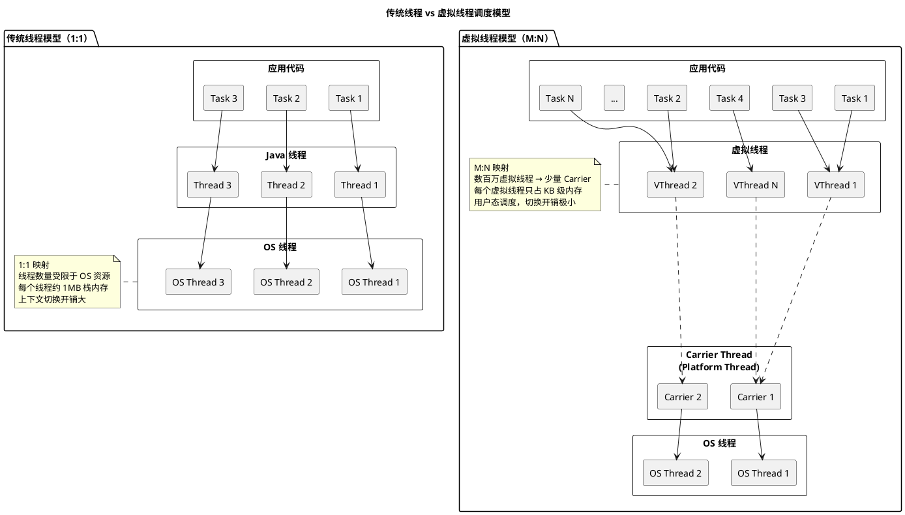
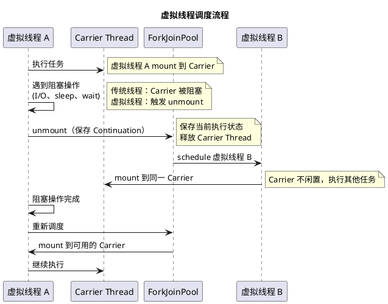
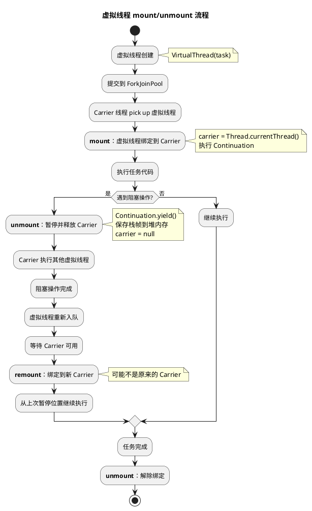

# Java 21 虚拟线程与并发安全

## 问题索引

- Q1：虚拟线程与传统线程池的底层调度差别
- Q2：虚拟线程的实现原理与 Continuation
- Q3：虚拟线程的并发安全处理
- Q4：虚拟线程的避坑指南

## Q1：虚拟线程与传统线程池的底层调度差别

### 背景

传统的 Java 线程（Platform Thread）是对操作系统线程的直接封装，创建和上下文切换开销大。线程池通过复用线程来降低开销，但线程数量仍然受限于系统资源。

```java
// 传统线程模型的限制
ExecutorService executor = Executors.newFixedThreadPool(200);

// 问题：
// 1. 200 个线程 = 200 个 OS 线程 = 约 200MB 栈内存（每个线程 1MB 栈）
// 2. 大量阻塞 I/O 时，线程被浪费在等待上
// 3. 上下文切换开销大（毫秒级）
```

Java 21 引入的虚拟线程（Virtual Thread）采用 M:N 调度模型，数百万个虚拟线程可以映射到少量操作系统线程上。

### 调度模型对比



### 核心差异

| 对比项 | 传统线程（Platform Thread） | 虚拟线程（Virtual Thread） |
|-------|---------------------------|--------------------------|
| **映射关系** | 1:1（Java 线程 : OS 线程） | M:N（虚拟线程 : Carrier 线程） |
| **调度器** | OS 内核调度 | JVM 用户态调度 |
| **栈内存** | 约 1MB（固定大小） | 几 KB 起步（动态增长） |
| **创建开销** | 毫秒级 | 微秒级 |
| **上下文切换** | 毫秒级（内核态） | 纳秒级（用户态） |
| **数量限制** | 数千到数万（受 OS 限制） | 数百万（受堆内存限制） |
| **阻塞成本** | 高（线程被挂起，资源浪费） | 低（自动 unmount，Carrier 执行其他虚拟线程） |

### 调度流程



### 代码示例

```java
// 传统线程池：固定 200 个线程
ExecutorService executor = Executors.newFixedThreadPool(200);

for (int i = 0; i < 10000; i++) {
    executor.submit(() -> {
        // 阻塞 I/O，线程被浪费
        String result = httpClient.get("https://api.example.com");
        process(result);
    });
}
// 问题：10000 个任务排队，只有 200 个并发执行

// 虚拟线程：每个任务一个虚拟线程
try (var executor = Executors.newVirtualThreadPerTaskExecutor()) {
    for (int i = 0; i < 10000; i++) {
        executor.submit(() -> {
            // 阻塞 I/O 时自动 unmount，Carrier 执行其他任务
            String result = httpClient.get("https://api.example.com");
            process(result);
        });
    }
}
// 优势：10000 个虚拟线程并发执行，Carrier 数量 = CPU 核心数
```

### 业务场景

**适合虚拟线程的场景**：
1. **高并发 I/O**：Web 服务、API 网关、微服务调用
2. **阻塞操作多**：数据库查询、HTTP 调用、文件 I/O
3. **任务数量巨大**：爬虫、批处理、消息消费

**不适合虚拟线程的场景**：
1. **CPU 密集型**：大量计算，没有阻塞操作（虚拟线程无优势）
2. **pinning 严重**：synchronized 块内阻塞（后续详述）
3. **需要线程池复用**：连接池、对象池等资源管理

## Q2：虚拟线程的实现原理与 Continuation

### Continuation（续体）

虚拟线程的核心是 Continuation，它是一种"可暂停、可恢复"的计算单元。

```java
// Continuation 的伪代码示例（JDK 内部 API）
Continuation cont = new Continuation(scope, () -> {
    System.out.println("Step 1");
    Continuation.yield(scope);  // 暂停执行，保存状态
    System.out.println("Step 2");
    Continuation.yield(scope);  // 再次暂停
    System.out.println("Step 3");
});

// 第 1 次运行
cont.run();  // 输出 "Step 1"，然后暂停

// 第 2 次运行
cont.run();  // 输出 "Step 2"，然后暂停

// 第 3 次运行
cont.run();  // 输出 "Step 3"，执行完毕
```

### 虚拟线程的内部结构

```java
// 简化的虚拟线程实现
class VirtualThread extends Thread {
    private Continuation cont;       // 续体：保存执行状态
    private Thread carrier;          // Carrier 线程（平台线程）
    private Runnable task;           // 要执行的任务
    
    @Override
    public void run() {
        // mount：将虚拟线程绑定到 Carrier
        carrier = Thread.currentThread();
        
        // 运行 Continuation
        cont = new Continuation(() -> {
            task.run();
        });
        
        cont.run();
        
        // unmount：解除绑定
        carrier = null;
    }
    
    // 阻塞操作触发 unmount
    void park() {
        Continuation.yield();  // 暂停 Continuation，保存栈帧
        // Carrier 线程被释放，可执行其他虚拟线程
    }
    
    // 唤醒时重新 mount
    void unpark() {
        // 将虚拟线程提交到 ForkJoinPool，等待调度
        ForkJoinPool.commonPool().submit(this);
    }
}
```

### mount 和 unmount



### Continuation 的栈帧管理

```
传统线程：
  栈内存固定分配（1MB）
  位于线程私有的栈空间（Thread Stack）
  
虚拟线程：
  栈帧存储在堆内存（Heap）
  动态分配，按需增长（初始几 KB）
  unmount 时栈帧保存到 Continuation 对象
  remount 时栈帧恢复到 Carrier 的栈空间
```

```java
// 栈帧保存示例
void processRequest() {
    String data = readFromDB();    // 局部变量：存储在 Continuation
    sleep(1000);                   // 阻塞操作 → unmount
    // unmount 时保存：data、返回地址、方法参数
    sendToService(data);           // remount 后继续执行
}

// unmount 时的 Continuation 对象结构：
Continuation {
    栈帧 1: processRequest()
      局部变量: data = "..."
      返回地址: line 3
    栈帧 2: caller()
      ...
}
```

### ForkJoinPool 的作用

虚拟线程使用 `ForkJoinPool` 作为调度器：

```java
// 默认的 Carrier Pool
ForkJoinPool carrierPool = new ForkJoinPool(
    Runtime.getRuntime().availableProcessors(),  // Carrier 数量 = CPU 核心数
    ForkJoinPool.defaultForkJoinWorkerThreadFactory,
    null,
    true  // asyncMode = true（FIFO 队列）
);
```

**调度策略**：
1. **Work-Stealing**：空闲 Carrier 从其他 Carrier 的任务队列窃取虚拟线程
2. **FIFO 队列**：虚拟线程按 FIFO 顺序执行，避免饥饿
3. **Compensation Thread**：所有 Carrier 被阻塞时，临时创建新 Carrier（避免死锁）

## Q3：虚拟线程的并发安全处理

### 线程安全的继承性

虚拟线程继承了传统线程的并发安全模型：

```java
// 1. synchronized：仍然可用，但有 pinning 问题（后续详述）
private synchronized void criticalSection() {
    // 临界区代码
}

// 2. ReentrantLock：推荐使用，支持 unmount
private final ReentrantLock lock = new ReentrantLock();

void criticalSection() {
    lock.lock();
    try {
        // 临界区代码
        // 如果这里发生阻塞（如 I/O），虚拟线程仍能 unmount
    } finally {
        lock.unlock();
    }
}

// 3. volatile、Atomic 类：与传统线程一致
private volatile boolean flag = true;
private final AtomicInteger counter = new AtomicInteger(0);

// 4. ThreadLocal：每个虚拟线程独立
private static final ThreadLocal<String> context = new ThreadLocal<>();
```

### ThreadLocal 的开销

虚拟线程数量可达百万级，`ThreadLocal` 的内存占用需要注意：

```java
// 传统线程池：200 个线程
ExecutorService executor = Executors.newFixedThreadPool(200);
ThreadLocal<Connection> conn = ThreadLocal.withInitial(() -> createConnection());

// ThreadLocal 占用：200 个连接（可控）

// 虚拟线程：100 万个虚拟线程
try (var executor = Executors.newVirtualThreadPerTaskExecutor()) {
    for (int i = 0; i < 1_000_000; i++) {
        executor.submit(() -> {
            Connection c = conn.get();  // 100 万个连接！内存爆炸
        });
    }
}
```

**解决方案**：使用 `ScopedValue`（Java 21 预览特性）

```java
// ScopedValue：不可变、共享的上下文
private static final ScopedValue<String> REQUEST_ID = ScopedValue.newInstance();

void handleRequest(String requestId) {
    ScopedValue.where(REQUEST_ID, requestId).run(() -> {
        process();  // 内部可通过 REQUEST_ID.get() 获取
    });
}

// 优势：
// 1. 不可变，避免并发修改
// 2. 作用域明确，自动清理
// 3. 内存占用低（共享，不是每个线程一份）
```

### 共享状态的并发控制

虚拟线程数量巨大，共享状态的竞争会更激烈：

```java
// 示例：100 万个虚拟线程并发修改计数器
private final AtomicLong counter = new AtomicLong(0);

try (var executor = Executors.newVirtualThreadPerTaskExecutor()) {
    for (int i = 0; i < 1_000_000; i++) {
        executor.submit(() -> {
            counter.incrementAndGet();  // 高竞争
        });
    }
}

// 优化方案 1：LongAdder（降低竞争）
private final LongAdder counter = new LongAdder();

executor.submit(() -> {
    counter.increment();  // 内部分段计数，降低竞争
});
long total = counter.sum();

// 优化方案 2：分段统计 + 最后汇总
ConcurrentHashMap<Integer, LongAdder> segmentCounters = new ConcurrentHashMap<>();

executor.submit(() -> {
    int segment = Thread.currentThread().hashCode() % 100;
    segmentCounters.computeIfAbsent(segment, k -> new LongAdder()).increment();
});

long total = segmentCounters.values().stream().mapToLong(LongAdder::sum).sum();
```

### happens-before 保证

虚拟线程的 happens-before 规则与传统线程一致：

```java
// volatile 写 happens-before volatile 读
private volatile boolean ready = false;
private String data;

// 虚拟线程 1
Thread.startVirtualThread(() -> {
    data = "Hello";
    ready = true;  // volatile 写
});

// 虚拟线程 2
Thread.startVirtualThread(() -> {
    if (ready) {  // volatile 读
        System.out.println(data);  // 保证看到 "Hello"
    }
});
```

## Q4：虚拟线程的避坑指南

### 1. Pinning（钉住）问题

**问题**：虚拟线程在 `synchronized` 块内阻塞时，无法 unmount，Carrier 被"钉住"。

```java
// 反例：synchronized 块内阻塞
private final Object lock = new Object();

Thread.startVirtualThread(() -> {
    synchronized (lock) {
        // 阻塞操作：虚拟线程无法 unmount，Carrier 被浪费
        String result = httpClient.get("https://api.example.com");
    }
});

// 后果：
// 1. Carrier 被长时间占用，无法执行其他虚拟线程
// 2. 如果所有 Carrier 都被 pin，系统吞吐量下降
// 3. 可能触发 Compensation Thread（创建额外 Carrier）
```

**解决方案**：使用 `ReentrantLock` 替代 `synchronized`

```java
// 正例：ReentrantLock 支持 unmount
private final ReentrantLock lock = new ReentrantLock();

Thread.startVirtualThread(() -> {
    lock.lock();
    try {
        // 阻塞操作：虚拟线程自动 unmount，Carrier 执行其他任务
        String result = httpClient.get("https://api.example.com");
    } finally {
        lock.unlock();
    }
});
```

**检测 Pinning**：

```java
// JVM 参数：检测 pinning 事件
// -Djdk.tracePinnedThreads=full

// 输出示例：
// Thread[#123,ForkJoinPool-1-worker-1,5,CarrierThreads]
//     java.base/java.lang.VirtualThread$VThreadContinuation.onPinned
//     at com.example.Service.process(Service.java:42)  // synchronized 块
```

### 2. CPU 密集型任务的性能下降

**问题**：CPU 密集型任务使用虚拟线程无性能提升，反而有调度开销。

```java
// 反例：CPU 密集型任务
try (var executor = Executors.newVirtualThreadPerTaskExecutor()) {
    for (int i = 0; i < 1000; i++) {
        executor.submit(() -> {
            // 纯计算，没有阻塞操作
            long result = fibonacci(40);
        });
    }
}

// 问题：
// 1. 虚拟线程无 unmount 机会（没有阻塞操作）
// 2. Carrier 数量 = CPU 核心数，并发度受限
// 3. 调度开销反而拖累性能
```

**解决方案**：CPU 密集型任务使用传统线程池

```java
// 正例：固定大小的线程池
ExecutorService executor = Executors.newFixedThreadPool(
    Runtime.getRuntime().availableProcessors()
);

for (int i = 0; i < 1000; i++) {
    executor.submit(() -> {
        long result = fibonacci(40);
    });
}
```

### 3. 线程池大小设置错误

**问题**：将虚拟线程放入固定大小的线程池，失去虚拟线程的优势。

```java
// 反例：限制虚拟线程数量
ExecutorService executor = Executors.newFixedThreadPool(
    200,
    Thread.ofVirtual().factory()  // 使用虚拟线程，但限制了 200 个
);

// 问题：
// 1. 虚拟线程数量受限，无法发挥高并发优势
// 2. 相当于"轻量级的传统线程池"
```

**解决方案**：使用 `newVirtualThreadPerTaskExecutor`

```java
// 正例：每个任务一个虚拟线程
try (var executor = Executors.newVirtualThreadPerTaskExecutor()) {
    for (int i = 0; i < 1_000_000; i++) {
        executor.submit(() -> {
            // 高并发 I/O 任务
        });
    }
}
```

### 4. 监控和调试困难

**问题**：虚拟线程数量巨大，传统的线程监控工具无法使用。

```java
// 传统方式：JStack 查看线程栈
// jstack <pid>  // 输出 100 万个虚拟线程？不现实
```

**解决方案**：

1. **JFR（Java Flight Recorder）**：记录虚拟线程事件

```bash
# 启动 JFR 记录
jcmd <pid> JFR.start name=virtual-threads settings=profile

# 停止并导出
jcmd <pid> JFR.dump name=virtual-threads filename=virtual-threads.jfr

# 使用 JDK Mission Control 分析
```

2. **自定义监控**：

```java
// 使用 MBean 监控虚拟线程
ThreadMXBean threadMXBean = ManagementFactory.getThreadMXBean();

// 注意：虚拟线程不计入 threadMXBean.getThreadCount()
// 需要自定义统计
AtomicLong activeVirtualThreads = new AtomicLong(0);

Thread.startVirtualThread(() -> {
    activeVirtualThreads.incrementAndGet();
    try {
        // 任务逻辑
    } finally {
        activeVirtualThreads.decrementAndGet();
    }
});
```

3. **结构化并发（Structured Concurrency）**：

```java
// Java 21 预览特性：StructuredTaskScope
try (var scope = new StructuredTaskScope.ShutdownOnFailure()) {
    Future<String> user = scope.fork(() -> fetchUser(userId));
    Future<List<Order>> orders = scope.fork(() -> fetchOrders(userId));
    
    scope.join();           // 等待所有子任务完成
    scope.throwIfFailed();  // 任一子任务失败则抛异常
    
    return new UserProfile(user.resultNow(), orders.resultNow());
}

// 优势：
// 1. 子任务生命周期绑定到 scope
// 2. 自动取消未完成的子任务
// 3. 异常传播清晰
```

### 5. 内存占用暴增

**问题**：虚拟线程数量过多，堆内存不足。

```java
// 问题：100 万个虚拟线程，每个占用 1KB，总计约 1GB
try (var executor = Executors.newVirtualThreadPerTaskExecutor()) {
    for (int i = 0; i < 1_000_000; i++) {
        executor.submit(() -> {
            // 任务逻辑
        });
    }
}

// 堆内存压力：
// 1. Continuation 对象
// 2. 栈帧数据
// 3. ThreadLocal 数据
```

**解决方案**：

1. **限流**：控制并发任务数量

```java
Semaphore semaphore = new Semaphore(10000);  // 最多 1 万个并发任务

for (int i = 0; i < 1_000_000; i++) {
    semaphore.acquire();
    executor.submit(() -> {
        try {
            // 任务逻辑
        } finally {
            semaphore.release();
        }
    });
}
```

2. **避免 ThreadLocal**：使用 `ScopedValue` 或手动传参

```java
// 反例：ThreadLocal
ThreadLocal<Connection> conn = ThreadLocal.withInitial(() -> createConnection());

// 正例：ScopedValue
ScopedValue<Connection> conn = ScopedValue.newInstance();
ScopedValue.where(conn, createConnection()).run(() -> {
    // 使用 conn.get()
});
```

3. **增大堆内存**：

```bash
java -Xmx8g -XX:+UseZGC MyApp  # ZGC 低延迟 GC
```

### 6. 死锁和活锁

**问题**：虚拟线程数量巨大，死锁检测更复杂。

```java
// 死锁示例
ReentrantLock lock1 = new ReentrantLock();
ReentrantLock lock2 = new ReentrantLock();

// 虚拟线程 1
Thread.startVirtualThread(() -> {
    lock1.lock();
    sleep(10);
    lock2.lock();  // 等待锁 2
});

// 虚拟线程 2
Thread.startVirtualThread(() -> {
    lock2.lock();
    sleep(10);
    lock1.lock();  // 等待锁 1
});

// 问题：传统的死锁检测工具（jstack）对虚拟线程支持有限
```

**解决方案**：

1. **超时获取锁**：

```java
if (lock.tryLock(1, TimeUnit.SECONDS)) {
    try {
        // 临界区
    } finally {
        lock.unlock();
    }
} else {
    // 获取锁超时，避免死锁
}
```

2. **锁顺序**：始终按相同顺序获取多个锁

```java
// 定义全局锁顺序
List<ReentrantLock> locks = Arrays.asList(lock1, lock2);
locks.sort(Comparator.comparingInt(System::identityHashCode));

for (ReentrantLock lock : locks) {
    lock.lock();
}
```

## 踩坑点总结

| 问题 | 原因 | 解决方案 |
|------|------|---------|
| **Pinning** | synchronized 块内阻塞 | 使用 ReentrantLock |
| **CPU 密集型性能下降** | 无阻塞操作，调度开销反而增加 | 使用传统线程池 |
| **线程池限制** | 固定大小的虚拟线程池 | 使用 newVirtualThreadPerTaskExecutor |
| **监控困难** | 虚拟线程数量巨大 | JFR、自定义监控、结构化并发 |
| **内存占用暴增** | 虚拟线程 + ThreadLocal 占用堆内存 | 限流、ScopedValue、增大堆 |
| **死锁** | 虚拟线程数量多，死锁检测困难 | tryLock、锁顺序 |

## 面试追问

### 1. 虚拟线程的栈帧为什么存储在堆上？

**回答**：
- 传统线程的栈固定分配（约 1MB），无法动态调整
- 虚拟线程数量巨大（百万级），固定栈会耗尽内存
- 堆内存可动态分配和回收，按需增长（初始几 KB）
- unmount 时将栈帧保存到 Continuation 对象（堆上），remount 时恢复

### 2. 虚拟线程如何避免栈溢出？

**回答**：
- 虚拟线程的栈存储在堆上，大小受堆内存限制（而非固定栈大小）
- 如果递归过深，会抛出 `OutOfMemoryError`（堆内存不足）而非 `StackOverflowError`
- 可通过 `-Xmx` 调整堆大小，但仍需避免过深递归

### 3. 为什么 synchronized 会导致 pinning？

**回答**：
- `synchronized` 的底层实现依赖 JVM 的 ObjectMonitor（C++ 实现）
- 进入 synchronized 块时，虚拟线程的状态被标记为"持有监视器锁"
- JVM 当前实现无法在持有监视器锁时 unmount（技术限制）
- `ReentrantLock` 是纯 Java 实现，支持 unmount

### 4. 虚拟线程的 Carrier 数量为什么是 CPU 核心数？

**回答**：
- Carrier 是真正执行代码的平台线程（OS 线程）
- CPU 核心数代表真正的并行能力
- 过多的 Carrier 会增加上下文切换开销，无法提升性能
- 虚拟线程通过 unmount/remount 实现高并发，Carrier 数量无需增加

### 5. 虚拟线程适合替代所有线程池吗？

**回答**：
- **适合**：I/O 密集型、高并发、阻塞操作多的场景
- **不适合**：
  - CPU 密集型（无 unmount 机会）
  - 需要线程复用的资源管理（如连接池）
  - pinning 严重的场景（大量 synchronized 块）

### 6. ScopedValue vs ThreadLocal 的区别？

**回答**：

| 特性 | ThreadLocal | ScopedValue |
|------|------------|-------------|
| **可变性** | 可变（set/get） | 不可变（只读） |
| **作用域** | 线程生命周期（需手动清理） | 明确的代码块作用域 |
| **内存占用** | 每个线程一份 | 共享（不可变） |
| **并发安全** | 需手动保证 | 天然线程安全 |
| **适用场景** | 传统线程池 | 虚拟线程（高并发） |

### 7. 虚拟线程如何处理 I/O 操作？

**回答**：
- **阻塞 I/O**：自动 unmount，Carrier 执行其他虚拟线程
- **NIO（非阻塞 I/O）**：也会 unmount（JVM 检测到阻塞点）
- **异步 I/O（CompletableFuture）**：可结合使用，但虚拟线程已足够轻量

### 8. 虚拟线程的上下文切换开销有多大？

**回答**：
- **传统线程**：毫秒级（内核态切换，保存/恢复寄存器、缓存）
- **虚拟线程**：纳秒到微秒级（用户态切换，只保存/恢复栈帧）
- **性能提升**：约 1000 倍（取决于硬件和 JVM 实现）

## 复习清单

- [ ] 理解虚拟线程的 M:N 调度模型与传统 1:1 模型的区别
- [ ] 能说明 Continuation 的作用和 mount/unmount 流程
- [ ] 知道虚拟线程的栈帧存储在堆上，按需增长
- [ ] 理解 Carrier 线程的作用和数量为 CPU 核心数的原因
- [ ] 能解释 pinning 问题的原因和解决方案（ReentrantLock）
- [ ] 知道虚拟线程适合 I/O 密集型、不适合 CPU 密集型
- [ ] 理解 ThreadLocal 在虚拟线程中的内存问题，使用 ScopedValue 替代
- [ ] 能使用 JFR 和自定义监控工具监控虚拟线程
- [ ] 知道如何避免虚拟线程的死锁和内存占用问题
- [ ] 理解结构化并发（StructuredTaskScope）的优势
