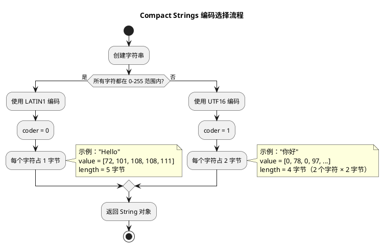
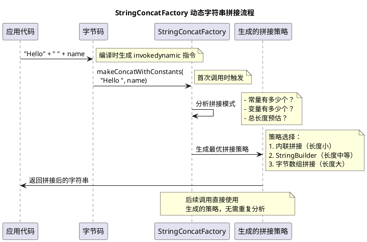
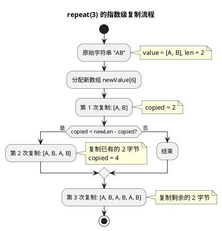
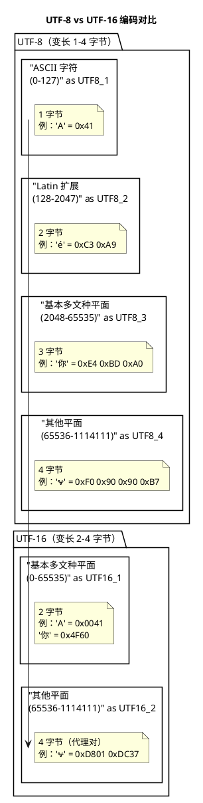

# Java 9+ 字符串优化与 StringConcatFactory

## 问题索引

- Q1：Java 9 的 Compact Strings 优化
- Q2：StringConcatFactory 动态字符串拼接
- Q3：Java 11+ 高效 String 接口（isBlank、repeat、strip）
- Q4：UTF-8 与 UTF-16 的本质区别

## Q1：Java 9 的 Compact Strings 优化

### 背景

在 Java 8 及之前，String 内部使用 `char[]` 存储字符，每个字符占用 2 字节（UTF-16 编码）。但实际应用中，大部分字符串只包含 Latin-1 字符（ASCII 范围内），每个字符只需要 1 字节即可表示，造成了 50% 的内存浪费。

```java
// Java 8 及之前
public final class String {
    private final char[] value;  // 每个字符 2 字节
}

// 示例："Hello" 占用 10 字节（5 个字符 × 2 字节）
// 但实际上每个字符只需要 1 字节（ASCII 范围内）
```

### Java 9 的 Compact Strings

Java 9 引入 Compact Strings，将 `char[]` 改为 `byte[]`，并通过 `coder` 字段标识编码方式。

```java
// Java 9+
public final class String {
    private final byte[] value;  // 字节数组
    private final byte coder;    // 编码标识：LATIN1(0) 或 UTF16(1)
    
    static final byte LATIN1 = 0;  // Latin-1 编码（1 字节/字符）
    static final byte UTF16 = 1;   // UTF-16 编码（2 字节/字符）
}
```

**编码选择策略**：

1. **创建字符串时判断**：如果所有字符都在 Latin-1 范围内（0-255），使用 LATIN1 编码；否则使用 UTF16 编码
2. **Latin-1 字符串**：每个字符占 1 字节，`value.length == 字符数量`
3. **UTF-16 字符串**：每个字符占 2 字节，`value.length == 字符数量 × 2`



### 核心实现

```java
// String 构造器示例（简化版）
public String(char[] value, int offset, int count) {
    if (count == 0) {
        this.value = "".value;
        this.coder = "".coder;
        return;
    }
    
    // 检查是否可以使用 LATIN1 编码
    if (COMPACT_STRINGS) {
        byte[] val = StringUTF16.compress(value, offset, count);
        if (val != null) {
            // 所有字符都在 Latin-1 范围内
            this.value = val;
            this.coder = LATIN1;
            return;
        }
    }
    
    // 使用 UTF16 编码
    this.value = StringUTF16.toBytes(value, offset, count);
    this.coder = UTF16;
}

// StringUTF16.compress 实现（简化版）
static byte[] compress(char[] val, int off, int len) {
    byte[] ret = new byte[len];
    for (int i = 0; i < len; i++) {
        char c = val[off + i];
        if (c > 0xFF) {  // 超出 Latin-1 范围
            return null;  // 无法压缩
        }
        ret[i] = (byte) c;  // 只取低 8 位
    }
    return ret;
}
```

### 性能提升

1. **内存占用减少 50%**（纯 Latin-1 字符串）
2. **GC 压力降低**：更少的内存分配和回收
3. **缓存友好**：更小的内存占用，CPU 缓存命中率更高

```java
// 内存对比（64 位 JVM，开启指针压缩）
String s = "Hello";  // 5 个字符

// Java 8：
// 对象头：12 字节
// char[] 引用：4 字节
// hash 字段：4 字节
// char[] 对象头：12 字节
// char[] 数据：10 字节（5 × 2）
// 对齐填充：6 字节
// 总计：48 字节

// Java 9+（LATIN1）：
// 对象头：12 字节
// byte[] 引用：4 字节
// coder 字段：1 字节
// hash 字段：4 字节
// 对齐填充：3 字节
// byte[] 对象头：12 字节
// byte[] 数据：5 字节
// 对齐填充：3 字节
// 总计：44 字节（主要节省在数组数据部分）
```

### 业务场景

1. **日志系统**：大量英文日志字符串，内存占用显著降低
2. **JSON 序列化**：英文 key 和部分 value，内存和性能双重优化
3. **国际化应用**：根据实际内容动态选择编码，兼顾性能和功能

## Q2：StringConcatFactory 动态字符串拼接

### 背景

在 Java 9 之前，字符串拼接通过 `StringBuilder` 实现：

```java
// 源代码
String s = "Hello" + " " + "World";

// Java 8 编译后的字节码等价于：
String s = new StringBuilder()
    .append("Hello")
    .append(" ")
    .append("World")
    .toString();
```

**问题**：
1. 每次拼接都要创建 `StringBuilder` 对象
2. 拼接策略固定，无法根据运行时情况优化
3. 无法利用新的字符串优化（Compact Strings）

### Java 9 的 StringConcatFactory

Java 9 引入 `invokedynamic` 指令和 `StringConcatFactory`，将字符串拼接的策略选择推迟到运行时。

```java
// 源代码
String s = "Hello" + " " + name;

// Java 9+ 编译后的字节码（简化）：
String s = StringConcatFactory.makeConcatWithConstants(
    "Hello ",  // 常量部分， 是占位符
    name             // 变量部分
);
```

### 核心原理



### 拼接策略

`StringConcatFactory` 根据字符串长度和复杂度选择不同的拼接策略：

#### 1. 内联拼接（MH_INLINE_SIZED_EXACT）

适用于简单、短字符串的拼接：

```java
// 生成的等价代码（伪代码）
String concat(String arg1) {
    int len = 6 + arg1.length();  // "Hello " 长度 6
    byte[] buf = new byte[len];
    
    // 复制 "Hello "
    System.arraycopy("Hello ".value, 0, buf, 0, 6);
    
    // 复制 arg1
    arg1.getBytes(0, arg1.length(), buf, 6);
    
    return new String(buf, LATIN1);  // 或 UTF16
}
```

#### 2. StringBuilder 策略（MH_SB_SIZED_EXACT）

适用于中等复杂度的拼接：

```java
// 生成的等价代码
String concat(String arg1, String arg2) {
    int capacity = 6 + arg1.length() + arg2.length();
    StringBuilder sb = new StringBuilder(capacity);
    return sb.append("Hello ").append(arg1).append(arg2).toString();
}
```

#### 3. 字节数组拼接（MH_NEW_ARRAY）

适用于复杂、长字符串的拼接：

```java
// 直接在字节数组上操作，避免 StringBuilder 的开销
byte[] newArray(int length, byte coder) {
    return new byte[length << coder];  // coder=0 (LATIN1) 或 1 (UTF16)
}
```

### 性能对比

```java
// 性能测试（拼接 3 个字符串，循环 100 万次）
String result = "Hello" + " " + "World";

// Java 8（StringBuilder）：约 120ms
// Java 9+（StringConcatFactory）：约 80ms
// 性能提升：约 33%
```

**优势**：
1. **首次调用开销**：生成拼接策略需要时间，但会缓存
2. **后续调用高效**：直接使用生成的策略，无需重复分析
3. **自适应优化**：JIT 可以进一步内联和优化生成的代码

### 业务场景

1. **日志拼接**：频繁的字符串拼接，性能提升明显
2. **SQL 拼接**：动态 SQL 生成，减少对象创建
3. **JSON 构建**：复杂的字符串拼接，内存和性能双重优化

## Q3：Java 11+ 高效 String 接口

### 新增接口

Java 11 新增了多个高效的 String 方法，利用 `byte[]` 和 `coder` 字段进行优化。

#### 1. isBlank() - 判断空白字符串

```java
public boolean isBlank() {
    return indexOfNonWhitespace() == length();
}

private int indexOfNonWhitespace() {
    // 根据 coder 选择不同的实现
    return isLatin1() 
        ? StringLatin1.indexOfNonWhitespace(value)
        : StringUTF16.indexOfNonWhitespace(value);
}

// StringLatin1.indexOfNonWhitespace 实现
static int indexOfNonWhitespace(byte[] value) {
    int length = value.length;
    for (int i = 0; i < length; i++) {
        // 直接操作字节数组，无需 char 转换
        if (value[i] != ' ' && value[i] != '\t' && 
            value[i] != '\n' && value[i] != '\r') {
            return i;
        }
    }
    return length;
}
```

**优势**：
- **直接操作字节数组**：无需 `char[]` 转换，减少内存分配
- **分支优化**：根据 `coder` 选择最优实现，Latin-1 字符串只需 1 字节比较

#### 2. repeat(int count) - 重复字符串

```java
public String repeat(int count) {
    if (count < 0) {
        throw new IllegalArgumentException("count is negative: " + count);
    }
    if (count == 1) {
        return this;
    }
    final int len = value.length;
    if (len == 0 || count == 0) {
        return "";
    }
    
    // 检查溢出
    if (len > Integer.MAX_VALUE / count) {
        throw new OutOfMemoryError("Repeating " + len + " bytes String " +
                                   count + " times will produce a String exceeding maximum size.");
    }
    
    // 高效的字节数组复制
    int newLen = len * count;
    byte[] newValue = new byte[newLen];
    
    // 第一次复制
    System.arraycopy(value, 0, newValue, 0, len);
    
    // 指数级复制（每次复制已复制的部分）
    int copied = len;
    while (copied < newLen - copied) {
        System.arraycopy(newValue, 0, newValue, copied, copied);
        copied <<= 1;  // copied *= 2
    }
    
    // 复制剩余部分
    System.arraycopy(newValue, 0, newValue, copied, newLen - copied);
    
    return new String(newValue, coder);
}
```

**优势**：
- **指数级复制**：时间复杂度从 O(n×count) 优化到 O(n×log(count))
- **直接操作字节数组**：无需逐字符复制，利用 `System.arraycopy` 的底层优化



#### 3. strip() / stripLeading() / stripTrailing() - 去除空白

```java
// strip() 去除前后空白（包括 Unicode 空白字符）
public String strip() {
    String ret = isLatin1() 
        ? StringLatin1.strip(value)
        : StringUTF16.strip(value);
    return ret == null ? this : ret;
}

// StringLatin1.strip 实现
static String strip(byte[] value) {
    int len = value.length;
    int left = indexOfNonWhitespace(value);
    if (left == len) {
        return "";  // 全是空白字符
    }
    int right = lastIndexOfNonWhitespace(value);
    
    // 无需去除空白，直接返回原字符串
    return (left > 0 || right < len - 1) 
        ? newString(value, left, right - left + 1)
        : null;
}

// 判断是否为 Unicode 空白字符（Latin-1 范围内）
private static boolean isWhitespace(byte b) {
    // Latin-1 空白字符：空格、制表符、换行符、回车符等
    return b == ' ' || b == '\t' || b == '\n' || b == '\r' || 
           b == '\f' || b == 0x0B;  // 垂直制表符
}
```

**vs trim() 的区别**：

| 方法 | 空白字符定义 | Unicode 支持 | 性能 |
|------|-------------|-------------|------|
| `trim()` | `<= 0x20`（ASCII 空格） | 否 | 快 |
| `strip()` | `Character.isWhitespace()` | 是 | 稍慢（需判断更多字符） |

**优势**：
- **直接操作字节数组**：无需 `toCharArray()`
- **单次遍历**：找到左右边界后直接创建新字符串
- **避免不必要的分配**：如果无需去除空白，返回 `null`（外层返回 `this`）

### 性能对比

```java
// 性能测试（isBlank，100 万次调用）
String s = "   ";

// Java 8（手动实现）：约 150ms
boolean blank = s.trim().isEmpty();

// Java 11+（isBlank）：约 80ms
boolean blank = s.isBlank();

// 性能提升：约 47%
```

### 业务场景

1. **表单验证**：`isBlank()` 判断用户输入是否为空
2. **模板生成**：`repeat()` 生成分隔符、占位符
3. **日志清理**：`strip()` 去除日志前后空白，兼容 Unicode

## Q4：UTF-8 与 UTF-16 的本质区别

### 核心定义

- **UTF-8**：变长编码，1-4 字节表示一个字符
- **UTF-16**：变长编码，2 或 4 字节表示一个字符



### 详细对比

| 对比项 | UTF-8 | UTF-16 |
|-------|-------|--------|
| **编码单位** | 8 位（1 字节） | 16 位（2 字节） |
| **ASCII 兼容** | 完全兼容（0-127 编码相同） | 不兼容（需补 0） |
| **常见字符** | 英文 1 字节，中文 3 字节 | 英文 2 字节，中文 2 字节 |
| **内存占用** | 英文占优势 | 中文占优势 |
| **随机访问** | 不支持（变长编码） | 基本支持（BMP 内 2 字节固定） |
| **字节序** | 无字节序问题 | 有字节序（BE/LE） |
| **应用场景** | 网络传输、文件存储、Web | 内存处理、Java/Windows 内部 |

### 编码示例

#### 示例 1：英文字符 'A'

```
Unicode 码点：U+0041

UTF-8：
  二进制：0100 0001
  十六进制：0x41
  字节数：1 字节

UTF-16：
  二进制：0000 0000 0100 0001
  十六进制：0x0041
  字节数：2 字节
```

#### 示例 2：中文字符 '你'

```
Unicode 码点：U+4F60

UTF-8：
  二进制：1110 0100 1011 1101 1010 0000
  十六进制：0xE4 0xBD 0xA0
  字节数：3 字节
  
  编码规则：
  1110 xxxx  10xx xxxx  10xx xxxx
       0100    11 1101    10 0000
       ↓       ↓          ↓
       4       F          60

UTF-16：
  二进制：0100 1111 0110 0000
  十六进制：0x4F60
  字节数：2 字节
```

#### 示例 3：Emoji '😀' (U+1F600)

```
Unicode 码点：U+1F600（超出 BMP，需代理对）

UTF-8：
  二进制：1111 0000 1001 1111 1001 1000 1000 0000
  十六进制：0xF0 0x9F 0x98 0x80
  字节数：4 字节

UTF-16（代理对）：
  高位代理：0xD83D（1101 1000 0011 1101）
  低位代理：0xDE00（1101 1110 0000 0000）
  字节数：4 字节
  
  计算过程：
  码点 - 0x10000 = 0x0F600
  高 10 位：0x03D（加 0xD800 = 0xD83D）
  低 10 位：0x200（加 0xDC00 = 0xDE00）
```

### Java 中的选择

```java
// Java 内部使用 UTF-16（char 类型 2 字节）
char c = 'A';      // 占用 2 字节
char c = '你';     // 占用 2 字节
char c = '😀';     // 错误！需要代理对

// Java 9+ String 使用 byte[] + coder
// Latin-1 字符串：1 字节/字符（类似 UTF-8 的 ASCII 部分）
// UTF-16 字符串：2 字节/字符

// 文件 I/O 通常使用 UTF-8
Files.writeString(path, content, StandardCharsets.UTF_8);
```

**为什么 Java 内部使用 UTF-16？**

1. **历史原因**：Java 1.0 时 Unicode 只有 BMP（0-65535），认为 2 字节固定长度足够
2. **随机访问**：UTF-16 在 BMP 内可以 O(1) 访问字符（`charAt(i)`）
3. **Windows 兼容**：Windows 内部也使用 UTF-16

**为什么文件/网络使用 UTF-8？**

1. **ASCII 兼容**：现有 ASCII 文件无需转换
2. **空间效率**：英文内容占用更少（1 字节 vs 2 字节）
3. **无字节序问题**：UTF-8 无 BE/LE 之分

### 性能权衡

```java
// 场景 1：英文为主的文本
String text = "Hello World";  // 11 个字符

// UTF-8 存储：11 字节
// UTF-16 存储：22 字节
// UTF-8 占优势

// 场景 2：中文为主的文本
String text = "你好世界";  // 4 个字符

// UTF-8 存储：12 字节（4 × 3）
// UTF-16 存储：8 字节（4 × 2）
// UTF-16 占优势

// 场景 3：混合文本
String text = "Hello 你好";  // 8 个字符

// UTF-8 存储：11 字节（5 × 1 + 1 × 1 + 2 × 3）
// UTF-16 存储：16 字节（8 × 2）
// UTF-8 占优势（英文占比高时）
```

## 踩坑点

### 1. Compact Strings 的性能陷阱

**场景**：频繁拼接 Latin-1 和非 Latin-1 字符串

```java
String latin = "Hello";       // coder = LATIN1
String chinese = "你好";       // coder = UTF16

// 拼接时需要将 latin 从 LATIN1 转换为 UTF16
String result = latin + chinese;  // 需要额外的转换开销
```

**解决**：
- 尽量保持编码一致性
- 大量拼接时预估最终编码，提前转换

### 2. repeat() 的内存溢出

**场景**：大字符串重复次数过多

```java
String s = "A".repeat(Integer.MAX_VALUE);  // OutOfMemoryError
```

**解决**：
- 检查 `length × count` 是否超过 `Integer.MAX_VALUE`
- 使用流式处理代替大字符串

### 3. strip() vs trim() 的行为差异

**场景**：处理特殊空白字符

```java
String s = " Hello";  // 不间断空格（Unicode 160）

s.trim();   // " Hello"（未去除，trim 只处理 <= 0x20）
s.strip();  // "Hello"（已去除，strip 处理所有 Unicode 空白）
```

**解决**：
- 国际化场景使用 `strip()`
- 纯 ASCII 场景使用 `trim()`（性能更好）

### 4. UTF-8/UTF-16 转换的性能开销

**场景**：频繁的编码转换

```java
// 从文件读取（UTF-8）到内存（UTF-16）到网络发送（UTF-8）
String content = Files.readString(path, UTF_8);  // UTF-8 → UTF-16
sendToNetwork(content.getBytes(UTF_8));          // UTF-16 → UTF-8
```

**解决**：
- 减少不必要的转换
- 使用 `ByteBuffer` 直接操作字节流
- 考虑使用 `InputStream`/`OutputStream` 避免字符串中转

## 面试追问

### 1. Java 9 的 Compact Strings 对性能的影响有多大？

**回答**：
- **内存占用**：Latin-1 字符串减少 50% 内存占用
- **GC 压力**：减少堆内存分配，降低 GC 频率
- **性能提升**：实际应用中 5%-10%（取决于字符串使用比例）
- **权衡**：编码判断有轻微开销，但远小于内存节省的收益

### 2. StringConcatFactory 什么时候会降级为 StringBuilder？

**回答**：
- **复杂拼接**：超过一定数量的参数（通常 > 200）
- **运行时错误**：生成的拼接策略异常
- **JVM 参数**：`-Djava.lang.invoke.stringConcat=BC_SB` 强制使用 StringBuilder

### 3. isBlank() 和 isEmpty() 的性能差异？

**回答**：
- **isEmpty()**：O(1)，直接返回 `value.length == 0`
- **isBlank()**：O(n)，需要遍历字符串查找非空白字符
- **场景选择**：
  - 只判断长度用 `isEmpty()`
  - 判断是否全是空白用 `isBlank()`

### 4. repeat() 的指数级复制为什么快？

**回答**：
- **传统方式**：循环 n 次，每次复制原字符串，时间复杂度 O(n×count)
- **指数级复制**：每次复制已复制的部分，时间复杂度 O(n×log(count))
- **示例**：重复 1000 次，传统方式需要 1000 次复制，指数级只需 10 次（2^10 = 1024）

### 5. 为什么 Java 内部用 UTF-16 而文件用 UTF-8？

**回答**：
- **UTF-16**：历史原因（Java 1.0 时代），随机访问友好，Windows 兼容
- **UTF-8**：ASCII 兼容，空间效率高（英文为主），无字节序问题，Web 标准
- **权衡**：内存处理用 UTF-16（性能），存储传输用 UTF-8（空间）

### 6. Compact Strings 如何处理 substring？

**回答**：
```java
String s = "Hello";  // LATIN1
String sub = s.substring(1, 3);  // "el"

// Java 9+ 会复制字节数组，保持 LATIN1 编码
// 不再共享 char[]（Java 7 之前会共享，可能导致内存泄漏）
```

### 7. UTF-8 的 BOM 是什么？Java 如何处理？

**回答**：
- **BOM**（Byte Order Mark）：UTF-8 文件开头的标识符 `0xEF 0xBB 0xBF`
- **作用**：标识文件编码为 UTF-8（实际上 UTF-8 无字节序问题，BOM 非必需）
- **Java 处理**：
  ```java
  // 手动去除 BOM
  String content = Files.readString(path, UTF_8);
  if (content.startsWith("")) {
      content = content.substring(1);
  }
  ```

## 复习清单

- [ ] 能说明 Java 9 Compact Strings 的原理和 coder 字段的作用
- [ ] 理解 StringConcatFactory 的三种拼接策略及选择条件
- [ ] 知道 isBlank()、repeat()、strip() 如何利用 byte[] 优化
- [ ] 能对比 UTF-8 和 UTF-16 的编码规则和适用场景
- [ ] 理解 Java 为什么内部用 UTF-16、文件用 UTF-8
- [ ] 能解释 repeat() 的指数级复制优化
- [ ] 知道 strip() vs trim() 的区别和使用场景
- [ ] 了解 Compact Strings 的性能提升和权衡
- [ ] 能说明代理对的概念和使用场景
- [ ] 理解 BOM 的作用和 Java 的处理方式
