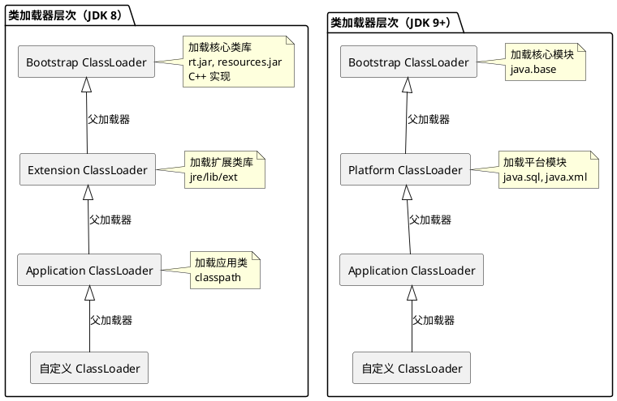
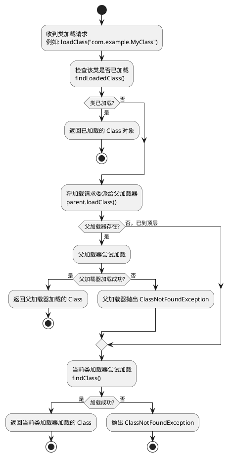
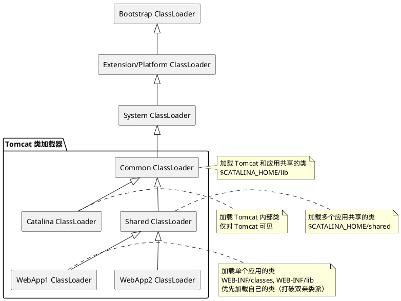
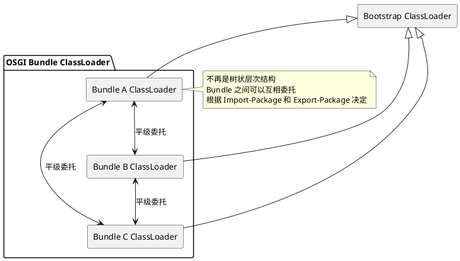

# 类加载器与双亲委派机制

## 问题索引

- Q1：类加载器的分类和层次结构
- Q2：双亲委派机制的工作流程
- Q3：为什么双亲委派能保护核心类
- Q4：打破双亲委派的场景
- Q5：类的唯一性判定

## Q1：类加载器的分类和层次结构

### 背景

Java 虚拟机使用类加载器（ClassLoader）将 `.class` 字节码文件加载到内存并转换为 `Class` 对象。理解类加载器的层次结构和双亲委派机制，是掌握 Java 类加载、模块化、热部署和类隔离的基础。

### 类加载器分类

Java 中的类加载器分为三层（JDK 9+ 调整为四层）：

#### JDK 8 及之前

1. **Bootstrap ClassLoader（启动类加载器）**
   - 由 C++ 实现，是 JVM 的一部分
   - 加载 `$JAVA_HOME/jre/lib` 下的核心类库（如 `rt.jar`、`resources.jar`）
   - 加载 `-Xbootclasspath` 参数指定的路径
   - 无法被 Java 代码直接引用（`getClassLoader()` 返回 `null`）

2. **Extension ClassLoader（扩展类加载器）**
   - Java 实现，类名 `sun.misc.Launcher$ExtClassLoader`
   - 加载 `$JAVA_HOME/jre/lib/ext` 目录下的类库
   - 加载 `java.ext.dirs` 系统属性指定的路径

3. **Application ClassLoader（应用程序类加载器）**
   - Java 实现，类名 `sun.misc.Launcher$AppClassLoader`
   - 加载 `classpath`（`-cp`、`-classpath` 或 `CLASSPATH` 环境变量）指定的类
   - 是程序默认的类加载器，可通过 `ClassLoader.getSystemClassLoader()` 获取

#### JDK 9+ 模块化之后

JDK 9 引入模块化系统（Jigsaw），类加载器层次调整：

1. **Bootstrap ClassLoader**
   - 加载 Java 模块系统的核心模块（如 `java.base`）
   - 仍然由 C++ 实现

2. **Platform ClassLoader（平台类加载器）**
   - 替代 Extension ClassLoader
   - 类名 `jdk.internal.loader.ClassLoaders$PlatformClassLoader`
   - 加载平台模块（如 `java.sql`、`java.xml`）

3. **Application ClassLoader**
   - 加载应用模块和 classpath 中的类
   - 类名 `jdk.internal.loader.ClassLoaders$AppClassLoader`

4. **自定义 ClassLoader**
   - 开发者继承 `ClassLoader` 实现，用于特殊加载需求（如热部署、类隔离）

### 类加载器层次结构



### 查看类加载器示例

```java
public class ClassLoaderDemo {
    public static void main(String[] args) {
        // String 类由 Bootstrap ClassLoader 加载
        System.out.println("String 类加载器: " + String.class.getClassLoader());
        // 输出: null（Bootstrap ClassLoader 无法被 Java 代码直接引用）
        
        // 当前类由 Application ClassLoader 加载
        System.out.println("当前类加载器: " + ClassLoaderDemo.class.getClassLoader());
        // 输出: sun.misc.Launcher$AppClassLoader@xxx（JDK 8）
        
        // 查看父加载器链条
        ClassLoader classLoader = ClassLoaderDemo.class.getClassLoader();
        while (classLoader != null) {
            System.out.println("类加载器: " + classLoader);
            classLoader = classLoader.getParent();
        }
        // 输出链条：AppClassLoader -> ExtClassLoader/PlatformClassLoader -> null
    }
}
```

## Q2：双亲委派机制的工作流程

### 核心原理

**双亲委派模型（Parent Delegation Model）**：当一个类加载器收到类加载请求时，它首先不会自己尝试加载，而是将请求委派给父类加载器；父类加载器再委派给它的父类加载器，直到顶层的 Bootstrap ClassLoader。只有当父类加载器无法完成加载（在其搜索路径中找不到该类）时，子类加载器才会尝试自己加载。

### 双亲委派流程



### 源码实现

`ClassLoader.loadClass()` 方法实现了双亲委派逻辑：

```java
protected Class<?> loadClass(String name, boolean resolve) throws ClassNotFoundException {
    synchronized (getClassLoadingLock(name)) {
        // 1. 检查类是否已经加载
        Class<?> c = findLoadedClass(name);
        if (c == null) {
            try {
                // 2. 委派给父加载器
                if (parent != null) {
                    // 父加载器存在，委派给父加载器
                    c = parent.loadClass(name, false);
                } else {
                    // 父加载器为 null，说明到达 Bootstrap ClassLoader
                    c = findBootstrapClassOrNull(name);
                }
            } catch (ClassNotFoundException e) {
                // 父加载器无法加载，继续执行当前加载器的加载逻辑
            }

            if (c == null) {
                // 3. 父加载器无法加载，当前加载器尝试加载
                c = findClass(name); // 子类需要重写 findClass() 实现加载逻辑
            }
        }
        
        if (resolve) {
            resolveClass(c); // 链接阶段
        }
        return c;
    }
}
```

### 加载流程示例

假设加载 `com.example.MyClass`：

1. **Application ClassLoader** 收到请求
   - 检查是否已加载：否
   - 委派给父加载器 Extension/Platform ClassLoader

2. **Extension/Platform ClassLoader** 收到请求
   - 检查是否已加载：否
   - 委派给父加载器 Bootstrap ClassLoader

3. **Bootstrap ClassLoader** 尝试加载
   - 在 `jre/lib` 或核心模块中查找：找不到
   - 返回失败

4. **Extension/Platform ClassLoader** 尝试自己加载
   - 在 `jre/lib/ext` 或平台模块中查找：找不到
   - 返回失败

5. **Application ClassLoader** 尝试自己加载
   - 在 `classpath` 中查找：找到 `com.example.MyClass`
   - 加载成功，返回 `Class` 对象

## Q3：为什么双亲委派能保护核心类

### 安全保护机制

双亲委派机制通过"优先让父加载器加载"，确保 Java 核心类库始终由 Bootstrap ClassLoader 加载，防止用户自定义的同名类替换核心类。

#### 场景示例：恶意替换 String 类

假设没有双亲委派机制，用户可以自定义一个 `java.lang.String` 类：

```java
package java.lang;

// 恶意的 String 类
public class String {
    public String() {
        System.out.println("恶意代码执行！");
        // 可能执行危险操作：删除文件、窃取数据等
    }
}
```

**没有双亲委派**：Application ClassLoader 直接加载用户的 `java.lang.String`，覆盖 JDK 的 `String` 类，导致系统崩溃或安全风险。

**有双亲委派**：
1. Application ClassLoader 收到加载 `java.lang.String` 的请求
2. 委派给 Extension ClassLoader，再委派给 Bootstrap ClassLoader
3. Bootstrap ClassLoader 在核心类库中找到 `java.lang.String`，加载成功
4. 用户自定义的 `java.lang.String` 永远不会被加载

实际测试：

```java
// 即使在 classpath 中放置了自定义的 java.lang.String，JVM 仍然加载核心类库的 String
String s = new String("test");
System.out.println(s.getClass().getClassLoader()); // 输出: null（Bootstrap ClassLoader）
```

**PackageAccess 保护**：即使绕过双亲委派，JVM 还有 `PackageAccess` 机制，禁止用户自定义 `java.` 开头的包：

```java
// 自定义 java.lang.String 会抛出 SecurityException
// java.lang.SecurityException: Prohibited package name: java.lang
```

### 保护范围

双亲委派保护的不仅是 `java.*` 包，还包括：
- `javax.*`：Java 扩展包
- `sun.*`：Sun 内部实现包
- JDK 9+ 的核心模块（`java.base`、`java.sql` 等）

## Q4：打破双亲委派的场景

### 为什么需要打破双亲委派

双亲委派模型并非完美，在某些场景下需要突破其限制：

1. **SPI（Service Provider Interface）**：核心类需要调用用户实现的服务
2. **模块化隔离**：不同模块需要加载同名但不同版本的类（如 Tomcat）
3. **热部署**：运行时替换类（如 OSGI、JRebel）

### 场景 1：SPI 服务加载

#### 问题背景

JDBC 的 `DriverManager` 是 JDK 核心类（由 Bootstrap ClassLoader 加载），但数据库驱动（如 `com.mysql.cj.jdbc.Driver`）是第三方实现（由 Application ClassLoader 加载）。

根据双亲委派，父加载器加载的类无法访问子加载器加载的类：
- Bootstrap ClassLoader 加载的 `DriverManager` 无法直接加载 Application ClassLoader 加载的 `Driver` 实现

#### 解决方案：线程上下文类加载器

Java 引入 **Thread Context ClassLoader**，允许父加载器委托子加载器加载类。

```java
public class DriverManager {
    static {
        // 加载所有 JDBC 驱动
        loadInitialDrivers();
    }
    
    private static void loadInitialDrivers() {
        // 使用 ServiceLoader 加载驱动
        // ServiceLoader 内部使用线程上下文类加载器（默认是 Application ClassLoader）
        ServiceLoader<Driver> loadedDrivers = ServiceLoader.load(Driver.class);
        Iterator<Driver> driversIterator = loadedDrivers.iterator();
        
        while (driversIterator.hasNext()) {
            driversIterator.next(); // 加载驱动类
        }
    }
}

// ServiceLoader 内部实现
public final class ServiceLoader<S> implements Iterable<S> {
    private ClassLoader loader;
    
    public static <S> ServiceLoader<S> load(Class<S> service) {
        // 获取线程上下文类加载器（Application ClassLoader）
        ClassLoader cl = Thread.currentThread().getContextClassLoader();
        return ServiceLoader.load(service, cl);
    }
}
```

**流程**：
1. Bootstrap ClassLoader 加载 `DriverManager`
2. `DriverManager` 使用 `ServiceLoader.load(Driver.class)`
3. `ServiceLoader` 获取线程上下文类加载器（Application ClassLoader）
4. Application ClassLoader 加载 `com.mysql.cj.jdbc.Driver`

**其他 SPI 案例**：
- JNDI（`javax.naming.spi.NamingManager`）
- JAXP（`javax.xml.parsers.DocumentBuilderFactory`）
- JBI（`javax.jbi`）

### 场景 2：Tomcat 类加载隔离

#### 问题背景

Tomcat 需要支持：
1. **多应用隔离**：不同 Web 应用使用不同版本的同一个类库（如 Spring 3.x 和 Spring 5.x）
2. **共享类库**：多个应用共享 Tomcat 的核心类库（如 Servlet API）
3. **热部署**：不重启 Tomcat 更新某个应用

双亲委派无法满足这些需求。

#### 解决方案：自定义类加载器

Tomcat 设计了多层类加载器：



**WebApp ClassLoader 的加载顺序**（打破双亲委派）：

```java
public Class<?> loadClass(String name, boolean resolve) throws ClassNotFoundException {
    // 1. 检查是否已加载
    Class<?> clazz = findLoadedClass(name);
    if (clazz != null) return clazz;
    
    // 2. 检查是否是 JVM 核心类（java.*, javax.*）
    try {
        clazz = system.loadClass(name); // 委派给系统类加载器
        if (clazz != null) return clazz;
    } catch (ClassNotFoundException e) {}
    
    // 3. 优先在当前 WebApp 的 WEB-INF/classes 和 WEB-INF/lib 中查找
    // 打破双亲委派：不先委派给父加载器
    try {
        clazz = findClass(name);
        if (clazz != null) return clazz;
    } catch (ClassNotFoundException e) {}
    
    // 4. 委派给父加载器（Shared、Common）
    try {
        clazz = parent.loadClass(name);
        if (clazz != null) return clazz;
    } catch (ClassNotFoundException e) {}
    
    throw new ClassNotFoundException(name);
}
```

**优势**：
- 不同应用可以加载不同版本的 Spring
- 应用优先使用自己的类库版本
- 卸载应用时，直接丢弃 WebApp ClassLoader，实现热部署

### 场景 3：OSGI 动态模块化

#### 问题背景

OSGI（Open Service Gateway Initiative）是 Java 的动态模块化系统，支持：
- 模块的动态安装、启动、停止、卸载
- 模块之间的依赖管理
- 同一个类的不同版本共存

#### 解决方案：网状类加载器

OSGI 完全摒弃双亲委派，使用 **平级委托（Peer Delegation）**：



**加载流程**：
1. 委派给父加载器（加载核心类）
2. 检查是否在 Bundle 的 Import-Package 中声明
   - 是：委托给导出该包的 Bundle
   - 否：在当前 Bundle 中查找
3. 查找失败，抛出 `ClassNotFoundException`

## Q5：类的唯一性判定

### 核心原理

在 JVM 中，**一个类的唯一性由类的全限定名和加载它的类加载器共同决定**。

#### 判定规则

两个类相等的充要条件：
1. 类的全限定名（包名 + 类名）相同
2. 加载这两个类的类加载器实例相同

即使两个类来源于同一个 `.class` 文件，如果由不同的类加载器加载，JVM 也会认为它们是不同的类。

### 实验验证

```java
public class ClassIdentityTest {
    public static void main(String[] args) throws Exception {
        // 自定义类加载器 1
        MyClassLoader loader1 = new MyClassLoader("D:/classes/");
        Class<?> class1 = loader1.loadClass("com.example.User");
        Object obj1 = class1.newInstance();
        
        // 自定义类加载器 2（不同实例）
        MyClassLoader loader2 = new MyClassLoader("D:/classes/");
        Class<?> class2 = loader2.loadClass("com.example.User");
        Object obj2 = class2.newInstance();
        
        // 类对象不相等
        System.out.println("class1 == class2: " + (class1 == class2)); // false
        
        // instanceof 判断失败
        System.out.println("obj1 instanceof class2: " + class2.isInstance(obj1)); // false
        
        // 类转换抛出 ClassCastException
        try {
            class2.cast(obj1);
        } catch (ClassCastException e) {
            System.out.println("ClassCastException: " + e.getMessage());
            // 输出: com.example.User cannot be cast to com.example.User
        }
        
        // 不同类加载器
        System.out.println("class1 ClassLoader: " + class1.getClassLoader());
        System.out.println("class2 ClassLoader: " + class2.getClassLoader());
    }
}

// 自定义类加载器
class MyClassLoader extends ClassLoader {
    private String classPath;
    
    public MyClassLoader(String classPath) {
        this.classPath = classPath;
    }
    
    @Override
    protected Class<?> findClass(String name) throws ClassNotFoundException {
        // 读取 .class 文件
        byte[] classData = loadClassData(name);
        if (classData == null) {
            throw new ClassNotFoundException();
        }
        // 将字节码转换为 Class 对象
        return defineClass(name, classData, 0, classData.length);
    }
    
    private byte[] loadClassData(String className) {
        // 从 classPath 读取 .class 文件
        String fileName = classPath + className.replace('.', '/') + ".class";
        try (InputStream is = new FileInputStream(fileName);
             ByteArrayOutputStream baos = new ByteArrayOutputStream()) {
            byte[] buffer = new byte[1024];
            int len;
            while ((len = is.read(buffer)) != -1) {
                baos.write(buffer, 0, len);
            }
            return baos.toByteArray();
        } catch (IOException e) {
            return null;
        }
    }
}
```

### 类隔离的应用场景

#### 1. 中间件类隔离

**场景**：Tomcat 加载的应用 A 使用 Spring 3.x，应用 B 使用 Spring 5.x，两者不能冲突。

**实现**：为每个应用创建独立的 WebApp ClassLoader，加载各自的 Spring 版本。

#### 2. 插件系统

**场景**：IDE（如 IntelliJ IDEA）的插件系统，不同插件可能依赖不同版本的同一个库。

**实现**：为每个插件创建独立的 ClassLoader，实现类隔离。

#### 3. 热部署

**场景**：不重启服务器更新类。

**实现**：
1. 创建新的 ClassLoader 加载更新后的类
2. 丢弃旧的 ClassLoader（类对象随之被 GC 回收）
3. 用新 ClassLoader 加载的类替换旧类

**注意**：静态变量、单例对象会随着旧 ClassLoader 一起被回收，需要重新初始化。

## 面试追问

- **Q：为什么 Bootstrap ClassLoader 用 C++ 实现？**  
  A：Bootstrap ClassLoader 是 JVM 启动的第一个类加载器，负责加载 JVM 运行所需的核心类（如 `Object`、`String`、`ClassLoader` 本身）。如果用 Java 实现，会陷入"鸡生蛋、蛋生鸡"的问题：要加载 ClassLoader 类，需要一个 ClassLoader 实例；要创建 ClassLoader 实例，需要先加载 ClassLoader 类。因此，Bootstrap ClassLoader 必须由 C++ 在 JVM 内部实现。

- **Q：双亲委派机制如何实现？可以绕过吗？**  
  A：双亲委派在 `ClassLoader.loadClass()` 中实现，通过递归调用 `parent.loadClass()` 实现向上委派。可以绕过：自定义 ClassLoader 时，不调用 `super.loadClass()`，而是直接重写 `loadClass()` 方法，自己实现加载逻辑。但不建议轻易打破双亲委派，除非有明确的隔离、SPI 或热部署需求。

- **Q：Tomcat 如何实现热部署？**  
  A：Tomcat 的热部署依赖类加载器隔离。每个 Web 应用有独立的 WebApp ClassLoader。当检测到应用更新时，Tomcat 执行：1) 停止旧应用，丢弃旧的 WebApp ClassLoader；2) 创建新的 WebApp ClassLoader，加载更新后的类；3) 启动新应用。旧 ClassLoader 和加载的类会被 GC 回收（前提是没有内存泄漏）。

- **Q：自定义类加载器需要注意什么？**  
  A：1) 重写 `findClass()` 而非 `loadClass()`，保留双亲委派机制；2) 使用 `defineClass()` 将字节码转换为 `Class` 对象；3) 注意类的命名空间隔离（同名类由不同加载器加载是不同的类）；4) 考虑线程上下文类加载器的设置（如 SPI 场景）；5) 防止类加载器泄漏导致的内存泄漏（持有大量 Class 对象无法回收）。

- **Q：如何排查 ClassNotFoundException 和 NoClassDefFoundError？**  
  A：`ClassNotFoundException`：编译时类存在，运行时 JVM 在类路径中找不到该类。排查：检查 classpath、jar 包是否存在、类名是否正确。`NoClassDefFoundError`：类在编译时存在，加载时找到了，但初始化失败（如静态代码块抛异常、依赖的类找不到）。排查：查看完整堆栈，找到 `Caused by` 的根本原因，通常是静态初始化或依赖缺失。

## 复习清单

- [ ] 能说出 JDK 8 和 JDK 9+ 的类加载器分类和区别
- [ ] 能画出类加载器的层次结构图
- [ ] 能解释双亲委派机制的工作流程和源码实现
- [ ] 能说明双亲委派如何保护核心类不被替换
- [ ] 能举例说明打破双亲委派的三种场景（SPI、Tomcat、OSGI）
- [ ] 能解释线程上下文类加载器的作用
- [ ] 能说明类的唯一性判定规则（全限定名 + 类加载器实例）
- [ ] 能回答自定义类加载器的实现要点
- [ ] 能区分 ClassNotFoundException 和 NoClassDefFoundError
