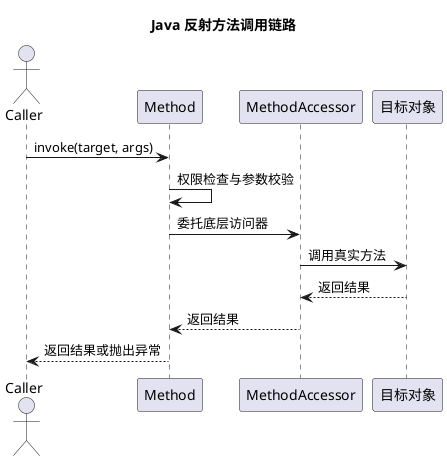

# Java 反射及其原理

## 问题索引

- Q1：说一下反射及其原理

## Q1：说一下反射及其原理

### 背景

反射是 Java 运行期动态能力的核心。很多框架都依赖反射或反射的变体：

- Spring 根据类名、注解、构造方法创建 Bean。
- MyBatis 根据字段、方法、注解完成映射。
- JUnit 根据注解找到测试方法并执行。
- Jackson / Fastjson 根据字段和 getter / setter 做序列化。
- 动态代理、AOP、RPC 框架也会依赖反射或字节码增强。

面试问“反射及其原理”，通常想考察：什么是反射、反射能做什么、反射为什么能在运行期拿到类信息、反射调用为什么慢，以及实际项目里怎么用得更稳。

### 核心结论

反射是指程序在运行期获取类的结构信息，并动态操作对象的能力。

它能在运行期完成：

- 获取类信息：类名、父类、接口、注解、泛型。
- 获取成员信息：字段、方法、构造方法。
- 创建对象：调用无参或有参构造方法。
- 调用方法：通过 `Method.invoke` 执行目标方法。
- 访问字段：通过 `Field.get` / `Field.set` 读写字段。
- 绕过访问检查：通过 `setAccessible(true)` 访问非 public 成员。

反射的基础是 JVM 在类加载后，会在方法区 / 元空间中保存类的元数据，同时在堆中有一个对应的 `Class` 对象。反射 API 本质上是通过 `Class` 对象访问这些元数据，再配合 JVM 的运行期调用机制完成动态操作。

### Class 对象是什么

每个被 JVM 加载的类，都会有一个对应的 `java.lang.Class` 对象。

这个 `Class` 对象可以理解为运行期访问类元数据的入口。

常见获取方式：

```java
public class ClassObjectDemo {
    public static void main(String[] args) throws ClassNotFoundException {
        // 方式一：通过类字面量获取，不会因为这行代码额外创建业务对象
        Class<String> c1 = String.class;

        // 方式二：通过对象实例获取，适合已经有对象的场景
        Class<?> c2 = "abc".getClass();

        // 方式三：通过类全限定名获取，常用于配置化加载
        Class<?> c3 = Class.forName("java.lang.String");

        // 同一个类在同一个类加载器下只有一个 Class 对象
        System.out.println(c1 == c2);
        System.out.println(c2 == c3);
    }
}
```

同一个类在同一个类加载器下，通常只会有一个 `Class` 对象。注意这里要加上“同一个类加载器”这个前提，因为不同类加载器加载同名类，会被 JVM 认为是不同的类。

### 反射能做什么

示例：

```java
import java.lang.reflect.Constructor;
import java.lang.reflect.Field;
import java.lang.reflect.Method;

public class ReflectionDemo {
    public static void main(String[] args) throws Exception {
        // 通过全限定类名加载 Class 对象，适合运行期根据配置决定加载哪个类
        Class<?> userClass = Class.forName("demo.User");

        // 获取无参构造方法，并创建对象
        Constructor<?> constructor = userClass.getDeclaredConstructor();
        Object user = constructor.newInstance();

        // 获取私有字段 name，并允许反射访问
        Field nameField = userClass.getDeclaredField("name");
        nameField.setAccessible(true);
        nameField.set(user, "Tom");

        // 获取 sayHello 方法，并通过反射调用
        Method method = userClass.getDeclaredMethod("sayHello");
        Object result = method.invoke(user);

        System.out.println(result);
    }
}
```

这里做了几件事：

- `Class.forName`：加载类并拿到 `Class` 对象。
- `getDeclaredConstructor`：拿构造方法元数据。
- `newInstance`：创建对象。
- `getDeclaredField`：拿字段元数据。
- `setAccessible(true)`：关闭 Java 语言层访问检查。
- `Method.invoke`：动态调用方法。

### 反射的底层原理


### PlantUML 示意图：反射调用链路



反射大致可以分成四层：

```text
Java 反射 API
  -> Class / Field / Method / Constructor
  -> JVM 中的类元数据
  -> 方法调用、字段访问、对象创建
```

类加载后，JVM 会解析 `.class` 文件，把类的结构信息保存为运行期元数据，例如：

- 类名、访问修饰符。
- 父类、接口。
- 字段表。
- 方法表。
- 构造方法。
- 注解信息。
- 常量池和符号引用。

`Class` 对象是 Java 层访问这些元数据的入口。`Method`、`Field`、`Constructor` 则是对方法、字段、构造方法元数据的封装。

当调用 `method.invoke(obj, args)` 时，JVM 会根据 `Method` 保存的方法元数据，找到目标方法，然后对参数、访问权限、目标对象进行检查，最终执行真实方法。

### Method.invoke 做了什么

`Method.invoke` 不是简单的方法调用，它通常要做这些事：

1. 检查目标对象是否匹配。
2. 检查方法访问权限。
3. 检查参数数量和类型。
4. 处理基本类型装箱、拆箱和可变参数。
5. 通过反射调用入口执行目标方法。
6. 如果目标方法抛异常，包装成 `InvocationTargetException`。

示例：

```java
import java.lang.reflect.InvocationTargetException;
import java.lang.reflect.Method;

public class InvokeExceptionDemo {
    public static void main(String[] args) throws Exception {
        Method method = Service.class.getDeclaredMethod("fail");

        try {
            // invoke 抛出的不是业务异常本身，而是 InvocationTargetException
            method.invoke(new Service());
        } catch (InvocationTargetException e) {
            // getTargetException 才是目标方法真正抛出的异常
            Throwable realException = e.getTargetException();
            System.out.println(realException.getMessage());
        }
    }

    static class Service {
        void fail() {
            throw new IllegalStateException("business error");
        }
    }
}
```

### setAccessible(true) 的作用

`setAccessible(true)` 的作用是关闭 Java 语言层面的访问检查。

例如 private 字段正常不能直接访问，但反射可以通过它访问：

```java
import java.lang.reflect.Field;

public class AccessibleDemo {
    public static void main(String[] args) throws Exception {
        User user = new User();
        Field field = User.class.getDeclaredField("name");

        // 允许反射访问 private 字段
        field.setAccessible(true);
        field.set(user, "Alice");

        System.out.println(field.get(user));
    }

    static class User {
        private String name;
    }
}
```

注意：它不是修改字段本身的 `private` 修饰符，而是让当前反射对象在访问时跳过访问检查。

在 JDK 9+ 模块化之后，强封装会让一些跨模块反射访问受到限制，可能需要 `--add-opens` 等参数。

### 反射为什么慢

反射通常比直接调用慢，原因包括：

- 需要运行期查找方法、字段、构造方法。
- 需要访问权限检查。
- 需要参数封装成 `Object[]`。
- 涉及装箱、拆箱、类型转换。
- `Method.invoke` 这一层不如直接调用容易被 JIT 内联优化。
- 异常会被包装，调用链更复杂。

不过反射并不是不能用。框架通常会做缓存或使用更高性能的替代方案。

常见优化：

- 缓存 `Class`、`Method`、`Field`、`Constructor`。
- 初始化阶段反射，运行期尽量直接调用。
- 使用 `MethodHandle`。
- 使用字节码生成，例如 CGLIB、ByteBuddy、ASM。
- Spring 中会结合反射、缓存、方法句柄、字节码增强等方式降低成本。

### 反射和动态代理的关系

JDK 动态代理本身会用到反射思想，但不等于简单反射调用。

JDK 动态代理会在运行期生成代理类，代理类实现目标接口。方法调用进入代理对象后，会转发到 `InvocationHandler.invoke`。

示例：

```java
import java.lang.reflect.InvocationHandler;
import java.lang.reflect.Method;
import java.lang.reflect.Proxy;

public class ProxyDemo {
    public static void main(String[] args) {
        UserService target = new UserServiceImpl();

        UserService proxy = (UserService) Proxy.newProxyInstance(
                UserService.class.getClassLoader(),
                new Class<?>[]{UserService.class},
                new LogHandler(target)
        );

        proxy.createUser("Tom");
    }

    interface UserService {
        void createUser(String name);
    }

    static class UserServiceImpl implements UserService {
        @Override
        public void createUser(String name) {
            System.out.println("create user: " + name);
        }
    }

    static class LogHandler implements InvocationHandler {
        private final Object target;

        LogHandler(Object target) {
            this.target = target;
        }

        @Override
        public Object invoke(Object proxy, Method method, Object[] args) throws Throwable {
            // 代理逻辑：方法执行前记录日志
            System.out.println("before method: " + method.getName());

            // 通过反射调用真实目标对象的方法
            return method.invoke(target, args);
        }
    }
}
```

Spring AOP 如果基于 JDK 动态代理，就会用到这种模式；如果目标类没有接口，常见会使用 CGLIB 创建子类代理。

### 业务场景

反射适合这些场景：

- 框架初始化阶段扫描注解。
- 根据配置加载类。
- 通用对象映射，例如 DTO 和 Entity 转换。
- 序列化和反序列化。
- ORM 字段映射。
- 测试框架执行指定方法。
- RPC 框架根据接口和方法名动态调用。

业务代码中不建议滥用反射。反射会降低可读性、类型安全和性能可控性。

### 踩坑点

- 反射调用异常会被包装成 `InvocationTargetException`。
- `getMethod` 只能拿 public 方法，`getDeclaredMethod` 可以拿当前类声明的方法，包括 private。
- `getFields` 只能拿 public 字段，`getDeclaredFields` 可以拿当前类声明字段。
- `setAccessible(true)` 在 JDK 9+ 模块化环境可能受限制。
- 反射绕过编译期类型检查，错误更容易变成运行期异常。
- 高频路径不要反复查找 Method / Field，要缓存。

### 面试话术

> 反射是 Java 在运行期获取类结构并动态操作对象的能力。它的入口是 `Class` 对象，同一个类在同一个类加载器下会对应一个 `Class` 对象。类加载后，JVM 会把类名、字段、方法、构造方法、注解等元数据保存起来，反射 API 中的 `Method`、`Field`、`Constructor` 就是对这些元数据的封装。通过反射可以创建对象、访问字段、调用方法，底层会做权限检查、参数检查、类型转换，再找到目标方法执行。反射灵活但有性能和类型安全成本，所以框架一般会缓存反射结果，或者使用 MethodHandle、CGLIB、ByteBuddy 等方式优化。

## 高频追问

- Q：反射为什么能拿到 private 方法？
  A：类加载后 private 方法的元数据也存在 JVM 中，`getDeclaredMethod` 可以拿到当前类声明的方法。`setAccessible(true)` 可以关闭 Java 语言层访问检查，但 JDK 9+ 模块化后可能受模块边界限制。

- Q：`Class.forName` 和 `ClassLoader.loadClass` 有什么区别？
  A：`Class.forName` 默认会触发类初始化，执行静态代码块；`ClassLoader.loadClass` 默认只加载类，不主动初始化。

- Q：反射一定慢吗？
  A：比直接调用通常慢，但不代表不能用。框架会缓存 `Method`、`Field` 等对象，避免重复查找；热点场景可以用 MethodHandle 或字节码生成优化。

- Q：`getMethod` 和 `getDeclaredMethod` 的区别是什么？
  A：`getMethod` 只能获取 public 方法，包括继承来的 public 方法；`getDeclaredMethod` 获取当前类声明的方法，包括 private，但不包含父类方法。

- Q：反射和字节码增强有什么区别？
  A：反射是在运行期通过元数据动态访问对象；字节码增强是生成或修改字节码，让后续调用更接近普通方法调用，性能和扩展性通常更好。

## 复习清单

- [ ] 能解释反射是什么
- [ ] 能说明 `Class` 对象和类元数据的关系
- [ ] 能写出反射创建对象、访问字段、调用方法的基本代码
- [ ] 能解释 `Method.invoke` 的大致流程
- [ ] 能说明 `setAccessible(true)` 的作用和限制
- [ ] 能说出反射为什么慢以及常见优化方式
- [ ] 能结合 Spring、MyBatis、Jackson 说明反射的业务场景

