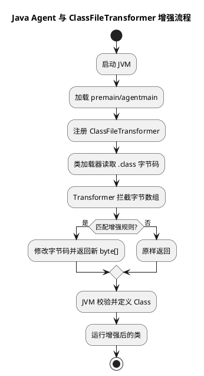

# 字节码增强原理

## 问题索引

- Q1：说一下字节码增强
- Q2：为什么 CGLIB 不能代理 final 类和 final 方法？

## Q1：说一下字节码增强

### 背景

字节码增强是很多 Java 框架的底层能力。它可以在不直接修改源代码的情况下，修改或生成 `.class` 字节码，从而给程序增加额外能力。

常见场景：

- Spring AOP：方法前后增强、事务、日志。
- MyBatis：Mapper 接口代理。
- Hibernate：实体懒加载。
- Mockito：Mock 对象生成。
- SkyWalking / Pinpoint：链路追踪探针。
- Arthas：运行期诊断和热更新相关能力。

一句话概括：字节码增强就是在类加载前、类加载时或运行期，对字节码做修改或生成，让程序拥有原本源码里没有显式写出来的能力。

### 核心结论

字节码增强主要解决两个问题：

1. 生成新类：运行期创建代理类、子类、Mock 类。
2. 修改已有类：给已有方法插入日志、耗时统计、链路追踪、事务控制等逻辑。

常见技术路线：

| 技术 | 特点 | 典型场景 |
|---|---|---|
| JDK 动态代理 | 基于接口生成代理类 | Spring AOP 有接口场景 |
| CGLIB | 基于继承生成子类 | Spring AOP 无接口场景 |
| ASM | 直接操作字节码，性能强但 API 底层 | CGLIB、部分框架底层 |
| Javassist | API 更接近源码字符串 | 老牌字节码增强场景 |
| ByteBuddy | API 友好，适合 Agent 和运行期增强 | Mockito、SkyWalking、Agent |
| Java Agent / Instrumentation | JVM 层面拦截类加载或重转换 | APM 探针、监控、诊断 |

### 字节码增强和反射的区别

反射是在运行期通过元数据动态调用对象。

字节码增强是直接生成或修改类的字节码，让增强逻辑变成类的一部分。

对比：

| 维度 | 反射 | 字节码增强 |
|---|---|---|
| 核心方式 | 运行期读取元数据并调用 | 生成或修改 `.class` |
| 性能 | 通常较慢 | 通常更接近普通方法调用 |
| 灵活性 | 简单易用 | 能力更强 |
| 复杂度 | 低 | 中到高 |
| 典型场景 | 配置化调用、框架扫描 | AOP、代理、APM、Mock |

可以这样理解：反射是“运行时查一下再调用”，字节码增强是“提前把增强逻辑织进类里”。

### 字节码增强的时机

字节码增强按时机可以分为三类。

#### 编译期增强

在编译阶段修改或生成字节码。

常见例子：

- Lombok 在编译期生成 getter、setter、builder 等代码。
- MapStruct 在编译期生成对象转换代码。

优点：

- 运行期成本低。
- 生成结果相对稳定。

缺点：

- 需要参与编译过程。
- 动态性不如运行期增强。

#### 类加载期增强

在类被 JVM 加载时，通过 ClassFileTransformer 修改字节码。

常见例子：

- Java Agent `premain`。
- SkyWalking 探针。
- Pinpoint 探针。
- 自定义监控 Agent。

流程：

```text
JVM 启动
  -> 加载 javaagent
  -> 注册 ClassFileTransformer
  -> 类加载时拦截字节码
  -> 修改字节码
  -> JVM 定义增强后的类
```

#### 运行期增强

程序运行过程中动态生成代理类或增强类。

常见例子：

- Spring AOP 创建代理对象。
- CGLIB 生成目标类子类。
- ByteBuddy 动态创建子类。
- Mockito 生成 Mock 对象。

运行期增强适合框架根据配置、注解、接口动态决定要生成什么类。

### Java Agent 的原理


### PlantUML 示意图：Java Agent 字节码增强时机



Java Agent 基于 `java.lang.instrument.Instrumentation`。

常见入口有两个：

- `premain`：JVM 启动时加载 Agent。
- `agentmain`：JVM 运行后动态 attach 加载 Agent。

示例：

```java
import java.lang.instrument.Instrumentation;

public class MonitorAgent {
    public static void premain(String agentArgs, Instrumentation instrumentation) {
        // 注册字节码转换器，后续类加载时 JVM 会回调 transformer
        instrumentation.addTransformer(new CostTimeTransformer());
    }
}
```

核心流程：

```text
java -javaagent:monitor-agent.jar -jar app.jar
  -> JVM 先加载 Agent
  -> 执行 premain
  -> 注册 Transformer
  -> 应用类加载时进入 Transformer
  -> 返回修改后的 byte[]
  -> JVM 使用增强后的字节码定义类
```

### ClassFileTransformer 做什么

`ClassFileTransformer` 的核心是接收原始 class 字节数组，返回增强后的字节数组。

示例结构：

```java
import java.lang.instrument.ClassFileTransformer;
import java.lang.instrument.IllegalClassFormatException;
import java.security.ProtectionDomain;

public class CostTimeTransformer implements ClassFileTransformer {
    @Override
    public byte[] transform(ClassLoader loader,
                            String className,
                            Class<?> classBeingRedefined,
                            ProtectionDomain protectionDomain,
                            byte[] classfileBuffer) throws IllegalClassFormatException {
        // className 是 JVM 内部格式，例如 com/example/UserService
        // 这里只增强指定包名，避免误修改 JDK 类或第三方基础类
        if (!className.startsWith("com/example/service")) {
            return classfileBuffer;
        }

        // 实际项目中会用 ASM、Javassist 或 ByteBuddy 修改 classfileBuffer
        // 返回 null 表示不修改；返回 byte[] 表示使用增强后的字节码
        return enhance(classfileBuffer);
    }

    private byte[] enhance(byte[] source) {
        // 示例占位：真实增强逻辑会插入方法耗时、链路追踪等字节码
        return source;
    }
}
```

增强工具真正做的是解析 class 字节数组，找到目标方法，然后插入指令。

### 方法耗时统计如何增强

以方法耗时统计为例，源码可能是：

```java
public void createOrder() {
    doCreate();
}
```

增强后的逻辑相当于：

```java
public void createOrder() {
    long start = System.nanoTime();
    try {
        doCreate();
    } finally {
        long cost = System.nanoTime() - start;
        System.out.println("createOrder cost: " + cost);
    }
}
```

注意：增强后不一定真的生成 Java 源码，而是直接在字节码层面插入类似逻辑。

APM 探针也是类似思路：在入口、出口、RPC 调用、数据库调用等关键方法插入 TraceId、Span、耗时、异常采集逻辑。

### CGLIB 的原理

CGLIB 通过生成目标类的子类来增强方法。

流程：

```text
目标类 UserService
  -> CGLIB 生成 UserService$$EnhancerByCGLIB 子类
  -> 子类重写目标方法
  -> 方法调用时先进入拦截器
  -> 拦截器里可以执行前置、后置、异常逻辑
```

限制：

- 不能代理 final 类。
- 不能增强 final 方法。
- 基于继承，构造方法、父子类关系要注意。

Spring AOP 在目标类没有接口时，经常使用 CGLIB。

### JDK 动态代理和字节码增强

JDK 动态代理也会生成代理类，但它只能代理接口。

流程：

```text
接口 UserService
  -> JDK 生成 $Proxy0
  -> $Proxy0 实现 UserService
  -> 方法调用转发到 InvocationHandler.invoke
```

它也是运行期生成类的一种方式，但使用范围比 CGLIB、ByteBuddy 窄，因为必须有接口。

### ByteBuddy 的定位

ByteBuddy 是更现代的字节码增强库，底层基于 ASM，但 API 更友好。

它适合：

- 生成新类。
- 生成代理类。
- 编写 Java Agent。
- 增强已有类。
- 和 Instrumentation 结合做监控探针。

已有详细实操笔记可以看同目录下的 ByteBuddy 入门文档。

### 字节码增强的风险

字节码增强能力很强，但风险也高：

- 增强错误可能导致类验证失败。
- 修改 JDK 类或核心框架类可能引发不可预期问题。
- Agent 可能影响启动速度。
- 插入逻辑过重会影响业务性能。
- 类加载器隔离处理不好会导致类冲突。
- 生成类过多可能导致元空间压力。
- 热替换受 JVM 限制，不是所有结构变化都能重定义。

所以生产级 Agent 一定要控制增强范围、做好开关、采样、异常兜底和性能压测。

### 业务场景

业务项目中常见落地：

- 慢接口监控：给 Controller / Service 方法插入耗时统计。
- 链路追踪：在 RPC、HTTP、MQ、DB 调用点插入 Trace 上下文。
- 统一日志：自动记录方法入参、出参、异常。
- ORM 懒加载：访问属性时再加载关联对象。
- Mock 测试：运行期生成模拟对象。
- SDK 增强：给第三方 SDK 调用增加重试、限流、监控。

### 和 Spring AOP 的关系

Spring AOP 是更上层的 AOP 框架，底层可能使用：

- JDK 动态代理：目标对象有接口。
- CGLIB：目标对象没有接口。

Spring AOP 通常只能增强 Spring 容器中的 Bean。

Java Agent / ByteBuddy 可以增强非 Spring 管理的类，比如：

- JDK HTTP 客户端。
- JDBC Driver。
- Netty。
- Dubbo / Feign / MQ 客户端。
- 第三方 SDK。

这也是 APM 探针通常不用普通 Spring AOP，而是用 Agent 技术的原因。

### 面试话术

> 字节码增强是在不直接修改源码的情况下，通过生成或修改 `.class` 字节码给程序增加能力。它可以发生在编译期、类加载期或运行期。编译期像 Lombok、MapStruct；类加载期常见是 Java Agent，通过 Instrumentation 注册 ClassFileTransformer，在类加载时修改字节码；运行期常见是 JDK 动态代理、CGLIB、ByteBuddy 生成代理类或子类。它常用于 AOP、事务、日志、链路追踪、Mock、ORM 懒加载等场景。和反射相比，字节码增强更复杂，但增强逻辑可以更接近普通方法调用，性能和扩展能力更强。生产中要注意增强范围、类加载器、元空间、性能和回滚开关。

## Q2：为什么 CGLIB 不能代理 final 类和 final 方法？

### 核心结论

CGLIB 的代理原理是：运行期生成目标类的子类，并在子类中重写目标方法，把增强逻辑织入到方法调用前后。

所以它天然受 Java 继承和重写规则限制：

- `final` 类不能被继承，所以 CGLIB 不能为它生成子类代理。
- `final` 方法不能被重写，所以 CGLIB 不能拦截并增强这个方法。
- `private` 方法也不能被子类重写，所以 CGLIB 通常也无法代理 private 方法。
- `static` 方法属于类本身，不走实例的动态分派，也不适合用 CGLIB 子类代理增强。

### CGLIB 的代理过程

假设目标类是：

```java
public class OrderService {
    public void createOrder() {
        System.out.println("create order");
    }
}
```

CGLIB 会生成一个类似这样的子类：

```java
public class OrderServiceEnhancer extends OrderService {
    @Override
    public void createOrder() {
        // 增强逻辑：方法执行前，例如记录日志、开启事务、统计耗时
        System.out.println("before createOrder");

        // 调用父类原始方法
        super.createOrder();

        // 增强逻辑：方法执行后，例如提交事务、记录监控
        System.out.println("after createOrder");
    }
}
```

调用方拿到的是增强后的子类对象：

```text
调用方
  -> OrderServiceEnhancer.createOrder()
  -> 增强逻辑
  -> super.createOrder()
```

这就是为什么 CGLIB 不要求目标类有接口，但要求目标类可以被继承、目标方法可以被重写。

### final 类为什么不行

如果目标类是：

```java
public final class FinalOrderService {
    public void createOrder() {
        System.out.println("create order");
    }
}
```

Java 语义规定 `final` 类不能被继承。

所以 CGLIB 无法生成：

```java
// 编译层面就是非法的：final 类不能被继承
public class FinalOrderServiceEnhancer extends FinalOrderService {
}
```

既然不能生成子类，就无法通过子类覆盖方法来实现代理。

### final 方法为什么不行

如果目标方法是：

```java
public class OrderService {
    public final void createOrder() {
        System.out.println("create order");
    }
}
```

类本身可以被继承，但 `createOrder` 是 `final` 方法，子类不能重写。

所以 CGLIB 即使生成了子类，也不能生成：

```java
public class OrderServiceEnhancer extends OrderService {
    @Override
    public void createOrder() {
        // 这里非法：final 方法不能被重写
    }
}
```

结果就是：这个 `final` 方法不会被代理增强。调用它时还是直接执行父类原方法。

### 和 JDK 动态代理的区别

JDK 动态代理不是继承目标类，而是生成一个实现接口的代理类。

```text
UserService 接口
  -> JDK 生成 $Proxy0 implements UserService
  -> 方法调用进入 InvocationHandler
```

所以 JDK 动态代理的限制是：目标对象需要有接口。

CGLIB 的限制是：目标类和目标方法不能阻止继承和重写。

对比：

| 方式 | 核心机制 | 主要限制 |
|---|---|---|
| JDK 动态代理 | 生成接口实现类 | 必须有接口 |
| CGLIB | 生成目标类子类 | final 类、final 方法、private 方法不行 |

### Spring AOP 中的影响

Spring AOP 默认规则大致是：

- 如果目标 Bean 有接口，优先使用 JDK 动态代理。
- 如果没有接口，使用 CGLIB 生成子类代理。
- 如果强制 `proxyTargetClass = true`，也会使用 CGLIB。

因此在 Spring 事务、缓存、权限等 AOP 场景中，如果方法是 `final`，可能导致增强不生效。

典型风险：

```java
public class OrderService {
    @Transactional
    public final void createOrder() {
        // final 方法无法被 CGLIB 重写，事务增强可能不生效
    }
}
```

这类问题很隐蔽，因为代码能运行，但切面、事务、缓存等增强可能没有按预期执行。

### Java Agent 能不能增强 final 类

Java Agent 不是只能走“生成子类”这条路。

Agent 可以在类加载期直接修改目标类字节码，把增强逻辑插入原方法内部。因此它可以处理一些 CGLIB 处理不了的场景，例如 final 类、final 方法。

但 Agent 也有自己的限制：

- 修改字节码风险更高。
- 需要处理类加载顺序。
- 已加载类的 retransformation 有限制。
- 生产环境要考虑性能、兼容性和回滚。

所以回答时可以说：CGLIB 不行，不代表所有字节码增强技术都不行。CGLIB 的限制来自它“子类代理”的实现方式。

### 面试话术

> CGLIB 不能代理 final 类和 final 方法，是因为它的核心原理是运行期生成目标类的子类，并通过重写目标方法来织入增强逻辑。final 类不能被继承，所以 CGLIB 没法生成代理子类；final 方法不能被重写，所以即使生成了子类，也无法拦截这个方法。private 方法和 static 方法也不适合用 CGLIB 子类代理增强。这个限制来自 CGLIB 的子类代理模型，不代表所有字节码增强都不行，比如 Java Agent 可以在类加载期直接修改原类字节码。

## 高频追问

- Q：字节码增强和反射有什么区别？
  A：反射是在运行期通过元数据动态调用；字节码增强是生成或修改 class，让增强逻辑成为类的一部分，能力更强但复杂度更高。

- Q：JDK 动态代理和 CGLIB 区别是什么？
  A：JDK 动态代理基于接口生成代理类；CGLIB 基于继承生成目标类子类，不能代理 final 类和 final 方法。

- Q：为什么 CGLIB 不能代理 private 方法？
  A：因为 private 方法不能被子类继承和重写，而 CGLIB 依赖子类重写方法来织入增强逻辑。

- Q：Java Agent 的 premain 和 agentmain 有什么区别？
  A：`premain` 在 JVM 启动时加载，适合类加载前增强；`agentmain` 是 JVM 运行后动态 attach，适合诊断和临时增强。

- Q：为什么 APM 探针通常用 Agent，不只用 Spring AOP？
  A：Spring AOP 主要增强 Spring Bean，而 APM 还要增强 JDBC、HTTP、RPC、MQ、第三方 SDK 等非 Spring 管理的类。

- Q：字节码增强有什么风险？
  A：可能导致类验证失败、性能下降、类冲突、元空间压力、核心类误增强，所以要限制范围、做好开关和压测。

## 复习清单

- [ ] 能解释字节码增强是什么
- [ ] 能区分编译期、类加载期、运行期增强
- [ ] 能说清 Java Agent 和 ClassFileTransformer 的流程
- [ ] 能对比 JDK 动态代理、CGLIB、ASM、Javassist、ByteBuddy
- [ ] 能说明 Spring AOP 和 Java Agent 的边界
- [ ] 能结合链路追踪、慢调用监控说明业务场景
- [ ] 能说出字节码增强的生产风险和防护措施
- [ ] 能解释 CGLIB 为什么不能代理 final 类、final 方法和 private 方法

