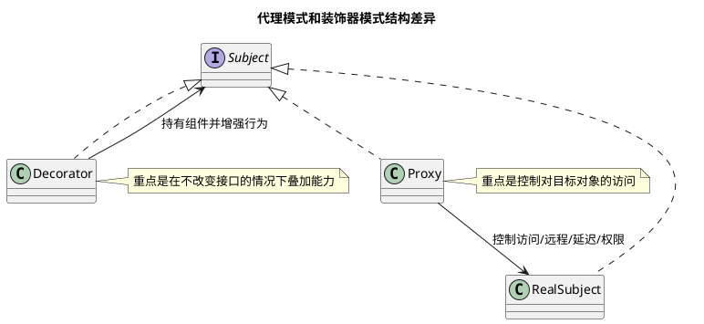

# 设计模式总览

## 问题索引

- Q1：说一下设计模式
- Q2：如何区分代理模式和装饰器模式？

## Q1：说一下设计模式

### 背景

设计模式不是为了炫技，而是把常见代码设计问题沉淀成可复用方案。它解决的核心问题通常是：

- 对象怎么创建更灵活。
- 类和类之间怎么组合更稳定。
- 行为流程怎么扩展更方便。
- 如何降低耦合，提高可维护性。

面试里问“说一下设计模式”，不要一口气背 23 个名字，而要先说设计模式的目的，再按创建型、结构型、行为型展开，并结合 JDK、Spring、业务项目说明落地场景。

### 核心结论

设计模式可以分为三大类：

| 类型 | 关注点 | 代表模式 |
|---|---|---|
| 创建型 | 对象如何创建 | 单例、工厂方法、抽象工厂、建造者、原型 |
| 结构型 | 类和对象如何组合 | 代理、装饰器、适配器、外观、桥接、组合、享元 |
| 行为型 | 对象之间如何协作 | 策略、模板方法、观察者、责任链、命令、状态、迭代器 |

设计模式背后的核心思想是：封装变化点，让稳定部分依赖抽象，而不是依赖具体实现。

### 设计原则

常见设计原则：

- 单一职责原则：一个类尽量只负责一类职责。
- 开闭原则：对扩展开放，对修改关闭。
- 里氏替换原则：子类应该能替换父类使用。
- 接口隔离原则：接口要小而专，不要让实现类依赖不需要的方法。
- 依赖倒置原则：高层模块依赖抽象，不依赖具体实现。
- 迪米特法则：对象之间尽量少知道彼此内部细节。
- 合成复用原则：优先使用组合，而不是继承。

这些原则不是机械规则，而是判断设计是否容易扩展、是否容易维护的方向。

### 创建型模式

创建型模式关注“对象怎么创建”。

#### 单例模式

单例模式保证一个类在 JVM 中只有一个实例，并提供全局访问点。

常见场景：

- Spring Bean 默认单例。
- 配置管理器。
- 线程池管理器。
- 本地缓存管理器。

示例：

```java
public enum SingletonConfig {
    INSTANCE;

    // 枚举单例天然防止反射和反序列化破坏单例
    public String getConfig(String key) {
        return "value-of-" + key;
    }
}
```

注意：业务中不要滥用单例保存可变状态，否则容易出现并发问题和测试困难。

#### 工厂方法模式

工厂方法把对象创建逻辑封装到工厂中，调用方只依赖抽象，不关心具体实现类。

常见场景：

- 根据支付渠道创建不同支付处理器。
- 根据文件类型创建不同解析器。
- Spring 的 `FactoryBean`。

示例：

```java
interface PayHandler {
    void pay();
}

class AliPayHandler implements PayHandler {
    public void pay() {
        System.out.println("ali pay");
    }
}

class WechatPayHandler implements PayHandler {
    public void pay() {
        System.out.println("wechat pay");
    }
}

class PayHandlerFactory {
    public PayHandler create(String channel) {
        // 工厂封装对象创建逻辑，调用方不直接 new 具体实现类
        if ("ALI".equals(channel)) {
            return new AliPayHandler();
        }
        if ("WECHAT".equals(channel)) {
            return new WechatPayHandler();
        }
        throw new IllegalArgumentException("unsupported channel: " + channel);
    }
}
```

#### 建造者模式

建造者模式适合创建参数多、构造过程复杂的对象。

常见场景：

- `StringBuilder`。
- Lombok `@Builder`。
- HTTP 请求对象。
- 复杂查询条件对象。

优点是让对象构建过程更清晰，避免构造方法参数过长。

### 结构型模式

结构型模式关注“类和对象怎么组合”。

#### 代理模式


### PlantUML 示意图：代理模式与装饰器模式关系



代理模式在不直接修改目标对象的情况下，为目标对象增加额外行为。

常见场景：

- Spring AOP。
- JDK 动态代理。
- CGLIB 代理。
- RPC 客户端代理。
- MyBatis Mapper 接口代理。

典型增强：

- 日志。
- 权限。
- 事务。
- 缓存。
- 限流。

代理模式的核心是：调用方以为自己调用目标对象，实际先进入代理对象。

#### 装饰器模式

装饰器模式在不改变原对象结构的情况下，动态叠加功能。

常见场景：

- Java IO：`BufferedInputStream` 包装 `FileInputStream`。
- 对接口响应做加密、压缩、脱敏。
- 对原始处理器叠加日志、监控、校验。

代理和装饰器都像“包一层”，区别是：

- 代理更强调控制访问。
- 装饰器更强调增强能力，并且可以多层组合。

#### 适配器模式

适配器模式用于把不兼容的接口转换成系统需要的接口。

常见场景：

- 对接第三方接口。
- 老系统接口兼容。
- 统一多个支付渠道、物流渠道、短信渠道。

示例场景：第三方返回字段是 `mobileNo`，系统内部统一叫 `phone`，可以用适配器做转换，避免业务主流程充满兼容代码。

#### 外观模式

外观模式为复杂子系统提供一个统一入口。

常见场景：

- Controller 调用一个 Facade，而不是直接编排多个领域服务。
- 对外提供统一 SDK。
- 聚合订单、库存、优惠、支付多个服务。

外观模式的价值是降低调用方复杂度，让复杂流程收敛到统一门面。

### 行为型模式

行为型模式关注“对象之间怎么协作”。

#### 策略模式

策略模式把一组可替换算法封装起来，让调用方根据场景选择不同策略。

常见场景：

- 支付渠道策略。
- 优惠计算策略。
- 运费计算策略。
- 文件解析策略。
- 订单状态处理策略。

示例：

```java
interface DiscountStrategy {
    int discount(int originAmount);
}

class VipDiscountStrategy implements DiscountStrategy {
    public int discount(int originAmount) {
        // VIP 用户打 8 折
        return (int) (originAmount * 0.8);
    }
}

class NewUserDiscountStrategy implements DiscountStrategy {
    public int discount(int originAmount) {
        // 新用户固定减 100，最低不能小于 0
        return Math.max(originAmount - 100, 0);
    }
}
```

策略模式适合替代大量 `if else`，但前提是这些分支确实代表可独立扩展的业务策略。

#### 模板方法模式

模板方法模式把固定流程放在父类，把可变步骤交给子类实现。

常见场景：

- Spring `JdbcTemplate`。
- 抽象订单处理流程。
- 文件导入流程：校验、解析、入库、通知。

核心是固定流程骨架，开放部分步骤扩展。

#### 观察者模式

观察者模式用于一对多通知。

常见场景：

- Spring 事件机制。
- 订单创建后通知库存、积分、优惠券。
- MQ 发布订阅。
- 领域事件。

观察者模式可以解耦主流程和后置动作，但要注意一致性和失败补偿。

#### 责任链模式

责任链模式把多个处理节点串成链，请求沿着链传递。

常见场景：

- Servlet Filter。
- Spring Security Filter Chain。
- 网关过滤器。
- 参数校验链。
- 风控规则链。

责任链适合流程可插拔、节点可编排的场景。

### Spring 中的常见设计模式

Spring 里有很多设计模式：

| 模式 | Spring 中的体现 |
|---|---|
| 工厂模式 | `BeanFactory`、`FactoryBean` |
| 单例模式 | 默认单例 Bean |
| 代理模式 | AOP、事务代理 |
| 模板方法 | `JdbcTemplate`、`RestTemplate` 部分设计 |
| 观察者模式 | `ApplicationEvent`、`ApplicationListener` |
| 适配器模式 | Spring MVC `HandlerAdapter` |
| 责任链模式 | Filter、Interceptor、Spring Security |
| 策略模式 | 不同 `HandlerMapping`、不同消息转换器 |

讲设计模式时，能结合 Spring 源码会比只背模式名更有说服力。

### 业务项目怎么落地

业务系统里最常用的是这几个：

- 策略模式：解决多渠道、多类型、多规则分支。
- 工厂模式：统一创建不同业务处理器。
- 责任链模式：处理校验、风控、过滤、审批流程。
- 模板方法：沉淀固定流程，开放可变步骤。
- 观察者模式：主流程完成后触发异步后置动作。
- 代理模式：统一做日志、权限、事务、监控。
- 适配器模式：对接第三方系统，隔离外部接口差异。

举例：订单支付可以这样组合：

```text
支付入口
  -> 工厂模式选择支付处理器
  -> 策略模式执行不同渠道支付规则
  -> 责任链模式执行参数校验、风控、限额校验
  -> 观察者模式发布支付成功事件
  -> 代理模式统一记录日志、事务、监控
```

### 踩坑点

- 不要为了用模式而用模式，简单逻辑直接写清楚更好。
- 策略模式适合稳定抽象加多个实现，不适合频繁变动且没有抽象边界的逻辑。
- 责任链要避免链路过长，否则排查困难。
- 观察者模式要考虑失败重试、幂等和事务边界。
- 单例对象不要随意保存请求级可变状态。
- 过度抽象会让代码更难读。

### 面试话术

> 设计模式是对常见设计问题的复用方案，本质是封装变化、降低耦合、提高扩展性。一般分为创建型、结构型、行为型。创建型关注对象怎么创建，比如单例、工厂、建造者；结构型关注对象怎么组合，比如代理、装饰器、适配器、外观；行为型关注对象怎么协作，比如策略、模板方法、观察者、责任链。项目里我更常用策略模式处理多规则分支，工厂模式创建不同处理器，责任链做校验和过滤，观察者做事件通知，代理做事务、日志、监控。使用设计模式时不能生搬硬套，要先找到变化点，再用模式把变化点隔离出来。

## Q2：如何区分代理模式和装饰器模式？

### 核心结论

代理模式和装饰器模式长得很像，都是“外面包一层对象”，并且通常都实现同一个接口。

真正区别在设计意图：

- 代理模式：重点是控制访问。调用方不一定直接接触真实对象，代理负责权限、事务、远程调用、延迟加载、缓存、监控等控制逻辑。
- 装饰器模式：重点是增强能力。它不改变原对象接口，通过一层或多层包装动态叠加功能。

一句话：

```text
代理：我替你管访问。
装饰器：我给你加能力。
```

### 结构为什么像

两者通常都有共同接口：

```text
Client
  -> Interface
      -> RealSubject / ConcreteComponent
      -> Proxy / Decorator
```

调用方看到的都是接口，具体对象外面包了一层，所以代码结构上容易混淆。

但模式不是只看类图，更要看它解决什么问题。

### 代理模式的核心

代理模式更关注“能不能访问、什么时候访问、怎么访问真实对象”。

常见场景：

- Spring AOP 事务代理。
- 权限代理。
- RPC 远程代理。
- MyBatis Mapper 接口代理。
- 延迟加载代理。
- 缓存代理。

示例：

```java
interface OrderService {
    void createOrder();
}

class RealOrderService implements OrderService {
    @Override
    public void createOrder() {
        System.out.println("create order");
    }
}

class TransactionProxy implements OrderService {
    private final OrderService target;

    TransactionProxy(OrderService target) {
        this.target = target;
    }

    @Override
    public void createOrder() {
        // 代理重点是控制访问过程：开启事务
        System.out.println("begin transaction");
        try {
            target.createOrder();
            // 代理控制真实对象调用后的提交逻辑
            System.out.println("commit transaction");
        } catch (RuntimeException e) {
            // 代理控制异常场景下的回滚逻辑
            System.out.println("rollback transaction");
            throw e;
        }
    }
}
```

这里代理对象的重点不是给订单服务“叠功能套餐”，而是控制真实方法调用前后的事务边界。

### 装饰器模式的核心

装饰器模式更关注“在原有能力基础上继续叠加能力”，并且可以多层组合。

Java IO 是最经典例子：

```java
InputStream inputStream =
        new BufferedInputStream(
                new FileInputStream("order.txt"));
```

这里：

- `FileInputStream` 提供文件读取能力。
- `BufferedInputStream` 在外层增加缓冲能力。
- 如果再包一层别的装饰器，还可以继续叠加能力。

简化示例：

```java
interface DataReader {
    String read();
}

class FileDataReader implements DataReader {
    @Override
    public String read() {
        return "data";
    }
}

class EncryptReaderDecorator implements DataReader {
    private final DataReader delegate;

    EncryptReaderDecorator(DataReader delegate) {
        this.delegate = delegate;
    }

    @Override
    public String read() {
        // 装饰器重点是基于原能力增加额外能力
        String data = delegate.read();
        return "encrypted(" + data + ")";
    }
}
```

这里重点是增强读取结果，可以继续增加压缩、缓存、日志等多层装饰。

### 判断标准

可以用这几个问题判断：

| 判断点 | 代理模式 | 装饰器模式 |
|---|---|---|
| 主要目的 | 控制访问 | 增强功能 |
| 是否强调真实对象可见性 | 通常隐藏真实对象 | 通常显式包装原对象 |
| 是否常做权限、事务、远程调用 | 是 | 不是重点 |
| 是否常做多层能力叠加 | 不是重点 | 是 |
| 典型例子 | Spring AOP、RPC 代理 | Java IO、BufferedInputStream |

### 业务场景区分

如果你做的是：

- 权限校验后再调用真实服务：代理模式。
- 事务开启、提交、回滚：代理模式。
- 本地接口调用远程服务：代理模式。
- Mapper 接口背后执行 SQL：代理模式。

如果你做的是：

- 给原始数据读取增加缓冲：装饰器模式。
- 给响应内容增加压缩：装饰器模式。
- 给文本处理叠加脱敏、加密、格式化：装饰器模式。
- 多个能力可以自由组合叠加：装饰器模式。

### 容易混淆的点

日志增强既可能是代理，也可能是装饰器，要看语境。

如果日志是 AOP 统一拦截方法调用，控制调用过程，通常说代理。

如果日志是对某个处理器能力做一层包装，并且可以和其他包装器自由组合，也可以说装饰器。

所以不要只看“有没有增强”，要看设计意图和对象关系。

### 面试话术

> 代理模式和装饰器模式结构上很像，都是通过一个包装对象持有真实对象，并实现相同接口。区别主要看意图。代理模式强调控制访问，比如事务、权限、远程调用、延迟加载，调用方通常通过代理间接访问真实对象；装饰器模式强调增强能力，在不改变接口的情况下给对象动态叠加功能，比如 Java IO 里的 BufferedInputStream 包装 FileInputStream。简单说，代理是替你管访问，装饰器是给你加能力。

## 高频追问

- Q：策略模式和工厂模式有什么区别？
  A：工厂模式关注对象创建，策略模式关注行为选择。实际项目中经常一起用，先用工厂找到策略，再执行策略逻辑。

- Q：代理模式和装饰器模式有什么区别？
  A：代理模式更强调控制访问，例如事务、权限、远程调用；装饰器更强调动态增强能力，例如缓冲、压缩、加密，并且可以多层叠加。

- Q：模板方法和策略模式有什么区别？
  A：模板方法通过继承固定流程骨架，子类实现可变步骤；策略模式通过组合替换不同算法或规则。

- Q：责任链有什么风险？
  A：链路过长时排查困难，节点顺序变化可能影响结果，每个节点都要考虑是否继续传递、异常处理和日志追踪。

- Q：设计模式是否越多越好？
  A：不是。设计模式服务于复杂度治理。如果逻辑很简单，过度套模式会增加理解成本。

## 复习清单

- [ ] 能说清设计模式的目的不是炫技，而是封装变化和降低耦合
- [ ] 能按创建型、结构型、行为型分类说明常见模式
- [ ] 能结合 Spring 说出常见设计模式落地
- [ ] 能解释策略、工厂、代理、模板、观察者、责任链的区别
- [ ] 能区分代理模式和装饰器模式的设计意图与典型场景
- [ ] 能结合订单、支付、第三方对接说明业务场景
- [ ] 能说明设计模式滥用的风险

