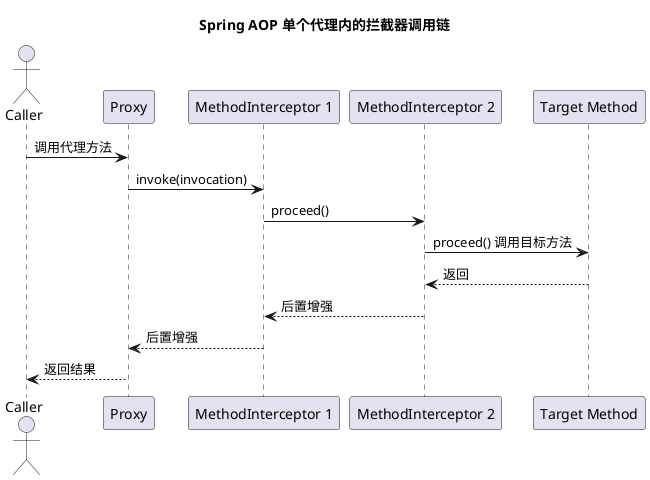

# Spring AOP 代理链

## 问题索引

- Q1：Spring AOP 是多层代理还是一层代理处理所有增强？
- Q2：AOP 自调用绕过代理时，事务在什么情况下会出现问题？

## Q1：Spring AOP 是多层代理还是一层代理处理所有增强？

### 背景

一个 Bean 可能同时命中多个增强，例如事务、日志、权限、缓存、监控。容易产生一个误解：是不是每个增强都生成一层代理，最后形成代理套代理。

Spring AOP 的主流模型不是“每个增强一层代理”，而是“一个代理对象内部维护一条拦截器链”。方法调用进入代理对象后，按顺序执行匹配到的增强。

### 核心结论

通常情况下：

```text
目标对象 Target
  -> 创建一个代理对象 Proxy
  -> Proxy 内部持有多个 Advisor / MethodInterceptor
  -> 方法调用时通过拦截器链依次执行所有增强
```

也就是说，Spring AOP 一般是：

```text
一层代理 + 一条增强链
```

不是：

```text
日志代理 -> 事务代理 -> 权限代理 -> 目标对象
```

当然，某些特殊场景下确实可能出现多层代理，例如多个框架各自创建代理、手动套代理、重复自动代理配置。但 Spring 自身正常的自动代理流程会尽量把增强合并到同一个代理对象里。

### 单层代理的调用模型


### PlantUML 示意图：Spring AOP 单代理多拦截器链



假设一个方法同时命中三个增强：

- 日志增强。
- 权限增强。
- 事务增强。

逻辑结构更接近：

```text
client
  -> proxy.method()
      -> LogInterceptor
          -> SecurityInterceptor
              -> TransactionInterceptor
                  -> target.method()
              <- TransactionInterceptor
          <- SecurityInterceptor
      <- LogInterceptor
```

注意：这里缩进看起来像一层套一层，但它们是同一个代理对象内部的调用链，不是多个代理对象外层套内层。

### 关键对象

| 对象 | 作用 |
| --- | --- |
| `Target` | 原始业务对象 |
| `Proxy` | Spring 生成的代理对象，JDK 动态代理或 CGLIB |
| `Advisor` | 切点和增强的组合，表示“哪些方法应用什么增强” |
| `Advice` | 增强逻辑，例如 before、after、around |
| `MethodInterceptor` | Spring AOP 最终常用的拦截器形式 |
| `ReflectiveMethodInvocation` | 负责按顺序推进拦截器链 |
| `ProxyFactory` / `AdvisedSupport` | 保存目标对象、代理配置、Advisor 列表 |
| `AbstractAutoProxyCreator` | Bean 初始化后判断是否需要创建 AOP 代理 |

### 代理创建过程

Spring AOP 创建代理的大致流程：

```text
Bean 初始化完成
  -> AbstractAutoProxyCreator#postProcessAfterInitialization
  -> 找到当前 Bean 匹配的 Advisor
  -> 如果没有匹配 Advisor，返回原始 Bean
  -> 如果有匹配 Advisor，创建一个代理对象
  -> 把匹配到的 Advisor 放入代理配置
  -> 最终放入单例池的是代理对象
```

关键点：

1. `AbstractAutoProxyCreator` 会收集当前 Bean 能匹配到的所有 `Advisor`。
2. 匹配到多个增强时，不是每个增强创建一个代理。
3. 代理对象内部保存增强列表，调用方法时动态构建或获取拦截器链。
4. 拦截器链按顺序执行，最终调用目标方法。

### 方法调用过程

方法进入代理对象后，大致流程：

```text
proxy.invoke(method, args)
  -> 根据 method 找到匹配的拦截器列表
  -> 创建 MethodInvocation
  -> 调用 invocation.proceed()
  -> 每个 MethodInterceptor 执行自己的逻辑
  -> 最后反射调用 target.method(args)
```

伪代码：

```java
class ReflectiveMethodInvocation {
    private final Object target;
    private final Method method;
    private final Object[] args;
    private final List<MethodInterceptor> interceptors;
    private int currentIndex = -1;

    public Object proceed() throws Throwable {
        // 所有拦截器都执行完后，才真正调用目标方法。
        // 这一步就是增强链的终点。
        if (currentIndex == interceptors.size() - 1) {
            return method.invoke(target, args);
        }

        // 每次 proceed 推进一个拦截器。
        // around、transaction、cache 等增强都可以在这里包住后续调用。
        MethodInterceptor interceptor = interceptors.get(++currentIndex);
        return interceptor.invoke(this);
    }
}
```

一个事务拦截器可以这样理解：

```java
class TransactionInterceptor implements MethodInterceptor {
    @Override
    public Object invoke(MethodInvocation invocation) throws Throwable {
        // 进入目标方法前开启事务。
        beginTransaction();
        try {
            Object result = invocation.proceed();

            // 后续拦截器和目标方法正常执行完成后提交事务。
            commitTransaction();
            return result;
        } catch (Throwable ex) {
            // 后续调用抛异常时，根据回滚规则决定是否回滚。
            rollbackTransaction();
            throw ex;
        }
    }
}
```

### 多个增强如何排序

如果多个增强同时匹配一个方法，执行顺序由 Spring 的排序规则决定，常见依据包括：

- `@Order`
- `Ordered`
- `PriorityOrdered`
- Advisor 注册顺序
- Spring 内部基础设施 Advisor 的优先级

例如：

```java
@Aspect
@Order(1)
public class LogAspect {
    // order 值越小，通常越靠外层执行。
    // 进入时先执行，退出时后完成。
}

@Aspect
@Order(2)
public class SecurityAspect {
    // order 值较大，通常在 LogAspect 之后进入。
}
```

调用效果可以理解为：

```text
Log before
  Security before
    target method
  Security after
Log after
```

### 为什么不是默认多层代理

如果每个增强都创建一层代理，会带来几个问题：

1. 代理层数膨胀，调用链更长。
2. 多个代理之间顺序更难统一管理。
3. 代理对象类型更复杂，调试和判断目标类型更麻烦。
4. 可能更容易出现重复代理、增强重复执行。
5. 循环依赖场景下代理暴露更难保证一致性。

所以 Spring 更倾向于把多个增强收集起来，放在同一个代理对象的拦截器链中处理。

### 什么时候可能出现多层代理

虽然 Spring AOP 通常是一层代理，但以下情况可能出现代理套代理：

1. 手动使用 `ProxyFactory` 对一个已经是代理的对象再次代理。
2. 多套自动代理创建器配置不当，导致重复代理。
3. 引入其他框架，它们在 Spring AOP 之外又生成了一层代理。
4. 使用了作用域代理、懒加载代理、Feign/MyBatis Mapper 这类本身就是代理对象的组件，再叠加其他代理。
5. 测试或特殊基础设施代码手动包装 Bean。

排查方法：

- 使用 `AopUtils.isAopProxy(bean)` 判断是否是 AOP 代理。
- 使用 `AopProxyUtils.ultimateTargetClass(bean)` 查看最终目标类型。
- 调试时观察 Bean 的实际 class 名称，例如是否包含 `$$SpringCGLIB$$`。
- 查看当前代理对象中的 `Advised#getAdvisors()`，确认有哪些 Advisor。

### JDK 动态代理和 CGLIB 的区别

Spring AOP 的“一层代理 + 拦截器链”不依赖具体代理技术。

代理对象可以由两种方式创建：

| 代理方式 | 特点 |
| --- | --- |
| JDK 动态代理 | 基于接口生成代理类 |
| CGLIB | 基于目标类生成子类代理 |

无论是 JDK 动态代理还是 CGLIB，真正的增强执行逻辑通常都会进入 Spring 的 AOP 调用链。

### 业务场景

在项目里，一个 Service 方法可能同时有：

```java
@Transactional
@PreAuthorize("hasAuthority('order:create')")
@CacheEvict(value = "order", key = "#cmd.userId")
public void createOrder(CreateOrderCommand cmd) {
    // 目标业务逻辑只关注订单创建。
    // 事务、权限、缓存清理等横切能力由同一个代理对象中的拦截器链处理。
}
```

调用时不是生成事务代理、权限代理、缓存代理三层对象，而是一个代理对象根据匹配到的 Advisor 构造拦截器链，依次执行权限、事务、缓存等增强。

### 踩坑点

#### 内部方法调用绕过代理

同一个类内部 `this.xxx()` 调用不会经过代理对象，因此不会进入拦截器链。

```java
@Service
public class OrderService {
    public void outer() {
        // 这里是 this.inner()，没有经过 Spring 代理对象。
        // 因此 inner 上的事务增强不会触发。
        this.inner();
    }

    @Transactional
    public void inner() {
        // 只有通过代理对象调用 inner，事务拦截器才会进入调用链。
    }
}
```

#### final 方法不能被 CGLIB 增强

CGLIB 依赖子类重写方法实现代理，`final` 方法不能被重写，因此不能被增强。

#### 多个增强顺序影响结果

事务、缓存、日志、权限的顺序会影响异常处理、提交时机、缓存删除时机。需要用 `@Order` 明确关键切面的顺序。

### 面试话术

可以这样回答：

> Spring AOP 通常不是每个增强创建一层代理，而是创建一个代理对象，在代理对象内部维护一条拦截器链。Bean 初始化后，`AbstractAutoProxyCreator` 会找到当前 Bean 匹配的所有 Advisor，然后创建 JDK 动态代理或 CGLIB 代理。方法调用进入代理后，会根据当前方法拿到匹配的 `MethodInterceptor` 列表，通过 `ReflectiveMethodInvocation#proceed` 逐个推进，最后调用目标方法。所以多个切面、事务、缓存等增强通常是在一层代理里按顺序执行。只有在手动重复代理、多套代理机制叠加、作用域代理或第三方框架代理叠加时，才可能出现多层代理。

## Q2：AOP 自调用绕过代理时，事务在什么情况下会出现问题？

### 背景

AOP 自调用绕过代理，指的是同一个类内部通过 `this.xxx()` 调用另一个带有 `@Transactional` 的方法。因为调用没有经过 Spring 代理对象，所以不会进入 `TransactionInterceptor`，也就不会按被调用方法上的事务注解重新开启、加入、挂起或校验事务。

关键结论是：**自调用不一定必然出问题，只有当被调用方法原本依赖代理上的事务增强来改变事务边界或事务属性时，才会出问题。**

### 情况一：外层没有事务，内层事务不会开启

这是最典型的事务失效。

```java
@Service
public class OrderService {
    public void createOrder() {
        // this.saveOrder() 是普通 Java 方法调用，没有经过 Spring 代理对象。
        // saveOrder 上的 @Transactional 不会被 TransactionInterceptor 识别。
        this.saveOrder();
    }

    @Transactional
    public void saveOrder() {
        // 这里执行数据库写入时，可能没有 Spring 管理的事务。
        // 如果后续抛出异常，前面的 SQL 可能已经自动提交。
        insertOrder();
        insertOrderItem();
    }
}
```

问题表现：

1. `saveOrder()` 上的事务没有开启。
2. 多条 SQL 可能无法作为一个事务整体提交或回滚。
3. 方法抛异常后，已经执行成功的 SQL 可能不会回滚。

### 情况二：内层 `REQUIRES_NEW` 不会开启新事务

如果外层已经有事务，内层标注 `REQUIRES_NEW`，正常代理调用应该挂起外层事务，开启一个新事务。

但自调用时，`REQUIRES_NEW` 不会生效。

```java
@Service
public class OrderService {
    @Transactional
    public void createOrder() {
        insertOrder();

        // 期望记录日志独立提交，但这里是自调用。
        // REQUIRES_NEW 不会生效，日志写入仍然处在外层事务里。
        this.saveOperationLog();

        throw new RuntimeException("order failed");
    }

    @Transactional(propagation = Propagation.REQUIRES_NEW)
    public void saveOperationLog() {
        // 原本希望订单失败时日志也保留。
        // 但自调用绕过代理后，新事务不会开启。
        insertLog();
    }
}
```

问题表现：

1. 日志没有独立事务。
2. 外层事务回滚时，日志也跟着回滚。
3. 原本用于审计、流水、补偿记录的“必须落库”逻辑失效。

### 情况三：内层 `NESTED` 不会创建嵌套事务

`NESTED` 正常情况下会在当前事务中创建保存点，内层失败可以回滚到保存点，外层可以继续。

自调用时，`NESTED` 不会被事务拦截器处理。

```java
@Service
public class SettlementService {
    @Transactional
    public void settle() {
        updateMainBill();

        try {
            // 期望子任务失败只回滚子任务，但自调用不会创建保存点。
            this.trySettleGiftBill();
        } catch (Exception ignored) {
            // 业务希望主单继续处理。
        }

        updateMainStatus();
    }

    @Transactional(propagation = Propagation.NESTED)
    public void trySettleGiftBill() {
        updateGiftBill();
        throw new RuntimeException("gift bill failed");
    }
}
```

问题表现：

1. 不会创建保存点。
2. 内层局部回滚能力失效。
3. 如果异常处理不当，可能污染外层事务状态，或者导致本该局部失败的逻辑无法隔离。

### 情况四：内层 `MANDATORY`、`NEVER` 等传播校验不会执行

一些传播行为本质是对事务上下文做约束：

- `MANDATORY`：必须存在事务，否则报错。
- `NEVER`：必须不存在事务，否则报错。
- `NOT_SUPPORTED`：挂起当前事务，以非事务方式执行。

自调用绕过代理后，这些规则不会被事务拦截器执行。

例如：

```java
@Service
public class ReportService {
    @Transactional
    public void generateReport() {
        // 期望 exportFile 必须非事务执行，避免长事务包住文件导出。
        // 自调用时 NOT_SUPPORTED 不会生效。
        this.exportFile();
    }

    @Transactional(propagation = Propagation.NOT_SUPPORTED)
    public void exportFile() {
        // 原本希望这里挂起外层事务。
        writeLargeFile();
    }
}
```

问题表现：

1. `NOT_SUPPORTED` 不会挂起外层事务。
2. 文件导出、远程调用、大批量计算可能被包进长事务。
3. 数据库连接占用时间变长，锁持有时间变长。

### 情况五：内层事务属性不会生效

`@Transactional` 不只是传播行为，还包括：

- `isolation`
- `timeout`
- `readOnly`
- `rollbackFor`
- `noRollbackFor`

自调用绕过代理后，被调用方法上的这些属性都不会被事务拦截器识别。

```java
@Service
public class AccountService {
    @Transactional
    public void transfer() {
        // 期望 checkRisk 使用更严格的隔离级别和只读事务。
        // 但自调用不会让 checkRisk 上的事务属性生效。
        this.checkRisk();
        updateBalance();
    }

    @Transactional(
        isolation = Isolation.SERIALIZABLE,
        readOnly = true,
        timeout = 2,
        rollbackFor = BizException.class
    )
    public void checkRisk() {
        queryRiskData();
    }
}
```

问题表现：

1. 隔离级别不按内层方法声明调整。
2. `timeout` 不生效，慢查询或远程依赖可能拖长事务。
3. `readOnly` 不生效，无法给数据库或 ORM 明确只读提示。
4. `rollbackFor` 不生效，受检异常可能不会按预期触发回滚。

### 情况六：外层有事务时，内层 `REQUIRED` 通常不明显出问题

如果外层方法已经通过代理开启了事务，内层方法也是默认 `REQUIRED`，自调用时通常不容易暴露问题。

```java
@Service
public class OrderService {
    @Transactional
    public void createOrder() {
        insertOrder();

        // saveDetail 没有经过代理，但当前线程已经有外层事务。
        // 如果 saveDetail 只是希望加入当前事务，通常结果看起来正常。
        this.saveDetail();
    }

    @Transactional
    public void saveDetail() {
        insertDetail();
    }
}
```

这里虽然 `saveDetail()` 的事务注解没有被单独解析，但它执行时已经处在外层事务中。如果它只是希望加入外层事务，那么最终提交和回滚通常符合直觉。

但仍然有风险：

1. 内层方法上的 `rollbackFor` 不生效。
2. 内层方法上的 `timeout` 不生效。
3. 内层方法上的 `isolation`、`readOnly` 不生效。
4. 将来有人把内层传播行为改成 `REQUIRES_NEW`，可能以为生效但实际无效。

### 判断是否会出问题的口诀

可以按这个顺序判断：

```text
1. 这次调用有没有经过 Spring 代理对象？
2. 如果没经过代理，当前线程是否已经有事务？
3. 被调用方法是否只是想加入当前事务？
4. 被调用方法是否声明了新的传播行为或事务属性？
5. 是否依赖 rollbackFor、timeout、readOnly、isolation 等配置？
```

结论：

- 外层无事务，内层靠 `@Transactional` 开事务：会出问题。
- 外层有事务，内层默认 `REQUIRED` 只是加入事务：通常不明显出问题。
- 内层需要 `REQUIRES_NEW`、`NESTED`、`NOT_SUPPORTED`、`MANDATORY`、`NEVER`：会出问题。
- 内层依赖 `rollbackFor`、`timeout`、`readOnly`、`isolation`：会出问题。

### 解决方案

#### 拆到另一个 Spring Bean

最推荐，把需要独立事务语义的方法放到另一个 Service。

```java
@Service
public class OrderService {
    private final OperationLogService operationLogService;

    public OrderService(OperationLogService operationLogService) {
        this.operationLogService = operationLogService;
    }

    @Transactional
    public void createOrder() {
        insertOrder();

        // 跨 Bean 调用会经过 OperationLogService 的代理对象。
        // 因此 REQUIRES_NEW 可以被事务拦截器正确处理。
        operationLogService.saveLog();
    }
}

@Service
public class OperationLogService {
    @Transactional(propagation = Propagation.REQUIRES_NEW)
    public void saveLog() {
        insertLog();
    }
}
```

#### 注入自身代理

可以通过 `@Lazy` 注入自身代理，但要谨慎使用，避免设计变绕。

```java
@Service
public class OrderService {
    private final OrderService self;

    public OrderService(@Lazy OrderService self) {
        // self 是 Spring 代理对象，不是 this。
        // 通过 self 调用事务方法，才能进入 AOP 拦截器链。
        this.self = self;
    }

    public void createOrder() {
        self.saveOrder();
    }

    @Transactional
    public void saveOrder() {
        insertOrder();
    }
}
```

#### 使用 AopContext

开启 `exposeProxy = true` 后可以从上下文拿当前代理，但侵入性较强。

```java
@EnableAspectJAutoProxy(exposeProxy = true)
@Configuration
public class AopConfig {
}

@Service
public class OrderService {
    public void createOrder() {
        // 从 AOP 上下文获取当前代理对象。
        // 这种方式对 Spring AOP 强依赖，通常不如拆分 Bean 清晰。
        ((OrderService) AopContext.currentProxy()).saveOrder();
    }

    @Transactional
    public void saveOrder() {
        insertOrder();
    }
}
```

#### 编程式事务

对事务边界要求特别明确时，可以使用 `TransactionTemplate`。

```java
@Service
public class OrderService {
    private final TransactionTemplate transactionTemplate;

    public OrderService(TransactionTemplate transactionTemplate) {
        this.transactionTemplate = transactionTemplate;
    }

    public void createOrder() {
        transactionTemplate.execute(status -> {
            // 事务边界由 TransactionTemplate 明确控制，
            // 不依赖 AOP 代理调用路径。
            insertOrder();
            insertOrderItem();
            return null;
        });
    }
}
```

### 面试话术

可以这样回答：

> AOP 自调用绕过代理后，事务是否出问题要看被调用方法是否依赖代理来创建或改变事务。如果外层没有事务，内层 `@Transactional` 通过 `this` 调用就不会开启事务，这是最典型的问题。如果外层已经有事务，内层只是默认 `REQUIRED` 加入当前事务，通常看起来没问题；但如果内层声明了 `REQUIRES_NEW`、`NESTED`、`NOT_SUPPORTED` 等传播行为，或者依赖 `rollbackFor`、`timeout`、`readOnly`、`isolation` 这些事务属性，就会失效。解决上最好拆到另一个 Spring Bean，让调用经过代理；也可以注入自身代理、使用 `AopContext` 或 `TransactionTemplate`。

## 高频追问

- Q：Spring AOP 是多层代理吗？
  A：通常不是。正常自动代理流程下，一个 Bean 一般生成一个代理对象，多个增强放在代理对象内部的拦截器链中执行。

- Q：多个切面怎么一起执行？
  A：Spring 会把匹配当前方法的 Advisor 转成 `MethodInterceptor` 列表，然后通过 `MethodInvocation#proceed` 链式推进。

- Q：增强顺序怎么控制？
  A：可以通过 `@Order`、`Ordered`、`PriorityOrdered` 等控制。order 值越小通常越靠外层，进入时先执行，退出时后完成。

- Q：为什么内部调用会导致事务失效？
  A：内部调用使用的是 `this`，没有经过 Spring 代理对象，因此不会进入拦截器链，事务拦截器不会执行。

- Q：什么时候会出现代理套代理？
  A：手动重复代理、多套自动代理配置、作用域代理叠加、第三方框架代理对象再被 Spring AOP 增强时，都可能出现。

- Q：如何查看一个代理里有哪些增强？
  A：如果对象实现了 `Advised`，可以调用 `((Advised) bean).getAdvisors()` 查看 Advisor 列表。

## 复习清单

- [ ] 能说清 Spring AOP 通常是一层代理加拦截器链
- [ ] 能解释 `Advisor`、`Advice`、`MethodInterceptor` 的关系
- [ ] 能画出 `proxy -> interceptor chain -> target` 的调用流程
- [ ] 能说明多个增强的排序规则
- [ ] 能解释内部调用为什么绕过代理
- [ ] 能列举多层代理可能出现的特殊场景

