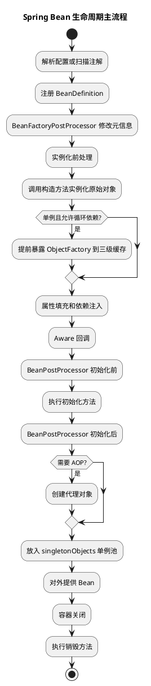

# Spring Bean 生命周期

## 问题索引

- Q1：Bean 的生命周期以及各个阶段的关键点

## Q1：Bean 的生命周期以及各个阶段的关键点

### 背景

Spring Bean 生命周期是理解 IoC、AOP、循环依赖、自动装配、初始化扩展点的主线。面试里不要只背“实例化、属性赋值、初始化、销毁”，更要能说清楚每个阶段发生了什么、哪些扩展点在什么时候执行、AOP 代理对象在哪个阶段产生。

### 总体流程

单例 Bean 的典型创建流程可以简化为：

```text
读取 BeanDefinition
  -> BeanFactoryPostProcessor 修改 BeanDefinition
  -> 实例化前 InstantiationAwareBeanPostProcessor
  -> 实例化 Bean
  -> 合并 BeanDefinition 后置处理
  -> 提前暴露单例工厂，用于解决循环依赖
  -> 属性填充
  -> Aware 回调
  -> BeanPostProcessor 初始化前
  -> 初始化方法
  -> BeanPostProcessor 初始化后
  -> AOP 代理可能在这里形成
  -> 放入单例池
  -> 使用 Bean
  -> 容器关闭时销毁
```

最核心的源码入口通常是：

- `AbstractApplicationContext#refresh`
- `AbstractAutowireCapableBeanFactory#doCreateBean`
- `AbstractAutowireCapableBeanFactory#createBean`
- `AbstractAutowireCapableBeanFactory#populateBean`
- `AbstractAutowireCapableBeanFactory#initializeBean`

### PlantUML 示意图



### 阶段一：BeanDefinition 加载与注册

Spring 首先不会直接创建对象，而是先把 XML、注解、配置类扫描结果解析成 `BeanDefinition`。

`BeanDefinition` 描述的是“怎么创建 Bean”，例如：

- Bean 的 class 类型。
- 作用域：singleton、prototype。
- 是否懒加载。
- 构造参数。
- 属性依赖。
- 初始化方法和销毁方法。
- 自动装配模式。

关键点：

1. 此时还没有真正创建业务对象。
2. `BeanDefinitionRegistryPostProcessor` 可以新增、删除、修改 BeanDefinition。
3. `BeanFactoryPostProcessor` 可以修改已注册的 BeanDefinition，例如配置占位符解析、属性值调整。

### 阶段二：实例化前处理

在真正调用构造方法之前，Spring 会给 `InstantiationAwareBeanPostProcessor#postProcessBeforeInstantiation` 一个机会。

这个扩展点非常关键，因为它可以在实例化之前直接返回一个代理对象。如果返回了对象，Spring 后续可能跳过普通实例化流程。

典型场景：

- AOP 基础设施判断是否需要提前创建代理。
- 某些框架自定义特殊 Bean 的创建过程。

容易混淆点：

实例化前处理发生在构造方法之前；初始化前处理发生在属性填充和 Aware 回调之后，二者不是一个阶段。

### 阶段三：实例化 Bean

实例化就是创建原始对象，通常通过构造方法或工厂方法完成。

常见方式：

- 默认无参构造方法。
- 有参构造方法自动注入。
- 静态工厂方法。
- 实例工厂方法。
- `FactoryBean#getObject()`。

关键点：

1. 实例化只代表对象被 new 出来了，不代表属性已经注入。
2. 构造器循环依赖通常无法解决，因为对象还没创建出来，无法提前暴露引用。
3. Spring 会根据构造方法推断、`@Autowired`、参数类型等选择构造方法。

示例：

```java
@Service
public class OrderService {
    private final UserService userService;

    // 构造方法注入发生在实例化阶段。
    // 如果两个 Bean 互相构造器注入，就没有早期对象可以暴露，通常会创建失败。
    public OrderService(UserService userService) {
        this.userService = userService;
    }
}
```

### 阶段四：提前暴露单例引用

对于单例 Bean，Spring 在实例化之后、属性填充之前，会根据条件把一个 `ObjectFactory` 放入三级缓存 `singletonFactories`。

这个阶段用于解决部分循环依赖：

```text
A 实例化完成，但还没填充属性
  -> Spring 暴露 A 的 ObjectFactory
  -> A 填充属性时需要 B
  -> B 填充属性时又需要 A
  -> B 可以从三级缓存拿到 A 的早期引用
```

关键点：

1. 暴露的是早期引用，不是完整初始化后的 Bean。
2. 三级缓存的 `ObjectFactory` 可以决定返回原始对象还是早期代理对象。
3. 这也是循环依赖和 AOP 代理交叉时最容易被追问的地方。

### 阶段五：属性填充

属性填充发生在实例化之后，主要完成依赖注入。

常见注入方式：

- `@Autowired`
- `@Resource`
- `@Value`
- XML property
- setter 注入
- 字段注入

关键扩展点：

- `InstantiationAwareBeanPostProcessor#postProcessProperties`
- `AutowiredAnnotationBeanPostProcessor`
- `CommonAnnotationBeanPostProcessor`

关键点：

1. `@Autowired`、`@Value` 等注入主要在属性填充阶段完成。
2. 字段注入、setter 注入的循环依赖可以通过提前暴露引用解决。
3. 属性填充时依赖的 Bean 如果不存在，会触发依赖 Bean 的创建。

示例：

```java
@Service
public class PayService {
    @Autowired
    private OrderService orderService;

    // 字段注入发生在属性填充阶段。
    // 此时 PayService 已经实例化，但还没有完成初始化。
}
```

### 阶段六：Aware 回调

属性填充完成后，Spring 会处理各种 `Aware` 接口，让 Bean 感知容器资源。

常见接口：

- `BeanNameAware`
- `BeanClassLoaderAware`
- `BeanFactoryAware`
- `ApplicationContextAware`
- `EnvironmentAware`
- `ResourceLoaderAware`

关键点：

1. Aware 用于把容器对象或运行环境回调给 Bean。
2. 不建议业务代码过度依赖 Aware，否则会增强对 Spring 容器的耦合。
3. `ApplicationContextAware` 是很多框架拿容器上下文的入口。

示例：

```java
@Component
public class SpringContextHolder implements ApplicationContextAware {
    private static ApplicationContext context;

    @Override
    public void setApplicationContext(ApplicationContext applicationContext) {
        // 保存容器引用，便于某些非 Spring 管理对象获取 Bean。
        // 业务代码应谨慎使用，避免到处手动 getBean 造成强耦合。
        context = applicationContext;
    }
}
```

### 阶段七：初始化前处理

执行初始化方法之前，Spring 会调用：

```text
BeanPostProcessor#postProcessBeforeInitialization
```

典型作用：

- 处理 `@PostConstruct`。
- 做初始化前的增强。
- 注入框架级能力。

关键点：

1. 此时属性已经填充完成。
2. Aware 回调也已经执行。
3. 这是初始化方法之前的最后一类通用扩展点。

### 阶段八：初始化方法

初始化阶段按照常见顺序包括：

1. `@PostConstruct`
2. `InitializingBean#afterPropertiesSet`
3. 自定义 `init-method`

不同资料对 `@PostConstruct` 的归类可能有细微差异，因为它通常由 `BeanPostProcessor` 触发，但复习时可以把它理解为初始化链路中的一环。

关键点：

1. 初始化方法适合做依赖属性已经就绪后的校验、资源准备、缓存预热。
2. 不适合做过重或不可控的远程调用，否则会拖慢容器启动。
3. 初始化异常会导致 Bean 创建失败，进而影响容器启动。

示例：

```java
@Component
public class PriceCache {
    private Map<Long, BigDecimal> localCache;

    @PostConstruct
    public void init() {
        // 初始化阶段适合做本地结构准备。
        // 如果这里访问远程服务，要设置超时和降级，避免拖垮应用启动。
        this.localCache = new ConcurrentHashMap<>();
    }
}
```

### 阶段九：初始化后处理与 AOP 代理

初始化完成后，Spring 会调用：

```text
BeanPostProcessor#postProcessAfterInitialization
```

AOP 代理通常在这个阶段产生，例如 `AbstractAutoProxyCreator` 会判断当前 Bean 是否需要被代理。

关键点：

1. 最终放入单例池的可能不是原始对象，而是代理对象。
2. `@Transactional`、`@Async`、缓存注解、切面日志等能力依赖代理对象生效。
3. 如果在 Bean 内部自调用代理方法，会绕过代理，导致事务、异步等失效。

示例：

```java
@Service
public class OrderAppService {
    @Transactional
    public void createOrder() {
        // 这个方法需要通过 Spring 代理对象调用，事务才会生效。
    }

    public void batchCreate() {
        // this.createOrder() 是内部自调用，不经过代理对象。
        // 因此 createOrder 上的 @Transactional 可能不会生效。
        this.createOrder();
    }
}
```

### 阶段十：放入单例池并对外提供

完成初始化后，单例 Bean 会放入一级缓存：

```text
singletonObjects
```

之后其他地方调用 `getBean`，通常直接从一级缓存获取完整 Bean。

关键点：

1. 一级缓存中保存的是最终可用对象。
2. 如果 Bean 被 AOP 代理，一级缓存中通常保存代理对象。
3. 容器运行期间，单例 Bean 默认只创建一次。

### 阶段十一：销毁

容器关闭时，Spring 会执行销毁逻辑。

常见销毁方式：

1. `@PreDestroy`
2. `DisposableBean#destroy`
3. 自定义 `destroy-method`

关键点：

1. 销毁方法只对 Spring 管理生命周期的 Bean 生效。
2. prototype Bean 创建后通常不由容器自动完整管理销毁。
3. 销毁阶段适合释放线程池、连接、文件句柄、订阅关系等资源。

示例：

```java
@Component
public class ReportExecutor {
    private final ExecutorService executor = Executors.newFixedThreadPool(4);

    @PreDestroy
    public void shutdown() {
        // 容器关闭时主动释放线程池，避免应用停止后仍有非守护线程残留。
        executor.shutdown();
    }
}
```

### 阶段总表

| 阶段 | 关键动作 | 关键扩展点 |
| --- | --- | --- |
| BeanDefinition 注册 | 解析配置和注解 | `BeanDefinitionRegistryPostProcessor` |
| BeanDefinition 修改 | 修改 Bean 元信息 | `BeanFactoryPostProcessor` |
| 实例化前 | 可能直接返回代理 | `postProcessBeforeInstantiation` |
| 实例化 | 创建原始对象 | 构造方法、工厂方法 |
| 提前暴露 | 解决部分循环依赖 | 三级缓存、`ObjectFactory` |
| 属性填充 | 依赖注入 | `postProcessProperties` |
| Aware 回调 | 感知容器资源 | 各种 `Aware` |
| 初始化前 | 初始化前增强 | `postProcessBeforeInitialization` |
| 初始化 | 执行初始化逻辑 | `@PostConstruct`、`afterPropertiesSet`、`init-method` |
| 初始化后 | 初始化后增强和 AOP | `postProcessAfterInitialization` |
| 使用 | 从单例池获取 | `singletonObjects` |
| 销毁 | 释放资源 | `@PreDestroy`、`destroy`、`destroy-method` |

### 业务场景

在项目里理解 Bean 生命周期，可以帮助排查这些问题：

1. `@Autowired` 注入为 null：看对象是否由 Spring 管理，或是否过早在构造方法中使用依赖。
2. `@Transactional` 不生效：看调用是否经过代理对象，代理是否生成在初始化后阶段。
3. 启动很慢：看 `@PostConstruct`、`afterPropertiesSet`、监听器里是否做了重 IO。
4. 循环依赖报错：看是否是构造器注入、prototype、或复杂代理场景。
5. 应用停止后线程不退出：看销毁阶段是否正确释放线程池和连接资源。

### 面试话术

可以这样回答：

> Spring Bean 生命周期可以按“元信息、创建、依赖注入、初始化、代理、使用、销毁”来讲。首先 Spring 解析配置生成 BeanDefinition，期间 BeanFactoryPostProcessor 可以修改元信息。真正创建 Bean 时，会先经过实例化前处理，然后调用构造方法创建原始对象。对于单例 Bean，实例化后可能提前暴露 ObjectFactory 到三级缓存，用于解决属性注入形式的循环依赖。接着进行属性填充，处理 `@Autowired`、`@Value` 等依赖注入。属性填充后执行 Aware 回调，再经过 BeanPostProcessor 初始化前处理、初始化方法、初始化后处理。AOP 代理通常在初始化后处理阶段生成，所以最终放入单例池的可能是代理对象。容器关闭时，会执行 `@PreDestroy`、`DisposableBean` 或 destroy-method 释放资源。

## 高频追问

- Q：实例化和初始化有什么区别？
  A：实例化是调用构造方法创建对象；初始化是在属性注入、Aware 回调之后执行初始化逻辑，例如 `@PostConstruct`、`afterPropertiesSet`、`init-method`。

- Q：AOP 代理在生命周期哪个阶段产生？
  A：通常在 `BeanPostProcessor#postProcessAfterInitialization` 阶段产生，典型实现是 `AbstractAutoProxyCreator`。循环依赖场景下，也可能通过三级缓存的 `getEarlyBeanReference` 提前暴露代理对象。

- Q：`@Autowired` 在哪个阶段完成？
  A：主要在属性填充阶段完成，由 `AutowiredAnnotationBeanPostProcessor` 等后置处理器解析注入点并完成依赖注入。

- Q：为什么构造器循环依赖解决不了？
  A：构造器依赖要求创建 A 前必须先有 B，创建 B 前又必须先有 A，此时连原始对象都没有实例化出来，无法提前暴露引用。

- Q：BeanPostProcessor 和 BeanFactoryPostProcessor 有什么区别？
  A：`BeanFactoryPostProcessor` 处理 BeanDefinition，发生在 Bean 实例化之前；`BeanPostProcessor` 处理 Bean 实例对象，发生在 Bean 创建和初始化过程中。

- Q：单例 Bean 和 prototype Bean 生命周期有什么不同？
  A：单例 Bean 由容器完整管理创建、初始化、缓存和销毁；prototype Bean 每次获取都会创建新对象，Spring 通常只负责创建和初始化，不负责完整销毁。

## 复习清单

- [ ] 能按顺序说出 Bean 生命周期主流程
- [ ] 能区分实例化、属性填充、初始化
- [ ] 能说明 `BeanFactoryPostProcessor` 和 `BeanPostProcessor` 的区别
- [ ] 能解释 AOP 代理对象在哪个阶段产生
- [ ] 能结合三级缓存解释循环依赖和生命周期的关系
- [ ] 能说出 `@Autowired`、`@PostConstruct`、`@PreDestroy` 分别在哪个阶段执行
