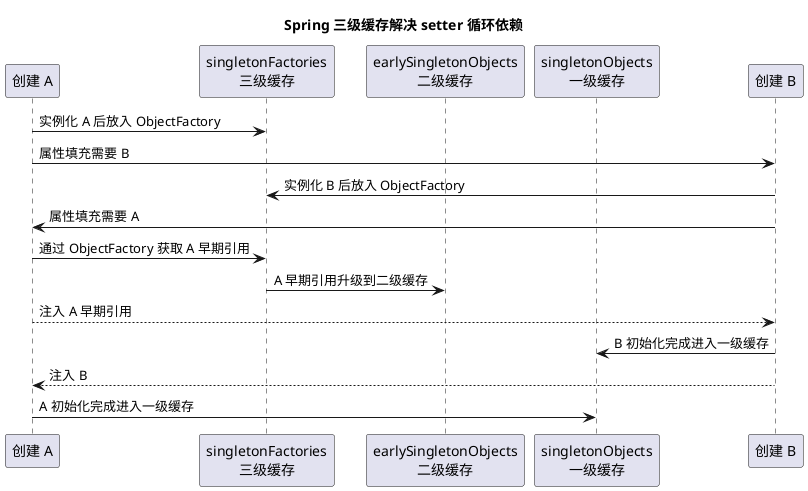

# Spring 三级缓存与循环依赖

## 问题索引

- Q1：Spring 如何通过三级缓存解决循环依赖？以及为什么需要三级缓存？

## Q1：Spring 如何通过三级缓存解决循环依赖？以及为什么需要三级缓存？

### 背景

Spring 循环依赖最常见的是单例 Bean 的属性注入循环依赖：

```text
A 依赖 B
B 依赖 A
```

如果没有额外机制，创建 A 时需要 B，创建 B 时又需要 A，就会陷入死循环。

Spring 通过“提前暴露单例对象引用”的方式解决部分循环依赖。所谓三级缓存，就是 Spring 单例 Bean 创建过程中的三层缓存结构。

### 核心结论

Spring 解决循环依赖的关键是：Bean 实例化后、属性填充前，先把一个可以获取早期引用的工厂放入三级缓存。后续其他 Bean 依赖它时，可以提前拿到这个早期引用，从而打破创建链路。

三级缓存分别是：

| 缓存 | 字段名 | 存放内容 | 作用 |
|---|---|---|---|
| 一级缓存 | `singletonObjects` | 完整初始化后的单例 Bean | 最终成品池 |
| 二级缓存 | `earlySingletonObjects` | 提前暴露的早期 Bean 引用 | 解决循环依赖时直接返回早期对象 |
| 三级缓存 | `singletonFactories` | `ObjectFactory<?>` | 延迟生成早期引用，必要时生成代理对象 |

最关键的一点：三级缓存不是简单多一层 Map，而是为了通过 `ObjectFactory` 延迟决定暴露普通对象还是代理对象。

### Bean 创建的大致流程

Spring 创建单例 Bean 的主流程可以简化为：

```text
getBean(A)
  -> 实例化 A
  -> 提前暴露 A 的 ObjectFactory 到三级缓存
  -> 填充 A 的属性
  -> 初始化 A
  -> 放入一级缓存
```

实例化和初始化不是一回事：

- 实例化：调用构造方法，创建出原始对象。
- 属性填充：给字段注入依赖。
- 初始化：执行 `Aware`、`BeanPostProcessor`、`InitializingBean`、`init-method` 等。

Spring 能解决属性注入循环依赖，是因为实例化 A 后，即使 A 还没完成属性填充和初始化，也已经有了一个对象引用，可以提前暴露。

### A 和 B 循环依赖流程


### PlantUML 示意图：三级缓存解决 A/B 循环依赖



假设：

```java
class A {
    // A 需要注入 B
    private B b;
}

class B {
    // B 需要注入 A
    private A a;
}
```

流程：

```text
1. getBean(A)
2. 实例化 A，得到原始对象 A
3. A 还没填充属性，但 Spring 把 A 的 ObjectFactory 放入三级缓存 singletonFactories
4. 开始给 A 填充属性，发现 A 依赖 B
5. getBean(B)
6. 实例化 B，得到原始对象 B
7. B 的 ObjectFactory 放入三级缓存
8. 开始给 B 填充属性，发现 B 依赖 A
9. getBean(A)
10. 一级缓存没有 A，因为 A 还没初始化完成
11. 二级缓存没有 A，因为还没人提前取过
12. 三级缓存有 A 的 ObjectFactory
13. 调用 ObjectFactory，得到 A 的早期引用
14. 把 A 的早期引用放入二级缓存，并从三级缓存移除
15. B 注入 A 的早期引用
16. B 完成初始化，进入一级缓存
17. A 继续注入 B
18. A 完成初始化，进入一级缓存
```

这样循环就被打破了。

### 三级缓存查找顺序

Spring 获取单例时大致会按这个顺序查：

```text
一级缓存 singletonObjects
  -> 有：说明 Bean 完整初始化完成，直接返回
  -> 没有：查二级缓存 earlySingletonObjects
      -> 有：说明是提前暴露的早期引用，直接返回
      -> 没有：查三级缓存 singletonFactories
          -> 有：调用 ObjectFactory 获取早期引用
          -> 放入二级缓存，移除三级缓存
```

伪代码：

```java
Object getSingleton(String beanName) {
    // 一级缓存：完整 Bean
    Object singletonObject = singletonObjects.get(beanName);
    if (singletonObject != null) {
        return singletonObject;
    }

    // 当前 Bean 正在创建中时，才需要尝试早期引用
    if (isSingletonCurrentlyInCreation(beanName)) {
        // 二级缓存：已经生成过的早期引用
        Object earlyObject = earlySingletonObjects.get(beanName);
        if (earlyObject != null) {
            return earlyObject;
        }

        // 三级缓存：用于延迟创建早期引用的工厂
        ObjectFactory<?> factory = singletonFactories.get(beanName);
        if (factory != null) {
            Object exposedObject = factory.getObject();

            // 早期引用生成后放入二级缓存，后续重复获取保持同一个引用
            earlySingletonObjects.put(beanName, exposedObject);
            singletonFactories.remove(beanName);
            return exposedObject;
        }
    }

    return null;
}
```

### 为什么需要三级缓存

如果没有 AOP，二级缓存理论上就能解决普通循环依赖：实例化后直接把早期对象放到二级缓存，其他 Bean 需要时直接取。

但 Spring 需要考虑 AOP 代理。

如果 A 最终会被代理，比如加了事务、切面：

```java
class AService {
    @Transactional
    public void save() {
    }
}
```

那么其他 Bean 注入 A 时，应该拿到的是代理对象，而不是原始对象。否则调用 A 的方法时就绕过了事务代理。

三级缓存的 `ObjectFactory` 允许 Spring 在“真的发生循环依赖、需要提前暴露 A”时，再通过 `getEarlyBeanReference` 决定返回：

- 原始对象。
- 代理对象。

这就是三级缓存最核心的价值。

### 为什么二级缓存不够

如果只有二级缓存，有两个选择，但都有问题。

方案一：实例化后直接把原始对象放入二级缓存。

问题：

- 如果 Bean 后续需要 AOP 代理，其他 Bean 已经注入了原始对象。
- 最终一级缓存里可能是代理对象。
- 结果同一个 Bean 在不同地方引用不一致。
- 事务、缓存、切面可能失效。

方案二：实例化后立即创建代理对象放入二级缓存。

问题：

- 并不是所有 Bean 都会发生循环依赖。
- 并不是所有 Bean 都需要提前代理。
- 过早创建代理会增加成本，也可能影响 BeanPostProcessor 正常生命周期。

三级缓存的好处是延迟：

```text
先放 ObjectFactory
  -> 如果没人循环依赖它，就正常初始化
  -> 如果有人提前依赖它，再调用 ObjectFactory 生成早期引用
  -> 如果需要 AOP，就生成早期代理
```

所以三级缓存不是为了“缓存更多对象”，而是为了“延迟生成早期引用”。

### AOP 代理场景

假设 A 会被 AOP 代理，B 依赖 A。

```text
1. A 实例化后，三级缓存放入 ObjectFactory
2. A 填充属性时创建 B
3. B 又依赖 A
4. B 调用 getBean(A)
5. 从三级缓存拿到 A 的 ObjectFactory
6. ObjectFactory 调用 getEarlyBeanReference
7. 如果 A 需要 AOP，返回 A 的代理对象
8. B 注入的是 A 的代理对象
9. A 最终初始化完成后，一级缓存中也应保持同一个代理引用
```

这样可以保证其他 Bean 注入的不是原始对象，而是具备事务、日志、缓存等增强能力的代理对象。

### Spring 能解决哪些循环依赖

Spring 主要能解决：

- 单例 Bean。
- 属性注入或 setter 注入。
- 非构造器强依赖。

Spring 通常不能解决：

- 构造器循环依赖。
- prototype Bean 循环依赖。
- 某些复杂 AOP 场景下的循环依赖。

构造器循环依赖为什么不行？

```java
class A {
    A(B b) {
    }
}

class B {
    B(A a) {
    }
}
```

创建 A 必须先有 B，创建 B 必须先有 A。此时 A 连原始对象都实例化不出来，没法提前暴露引用。

### Spring Boot 版本注意点

Spring Framework 本身有三级缓存机制。

但 Spring Boot 2.6 开始，默认不允许循环依赖，配置项是：

```properties
spring.main.allow-circular-references=true
```

这不是因为三级缓存不存在，而是官方更倾向于让开发者消除循环依赖，避免设计上的强耦合。

### 业务场景

实际项目中遇到循环依赖，优先考虑重构：

- 抽取第三个协调服务。
- 把公共逻辑下沉到独立组件。
- 使用事件解耦。
- 使用延迟注入 `@Lazy` 临时缓解。
- 拆分接口，避免两个服务互相调用。

三级缓存是 Spring 的容错和框架能力，不应该成为业务代码互相依赖的理由。

### 踩坑点

- 三级缓存只解决部分单例属性注入循环依赖。
- 构造器循环依赖解决不了。
- prototype 循环依赖解决不了。
- 注入原始对象而不是代理对象，可能导致事务失效。
- Spring Boot 2.6+ 默认禁止循环依赖。
- 循环依赖通常意味着模块职责边界不清晰。

### 面试话术

> Spring 通过三级缓存解决单例 Bean 的属性注入循环依赖。一级缓存 `singletonObjects` 存完整初始化后的 Bean，二级缓存 `earlySingletonObjects` 存提前暴露的早期引用，三级缓存 `singletonFactories` 存 `ObjectFactory`。创建 A 时，实例化后还没填充属性，Spring 会先把 A 的 ObjectFactory 放入三级缓存。A 注入 B，创建 B 时又需要 A，此时从一级、二级找不到 A，就从三级缓存拿到 ObjectFactory，生成 A 的早期引用放入二级缓存，并注入给 B，B 完成后 A 再继续完成。需要三级缓存的关键原因是 AOP：如果 A 最终要生成代理对象，ObjectFactory 可以在提前暴露时通过 `getEarlyBeanReference` 返回代理对象，避免其他 Bean 注入原始对象导致事务、切面失效。

## 高频追问

- Q：三级缓存分别是什么？
  A：一级缓存 `singletonObjects` 存完整 Bean；二级缓存 `earlySingletonObjects` 存早期引用；三级缓存 `singletonFactories` 存能生成早期引用的 `ObjectFactory`。

- Q：为什么二级缓存不能解决所有问题？
  A：普通对象循环依赖二级缓存可以解决，但遇到 AOP 时需要决定提前暴露原始对象还是代理对象。三级缓存用 ObjectFactory 延迟生成早期引用，能在需要时返回代理对象。

- Q：构造器循环依赖为什么解决不了？
  A：构造器依赖要求创建 A 前必须先创建 B，创建 B 前又必须先创建 A。此时对象还没实例化，没有早期引用可以暴露。

- Q：Spring 能解决 prototype 循环依赖吗？
  A：通常不能。三级缓存主要针对单例 Bean，prototype 每次都创建新对象，没有统一单例缓存来提前暴露。

- Q：为什么 Spring Boot 2.6 默认禁止循环依赖？
  A：循环依赖通常说明设计耦合过强。虽然 Spring 有三级缓存能力，但 Boot 默认鼓励开发者通过重构消除循环依赖。

## 复习清单

- [ ] 能说清一级、二级、三级缓存分别存什么
- [ ] 能画出 A/B 属性注入循环依赖的创建流程
- [ ] 能解释为什么三级缓存存的是 ObjectFactory
- [ ] 能说明 AOP 代理为什么是三级缓存存在的关键原因
- [ ] 能区分属性注入循环依赖和构造器循环依赖
- [ ] 能说明 Spring Boot 2.6+ 默认禁止循环依赖的原因

