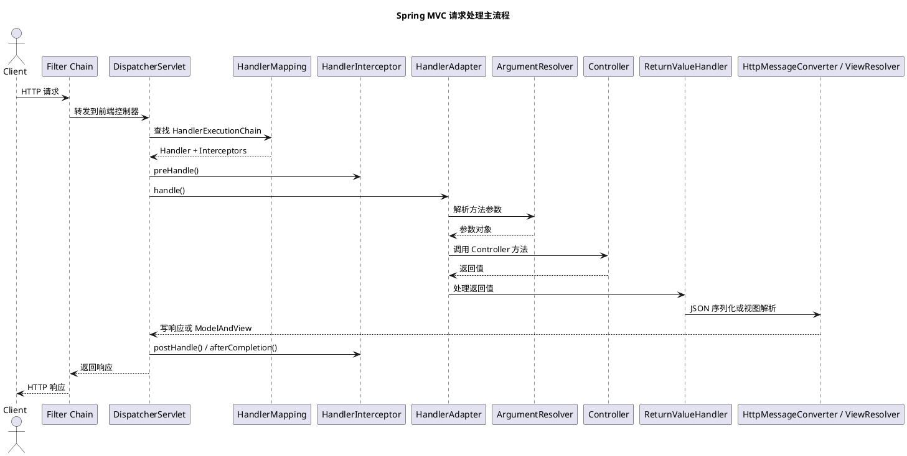

# Spring MVC 核心流程与原理

## 问题索引

- Q1：Spring MVC 核心流程与原理
- Q2：`@RequestBody` 为什么不能稳定多次读取，以及参数日志怎么打

## Q1：Spring MVC 核心流程与原理

### 背景

Spring MVC 是 Spring Web 体系里最核心的请求分发框架。面试里问“Spring MVC 核心流程”，本质不是背几个组件名，而是要能把一次 HTTP 请求从进入 `DispatcherServlet` 到调用 Controller、参数绑定、返回值处理、视图渲染或 JSON 输出的完整链路讲清楚。

它和业务项目的关系非常直接：接口为什么能自动接收 JSON、为什么 `@RequestBody` 和 `@RequestParam` 行为不同、拦截器为什么能拿到 Handler、统一异常为什么能兜住 Controller 异常、`@ResponseBody` 为什么不走页面渲染，都依赖 Spring MVC 的组件协作机制。

### 总体流程

一次典型请求可以简化为：

```text
客户端请求
  -> Servlet 容器接收请求
  -> Filter 过滤器链
  -> DispatcherServlet
  -> HandlerMapping 查找 HandlerExecutionChain
  -> HandlerInterceptor#preHandle
  -> HandlerAdapter 适配并调用 Controller
  -> HandlerMethodArgumentResolver 解析方法参数
  -> Controller 方法执行业务逻辑
  -> HandlerMethodReturnValueHandler 处理返回值
  -> HandlerInterceptor#postHandle
  -> ViewResolver 解析视图，或 HttpMessageConverter 写 JSON
  -> HandlerInterceptor#afterCompletion
  -> 返回响应
```

其中最关键的主线是：

```text
DispatcherServlet
  -> HandlerMapping
  -> HandlerAdapter
  -> Controller
  -> ReturnValueHandler / ViewResolver
```

面试时可以先讲主线，再补充参数解析、返回值处理、异常处理、拦截器和过滤器的扩展点。

### PlantUML 示意图



### 核心入口：DispatcherServlet

`DispatcherServlet` 是 Spring MVC 的前端控制器，它本身是一个 Servlet，由 Servlet 容器调用。它的职责不是写业务逻辑，而是统一接管请求分发流程。

核心职责包括：

1. 接收所有匹配到的 HTTP 请求。
2. 委托 `HandlerMapping` 找到能处理请求的 Handler。
3. 委托 `HandlerAdapter` 适配并调用 Handler。
4. 组织参数解析、返回值处理、异常处理、视图解析。
5. 触发拦截器链的前置、后置和完成回调。

可以把 `DispatcherServlet` 理解为 Spring MVC 的总调度器。它不直接关心某个 Controller 方法怎么写，只负责找到“谁能处理”、用“什么方式调用”、以及“结果怎么输出”。

### 九大核心组件

Spring MVC 常被问到“九大组件”，常见理解如下：

| 组件 | 作用 |
| --- | --- |
| `MultipartResolver` | 解析文件上传请求 |
| `LocaleResolver` | 解析国际化区域信息 |
| `ThemeResolver` | 解析主题，现代项目较少关注 |
| `HandlerMapping` | 根据请求查找 Handler |
| `HandlerAdapter` | 适配并执行 Handler |
| `HandlerExceptionResolver` | 处理 Handler 执行过程中的异常 |
| `RequestToViewNameTranslator` | 请求没有显式视图名时推导默认视图名 |
| `ViewResolver` | 根据视图名解析 `View` |
| `FlashMapManager` | 管理重定向场景下的 Flash 属性 |

在 REST API 项目里，最常用也最值得深入的是：

- `HandlerMapping`
- `HandlerAdapter`
- `HandlerExceptionResolver`
- `ViewResolver`
- `HttpMessageConverter`

严格说 `HttpMessageConverter` 不属于传统“九大组件”，但它是现代 Spring MVC JSON 请求和响应处理的核心。

### HandlerMapping：找到谁处理请求

`HandlerMapping` 负责根据请求路径、HTTP 方法、请求头、参数等条件，找到对应的 Handler。

对于常见的 `@RequestMapping`、`@GetMapping`、`@PostMapping`，核心实现通常是 `RequestMappingHandlerMapping`。它会在应用启动时扫描 Controller，把请求映射关系注册起来。

示例：

```java
@RestController
@RequestMapping("/orders")
public class OrderController {

    @GetMapping("/{id}")
    public OrderVO detail(@PathVariable Long id) {
        // id 来自 URL 路径变量，例如 /orders/1001 中的 1001。
        // Spring MVC 会在调用方法前完成类型转换和参数绑定。
        return orderService.queryDetail(id);
    }
}
```

启动阶段，Spring MVC 会把 `/orders/{id}`、`GET`、`OrderController#detail` 之间的关系注册起来。请求进来后，`HandlerMapping` 就能找到对应的 Controller 方法。

`HandlerMapping` 返回的通常不是单独的 Handler，而是 `HandlerExecutionChain`，里面包含：

- Handler 本身。
- 匹配到的拦截器链。

这也是为什么 Spring MVC 拦截器可以围绕 Controller 执行。

### HandlerAdapter：知道怎么调用 Handler

`HandlerMapping` 只解决“找谁”，`HandlerAdapter` 解决“怎么调用”。

为什么需要 Adapter？因为 Spring MVC 支持多种 Handler 形态，例如注解 Controller、传统 Controller 接口、HttpRequestHandler 等。`DispatcherServlet` 不可能为每种 Handler 写死调用逻辑，所以通过适配器模式解耦。

现代注解 Controller 的核心适配器通常是：

```text
RequestMappingHandlerAdapter
```

它会负责：

1. 找到 Controller 方法。
2. 使用参数解析器解析方法入参。
3. 反射调用目标方法。
4. 使用返回值处理器处理方法返回结果。

一句话总结：`HandlerMapping` 找到方法，`HandlerAdapter` 执行方法。

### 参数解析：为什么方法参数能自动注入

Controller 方法里的参数并不是凭空出现的，而是由 `HandlerMethodArgumentResolver` 解析出来的。

常见参数解析包括：

| 注解或类型 | 解析来源 |
| --- | --- |
| `@RequestParam` | 查询参数或表单参数 |
| `@PathVariable` | URL 路径变量 |
| `@RequestBody` | 请求体，通常通过 JSON 反序列化 |
| `@RequestHeader` | 请求头 |
| `@CookieValue` | Cookie |
| `HttpServletRequest` | Servlet 原生请求对象 |
| `Principal` | 当前认证主体 |

示例：

```java
@PostMapping("/orders")
public OrderVO create(@RequestBody CreateOrderRequest request,
                      @RequestHeader("X-Trace-Id") String traceId) {
    // request 来自 HTTP 请求体，通常由 MappingJackson2HttpMessageConverter 反序列化 JSON 得到。
    // traceId 来自请求头，可用于日志链路追踪或排查问题。
    return orderService.create(request, traceId);
}
```

这里有两个关键点：

1. `@RequestBody` 读取请求体，只能稳定读取一次；如果 Filter 或拦截器提前消费了输入流，Controller 可能读不到 body。
2. JSON 到 Java 对象的转换通常不是参数解析器独立完成的，而是参数解析器委托 `HttpMessageConverter` 完成。

### 返回值处理：为什么可以返回 JSON 或页面

Controller 方法执行完后，返回值会交给 `HandlerMethodReturnValueHandler` 处理。

常见返回值处理方式：

| 返回值 | 处理方式 |
| --- | --- |
| `String` | 可能作为视图名，也可能作为响应体 |
| `ModelAndView` | 视图名和模型数据一起返回 |
| 普通对象 + `@ResponseBody` | 写入响应体，通常序列化为 JSON |
| `ResponseEntity` | 自定义状态码、响应头和响应体 |
| `void` | 可能由方法自己写响应 |

`@RestController` 等价于 `@Controller + @ResponseBody`，所以它返回的对象默认会通过 `HttpMessageConverter` 写入响应体，而不是交给 `ViewResolver` 渲染页面。

示例：

```java
@RestController
public class HealthController {

    @GetMapping("/health")
    public Map<String, Object> health() {
        Map<String, Object> result = new HashMap<>();
        // 返回普通对象时，@RestController 会让 Spring MVC 把它写入响应体。
        // Jackson 转 JSON 的动作通常由 HttpMessageConverter 完成。
        result.put("status", "UP");
        return result;
    }
}
```

如果是传统页面项目，Controller 返回视图名时，会进入 `ViewResolver`：

```text
Controller 返回 "order/detail"
  -> ViewResolver 解析为具体 View
  -> View 渲染 HTML
  -> 返回给浏览器
```

如果是 REST API，通常是：

```text
Controller 返回对象
  -> ReturnValueHandler 判断需要写响应体
  -> HttpMessageConverter 序列化为 JSON
  -> 写入 HttpServletResponse
```

### 异常处理：Controller 抛异常后谁兜底

Controller 执行过程中如果抛出异常，会交给 `HandlerExceptionResolver` 处理。

常见机制包括：

- `@ExceptionHandler`
- `@ControllerAdvice`
- `ResponseStatusException`
- `@ResponseStatus`
- Spring Boot 默认错误处理

示例：

```java
@RestControllerAdvice
public class GlobalExceptionHandler {

    @ExceptionHandler(BizException.class)
    public ErrorResponse handleBizException(BizException ex) {
        // 统一异常处理可以把业务异常转换成稳定的 API 响应结构。
        // 不要直接把底层异常堆栈暴露给前端，避免泄漏内部实现细节。
        return new ErrorResponse(ex.getCode(), ex.getMessage());
    }
}
```

这也是项目里统一返回格式、统一错误码、日志脱敏和异常告警的基础扩展点。

### 拦截器与过滤器

过滤器 `Filter` 属于 Servlet 规范，执行在 `DispatcherServlet` 之前；拦截器 `HandlerInterceptor` 属于 Spring MVC，执行在 HandlerMapping 找到 Handler 之后、Controller 调用前后。

| 对比项 | Filter | HandlerInterceptor |
| --- | --- | --- |
| 所属体系 | Servlet 规范 | Spring MVC |
| 执行位置 | 进入 `DispatcherServlet` 之前 | 找到 Handler 之后 |
| 是否知道 Controller | 通常不知道 | 知道 Handler |
| 常见用途 | 编码、CORS、认证、请求包装 | 权限校验、审计、接口耗时、幂等校验 |

拦截器典型流程：

```text
preHandle
  -> Controller
  -> postHandle
  -> 视图渲染或响应写出
  -> afterCompletion
```

示例：

```java
public class TraceInterceptor implements HandlerInterceptor {

    @Override
    public boolean preHandle(HttpServletRequest request,
                             HttpServletResponse response,
                             Object handler) {
        // Controller 执行前记录开始时间，后续可用于统计接口耗时。
        // 返回 false 会中断后续 Controller 调用，适合权限不通过等场景。
        request.setAttribute("startTime", System.currentTimeMillis());
        return true;
    }

    @Override
    public void afterCompletion(HttpServletRequest request,
                                HttpServletResponse response,
                                Object handler,
                                Exception ex) {
        Long startTime = (Long) request.getAttribute("startTime");
        if (startTime != null) {
            long cost = System.currentTimeMillis() - startTime;
            // 实际项目中这里通常写入日志、监控指标或链路追踪上下文。
            log.info("request cost={}ms uri={}", cost, request.getRequestURI());
        }
    }
}
```

### 核心原理

Spring MVC 的核心原理可以概括为四个设计思想。

#### 前端控制器模式

所有请求先进入 `DispatcherServlet`，由它统一调度，避免每个 Controller 自己处理通用流程。统一入口让权限、异常、参数绑定、返回值处理、视图解析等能力可以集中扩展。

#### 策略模式

`HandlerMapping`、`HandlerAdapter`、`ViewResolver`、`HandlerExceptionResolver` 都可以有多个实现。`DispatcherServlet` 面向接口编程，不绑定具体策略。

#### 适配器模式

不同 Handler 的调用方式不同，`HandlerAdapter` 把差异屏蔽掉，让 `DispatcherServlet` 只需要调用统一入口。

#### 责任链思想

过滤器链、拦截器链、参数解析器列表、返回值处理器列表，本质都有责任链特征：按顺序判断谁能处理，能处理就执行。

### 业务场景

在实际项目中，理解 Spring MVC 流程可以帮助解决这些问题：

1. 登录态、数据权限、接口幂等：通常放在 Filter、Interceptor 或 AOP 中，选择位置要看是否需要知道 Handler 信息。
2. 统一响应格式：可以通过 `ResponseBodyAdvice` 或统一返回对象实现。
3. 统一异常处理：通过 `@RestControllerAdvice` 和 `@ExceptionHandler` 收口。
4. 请求参数校验：`@Valid`、`BindingResult`、全局异常处理配合使用。
5. 请求体重复读取：需要使用包装后的 `HttpServletRequest` 缓存 body，避免提前消费输入流。
6. 接口耗时监控：可以在拦截器、Filter 或链路追踪组件里记录。

### 踩坑点

1. 不要把 Filter 和 Interceptor 混为一谈。Filter 更靠前，属于 Servlet；Interceptor 更贴近 Spring MVC，能拿到 Handler。
2. `@RequestBody` 默认读取请求体，GET 查询参数不要误用它。
3. 请求体输入流默认只能读一次，日志 Filter 打印 body 时要特别小心。
4. `@Controller` 返回字符串默认可能走视图解析，REST 接口要用 `@ResponseBody` 或 `@RestController`。
5. 拦截器 `preHandle` 返回 `false` 后，Controller 不会执行。
6. 全局异常处理不要吞掉异常上下文，日志里要保留排查信息，但响应里不要暴露敏感堆栈。
7. 参数绑定失败、JSON 反序列化失败、业务异常是不同层面的异常，统一异常处理时要分开映射错误码。

### 面试话术

可以这样回答：

> Spring MVC 的核心是 `DispatcherServlet` 前端控制器。一次请求先经过 Servlet Filter 链，然后进入 `DispatcherServlet`。`DispatcherServlet` 会通过 `HandlerMapping` 根据请求路径、HTTP 方法等信息找到对应的 Handler，同时拿到拦截器链。接着执行拦截器的 `preHandle`，再通过 `HandlerAdapter` 适配并调用 Controller 方法。调用 Controller 前，`HandlerAdapter` 会使用 `HandlerMethodArgumentResolver` 解析 `@RequestParam`、`@PathVariable`、`@RequestBody` 等参数，其中 JSON 请求体通常由 `HttpMessageConverter` 反序列化。Controller 执行完成后，返回值交给 `HandlerMethodReturnValueHandler` 处理，如果是 `@ResponseBody` 或 `@RestController`，就通过 `HttpMessageConverter` 写 JSON；如果是页面视图，就通过 `ViewResolver` 解析并渲染。过程中如果发生异常，会由 `HandlerExceptionResolver` 处理，常见落地方式是 `@ControllerAdvice + @ExceptionHandler`。最后执行拦截器的 `postHandle` 和 `afterCompletion`，响应返回客户端。

### 高频追问

- Q：`HandlerMapping` 和 `HandlerAdapter` 有什么区别？
  A：`HandlerMapping` 负责根据请求找到 Handler，解决“找谁处理”；`HandlerAdapter` 负责适配并执行 Handler，解决“怎么调用”。

- Q：为什么 Spring MVC 要用 `HandlerAdapter`？
  A：因为 Handler 形态不止注解 Controller 一种。适配器模式可以让 `DispatcherServlet` 不关心具体 Handler 的调用细节，保持主流程稳定。

- Q：`@RequestBody` 和 `@RequestParam` 的区别是什么？
  A：`@RequestParam` 主要从查询参数或表单参数取值；`@RequestBody` 从请求体读取内容，并通常通过 `HttpMessageConverter` 把 JSON 转成 Java 对象。

- Q：`@Controller` 和 `@RestController` 的区别是什么？
  A：`@RestController` 等价于 `@Controller + @ResponseBody`，返回值默认写入响应体；`@Controller` 返回字符串时默认可能被当作视图名解析。

- Q：Filter 和 Interceptor 有什么区别？
  A：Filter 属于 Servlet 规范，执行在 `DispatcherServlet` 之前，通常不知道具体 Controller；Interceptor 属于 Spring MVC，执行在 HandlerMapping 找到 Handler 后，能围绕 Controller 前后做增强。

- Q：Spring MVC 如何把对象转成 JSON？
  A：Controller 返回值被返回值处理器识别为响应体后，会委托 `HttpMessageConverter`，常见是 Jackson 对应的 `MappingJackson2HttpMessageConverter`，把 Java 对象序列化成 JSON 并写入响应。

- Q：统一异常处理的原理是什么？
  A：Controller 抛出的异常会进入 `HandlerExceptionResolver` 体系，`@ControllerAdvice + @ExceptionHandler` 本质就是注册全局异常处理逻辑，把异常转换成统一响应。

### 复习清单

- [ ] 能画出请求从 Filter 到 `DispatcherServlet` 再到 Controller 的主流程。
- [ ] 能说清 `HandlerMapping` 和 `HandlerAdapter` 的分工。
- [ ] 能解释参数解析器和 `HttpMessageConverter` 的关系。
- [ ] 能区分 REST JSON 输出和传统视图渲染。
- [ ] 能说明 Filter、Interceptor、AOP 的位置差异。
- [ ] 能结合统一异常、统一响应、接口鉴权说出工程落地点。

## Q2：`@RequestBody` 为什么不能稳定多次读取，以及参数日志怎么打

### 背景

`@RequestBody` 读取的是 HTTP 请求体。它常用于接收 JSON、XML、二进制内容或文件上传之外的原始 body。实际项目里经常会遇到一个问题：想在 Filter、Interceptor 或 AOP 里打印请求参数日志，但一旦提前读取了 body，Controller 里的 `@RequestBody` 就可能拿不到内容。

这个现象不是 Spring MVC 故意“刁难”，而是 Servlet 请求体模型和流式 IO 设计带来的结果。

### 核心原理

Servlet 规范里，请求体主要通过两种方式读取：

```java
ServletInputStream inputStream = request.getInputStream();
BufferedReader reader = request.getReader();
```

它们底层面对的是请求体输入流。输入流有一个天然特点：读取是带游标的，读过的字节不会自动回到开头。

可以把请求体理解成这样：

```text
body bytes: [0][1][2][3][4][5]
cursor:      ^

read 3 bytes 后：

body bytes: [0][1][2][3][4][5]
cursor:               ^
```

第二次读取时，游标已经在后面了，所以不会重新从第 0 个字节开始。

### 为什么设计上默认不支持多次读取

从设计上当然可以实现多次读取，但前提是容器或框架必须把整个请求体缓存下来。Servlet 默认没有强制这么做，主要是几个取舍：

1. 请求体可能很大，比如大 JSON、批量导入、文件上传、二进制流，如果默认全部缓存，会显著增加内存或磁盘压力。
2. HTTP 请求体天然适合流式处理，边接收边读取，不需要等完整 body 全部落内存。
3. 对多数业务请求来说，body 只需要被业务处理链读取一次，默认单次读取成本最低。
4. 如果支持“随便多次读”，框架要处理缓存上限、临时文件、清理时机、字符集、异步请求等复杂问题。

所以默认模型是：请求体是一次性输入流。谁先读，谁就推动游标；后面再读就可能为空。

### `@RequestBody` 是怎么读 body 的

Controller 中的 `@RequestBody` 通常由参数解析器处理：

```text
RequestResponseBodyMethodProcessor
  -> HttpMessageConverter
  -> request.getInputStream()
  -> JSON 反序列化为 Java 对象
```

也就是说，Spring MVC 真正读取 body 的地方，通常是在 Controller 方法调用前的参数解析阶段。如果前面的 Filter 或 Interceptor 已经调用过 `request.getInputStream()` 或 `request.getReader()` 并读完了，`HttpMessageConverter` 再读时就可能读不到完整内容。

### 能不能实现多次读取

可以，常见方式是包装 `HttpServletRequest`，第一次把 body 读到 `byte[]` 或临时文件里，后续每次 `getInputStream()` 都基于缓存重新创建一个新的输入流。

核心思路：

```text
原始 request
  -> Filter 中包装成 CachedBodyRequestWrapper
  -> 缓存 body bytes
  -> 后续 Controller 读取的是包装后的 request
  -> 每次 getInputStream 都从缓存字节数组重新创建流
```

示例：

```java
public class CachedBodyRequestWrapper extends HttpServletRequestWrapper {

    private final byte[] cachedBody;

    public CachedBodyRequestWrapper(HttpServletRequest request) throws IOException {
        super(request);
        // 构造包装对象时缓存请求体。注意要限制大小，避免超大 body 把内存打爆。
        this.cachedBody = request.getInputStream().readAllBytes();
    }

    @Override
    public ServletInputStream getInputStream() {
        ByteArrayInputStream inputStream = new ByteArrayInputStream(cachedBody);

        // 每次调用都基于 cachedBody 创建新的 ByteArrayInputStream，
        // 这样 Controller、日志逻辑或其他组件读取时不会互相抢同一个游标。
        return new ServletInputStream() {
            @Override
            public int read() {
                return inputStream.read();
            }

            @Override
            public boolean isFinished() {
                return inputStream.available() == 0;
            }

            @Override
            public boolean isReady() {
                return true;
            }

            @Override
            public void setReadListener(ReadListener readListener) {
                // 同步读取场景通常不需要主动实现异步回调。
                // 如果项目使用 Servlet 异步 IO，需要补齐这里的异步语义。
            }
        };
    }

    @Override
    public BufferedReader getReader() {
        // getReader 和 getInputStream 都从同一份 cachedBody 读取，避免编码不一致。
        Charset charset = Charset.forName(getCharacterEncoding() == null ? "UTF-8" : getCharacterEncoding());
        return new BufferedReader(new InputStreamReader(getInputStream(), charset));
    }

    public byte[] getCachedBody() {
        // 对外暴露缓存内容，日志组件可以基于它做脱敏和截断。
        return cachedBody;
    }
}
```

Filter 中使用：

```java
public class RequestLogFilter extends OncePerRequestFilter {

    @Override
    protected void doFilterInternal(HttpServletRequest request,
                                    HttpServletResponse response,
                                    FilterChain filterChain) throws ServletException, IOException {
        CachedBodyRequestWrapper wrappedRequest = new CachedBodyRequestWrapper(request);

        try {
            // 必须把包装后的 request 继续传下去，否则 Controller 仍然读原始 request。
            filterChain.doFilter(wrappedRequest, response);
        } finally {
            String body = new String(wrappedRequest.getCachedBody(), StandardCharsets.UTF_8);
            // 日志应做长度截断和敏感字段脱敏，避免泄漏密码、token、手机号等信息。
            log.info("request uri={} body={}", request.getRequestURI(), maskAndLimit(body));
        }
    }
}
```

### `ContentCachingRequestWrapper` 怎么用

Spring 提供了 `ContentCachingRequestWrapper`，但要注意它更适合“事后获取已经被读取过的内容”，而不是“提前读完再让 Controller 继续读”。

典型用法：

```java
public class AccessLogFilter extends OncePerRequestFilter {

    @Override
    protected void doFilterInternal(HttpServletRequest request,
                                    HttpServletResponse response,
                                    FilterChain filterChain) throws ServletException, IOException {
        ContentCachingRequestWrapper wrappedRequest = new ContentCachingRequestWrapper(request);

        try {
            // 先放行，让 Spring MVC 正常读取 @RequestBody。
            filterChain.doFilter(wrappedRequest, response);
        } finally {
            byte[] bodyBytes = wrappedRequest.getContentAsByteArray();
            // 此时 bodyBytes 是请求处理过程中被读取并缓存下来的内容。
            // 如果 Controller 没有读取 body，这里也可能拿不到完整 body。
            log.info("request uri={} body={}", request.getRequestURI(), maskAndLimit(new String(bodyBytes, StandardCharsets.UTF_8)));
        }
    }
}
```

一句话区别：

- `ContentCachingRequestWrapper`：适合请求处理完成后打日志。
- 自定义 `CachedBodyRequestWrapper`：适合你确实要提前读取 body，并且还要让后续链路继续读取。

### 参数日志怎么打比较好

推荐按参数来源分层处理，不要所有请求都无脑打印完整 body。

#### 查询参数和路径参数

GET 请求、查询参数、表单参数优先用 `request.getParameterMap()` 打印。这类参数不依赖 `@RequestBody` 的输入流。

```java
Map<String, String[]> parameterMap = request.getParameterMap();
```

注意对手机号、身份证、token、密码等字段脱敏。

#### JSON 请求体

对于 JSON body，有两种推荐做法：

1. 只做访问日志：用 `ContentCachingRequestWrapper`，在 `filterChain.doFilter` 之后打印。
2. 要做签名验签、幂等校验、审计落库：用自定义 request wrapper 缓存 body，再把包装后的 request 传下去。

#### Controller 入参对象

如果想记录“业务入参对象”，可以用 AOP 切 Controller 方法参数。优点是拿到的已经是 Java 对象，便于脱敏；缺点是拿不到原始 body，也不适合记录反序列化失败的场景。

常见组合：

```text
Filter：记录 traceId、URI、method、IP、耗时、原始 body 摘要
AOP：记录 Controller 方法名、业务参数对象、返回值摘要
@ControllerAdvice：记录异常类型、错误码、异常上下文
```

### 生产建议

1. 默认不要打印完整 body，尤其是大报文、文件上传、富文本、图片、Excel 导入。
2. 设置最大日志长度，例如 2KB、4KB 或按业务接口单独配置。
3. 必须做敏感字段脱敏，例如 `password`、`token`、`authorization`、`phone`、`idCard`。
4. 日志里保留 `traceId`、`uri`、`method`、`cost`、`status`、`clientIp`，比完整 body 更有排查价值。
5. 文件上传接口不要缓存整个 body 打日志，应只记录文件名、大小、contentType、业务单号。
6. 反序列化失败时，Filter 层日志比 AOP 更可靠，因为 AOP 可能进不到 Controller 方法。

### 面试话术

可以这样回答：

> `@RequestBody` 底层读取的是 Servlet 请求体输入流，请求体默认是流式读取模型。输入流是有游标的，读过以后不会自动回到开头，所以如果 Filter 或拦截器提前把 body 读完，后面的 `HttpMessageConverter` 再处理 `@RequestBody` 时就可能读不到内容。设计上当然可以支持多次读取，但必须把请求体缓存到内存或临时文件里，这会带来内存占用、超大报文、清理时机和异步 IO 等成本，所以 Servlet 默认不强制多次读取。工程上如果只是打访问日志，可以用 `ContentCachingRequestWrapper` 在请求处理完成后获取已读取内容；如果必须提前读取，比如验签或幂等校验，就要自定义 `HttpServletRequestWrapper` 缓存 body，并把包装后的 request 继续传给过滤器链。同时日志要做长度截断和敏感字段脱敏，避免把密码、token、手机号等信息打出去。

### 高频追问

- Q：`ContentCachingRequestWrapper` 能不能让 body 任意多次读取？
  A：它主要是缓存读取过程中经过的内容，方便事后拿出来打日志；它不等价于“提前读完后还能让下游重新读”的万能方案。需要提前读 body 时，更稳妥的是自定义可重复读取的 request wrapper。

- Q：为什么不建议所有接口都打印完整 body？
  A：完整 body 可能很大，会增加内存、磁盘和日志系统压力；还可能包含密码、token、手机号、身份证等敏感信息。生产日志应该脱敏、截断，并按接口白名单控制。

- Q：打参数日志放 Filter、Interceptor 还是 AOP？
  A：Filter 最靠前，适合记录原始请求、耗时和反序列化失败场景；Interceptor 能拿到 Handler，适合权限、审计等 MVC 维度信息；AOP 能拿到 Controller 入参对象，适合业务参数日志，但进不了 Controller 的异常它捕获不到。

### 复习清单

- [ ] 能解释请求体输入流为什么默认只能稳定读取一次。
- [ ] 能说明默认多次读取会带来的内存和大报文风险。
- [ ] 能区分 `ContentCachingRequestWrapper` 和自定义缓存 wrapper。
- [ ] 能设计一套生产可用的请求参数日志方案。
- [ ] 能说出日志脱敏、截断、文件上传跳过等关键风险控制点。
