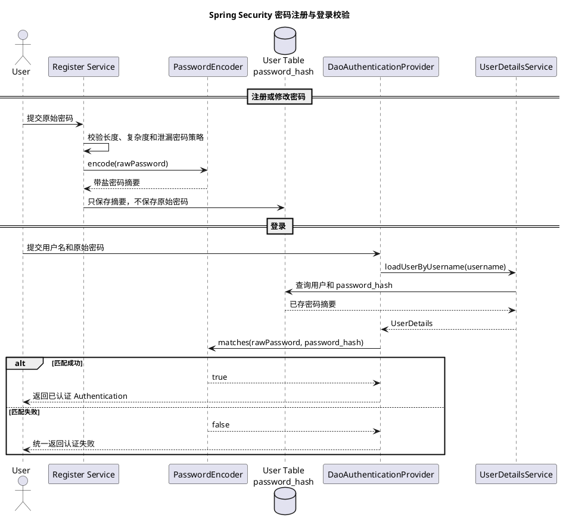
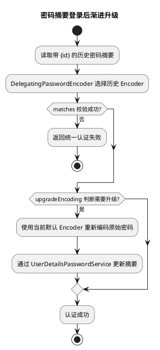
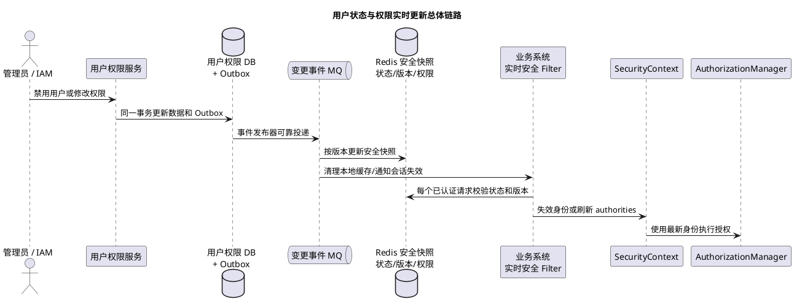
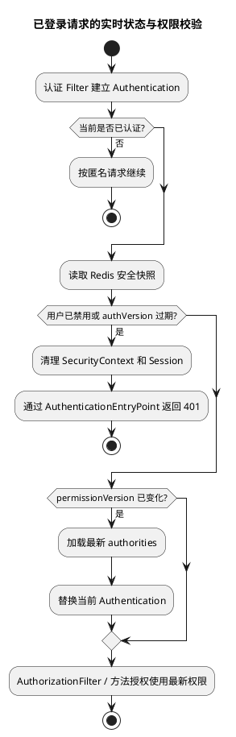
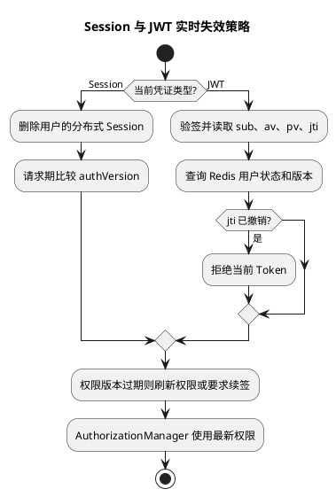

# Spring Security

## 问题索引

- Q1：说一下 Spring Security
- Q2：Spring Security 如何安全存储和校验用户密码？
- Q3：如何实现用户实时禁用和权限实时更新？
- Q4：说一下 JWT 和 OAuth 2.0，它们是什么关系？

## Q1：说一下 Spring Security

### 背景

Spring Security 是 Spring 体系中的安全框架，主要用于保护 Web 接口和方法调用。入门阶段先抓住三个问题：

- 认证 Authentication：当前用户是谁，提供的用户名密码或 Token 是否可信。
- 授权 Authorization：用户已经登录，但是否有权限访问当前资源。
- 安全防护：处理 CSRF、Session 安全、安全响应头等常见风险。

可以把它理解为应用入口处的一道安全检查：

~~~text
先确认身份
  -> 再检查权限
  -> 通过后进入业务代码
~~~

Spring Security 不负责用户、角色、菜单等业务表应该怎样设计，它提供的是安全执行框架。项目仍然需要根据业务实现用户查询、权限模型、登录接口和 Token 管理。

### Spring Security 工作在什么位置

在传统 Servlet Web 应用中，Spring Security 主要工作在 Servlet Filter 过滤器链中，位置早于 Spring MVC 的 DispatcherServlet 和 Controller。

~~~plantuml
@startuml
title Spring Security 入门主流程
actor "客户端" as Client
participant "SecurityFilterChain" as Chain
participant "认证处理" as Authentication
participant "SecurityContext" as Context
participant "授权判断" as Authorization
participant "Controller" as Controller

Client -> Chain : 携带用户名密码、Session 或 Token
Chain -> Authentication : 提取并校验身份
alt 认证成功
  Authentication -> Context : 保存当前用户
  Chain -> Authorization : 判断接口所需权限
  alt 有权限
    Authorization -> Controller : 放行请求
    Controller --> Client : 返回业务结果
  else 无权限
    Authorization --> Client : 403 Forbidden
  end
else 未登录或凭证无效
  Authentication --> Client : 401 Unauthorized
end
@enduml
~~~

入门阶段先记住这条主线即可：

~~~text
请求进入安全过滤链
  -> 获取登录凭证
  -> 校验用户身份
  -> 保存当前用户
  -> 判断访问权限
  -> 放行或返回 401/403
~~~

内部还有 FilterChainProxy、AuthenticationProvider 等组件，但可以等基础使用熟悉后再深入，不需要一开始就记完整调用链。

### 认证与授权的区别

| 概念 | 要回答的问题 | 常见例子 |
| --- | --- | --- |
| 认证 | 你是谁 | 用户名密码登录、短信验证码、JWT 校验 |
| 授权 | 你能做什么 | 是否能查询订单、退款、访问管理后台 |
| 角色 | 用户身份分组 | ADMIN、OPERATOR、USER |
| 权限 | 更细粒度的操作能力 | order:query、order:refund |

登录成功只表示认证通过，不代表用户可以访问所有接口。一个普通用户可以登录系统，但访问管理员接口时仍应返回 403。

### 入门阶段需要认识的组件

先知道职责，不必立即追源码：

| 组件 | 简单理解 |
| --- | --- |
| SecurityFilterChain | 定义哪些请求需要登录、哪些请求可以匿名访问 |
| Authentication | 表示一次认证请求或认证后的当前用户 |
| AuthenticationManager | 统一接收认证请求并完成校验 |
| UserDetailsService | 根据用户名加载用户信息 |
| PasswordEncoder | 对密码进行安全哈希和比对 |
| SecurityContext | 保存当前请求对应的登录用户 |
| AuthorizationManager | 判断当前用户能否访问目标资源 |
| AuthenticationEntryPoint | 未认证时返回 401 或跳转登录页 |
| AccessDeniedHandler | 已认证但权限不足时处理 403 |

这些组件最终围绕两件事协作：

~~~text
把请求中的凭证转换成可信用户
把可信用户和目标资源进行权限匹配
~~~

### 常见登录模式

#### Session 模式

Session 模式常用于传统后台系统：

1. 用户提交用户名和密码。
2. 服务器验证成功后保存登录状态。
3. 浏览器保存 Session ID。
4. 后续请求携带 Session ID，服务器恢复当前用户。

特点：

- 服务端保存会话状态。
- 强制下线、修改权限后失效相对容易处理。
- 集群环境需要共享 Session，或保证会话路由一致。

#### Token 或 JWT 模式

Token 模式常用于前后端分离和移动端：

1. 用户登录成功后获得 Token。
2. 客户端在后续请求中携带 Token。
3. 安全过滤器校验 Token。
4. 校验成功后建立本次请求的用户身份。
5. 请求结束后清理当前请求上下文。

特点：

- 请求通常不依赖服务器 Session。
- 集群扩展更直接。
- Token 一旦签发，实时禁用和权限变更需要额外设计版本号、黑名单或短有效期。

JWT 只是一种凭证格式，不等于完整的登录、续期、退出和权限更新方案。

### 一个基础配置示例

现代 Spring Security 通常通过 SecurityFilterChain Bean 声明访问规则：

~~~java
@Configuration
@EnableWebSecurity
public class SecurityConfiguration {

    @Bean
    SecurityFilterChain securityFilterChain(HttpSecurity http) throws Exception {
        return http
                .authorizeHttpRequests(authorize -> authorize
                        // 登录接口和公开资源允许匿名访问。
                        .requestMatchers("/login", "/public/**").permitAll()
                        // 管理接口要求当前用户具有 ADMIN 角色。
                        .requestMatchers("/admin/**").hasRole("ADMIN")
                        // 其他接口只要求已经完成认证。
                        .anyRequest().authenticated())
                // 示例使用表单登录；REST 项目可以替换为自定义 Token 认证。
                .formLogin(Customizer.withDefaults())
                .build();
    }
}
~~~

这段配置表达的是访问规则，不包含真实项目中的用户表查询、密码策略和统一 JSON 响应。生产项目还需要根据认证模式补充：

- UserDetailsService 或自定义认证服务。
- PasswordEncoder。
- 统一 401、403 响应。
- Session 或 Token 生命周期管理。
- 方法级权限。
- 登录日志、失败次数限制和风控策略。

### 401 与 403

这是最容易混淆的一组状态码：

| 状态码 | 含义 | 常见原因 |
| --- | --- | --- |
| 401 Unauthorized | 没有有效身份 | 未登录、Token 过期、签名错误 |
| 403 Forbidden | 身份有效但没有权限 | 普通用户访问管理员接口 |

可以简单记为：

~~~text
401：我还不知道你是谁
403：我知道你是谁，但你不能访问
~~~

安全异常通常发生在 Controller 之前，因此只配置 ControllerAdvice 不一定能处理所有 401、403。项目通常还需要配置 AuthenticationEntryPoint 和 AccessDeniedHandler。

### 入门阶段先知道的边界

- URL 权限控制接口入口，方法权限保护具体业务操作；初学时先掌握 URL 规则即可。
- CSRF 主要与浏览器自动携带 Cookie 有关，不能因为前后端分离就机械关闭。
- CORS 解决浏览器跨域访问，不等于登录认证或权限校验。
- Spring Security 提供认证授权框架，不会自动设计用户表、角色表、菜单和数据权限。
- JWT 只是一种凭证格式，续期、退出、撤销、用户禁用和权限实时更新仍需业务系统实现。

常见使用场景包括后台账号密码登录、前后端分离 Token 认证、角色权限控制、关键方法授权和统一 401/403 响应。

### 常见踩坑点

1. 把认证和授权混为一谈，认为登录成功就拥有全部权限。
2. 明文保存密码，或者使用普通 MD5 直接保存用户密码。
3. 把 401 和 403 返回反了。
4. Token 校验失败后仍继续执行过滤器链。
5. 只在前端隐藏按钮，没有在后端校验权限。
6. 只在 Controller 做权限判断，其他调用路径可能绕过限制。
7. 无条件关闭 CSRF 和 CORS 限制。
8. JWT 有效期过长，却没有退出、撤销和强制下线方案。
9. 用户被禁用后只修改数据库，旧 Session 或 Token 仍然有效。
10. 一开始就死记所有 Filter 和 Provider，反而没有理解认证与授权主线。

### 循序渐进的学习顺序

建议按以下顺序学习：

1. 先理解认证、授权、401、403。
2. 使用 SecurityFilterChain 配置公开接口和登录接口。
3. 学习 UserDetailsService 与 PasswordEncoder，完成用户名密码登录。
4. 理解 Session 如何保存登录状态。
5. 学习角色、权限和方法级授权。
6. 再实现 Token 或 JWT 认证。
7. 补充统一异常、退出登录、续期、禁用用户和权限更新。
8. 最后再深入 FilterChainProxy、AuthenticationProvider 和源码调用链。

每一步都应先完成一个可运行的小功能，再进入下一层原理。过滤器链和认证提供者的源码适合在已经能独立完成登录与权限控制后学习。

### 面试话术

> Spring Security 是 Spring 体系中的安全框架，主要解决认证、授权和常见 Web 安全防护问题。在 Servlet 应用中，它主要通过 Controller 之前的安全过滤器链处理请求。认证阶段从请求中获取用户名密码、Session 或 Token，校验通过后把当前用户放入 SecurityContext；授权阶段再根据角色或权限判断是否允许访问接口或方法。未认证通常返回 401，已经认证但权限不足返回 403。项目可以使用 Session 保存登录状态，也可以在每个请求中校验 Token。Spring Security 提供的是安全执行框架，用户表、角色权限模型、Token 生命周期和实时禁用策略仍需要结合业务实现。

### 高频追问

- Q：Spring Security 主要解决什么问题？
  A：主要解决用户认证、资源授权以及 CSRF、Session 安全等常见 Web 安全问题。

- Q：认证和授权有什么区别？
  A：认证确认当前用户是谁；授权判断这个用户是否有权访问目标资源。

- Q：为什么 Spring Security 能在 Controller 之前拦截请求？
  A：Servlet 应用中的安全逻辑主要位于 Filter 过滤器链，请求通过安全检查后才进入 DispatcherServlet 和 Controller。

- Q：Session 和 JWT 应该怎么选？
  A：传统后台和需要强会话控制的场景通常更适合 Session；分布式 API 可以使用 Token，但必须补充续期、退出、撤销和权限实时更新方案。

- Q：Spring Security 是否会自动设计用户表和权限表？
  A：不会。它提供认证授权框架和扩展点，具体用户、角色、权限和数据权限模型由业务系统设计。

- Q：为什么登录成功后还可能返回 403？
  A：登录只代表认证通过，访问具体资源还需要满足对应角色或权限。

### 复习清单

- [ ] 能用一句话说明 Spring Security 的作用。
- [ ] 能区分认证、授权、角色和权限。
- [ ] 能画出请求经过认证、上下文和授权的主流程。
- [ ] 能说出 SecurityFilterChain、Authentication、SecurityContext 的基本职责。
- [ ] 能区分 Session 模式和 Token 模式。
- [ ] 能正确解释 401 与 403。
- [ ] 能写出最基础的接口访问规则。
- [ ] 能说明 Spring Security 与业务权限系统的职责边界。
- [ ] 能按循序渐进的顺序继续学习密码、Session、权限和 Token。

### 参考资料

- [Spring Security 官方参考文档](https://docs.spring.io/spring-security/reference/index.html)
- [Spring Security Servlet 应用文档](https://docs.spring.io/spring-security/reference/servlet/index.html)

## Q2：Spring Security 如何安全存储和校验用户密码？

### 背景

日常说的“密码加密”通常并不准确。用户密码不应该使用能解密还原的 AES、RSA 等可逆加密保存，而应该使用专门的**单向密码哈希算法**：

```text
注册：原始密码 -> PasswordEncoder.encode -> 密码摘要 -> 数据库
登录：原始密码 + 数据库摘要 -> PasswordEncoder.matches -> true/false
```

数据库泄漏后，攻击者不能直接把摘要解密成原始密码，只能不断猜测候选密码并计算摘要。密码哈希算法通过随机盐和较高计算成本，提高离线暴力破解成本。

需要明确：哈希不能让弱密码变安全。`123456` 即使使用 BCrypt 保存，仍然容易被字典攻击，因此还要配合密码强度校验、登录限流、失败锁定和多因素认证。

### 加密、普通哈希与密码哈希

| 类型 | 是否可逆 | 典型用途 | 是否适合保存密码 |
| --- | --- | --- | --- |
| AES 等对称加密 | 可逆，需要密钥 | 保存必须还原的敏感数据 | 不适合，密钥泄漏即可批量还原 |
| SHA-256、MD5 等普通哈希 | 不可逆但计算极快 | 文件完整性、签名摘要 | 不适合，容易被 GPU 高速穷举 |
| BCrypt、PBKDF2、SCrypt、Argon2 | 不可逆且可调计算成本 | 密码存储 | 适合 |

密码哈希有三个关键特征：

1. **单向性**：只能校验候选密码，不能解密原密码。
2. **随机盐**：相同密码多次编码会产生不同摘要，避免彩虹表和相同密码特征暴露。
3. **自适应成本**：可以提高 CPU 或内存成本，跟随硬件性能演进。

### `PasswordEncoder` 核心接口

Spring Security 通过 `PasswordEncoder` 屏蔽具体算法：

```java
public interface PasswordEncoder {

    // 注册、修改密码时调用，把原始密码编码成可以持久化的摘要。
    String encode(CharSequence rawPassword);

    // 登录时调用，由实现读取摘要中的盐和参数后校验候选密码。
    boolean matches(CharSequence rawPassword, String encodedPassword);

    // 判断已有摘要参数是否过旧，成功登录后可以触发渐进升级。
    default boolean upgradeEncoding(String encodedPassword) {
        return false;
    }
}
```

`PasswordEncoder` 不提供 `decode` 方法，因为密码摘要的设计目标就是不可逆。

登录时不能这样比较：

```java
// 错误：随机盐会让同一个原始密码每次 encode 的结果不同。
boolean passed = passwordEncoder.encode(rawPassword).equals(encodedPassword);
```

必须使用：

```java
// 正确：matches 会从已有摘要中读取盐、成本参数和算法信息完成校验。
boolean passed = passwordEncoder.matches(rawPassword, encodedPassword);
```

### BCrypt 的工作方式

`BCryptPasswordEncoder` 是常见实现。它会在每次 `encode` 时生成随机盐，并把算法版本、成本因子、盐和哈希结果编码在最终字符串中。

示意格式：

```text
$2a$10$.....................................................
 |   |
 |   +-- strength/cost
 +------ BCrypt version
```

因此同一个密码编码两次通常不同：

```java
PasswordEncoder encoder = new BCryptPasswordEncoder();

String first = encoder.encode("Correct-Horse-2026");
String second = encoder.encode("Correct-Horse-2026");

// 随机盐不同，所以两个摘要通常不相等。
System.out.println(first.equals(second)); // false

// 两个摘要都能分别校验同一个原始密码。
System.out.println(encoder.matches("Correct-Horse-2026", first));  // true
System.out.println(encoder.matches("Correct-Horse-2026", second)); // true
```

不需要单独在用户表中增加 `salt` 字段，BCrypt 摘要本身已经包含校验需要的盐。额外增加一个公开盐字段通常没有安全收益。

`strength` 越高，单次校验越慢。它需要结合生产机器、并发登录量和认证接口延迟进行基准测试，不能为了“更安全”直接设置极高参数，否则可能把登录接口变成 CPU 拒绝服务入口。

### `DelegatingPasswordEncoder`

生产系统更推荐使用 `DelegatingPasswordEncoder`，它通过摘要前缀标识算法：

```text
{id}encodedPassword
```

例如：

```text
{bcrypt}$2a$10$...
{pbkdf2}...
{argon2}...
```

它的价值是**编码使用当前算法，校验兼容历史算法**：

```text
encode(rawPassword)
  -> 使用当前 id 对应的 PasswordEncoder
  -> 结果带上 {id} 前缀

matches(rawPassword, storedPassword)
  -> 读取 {id}
  -> 找到对应 PasswordEncoder
  -> 委托其完成校验
```

推荐配置：

```java
@Bean
PasswordEncoder passwordEncoder() {
    // 工厂返回 DelegatingPasswordEncoder。
    // 新密码使用当前推荐算法编码，旧摘要可以根据 {id} 选择兼容算法校验。
    return PasswordEncoderFactories.createDelegatingPasswordEncoder();
}
```

如果直接声明：

```java
@Bean
PasswordEncoder passwordEncoder() {
    // 直接使用 BCrypt 时，数据库通常只保存 $2a$...，没有 {bcrypt} 前缀。
    return new BCryptPasswordEncoder();
}
```

两种方式都能工作，但摘要格式不同。项目必须保持“编码方式、数据库格式、登录校验使用的 Encoder”一致。

### 注册与登录校验流程



注册服务示例：

```java
@Service
public class UserRegistrationService {

    private final PasswordEncoder passwordEncoder;
    private final UserRepository userRepository;

    public UserRegistrationService(PasswordEncoder passwordEncoder,
                                   UserRepository userRepository) {
        this.passwordEncoder = passwordEncoder;
        this.userRepository = userRepository;
    }

    @Transactional
    public Long register(RegisterCommand command) {
        // 原始密码只能在当前调用链短暂存在，禁止写日志、消息或审计扩展字段。
        validatePasswordPolicy(command.password());

        String passwordHash = passwordEncoder.encode(command.password());

        UserEntity user = new UserEntity();
        user.setUsername(command.username());
        // 数据库只持久化 PasswordEncoder 输出的完整字符串。
        user.setPasswordHash(passwordHash);
        userRepository.save(user);
        return user.getId();
    }
}
```

使用 `DaoAuthenticationProvider` 时，通常不需要在 Controller 中手写 `matches`。Provider 会读取 `UserDetails#getPassword()` 返回的摘要，并调用配置的 `PasswordEncoder` 完成校验。

### 数据库字段设计

用户表建议使用语义清晰的字段名：

```sql
CREATE TABLE sys_user (
    id BIGINT NOT NULL,
    username VARCHAR(64) NOT NULL,
    password_hash VARCHAR(255) NOT NULL COMMENT 'PasswordEncoder 输出的完整摘要',
    password_changed_at DATETIME NULL,
    password_version INT NOT NULL DEFAULT 1 COMMENT '用于强制旧令牌或会话失效',
    status VARCHAR(16) NOT NULL,
    PRIMARY KEY (id),
    UNIQUE KEY uk_username (username)
);
```

字段长度不要只按某一种 BCrypt 输出长度设计。保留 `VARCHAR(255)` 可以兼容 `{id}` 前缀以及后续切换 PBKDF2、SCrypt、Argon2 等更长摘要。

不能存储：

- 原始密码。
- 可逆加密后的原始密码和解密密钥。
- 密码提示中可推断原密码的内容。
- 包含密码的注册请求日志、MQ 消息、异常信息。

### 密码算法如何选择

| 算法 | 特点 | 典型考虑 |
| --- | --- | --- |
| BCrypt | 成熟、使用广泛、参数简单 | 通用业务系统常见选择，注意算法输入长度约束 |
| PBKDF2 | 基于标准密码学原语，兼容性好 | 有特定合规或运行环境要求时考虑 |
| SCrypt | 同时增加 CPU 和内存成本 | 希望提高 GPU/ASIC 并行破解成本 |
| Argon2 | 现代内存困难算法，可调参数丰富 | 新系统可评估，需压测依赖与资源成本 |

选择原则：

1. 优先使用 Spring Security 已提供、维护成熟的 PasswordEncoder。
2. 根据认证节点硬件做基准测试，保证单次校验足够慢但业务可接受。
3. 限制认证接口并发和失败频率，避免昂贵哈希被用于 CPU 消耗攻击。
4. 预留算法升级能力，不把系统永久绑定到一个固定摘要格式。
5. 不自创“MD5 多轮 + 固定盐”一类密码算法。

### 密码摘要渐进升级

随着硬件性能提升，旧算法或旧成本参数会变弱。常见迁移方式是“登录成功后渐进升级”：

```text
用户提交原始密码
  -> 旧 Encoder 校验成功
  -> PasswordEncoder.upgradeEncoding(oldHash) == true
  -> 使用当前 Encoder 重新 encode 原始密码
  -> 更新数据库摘要
  -> 本次登录继续成功
```



Spring Security 可以结合 `UserDetailsPasswordService` 在认证成功后更新密码摘要。迁移时要保证：

- 只有原始密码校验成功后才能升级。
- 更新失败不能把用户密码改成未知状态，应记录监控并允许后续重试。
- 多节点并发登录要使用条件更新或版本控制，避免旧摘要覆盖新摘要。
- 对长期不登录用户，可在高风险算法淘汰时要求强制重置密码。

### 常见异常：找不到 PasswordEncoder ID

典型错误：

```text
There is no PasswordEncoder mapped for the id "null"
```

常见原因是当前配置使用 `DelegatingPasswordEncoder`，但数据库里保存的是没有 `{id}` 前缀的旧摘要：

```text
数据库：$2a$10$...
期望：  {bcrypt}$2a$10$...
```

处理方式：

1. 确认旧数据实际使用的算法，不能仅凭长度猜测。
2. 如果确定全部是 BCrypt，可通过受控数据迁移补充 `{bcrypt}` 前缀。
3. 也可以在迁移阶段显式使用与旧格式一致的 Encoder，登录成功后再升级到带前缀格式。
4. 不要为了消除异常把未知格式一律映射成 `{noop}`，否则可能把明文密码当作合法摘要。

### `NoOpPasswordEncoder` 为什么不能用于生产

`{noop}` 或 `NoOpPasswordEncoder` 本质上是不做哈希，数据库保存的就是原始密码。它只适合极少量本地演示或兼容测试，不能用于生产用户数据。

即便是初始化管理员账号，也应该提前用正式 `PasswordEncoder` 生成摘要，并通过 Secret 管理、部署初始化脚本或受控改密流程写入，不能在配置文件中保存明文密码。

### 工程安全措施

密码摘要只是账号安全的一层，还应组合以下措施：

- 对登录接口按账号、IP、设备做限流和失败退避。
- 连续失败后短期锁定或触发验证码，避免无限在线猜测。
- 用户不存在和密码错误返回相同对外提示，降低账号枚举风险。
- 原始密码、Authorization Header、Session ID 禁止写入日志。
- 修改密码前校验旧密码或高强度二次认证。
- 修改密码后增加 `password_version`，使旧 JWT、Remember-Me Token 或会话失效。
- 管理员重置密码时使用一次性临时凭证，并要求首次登录改密。
- 监控异常登录地域、撞库特征和同一密码字典的批量尝试。
- MFA 的种子密钥是需要恢复使用的秘密，应加密保存，不能和密码摘要使用同一种存储思路。

### 踩坑点

1. 登录时再次 `encode` 后用字符串相等比较，忽略随机盐。
2. 注册使用 BCrypt，登录却使用 `DelegatingPasswordEncoder`，数据库摘要又没有 `{bcrypt}` 前缀。
3. 数据库字段太短，密码摘要被截断，导致所有密码都无法匹配。
4. 使用 MD5、SHA-1、SHA-256 或固定盐保存密码，离线破解成本过低。
5. 把密码摘要打印到普通业务日志。摘要虽不可逆，泄漏后仍可被离线猜测。
6. 直接把成本参数调到很高，没有评估登录峰值和 CPU 容量。
7. 不限制超长密码输入，使昂贵哈希放大接口资源消耗。
8. 修改密码后不清理旧 Session、Token 和 Remember-Me 状态。
9. 自己实现 PasswordEncoder 或自创摘要拼接规则，导致算法和迁移不可维护。
10. 忘记让 `UserDetails#getPassword()` 返回数据库中的完整摘要，导致 Provider 永远校验失败。

### 面试话术

> Spring Security 的密码存储不是可逆加密，而是通过 `PasswordEncoder` 做带随机盐、可调成本的单向密码哈希。注册时调用 `encode(rawPassword)`，只把完整摘要保存到数据库；登录时 `DaoAuthenticationProvider` 通过 `UserDetailsService` 加载摘要，再调用 `matches(rawPassword, encodedPassword)` 校验，不能重新 encode 后比较字符串，因为 BCrypt 每次会生成不同随机盐。生产系统可以使用 `PasswordEncoderFactories.createDelegatingPasswordEncoder()` 创建 `DelegatingPasswordEncoder`，摘要以 `{bcrypt}` 等 id 开头，这样新密码使用当前算法，旧密码仍可按 id 选择历史 Encoder 校验。算法或成本参数升级时，可以在登录成功后通过 `upgradeEncoding` 和 `UserDetailsPasswordService` 渐进重哈希。数据库字段要保存完整摘要并预留长度，同时还要配合登录限流、失败锁定、日志脱敏和改密后令牌失效。

### 高频追问

- Q：为什么同一个密码两次 BCrypt 结果不一样，仍然能验证成功？
  A：每次编码都会生成随机盐，盐包含在摘要中。`matches` 会从已有摘要读取盐和成本参数，再用候选密码计算并比较。

- Q：`PasswordEncoder` 是加密器吗？
  A：名称沿用 Encoder，但它的主流实现用于单向密码哈希，不提供解密能力。密码不应使用可逆加密保存。

- Q：登录时为什么不能重新 `encode` 后比较？
  A：随机盐会让每次编码结果不同。必须调用 `matches(rawPassword, encodedPassword)`，让 Encoder 使用已有摘要中的盐进行校验。

- Q：`{bcrypt}` 前缀是不是盐？
  A：不是。它是 `DelegatingPasswordEncoder` 用来选择算法实现的 id；BCrypt 自己的盐位于后面的 BCrypt 摘要中。

- Q：数据库泄漏后 BCrypt 密码是否绝对安全？
  A：不是。攻击者仍可离线猜测，只是每次猜测成本更高。弱密码依旧容易被字典命中，因此还需要密码策略、泄漏密码检查和 MFA。

- Q：项目从 BCrypt 切换到 Argon2，需要所有用户立即改密码吗？
  A：通常不需要。可以用 `{id}` 兼容旧 BCrypt 摘要，用户登录成功时用当前 Argon2 Encoder 重新编码并更新；长期不登录用户再走强制重置。

### 复习清单

- [ ] 能区分可逆加密、普通快速哈希和自适应密码哈希。
- [ ] 能说明 `encode`、`matches`、`upgradeEncoding` 的职责。
- [ ] 能解释 BCrypt 随机盐为什么导致相同密码摘要不同。
- [ ] 能区分直接 `BCryptPasswordEncoder` 和 `DelegatingPasswordEncoder` 的数据库格式。
- [ ] 能排查 `There is no PasswordEncoder mapped for id "null"`。
- [ ] 能设计注册、登录、改密和密码重置流程。
- [ ] 能说明如何通过 `{id}` 与登录后重哈希完成算法迁移。
- [ ] 能给出数据库字段长度、日志脱敏、登录限流和令牌失效建议。

### 参考资料

- [Spring Security Password Storage](https://docs.spring.io/spring-security/reference/features/authentication/password-storage.html)

## Q3：如何实现用户实时禁用和权限实时更新？

### 背景

用户登录成功后，`Authentication` 通常会被保存在 Session，或者被编码进 JWT。此后即使数据库中的用户状态和权限发生变化，旧登录态仍可能继续使用：

```text
用户被管理员禁用
  -> 旧 Session 仍包含 authenticated=true 的 Authentication
  -> 旧 JWT 在 exp 之前仍然可以离线验签

角色权限被回收
  -> Session/JWT 中仍包含旧 authorities
  -> 用户继续访问已经被撤销的接口
```

因此，登录时查询一次用户状态和权限只能保证“登录那一刻正确”，不能保证后续请求实时正确。

工程上的“实时”通常定义为：**状态或权限变更提交后，从下一个请求的认证或授权边界开始生效**。已经进入业务事务并执行中的请求通常不能被可靠撤回，高风险操作可以在提交前增加一次状态或权限复核。

### 总体方案



核心原则：

1. DB 是用户状态和权限的事实源。
2. DB 变更和 Outbox 事件在同一个本地事务提交，避免数据已改但通知丢失。
3. Redis 保存请求期可快速读取的安全快照。
4. 每个已认证请求在授权前检查状态和安全版本。
5. Session 主动删除，JWT 通过版本、黑名单或在线校验增加撤销能力。
6. 事件消费者按单调递增版本幂等处理，旧事件不能覆盖新状态。

### 状态与版本模型

推荐至少维护以下字段：

```sql
ALTER TABLE sys_user
    ADD COLUMN enabled TINYINT NOT NULL DEFAULT 1 COMMENT '1 启用，0 禁用',
    ADD COLUMN auth_version BIGINT NOT NULL DEFAULT 1 COMMENT '身份和会话失效版本',
    ADD COLUMN permission_version BIGINT NOT NULL DEFAULT 1 COMMENT '权限快照版本';
```

字段职责：

| 字段 | 何时递增 | 作用 |
| --- | --- | --- |
| `enabled` | 启用或禁用用户时变更 | 决定账号是否允许继续认证 |
| `auth_version` | 禁用、改密、强制下线、重大安全事件 | 让旧 Session、JWT、Remember-Me 凭证整体失效 |
| `permission_version` | 用户角色、权限、数据范围变化 | 判断当前 `authorities` 是否过期 |
| `role_policy_version` | 某角色的权限集合变化 | 避免给大量角色成员逐个更新版本 |
| `jti` 撤销记录 | 只撤销某一个 Token | 精确失效单个 JWT，TTL 不超过 Token 剩余时间 |

Redis 安全快照示例：

```text
security:user:{userId}
  enabled = 0/1
  authVersion = 12
  permissionVersion = 35
  authorities = [order:read, order:create]
  updatedAt = 2026-07-21T10:30:00

security:role:{roleId}:policyVersion = 8
security:revoked:jti:{jti} = 1  TTL=Token 剩余有效期
```

禁用后再次启用用户时也应保持 `auth_version` 已递增，不能让禁用前签发的旧 Token 或旧 Session 重新恢复有效。用户应重新登录建立新身份。

### 用户禁用的变更链路

管理员禁用用户时，推荐在一个 DB 本地事务中完成：

```text
1. UPDATE sys_user SET enabled=0, auth_version=auth_version+1
2. 写入 USER_DISABLED Outbox 事件，携带 userId 和新 authVersion
3. 提交事务
```

事件发布后，各系统执行：

```text
1. Redis 安全快照更新 enabled=false、authVersion=newVersion
2. 删除该用户所有 Spring Session
3. 清理各节点本地权限缓存
4. 根据需要写入 Token 撤销或设备会话记录
5. 发布审计和下线通知
```

事件必须带版本号。消费者只接受 `eventVersion > currentVersion` 的事件，避免 MQ 乱序导致“先禁用、后被旧启用事件覆盖”。

### 请求期实时校验流程

实时检查应位于认证 Filter 之后、`AuthorizationFilter` 之前。这样能够先获得 `Authentication`，再用最新状态刷新或拒绝身份，最后进入授权判断。



建议把“身份已失效”和“权限不足”区分处理：

- 用户禁用、改密后旧凭证失效、Token 被撤销：当前认证不再可信，返回 401。
- 用户身份仍有效，但访问的权限已经被撤销：使用新权限进入授权判断，最终返回 403。

### 实时校验 Filter 示例

下面示例展示核心结构，`SecurityIdentityExtractor` 负责兼容 Session Principal 和 JWT Claims，`SecuritySnapshotStore` 从 Redis 获取用户安全快照。

```java
public record SecuritySnapshot(
        boolean enabled,
        long authVersion,
        long permissionVersion,
        Collection<? extends GrantedAuthority> authorities) {
}

public record SecurityIdentity(
        Long userId,
        long authVersion,
        long permissionVersion) {
}

public final class RealtimeSecurityStateFilter extends OncePerRequestFilter {

    private final SecurityIdentityExtractor identityExtractor;
    private final SecuritySnapshotStore snapshotStore;
    private final SecurityContextRepository contextRepository;
    private final AuthenticationEntryPoint authenticationEntryPoint;

    public RealtimeSecurityStateFilter(
            SecurityIdentityExtractor identityExtractor,
            SecuritySnapshotStore snapshotStore,
            SecurityContextRepository contextRepository,
            AuthenticationEntryPoint authenticationEntryPoint) {
        this.identityExtractor = identityExtractor;
        this.snapshotStore = snapshotStore;
        this.contextRepository = contextRepository;
        this.authenticationEntryPoint = authenticationEntryPoint;
    }

    @Override
    protected void doFilterInternal(HttpServletRequest request,
                                    HttpServletResponse response,
                                    FilterChain filterChain)
            throws ServletException, IOException {
        SecurityContext context = SecurityContextHolder.getContext();
        Authentication current = context.getAuthentication();

        // 匿名请求交给后续 AuthorizationFilter 处理，不做用户快照查询。
        if (current == null || !current.isAuthenticated()
                || current instanceof AnonymousAuthenticationToken) {
            filterChain.doFilter(request, response);
            return;
        }

        SecurityIdentity identity = identityExtractor.extract(current);
        SecuritySnapshot snapshot = snapshotStore.getRequired(identity.userId());

        if (!snapshot.enabled()
                || identity.authVersion() != snapshot.authVersion()) {
            // 禁用、改密或强制下线后，旧身份不再可信。
            SecurityContextHolder.clearContext();
            contextRepository.saveContext(
                    SecurityContextHolder.createEmptyContext(), request, response);
            authenticationEntryPoint.commence(
                    request,
                    response,
                    new CredentialsExpiredException("security identity expired"));
            return;
        }

        if (identity.permissionVersion() != snapshot.permissionVersion()) {
            // Session Principal 还要同步新版本，避免后续请求反复判断为过期。
            // JWT 不可变时可以保留原 Principal，并选择每请求加载或要求客户端刷新 Token。
            Object refreshedPrincipal = identityExtractor.refreshPermissionVersion(
                    current.getPrincipal(), snapshot.permissionVersion());

            UsernamePasswordAuthenticationToken refreshed =
                    UsernamePasswordAuthenticationToken.authenticated(
                            refreshedPrincipal, null, snapshot.authorities());
            refreshed.setDetails(current.getDetails());
            context.setAuthentication(refreshed);

            // Session 模式需要保存更新后的上下文；无状态模式可使用不持久化的 Repository。
            contextRepository.saveContext(context, request, response);
        }

        filterChain.doFilter(request, response);
    }
}
```

过滤器位置：

```java
@Bean
SecurityFilterChain securityFilterChain(
        HttpSecurity http,
        RealtimeSecurityStateFilter realtimeSecurityStateFilter) throws Exception {
    http
        .authorizeHttpRequests(authorize -> authorize
            .anyRequest().authenticated()
        )
        // AuthorizationFilter 接管 URL 授权前，先校验用户状态并刷新权限。
        .addFilterBefore(realtimeSecurityStateFilter, AuthorizationFilter.class);

    return http.build();
}
```

生产实现还要处理：

- Redis 查询超时和降级策略。
- 快照不存在时回源 DB、重建缓存或失败关闭。
- 自定义认证 Token 类型，不能假设所有认证结果都是用户名密码 Token。
- 权限刷新后 Principal 中版本号如何同步，避免同一 Session 每次请求都重复刷新。
- 并发请求同时刷新 Session 时的版本和幂等问题。

更稳妥的做法是让自定义 Principal 保存可更新版本，或把 `permissionVersion` 单独放入 Session 属性；刷新成功后同时更新该版本。

### Session 模式如何实时失效

Session 模式有两层处理：

1. 主动删除该用户已有 Session，减少继续访问窗口。
2. 每个请求仍检查 `enabled/authVersion`，防止删除通知延迟或遗漏。

使用 Spring Session 时，可以按 Principal 索引查找并删除分布式 Session：

```java
@Service
public class UserSessionInvalidationService {

    private final FindByIndexNameSessionRepository<? extends Session> sessions;

    public UserSessionInvalidationService(
            FindByIndexNameSessionRepository<? extends Session> sessions) {
        this.sessions = sessions;
    }

    public void invalidateAll(String principalName) {
        Map<String, ? extends Session> userSessions =
                sessions.findByPrincipalName(principalName);

        for (String sessionId : userSessions.keySet()) {
            // deleteById 应具备幂等性，重复消费禁用事件不会产生额外副作用。
            sessions.deleteById(sessionId);
        }
    }
}
```

注意：

- 内存 `SessionRegistry` 只能看到当前节点，集群环境不能单独依赖它。
- Spring Session 需要正确建立 Principal 索引，否则无法按用户查询会话。
- 删除 Session 不能终止已经进入 Controller 的请求，所以高风险操作仍可二次检查。
- 仅删除 Session 但不增加 `auth_version`，可能让其他未被找到的会话继续有效。

### JWT 模式如何实时失效

纯离线 JWT 的特点是：资源服务器只验证签名和声明，不查询认证中心。只要 JWT 未过期且签名有效，数据库用户状态变化不会自动影响它。

要实现实时禁用，必须主动引入一部分在线状态：



JWT 建议携带：

```json
{
  "sub": "10001",
  "av": 12,
  "pv": 35,
  "jti": "01J...",
  "iat": 1784600000,
  "exp": 1784600900
}
```

请求校验：

```text
Token.av != Redis.authVersion
  -> 用户已禁用、改密或被强制下线
  -> 返回 401

Token.pv != Redis.permissionVersion
  -> Token 内权限已过期
  -> 在线加载最新权限，或要求刷新/重新签发 Token

Redis 存在 revoked:jti
  -> 当前 Token 被精确撤销
  -> 返回 401
```

方案取舍：

| 方案 | 实时性 | 请求成本 | 适用 |
| --- | --- | --- | --- |
| 仅缩短 JWT TTL | 非实时，最长等待一个 TTL | 最低 | 风险较低、允许短窗口 |
| 每请求检查用户版本 | 接近实时 | 每请求一次缓存读取 | 需要立即禁用和权限回收 |
| `jti` 黑名单 | 精确实时撤销单 Token | 每请求检查撤销集合 | 设备下线、单 Token 泄漏 |
| 不透明 Token + Introspection | 实时 | 每请求远程或缓存校验 | 认证中心可承接在线校验 |
| 网关集中校验 | 统一且接近实时 | 网关增加查询和可用性压力 | 多服务统一入口 |

如果 JWT 中存了完整权限集合，权限实时更新通常只能选择：

1. 发现 `permissionVersion` 过期后拒绝旧 Token，要求客户端刷新 Token。
2. 不再信任 JWT 内权限，只使用 `sub` 识别用户，并在线读取最新权限。

第二种实时性更强，但 JWT 就不再是完全无状态。系统需要在“完全离线”和“实时撤销”之间做取舍，两者不能同时无成本获得。

### 权限实时更新的两种方式

#### 方式一：刷新 `Authentication`

请求发现 `permissionVersion` 变化后，读取最新 Authority 并替换 `SecurityContext` 中的 `Authentication`。后续 `AuthorizationFilter`、`@PreAuthorize` 和业务代码都会读取新权限。

适合：

- 已有系统大量使用 `hasAuthority`、`@PreAuthorize`。
- 权限集合规模可控。
- 希望尽量沿用 Spring Security 默认授权模型。

风险：Session 中的 Principal、Authority 和版本必须一起更新，不能只换 Authority 而让版本一直停留在旧值。

#### 方式二：动态 `AuthorizationManager`

Token 或 Session 只表达用户身份，`AuthorizationManager` 每次根据用户、请求资源和最新权限策略做决策。

适合：

- 多租户、组织树、数据范围等动态权限。
- 权限变化频繁，无法接受 Token 中 Authority 长时间过期。
- 需要在 URL、方法参数或资源归属上做 ABAC 判断。

这种方式不要每次直接查 DB。应使用 Redis 权限快照、本地短缓存和事件失效，同时为高风险权限设计失败关闭策略。

### 角色权限批量变更

修改一个角色可能影响几十万用户。逐个递增所有用户的 `permission_version` 会造成写放大。

可以采用分层版本：

```text
用户直接权限变化 -> user.permissionVersion++
角色权限变化     -> role.policyVersion++
租户全局策略变化 -> tenant.policyVersion++
平台安全策略变化 -> global.policyVersion++
```

请求期权限快照记录它构建时依赖的版本：

```text
userVersion=35
roleVersions={ADMIN:8, AUDITOR:3}
tenantVersion=12
globalVersion=5
```

任一版本不一致，就把该用户权限快照标记为过期并重新计算。这样角色权限变更只更新角色版本，不需要同步更新所有用户记录。

### 缓存与实时性的取舍

严格每请求查 Redis 能获得更好的实时性，但会把 Redis 变成所有请求的关键依赖。常见分级策略：

| 数据 | 建议策略 |
| --- | --- |
| 用户禁用、强制下线 | 每请求查 Redis 或网关统一查；高风险系统失败关闭 |
| 关键权限撤销 | 每请求版本校验，缓存只做极短 TTL 并支持事件主动失效 |
| 普通菜单和展示权限 | 本地缓存 + 事件失效 + 较短 TTL |
| 数据权限 | 在 Service/查询边界按最新策略判断，不能只依赖前端菜单 |

Redis 故障时要提前定义：

- **Fail Closed**：无法确认状态就拒绝访问，适合支付、管理后台、高风险操作。
- **Fail Open**：短时间使用最近一次可信快照，适合低风险只读场景，但要限制时间并告警。
- **分级处理**：普通查询短时使用本地缓存，敏感操作必须在线确认。

不能在 Redis 故障时直接默认用户启用并授予旧权限。

### 事件一致性与补偿

只发普通 MQ 消息可能出现：DB 用户已禁用，但应用在发送事件前宕机，导致其他系统永远不知道变化。

推荐：

```text
DB 事务：更新用户/权限 + 写 Outbox
  -> 事件发布器扫描 Outbox 并发送 MQ
  -> 消费者按 version 幂等更新 Redis
  -> 清理 Session 和本地缓存
  -> Outbox 标记已投递
  -> 定时任务重试和对账
```

需要对账：

- DB `enabled/auth_version` 与 Redis 安全快照是否一致。
- 权限版本变化后是否仍有旧版本快照长期存在。
- 禁用事件是否已被所有目标系统消费。
- Session 删除失败是否进入重试队列。
- Token 黑名单 TTL 是否与 Token 剩余有效期一致。

### 并发边界

实时禁用仍存在不可消除的并发窗口：

```text
T1 请求通过状态检查
T2 管理员禁用用户并提交
T3 T1 请求继续执行并提交业务事务
```

对于转账、退款、修改权限等高风险操作，应在真正提交前再次校验用户状态和关键权限，或者把用户安全版本作为业务操作的条件：

```sql
-- 高风险操作提交前确认用户仍处于预期安全版本。
SELECT enabled, auth_version
FROM sys_user
WHERE id = ?;
```

不需要给所有普通查询都做 DB 二次检查，只在高风险写操作边界使用。

### 常见踩坑点

1. 只在登录时查询用户状态，登录后的禁用永远不生效。
2. 删除当前节点的 `SessionRegistry`，误以为集群所有 Session 都已删除。
3. 使用长效离线 JWT，却承诺用户禁用后立即失效。
4. 只更新 Redis 权限但不更新 `SecurityContext`，`@PreAuthorize` 仍读取旧 Authority。
5. 权限版本变化后每个请求都重复刷新，因为没有同步更新 Session 中的版本。
6. 角色权限变化时逐个更新百万用户，造成数据库和 MQ 写放大。
7. DB 更新成功但变更事件丢失，没有 Outbox、重试和对账。
8. MQ 事件乱序，旧的“启用”事件覆盖新的“禁用”状态。
9. Redis 故障时无条件放行旧权限，高风险接口失去撤销能力。
10. 用户重新启用后复用禁用前 Session 或 JWT，没有保持 `auth_version` 单调递增。
11. JWT 黑名单永久保存不清理，撤销集合无限膨胀。
12. 只控制前端菜单，不在后端 URL、方法或数据访问边界做授权。

### 面试话术

> Spring Security 默认把认证结果放在 Session 或 JWT 中，所以只在登录时加载用户状态和权限无法做到实时更新。我的方案是 DB 维护 `enabled、authVersion、permissionVersion`，用户禁用、改密或强制下线时递增 authVersion，权限变化时递增 permissionVersion，并在同一事务写 Outbox。事件通过 MQ 更新 Redis 安全快照、删除 Spring Session、清理本地缓存。每个已认证请求在 `AuthorizationFilter` 之前用自定义 Filter 检查 Redis：用户禁用或凭证 authVersion 过旧就清理 SecurityContext 并返回 401；权限版本变化则加载最新 Authority 替换 Authentication，再让 URL 授权和 `@PreAuthorize` 使用新权限。JWT 如果完全离线验签就无法实时撤销，因此要引入用户版本校验、jti 黑名单、短 TTL 或 Introspection。角色权限批量变化时使用角色策略版本，避免逐个更新大量用户。对于支付、退款等高风险操作，还会在事务提交前再次检查用户安全状态，处理请求通过校验后又被并发禁用的窗口。

### 高频追问

- Q：删除 Redis 中的 Session 是否就能保证用户立即下线？
  A：不能完全保证。已进入业务链路的请求不会被撤回，删除通知也可能延迟或遗漏。还要递增 authVersion，并在每个请求和高风险提交边界检查状态。

- Q：JWT 能不能做到完全无状态又立即撤销？
  A：不能。完全离线 JWT 在过期前只依据签名和声明有效。立即撤销必须增加黑名单、版本查询、Introspection 等在线状态，或者接受短 TTL 的失效窗口。

- Q：权限变化后应该返回 401 还是 403？
  A：用户禁用、改密或凭证版本过期表示认证已失效，返回 401；身份仍有效但最新权限不允许访问，返回 403。

- Q：为什么不在每次请求中直接查询数据库？
  A：会把所有业务流量压到用户权限库，造成连接池和数据库瓶颈。通常 DB 做事实源，Redis 做请求期安全快照，并通过事件和版本保证更新。

- Q：一个角色影响几十万用户，怎么实时更新？
  A：递增角色策略版本并使依赖该角色的权限快照失效，不逐个更新所有用户；用户下一次请求发现角色版本变化后重新计算权限。

- Q：权限刷新为什么可以影响 `@PreAuthorize`？
  A：方法授权从当前 `SecurityContextHolder` 获取 Authentication。只要在调用方法前替换成包含最新 Authority 的 Authentication，后续方法授权就会基于新权限决策。

### 复习清单

- [ ] 能解释为什么登录时加载一次用户状态不能实现实时禁用。
- [ ] 能区分 `authVersion`、`permissionVersion`、角色策略版本和 `jti` 黑名单。
- [ ] 能设计 DB + Outbox + MQ + Redis 安全快照的变更链路。
- [ ] 能把实时安全 Filter 放在认证 Filter 之后、`AuthorizationFilter` 之前。
- [ ] 能说明 Session 主动删除与请求期版本校验为什么要同时存在。
- [ ] 能说明纯离线 JWT 无法立即撤销以及各种补偿方案的取舍。
- [ ] 能通过刷新 Authentication 或动态 AuthorizationManager 实现权限实时更新。
- [ ] 能处理角色权限批量变化造成的写放大问题。
- [ ] 能设计 Redis 故障时按风险等级 Fail Closed 或短时使用可信快照。
- [ ] 能说明已通过校验的在途请求为什么还需要高风险操作二次确认。
- [ ] 能设计事件乱序、重复消费、缓存遗漏的幂等和对账机制。

### 参考资料

- [Spring Security Servlet Architecture](https://docs.spring.io/spring-security/reference/servlet/architecture.html)
- [Spring Security Authorization Architecture](https://docs.spring.io/spring-security/reference/servlet/authorization/architecture.html)
- [Spring Session Reference](https://docs.spring.io/spring-session/reference/)

## Q4：说一下 JWT 和 OAuth 2.0，它们是什么关系？

### 核心结论

JWT 和 OAuth 2.0 不是同一层面的概念：

| 概念 | 定位 | 解决的问题 |
| --- | --- | --- |
| JWT | 一种自包含 Token 格式 | 如何封装声明并验证内容没有被篡改 |
| OAuth 2.0 | 授权框架 | 第三方客户端如何在用户授权下访问受保护资源 |
| OpenID Connect（OIDC） | OAuth 2.0 之上的身份认证协议 | 客户端如何确认登录用户是谁 |

它们可以组合，也可以彼此独立：

- OAuth 2.0 的 Access Token 可以是 JWT，也可以是随机字符串形式的 opaque token。
- JWT 可以用于系统内部登录凭证、一次性票据或服务间声明，不一定经过 OAuth 2.0 流程。
- OAuth 2.0 本身主要解决授权，不应单独把 Access Token 当作标准登录协议；登录认证通常使用 OIDC。

### OAuth 2.0 授权码流程

现代 Web、移动端和单页应用通常采用 Authorization Code，并使用 PKCE 防止授权码被截获后直接兑换 Token。

~~~plantuml
@startuml
skinparam monochrome true
skinparam shadowing false

actor User
participant "Browser" as Browser
participant "Client" as Client
participant "Authorization Server" as Auth
participant "Resource Server" as Resource

User -> Client : 访问需要授权的功能
Client -> Client : 生成 state、code_verifier/challenge
Client -> Browser : 重定向授权端点
Browser -> Auth : client_id + scope + challenge
Auth -> User : 登录并确认授权
Auth -> Browser : 回调 code + state
Browser -> Client : authorization code
Client -> Auth : code + code_verifier 换 Token
Auth --> Client : access_token + refresh_token
Client -> Resource : Bearer access_token
Resource --> Client : 受保护资源
@enduml
~~~

这条流程中：

- 浏览器前通道只传短期、一次性的 Authorization Code，不直接暴露长期凭证。
- `state` 用于绑定发起请求和回调，防止登录 CSRF 和回调串用。
- PKCE 的 `code_verifier/code_challenge` 防止被截获的授权码在另一客户端被兑换。
- Token 兑换发生在客户端与授权服务器的后通道。
- 如果使用 OIDC，还会请求 `openid` scope，并获得 ID Token。

### JWT 的结构和原理

常见 JWT 由三段 Base64URL 文本组成：

~~~text
header.payload.signature
~~~

#### Header

描述令牌类型和签名算法：

~~~json
{
  "typ": "JWT",
  "alg": "RS256",
  "kid": "key-2026-07"
}
~~~

- `alg` 表示签名算法。
- `kid` 表示签名密钥版本，资源服务器可据此选择公钥。
- 服务端必须配置允许的算法白名单，不能无条件相信 Token 自己声明的算法。

#### Payload

保存声明 Claims：

~~~json
{
  "iss": "https://auth.example.com",
  "sub": "user-1001",
  "aud": ["order-api"],
  "scope": "order.read order.write",
  "iat": 1784790000,
  "nbf": 1784790000,
  "exp": 1784790900,
  "jti": "token-8f31"
}
~~~

常见声明：

| Claim | 含义 |
| --- | --- |
| `iss` | Token 签发者 |
| `sub` | Token 对应主体，通常是用户或客户端 |
| `aud` | Token 允许访问的接收方/资源服务器 |
| `exp` | 过期时间 |
| `nbf` | 在此时间前不可使用 |
| `iat` | 签发时间 |
| `jti` | Token 唯一标识，可用于撤销和审计 |
| `scope` | OAuth 授权范围 |

Payload 默认只是 Base64URL 编码，**不是加密**。任何拿到 JWT 的人通常都能解码 Payload，因此不能放密码、身份证号、银行卡号等敏感明文。

#### Signature

签名用于证明 Token 来自可信签发方且 Header/Payload 没有被修改。

~~~text
signature = Sign(
    base64Url(header) + "." + base64Url(payload),
    signingKey
)
~~~

常见算法：

- `HS256`：对称密钥，签发方和验签方共享同一个密钥，适合边界明确的小系统。
- `RS256/ES256`：非对称密钥，授权服务器用私钥签名，资源服务器只持有公钥，更适合多个资源服务。

JWT 签名只保证完整性和来源，不隐藏内容。需要保密时应使用 JWE，或者更常见地只在 HTTPS 中传输并避免存放敏感数据。

### 资源服务器如何验证 JWT

不能只做 Base64 解码，也不能只验证签名。完整校验至少包括：

1. Token 格式和允许的签名算法。
2. 根据可信 `kid` 查找公钥并验证签名。
3. `iss` 是否为预期授权服务器。
4. `aud` 是否包含当前资源服务。
5. `exp` 是否过期，`nbf` 是否已经生效。
6. scope/authority 是否允许当前操作。
7. 必要时检查 `jti`、用户安全版本或 Token 状态。

公钥轮换一般通过 JWKS：

~~~text
Authorization Server
  -> 新私钥签发，Header 使用新 kid
  -> JWKS 同时发布新旧公钥
  -> Resource Server 缓存并按 kid 验签
  -> 旧 Token 过期后移除旧公钥
~~~

资源服务器要为 JWKS 缓存设置合理刷新和容错，不能每个请求都远程拉取公钥，也不能在遇到未知 `kid` 时直接跳过验签。

### OAuth 2.0 的四个角色

| 角色 | 含义 | 示例 |
| --- | --- | --- |
| Resource Owner | 资源拥有者 | 用户 |
| Client | 代表用户请求资源的应用 | Web、App、第三方系统 |
| Authorization Server | 认证用户、获取授权并签发 Token | 统一认证中心 |
| Resource Server | 保存并提供受保护资源 | 订单 API、文件 API |

同一个系统可以同时承担多个逻辑角色，但协议职责不能混乱。资源服务器负责验证 Access Token，不负责使用用户密码重新登录；客户端也不应把授权服务器的用户凭证保存下来。

### OAuth 2.0 中几种凭证的职责

| 凭证 | 谁使用 | 主要用途 | 特点 |
| --- | --- | --- | --- |
| Authorization Code | Client | 换取 Token | 短期、一次性、不能直接访问 API |
| Access Token | Client -> Resource Server | 调用受保护 API | 短期，权限由 scope/audience 限定 |
| Refresh Token | Client -> Authorization Server | 换取新 Access Token | 生命周期更长，不能发送给资源服务器 |
| ID Token（OIDC） | Client | 证明认证事件和用户身份 | 接收方是 Client，不是普通 API |

Access Token 与 ID Token 不能混用：

- Access Token 表达“可以访问哪些资源”。
- ID Token 表达“用户在授权服务器完成了什么认证”。
- API 应验证面向自己的 Access Token，不应把 ID Token 当 API 通行证。

### 常见授权模式如何选择

#### Authorization Code + PKCE

适合有用户参与的 Web、SPA、移动端和桌面客户端，是当前主流选择。

传统服务端 Web 还可以安全保存 client secret；SPA 和移动端属于 public client，无法可靠保密 client secret，更需要 PKCE。

#### Client Credentials

适合没有终端用户参与的服务间调用：

~~~text
定时任务/后端服务
  -> 使用自身 client_id + client_secret 或私钥认证
  -> 获取代表客户端自身的 Access Token
  -> 调用资源服务器
~~~

此时 Token 的 `sub` 通常代表客户端或服务身份，不应伪装成某个用户。

#### Device Authorization

适合电视、命令行工具等输入受限设备。设备展示用户码，用户在另一台设备完成登录和授权。

#### 不推荐作为新系统方案的模式

- Implicit Flow：Token 直接经过浏览器前通道，缺少授权码后通道和 PKCE 的保护。
- Resource Owner Password Credentials：客户端直接收集用户密码，破坏统一认证边界，也不适合 MFA、联合登录等能力。

### Access Token 使用 JWT 还是 opaque token

#### JWT Access Token

资源服务器本地验签：

~~~text
请求 -> 读取 JWT -> 本地验签和 Claims 校验 -> 授权
~~~

优点：

- 不必每个请求远程查询授权服务器。
- 可用性和吞吐较好。
- 适合大量资源服务器。

缺点：

- 签发后在过期前很难完全离线立即撤销。
- Claims 过多会增加每个请求的网络开销。
- 权限写入 Token 后可能过期前仍是旧值。

#### Opaque Access Token

Token 本身是随机字符串，资源服务器通过 Introspection 或网关查询其状态和权限。

优点：

- 容易集中撤销和实时更新状态。
- 不向客户端暴露内部 Claims。

缺点：

- 请求期多一次在线查询或缓存依赖。
- 授权服务器/Introspection 服务成为关键链路。

实际选择取决于撤销实时性、流量、网络边界和可用性要求，不是 JWT 一定优于 opaque token。

### Refresh Token 如何管理

Access Token 应短期有效，Refresh Token 用于续期。Refresh Token 风险更高，建议：

- 只发送给授权服务器，不发送给业务 API。
- 服务端安全保存；浏览器场景优先考虑 BFF + HttpOnly/Secure Cookie。
- 使用 Refresh Token Rotation：每次刷新签发新 Refresh Token，旧 Token 立即失效。
- 检测旧 Refresh Token 被再次使用时，撤销整个 Token Family 并要求重新登录。
- 按客户端、设备和会话记录授权，可单独撤销。
- 设置绝对有效期和空闲有效期，不能无限续期。

把长期 Refresh Token 放在 `localStorage` 会放大 XSS 窃取风险。使用 Cookie 时则要同时处理 `SameSite`、CSRF Token、域和路径等安全边界。

### OAuth 2.0 为什么不等于登录协议

OAuth 2.0 的标准目标是授权访问，Access Token 主要发给资源服务器。客户端如果需要标准化地获得登录用户身份，应使用 OIDC：

~~~text
OAuth 2.0
  + openid scope
  + ID Token
  + UserInfo
  + nonce、Discovery、标准 Claims
  = OpenID Connect
~~~

OIDC 中 Client 校验 ID Token 时还要关注：

- `iss`、`aud`、`exp` 和签名。
- 授权请求中的 `nonce` 与 ID Token 是否一致。
- 多 audience 时的客户端标识约束。
- 不把 ID Token 转发给无关服务。

### Spring Security 中的对应能力

| 场景 | Spring Security 能力 |
| --- | --- |
| 使用 Google/企业 IdP 登录 | `oauth2Login()` / OIDC Client |
| 调用第三方受保护 API | OAuth2 Client |
| 保护本系统 API | OAuth2 Resource Server，验证 JWT 或 opaque token |
| 自建授权服务器 | Spring Authorization Server |

Spring Security 可以完成协议流程、Token 验证和上下文建立，但业务仍要设计 scope、角色权限映射、用户禁用、Token 撤销、客户端管理和审计。

### 常见误区

1. 认为 JWT 就是 OAuth 2.0，或者使用 JWT 就自动具备授权码流程。
2. 认为 JWT Payload 已加密，把密码和敏感信息放进去。
3. 只验证签名，不验证 `iss`、`aud`、`exp`、`nbf` 和 scope。
4. 根据 Token 的 `alg` 动态接受任意算法，没有服务端白名单。
5. 把 Access Token 当 ID Token，用于客户端登录身份判断。
6. 把 ID Token 当 Access Token，直接访问资源服务器。
7. SPA 把长期 Refresh Token 永久放在 localStorage。
8. 完全离线 JWT 有效期很长，却要求用户禁用和退出立即生效。
9. Authorization Code 流程不校验 `state`，OIDC 不校验 `nonce`。
10. public client 配置 client secret，并误以为打包在前端的 secret 能保密。
11. Access Token 不限制 audience，一个 Token 可以访问所有服务。
12. Refresh Token 永久有效、不轮换，也不检测重放。

### 面试话术

> JWT 是一种自包含 Token 格式，由 Header、Payload、Signature 三部分组成。Payload 只是 Base64URL 编码不是加密，服务端除了验签，还要验证 issuer、audience、过期时间、算法白名单和权限范围。OAuth 2.0 是授权框架，定义资源拥有者、客户端、授权服务器和资源服务器如何协作，Access Token 可以是 JWT，也可以是 opaque token。Web 和移动端通常使用 Authorization Code + PKCE，授权码只在前通道短暂传递，再由客户端后通道换 Access Token；state 防 CSRF，PKCE 防授权码截获。OAuth 2.0 本身主要解决授权，标准登录要使用 OIDC，由 ID Token 表达认证结果。JWT 本地验签吞吐高，但实时撤销困难；opaque token 配合 Introspection 状态更新快，但增加在线依赖。Access Token 短期有效，Refresh Token 要安全保存、轮换并检测重放。

### 高频追问

- Q：JWT 和 OAuth 2.0 是什么关系？
  A：JWT 是 Token 格式，OAuth 2.0 是授权流程。OAuth 的 Access Token 可以采用 JWT，也可以采用不透明随机字符串。

- Q：JWT 可以被篡改吗？
  A：内容可以被任何人解码，但修改后无法通过正确签名校验。前提是服务端正确限制算法并保护密钥。

- Q：OAuth 2.0 可以直接做登录吗？
  A：OAuth 2.0 主要解决授权。登录认证通常使用基于 OAuth 2.0 的 OpenID Connect，通过 ID Token 和标准认证流程确认用户身份。

- Q：为什么授权码模式还需要 PKCE？
  A：即使授权码被恶意应用或系统组件截获，没有原客户端持有的 code_verifier，也无法兑换 Token。

- Q：JWT 如何立即退出？
  A：纯离线 JWT 无法在过期前天然撤销，需要短 TTL、jti 黑名单、用户安全版本、Introspection 或网关在线校验。

- Q：Refresh Token 为什么要轮换？
  A：每次刷新都替换旧 Token，可以检测已使用 Token 的再次出现，从而发现泄漏并撤销整个会话 Token Family。

### 复习清单

- [ ] 能区分 JWT、OAuth 2.0 和 OIDC
- [ ] 能说明 JWT Header、Payload、Signature 及常见 Claims
- [ ] 能画出 Authorization Code + PKCE 流程
- [ ] 能区分 Authorization Code、Access Token、Refresh Token 和 ID Token
- [ ] 能说明 JWT 本地验签与 opaque token Introspection 的取舍
- [ ] 能列出算法、签名、issuer、audience、时间和 scope 校验项
- [ ] 能说明 state、PKCE 和 OIDC nonce 分别防什么问题
- [ ] 能设计 Access Token 短期化、Refresh Token 轮换和撤销机制

### 参考资料

- [RFC 7519: JSON Web Token](https://www.rfc-editor.org/rfc/rfc7519)
- [RFC 6749: OAuth 2.0 Authorization Framework](https://www.rfc-editor.org/rfc/rfc6749)
- [RFC 7636: Proof Key for Code Exchange](https://www.rfc-editor.org/rfc/rfc7636)
- [RFC 9700: OAuth 2.0 Security Best Current Practice](https://www.rfc-editor.org/rfc/rfc9700)
- [OpenID Connect Core 1.0](https://openid.net/specs/openid-connect-core-1_0.html)
