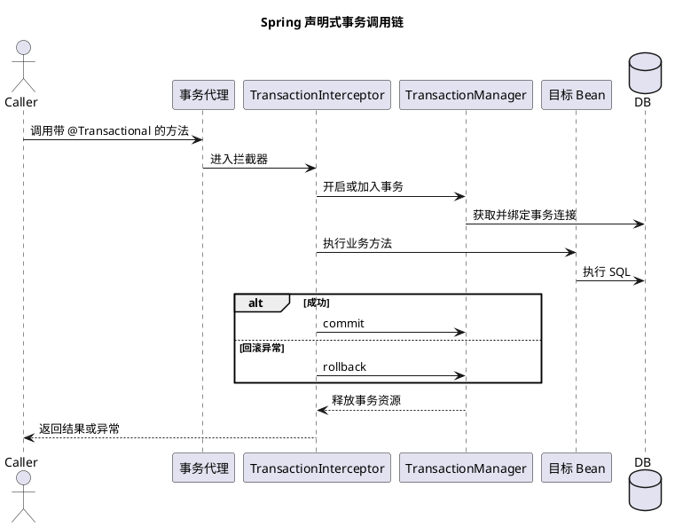

# Spring 事务原理与失效场景

## 问题索引

- Q1：`@Transactional` 是如何生效的？
- Q2：Spring 事务为什么会失效？传播行为如何选择？

## Q1：`@Transactional` 是如何生效的？

**一句话结论：** `@Transactional` 本身不执行事务，Spring 在 Bean 外层创建代理，代理通过事务拦截器在方法调用前开启事务、调用后提交或回滚。

### 核心原理

1. Bean 创建过程中识别事务属性。
2. Bean 被事务后置处理器包装为 JDK 动态代理或 CGLIB 代理。
3. 外部调用代理方法时，事务拦截器读取传播行为、隔离级别、超时和回滚规则。
4. `PlatformTransactionManager` 获取连接或事务资源并绑定到当前线程。
5. 目标方法成功返回时提交，抛出符合规则的异常时回滚。

### 调用链

### 关键边界

- 事务边界由代理调用形成，直接调用目标对象或绕过代理不会进入拦截器。
- 默认对运行时异常和 `Error` 回滚，受检异常通常需要显式配置 `rollbackFor`。
- 事务资源通常绑定在线程上下文中；异步线程不会自动继承当前事务。
- 数据库事务只能覆盖已纳入同一事务管理器的资源，不能自动覆盖远程 HTTP、MQ 或其他数据库。

## Q2：Spring 事务为什么会失效？传播行为如何选择？

**一句话结论：** 先判断调用是否经过代理、异常是否触发回滚、事务管理器是否匹配，再根据调用链是否需要共用事务决定传播行为。

### 常见失效场景

| 场景 | 原因 | 处理方式 |
| --- | --- | --- |
| 同类自调用 | `this.method()` 没有经过代理 | 拆分 Bean，或通过代理对象调用 |
| 方法不是代理可拦截的方法 | `private`、`final` 等限制代理增强 | 调整可代理边界 |
| 抛出受检异常 | 默认回滚规则未覆盖 | 配置 `rollbackFor`，或转换为业务异常 |
| 异步执行 | 新线程没有原事务上下文 | 在线程内重新开启事务，重新设计一致性边界 |
| 多数据源 | 事务管理器和实际数据源不匹配 | 明确事务管理器与数据源绑定 |
| 提前捕获异常 | 异常被吞掉，代理认为方法成功 | 保留异常语义或显式标记回滚 |

### 传播行为选择

- `REQUIRED`：默认选择；已有事务就加入，没有就新建，适合同一业务单元。
- `REQUIRES_NEW`：挂起外层事务并新建事务，适合独立审计、通知记录，但要注意连接池容量。
- `NESTED`：在已有事务中创建保存点，适合局部回滚；是否支持取决于事务管理器和数据库。
- `NOT_SUPPORTED`：挂起事务执行非事务操作，适合不希望被外层事务锁住的查询或外部调用边界。

### 面试追问

- Q：为什么 `REQUIRES_NEW` 可能造成连接池耗尽？
  A：外层事务连接被挂起但没有释放，内层事务还要额外申请连接；并发嵌套过深会放大连接占用。
- Q：远程调用应该放在数据库事务里吗？
  A：通常不应长时间占用数据库事务，应采用状态机、可靠消息、幂等和补偿查询形成最终一致性。

## 复习清单

- [ ] 能画出事务代理、拦截器和事务管理器的调用链。
- [ ] 能解释自调用、受检异常、异步线程导致的事务失效。
- [ ] 能根据调用边界选择 `REQUIRED`、`REQUIRES_NEW` 或最终一致性方案。
