# Spring Boot 核心组件与原理

## 问题索引

- Q1：Spring Boot 有哪些核心组件，启动和自动配置的原理是什么？
- Q2：AutoConfigurationImportSelector 核心原理与流程解说
- Q3：Spring Boot 中 Bean 的注册和加载顺序如何决定，@Order 的实际作用是什么？
- Q4：项目引入 Starter 但扫描不到自动配置 Bean，需要手动 componentScan 吗？

## Q1：Spring Boot 有哪些核心组件，启动和自动配置的原理是什么？

### 背景

Spring Boot 不是重新实现一套 IoC 容器，它的底层仍然是 Spring Framework 的 `ApplicationContext`、BeanDefinition、依赖注入、事件和生命周期体系。

Spring Boot 主要解决：

- 统一编排应用启动流程。
- 根据 Classpath、配置和已有 Bean 自动装配常用组件。
- 通过 Starter 管理依赖和默认组合。
- 通过外部化配置适配不同环境。
- 内嵌 Tomcat、Jetty、Undertow 等 Web 服务器。
- 提供健康检查、指标、配置诊断和生产运维能力。

可以把它概括为：

```text
Spring Boot = Spring Framework
            + 约定优于配置
            + 自动配置
            + Starter 依赖组合
            + 内嵌运行环境
            + 生产级运维能力
```

### 总体启动流程

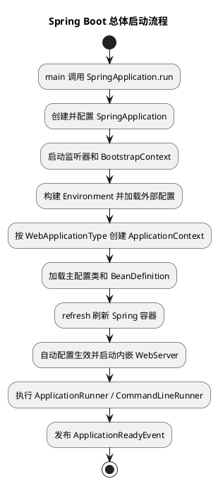

这张图要抓住两个边界：

```text
SpringApplication.run
  -> 负责 Spring Boot 启动编排

ApplicationContext.refresh
  -> 进入 Spring Framework 容器刷新主流程
```

Spring Boot 的自动配置最终仍然会转化为 BeanDefinition，并由 Spring 容器创建、依赖注入和管理生命周期。

### 核心组件总览

| 组件 | 主要职责 |
| --- | --- |
| `SpringApplication` | 统一编排应用启动、环境、容器、监听器和 Runner |
| `ApplicationContext` | Spring IoC 容器，管理 Bean 和生命周期 |
| `Environment` | 聚合配置源、Profile 和属性解析 |
| `ConfigDataEnvironmentPostProcessor` | 在容器刷新前加载配置文件和 Config Data |
| `Binder` | 把 Environment 属性绑定到对象 |
| `SpringApplicationRunListener` | 监听 SpringApplication 启动阶段 |
| `ApplicationContextInitializer` | refresh 前初始化 ApplicationContext |
| `ApplicationListener` | 监听 Spring 应用事件 |
| `BeanDefinitionLoader` | 把主配置源加载为 BeanDefinition |
| `AutoConfigurationImportSelector` | 导入并过滤自动配置候选项 |
| `Condition` / 条件注解 | 判断自动配置或 Bean 是否应该生效 |
| `ServletWebServerFactory` / `ReactiveWebServerFactory` | 创建内嵌 WebServer |
| `ApplicationRunner` / `CommandLineRunner` | 容器启动后、Ready 前执行初始化任务 |
| `FailureAnalyzer` | 把常见启动异常转换成更清晰的诊断报告 |
| Actuator / Micrometer | 暴露健康、指标、诊断和观测能力 |

组件不需要孤立背诵，应按以下主线理解：

```text
启动编排
  -> 配置环境
  -> 创建容器
  -> 加载业务配置和自动配置
  -> refresh 创建 Bean
  -> 启动 WebServer
  -> 执行启动后任务
  -> 进入 Ready 状态
```

### `@SpringBootApplication` 组合注解

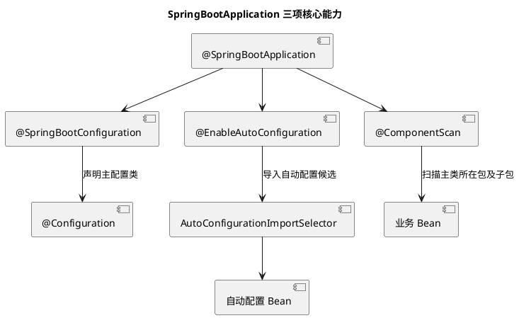

它最核心地组合了三类能力：

#### `@SpringBootConfiguration`

本质上带有 `@Configuration`，声明这是 Spring Boot 主配置类。通常一个应用只保留一个主配置入口。

#### `@EnableAutoConfiguration`

启用自动配置导入机制，根据依赖、配置和已有 Bean 决定哪些配置类生效。

#### `@ComponentScan`

默认从启动类所在包向下扫描 `@Component`、`@Service`、`@Repository`、`@Controller`、配置类等组件。

因此启动类一般放在业务根包：

```text
com.example.order.OrderApplication
com.example.order.controller
com.example.order.service
com.example.order.repository
```

如果启动类放在过深的子包，其他业务组件可能不在默认扫描范围内。

### `SpringApplication` 创建阶段

典型入口：

```java
@SpringBootApplication
public class OrderApplication {

    public static void main(String[] args) {
        // run 会创建 SpringApplication，并启动完整的环境、容器和事件流程。
        SpringApplication.run(OrderApplication.class, args);
    }
}
```

创建 `SpringApplication` 时主要确定：

- Primary Sources，即主配置源。
- `WebApplicationType`：`NONE`、`SERVLET` 或 `REACTIVE`。
- Bootstrap Registry Initializer。
- `ApplicationContextInitializer`。
- `ApplicationListener`。
- 主类，用于日志、包推断和诊断。

`WebApplicationType` 通常根据 Classpath 推断：

```text
没有 Web 基础类 -> NONE
存在 Servlet Web 体系 -> SERVLET
存在 Reactive Web 且没有 Servlet MVC 主导条件 -> REACTIVE
```

同时引入 MVC 和 WebFlux 依赖时，不要想当然认为一定启动 Reactive 服务器，应检查实际推断结果和依赖组合。

### `SpringApplication.run` 详细阶段

启动主流程可以拆成：

```text
1. 创建 BootstrapContext
2. 获取 SpringApplicationRunListener 并发布 starting
3. 解析 ApplicationArguments
4. prepareEnvironment：加载配置并发布 environmentPrepared
5. 打印 Banner
6. createApplicationContext：按 Web 类型创建容器
7. prepareContext：执行 Initializer、加载主配置源
8. refreshContext：调用 ApplicationContext.refresh
9. afterRefresh：完成扩展处理
10. 发布 started
11. 执行 ApplicationRunner / CommandLineRunner
12. 发布 ready
13. 任意阶段失败则发布 failed 并执行失败分析
```

不同 Spring Boot 版本的内部辅助类和方法签名可能变化，但“环境先准备、再创建并刷新容器、然后执行 Runner、最后 Ready”的主线稳定。

### 启动事件与扩展点

常见启动事件顺序可以概括为：

| 阶段 | 常见事件 | 可用信息 |
| --- | --- | --- |
| 开始启动 | `ApplicationStartingEvent` | 容器和 Environment 尚未就绪 |
| 环境已准备 | `ApplicationEnvironmentPreparedEvent` | 可以读取 Environment，容器尚未创建完成 |
| Context 已初始化 | `ApplicationContextInitializedEvent` | Initializer 已执行 |
| BeanDefinition 已加载 | `ApplicationPreparedEvent` | Context 尚未 refresh |
| 容器已启动 | `ApplicationStartedEvent` | refresh 完成，Runner 尚未全部执行 |
| 可接收业务流量 | `ApplicationReadyEvent` | Runner 已完成 |
| 启动失败 | `ApplicationFailedEvent` | 携带启动异常 |

几个扩展点的区别：

| 扩展点 | 执行位置 | 适合用途 |
| --- | --- | --- |
| `EnvironmentPostProcessor` | Environment 准备阶段 | 增加配置源、解密或转换配置 |
| `ApplicationContextInitializer` | refresh 前 | 设置 Context 属性、注册早期对象 |
| `BeanFactoryPostProcessor` | refresh 内、Bean 实例化前 | 修改 BeanDefinition |
| `BeanPostProcessor` | Bean 创建过程 | 代理、注入、初始化增强 |
| `ApplicationRunner` | refresh 后、Ready 前 | 使用解析后的参数执行启动任务 |
| `CommandLineRunner` | refresh 后、Ready 前 | 使用原始字符串参数执行启动任务 |

Runner 中执行长时间同步任务会推迟 `ApplicationReadyEvent`，也可能让 Kubernetes 就绪探针迟迟不能通过。长任务应异步化、拆成后台任务，或者明确区分启动必需任务与普通预热任务。

### Spring 容器刷新边界

`refreshContext` 最终进入 Spring Framework 的 `AbstractApplicationContext#refresh`。核心动作包括：

```text
准备 BeanFactory
  -> 执行 BeanFactoryPostProcessor
  -> 注册 BeanPostProcessor
  -> 初始化事件广播器等基础设施
  -> onRefresh 创建 WebServer 等特定组件
  -> 注册监听器
  -> 实例化非懒加载单例 Bean
  -> 发布 ContextRefreshedEvent
```

所以 Spring Boot 自动配置不是绕过 Spring 生命周期直接创建对象，而是先提供配置类和 BeanDefinition，再由标准 refresh 流程创建 Bean。

### 自动配置核心原理

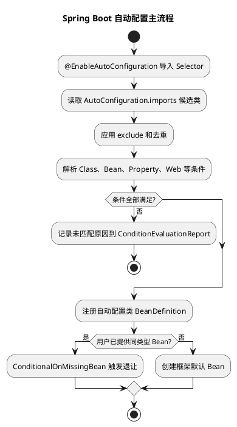

自动配置的本质不是“扫描到什么就全部创建”，而是：

```text
加载候选配置类
  -> 条件过滤
  -> 注册满足条件的 BeanDefinition
  -> 用户自定义 Bean 优先
```

#### 自动配置候选项从哪里来

现代 Spring Boot 自动配置通常在以下文件中声明：

```text
META-INF/spring/
org.springframework.boot.autoconfigure.AutoConfiguration.imports
```

每行是一个自动配置类全限定名。

旧版本主要通过：

```text
META-INF/spring.factories
```

中的 `EnableAutoConfiguration` 键加载候选项。需要注意：`spring.factories` 并没有从 Spring Boot 中完全消失，某些启动监听器、初始化器、失败分析器等扩展仍可能使用 `SpringFactoriesLoader`。只是自动配置候选注册在较新版本中迁移到了 `.imports` 文件。

#### `AutoConfigurationImportSelector`

它通过 `@Import` 机制参与配置类解析，主要完成：

- 获取自动配置候选类。
- 应用注解和配置中的排除项。
- 通过过滤器提前排除明显不满足的候选项。
- 把最终候选配置类交给 Spring 注册。
- 触发相关导入事件和诊断信息。

#### 常用条件注解

| 条件注解 | 含义 |
| --- | --- |
| `@ConditionalOnClass` | Classpath 存在指定类 |
| `@ConditionalOnMissingClass` | Classpath 不存在指定类 |
| `@ConditionalOnBean` | 容器已有指定 Bean |
| `@ConditionalOnMissingBean` | 容器没有指定 Bean，允许默认实现生效 |
| `@ConditionalOnProperty` | 配置属性满足条件 |
| `@ConditionalOnResource` | 存在指定资源 |
| `@ConditionalOnWebApplication` | 当前是指定类型 Web 应用 |
| `@ConditionalOnNotWebApplication` | 当前不是 Web 应用 |
| `@ConditionalOnExpression` | SpEL 条件满足 |

条件应在能确定结果的阶段使用。尤其是 `@ConditionalOnMissingBean`，它依赖当前已经处理到的 BeanDefinition，因此自动配置的顺序和用户配置加载时机很重要。

#### 自动配置为什么会“退让”

典型写法：

```java
@Bean
@ConditionalOnMissingBean
public ObjectMapper objectMapper() {
    // 只有业务没有声明 ObjectMapper 时，自动配置才提供默认实例。
    return new ObjectMapper();
}
```

用户声明自己的同类型 Bean 后，条件不匹配，默认 Bean 不再创建。这就是常说的“约定提供默认值，用户配置优先”。

#### 自动配置顺序

自动配置可以声明 before、after 或 order，用于保证某些配置类先被解析。需要注意：自动配置类顺序主要影响 BeanDefinition 注册和条件判断顺序，不等同于运行期 Bean 初始化顺序。Bean 初始化仍主要由依赖关系和 Spring 生命周期决定。

### 自动配置排查

启动时增加：

```bash
java -jar app.jar --debug
```

可以输出 Condition Evaluation Report，重点查看：

```text
Positive matches：哪些自动配置满足条件
Negative matches：哪些自动配置未满足，以及失败条件
Exclusions：哪些自动配置被显式排除
Unconditional classes：无需条件的配置
```

也可以：

- 查看 Actuator `/actuator/conditions`。
- 查看 `/actuator/beans` 和 `/actuator/configprops`。
- 给具体条件类和自动配置类加断点。
- 检查 Classpath 是否缺依赖或存在冲突版本。
- 检查是否已有同名或同类型 Bean 导致自动配置退让。
- 检查 `spring.autoconfigure.exclude` 和注解 exclude。

`ConditionEvaluationReport` 是排查“依赖有了但 Bean 为什么没创建”的核心工具。

### 外部化配置原理

Spring Boot 把命令行参数、系统属性、环境变量、配置文件等统一抽象为 `PropertySource`，聚合到 `Environment` 中，再由属性解析器或 `Binder` 读取。

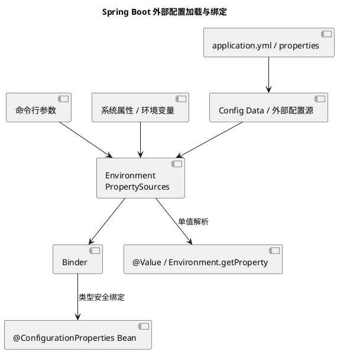

常见配置来源的简化优先级可以记为：

```text
命令行参数
  > SPRING_APPLICATION_JSON
  > Java System Properties
  > OS Environment
  > 外部 Config Data
  > Jar 内 Config Data
  > SpringApplication 默认属性
```

实际完整顺序还包含 `SPRING_APPLICATION_JSON`、测试属性、Servlet 初始化参数、Devtools 等来源，并且不同版本可能调整。遇到覆盖问题应查看当前版本官方 Externalized Configuration 顺序和 Actuator `/env`，不要只靠背诵简化列表。

#### Config Data

配置文件在 ApplicationContext refresh 前加载，使后续 BeanDefinition 条件判断和属性绑定都能读取配置。常见来源包括：

- `application.properties`、`application.yml`。
- Profile 文件，例如 `application-prod.yml`。
- Jar 外部目录中的配置。
- `spring.config.import` 导入的配置树或远程配置适配器。

Profile 和文件位置、导入顺序共同决定最终属性值。

#### `@Value` 与 `@ConfigurationProperties`

| 方式 | 适合场景 |
| --- | --- |
| `@Value` | 少量独立属性、简单表达式 |
| `@ConfigurationProperties` | 一组有层级、需要类型转换和校验的配置 |
| `Environment` | 框架代码、动态按 Key 读取 |

配置对象示例：

```java
@Validated
@ConfigurationProperties(prefix = "order.retry")
public class OrderRetryProperties {

    @Min(1)
    @Max(10)
    private int maxAttempts = 3;

    @NotNull
    private Duration initialInterval = Duration.ofMillis(200);

    // getter/setter 省略；字段使用明确类型后，Binder 可完成 Duration 等转换。
}
```

注册方式：

```java
@Configuration
@EnableConfigurationProperties(OrderRetryProperties.class)
public class OrderRetryConfiguration {
    // 自动配置或业务配置可以注入类型安全的 OrderRetryProperties。
}
```

大量配置类也可以使用 `@ConfigurationPropertiesScan` 扫描。

#### 宽松绑定

以下写法可以映射到同一个 Java 属性：

```text
order.retry.max-attempts
order.retry.maxAttempts
ORDER_RETRY_MAXATTEMPTS
```

不同配置源的命名转换规则并不完全相同，环境变量尤其要注意点号、横线和下划线转换。生产中应使用一致命名，并通过 `/actuator/env` 或启动测试验证真实绑定结果。

### 内嵌 Web 容器原理

传统部署通常是把 WAR 放入外部 Tomcat；Spring Boot 则把服务器作为依赖，由应用启动服务器。

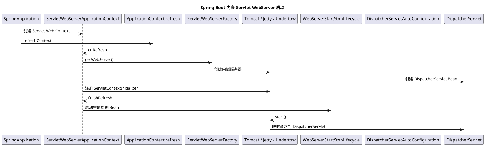

核心组件：

| 组件 | 职责 |
| --- | --- |
| `ServletWebServerApplicationContext` | Servlet Web 应用使用的 ApplicationContext |
| `ServletWebServerFactory` | 创建具体 WebServer 的工厂抽象 |
| `TomcatServletWebServerFactory` | 创建内嵌 Tomcat |
| `WebServer` | 统一的服务器启动、停止接口 |
| `WebServerStartStopLifecycle` | 跟随 Spring 生命周期启动和停止 WebServer |
| `ServletContextInitializer` | 以编程方式注册 Servlet、Filter、Listener |
| `DispatcherServletAutoConfiguration` | 自动配置 Spring MVC 前端控制器 |
| `DispatcherServletRegistrationBean` | 把 DispatcherServlet 注册到 Servlet 容器 |

为什么不需要 `web.xml`：Spring Boot 通过 Servlet 3+ 编程式初始化和 `ServletContextInitializer` 完成注册。

服务器配置最终也来自 Environment：

```yaml
server:
  port: 8080
  shutdown: graceful
```

端口占用、服务器依赖冲突、同时引入多个实现、错误的 WebApplicationType，都会导致 WebServer 创建或启动失败。

### Starter 原理

Starter 本身通常不承载复杂业务逻辑，而是提供一组经过验证的依赖组合；真正的默认 Bean 和条件逻辑位于 AutoConfigure 模块。

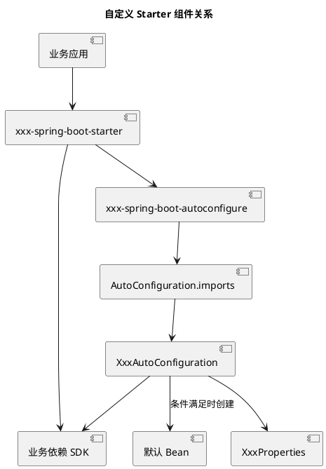

自动配置示例：

```java
@AutoConfiguration
@ConditionalOnClass(AuditClient.class)
@EnableConfigurationProperties(AuditProperties.class)
public class AuditAutoConfiguration {

    @Bean
    @ConditionalOnMissingBean
    @ConditionalOnProperty(
            prefix = "company.audit",
            name = "enabled",
            havingValue = "true",
            matchIfMissing = true)
    public AuditClient auditClient(AuditProperties properties) {
        // 用户没有自定义 AuditClient 且配置开启时，提供默认实现。
        return new DefaultAuditClient(properties.getEndpoint());
    }
}
```

imports 文件：

```text
# META-INF/spring/org.springframework.boot.autoconfigure.AutoConfiguration.imports
com.example.audit.autoconfigure.AuditAutoConfiguration
```

Starter 设计原则：

- 自定义 Starter 建议使用 `xxx-spring-boot-starter` 命名，避免占用官方命名空间。
- 默认配置合理，但允许用户通过 Bean 和属性覆盖。
- 自动配置不能无条件扫描整个业务包。
- 配置项使用 `@ConfigurationProperties` 并生成配置元数据。
- 自动配置类只负责装配，不承载复杂运行期业务。
- 对缺少依赖、配置错误和连接失败提供清晰诊断。
- 为条件匹配、默认 Bean、用户覆盖和禁用开关编写测试。

### Actuator 与可观测性

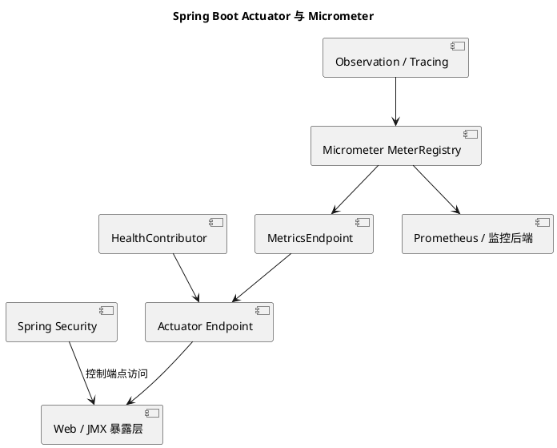

常见端点：

| 端点 | 用途 |
| --- | --- |
| `/actuator/health` | 健康状态和依赖检查 |
| `/actuator/metrics` | 查询 Meter 和标签 |
| `/actuator/prometheus` | Prometheus 抓取格式 |
| `/actuator/env` | 查看配置来源和最终值 |
| `/actuator/configprops` | 查看配置属性绑定结果 |
| `/actuator/conditions` | 查看自动配置条件报告 |
| `/actuator/beans` | 查看容器 Bean |
| `/actuator/loggers` | 查看或动态调整日志级别 |
| `/actuator/threaddump` | 获取线程快照 |
| `/actuator/heapdump` | 获取堆转储，敏感且资源消耗大 |

生产环境不能把所有 Actuator 端点直接暴露到公网。应配置最小暴露集合、独立管理端口或网络、Spring Security 鉴权和敏感值脱敏。

#### 健康状态与 Kubernetes 探针

应区分：

- Liveness：进程是否应该被重启，不应因为普通外部依赖短暂失败就反复重启。
- Readiness：当前实例是否可以接收流量，可以包含必要依赖和启动预热状态。

把数据库短暂抖动直接映射为 Liveness 失败，可能导致整个集群实例同时重启，放大故障。

#### Micrometer

Spring Boot 使用 Micrometer 统一指标抽象，业务代码面向 `MeterRegistry`、Counter、Timer、Gauge 等 API，再由具体 Registry 适配 Prometheus 等监控系统。

指标标签不能使用 userId、orderId、完整 URL 等高基数字段，否则会造成时序数量爆炸和监控系统压力。

### 失败分析与启动诊断

Spring Boot 在启动失败时会尝试通过 `FailureAnalyzer` 输出：

```text
Description：发生了什么
Action：建议如何修复
```

例如端口占用、Bean 缺失、配置绑定失败等。无法识别的异常仍会输出完整堆栈。

常用排查顺序：

```text
先看最底层 Caused by
  -> 判断 Environment、BeanDefinition、Bean 创建还是 WebServer 阶段
  -> 查看 ConditionEvaluationReport
  -> 检查配置绑定和依赖版本
  -> 检查 Bean 覆盖、循环依赖和条件退让
  -> 必要时开启 startup 记录分析慢启动步骤
```

可以配置 `ApplicationStartup` 收集启动步骤，但生产开启详细记录前要评估内存和观测开销。

### 自动配置与业务配置的边界

适合自动配置：

- 通用 SDK Client。
- 序列化、连接池、模板类和基础设施适配器。
- 统一日志、审计、监控和安全扩展。
- 有明确开关和可覆盖默认值的通用能力。

不适合自动配置：

- 具体订单、支付等强业务 Bean。
- 依赖隐式扫描和魔法命名的业务流程。
- 无法通过条件或配置关闭的全局副作用。
- 启动时执行不可控的数据修改或远程调用。

自动配置应让使用者可以回答：

```text
什么条件下生效？
会创建哪些 Bean？
如何覆盖默认 Bean？
如何通过配置关闭？
失败时如何诊断？
```

### 常见踩坑点

1. 把 Spring Boot 理解成独立 IoC 容器，忽略底层仍是 Spring `refresh` 生命周期。
2. 启动类放在业务包下层，默认组件扫描不到其他模块。
3. 同时引入 MVC 和 WebFlux，实际 WebApplicationType 与预期不一致。
4. 认为添加 Starter 就一定创建 Bean，忽略 Class、Property、MissingBean 等条件。
5. 用户自定义 Bean 触发 `@ConditionalOnMissingBean`，误以为自动配置失效。
6. 仍只检查 `spring.factories`，没有查看现代自动配置的 `AutoConfiguration.imports`。
7. 认为 `spring.factories` 已完全废弃，忽略其他 SPI 扩展仍可能使用它。
8. 配置文件存在但 Profile 未激活、导入顺序错误或被更高优先级来源覆盖。
9. 使用大量分散的 `@Value`，缺少类型安全、分组和启动校验。
10. 在 Runner 中执行长任务，导致应用迟迟不 Ready。
11. 自动配置类无条件创建重量级连接，导致不使用该功能也启动失败。
12. 认为 ApplicationContext refresh 完成就代表业务可用，忽略 Runner、预热和 Readiness。
13. 暴露 `/env`、`heapdump`、`loggers` 等敏感 Actuator 端点且没有鉴权。
14. 监控指标标签使用业务唯一 ID，导致高基数指标耗尽监控资源。
15. 自动配置顺序和 Bean 初始化顺序混为一谈。

### 面试话术

> Spring Boot 底层仍然是 Spring Framework，它主要做启动编排、自动配置、外部化配置、依赖组合、内嵌服务器和生产运维增强。入口是 `SpringApplication.run`，它先创建 BootstrapContext 和启动监听器，再准备 Environment、加载 Config Data，按 WebApplicationType 创建 ApplicationContext，执行 Initializer 并加载主配置源，之后调用 `ApplicationContext.refresh`。refresh 内仍然执行 BeanFactoryPostProcessor、BeanPostProcessor、单例 Bean 创建等标准 Spring 流程；Servlet Web 应用还会通过 ServletWebServerFactory 创建内嵌 Tomcat 等服务器。`@SpringBootApplication` 组合了主配置、自动配置和组件扫描。自动配置通过 `AutoConfigurationImportSelector` 加载 `AutoConfiguration.imports` 中的候选配置，再根据 Classpath、Bean、Property 和 Web 类型等条件过滤，最终注册 BeanDefinition；`@ConditionalOnMissingBean` 让用户自定义 Bean 覆盖默认实现。外部配置统一进入 Environment，再由 Binder 绑定到 `@ConfigurationProperties`。启动完成后执行 Runner，最后发布 Ready 事件。线上排查自动配置看 ConditionEvaluationReport，生产监控则通过 Actuator 和 Micrometer 完成。

### 高频追问

- Q：Spring Boot 和 Spring Framework 是什么关系？
  A：Spring Boot 基于 Spring Framework，底层 IoC、AOP、事务和 Bean 生命周期仍由 Spring 实现；Boot 主要提供自动配置、启动编排、Starter、外部配置和生产运维能力。

- Q：`@SpringBootApplication` 包含哪些核心能力？
  A：主配置类声明、自动配置和组件扫描，核心组合是 `@SpringBootConfiguration`、`@EnableAutoConfiguration`、`@ComponentScan`。

- Q：自动配置是如何生效的？
  A：`@EnableAutoConfiguration` 导入选择器，加载自动配置候选类，经过排除和条件过滤后注册配置类 BeanDefinition，最终由 Spring 容器创建满足条件的 Bean。

- Q：为什么引入依赖后自动配置没有生效？
  A：可能是 Classpath 条件不满足、属性开关关闭、已有 Bean 触发退让、应用类型不匹配、配置被排除或版本不兼容，应查看 ConditionEvaluationReport。

- Q：`spring.factories` 是否已经完全没用了？
  A：没有。现代自动配置候选主要使用 `AutoConfiguration.imports`，但某些监听器、初始化器、环境处理器和失败分析器等 SPI 仍可能通过 SpringFactoriesLoader 加载。

- Q：Spring Boot 为什么可以直接运行 Jar？
  A：可执行 Jar 包含应用类、依赖和 Boot Loader；应用启动后通过 `SpringApplication` 创建 Spring 容器，并由内嵌 WebServerFactory 启动服务器，不依赖外部 Tomcat 部署 WAR。

- Q：`ApplicationRunner` 和 `CommandLineRunner` 有什么区别？
  A：执行时机类似，都在容器 refresh 后、Ready 前；前者拿到结构化 `ApplicationArguments`，后者拿到原始字符串数组。

- Q：自动配置类的 before/after 是否决定 Bean 初始化顺序？
  A：不完全是。它主要影响自动配置类处理和 BeanDefinition 注册顺序，Bean 实例化顺序仍由依赖关系、懒加载和容器生命周期决定。

- Q：为什么推荐 `@ConfigurationProperties` 而不是大量 `@Value`？
  A：它支持分组、类型转换、宽松绑定、校验、元数据和集中维护，更适合一组可配置参数。

- Q：Spring Boot 什么时候算真正启动完成？
  A：ApplicationContext refresh 完成只表示容器已启动；Runner 执行结束并发布 `ApplicationReadyEvent` 后，通常才视为应用 Ready，实际流量接入还应结合 Readiness 探针。

### 复习清单

- [ ] 能画出 `SpringApplication.run` 从 Environment 到 Ready 的总体流程。
- [ ] 能说明 Spring Boot 和 Spring Framework refresh 的边界。
- [ ] 能解释 `@SpringBootApplication` 三项核心能力。
- [ ] 能说清 `SpringApplicationRunListener`、Initializer、Listener 和 Runner 的执行位置。
- [ ] 能说明自动配置候选加载、条件过滤和用户 Bean 退让机制。
- [ ] 能区分 `AutoConfiguration.imports` 与 `spring.factories` 的用途。
- [ ] 能使用 ConditionEvaluationReport 排查自动配置未生效。
- [ ] 能解释 Environment、PropertySource、Config Data 和 Binder 的协作。
- [ ] 能说明 `@Value` 与 `@ConfigurationProperties` 的适用边界。
- [ ] 能画出内嵌 WebServer 和 DispatcherServlet 的启动关系。
- [ ] 能设计一个可关闭、可覆盖、可诊断的自定义 Starter。
- [ ] 能说明 Actuator、Micrometer、Health 和 Kubernetes 探针的关系。
- [ ] 能列出 Spring Boot 启动慢、启动失败和配置覆盖问题的排查方法。

### 参考资料

- [Spring Boot Reference Documentation](https://docs.spring.io/spring-boot/reference/)
- [Spring Boot Auto-configuration](https://docs.spring.io/spring-boot/reference/using/auto-configuration.html)
- [Spring Boot Externalized Configuration](https://docs.spring.io/spring-boot/reference/features/external-config.html)
- [Spring Boot Embedded Web Servers](https://docs.spring.io/spring-boot/reference/web/servlet.html#web.servlet.embedded-container)
- [Spring Boot Actuator](https://docs.spring.io/spring-boot/reference/actuator/)

## Q2：AutoConfigurationImportSelector 核心原理与流程解说

### 背景

AutoConfigurationImportSelector 是 Spring Boot 自动配置的核心入口之一。它的作用不是直接创建 Bean，而是根据应用启用的自动配置、Classpath、已有 Bean、配置属性和 Web 环境等信息，筛选出当前应用可能需要的自动配置类，再交给 Spring 配置类解析流程继续处理。

理解这套机制，可以抓住一条主线：

~~~text
用户配置
  -> @EnableAutoConfiguration
  -> AutoConfigurationImportSelector
  -> 加载自动配置候选项
  -> 去重、排除和条件过滤
  -> 排序后交给 Spring 解析
  -> 注册满足条件的 BeanDefinition
~~~

它解决的是“哪些默认配置应该参与当前应用”，而不是“所有自动配置都必须生效”。

### 总体流程

~~~plantuml
@startuml
title AutoConfigurationImportSelector 核心流程
start
:@EnableAutoConfiguration 触发导入;
:DeferredImportSelector 延迟处理;
:加载 AutoConfiguration.imports 候选项;
:去重并处理 exclude;
:Classpath 条件快速过滤;
:完整条件判断与排序;
:Spring 解析配置并注册 BeanDefinition;
stop
@enduml
~~~

### 1. 入口：通过 @EnableAutoConfiguration 触发

通常项目入口上的 @SpringBootApplication 组合了 @EnableAutoConfiguration。后者通过 @Import 引入 AutoConfigurationImportSelector：

~~~text
@SpringBootApplication
  -> @EnableAutoConfiguration
      -> @Import(AutoConfigurationImportSelector.class)
~~~

Spring 容器在解析配置类时发现这个 ImportSelector，随后把它交给配置类解析流程。真正的触发时机位于 ApplicationContext.refresh 的配置类处理阶段，而不是 SpringApplication.run 直接调用 Selector。

### 2. 延迟导入：先处理用户配置，再处理自动配置

AutoConfigurationImportSelector 实现 DeferredImportSelector。与普通 ImportSelector 立即返回导入类不同，它会先暂存，待普通配置类解析完成后再集中处理。

这样做的核心价值是让自动配置判断更容易看到用户已经声明的 BeanDefinition。例如用户已经提供 DataSource 时，DataSourceAutoConfiguration 中的 @ConditionalOnMissingBean 就可以让默认 DataSource 配置退让。

延迟导入主要带来三点能力：

- 用户配置优先参与条件判断。
- 多个自动配置导入结果可以统一去重和处理排除项。
- 自动配置之间可以依据 before、after 和 order 元数据排序。

这里的“先处理”主要针对配置类和 BeanDefinition 元数据，不代表所有用户 Bean 已经实例化。

### 3. 加载候选配置：只得到候选类名

Selector 会从自动配置导入文件中加载候选配置类。现代 Spring Boot 主要读取：

~~~text
META-INF/spring/org.springframework.boot.autoconfigure.AutoConfiguration.imports
~~~

文件中的每一行通常是一个自动配置类的全限定名，例如 DataSourceAutoConfiguration、JacksonAutoConfiguration 等。

这一步只完成候选收集：

- 候选类名不等于最终生效的配置。
- 候选配置类不会因为出现在 imports 文件中就全部实例化。
- 后续仍要经过排除、条件判断和配置类解析。

旧版本曾主要通过 spring.factories 的 EnableAutoConfiguration 项加载候选项。阅读不同版本源码时，应先确认候选配置文件格式，避免把旧版机制直接套到新版。

### 4. 去重与排除：确定参与后续判断的集合

候选加载后，Selector 会处理重复项和显式排除项。排除来源通常包括：

- @EnableAutoConfiguration(exclude = ...)。
- @EnableAutoConfiguration(excludeName = ...)。
- spring.autoconfigure.exclude 配置属性。

可以把结果理解为：

~~~text
候选配置
  -> 去重
  -> 合并注解和配置文件中的排除项
  -> 校验排除项
  -> 删除 exclusions
  -> 剩余候选进入条件过滤
~~~

排除操作只影响自动配置候选集合，不会删除用户自己注册的 BeanDefinition。若自动配置类可能位于可选依赖中，使用 excludeName 可以避免为了排除它而提前加载不存在的 Class。

### 5. 条件过滤：先快后全

自动配置候选数量较多，Spring Boot 不会一开始就对每个配置类执行完整解析，而是采用“快速过滤 + 完整判断”的分层方式。

#### 5.1 Classpath 条件快速过滤

AutoConfigurationImportFilter 会结合自动配置元数据，优先判断一些能够快速确定的条件，典型是 @ConditionalOnClass。缺少关键依赖的自动配置可以在正式解析前被排除，减少启动开销。

这一阶段主要回答：

- 当前 Classpath 是否具备自动配置所需的类？
- 是否可以在不深入解析配置类的情况下直接排除候选？

它是启动性能优化，不是全部条件判断。@ConditionalOnBean、@ConditionalOnMissingBean、@ConditionalOnProperty 等需要结合 BeanFactory、Environment 或当前配置状态，通常要在后续阶段判断。

#### 5.2 配置类和 Bean 方法的完整条件判断

通过快速过滤的配置类会继续交给 Spring 的 ConfigurationClassParser 和 ConditionEvaluator。条件可能作用在两个层次：

| 判断位置 | 作用 |
| --- | --- |
| 配置类级别 | 不满足时跳过整个自动配置类 |
| @Bean 方法级别 | 不满足时只跳过当前 BeanDefinition |

最终结果可能是：整个自动配置类不参与注册，或者配置类保留但其中某个 @Bean 方法被跳过。

因此，imports 文件中存在某个配置类，却在容器中找不到对应 Bean，并不能直接说明自动配置失效，需要区分候选、排除、快速过滤、完整条件不匹配和实例化失败等阶段。

### 6. 排序并交给 Spring 注册

筛选后的自动配置类会依据自动配置元数据进行排序。排序主要服务于配置类处理和条件判断，例如先处理某个基础配置，再处理依赖它的上层配置。

排序完成后，Selector 将配置类交回 Spring 配置类解析机制。Spring 再解析其中的 @Configuration、@Bean、@Import 和条件注解，最终注册 BeanDefinition。BeanDefinition 注册成功也不等于对象已经创建，非懒加载单例通常在后续容器初始化阶段实例化。

要特别区分：自动配置类排序决定配置处理顺序；它不是所有 Bean 的实例化顺序，也不是 @Order 的通用替代品。

### 条件评估报告如何形成

ConditionEvaluationReport 是条件判断过程中的累积结果，不是启动结束后重新扫描生成的总结。自动配置导入和具体条件判断会分别向同一份报告追加信息。

~~~plantuml
@startuml
title ConditionEvaluationReport 形成过程
participant "AutoConfigurationImportSelector" as Selector
participant "ImportListener" as Listener
participant "ConditionEvaluator" as Evaluator
participant "SpringBootCondition" as Condition
database "ConditionEvaluationReport" as Report
participant "Debug/Actuator" as Output

Selector -> Listener : 记录候选项与 exclusions
Evaluator -> Condition : 执行具体条件
Condition -> Report : 记录 match/no-match 与原因
Output -> Report : 读取已累积的评估结果
@enduml
~~~

报告主要包含三类信息：

| 信息 | 产生时机 | 用途 |
| --- | --- | --- |
| Evaluation Candidates | 自动配置导入完成后 | 说明哪些配置进入评估范围 |
| Exclusions | 处理显式排除项时 | 说明哪些配置被主动排除 |
| Condition Outcomes | 每次条件执行时 | 说明匹配结果和具体原因 |

Spring Boot 的条件实现通常基于 SpringBootCondition。条件执行后会产生 ConditionOutcome，并将结果记录到当前 BeanFactory 关联的 ConditionEvaluationReport。--debug 日志以及 Actuator conditions 端点主要消费这份已形成的报告，不会为了展示结果重新完整执行一次条件。

### 用 DataSource 自动配置理解整条链路

以 JDBC Starter 为例，可以按以下顺序理解：

1. DataSourceAutoConfiguration 先从 AutoConfiguration.imports 进入候选集合。
2. 如果用户通过注解或配置属性排除它，就在候选阶段移除。
3. 如果缺少 JDBC 相关类，Classpath 条件可能直接快速过滤。
4. 如果类存在，再判断是否满足嵌入式数据库、配置属性和已有 DataSource 等条件。
5. 条件满足后，自动配置类中的 Bean 方法才有机会注册 DataSource BeanDefinition。
6. BeanDefinition 注册后，再由 Spring 完成依赖解析和对象实例化。

这个例子体现了自动配置的本质：根据环境动态选择一组默认 Bean，而不是无条件创建固定 Bean。

### 常见排查顺序

自动配置未生效时，按以下顺序排查更高效：

1. 是否启用了自动配置并进入正确的应用上下文。
2. 目标自动配置是否存在于候选列表。
3. 是否被 exclude、excludeName 或 spring.autoconfigure.exclude 排除。
4. 是否因缺少 Classpath 依赖被快速过滤。
5. 是否因 Bean、Property、Web 类型等完整条件不满足而跳过。
6. BeanDefinition 是否已经注册，以及后续是否在实例化阶段失败。

### 常见误区

- AutoConfigurationImportSelector 不是在 SpringApplication.run 中直接被调用的业务方法，而是由 Spring 配置类解析机制触发。
- imports 文件中的所有类只是候选项，不代表都会生效。
- 快速过滤只处理一部分能够提前判断的条件，不能替代完整条件评估。
- 自动配置类排序不等于 Bean 实例化顺序。
- 条件报告是评估过程中的增量记录，不能只从最终的 Positive Matches 判断完整链路。

### 面试话术

> AutoConfigurationImportSelector 是 Spring Boot 自动配置的核心选择器。它由 @EnableAutoConfiguration 通过 @Import 引入，并以 DeferredImportSelector 的方式延迟处理。处理时先从 AutoConfiguration.imports 加载候选配置类，再进行去重和排除；随后先利用 Classpath 元数据做快速过滤，再由 Spring 配置类解析和 ConditionEvaluator 执行配置类级、Bean 方法级的完整条件判断。筛选并排序后的配置类交给 Spring 注册 BeanDefinition。条件报告则在导入事件和具体条件执行过程中持续记录候选项、排除项以及 ConditionOutcome，最终供 --debug 日志和 Actuator conditions 端点查看。

### 高频追问

- Q：为什么要延迟导入？
  A：先让用户配置和 BeanDefinition 参与条件判断，再集中处理自动配置，便于实现用户配置覆盖默认配置。

- Q：候选配置和生效配置有什么区别？
  A：候选配置只是 imports 文件中的可能项，经过排除、Classpath 条件和完整条件判断后，才可能参与 BeanDefinition 注册。

- Q：快速过滤和完整条件判断有什么区别？
  A：快速过滤优先处理可由元数据和 Classpath 确定的条件；完整判断还要结合 BeanFactory、Environment 和配置类解析阶段的信息。

- Q：条件报告记录了什么？
  A：记录候选项、排除项，以及每个条件匹配或不匹配的结果和原因。

### 复习清单

- [ ] 能说明 @EnableAutoConfiguration 如何引入 AutoConfigurationImportSelector。
- [ ] 能复述候选加载、去重、排除、过滤、排序和注册的主流程。
- [ ] 能区分快速条件过滤与配置类/Bean 方法的完整条件判断。
- [ ] 能解释为什么自动配置类存在于 imports 中却不一定生效。
- [ ] 能说明 ConditionEvaluationReport 是如何在评估过程中逐步形成的。

### 参考资料

- [Spring Boot 自动配置文档](https://docs.spring.io/spring-boot/reference/using/auto-configuration.html)
- [Spring Boot AutoConfigurationImportSelector](https://github.com/spring-projects/spring-boot/blob/main/core/spring-boot-autoconfigure/src/main/java/org/springframework/boot/autoconfigure/AutoConfigurationImportSelector.java)
- [Spring Boot ConditionEvaluationReport](https://github.com/spring-projects/spring-boot/blob/main/core/spring-boot-autoconfigure/src/main/java/org/springframework/boot/autoconfigure/condition/ConditionEvaluationReport.java)

## Q3：Spring Boot 中 Bean 的注册和加载顺序如何决定，`@Order` 的实际作用是什么？

### 先给结论

这个问题需要区分三种完全不同的顺序：

| 顺序 | 含义 | 主要决定因素 |
| --- | --- | --- |
| BeanDefinition 注册顺序 | Bean 的元数据什么时候进入 BeanFactory | 配置类解析、组件扫描、`@Import`、`@Bean`、Registrar、自动配置和后置处理器 |
| Bean 实例化顺序 | Bean 对象什么时候执行构造、注入和初始化 | 依赖关系、`@DependsOn`、作用域、懒加载、基础设施生命周期 |
| 多个 Bean 的使用顺序 | 框架拿到一组同类 Bean 后先调用谁 | `@Order`、`Ordered`、`PriorityOrdered` 以及具体扩展点自己的排序规则 |

最重要的结论：

```text
@Order 通常不决定 Bean 初始化顺序。
```

Spring 官方 `@Order` Javadoc 也明确说明：它可以影响注入集合等场景的优先级，但不会影响 Singleton 的启动顺序；后者属于依赖关系和 `@DependsOn` 决定的另一个问题。

### 总体流程

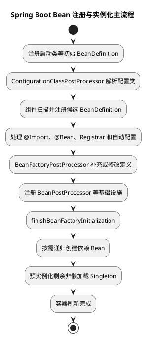

可以概括为：

```text
先尽量完成 BeanDefinition 注册
  -> 再创建普通非懒加载单例
  -> 创建某个 Bean 时先递归满足它的依赖
```

但“先注册全部定义，再实例化所有 Bean”只是普通业务 Bean 的主线，不是绝对规则。`BeanFactoryPostProcessor`、`BeanPostProcessor`、某些基础设施 Bean 和类型查询可能在普通单例预实例化前提前创建。

### BeanDefinition 是什么

BeanDefinition 描述“将来如何创建 Bean”，包含：

- Bean Class 或工厂方法。
- Scope。
- 是否 Lazy。
- 构造参数和属性值。
- 初始化、销毁方法。
- `dependsOn`。
- Primary、Role、Qualifier 等元数据。

注册 BeanDefinition 不等于实例化对象：

```text
BeanDefinition 注册
  -> 容器知道有这个 Bean，以及如何创建

Bean 实例化
  -> 调用构造方法，真正产生对象
```

这也是为什么组件扫描可以发现几百个 Bean，但扫描阶段并不会调用所有业务类构造方法。

### 是不是先扫描所有 Bean

准确说法是：**Spring 会先扫描指定包中的类资源并注册匹配的 BeanDefinition，但 BeanDefinition 不只来自扫描，也不是扫描结束后才一次性注册。**

主要来源包括：

```text
@ComponentScan 扫描
@Bean 方法
@Import 配置类
ImportSelector / DeferredImportSelector
ImportBeanDefinitionRegistrar
Spring Boot 自动配置
XML 或 Groovy 配置
BeanDefinitionRegistryPostProcessor 动态注册
程序手动 registerBean
```

`ConfigurationClassParser` 处理 `@ComponentScan` 时，会立即调用 `ComponentScanAnnotationParser#parse` 注册扫描到的 BeanDefinition；如果扫描结果中还有配置类，又会继续递归解析。

源码主线：

```text
ConfigurationClassPostProcessor#processConfigBeanDefinitions
  -> parser.parse(candidates)
  -> ConfigurationClassParser#doProcessConfigurationClass
  -> componentScanParser.parse(...)
  -> 注册扫描结果 BeanDefinition
  -> 检查扫描结果中是否还有配置类
  -> 递归 parse(...)
  -> processImports(...)
  -> ConfigurationClassBeanDefinitionReader#loadBeanDefinitions
```

`ConfigurationClassPostProcessor` 还会循环检查新增加的 BeanDefinition。如果新定义本身又是配置类候选，会继续下一轮解析，直到没有新的配置类候选。

所以它不是：

```text
扫描所有 Class
  -> 一次性整理所有 Bean
  -> 再统一注册
```

而更接近：

```text
从启动配置类开始解析
  -> 扫描并立即注册定义
  -> 发现新的配置类继续解析
  -> 处理 Import 和 Bean 方法
  -> 延后导入自动配置
  -> 必要时继续处理新增定义
```

扫描通常使用 ASM 和 `MetadataReader` 读取类元数据，尽量避免为了判断注解而加载、初始化每个候选 Class。

### Spring Boot 自动配置在哪个位置

`@EnableAutoConfiguration` 导入的 `AutoConfigurationImportSelector` 是 `DeferredImportSelector`，因此自动配置通常在普通用户配置解析后集中处理：

```text
用户配置和组件扫描
  -> DeferredImportSelectorHandler
  -> AutoConfigurationGroup
  -> 自动配置候选、排除、条件和排序
  -> 自动配置 BeanDefinition
```

这样 `@ConditionalOnMissingBean` 更容易看到用户已经声明的 BeanDefinition，从而让默认自动配置退让。

自动配置类的 before/after 主要影响自动配置解析顺序，不等于内部所有 Bean 的实例化顺序。

### 手动 `registerBean` 与 `@ConditionalOnMissingBean` 的时序陷阱

`registerBean` 的本质是向 `BeanDefinitionRegistry` 或 `DefaultListableBeanFactory` 增加一个 BeanDefinition。它不是等到 Bean 真正实例化时才登记，因此会直接影响后续条件判断。

例如自动配置中有：

```java
@Bean
@ConditionalOnMissingBean(OrderClient.class)
public OrderClient orderClient() {
    // 只有当前条件评估范围内没有 OrderClient 时，默认实现才会注册。
    return new DefaultOrderClient();
}
```

如果业务配置或前置 Registrar 在自动配置条件评估前执行：

```java
registry.registerBean(
        "customOrderClient",
        OrderClient.class,
        CustomOrderClient::new,
        definition -> {
            // 这里可以补充作用域、依赖、懒加载等 BeanDefinition 属性。
        });
```

那么 `@ConditionalOnMissingBean(OrderClient.class)` 通常可以看到这个 BeanDefinition，默认 `orderClient` 配置会退让。这是正常的用户覆盖机制，不是重复注册。

真正容易出现问题的是时机不一致：

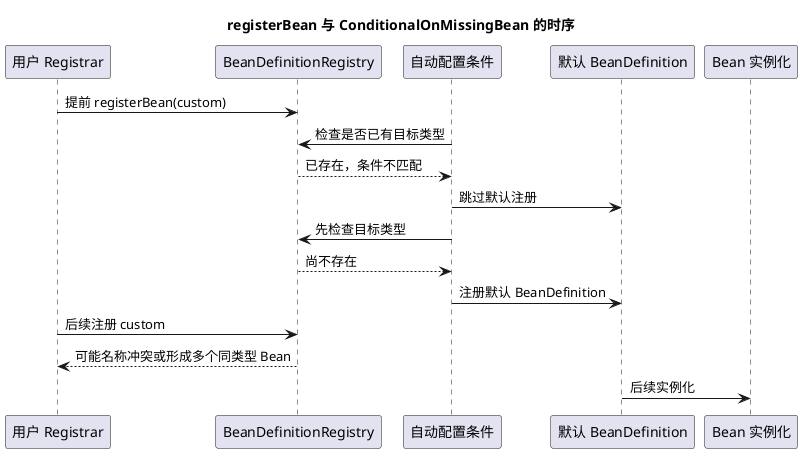

需要区分三类结果：

| 情况 | 结果 |
| --- | --- |
| 自定义 BeanDefinition 在条件判断前已注册 | 自动配置通常因 `@ConditionalOnMissingBean` 不满足而退让 |
| 自动配置已通过条件并注册默认定义，之后才手动注册同名 Bean | 可能出现 BeanDefinition 覆盖禁止或重复注册异常 |
| 自动配置默认 Bean 已注册，手动 Bean 使用不同名称 | 可能出现两个同类型 Bean，后续注入产生歧义，而不一定报重复名称异常 |

`@ConditionalOnMissingBean` 不是对整个应用最终状态的全局预测，它通常只基于条件评估当时已经可见的 BeanDefinition 和 BeanFactory 状态。自定义 Starter 或 Registrar 应尽量让用户定义先进入注册表，并使用稳定的类型、名称和条件边界；不要先让自动配置通过，再用另一个后置扩展去“补注册”同一职责的 Bean。

排查重复注册时，先确认：

1. 手动注册发生在配置类解析的哪个阶段。
2. 自动配置条件评估发生在手动注册之前还是之后。
3. 两个定义是否同名，是否只是同类型不同名。
4. 是否关闭了 BeanDefinition 覆盖，或者存在同名定义覆盖策略差异。
5. `@ConditionalOnMissingBean` 检查的是类型、名称还是注解等条件。

### `@AutoConfigureAfter` 与 `@DependsOn` 的边界

两者都带有“先后”含义，但作用层次不同：

| 注解 | 约束对象 | 解决的问题 | 不解决的问题 |
| --- | --- | --- | --- |
| `@AutoConfigureAfter` | 自动配置类 | 让当前自动配置在指定自动配置之后处理 | 不保证目标 Bean 已实例化，不控制普通 Bean 构造顺序 |
| `@DependsOn` | Bean | 让某个 Bean 实例化前先创建指定 Bean | 不改变自动配置类排序，也不让目标定义自动出现 |

例如自定义缓存自动配置依赖数据源自动配置提供的 BeanDefinition，可以使用：

```java
@AutoConfiguration(after = DataSourceAutoConfiguration.class)
public class CacheAutoConfiguration {

    @Bean
    @ConditionalOnMissingBean
    public CacheRepository cacheRepository(DataSource dataSource) {
        // after 影响自动配置处理顺序，构造器参数表达真正的 Bean 依赖。
        return new JdbcCacheRepository(dataSource);
    }
}
```

如果只是存在一个没有类型依赖的初始化前置条件，例如先加载字典再创建服务，才考虑：

```java
@Bean
@DependsOn("dictionaryLoader")
public PricingService pricingService() {
    // DependsOn 保证 dictionaryLoader 先初始化，但不会改变自动配置筛选顺序。
    return new PricingService();
}
```

优先级选择可以记为：

```text
自动配置类之间的处理关系 -> @AutoConfigureBefore / @AutoConfigureAfter
Bean 之间的真实构造依赖     -> 构造器注入
没有类型依赖但存在初始化前置条件 -> @DependsOn
多个同类型 Bean 的执行顺序   -> @Order / Ordered
```

`@AutoConfigureAfter` 只有在目标自动配置也参与当前导入流程时才有排序意义；它不能替代 `@ConditionalOnBean` 检查目标 Bean 是否存在。反过来，`@DependsOn` 也不能修复自动配置条件判断过早的问题，因为它只描述 Bean 创建阶段的依赖，不会提前注册缺失的 BeanDefinition。

### `refresh` 中什么时候开始创建普通 Bean

Spring Framework 的 `AbstractApplicationContext#refresh` 主线是：

```text
invokeBeanFactoryPostProcessors
  -> 配置类解析、BeanDefinition 增删改

registerBeanPostProcessors
  -> 提前创建并注册 BeanPostProcessor

初始化 MessageSource、事件广播器等基础设施
  -> onRefresh
  -> registerListeners

finishBeanFactoryInitialization
  -> 预实例化剩余非懒加载 Singleton

finishRefresh
```

源码注释将 `finishBeanFactoryInitialization` 描述为初始化所有“remaining singleton beans”。“remaining”说明此前已经有部分基础设施 Bean 被创建。

### 非懒加载 Singleton 如何预实例化

`DefaultListableBeanFactory#preInstantiateSingletons` 会复制当前 `beanDefinitionNames`，遍历非抽象 Singleton BeanDefinition，并触发预实例化。

`beanDefinitionNames` 本身按注册顺序保存，因此在**没有依赖、没有懒加载、没有特殊生命周期和没有并行初始化**时，观察到的构造顺序可能接近注册顺序。

但不能依赖这一点：

- 注册顺序受扫描、Jar、配置类、Import 和条件影响。
- 创建 A 时可能递归先创建 A 的依赖 B、C。
- `@DependsOn` 会增加显式顺序约束。
- BeanPostProcessor 和基础设施 Bean 提前创建。
- `@Lazy`、Prototype、Request、Session Bean 不在普通预实例化范围。
- 新版 Spring 支持部分后台初始化能力时，独立 Bean 可能并行。
- `FactoryBean`、类型查询和某些框架扩展可能触发提前初始化。

所以注册顺序最多是实现细节和无依赖情况下的默认遍历顺序，不能作为业务正确性的保证。

### 依赖关系才是实例化顺序的核心

假设：

```java
@Component
public class OrderService {

    private final PaymentClient paymentClient;

    public OrderService(PaymentClient paymentClient) {
        // 创建 OrderService 前必须先得到 PaymentClient。
        this.paymentClient = paymentClient;
    }
}

@Component
public class PaymentClient {
}
```

即使 `OrderService` 的 BeanDefinition 先注册，容器创建它时也会先调用 `getBean(PaymentClient)`：

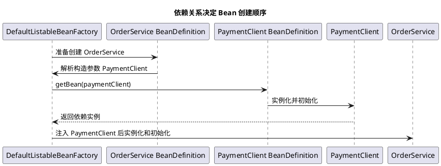

稳定规则是：

```text
被依赖 Bean 先完成创建
  -> 依赖它的 Bean 再完成创建
```

循环依赖会让这条链更复杂，构造器循环依赖通常直接失败；部分单例属性注入循环依赖可能通过早期引用处理，但不应被当成排序手段。

### `@DependsOn` 什么时候使用

有些 Bean 没有 Java 类型依赖，但初始化时存在隐式前置条件：

```java
@Component("schemaInitializer")
public class SchemaInitializer {
}

@Component
@DependsOn("schemaInitializer")
public class ReportRepository {
}
```

`@DependsOn` 表示指定 Bean 必须先初始化。对于 Singleton，销毁顺序通常相反：依赖方先销毁，被依赖方后销毁。

不过更推荐把真实依赖放进构造器。如果 `ReportRepository` 确实需要 `SchemaInitializer` 的结果，显式注入通常比字符串 Bean 名更容易维护和测试。

### Lazy、Prototype 和其他 Scope

不同 Scope 的创建时机不同：

| 类型 | 常见创建时机 |
| --- | --- |
| 非懒加载 Singleton | 容器 refresh 期间预实例化 |
| `@Lazy` Singleton | 第一次真正获取时创建 |
| Prototype | 每次 `getBean` 或依赖解析时创建 |
| Request | 当前 HTTP 请求首次访问时创建 |
| Session | 当前 Session 首次访问时创建 |

`@Lazy` 不是绝对“应用运行后才创建”。如果它被一个非懒加载 Singleton 直接注入且没有代理延迟，依赖解析仍可能触发它创建。要延迟到使用时，需要结合 Lazy 代理、`ObjectProvider` 或 Provider。

### Bean 的单体生命周期顺序

确定某个 Bean 开始创建后，其内部流程大致为：

```text
实例化前处理
  -> 构造方法实例化
  -> 早期引用处理
  -> 属性填充和依赖注入
  -> Aware 回调
  -> BeanPostProcessor 初始化前
  -> @PostConstruct / InitializingBean / init-method
  -> BeanPostProcessor 初始化后
  -> AOP 代理可能形成
  -> 放入 Singleton 缓存
```

这是“一个 Bean 内部的生命周期顺序”，不要和“多个 Bean 谁先创建”混为一谈。

### `@Order` 的实际作用

`@Order` 给组件提供一个排序值。通常数值越小，优先级越高：

```text
Ordered.HIGHEST_PRECEDENCE = Integer.MIN_VALUE
Ordered.LOWEST_PRECEDENCE  = Integer.MAX_VALUE
```

它只有在某段框架代码**显式收集多个对象并使用 OrderComparator 排序**时才生效。

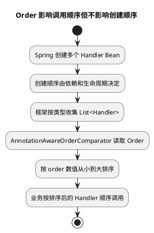

典型生效场景：

| 场景 | `@Order` 的作用 |
| --- | --- |
| 注入 `List<Handler>` 或数组 | 对同类型 Bean 排序 |
| `ObjectProvider#orderedStream` | 返回排序后的 Bean 流 |
| `ApplicationRunner` / `CommandLineRunner` | 控制 Runner 调用顺序 |
| `ApplicationListener` | 控制事件监听器调用顺序 |
| AOP Advisor / Aspect | 控制拦截器或切面优先级 |
| 多条 `SecurityFilterChain` | 控制优先匹配的安全链 |
| 部分 MVC 扩展组件 | 在扩展点明确排序时控制调用优先级 |

不保证生效或不负责的场景：

| 场景 | 正确工具 |
| --- | --- |
| 控制 Bean 构造和初始化先后 | 构造依赖、`@DependsOn` |
| 从多个候选中选择唯一 Bean | `@Primary`、`@Qualifier` |
| 控制自动配置类前后关系 | `@AutoConfigureBefore`、`@AutoConfigureAfter` |
| 控制生命周期组件启动停止 | `SmartLifecycle#getPhase` |
| 控制普通 Filter 注册顺序 | `FilterRegistrationBean#setOrder` 或对应容器注册规则 |
| 控制数据库初始化和业务任务先后 | 显式依赖、Runner 编排或状态机 |

### `@Order` 示例

```java
public interface OrderValidator {

    void validate(OrderCommand command);
}

@Component
@Order(10)
class BaseOrderValidator implements OrderValidator {
    // 基础校验优先执行。
}

@Component
@Order(20)
class RiskOrderValidator implements OrderValidator {
    // 风控校验在基础格式校验后执行。
}

@Service
class OrderValidationService {

    private final List<OrderValidator> validators;

    OrderValidationService(List<OrderValidator> validators) {
        // Spring 使用依赖比较器对 List 中的候选 Bean 排序。
        this.validators = validators;
    }
}
```

此时 `validators` 通常按 10、20 排列，但这不表示 `BaseOrderValidator` 的构造方法一定比 `RiskOrderValidator` 更早执行。

### 为什么集合注入会识别 `@Order`

注解配置初始化时，Spring 会给 `DefaultListableBeanFactory` 设置：

```text
AnnotationAwareOrderComparator.INSTANCE
```

作为 DependencyComparator。解析数组、List 等多 Bean 依赖时，BeanFactory 可以使用这个比较器读取：

- Bean 类型上的 `@Order`。
- `@Bean` 工厂方法上的 `@Order`。
- 实例实现的 `Ordered#getOrder()`。
- `jakarta.annotation.Priority`。

不是所有集合形态都承诺同样排序语义。需要顺序时优先使用 `List<T>`、数组或 `ObjectProvider#orderedStream`，不要把普通 `Set`、`Map` 的迭代顺序当成 `@Order` 合同。

### Runner 中的 `@Order`

Spring Boot 在 Context refresh 完成后收集 Runner，使用 OrderComparator 排序后再调用：

```java
@Component
@Order(10)
class CacheWarmupRunner implements ApplicationRunner {

    @Override
    public void run(ApplicationArguments args) {
        // @Order 控制的是 run 调用顺序，不是这个 Bean 的实例化顺序。
    }
}
```

如果 Runner B 必须依赖 Runner A 的成功结果，仅靠 `@Order` 仍然较弱：A 失败会中断启动，但任务之间没有显式数据契约。更稳妥的是合并为一个编排器，或把前置结果抽成明确服务和状态。

### `Ordered`、`PriorityOrdered` 与 `@Priority`

#### `@Order`

顺序写在类、方法或字段元数据上，适合静态顺序。

#### `Ordered`

组件自己实现 `getOrder()`，可以根据实例配置动态返回顺序：

```java
class ConfigurableHandler implements Ordered {

    private final int order;

    @Override
    public int getOrder() {
        return order;
    }
}
```

#### `PriorityOrdered`

主要用于容器基础设施扩展。框架通常先处理 `PriorityOrdered`，再处理普通 `Ordered`，最后处理无顺序对象。

这不只是“order 值更小”，而是先分组再在组内排序。BeanFactoryPostProcessor、BeanPostProcessor 等基础设施场景更常见。

#### `@Priority`

可以作为很多排序场景的替代注解，并可能在“必须选出一个候选项”时提供额外优先级语义。普通依赖歧义仍应优先使用 `@Primary` 或 `@Qualifier` 表达，而不是把排序当作选择规则。

### BeanPostProcessor 的特殊性

BeanPostProcessor 自身必须在普通业务 Bean 创建前注册，因此它们会被提前实例化。

容器对这类基础设施扩展通常显式按以下组处理：

```text
PriorityOrdered
  -> Ordered
  -> 未声明顺序
```

对于程序化注册的 BeanPostProcessor，执行顺序可能直接由注册先后决定；部分基础设施扩展也不会读取普通 `@Order`。实现容器 SPI 时应查看该 SPI 的排序合同，必要时直接实现 `PriorityOrdered` 或 `Ordered`，不能假设所有地方都识别注解。

### `@Configuration` 上的 `@Order`

配置类解析器可以读取配置类顺序，因此 `@Order` 可能影响多个配置类的处理优先级。

但它仍不等于：

```text
配置类 A 中所有 Bean 都先于配置类 B 中所有 Bean 创建
```

BeanDefinition 注册后，实例化仍然根据依赖图、Scope、Lazy 和容器生命周期进行。对于 Spring Boot 自动配置之间的顺序，应使用专门的 AutoConfigure before/after 机制。

### 真正需要顺序时怎么选

| 需求 | 推荐方式 |
| --- | --- |
| A 需要 B 才能构造 | 构造器注入 B |
| A 没有类型依赖，但必须在 B 后初始化 | `@DependsOn("b")` |
| 一组策略按顺序执行 | `List<T>` + `@Order` / `Ordered` |
| 多个 Runner 按顺序调用 | `@Order`，强依赖则集中编排 |
| 所有 Singleton 完成后执行回调 | `SmartInitializingSingleton` |
| 容器 Ready 后执行任务 | `ApplicationRunner` / `CommandLineRunner` |
| 生命周期组件启动和停止顺序 | `SmartLifecycle#getPhase` |
| 自动配置解析顺序 | `@AutoConfigureBefore/After` |
| Bean 后处理器优先级 | `PriorityOrdered` / `Ordered` |

### 如何观察实际顺序

不要在构造器里到处打印日志作为长期方案。调试时可以：

- 在 `ConfigurationClassPostProcessor#processConfigBeanDefinitions` 观察定义注册。
- 在 `ConfigurationClassParser#doProcessConfigurationClass` 观察扫描和 Import。
- 在 `DefaultListableBeanFactory#preInstantiateSingletons` 观察预实例化遍历。
- 在 `AbstractAutowireCapableBeanFactory#doCreateBean` 观察具体 Bean 创建。
- 在 `DefaultSingletonBeanRegistry#getSingleton` 观察单例缓存和依赖递归。
- 使用 `ApplicationStartup` 或 Actuator `/startup` 分析启动步骤。
- 使用 `/actuator/beans` 查看 Bean、类型、依赖和资源来源。

关键断点链：

```text
AbstractApplicationContext#refresh
  -> ConfigurationClassPostProcessor#processConfigBeanDefinitions
  -> ConfigurationClassParser#parse
  -> ComponentScanAnnotationParser#parse
  -> ConfigurationClassBeanDefinitionReader#loadBeanDefinitions
  -> DefaultListableBeanFactory#preInstantiateSingletons
  -> AbstractBeanFactory#doGetBean
  -> AbstractAutowireCapableBeanFactory#doCreateBean
```

### 常见踩坑点

1. 把扫描到 Class、注册 BeanDefinition 和实例化 Bean 当成同一件事。
2. 认为所有 BeanDefinition 一次性扫描完成，忽略 `@Bean`、Import、Registrar 和自动配置来源。
3. 根据包名或类名推断 Bean 构造顺序。
4. 观察到无依赖 Bean 按注册顺序创建，就把它当成稳定合同。
5. 使用 `@Order` 试图让数据库连接 Bean 在业务 Bean 前初始化。
6. 用 `@Order` 解决强任务依赖，前一个任务失败后没有明确状态和补偿。
7. 把 `@Primary` 和 `@Order` 混淆：一个负责单候选选择，一个负责多对象排序。
8. 把自动配置 before/after 和 Bean 实例化顺序混淆。
9. 忽略 Lazy、Prototype 和 Request Scope 导致创建时机与预期不同。
10. BeanPostProcessor 中依赖大量普通业务 Bean，造成业务 Bean 提前创建且无法经过完整后处理器链。
11. 用 `@DependsOn` 大量串联 Bean，形成脆弱的字符串依赖网络。
12. 假设所有 Spring 扩展点都会识别 `@Order`，没有查看对应 SPI 的排序合同。

### 面试话术

> Spring Boot 中要区分 BeanDefinition 注册顺序和 Bean 实例化顺序。容器 refresh 时先执行 ConfigurationClassPostProcessor，从启动配置类开始解析；ComponentScan 会扫描类元数据并立即注册 BeanDefinition，扫描到新的配置类还会递归解析，之后还会处理 Bean 方法、Import、Registrar 和 Deferred 自动配置。所以不是扫描一次就得到所有 Bean，更不是扫描时就实例化对象。普通非懒加载 Singleton 主要在 finishBeanFactoryInitialization 中由 DefaultListableBeanFactory 预实例化，虽然它会遍历按注册顺序保存的 beanDefinitionNames，但真正创建时会递归先创建依赖 Bean，另外还受 DependsOn、Lazy、Scope、BeanPostProcessor 和基础设施生命周期影响，因此不能依赖注册顺序保证业务初始化顺序。`@Order` 主要用于框架收集多个同类 Bean 后的排序，例如 List 注入、Runner、Listener、AOP 和 SecurityFilterChain，数值越小优先级越高；它不控制 Singleton 启动顺序。要控制初始化依赖应使用构造器注入或 DependsOn，自动配置顺序使用 AutoConfigureBefore/After，生命周期组件使用 phase。

### 高频追问

- Q：Spring 是否先创建所有 BeanDefinition，再创建任何 Bean？
  A：普通业务 Bean 大体遵循先注册定义、后预实例化，但不是绝对。BeanFactoryPostProcessor、BeanPostProcessor 和部分基础设施 Bean 会提前创建，类型查询等操作也可能触发早期初始化。

- Q：两个没有依赖关系的 Singleton 谁先创建？
  A：默认遍历可能接近 BeanDefinition 注册顺序，但这不是稳定业务合同，并可能受扫描、Import、版本和后台初始化影响。需要顺序时应建立显式依赖。

- Q：`@Order(1)` 的 Bean 会比 `@Order(2)` 的 Bean 先执行构造方法吗？
  A：不会保证。Order 主要影响框架收集多个 Bean 后的排序，不影响 Singleton 启动顺序。

- Q：`@Order` 和 `@DependsOn` 有什么区别？
  A：Order 控制多个对象的使用优先级；DependsOn 建立初始化依赖，指定 Bean 必须先创建。

- Q：手动 `registerBean` 为什么可能与 `@ConditionalOnMissingBean` 冲突？
  A：条件只检查评估当时已经可见的定义。提前注册自定义定义时，自动配置通常会正常退让；如果自动配置先通过条件并注册默认定义，之后才手动注册同名或同类型 Bean，就可能出现重复名称异常、覆盖冲突或依赖注入歧义。

- Q：`@AutoConfigureAfter` 和 `@DependsOn` 有什么区别？
  A：前者调整自动配置类的处理顺序，影响配置解析和条件评估的先后；后者约束 Bean 实例化顺序。二者不能互相替代，真实 Bean 依赖仍优先使用构造器注入。

- Q：`@Order` 和 `@Primary` 有什么区别？
  A：Order 用于多个 Bean 的排序；Primary 用于单值注入存在多个候选时优先选择一个 Bean。

- Q：为什么 BeanPostProcessor 会比普通业务 Bean 先创建？
  A：它需要拦截后续 Bean 的创建过程，因此容器必须先实例化并注册后处理器，再创建普通业务 Bean。

- Q：组件扫描为什么不需要加载并初始化所有 Class？
  A：Spring 可以使用 ASM MetadataReader 读取类文件注解和类型元数据，筛选候选后注册 BeanDefinition，不需要执行类初始化逻辑。

### 复习清单

- [ ] 能区分 BeanDefinition 注册、Bean 实例化和多 Bean 使用顺序。
- [ ] 能说明组件扫描为什么只注册定义而不创建业务对象。
- [ ] 能列出扫描、Bean 方法、Import、Registrar 和自动配置等定义来源。
- [ ] 能说清 refresh 中后置处理器和普通 Singleton 的创建边界。
- [ ] 能解释依赖关系为什么会覆盖默认注册遍历顺序。
- [ ] 能解释手动注册 BeanDefinition 与 `@ConditionalOnMissingBean` 的时序风险。
- [ ] 能区分 `@AutoConfigureAfter`、构造器注入和 `@DependsOn` 的作用层次。
- [ ] 能说明 Lazy、Prototype、Request Scope 的创建时机。
- [ ] 能准确描述 Order 的生效条件和不生效范围。
- [ ] 能区分 Order、Ordered、PriorityOrdered、Priority、Primary 和 DependsOn。
- [ ] 能为初始化依赖、策略排序、Runner 和自动配置分别选择正确工具。
- [ ] 能使用关键源码断点观察 Bean 注册和创建过程。

### 参考源码

- [Spring Framework AbstractApplicationContext](https://github.com/spring-projects/spring-framework/blob/main/spring-context/src/main/java/org/springframework/context/support/AbstractApplicationContext.java)
- [Spring Framework ConfigurationClassPostProcessor](https://github.com/spring-projects/spring-framework/blob/main/spring-context/src/main/java/org/springframework/context/annotation/ConfigurationClassPostProcessor.java)
- [Spring Framework ConfigurationClassParser](https://github.com/spring-projects/spring-framework/blob/main/spring-context/src/main/java/org/springframework/context/annotation/ConfigurationClassParser.java)
- [Spring Framework DefaultListableBeanFactory](https://github.com/spring-projects/spring-framework/blob/main/spring-beans/src/main/java/org/springframework/beans/factory/support/DefaultListableBeanFactory.java)
- [Spring Framework Order](https://github.com/spring-projects/spring-framework/blob/main/spring-core/src/main/java/org/springframework/core/annotation/Order.java)
- [Spring Boot SpringApplication](https://github.com/spring-projects/spring-boot/blob/v4.1.0/core/spring-boot/src/main/java/org/springframework/boot/SpringApplication.java)

## Q4：项目引入 Starter 但扫描不到自动配置 Bean，需要手动 componentScan 吗？

### 结论

通常不应该通过 @ComponentScan 修复“Starter 自动配置 Bean 没有生效”。

Starter 的正常职责是提供依赖组合；自动配置模块通过 AutoConfiguration.imports 或旧版本的 spring.factories 被 Spring Boot 自动发现，再由 AutoConfigurationImportSelector 处理。自动配置类不依赖业务启动类的组件扫描范围。

只有下面这种情况使用组件扫描才可能是设计内行为：

- 依赖方明确把某些类设计为普通 @Component、@Service 或 @Configuration。
- 该依赖本质上是组件库，不是标准 Spring Boot 自动配置。
- 文档明确要求用户扫描指定包，且扫描范围是受控的。

如果一个本应通过自动配置生效的 Starter 必须让业务方手动扫描自动配置包，通常应优先修复 Starter 的元数据、模块依赖或条件配置，而不是扩大扫描范围。

### 自动配置与组件扫描的边界

~~~plantuml
@startuml
title Starter 自动配置与 ComponentScan 的职责边界
component "业务应用" as App
component "xxx-spring-boot-starter" as Starter
component "xxx-spring-boot-autoconfigure" as AutoModule
file "AutoConfiguration.imports" as Imports
component "AutoConfigurationImportSelector" as Selector
component "条件评估" as Conditions
component "BeanDefinition" as Definitions
component "ComponentScan\n(@Component 等)" as Scan

App --> Starter : 引入依赖
Starter --> AutoModule : 传递依赖
AutoModule --> Imports : 声明候选自动配置
App --> Selector : @EnableAutoConfiguration
Selector --> Imports : 加载候选
Selector --> Conditions : 过滤
Conditions --> Definitions : 注册满足条件的定义
App --> Scan : 扫描业务组件
Scan --> Definitions : 仅处理扫描范围内的组件
@enduml
~~~

可以这样区分：

| 机制 | 主要发现对象 | 是否依赖启动类包路径 |
| --- | --- | --- |
| @ComponentScan | 扫描范围内的 @Component、@Service、@Repository、@Configuration 等 | 是 |
| 自动配置导入 | AutoConfiguration.imports 中声明的自动配置类 | 否 |
| @Import | 明确指定的配置类、Selector 或 Registrar | 否，但需要显式声明 |

因此，启动类放错包层级可能导致业务组件扫描不到，但一般不会导致一个正确声明的自动配置类因为包路径不在扫描范围内而失效。

### 一个正确的 Starter 结构

建议把依赖聚合和自动配置拆开：

~~~text
xxx-spring-boot-starter
  -> 依赖 xxx-spring-boot-autoconfigure
      -> 依赖 xxx-core

xxx-spring-boot-autoconfigure
  -> XxxAutoConfiguration
  -> META-INF/spring/org.springframework.boot.autoconfigure.AutoConfiguration.imports
~~~

自动配置模块中的核心结构可以是：

~~~java
@AutoConfiguration
@ConditionalOnClass(XxxClient.class)
@EnableConfigurationProperties(XxxProperties.class)
public class XxxAutoConfiguration {

    @Bean
    @ConditionalOnMissingBean
    public XxxClient xxxClient(XxxProperties properties) {
        // 用户没有自定义 XxxClient 时，提供默认实现。
        return new DefaultXxxClient(properties);
    }
}
~~~

AutoConfiguration.imports：

~~~text
com.example.xxx.autoconfigure.XxxAutoConfiguration
~~~

如果项目使用较早的 Spring Boot 版本，还要检查对应版本要求的 spring.factories 配置。不能只看 Java 类是否存在，必须确认自动配置类已经被正确登记为候选项。

### 为什么手动 @ComponentScan 可能掩盖问题

例如业务方这样处理：

~~~java
@SpringBootApplication
@ComponentScan("com.example.xxx")
public class Application {
}
~~~

它可能暂时让某些类进入容器，但会引入几个风险：

1. 把自动配置类当成普通扫描配置，绕开了 Starter 应有的发现入口。
2. 如果该自动配置后来又被 AutoConfiguration.imports 正常导入，可能产生重复配置或重复 BeanDefinition。
3. 某些条件、自动配置排序和用户覆盖关系不再容易判断。
4. 扫描范围扩大后，第三方内部组件可能被意外注册。
5. 业务方和 Starter 之间形成隐式包路径契约，后续升级和拆包容易失效。

@ComponentScan 解决的是“扫描某个包里的组件”，不是“修复自动配置候选项没有被发现”。

诊断阶段可以临时使用 @Import(XxxAutoConfiguration.class) 验证自动配置类本身是否能够工作，但这不是优先推荐的生产修复方式。若显式 Import 后生效，通常说明问题位于自动配置元数据、Starter 依赖或自动配置开关，而不是组件扫描路径。

### 正确排查顺序

#### 1. 确认引入的不是只有核心包

检查依赖树，确认业务应用真正引入了：

~~~text
xxx-spring-boot-starter
  -> xxx-spring-boot-autoconfigure
  -> xxx-core
~~~

只引入 xxx-core 通常不会自动触发 Spring Boot 配置。

#### 2. 检查自动配置登记文件是否进入 Jar

解压 xxx-spring-boot-autoconfigure，确认存在：

~~~text
META-INF/spring/org.springframework.boot.autoconfigure.AutoConfiguration.imports
~~~

并且内容包含自动配置类全限定名。对于旧版本项目，再检查：

~~~text
META-INF/spring.factories
~~~

#### 3. 确认自动配置类声明正确

重点检查：

- 类是否使用 @AutoConfiguration，或使用符合版本要求的 @Configuration。
- 自动配置类是否位于 imports 文件声明的全限定名。
- 自动配置模块是否被 Starter 正确传递依赖。
- 自动配置类是否被 exclude 或 spring.autoconfigure.exclude 排除。

#### 4. 查看条件是否让 Bean 退让

即使候选配置已经加载，仍可能因为以下条件不满足而不注册 Bean：

- @ConditionalOnClass：缺少依赖类。
- @ConditionalOnProperty：开关未开启或属性值不匹配。
- @ConditionalOnMissingBean：业务方已经存在同类型 Bean。
- @ConditionalOnBean：前置 Bean 尚未出现或类型不匹配。
- @ConditionalOnWebApplication：应用类型不是预期的 Web 环境。

启动时使用 --debug，或者查看 Actuator 的 conditions 端点，确认自动配置是未被发现、被排除，还是被某个条件过滤。

#### 5. 确认应用确实启用了自动配置

检查启动方式是否使用了标准 Boot 上下文，以及是否误用了：

- @SpringBootTest(classes = ...) 指向了不完整的配置类。
- 手动创建了不带 Boot 自动配置的 ApplicationContext。
- 使用 SpringApplicationBuilder 时关闭了自动配置。
- 在测试中通过 @OverrideAutoConfiguration(enabled = false) 禁用了自动配置。

### 什么时候 @ComponentScan 是正确的

如果依赖是一个有意设计的组件库，而不是自动配置 Starter，例如只提供若干带 @Component 的通用处理器，那么使用窄范围扫描可能合理：

~~~java
@Configuration
@ComponentScan("com.example.xxx.handler")
public class XxxComponentConfiguration {
    // 只扫描稳定且明确的扩展点，避免扫描整个第三方包。
}
~~~

但对于企业级 Starter，更推荐以下入口：

| 需求 | 推荐方式 |
| --- | --- |
| 根据条件提供默认 Bean | 自动配置 + AutoConfiguration.imports |
| 明确导入一组配置 | @Import |
| 批量注册动态 BeanDefinition | ImportBeanDefinitionRegistrar |
| 只提供普通组件库 | 用户显式 @ComponentScan 或组件库配置类 |
| 让用户覆盖默认实现 | @ConditionalOnMissingBean |

### 面试话术

> 引入 Starter 后，自动配置 Bean 正常不依赖业务启动类的 @ComponentScan。Starter 通过自动配置模块中的 AutoConfiguration.imports 登记配置类，再由 AutoConfigurationImportSelector 加载并执行条件判断。组件扫描只负责扫描指定包下的普通组件。如果必须手动扫描自动配置包，通常应先检查 Starter 是否漏了 autoconfigure 依赖、imports 或旧版 spring.factories，是否被排除，以及条件注解是否让配置退让。只有当依赖本身明确设计为普通组件库时，@ComponentScan 才是合理入口；临时 @Import 可以用于定位问题，但不应作为自动配置缺失的常规修复。

### 高频追问

- Q：手动 @ComponentScan 后 Bean 生效，能否说明 Starter 没有自动配置？
  A：不能。它只说明扫描路径内的配置类或组件可以被注册，还需要确认自动配置元数据是否存在、候选是否加载以及条件是否匹配。

- Q：如何快速判断是“发现失败”还是“条件不满足”？
  A：先检查 Jar 内的 imports 文件，再看 --debug 的 Positive/Negative Matches 和 Exclusions。没有候选项通常是发现链路问题；有候选但被列入 Negative Matches 通常是条件问题。

- Q：为什么不推荐扫描整个第三方包？
  A：会把内部组件、测试配置或非预期实现一起注册，并形成脆弱的包路径契约，还可能与自动配置重复注册。

### 复习清单

- [ ] 能区分 @ComponentScan 和自动配置导入的发现范围。
- [ ] 能说出 Starter、autoconfigure、core 三个模块的职责。
- [ ] 能检查 AutoConfiguration.imports 和旧版 spring.factories。
- [ ] 能按“依赖、元数据、候选、排除、条件、BeanDefinition”顺序排查。
- [ ] 能解释为什么手动扫描可能暂时有效但不是正确修复。
- [ ] 能判断何时使用 @ComponentScan、@Import 或自动配置。

### 参考资料

- [Spring Boot 自动配置文档](https://docs.spring.io/spring-boot/reference/using/auto-configuration.html)
- [Spring Boot Creating Your Own Auto-configuration](https://docs.spring.io/spring-boot/reference/features/developing-auto-configuration.html)
- [Spring Boot AutoConfigurationImportSelector](https://github.com/spring-projects/spring-boot/blob/main/core/spring-boot-autoconfigure/src/main/java/org/springframework/boot/autoconfigure/AutoConfigurationImportSelector.java)
