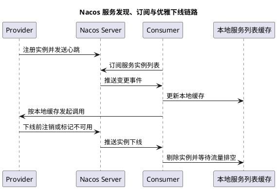

# Nacos 注册中心订阅长连接与优雅下线

## 问题索引

- Q1：Nacos 作为注册中心是订阅更新制还是 Socket 长连接？长连接如何优雅下线？
- Q2：Nacos 配置更新后，微服务是否需要重启才能生效？

## Q1：Nacos 作为注册中心是订阅更新制还是 Socket 长连接？长连接如何优雅下线？

### 背景

Nacos 作为注册中心时，经常会被问：

```text
服务消费者是轮询拉取服务列表？
还是订阅服务变更？
底层是不是 socket 长连接？
应用下线时如何避免流量继续打到正在关闭的实例？
```

这几个问题要分层回答：

- 从使用语义看：Nacos 客户端会订阅服务实例变化。
- 从传输实现看：Nacos 2.x 主要通过 gRPC 长连接进行服务端推送和客户端通信。
- 从高可用治理看：优雅下线要先摘流量，再等待存量请求结束，最后注销实例并关闭进程。

### Nacos 是订阅更新制还是长连接

准确说：**两者都对，但属于不同层面**。

#### 1. 订阅更新是服务发现语义

消费者关心某个服务，例如：

```text
order-service 订阅 product-service
```

当 `product-service` 实例新增、下线、权重变化、健康状态变化时，Nacos 客户端希望及时拿到最新实例列表。

所以从使用模型上看，它是订阅更新机制：

```text
客户端订阅 serviceName
服务实例变化
Nacos Server 推送或通知变化
客户端更新本地服务列表缓存
负载均衡使用新列表
```

#### 2. 长连接是底层通信实现

Nacos 2.x 引入 gRPC 长连接通信。客户端和服务端之间建立长连接，用于请求、推送、心跳等交互。

可以理解为：

```text
订阅更新 = 业务机制
gRPC 长连接 = 传输通道
```

所以面试里不要二选一说“它是订阅，不是长连接”或“它是长连接，不是订阅”。更好的回答是：

> Nacos 服务发现对客户端暴露的是订阅更新模型，客户端订阅服务变化并维护本地缓存；在 Nacos 2.x 中，底层主要通过 gRPC 长连接承载服务端推送和客户端请求，相比 1.x 的 HTTP/UDP 推送模型，连接模型和性能都有变化。

### 服务发现基本流程


### PlantUML 示意图：Nacos 服务发现与优雅下线



#### 服务提供者注册

```text
服务启动
  -> Nacos Client 注册实例
  -> Nacos Server 保存实例信息
  -> 客户端维持心跳或连接健康
```

实例信息包括：

- serviceName。
- namespace。
- group。
- clusterName。
- ip。
- port。
- weight。
- metadata。
- ephemeral 是否临时实例。
- healthy 是否健康。

#### 服务消费者订阅

```text
消费者启动
  -> 订阅目标 serviceName
  -> 拉取一次实例列表
  -> 本地缓存服务列表
  -> 后续实例变更通过推送/通知更新缓存
```

调用时：

```text
OpenFeign / RestTemplate / LoadBalancer
  -> 从本地服务实例缓存拿列表
  -> 按负载均衡策略选择实例
  -> 发起请求
```

### 临时实例和非临时实例

Nacos 注册实例有临时实例和非临时实例。

| 类型 | 特点 | 适用 |
| --- | --- | --- |
| 临时实例 | 客户端断连或心跳异常后自动剔除 | 微服务实例，默认常用 |
| 非临时实例 | 不会因为心跳失败被直接删除，更多依赖健康状态 | 固定基础服务 |

微服务 Spring Cloud 场景通常使用临时实例。

临时实例下，如果实例异常宕机：

```text
客户端连接/心跳断开
Nacos Server 判断实例不健康或删除
推送服务列表变化
消费者本地缓存更新
```

### 长连接下如何优雅下线

优雅下线的目标是：

```text
不再接收新流量
正在处理的请求尽量完成
消费者尽快感知实例不可用
最后关闭应用
```

推荐流程：

```text
1. 接收 SIGTERM 或发布平台下线指令
2. 标记应用进入 shutting_down 状态
3. 主动向 Nacos 注销实例，或把实例权重调为 0 / 标记不可用
4. 等待服务发现推送和客户端缓存刷新
5. 网关/负载均衡不再把新请求打到该实例
6. 应用等待存量请求处理完成
7. 关闭连接池、线程池、MQ 消费者
8. 进程退出
```

### 关键点一：先摘流量，再停进程

错误方式：

```text
kill 进程
Nacos 发现心跳断开
消费者稍后感知
感知窗口内仍有请求打到已关闭实例
```

更稳方式：

```text
先从注册中心摘除实例
等待传播
再关闭服务
```

在 Spring Boot 中可以利用优雅停机：

```yaml
server:
  shutdown: graceful

spring:
  lifecycle:
    timeout-per-shutdown-phase: 30s
```

含义：

- 收到关闭信号后，不再接收新请求。
- 等待已有请求处理完成。
- 超过超时时间后强制结束。

### 关键点二：注销实例或调整权重

常见摘流方式：

#### 直接注销实例

适合普通发布下线。

```text
调用 Nacos deregisterInstance
消费者收到实例列表变更
不再选择该实例
```

#### 权重调为 0

适合灰度下线或观察期。

```text
实例仍在注册中心
但负载均衡不再选择或极少选择
```

注意：客户端负载均衡是否完全尊重权重，要看具体实现。

#### metadata 标记下线

例如：

```text
metadata.shuttingDown = true
```

然后在网关或客户端负载均衡里过滤该实例。

优点：

- 可控。
- 能做灰度、预摘流。

缺点：

- 需要自定义过滤逻辑。

### 关键点三：等待缓存刷新窗口

消费者不是每次调用都实时请求 Nacos，而是使用本地缓存。

所以摘流后要等待一小段时间，让：

- Nacos Server 完成实例变更。
- 订阅该服务的消费者收到推送。
- 客户端本地缓存刷新。
- 网关或服务负载均衡不再选择该实例。

这就是为什么发布平台里经常有：

```text
preStop sleep 10s / 20s
```

Kubernetes 场景下可以使用：

```yaml
lifecycle:
  preStop:
    exec:
      command: ["sh", "-c", "curl -X POST http://127.0.0.1:8080/internal/offline && sleep 20"]
terminationGracePeriodSeconds: 60
```

这里的意思是：

- `offline` 接口先主动摘注册中心流量。
- `sleep 20` 给注册中心推送和客户端缓存刷新留时间。
- `terminationGracePeriodSeconds` 给应用处理存量请求留时间。

### 关键点四：长连接断开不等于优雅下线

长连接断开只能说明：

```text
Nacos Server 最终会感知客户端不在线
```

但它不是优雅下线的完整方案。

原因：

- 感知有延迟。
- 消费者本地缓存刷新有延迟。
- 连接断开时进程可能已经无法处理请求。
- 存量请求可能被中断。

所以优雅下线不能只依赖“断开长连接后自动剔除”，而应该主动注销或摘权重。

### 关键点五：关闭 MQ 消费和异步任务

很多服务不仅处理 HTTP 请求，还消费 MQ、执行定时任务。

优雅下线时要：

- 先停止接收新 HTTP 流量。
- 再停止 MQ 拉取新消息。
- 等当前正在处理的消息完成或安全中断。
- 关闭线程池。
- 关闭数据库、Redis、HTTP 连接池。

否则可能出现：

- HTTP 已摘流，但 MQ 还在消费。
- 进程退出导致消息处理中断。
- 消费重试引发重复处理。

### 常见问题

#### 为什么下线后还有请求打进来？

可能原因：

- 消费者本地服务列表缓存还没刷新。
- 网关长连接或负载均衡缓存未更新。
- 客户端没有订阅成功，仍使用旧缓存。
- 发布脚本没有等待摘流传播。
- Nacos 集群或网络延迟。
- 还有直连流量绕过注册中心。

#### 临时实例异常宕机能自动剔除，为什么还要优雅下线？

自动剔除解决的是故障恢复，不是无损发布。

异常宕机路径：

```text
进程已死 -> 注册中心感知 -> 消费者更新
```

优雅下线路径：

```text
先让消费者不再调用 -> 再关闭进程
```

顺序完全不同。

### 面试话术

> Nacos 作为注册中心，从服务发现模型上看是订阅更新制，消费者订阅某个 serviceName 的实例变化，并维护本地服务列表缓存；从底层通信实现看，Nacos 2.x 主要使用 gRPC 长连接承载客户端和服务端之间的请求、推送和心跳。所以不能简单二选一，应该说它是订阅语义加长连接传输。优雅下线时不能只依赖长连接断开后自动剔除，因为消费者缓存刷新和注册中心感知都有延迟。更稳的做法是收到下线信号后先主动注销实例、权重置 0 或 metadata 标记下线，等待服务列表推送和客户端缓存刷新，再停止接收新请求，等待存量请求完成，最后关闭 MQ 消费、线程池和连接池。

## Q2：Nacos 配置更新后，微服务是否需要重启才能生效？

### 背景

Nacos 除了做注册中心，也常用作配置中心。面试里问“配置更新是否需要重启”，重点不只是回答“需要”或“不需要”，而是要区分配置类型、读取方式和 Bean 是否支持动态刷新。

### 核心结论

**不一定需要重启。**

如果使用 Spring Cloud Alibaba Nacos Config，并且配置项支持动态刷新，Nacos 配置变更后客户端可以监听配置变化并刷新 Spring Environment。

但不是所有配置都会自动生效：

| 配置类型 | 是否通常可动态生效 | 说明 |
| --- | --- | --- |
| `@RefreshScope` Bean 中读取的配置 | 可以 | 配置变化后 Bean 可重新创建并读取新值 |
| `@ConfigurationProperties` | 取决于刷新机制和绑定方式 | 常见业务配置可以刷新，但要验证 |
| `@Value` 普通注入 | 不一定 | 没有刷新作用域时，字段可能仍是旧值 |
| 日志级别、开关类配置 | 通常适合动态刷新 | 适合灰度、降级、限流开关 |
| 数据源、线程池、连接池核心参数 | 不建议直接热改 | 需要专门的动态管理逻辑 |
| 端口、上下文路径、启动期初始化配置 | 通常需要重启 | 这类配置在应用启动阶段已经固定 |

### 为什么有些配置能动态刷新

Nacos Config 客户端会监听配置变更。

流程可以理解为：

```text
Nacos 控制台修改配置
  -> Nacos Server 发布配置变更
  -> Nacos Client 监听到变化
  -> 拉取最新配置内容
  -> 更新本地配置缓存
  -> 刷新 Spring Environment
  -> 支持刷新作用域的 Bean 使用新配置
```

关键点：**配置中心能把新配置推到应用，不代表所有已经创建好的对象都会自动重建或自动应用新值。**

### @RefreshScope 的作用

对于需要动态刷新的 Bean，可以使用 `@RefreshScope`。

```java
import org.springframework.beans.factory.annotation.Value;
import org.springframework.cloud.context.config.annotation.RefreshScope;
import org.springframework.stereotype.Component;

@RefreshScope
@Component
public class SeckillSwitchConfig {
    // 秒杀放行比例，配置刷新后该 Bean 会重新读取新值。
    @Value("${seckill.pass-rate:100}")
    private Integer passRate;

    public Integer getPassRate() {
        return passRate;
    }
}
```

注意：

- `@RefreshScope` 适合业务开关、阈值、灰度比例。
- 不适合滥用在大量核心 Bean 上，否则刷新时可能带来额外复杂度。
- 对已经被缓存到静态变量、构造器常量、第三方组件内部的值，刷新不一定能传递进去。

### 哪些配置适合热更新

适合动态配置：

- 限流阈值。
- 熔断开关。
- 灰度比例。
- 黑白名单。
- 秒杀活动开关。
- MQ 消费开关。
- 功能开关。
- 告警阈值。

不建议直接热更新：

- 数据库连接 URL、用户名、密码。
- Tomcat 端口。
- 线程池核心参数，如果没有专门动态线程池管理。
- Redis 连接池核心参数。
- MyBatis Mapper 扫描、Bean 初始化相关配置。

如果确实要动态调整线程池，应该通过专门的动态线程池组件或管理接口，而不是只改 Nacos 配置文本。

### 配置刷新踩坑点

#### 1. 配置更新了，但代码读到的还是旧值

可能原因：

- Bean 没有 `@RefreshScope`。
- 配置值在启动时被复制到了普通字段或静态变量。
- 配置被构造器使用，后续对象没有重建。
- 第三方组件内部缓存了旧配置。

#### 2. 多实例生效时间不完全一致

Nacos 配置变更后，各实例接收变更、刷新上下文有时间差。

所以对于强一致开关，例如“是否允许支付”“是否关闭核心写入”，要考虑：

- 是否允许短时间不一致。
- 是否需要服务端统一判断。
- 是否需要灰度发布配置。

#### 3. 配置热更新缺少审计

配置中心变更会直接影响线上行为，必须有：

- 权限控制。
- 变更记录。
- 发布审批。
- 回滚能力。
- 变更通知。

### 面试话术

> Nacos 配置更新后微服务不一定需要重启。对于 Spring Cloud Alibaba Nacos Config 来说，客户端可以监听配置变化，拉取最新配置并刷新 Spring Environment；如果配置被 `@RefreshScope` Bean、可刷新 `@ConfigurationProperties` 或专门的动态配置组件使用，就可以在不重启的情况下生效。但不是所有配置都能热更新，例如端口、启动期初始化配置、普通 `@Value` 注入后缓存到字段里的值、数据源和线程池核心参数，通常需要重启或专门的动态管理逻辑。生产上更推荐把限流阈值、灰度开关、降级开关这类业务配置放到 Nacos 动态刷新，而基础设施类配置要谨慎。

## 高频追问

- Q：Nacos 2.x 为什么要引入 gRPC 长连接？
  A：长连接更适合服务变更推送和高频客户端通信，减少频繁 HTTP 请求开销，也能更及时感知连接状态。

- Q：消费者每次调用都会访问 Nacos 吗？
  A：不会。消费者通常维护本地实例列表缓存，调用时从本地缓存里做负载均衡。实例变化后由订阅推送更新缓存。

- Q：为什么优雅下线要 sleep 一段时间？
  A：因为注册中心摘流、服务变更推送、消费者本地缓存刷新都需要时间。sleep 是给流量切走留传播窗口。

- Q：权重置 0 和注销实例有什么区别？
  A：权重置 0 更适合灰度下线和观察，实例仍可见；注销实例是从服务列表移除，更适合真正停机发布。

- Q：长连接断开后 Nacos 会剔除实例，为什么还可能有请求失败？
  A：因为剔除发生在进程不可用之后，消费者更新也有延迟。在这个窗口内仍可能有请求打到已关闭实例。

- Q：Nacos 配置更新后所有配置都会自动生效吗？
  A：不会。Nacos 能通知配置变化并刷新 Environment，但具体 Bean 是否使用新值取决于刷新作用域、绑定方式和组件是否支持动态重载。

- Q：为什么线程池参数不建议只靠 Nacos 配置热改？
  A：线程池对象已经创建，单纯刷新配置文本不会自动调整核心线程数、队列或拒绝策略。需要动态线程池组件显式调用线程池 API 修改参数。

## 复习清单

- [ ] 能区分订阅更新语义和 gRPC 长连接传输。
- [ ] 能说明 Nacos 消费者为什么使用本地服务列表缓存。
- [ ] 能讲清服务注册、订阅、变更推送、负载均衡的流程。
- [ ] 能解释临时实例和非临时实例的区别。
- [ ] 能设计 Spring Boot / Kubernetes 下的 Nacos 优雅下线流程。
- [ ] 能回答为什么下线后仍可能有请求打到旧实例。
- [ ] 能区分 Nacos 配置动态刷新和应用重启生效的边界。
- [ ] 能说明 `@RefreshScope`、`@Value`、`@ConfigurationProperties` 的刷新差异。

