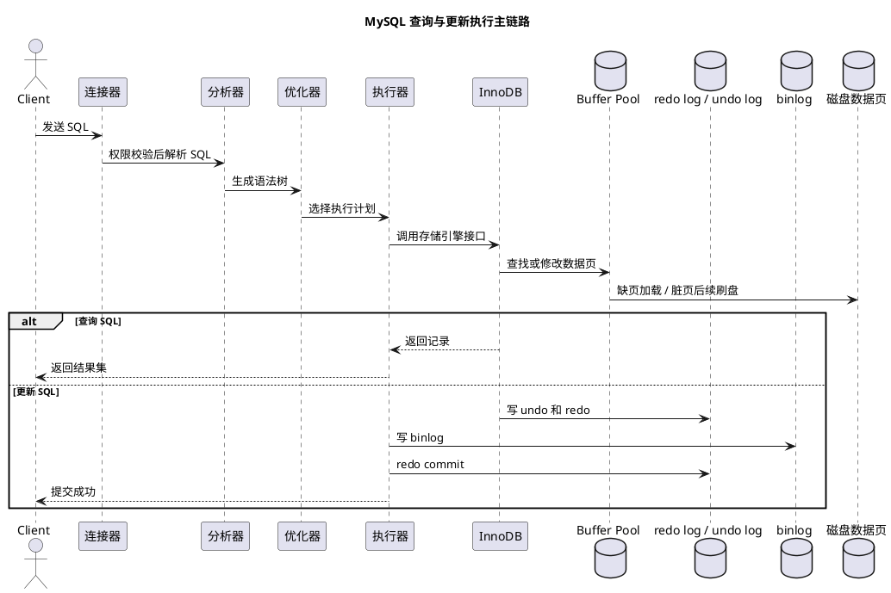
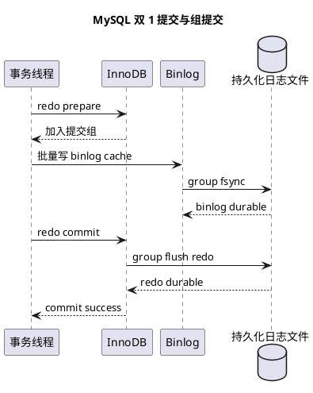

# MySQL 基础架构与 SQL 执行流程

## 问题索引

- Q1：MySQL 基础架构是什么？SQL 执行流程是怎样的？
- Q2：Buffer Pool 刷脏页的时机有哪些？
- Q3：redo log 文件是怎么写的？
- Q4：binlog 日志格式有哪些？
- Q5：说一下 MVCC
- Q6：事务隔离级别有哪些？
- Q7：为什么长事务是性能杀手？
- Q8：MySQL 内存淘汰策略是什么？InnoDB Buffer Pool 如何淘汰页面？
- Q9：MySQL 何时采样统计信息？优化器为什么会选错执行计划，如何纠正？优化器能否预估 Buffer Pool 命中情况？
- Q10：InnoDB 的线性预读和随机预读如何工作？判断的是逻辑顺序还是物理顺序？
- Q11：redo log 和 binlog 如何刷盘？双 1 配置下组提交如何优化，仍有哪些丢失风险？

## Q1：MySQL 基础架构是什么？SQL 执行流程是怎样的？

### 背景

MySQL 执行一条 SQL，不是直接从客户端到磁盘读写数据。中间会经过连接管理、权限校验、SQL 解析、优化器选执行计划、执行器调用存储引擎、事务日志和缓存等多个环节。

面试里问 MySQL 基础架构，重点不是背组件名，而是能把一条查询 SQL 和一条更新 SQL 从入口到落盘讲清楚。

### 总体架构

MySQL 可以分为 Server 层和存储引擎层。

```text
客户端
  -> 连接器
  -> 查询缓存（MySQL 8.0 已移除）
  -> 分析器
  -> 优化器
  -> 执行器
  -> 存储引擎（InnoDB / MyISAM 等）
  -> 磁盘数据与日志
```

### PlantUML 示意图



#### Server 层

Server 层负责 MySQL 的通用能力：

- 连接管理。
- 权限校验。
- SQL 解析。
- SQL 优化。
- 执行计划生成。
- 调用存储引擎接口。
- binlog 记录。

#### 存储引擎层

存储引擎层负责真正的数据存取。

常见存储引擎：

- InnoDB：默认引擎，支持事务、行锁、MVCC、崩溃恢复。
- MyISAM：不支持事务，表锁，历史系统中可能见到。
- Memory：数据在内存中，重启丢失。

实际业务系统里，绝大多数核心表使用 InnoDB。

### 连接器

连接器负责客户端连接、身份认证、权限获取和连接状态维护。

流程大致是：

```text
客户端建立 TCP 连接
  -> 用户名密码认证
  -> 读取用户权限
  -> 创建连接上下文
```

注意点：

- 连接建立后，权限信息通常在连接生命周期内生效。
- 修改用户权限后，已存在连接不一定立刻感知，需要重新连接。
- 长连接可以减少建立连接成本，但长连接太多会占用内存。

业务里通常通过连接池管理连接，例如 Druid、HikariCP。

### 查询缓存

MySQL 8.0 已经移除了查询缓存。

历史上的查询缓存会把 SQL 文本和结果缓存起来，如果表发生更新，相关缓存会失效。

它的问题是：

- 对更新频繁的表命中率低。
- 缓存失效成本高。
- 容易造成额外锁竞争。

所以现代 MySQL 复习中只需要知道它曾经存在，MySQL 8.0 已移除，不要把它当成当前核心流程重点。

### 分析器

分析器主要做两件事：

1. 词法分析

   把 SQL 字符串识别成关键字、表名、字段名、条件等 token。

2. 语法分析

   根据 SQL 语法规则判断 SQL 是否合法，并生成解析树。

例如：

```sql
select id, name from user where id = 1;
```

分析器会识别：

- `select` 是查询关键字。
- `id`、`name` 是字段。
- `user` 是表。
- `where id = 1` 是过滤条件。

如果 SQL 写错，比如：

```sql
select from user;
```

通常会在分析器阶段报语法错误。

### 优化器

优化器负责选择执行计划。

它会判断：

- 使用哪个索引。
- 表连接顺序。
- 条件下推。
- 是否需要排序。
- 是否可以使用覆盖索引。
- 扫描行数估算。

例如：

```sql
select * from user where age = 18 and city = '广州';
```

如果表上有两个索引：

```text
idx_age(age)
idx_city(city)
```

优化器会根据统计信息估算哪个索引过滤效果更好，然后选择成本更低的执行计划。

优化器不一定永远选最优计划，它依赖统计信息和成本估算。如果统计信息不准，可能选错索引。

### 执行器

执行器负责真正执行 SQL。

它会：

- 做权限校验。
- 根据优化器给出的执行计划调用存储引擎接口。
- 获取一行或多行数据。
- 判断 `where` 条件。
- 返回结果给客户端。

执行器和存储引擎之间通过接口交互，Server 层不关心底层数据怎么组织，InnoDB 才关心 B+Tree、Buffer Pool、页、行锁、MVCC 等细节。

### InnoDB 核心组件

#### Buffer Pool

Buffer Pool 是 InnoDB 的内存缓存，用来缓存数据页和索引页。

查询数据时：

```text
先看 Buffer Pool 是否有目标页
  -> 有：直接读内存
  -> 没有：从磁盘加载页到 Buffer Pool
```

更新数据时，也会先修改 Buffer Pool 中的数据页，让页变成脏页，后续再刷盘。

#### redo log

redo log 是 InnoDB 的重做日志，用于保证崩溃恢复能力。

事务提交时，InnoDB 不一定立刻把数据页刷到磁盘，但会按策略写 redo log。

如果数据库宕机，重启后可以根据 redo log 重放已提交事务，保证数据不丢。

#### undo log

undo log 用于事务回滚和 MVCC。

更新一行数据前，InnoDB 会记录旧版本。

作用：

- 事务回滚时恢复旧值。
- 快照读时根据版本链读取历史版本。

#### binlog

binlog 属于 MySQL Server 层，不是 InnoDB 独有。

作用：

- 主从复制。
- 数据恢复。
- Canal 这类订阅工具解析增量数据。

redo log 偏向 InnoDB 崩溃恢复，binlog 偏向复制和逻辑恢复。

### 查询 SQL 执行流程

以查询为例：

```sql
select id, name from user where id = 10;
```

执行流程：

```text
1. 客户端发送 SQL
2. 连接器校验连接和权限
3. 分析器做词法、语法分析
4. 优化器选择执行计划，例如使用主键索引
5. 执行器调用 InnoDB 接口读取数据
6. InnoDB 在 Buffer Pool 中查找数据页
7. 如果页不在内存，从磁盘加载到 Buffer Pool
8. InnoDB 根据索引定位记录并返回给执行器
9. 执行器判断条件并返回结果给客户端
```

如果是主键查询，InnoDB 可以通过聚簇索引直接定位数据。

如果是普通二级索引查询，可能先在二级索引找到主键值，再回表查询聚簇索引。

### 更新 SQL 执行流程

以更新为例：

```sql
update user set name = 'Tom' where id = 10;
```

执行流程：

```text
1. 客户端发送 update SQL
2. 连接器处理连接和权限
3. 分析器解析 SQL
4. 优化器选择执行计划
5. 执行器调用 InnoDB 找到 id = 10 的记录
6. InnoDB 加锁，读取当前记录
7. 写 undo log，保存旧版本，用于回滚和 MVCC
8. 修改 Buffer Pool 中的数据页，形成脏页
9. 写 redo log prepare
10. Server 层写 binlog
11. InnoDB 写 redo log commit
12. 事务提交成功
13. 后台线程后续把脏页刷盘
```

这里最重要的是两阶段提交。

### redo log 和 binlog 两阶段提交

为什么需要两阶段提交？

因为 redo log 和 binlog 属于两套日志：

- redo log：InnoDB 崩溃恢复。
- binlog：Server 层复制和恢复。

如果二者不一致，会出现主库恢复出来的数据和从库复制出来的数据不一致。

两阶段提交大致是：

```text
1. InnoDB 写 redo log prepare
2. Server 写 binlog
3. InnoDB 写 redo log commit
```

如果在不同阶段宕机：

- redo prepare 有、binlog 有：恢复后可以提交。
- redo prepare 有、binlog 无：恢复后回滚。
- redo commit 有：事务已经提交。

这样可以保证 redo log 和 binlog 的一致性。

### 一条 SQL 慢可能慢在哪里

从执行流程倒推，慢 SQL 可能卡在：

1. 连接层

   连接数太多、连接池耗尽、认证或网络慢。

2. 优化器阶段

   统计信息不准、选错索引。

3. 执行阶段

   没走索引、回表太多、扫描行数大、排序和临时表成本高。

4. 存储引擎层

   Buffer Pool 命中率低、磁盘 IO 高、锁等待、事务未提交。

5. 日志刷盘

   redo log、binlog 刷盘策略较严格，磁盘延迟高。

### 排查命令

#### 查看执行计划

```sql
EXPLAIN select id, name from user where id = 10;
```

重点看：

- `type`：访问类型，`const`、`ref`、`range` 通常比 `ALL` 好。
- `key`：实际使用的索引。
- `rows`：预估扫描行数。
- `Extra`：是否出现 `Using filesort`、`Using temporary`。

#### 查看当前连接和执行 SQL

```sql
show processlist;
```

重点看：

- 是否有大量 `Sleep` 连接。
- 是否有长时间执行的 SQL。
- 是否有 `Locked`、`Waiting` 状态。

#### 查看 InnoDB 状态

```sql
show engine innodb status;
```

重点看：

- 死锁信息。
- 锁等待。
- 事务状态。
- Buffer Pool 和 IO 情况。

### 业务场景

在订单查询接口中，如果出现慢查询，可以按执行流程拆：

```text
Java 服务
  -> Druid 连接池是否耗尽
  -> MySQL 连接数是否过高
  -> SQL 是否走索引
  -> 是否发生回表、排序、临时表
  -> InnoDB 是否存在锁等待
  -> redo/binlog 刷盘是否有 IO 抖动
```

这样排查比只盯着 SQL 文本更完整。

### 踩坑点

1. 不要把 MySQL 执行流程说成“解析后直接查磁盘”，中间有优化器、执行器和 Buffer Pool。
2. MySQL 8.0 已移除查询缓存，不要把查询缓存当成重点优化手段。
3. redo log 和 binlog 不是同一个东西，redo 用于崩溃恢复，binlog 用于复制和逻辑恢复。
4. 更新 SQL 不是提交时立即把数据页刷盘，而是先写日志，数据页后续刷盘。
5. 优化器不是绝对正确，统计信息不准时可能选错索引。

### 面试话术

> MySQL 架构可以分为 Server 层和存储引擎层。Server 层包括连接器、分析器、优化器、执行器，并负责 binlog；存储引擎层负责真正的数据存取，常用的是 InnoDB。查询 SQL 进来后，先由连接器处理连接和权限，再经过分析器做词法语法分析，优化器选择索引和执行计划，执行器调用 InnoDB 读取数据。InnoDB 会优先从 Buffer Pool 找数据页，没有再读磁盘。更新 SQL 除了找到记录并修改 Buffer Pool，还会写 undo log、redo log，并由 Server 层写 binlog。为了保证 redo log 和 binlog 一致，MySQL 使用两阶段提交：redo prepare、写 binlog、redo commit。

## Q2：Buffer Pool 刷脏页的时机有哪些？

### 背景

InnoDB 更新数据时，不会每次事务提交都立刻把数据页写回磁盘，而是先修改 Buffer Pool 中的数据页，让它变成脏页。

脏页指的是：

```text
内存中的数据页内容
  !=
磁盘上的数据页内容
```

只要 redo log 已经保证崩溃恢复能力，脏页就可以延迟刷盘。这样能把随机写变成更可控的后台写，提高性能。

### 刷脏页的主要时机

#### redo log 空间不足

redo log 是循环写的。如果写入速度很快，checkpoint 推进太慢，redo log 可用空间会越来越少。

当 redo log 空间不足时，InnoDB 必须推进 checkpoint，把一部分脏页刷到磁盘。

流程可以理解为：

```text
redo log 快写满
  -> 需要覆盖旧 redo log 空间
  -> 旧 redo log 对应的脏页必须先刷盘
  -> checkpoint 向前推进
  -> redo log 获得可复用空间
```

这个场景可能影响前台 SQL，因为系统必须腾出 redo log 空间。

#### Buffer Pool 空闲页不足

查询新数据页时，如果 Buffer Pool 中没有目标页，需要从磁盘加载新页。

如果 Buffer Pool 空闲页不足，就需要淘汰一些页：

- 干净页可以直接淘汰。
- 脏页必须先刷盘，再淘汰。

所以 Buffer Pool 空间紧张时，也会触发刷脏页。

#### 后台线程周期性刷盘

InnoDB 后台线程会定期刷一批脏页，避免脏页堆积过多。

这类刷盘通常是异步的，目的是让系统保持稳定，而不是等 redo log 快满或 Buffer Pool 不够时才被迫刷。

#### MySQL 正常关闭

MySQL 正常关闭时，会尽量把脏页刷回磁盘。

这样下次启动时，需要通过 redo log 恢复的数据更少，启动恢复更快。

#### 脏页比例过高

InnoDB 会根据脏页比例、redo log 生成速度、IO 能力等因素调整刷盘速度。

如果脏页比例过高，说明内存中有大量未落盘修改，系统会加快刷脏页，避免后续突然被迫大量刷盘。

### 业务影响

刷脏页太集中时，可能出现：

- SQL 响应时间抖动。
- 磁盘 IO 飙高。
- redo log 空间紧张导致前台写入变慢。
- Buffer Pool 命中率下降或页淘汰压力变大。

线上排查可以关注：

```sql
show engine innodb status;
```

重点看：

- Buffer Pool 脏页情况。
- pending writes。
- checkpoint 推进情况。
- IO 读写压力。

### 面试话术

> Buffer Pool 刷脏页不是每次事务提交都刷数据页。InnoDB 更新时先改内存页并写 redo log，数据页后续再刷盘。常见刷脏页时机包括 redo log 空间不足需要推进 checkpoint、Buffer Pool 空闲页不足需要淘汰脏页、后台线程周期性刷盘、脏页比例过高以及 MySQL 正常关闭。刷脏页如果过于集中，会带来磁盘 IO 抖动和 SQL 延迟抖动。

## Q3：redo log 文件是怎么写的？

### 背景

redo log 是 InnoDB 的物理重做日志，用来保证事务提交后即使数据库宕机，也能恢复已经提交的修改。

它记录的不是 SQL 原文，而是类似：

```text
对某个表空间、某个数据页、某个偏移量做了什么修改
```

所以 redo log 更偏物理层，适合崩溃恢复。

### redo log 写入路径

redo log 写入大致经过三个位置：

```text
redo log buffer
  -> OS page cache
  -> redo log file
```

事务执行过程中，redo 先写入内存中的 redo log buffer。

事务提交时，根据 `innodb_flush_log_at_trx_commit` 参数决定是否立刻写文件、是否立刻刷盘。

### innodb_flush_log_at_trx_commit

| 值 | 行为 | 可靠性 | 性能 |
| --- | --- | --- | --- |
| 1 | 每次提交都 write + fsync | 最高 | 较低 |
| 2 | 每次提交 write，每秒 fsync | 较高，操作系统宕机可能丢 | 较好 |
| 0 | 每秒 write + fsync | 可能丢 1 秒事务 | 最好 |

解释一下：

- `write`：把 redo log 从 MySQL 进程写到操作系统 page cache。
- `fsync`：强制把操作系统 page cache 中的数据刷到磁盘。

生产核心交易库一般更偏向 `1`，保证事务持久性；对性能要求高且能接受少量丢失的场景，才可能考虑其他值。

### redo log 循环写

redo log 文件是固定大小的一组文件，采用循环写。

可以用两个关键位置理解：

```text
write pos：当前写入位置
checkpoint：已经刷盘的数据页对应的安全位置
```

示意：

```text
[checkpoint ........ write pos]
```

- `write pos` 向前推进，表示新的 redo 不断写入。
- `checkpoint` 向前推进，表示对应脏页已经刷盘，旧 redo 可以被覆盖。
- 如果 `write pos` 追上 `checkpoint`，说明 redo 空间不够，需要刷脏页推进 checkpoint。

### 为什么 redo log 是顺序写

直接把数据页刷盘可能是随机写，因为数据页分散在磁盘不同位置。

redo log 是追加写、顺序写，性能更好。事务提交时先保证 redo 持久化，数据页可以后续慢慢刷盘。

这就是 WAL，Write-Ahead Logging：

```text
先写日志
再写数据页
```

### 和两阶段提交的关系

更新 SQL 提交时，redo log 和 binlog 要通过两阶段提交保持一致：

```text
1. redo log prepare
2. 写 binlog
3. redo log commit
```

如果宕机恢复时发现 redo 是 prepare 状态，就要看 binlog 是否完整：

- binlog 存在且完整：提交。
- binlog 不存在：回滚。

### 面试话术

> redo log 是 InnoDB 的物理重做日志，先写入 redo log buffer，再根据 `innodb_flush_log_at_trx_commit` 决定提交时是否 write 和 fsync 到 redo log 文件。redo log 文件是固定大小循环写的，通过 write pos 和 checkpoint 控制可写空间。write pos 表示当前写到哪里，checkpoint 表示哪些脏页已经刷盘、对应 redo 可以覆盖。如果 write pos 追上 checkpoint，就要刷脏页推进 checkpoint。redo log 的核心价值是 WAL，先顺序写日志保证崩溃恢复，再异步刷数据页。

## Q4：binlog 日志格式有哪些？

### 背景

binlog 是 MySQL Server 层的二进制日志，主要用于主从复制、数据恢复和增量订阅。

它记录的是逻辑层面的变更，不属于 InnoDB 独有。

你写的 “bing log” 一般面试里应说成 `binlog`。

### 三种格式

#### Statement

Statement 格式记录原始 SQL。

例如：

```sql
update user set age = age + 1 where id = 10;
```

优点：

- 日志量小。
- 可读性相对更好。

缺点：

- 某些 SQL 在主从上可能执行结果不一致。
- 依赖执行上下文，例如函数、时间、随机数、执行顺序。

例如：

```sql
update user set code = uuid() where id = 10;
```

如果从库重新执行 SQL，生成的 `uuid()` 可能和主库不同。

#### Row

Row 格式记录每一行变更前后的数据。

例如一条 update 修改了 10 行，binlog 会记录这 10 行分别怎么变。

优点：

- 主从复制更安全，结果更确定。
- Canal 等工具更容易解析行级变更。

缺点：

- 日志量可能很大。
- 批量更新大量行时，binlog 体积明显增加。

#### Mixed

Mixed 格式是 Statement 和 Row 的混合。

MySQL 会根据 SQL 是否可能导致不一致，自动选择使用 Statement 或 Row。

简单 SQL 可能用 Statement；存在不确定性的 SQL 可能切到 Row。

### 实际选择

现代业务系统中更常见的是 Row 格式。

原因：

- 主从一致性更可靠。
- 便于 Canal、Debezium 等增量订阅工具消费。
- 能清楚知道哪些行发生了变化。

如果系统使用 Canal 同步 MySQL 到 ES，通常要求 binlog 为 Row 格式，并开启完整行镜像。

### binlog_row_image

Row 格式下还要关注 `binlog_row_image`：

| 值 | 含义 |
| --- | --- |
| `FULL` | 记录完整行数据 |
| `MINIMAL` | 只记录必要列 |
| `NOBLOB` | blob/text 等大字段未变化时不记录 |

Canal 等数据同步场景通常更喜欢 `FULL`，因为消费端能拿到完整数据，处理逻辑更简单。

### 面试话术

> binlog 是 Server 层日志，主要用于主从复制、数据恢复和增量订阅。它有三种格式：Statement 记录原始 SQL，日志量小但可能因为函数、时间、随机数等导致主从不一致；Row 记录每行数据的变化，复制结果更可靠，但日志量更大；Mixed 是二者混合，由 MySQL 根据 SQL 特点选择格式。现在业务系统和 Canal 同步场景更常用 Row 格式，配合 `binlog_row_image=FULL`，便于保证一致性和解析行级变更。

## Q5：说一下 MVCC

### 背景

MVCC，全称 Multi-Version Concurrency Control，多版本并发控制。

它解决的问题是：

```text
读写并发时，读不要轻易阻塞写，写也不要轻易阻塞读。
```

InnoDB 通过 MVCC 让普通 `select` 快照读可以读取某个历史版本，而不是必须等待正在修改数据的事务提交。

### 核心组成

InnoDB 的 MVCC 主要依赖：

- 隐藏字段。
- undo log 版本链。
- Read View。

#### 隐藏字段

InnoDB 每行记录中有几个隐藏字段，重点理解：

- `trx_id`：最近一次修改这行记录的事务 ID。
- `roll_pointer`：指向 undo log 中上一个历史版本。

可以理解为：

```text
当前记录
  -> undo 旧版本 1
  -> undo 旧版本 2
  -> undo 旧版本 3
```

这条链就是版本链。

#### undo log 版本链

当事务更新一行数据时，InnoDB 会把旧值写入 undo log，并让当前记录通过 `roll_pointer` 指向旧版本。

例如：

```text
事务 T10：name = 'A'
事务 T20：name = 'B'
事务 T30：name = 'C'
```

版本链可以理解为：

```text
当前版本 name='C', trx_id=30
  -> name='B', trx_id=20
  -> name='A', trx_id=10
```

快照读会根据 Read View 判断哪个版本对当前事务可见。

#### Read View

Read View 是快照读时生成的一致性视图。

它里面核心信息包括：

- 当前活跃事务 ID 列表。
- 当前活跃事务中的最小事务 ID。
- 下一个将要分配的事务 ID。
- 当前事务 ID。

判断规则可以简化为：

```text
某行版本的 trx_id 小于活跃事务最小 ID
  -> 说明这个版本在 Read View 创建前已经提交，可见

某行版本的 trx_id 大于等于下一个事务 ID
  -> 说明这个版本在 Read View 创建后才出现，不可见

某行版本的 trx_id 在活跃事务列表中
  -> 说明创建 Read View 时该事务还没提交，不可见

否则
  -> 说明创建 Read View 时该事务已经提交，可见
```

如果当前版本不可见，就沿着 undo log 版本链继续找旧版本。

### RC 和 RR 下 Read View 的区别

MVCC 和隔离级别关系很紧。

#### Read Committed

RC 下，每次快照读都会生成新的 Read View。

所以同一个事务内，两次查询可能看到不同结果：

```text
第一次 select 生成 Read View 1
其他事务提交修改
第二次 select 生成 Read View 2
第二次能看到新提交的数据
```

这就是不可重复读可能发生的原因。

#### Repeatable Read

RR 下，事务内第一次快照读生成 Read View，后续快照读复用这个 Read View。

所以同一个事务内多次普通 select 看到的是一致快照。

这就是 InnoDB 在 RR 下能解决不可重复读的关键。

### 快照读和当前读

MVCC 主要服务于快照读。

快照读：

```sql
select * from user where id = 10;
```

读取的是符合 Read View 的历史版本，不加锁或少加锁。

当前读：

```sql
select * from user where id = 10 for update;
update user set name = 'Tom' where id = 10;
delete from user where id = 10;
```

读取的是最新已提交版本，并且通常需要加锁。

所以不要把所有 select 都简单理解成 MVCC 快照读。带锁查询和更新删除属于当前读。

### 业务场景

订单查询接口通常是普通快照读，可以利用 MVCC 在写订单状态时仍然提供一致读取。

但订单支付、库存扣减这类场景不能只靠快照读，需要当前读或显式加锁，避免基于旧版本做业务决策。

例如：

```sql
select stock from product where id = 1 for update;
```

这里使用当前读并加锁，是为了拿到最新库存并阻止其他事务同时修改。

### 踩坑点

1. MVCC 不是不加锁解决所有并发问题，它主要解决快照读的一致性。
2. RR 下普通 select 通常复用第一次 Read View，但当前读仍然读最新版本。
3. undo log 不能无限清理，长事务会阻碍历史版本回收。
4. 当前读、间隙锁、临键锁和 MVCC 要一起理解，才能解释幻读问题。

### 面试话术

> MVCC 是 InnoDB 的多版本并发控制，用来提升读写并发能力。它主要依赖隐藏字段、undo log 版本链和 Read View。每行记录有事务 ID 和回滚指针，更新时旧版本写入 undo log，形成版本链。普通 select 进行快照读时，会根据 Read View 判断哪个版本可见；如果当前版本不可见，就沿 undo 版本链向前找。RC 下每次 select 都生成新的 Read View，所以可能不可重复读；RR 下事务内第一次快照读生成 Read View，后续复用，所以能保证普通快照读的可重复读。需要注意，MVCC 主要作用于快照读，`for update`、update、delete 属于当前读，会读取最新版本并加锁。

## Q6：事务隔离级别有哪些？

### 背景

事务隔离级别解决的是多个事务并发读写同一批数据时，彼此应该“看见”到什么程度。

隔离级别越高，并发异常越少，但锁冲突和性能成本通常越高。

常见并发问题：

| 问题 | 含义 |
| --- | --- |
| 脏读 | 读到了其他事务尚未提交的数据 |
| 不可重复读 | 同一事务内两次读取同一行，结果不同 |
| 幻读 | 同一事务内两次范围查询，结果集行数不同 |

### 四种隔离级别

#### Read Uncommitted

读未提交。

一个事务可以读到其他事务还没提交的数据。

问题：

- 可能出现脏读。
- 基本很少在业务系统中使用。

示例：

```text
T1 修改 user.name = 'Tom'，但未提交
T2 查询 user.name，看到 'Tom'
T1 回滚
T2 刚才读到的就是脏数据
```

#### Read Committed

读已提交，简称 RC。

一个事务只能读到其他事务已经提交的数据。

能解决：

- 脏读。

仍可能出现：

- 不可重复读。
- 幻读。

在 InnoDB 中，RC 下每次普通 `select` 都会生成新的 Read View。

```text
T1 第一次 select，生成 Read View 1
T2 修改并提交
T1 第二次 select，生成 Read View 2
T1 能看到 T2 已提交的新结果
```

所以 RC 下同一事务内两次查询可能结果不同。

#### Repeatable Read

可重复读，简称 RR。

这是 MySQL InnoDB 默认隔离级别。

能解决：

- 脏读。
- 不可重复读。

在 InnoDB 中，RR 下普通快照读会在事务内复用第一次生成的 Read View。

```text
T1 第一次普通 select，生成 Read View
T2 修改并提交
T1 第二次普通 select，仍复用第一次 Read View
T1 看不到 T2 后提交的修改
```

注意：

- 普通 `select` 是快照读，走 MVCC。
- `select ... for update`、`update`、`delete` 是当前读，读最新版本并加锁。

InnoDB 在 RR 下还会通过 next-key lock，也就是记录锁 + 间隙锁，减少当前读场景下的幻读问题。

#### Serializable

串行化。

最高隔离级别，把并发事务尽量变成串行执行。

特点：

- 隔离性最强。
- 并发性能最差。
- 锁冲突明显增加。

一般业务系统很少全局使用 Serializable，除非对一致性要求极高且并发量可控。

### 隔离级别对比

| 隔离级别 | 脏读 | 不可重复读 | 幻读 | 说明 |
| --- | --- | --- | --- | --- |
| Read Uncommitted | 可能 | 可能 | 可能 | 几乎不用 |
| Read Committed | 避免 | 可能 | 可能 | Oracle、PostgreSQL 常用默认级别 |
| Repeatable Read | 避免 | 避免 | 标准定义下可能；InnoDB 通过 MVCC + next-key lock 缓解 | MySQL InnoDB 默认 |
| Serializable | 避免 | 避免 | 避免 | 并发性能最低 |

### MySQL 中查看和设置隔离级别

查看当前会话隔离级别：

```sql
select @@transaction_isolation;
```

查看全局隔离级别：

```sql
select @@global.transaction_isolation;
```

设置当前会话隔离级别：

```sql
set session transaction isolation level read committed;
```

设置下一个事务的隔离级别：

```sql
set transaction isolation level repeatable read;
```

设置全局隔离级别：

```sql
set global transaction isolation level read committed;
```

注意：

- 全局设置通常只影响新连接。
- 连接池场景下要注意连接复用，避免会话级设置污染后续请求。

### RC 和 RR 的核心差异

最常问的是 RC 和 RR。

核心差异不是简单说“RR 更严格”，而是：

```text
RC：每次快照读都生成新的 Read View
RR：事务内第一次快照读生成 Read View，后续复用
```

因此：

- RC 能看到其他事务在本事务期间新提交的数据。
- RR 的普通快照读看的是事务开始后的同一个一致性视图。

### 幻读怎么理解

幻读强调的是范围查询结果集变化。

例如：

```text
T1 查询 age > 18 的用户，有 10 条
T2 插入一条 age = 20 的用户并提交
T1 再次查询 age > 18，变成 11 条
```

这就是幻读。

在 InnoDB RR 下：

- 普通快照读：因为复用 Read View，通常看不到新插入记录。
- 当前读：需要通过 next-key lock 锁住记录和间隙，防止其他事务插入满足条件的新记录。

所以回答时要区分：

```text
快照读靠 MVCC 解决一致性视图
当前读靠锁，尤其是 next-key lock，防止范围内插入
```

### 业务场景

订单列表查询、报表查询通常使用默认 RR 或 RC 都可以，关键看是否需要同一事务内多次查询结果一致。

库存扣减、账户余额变更这类场景，不能只依赖快照读：

```sql
select stock
from product
where id = 1001
for update;
```

这里使用当前读并加锁，是为了读取最新库存并阻塞其他并发修改。

如果只是普通快照读，可能基于旧库存做判断，导致超卖风险。

### 踩坑点

1. 不要说 MySQL RR 绝对完全没有幻读，要说明 InnoDB 通过 MVCC 和 next-key lock 在快照读、当前读场景分别处理。
2. RC 和 RR 的关键差异是 Read View 生成时机。
3. 当前读不走旧快照，会读最新版本并加锁。
4. 隔离级别越高不一定越好，高隔离会带来更多锁等待和吞吐下降。
5. 连接池里临时修改隔离级别要谨慎，避免连接复用导致后续请求继承错误级别。

### 面试话术

> 事务隔离级别有四种：读未提交、读已提交、可重复读和串行化。读未提交可能脏读，基本不用；读已提交能避免脏读，但可能不可重复读和幻读；可重复读能避免脏读和不可重复读，是 MySQL InnoDB 默认级别；串行化隔离性最强但并发性能最差。InnoDB 中 RC 和 RR 的关键区别是 Read View 生成时机：RC 每次快照读都生成新的 Read View，所以能看到其他事务新提交的数据；RR 是事务内第一次快照读生成 Read View，后续复用，所以普通 select 能可重复读。对于幻读，InnoDB 在 RR 下普通快照读靠 MVCC 的一致性视图，当前读靠 next-key lock 约束范围插入。

## Q7：为什么长事务是性能杀手？

### 背景

长事务指一个事务开启后很久不提交、不回滚，可能是业务代码里事务范围过大，也可能是客户端开启事务后挂起、慢 SQL 卡住、批处理一次处理太多数据。

典型例子：

```sql
START TRANSACTION;

SELECT *
FROM orders
WHERE user_id = 1001;

-- 中间做远程 RPC、调用三方接口、处理大批量数据，事务一直没有提交。

UPDATE orders
SET status = 'PAID'
WHERE id = 1;

COMMIT;
```

问题不在于事务“长”这个词本身，而在于它长期占住了数据库里的版本、锁、连接和元数据资源。

### 核心原理

#### 1. 长事务会让 undo log 版本链无法及时清理

InnoDB 的 MVCC 依赖 undo log 保存历史版本。只要还有老事务可能需要读取旧版本，purge 线程就不能清理这些 undo。

例如：

```text
T1 开启事务，并创建 Read View
T2、T3、T4 持续更新同一批数据并提交
T1 迟迟不提交
```

因为 T1 的 Read View 还可能读取旧版本，所以这些历史版本不能被清理。

影响：

- undo log 持续膨胀。
- 历史版本链变长。
- 快照读沿 undo 链查历史版本的成本变高。
- purge 跟不上时，磁盘和 IO 压力上升。

这也是为什么长事务常和 `history list length` 持续升高一起出现。

#### 2. 长事务会长期持有行锁，放大锁等待

如果长事务里执行了 `update/delete/select ... for update`，相关行锁要等事务提交或回滚后才释放。

```sql
START TRANSACTION;

UPDATE account
SET balance = balance - 100
WHERE user_id = 1001;

-- 事务未提交之前，其他事务修改 user_id = 1001 会等待。
```

影响：

- 其他事务被阻塞。
- 锁等待堆积。
- 连接池被占满。
- 严重时出现死锁或接口雪崩。

如果 SQL 没有命中合适索引，更新扫描范围大，还可能锁住大量记录或间隙，让影响面变得更大。

#### 3. 长事务会占用连接和事务上下文

事务通常绑定在一个数据库连接上。事务不结束，连接就不能正常回到连接池服务其他请求。

业务侧表现：

- 接口线程阻塞。
- 连接池活跃连接数升高。
- 新请求拿不到连接。
- 数据库并发连接数升高。

所以长事务不仅伤数据库，也会反向拖垮应用连接池。

#### 4. 长事务可能阻塞 DDL 的 MDL

MySQL 执行 SQL 会涉及 MDL 元数据锁。普通查询会持有 MDL 读锁，DDL 需要 MDL 写锁。

如果一个长事务执行过某张表的查询并迟迟不提交，后续对这张表执行 `ALTER TABLE` 可能拿不到 MDL 写锁。

更麻烦的是：

```text
长事务持有 MDL 读锁
DDL 等待 MDL 写锁
后续新的查询也可能排在 DDL 后面等待
```

结果就是一次看似普通的 DDL，可能把整张表的读写都堵住。

#### 5. 长事务会影响主从复制和备份

长事务提交时可能一次性产生大量 binlog，主从复制需要回放这些变更。

影响：

- 从库 SQL 线程回放压力变大。
- 主从延迟升高。
- 大事务回滚成本高。
- 逻辑备份或一致性备份需要维持更久的一致性视图，进一步延长 undo 保留时间。

### 如何发现长事务

#### 查看当前事务

```sql
SELECT
  trx_id,
  trx_state,
  trx_started,
  TIMESTAMPDIFF(SECOND, trx_started, NOW()) AS trx_seconds,
  trx_mysql_thread_id,
  trx_query
FROM information_schema.innodb_trx
ORDER BY trx_started;
```

关注：

- `trx_started`：事务开始时间。
- `trx_seconds`：事务已经持续多久。
- `trx_state`：是否处于 RUNNING、LOCK WAIT。
- `trx_query`：当前执行的 SQL，可能为空，说明事务空闲但未提交。

#### 查看锁等待

```sql
SELECT *
FROM performance_schema.data_lock_waits;
```

关注：

- 谁阻塞谁。
- 被阻塞的对象是哪张表、哪个索引、哪条记录。
- 是否存在一个老事务阻塞大量新事务。

#### 查看 InnoDB 状态

```sql
SHOW ENGINE INNODB STATUS;
```

关注：

- `TRANSACTIONS` 部分。
- `History list length` 是否持续升高。
- 是否有长时间活跃事务。
- 是否有锁等待和死锁信息。

### 业务场景

#### 订单支付事务里调用外部接口

错误做法：

```text
开启事务
  更新订单状态
  调用支付渠道接口
  写支付流水
提交事务
```

问题：

- 外部接口耗时不可控。
- 事务期间订单行锁一直持有。
- 支付渠道抖动会把数据库事务拖成长事务。

更合理的做法：

```text
先调用支付渠道或先落本地支付请求
短事务内更新订单和流水
提交后通过 MQ 推动后续流程
```

#### 批量导入一次提交几十万行

问题：

- undo/redo/binlog 暴涨。
- 锁持有时间长。
- 回滚代价极高。

优化：

- 分批提交，例如每 500 或 1000 条提交一次。
- 用业务批次号保证幂等和可恢复。
- 失败时从批次进度继续处理。

### 解决方案

- 事务里不要调用 RPC、HTTP、MQ 同步等待、文件上传等慢操作。
- 控制事务范围，只把必须原子提交的 SQL 放进事务。
- 大批量更新拆批提交。
- 给事务设置超时，例如 Spring `@Transactional(timeout = 5)`。
- 给连接池和数据库设置合理超时，避免空闲事务长期挂住。
- 慢 SQL 先优化，再放入事务，否则慢 SQL 会扩大事务持有时间。
- DDL 前检查长事务，避免被 MDL 阻塞。
- 监控 `information_schema.innodb_trx`、`History list length`、锁等待、主从延迟。

### 面试话术

> 长事务是性能杀手，主要因为它长期占用数据库里的版本、锁、连接和元数据资源。InnoDB 的 MVCC 依赖 undo log，只要长事务的 Read View 还存在，很多历史版本就不能被 purge 清理，导致 undo 膨胀、版本链变长，查询历史版本成本上升。如果长事务执行过更新或当前读，还会长期持有行锁，造成锁等待和连接堆积。另外，长事务可能持有 MDL 读锁，导致 DDL 等待，甚至阻塞后续查询。大事务提交还会产生大量 redo/binlog，影响刷盘、恢复和主从复制。所以实践中要缩小事务范围，不在事务里做外部调用，大批量操作分批提交，并监控 innodb_trx、history list length 和锁等待。

## Q8：MySQL 内存淘汰策略是什么？InnoDB Buffer Pool 如何淘汰页面？

### 背景

MySQL 的“内存淘汰”不能按 Redis 的 `maxmemory-policy` 去理解。InnoDB 最核心的内存结构是 Buffer Pool，它缓存的是数据页、索引页、undo 页等。

当 Buffer Pool 空间不足，需要读入新页时，InnoDB 要从内存中选择一些页淘汰或刷盘后复用。

### Buffer Pool 的三个核心链表

| 链表 | 作用 |
| --- | --- |
| Free List | 空闲页链表，存放还没有被使用的缓存页 |
| LRU List | 缓存页淘汰链表，用来决定哪些页更可能被淘汰 |
| Flush List | 脏页链表，记录被修改过但还没刷盘的页 |

页面状态：

| 页面 | 含义 |
| --- | --- |
| 空闲页 | 还没有承载数据 |
| 干净页 | 内存内容和磁盘一致 |
| 脏页 | 内存内容比磁盘新，需要先刷盘 |

干净页可以直接淘汰复用；脏页不能直接丢弃，必须先刷盘。

### 为什么不是简单 LRU

普通 LRU 是：

```text
最近访问放头部
最久未访问在尾部
淘汰尾部
```

但数据库如果直接这么做，会被全表扫描污染。

例如：

```sql
SELECT * FROM large_order_table;
```

这个查询可能把大量只访问一次的数据页读入 Buffer Pool。如果这些页全部进入 LRU 头部，就会把真正的热点页挤出去。

所以 InnoDB 使用的是改进 LRU。

### 改进 LRU：young 区和 old 区

InnoDB 把 LRU List 分成两个区域：

```text
young 区：热点页
old 区：新读入或不够热的页
```

结构可以理解为：

```text
LRU Head
  -> young 区
  -> old 区
LRU Tail
```

新读入的页不会直接放到 LRU 头部，而是放到 old 区的头部，也就是 LRU 链表中间位置。

这样全表扫描读入的大量页面先进入 old 区，不会马上挤掉 young 区里的热点页。

### 页面如何晋升

一个页第一次被读入：

```text
进入 old 区
```

如果后续再次访问，并且满足时间条件，才可能晋升到 young 区。

相关参数：

| 参数 | 作用 |
| --- | --- |
| `innodb_old_blocks_pct` | old 区占 LRU 的比例 |
| `innodb_old_blocks_time` | 页进入 old 区后，多长时间内访问不晋升 young 区 |

`innodb_old_blocks_time` 是为了防止全表扫描时，刚读入的页被立刻访问，就被误判为热点。

### 淘汰流程

当需要加载新页时：

```text
先看 Free List 是否有空闲页
  -> 有：直接使用
  -> 没有：从 LRU 尾部找可淘汰页
      -> 干净页：直接淘汰复用
      -> 脏页：先刷盘，再复用
```

如果 LRU 尾部有大量脏页，前台 SQL 可能等待刷盘，导致响应时间抖动。

### 脏页刷盘和淘汰的关系

脏页刷盘触发包括：

- 后台 Page Cleaner 刷脏。
- checkpoint 推进。
- redo log 空间压力。
- Buffer Pool 空闲页不足。
- MySQL 正常关闭。

所以 Buffer Pool 淘汰和刷脏页是关联的。内存不是简单“删掉页”就完事，脏页要先保证数据安全落盘。

### 如何观察

常用命令：

```sql
SHOW ENGINE INNODB STATUS\G
```

关注：

```text
Buffer pool hit rate
Free buffers
Database pages
Modified db pages
Pages made young
Pages not made young
```

也可以看状态变量：

```sql
SHOW GLOBAL STATUS LIKE 'Innodb_buffer_pool%';
```

关注：

| 指标 | 含义 |
| --- | --- |
| `Innodb_buffer_pool_reads` | 从磁盘读取页次数 |
| `Innodb_buffer_pool_read_requests` | 逻辑读请求 |
| `Innodb_buffer_pool_pages_dirty` | 当前脏页数量 |
| `Innodb_buffer_pool_pages_free` | 空闲页数量 |

命中率可以近似理解为：

```text
1 - Innodb_buffer_pool_reads / Innodb_buffer_pool_read_requests
```

### 和 Redis 淘汰策略的区别

| 维度 | Redis | MySQL InnoDB |
| --- | --- | --- |
| 缓存对象 | key/value | 数据页、索引页 |
| 淘汰策略 | LRU、LFU、TTL、random 等 | 改进 LRU |
| 脏页问题 | 通常不按页管理 | 脏页必须先刷盘 |
| 淘汰目标 | 释放内存 | 腾出 Buffer Pool 页 |
| 一致性定位 | 常作为缓存 | 存储引擎真实数据页缓存 |

### 踩坑点

- 把 MySQL 内存淘汰理解成 Redis 的淘汰策略。
- Buffer Pool 太小，热点页频繁被淘汰。
- 大查询、全表扫描导致 Buffer Pool 污染。
- 脏页过多，前台 SQL 被迫等待刷盘。
- 只看命中率，不看脏页比例、空闲页和刷脏压力。

### 面试话术

> MySQL InnoDB 的内存淘汰主要指 Buffer Pool 页面淘汰。Buffer Pool 里有 Free List、LRU List 和 Flush List。普通 LRU 会被全表扫描污染，所以 InnoDB 使用改进 LRU，把链表分成 young 区和 old 区，新读入的页先放到 old 区，只有经过一定时间后再次访问，才可能晋升到 young 区，避免一次性扫描把热点页挤掉。当 Free List 没有空闲页时，InnoDB 会从 LRU 尾部找页面淘汰；干净页可以直接复用，脏页必须先刷盘再复用。因此 Buffer Pool 淘汰和刷脏页强相关，脏页太多可能导致前台 SQL 等待刷盘。

## Q9：MySQL 何时采样统计信息？优化器为什么会选错执行计划，如何纠正？优化器能否预估 Buffer Pool 命中情况？

### 背景

MySQL 优化器不是通过实际执行所有候选方案来选择最快计划，而是根据统计信息估算每个方案的扫描行数、回表次数、排序成本和连接成本，再选择估算成本最低的执行计划。

因此，所谓“优化器选错计划”，通常不是优化器随机出错，而是：

~~~text
统计信息或数据模型不够准确
  -> 行数和选择性估算偏差
  -> 成本估算偏差
  -> 选择了实际更慢的执行计划
~~~

除了表行数和索引选择性，优化器还会把候选表或索引当前有多少页面驻留在 Buffer Pool 中作为读取成本的输入。但它估算的是“相关表或索引的内存驻留比例”，不是预测本次 SQL 将获得一个精确的 Buffer Pool 命中率。

### 统计信息、执行计划和运行指标的关系

~~~plantuml
@startuml
title MySQL 执行计划估算与纠正闭环
database "真实数据分布" as Data
component "统计信息采样" as Stats
component "基数与选择性估算" as Estimate
database "Buffer Pool\n索引页驻留" as BufferPool
component "表/索引内存驻留比例" as InMemory
component "成本模型" as Cost
component "执行计划" as Plan
component "EXPLAIN ANALYZE\n估算值与实际值" as Analyze
component "ANALYZE/直方图/索引/SQL" as Fix

Data -> Stats
Stats -> Estimate
Estimate -> Cost
BufferPool -> InMemory : 当前缓存页占比
InMemory -> Cost : 内存读与磁盘读加权
Cost -> Plan
Plan -> Analyze
Analyze -> Fix : 发现估算偏差
Fix -> Stats : 更新统计信息
Fix -> Plan : 改变可选路径
@enduml
~~~

要分清两类问题：

- 估算问题：优化器预计扫描 100 行，实际扫描 100 万行。
- 读取成本问题：估算行数基本正确，但优化时看到的内存驻留比例与执行期间的真实访问页、并发淘汰和磁盘延迟存在差异。

### MySQL 统计信息包含什么

InnoDB 优化器常用信息包括：

- 表的大致行数。
- 聚簇索引和二级索引占用页数。
- 索引基数，即不同值数量估计。
- 联合索引不同前缀的基数。
- 列值分布直方图。
- NULL 比例、值域和索引选择性等信息。

MySQL 8.x 默认使用持久化 InnoDB 统计信息，主要存放在：

~~~text
mysql.innodb_table_stats
mysql.innodb_index_stats
~~~

这些数据是估算结果，不是每条 SQL 执行前对整张表进行精确 COUNT 或 DISTINCT。

### 数据采样发生在什么时机

#### 1. 自动重新计算

持久化统计信息启用后，`innodb_stats_auto_recalc` 默认开启。MySQL 8.4 官方口径是：当表中超过约 10% 的行发生变化时，InnoDB 会在后台安排统计信息重新计算。

需要注意：

- 这是后台异步重算，不保证 DML 完成后立即更新。
- 官方文档明确说明可能延迟数秒。
- 10% 是触发重算的变化规模，不代表每修改 10% 就同步阻塞当前事务完成采样。
- 大表即使只变化不到 10%，也可能已经新增数百万行，旧统计信息仍可能影响关键 SQL。

可以查看配置：

~~~sql
-- 查看是否启用持久化统计信息和自动重算。
SHOW VARIABLES LIKE 'innodb_stats_persistent';
SHOW VARIABLES LIKE 'innodb_stats_auto_recalc';
SHOW VARIABLES LIKE 'innodb_stats_persistent_sample_pages';
~~~

#### 2. 手动执行 ANALYZE TABLE

当需要立即刷新统计信息时，执行：

~~~sql
-- 同步重新计算 orders 表的索引统计信息。
ANALYZE TABLE orders;
~~~

适合以下时机：

- 批量导入、归档或清理大量数据后。
- 数据分布发生明显变化后。
- 新增或调整索引后，需要重新验证执行计划。
- 发布后发现 EXPLAIN 估算行数和实际行数差异很大。
- `innodb_stats_auto_recalc` 被关闭时。
- 逻辑迁移、数据恢复或分区数据切换后。

`ANALYZE TABLE` 是前台同步操作，并涉及元数据锁、采样 IO 和统计信息更新。大表应在低峰期评估执行，不要把它作为每隔几分钟无差别执行的固定任务。

#### 3. 采样页数量决定估算精度

InnoDB 不会扫描整个索引来计算每个基数，而是对部分索引页进行随机采样，也称 random dive。

MySQL 8.4 中 `innodb_stats_persistent_sample_pages` 默认值为 20。采样页越少，速度越快，但数据分布不均时误差可能越大；采样页越多，统计信息通常更稳定，但 `ANALYZE TABLE` 的时间和 IO 成本也会提高。

可以按表调整：

~~~sql
-- 只提高关键大表的采样页数，避免全局放大统计成本。
ALTER TABLE orders STATS_SAMPLE_PAGES = 128;

-- 修改采样配置后重新生成统计信息。
ANALYZE TABLE orders;
~~~

不要看到执行计划错误就直接把全局采样页数调得很大。应先比较估算与实际差异，再对关键表逐步调整。

#### 4. 直方图单独维护列值分布

普通索引基数难以表达严重倾斜的数据，例如：

~~~text
status = 1 占 99.9%
status = 9 占 0.1%
~~~

如果优化器只知道 status 有两个不同值，可能按平均分布估算成各占 50%。

直方图保存列中不同值或值区间的频率分布，使优化器能够针对 SQL 中的具体常量估算选择性。假设 `orders` 有 100 万行：

| 查询条件 | 无直方图的平均估算 | 直方图表达的实际分布 |
| --- | ---: | ---: |
| `status = 1` | 约 50 万行 | 约 99.9 万行 |
| `status = 9` | 约 50 万行 | 约 1000 行 |

没有直方图时，优化器可能认为两个条件成本接近；有直方图后，它可以识别：

- `status = 1` 是热门值，过滤能力很弱，走需要大量回表的索引可能不如全表扫描。
- `status = 9` 是冷门值，过滤能力很强，更适合尽早过滤，也可能改变索引选择和连接顺序。
- 同一条 SQL 只因条件值不同，就可能得到不同的行数估算和执行计划。

直方图的作用链路是：

~~~text
记录列值频率分布
  -> 针对具体谓词估算选择性
  -> 修正 estimated rows
  -> 修正扫描、回表和连接成本
  -> 在已有访问路径中选择更合理的执行计划
~~~

直方图通常对**没有合适索引统计、但经常出现在过滤条件中的倾斜列**最有价值。它可以帮助估算等值、范围、`BETWEEN`、`IN` 等谓词的过滤比例；桶数量足够且不同值较少时可以更精确地记录单值频率，不同值很多时则按值区间近似记录。

需要明确它不做什么：

1. 直方图不是索引，不提供 B+Tree 访问路径。
2. 它不会减少 SQL 必须读取的数据，只是帮助优化器选择已有方案。
3. 它是单列分布统计，不能准确表达 `tenant_id` 与 `status` 等多列之间的相关性。
4. 它基于采样和有限桶数，仍然是估算，不是精确 `COUNT(*)`。
5. 数据分布明显变化后需要重新维护，否则旧直方图同样会误导优化器。

MySQL 8.0+ 可以为列创建直方图：

~~~sql
-- 为分布倾斜的过滤列建立 128 个桶的直方图。
ANALYZE TABLE orders
UPDATE HISTOGRAM ON status WITH 128 BUCKETS;
~~~

创建后可以查看直方图内容：

~~~sql
-- 查看 orders.status 的桶、NULL 比例和采样信息。
SELECT JSON_PRETTY(HISTOGRAM) AS histogram
FROM INFORMATION_SCHEMA.COLUMN_STATISTICS
WHERE SCHEMA_NAME = DATABASE()
  AND TABLE_NAME = 'orders'
  AND COLUMN_NAME = 'status';
~~~

验证时不要只确认直方图已经存在，还要分别使用热门值和冷门值比较：

~~~sql
-- EXPLAIN ANALYZE 会真实执行查询，应在可控环境验证。
EXPLAIN ANALYZE SELECT * FROM orders WHERE status = 1;
EXPLAIN ANALYZE SELECT * FROM orders WHERE status = 9;
~~~

重点观察 `estimated rows` 是否更接近 `actual rows`，以及访问方式、索引选择和连接顺序是否变得合理。

删除直方图：

~~~sql
-- 数据模型变化或直方图不再需要时显式删除。
ANALYZE TABLE orders
DROP HISTOGRAM ON status;
~~~

MySQL 8.0 项目通常显式维护直方图；MySQL 8.4 还提供自动更新相关语法，具体行为应按部署版本确认。直方图更适合没有合适索引、但值分布明显倾斜并参与过滤的列。

### 优化器为什么会选错执行计划

#### 1. 统计信息过期

大量插入、删除、更新后，表行数和索引基数已经变化，但后台重算尚未完成，优化器仍在使用旧估算。

#### 2. 采样误差

默认只采样部分索引页。数据在页之间分布不均、表较大或索引重复值很多时，少量随机样本可能无法代表全表。

#### 3. 数据严重倾斜

某个租户、状态或日期区间占据大多数数据。平均选择性不能代表具体查询条件，热门值和冷门值可能需要完全不同的访问路径。

#### 4. 多列相关性无法准确表达

例如 `tenant_id` 和 `shop_id` 高度相关，但优化器可能近似按两个条件相互独立估算：

~~~text
P(tenant_id AND shop_id)
≈ P(tenant_id) × P(shop_id)
~~~

误差进入多表连接后还会逐层放大，最终导致错误的连接顺序或连接算法。

#### 5. 成本模型与真实机器不完全一致

优化器使用抽象成本比较顺序读、随机读、CPU、排序和临时表。真实环境还受到以下因素影响：

- Buffer Pool 当前是热还是冷。
- 存储是本地 NVMe、云盘还是网络盘。
- 磁盘队列和并发负载。
- 回表访问是否集中。
- 临时表是否落盘。
- 锁等待和数据页竞争。

成本模型只能近似真实运行环境。

#### 6. ORDER BY、LIMIT 和回表成本估算偏差

优化器可能为了避免 filesort 选择一个有序索引，但如果满足 WHERE 条件的数据很靠后，就要沿索引扫描大量记录。反过来，选择过滤索引后再排序可能实际更快。

#### 7. SQL 写法限制了可选路径

以下情况不一定是优化器“选错”，而是可用方案本身受限：

- 索引列发生隐式类型转换。
- 在索引列上使用函数或计算。
- 联合索引不符合最左前缀。
- OR、范围条件和排序组合不合理。
- 缺少能同时支持过滤与连接的联合索引。

### 如何确认优化器真的估算错了

第一步不是直接 `FORCE INDEX`，而是比较估算行数和真实执行行数。

~~~sql
-- EXPLAIN 只展示优化器估算，不真正执行查询。
EXPLAIN FORMAT=TREE
SELECT *
FROM orders
WHERE tenant_id = 100
  AND status = 9;

-- EXPLAIN ANALYZE 会真实执行查询，并展示实际行数和耗时。
-- 生产环境先确认 SQL 风险，避免直接执行重型查询。
EXPLAIN ANALYZE
SELECT *
FROM orders
WHERE tenant_id = 100
  AND status = 9;
~~~

重点比较：

- estimated rows 与 actual rows。
- 每个循环的 actual loops。
- 过滤后剩余比例。
- 连接顺序。
- 是否大量回表。
- 排序和临时表。
- 首行返回时间与总耗时。

如果预计 100 行、实际 100 万行，优先处理统计和数据分布；如果估算基本正确但耗时高，再检查 IO、Buffer Pool、锁和 SQL 返回数据量。

还可以查看统计表：

~~~sql
-- 查看表级行数和索引页数估算。
SELECT *
FROM mysql.innodb_table_stats
WHERE database_name = 'app'
  AND table_name = 'orders';

-- 查看索引不同前缀的基数采样结果。
SELECT index_name, stat_name, stat_value, sample_size, stat_description
FROM mysql.innodb_index_stats
WHERE database_name = 'app'
  AND table_name = 'orders'
ORDER BY index_name, stat_name;
~~~

### 如何纠正错误执行计划

建议按照从低风险到高约束的顺序处理。

#### 第一步：更新统计信息

~~~sql
-- 先使用标准方式刷新统计信息。
ANALYZE TABLE orders;
~~~

刷新后重新执行 `EXPLAIN` 和 `EXPLAIN ANALYZE`，不要只看 `ANALYZE TABLE` 返回成功。

#### 第二步：提高关键表采样精度

如果同一张表反复出现基数波动，可以逐步提高 `STATS_SAMPLE_PAGES`，重新分析后观察 `mysql.innodb_index_stats` 是否更接近真实分布。

#### 第三步：为倾斜列建立直方图

直方图适合解决“不同值频率差异很大，但普通统计信息按平均分布估算”的问题。创建后应验证典型热门值和冷门值的执行计划。

#### 第四步：调整索引和 SQL

- 建立匹配过滤、连接和排序条件的联合索引。
- 把高区分度且常用的等值条件放在合适的索引前缀。
- 避免索引列隐式转换和函数计算。
- 减少无意义回表，必要时设计覆盖索引。
- 拆分极端冷热值查询，让不同数据分布使用不同 SQL 路径。
- 控制返回行数，避免优化一个本质上需要读取大量数据的请求。

联合索引不仅提供访问路径，也能提供联合前缀统计信息，通常比让优化器分别猜测多个单列条件更可靠。

#### 第五步：使用优化器 Hint 临时止血

~~~sql
-- 仅在验证 idx_tenant_status 明显更稳定后临时指定索引。
SELECT id, amount
FROM orders FORCE INDEX (idx_tenant_status)
WHERE tenant_id = 100
  AND status = 9;
~~~

Hint 的问题是把当前数据分布和索引结构固化进 SQL。数据增长、索引调整或 MySQL 升级后，原来的强制计划可能反而变差。

因此 Hint 更适合作为：

- 线上执行计划突变时的临时止血。
- 已经过多组典型参数和数据规模验证的稳定约束。
- 修复统计信息、索引或 SQL 之前的过渡方案。

不建议把 `FORCE INDEX` 当成第一反应。

#### 第六步：谨慎调整成本模型

MySQL 可以通过 `mysql.server_cost`、`mysql.engine_cost` 和 optimizer_switch 等方式影响计划选择，但这是实例级或广泛生效的高级手段。

除非已经通过 optimizer trace、压测和多类 SQL 验证，否则不要为了修复一条 SQL 修改全局成本参数，避免让其他查询计划一起变化。

### 优化器能否预估 Buffer Pool 命中情况

结论是：**可以估算，并且会参与执行计划成本计算；但不能预测本次 SQL 的精确 Buffer Pool 命中率。**

MySQL 优化器不是简单地假设所有页面都在磁盘，也不是直接读取下面这个运行期全局命中率：

~~~text
1 - Innodb_buffer_pool_reads
    / Innodb_buffer_pool_read_requests
~~~

它采用的是另一条链路：

~~~text
InnoDB 统计某个表或索引当前有多少页面在 Buffer Pool
  -> 计算表或索引的内存驻留比例
  -> 估算候选方案将读取多少页面
  -> 分别计算内存页面成本和磁盘页面成本
  -> 合并成候选方案的页面读取成本
~~~

#### InnoDB 如何估算索引页驻留比例

MySQL 8.4 InnoDB 源码会为普通 B+Tree 索引计算：

~~~text
index_in_memory_estimate
= 当前 Buffer Pool 中该索引的页面数
  / 该索引统计的叶子页数量
~~~

对应源码概念：

~~~text
n_in_mem = buf_stat_per_index 中该索引的缓存页数
n_leaf   = index->stat_n_leaf_pages

pct_cached = n_in_mem / n_leaf
~~~

结果限制在 0 到 1：

- 0 表示估计没有索引页在 Buffer Pool。
- 0.6 表示估计约 60% 的索引页在 Buffer Pool。
- 1 表示估计整个索引都在 Buffer Pool。

InnoDB 会把该比例写入索引的 `in_memory_estimate`。如果当前索引是聚簇主键，还会把这个比例作为表数据的 `table_in_mem_estimate`，因为 InnoDB 聚簇索引叶子页就是数据页。

这个统计针对的是整个索引当前的页面驻留比例，不是专门统计某个 WHERE 范围即将访问的页面。

#### 内存驻留比例如何进入成本公式

Server 层成本模型通过：

~~~text
table_in_memory_estimate()
index_in_memory_estimate(index)
~~~

取得 0 到 1 的估计值，然后把候选方案预计读取的页面拆成两部分：

~~~text
pages_in_mem  = pages × in_memory_estimate
pages_on_disk = pages - pages_in_mem
~~~

页面读取成本约等于：

~~~text
read_cost
= pages_in_mem  × memory_block_read_cost
+ pages_on_disk × io_block_read_cost
~~~

因此，优化器确实会区分：

- 已经在 Buffer Pool 中读取页面的成本。
- 需要从磁盘或数据文件读取页面的成本。

成本常量来自 `mysql.engine_cost`：

| 成本项 | 含义 |
| --- | --- |
| `memory_block_read_cost` | 从存储引擎内存缓冲区读取索引块或数据块的成本 |
| `io_block_read_cost` | 从磁盘读取索引块或数据块的成本 |

可以查询当前配置：

~~~sql
-- 查看内存块和磁盘块读取成本；cost_value 为 NULL 时使用 default_value。
SELECT engine_name,
       device_type,
       cost_name,
       cost_value,
       default_value
FROM mysql.engine_cost
WHERE cost_name IN (
    'memory_block_read_cost',
    'io_block_read_cost'
);
~~~

Oracle 官方文档明确指出：当两个成本值不同时，同一 SQL 在实例刚启动、数据尚未进入 Buffer Pool，与查询执行后数据已经预热的情况下，可能得到不同的执行计划。

#### 存储引擎无法提供比例时怎么办

MySQL Server 层的通用 `handler` 还提供一个回退启发式。存储引擎没有提供表或索引内存驻留比例时，会根据对象大小和存储引擎内存缓冲区大小估算：

- 表或索引小于内存缓冲区的 20%：近似认为全部在内存，比例为 1。
- 表或索引大于整个内存缓冲区：近似认为不在内存，比例为 0。
- 位于 20% 到 100% 之间：使用线性函数估算。
- 存储引擎无法提供缓冲区大小时，通用逻辑至少按 100MB 缓冲区估算。

InnoDB 的普通 B+Tree 索引会提供基于实际缓存页计数的比例。FULLTEXT、SPATIAL 等没有对应叶子页统计的索引可能返回未知值，再由通用逻辑回退估算。

#### 它能判断到什么程度

优化器可以感知：

- 当前整个表或索引大约有多少比例驻留在 Buffer Pool。
- 某个候选访问路径预计读取多少页面。
- 这些页面按内存读和磁盘读加权后的相对成本。
- 实例预热前后，访问路径成本可能发生变化。

它不能精确判断：

- 当前查询条件对应的那一小段索引页面是否恰好全部在内存。
- 执行阶段真正访问的每个页面是否会命中。
- 从优化完成到执行期间，页面是否被其他并发查询淘汰。
- 预读、LRU 变化和并发负载将如何改变缓存。
- Buffer Pool 未命中后是否会被操作系统文件缓存承接。
- 云盘、NVMe 和当前 IO 队列的精确实时延迟。
- 本次 SQL 最终会得到 97% 还是 99.5% 的实际命中率。

所以更准确的说法是：

> 优化器能估算候选表或索引当前的内存驻留比例，并把它纳入 IO 成本；不能预知本次执行将访问哪些具体页，也不能给出精确的 SQL 级 Buffer Pool 命中率。

#### 为什么全局命中率不是直接输入

下面的运行期公式：

~~~text
1 - Innodb_buffer_pool_reads
    / Innodb_buffer_pool_read_requests
~~~

反映的是整个实例在一个历史时间范围内的总体访问结果。它把所有表、索引和 SQL 混在一起：

- 核心订单索引可能几乎全部在内存。
- 冷门归档表可能几乎不在内存。
- 全局命中率仍然可能显示为 99.9%。

如果优化器直接使用全局 99.9%，就会错误地认为归档表访问也有同样的命中概率。因此 MySQL 使用表或索引级内存驻留估计，而不是直接把全局命中率代入每个候选计划。

运行期全局命中率仍适合监控 Buffer Pool 整体压力，但它是计划执行后的观测指标，不是优化器选择某个索引时使用的精确命中率。

#### 一个冷热计划变化示例

假设有两个方案：

~~~text
方案 A：全表扫描，读取 10 万个数据页
方案 B：二级索引扫描 2 万页，再随机回表 5 万页
~~~

冷启动时：

- 大部分页面不在 Buffer Pool。
- `io_block_read_cost` 占比高。
- 随机回表或大量磁盘页读取成本明显。

运行一段时间后：

- 某个索引及其热点数据页大量驻留。
- `memory_block_read_cost` 占比提高。
- 重新优化时两个方案的相对成本可能变化。

具体选择哪一个方案不能只凭页数判断，还要叠加行数、CPU、回表、排序和连接成本。但这解释了为什么同一 SQL 在冷实例和热实例上可能出现不同计划。

#### 为什么这种估算仍会让优化器选错

##### 估算粒度是整个索引

查询可能只访问某个租户的连续热点区间，但 `index_in_memory_estimate` 是整个索引的平均驻留比例。热点区间和冷区间的真实命中情况可能完全不同。

##### 缓存状态会变化

计划生成时某些页面在内存，执行时可能已经被并发大查询淘汰。反过来，优化时页面不在内存，执行前可能被其他请求预热。

##### 成本常量不一定匹配硬件

默认 `io_block_read_cost` 和 `memory_block_read_cost` 是抽象成本。NVMe、本地 SSD、云盘和网络存储的真实差异可能与默认模型不一致。

##### 统计行数误差仍会放大成本

即使内存驻留比例准确，如果优化器把实际 100 万行估成 100 行，预计读取页数本身就错了，最终 IO 成本仍然会严重失真。

##### 实际访问具有局部性

索引页是否在内存只是成本的一部分。顺序扫描、随机回表、预读、MRR 和同一页面重复访问都会改变真实 IO 行为。

#### 如何观察与验证

`EXPLAIN FORMAT=JSON` 可以看到 `read_cost`、`prefix_cost` 等成本信息，但通常不会直接展示 `index_in_memory_estimate=0.73` 这样的字段。因此不能仅靠 EXPLAIN 反推出优化器采用的精确驻留比例。

可以组合使用：

~~~sql
-- 查看优化器使用的内存读和磁盘读成本常量。
SELECT engine_name,
       cost_name,
       cost_value,
       default_value
FROM mysql.engine_cost
WHERE cost_name IN (
    'memory_block_read_cost',
    'io_block_read_cost'
);

-- 查看候选方案的 read_cost 和总成本。
EXPLAIN FORMAT = JSON
SELECT *
FROM orders
WHERE user_id = 1001;

-- 真实执行并比较估算行数、实际行数和实际时间。
EXPLAIN ANALYZE
SELECT *
FROM orders
WHERE user_id = 1001;
~~~

工程验证建议：

1. 分别在冷启动和预热后保存 `EXPLAIN FORMAT=JSON`。
2. 比较 `key`、`access_type`、`read_cost` 和总成本是否变化。
3. 使用 `EXPLAIN ANALYZE` 比较实际时间，但注意它会真实执行 SQL。
4. 同时观察运行期 Buffer Pool 读取增量和磁盘 IO，验证成本模型是否符合真实机器。
5. 对不同热门值、冷门值和时间区间测试，避免只验证一个参数。
6. 如果计划强烈依赖冷热状态，应优先优化统计信息、索引和 SQL，使计划更加稳定。

#### 是否应该修改成本常量

可以修改，但不应把它作为单条 SQL 的首选修复手段。

~~~sql
-- 示例：只用于经过全量 SQL 回归和压测后的成本模型校准。
UPDATE mysql.engine_cost
SET cost_value = 2.0
WHERE engine_name = 'default'
  AND device_type = 0
  AND cost_name = 'io_block_read_cost';

-- 让新建立的会话重新加载成本参数。
FLUSH OPTIMIZER_COSTS;
~~~

修改 `mysql.engine_cost` 会影响大量 SQL 的计划选择。更稳妥的处理顺序仍然是：

1. 先校准统计信息和直方图。
2. 再优化索引、SQL 和返回数据量。
3. 用冷、热两种状态验证执行计划。
4. 只有确认默认成本系统性偏离当前存储硬件时，才调整成本常量。
5. 修改后必须进行实例级 SQL 回归，而不是只验证一条查询。

#### 一分钟结论

> MySQL 优化器能够感知 Buffer Pool，但不是通过全局命中率。InnoDB 会统计普通索引当前缓存页数，并除以索引叶子页数，得到 0 到 1 的索引内存驻留比例；聚簇索引的比例同时作为表数据驻留估计。优化器再把预计读取页拆成内存页和磁盘页，分别乘以 memory_block_read_cost 和 io_block_read_cost 后形成读取成本。因此实例冷启动和预热后，同一 SQL 重新优化时可能选择不同计划。但这个比例针对整个表或索引，无法精确预测本次查询访问的具体页，也不能给出 SQL 级的实际 Buffer Pool 命中率。

### 一套实用排查顺序

1. 使用 `EXPLAIN ANALYZE` 比较估算行数与实际行数。
2. 如果估算偏差大，检查统计信息更新时间、采样页数和数据倾斜。
3. 先执行 `ANALYZE TABLE`，再考虑提高采样页数或创建直方图。
4. 检查联合索引能否表达多列相关性并减少回表。
5. 如果行数估算准确但计划仍不稳定，对比冷启动和预热后的 `read_cost`、索引选择及实际 IO。
6. 只有在短期无法修改统计、索引或 SQL 时，才使用 Hint 止血。
7. 修复后用典型热门值、冷门值和不同时间范围做回归，避免只验证一个参数。

### 常见踩坑点

- 把 `ANALYZE TABLE` 当成每天固定高频执行的万能优化手段。
- 只看 `EXPLAIN` 的 key，不比较 estimated rows 和 actual rows。
- 看到全表扫描就断定优化器错误，小表或低选择性查询可能确实更适合全表扫描。
- 对严重倾斜列只更新普通索引统计，却没有考虑直方图。
- 一上来就使用 `FORCE INDEX`，把暂时正确的计划固化。
- 认为优化器完全不知道 Buffer Pool 中有哪些索引页。
- 把表或索引级内存驻留比例误解成本次 SQL 的精确命中率。
- 认为优化器直接把全局 Buffer Pool 命中率代入每条 SQL 的成本。
- 只在热缓存状态验证执行计划，忽略实例重启和缓存污染后的计划变化。
- 忽略全表扫描对改进 LRU 和热点页的污染。

### 面试话术

> MySQL 优化器基于统计信息和成本模型选择计划。InnoDB 统计信息通常是采样估算，数据变化超过约 10% 会触发后台异步重算，需要立即更新时可以执行 ANALYZE TABLE。优化器也能感知 Buffer Pool：InnoDB 使用当前缓存的索引页数除以索引叶子页数，得到表或索引的内存驻留比例；成本模型再把预计读取页拆成内存页和磁盘页，分别使用 memory_block_read_cost 和 io_block_read_cost 加权。因此实例冷启动和预热后，计划可能变化。但它掌握的是整个表或索引的当前驻留比例，无法精确预测本次查询将访问的具体页，也不能给出 SQL 级实际命中率。判断计划错误仍应使用 EXPLAIN ANALYZE 对比 estimated rows 和 actual rows，再按更新统计、增加直方图、调整索引与 SQL、最后使用 Hint 的顺序纠正。

### 参考资料

- [MySQL 8.4 InnoDB Persistent Statistics](https://docs.oracle.com/cd/E17952_01/mysql-8.4-en/innodb-persistent-stats.html)
- [MySQL 8.4 ANALYZE TABLE](https://docs.oracle.com/cd/E17952_01/mysql-8.4-en/analyze-table.html)
- [MySQL 8.4 Optimizer Statistics](https://docs.oracle.com/cd/E17952_01/mysql-8.4-en/optimizer-statistics.html)
- [MySQL 8.4 Cost Model](https://docs.oracle.com/cd/E17952_01/mysql-8.4-en/cost-model.html)
- [MySQL 8.4 handler 内存驻留估算接口](https://github.com/mysql/mysql-server/blob/mysql-8.4.0/sql/handler.cc)
- [MySQL 8.4 InnoDB 索引缓存页比例计算](https://github.com/mysql/mysql-server/blob/mysql-8.4.0/storage/innobase/handler/ha_innodb.cc)
- [MySQL 8.4 页面读取成本公式](https://github.com/mysql/mysql-server/blob/mysql-8.4.0/sql/opt_costmodel.cc)

## 高频追问

- Q：MySQL Server 层和存储引擎层分别负责什么？
  A：Server 层负责连接、解析、优化、执行和 binlog；存储引擎层负责具体数据读写，例如 InnoDB 的索引、事务、锁、Buffer Pool、redo 和 undo。

- Q：查询缓存现在还重要吗？
  A：MySQL 8.0 已移除查询缓存。它在更新频繁场景下命中率低、失效成本高，不是现代 MySQL 优化重点。

- Q：优化器一定会选最优索引吗？
  A：不一定。优化器基于统计信息和成本估算，统计信息不准或数据分布特殊时可能选错索引。

- Q：数据变化超过 10% 后，统计信息会立即更新吗？
  A：不会保证立即更新。开启持久化统计自动重算后，超过约 10% 的数据变化会安排后台异步重算，可能延迟数秒；要求立即更新时使用 `ANALYZE TABLE`。

- Q：`ANALYZE TABLE` 后执行计划一定正确吗？
  A：不一定。它只能更新统计信息，无法完全表达多列相关性、真实缓存状态和硬件成本；还要结合直方图、联合索引、SQL 写法和 `EXPLAIN ANALYZE` 验证。

- Q：什么时候应该建立直方图？
  A：过滤列值分布严重倾斜，而普通基数统计按平均分布估算明显失真时。直方图让优化器识别具体热门值和冷门值，修正选择性、预计行数和成本，进而影响索引选择与连接顺序；它本身不提供索引访问路径。建立后要分别验证热门值和冷门值的执行计划。

- Q：优化器会考虑 Buffer Pool 中的页面吗？
  A：会。InnoDB 为普通索引提供当前缓存页占索引叶子页的比例，优化器据此把预计读取页面拆成内存页和磁盘页，并使用不同成本常量加权。

- Q：优化器使用的是全局 Buffer Pool 命中率吗？
  A：不是。全局命中率混合了所有表、索引和历史请求；优化器使用的是候选表或索引级的内存驻留比例。

- Q：优化器能否预测本次 SQL 的精确 Buffer Pool 命中率？
  A：不能。驻留比例针对整个表或索引，无法精确表示查询范围内的具体页面，也无法预测执行前的并发淘汰、预读和缓存变化。

- Q：为什么同一 SQL 在实例重启前后可能选择不同计划？
  A：重新优化时看到的表或索引内存驻留比例可能不同，memory_block_read_cost 与 io_block_read_cost 的加权结果随之变化，候选计划的相对成本可能反转。

- Q：redo log 和 binlog 有什么区别？
  A：redo log 是 InnoDB 的物理重做日志，用于崩溃恢复；binlog 是 Server 层逻辑日志，用于复制和逻辑恢复。

- Q：为什么需要两阶段提交？
  A：为了保证 redo log 和 binlog 一致，避免主库崩溃恢复结果和从库 binlog 复制结果不一致。

- Q：Buffer Pool 脏页是不是事务提交就立刻刷盘？
  A：不是。提交时重点保证 redo log 持久化，数据页可以后续由后台线程、checkpoint、Buffer Pool 淘汰等机制刷盘。

- Q：redo log 为什么能提升性能？
  A：因为它把随机数据页写入转成顺序日志写入，先通过 WAL 保证崩溃恢复，再延迟刷数据页。

- Q：binlog 为什么常用 Row 格式？
  A：Row 记录行级变更，复制结果更确定，也更适合 Canal 等工具解析增量数据，只是日志量更大。

- Q：MVCC 能不能解决所有并发问题？
  A：不能。MVCC 主要解决快照读的一致性和读写并发，更新、删除、`for update` 等当前读仍然需要锁机制配合。

- Q：MySQL InnoDB 默认隔离级别是什么？
  A：默认是 Repeatable Read，可重复读。

- Q：RC 和 RR 最大区别是什么？
  A：RC 每次快照读生成新的 Read View，RR 事务内第一次快照读生成 Read View 后复用。

- Q：InnoDB RR 怎么处理幻读？
  A：普通快照读通过 MVCC 一致性视图避免看到新插入记录；当前读通过 next-key lock 锁住记录和间隙，阻止范围内插入。

- Q：为什么长事务会导致 undo log 不能清理？
  A：因为长事务的 Read View 可能还需要看到旧版本。为了保证一致性读，purge 线程不能清理这些仍可能被访问的 undo 版本。

- Q：长事务一定会加锁吗？
  A：不一定。纯快照读长事务可能不持有行锁，但它仍会保留 Read View，阻止旧版本清理。如果执行了 update、delete、for update 等当前读，就会长期持有行锁。

- Q：为什么事务里不建议调用外部接口？
  A：外部接口耗时和失败不可控，会让数据库事务、行锁、连接长期占用。更好的方式是缩短本地事务，提交后用 MQ 或状态机推动外部流程。

- Q：MySQL Buffer Pool 为什么不用简单 LRU？
  A：简单 LRU 会被全表扫描或预读污染，大量只访问一次的页面会挤掉热点页。InnoDB 使用 young/old 分区的改进 LRU，新页先进入 old 区，真正反复访问的页才晋升到 young 区。

## 复习清单

- [ ] 能画出 MySQL Server 层和存储引擎层
- [ ] 能按顺序讲清查询 SQL 执行流程
- [ ] 能按顺序讲清更新 SQL 执行流程
- [ ] 能区分分析器、优化器、执行器
- [ ] 能解释 Buffer Pool、redo log、undo log、binlog
- [ ] 能说明 redo log 和 binlog 两阶段提交
- [ ] 能结合慢 SQL 排查执行流程中的可能瓶颈
- [ ] 能说清 Buffer Pool 刷脏页的触发时机
- [ ] 能画出 redo log buffer、page cache、redo log file 的写入路径
- [ ] 能区分 Statement、Row、Mixed 三种 binlog 格式
- [ ] 能解释 MVCC 的隐藏字段、undo 版本链和 Read View
- [ ] 能区分快照读和当前读
- [ ] 能说清四种事务隔离级别
- [ ] 能解释脏读、不可重复读和幻读
- [ ] 能说明 RC 和 RR 下 Read View 的差异
- [ ] 能说明 InnoDB RR 下 MVCC 和 next-key lock 如何处理幻读
- [ ] 能解释长事务为什么会导致 undo 膨胀、锁等待、连接占用和 MDL 阻塞
- [ ] 能用 innodb_trx、data_lock_waits、SHOW ENGINE INNODB STATUS 排查长事务
- [ ] 能说明 InnoDB Buffer Pool 的 Free List、LRU List、Flush List 和改进 LRU 淘汰流程
- [ ] 能说明持久化统计信息自动重算和 `ANALYZE TABLE` 的触发差异
- [ ] 能解释采样页数、数据倾斜和多列相关性为什么导致基数估算偏差
- [ ] 能说明直方图修正的是单列选择性估算，本身不提供索引访问路径
- [ ] 能使用 `EXPLAIN ANALYZE` 比较 estimated rows 和 actual rows
- [ ] 能按统计信息、直方图、索引与 SQL、Hint 的顺序纠正执行计划
- [ ] 能解释 InnoDB 如何计算普通索引的内存驻留比例
- [ ] 能写出内存页和磁盘页加权的页面读取成本公式
- [ ] 能说明优化器为什么不直接使用全局 Buffer Pool 命中率
- [ ] 能解释表或索引级驻留比例为什么不能等价于单条 SQL 的精确命中率

## Q10：InnoDB 的线性预读和随机预读如何工作？判断的是逻辑顺序还是物理顺序？

### 背景

当查询正在连续读取数据页时，如果每次都等到真正访问某页才发起一次同步 IO，执行线程会反复等待存储设备。InnoDB 的预读（Read-Ahead）会根据已经观察到的访问模式，异步把后续可能访问的页提前读入 Buffer Pool。

预读的目标是：

~~~text
用少量更连续、更提前的 IO
  -> 替代后续多次同步等待
  -> 提高范围扫描吞吐量
~~~

但预测错误会带来无效 IO，并把热点页挤出 Buffer Pool，因此 InnoDB 不会无条件预读。

### 先区分三种顺序

讨论预读时，“顺序”至少有三层含义：

| 层次 | 含义 | 示例 |
| --- | --- | --- |
| 索引键逻辑顺序 | B+Tree 叶子节点按照索引键排序 | 主键 `1001 -> 1002 -> 1003` |
| 表空间页号顺序 | InnoDB 页在表空间中的逻辑地址 `page_no` | `page 128 -> 129 -> 130` |
| 设备物理顺序 | 文件系统把文件偏移映射到磁盘块或 SSD 闪存位置 | 由文件系统、存储设备和虚拟化层决定 |

InnoDB 的预读判断主要基于**表空间页号、extent 以及页面访问模式**，不是读取磁盘盘片的物理扇区布局。

一个 extent 默认由 64 个连续的 InnoDB 页组成；页大小为 16KB 时，一个 extent 通常是 1MB。这些页首先是表空间中的逻辑连续页，文件系统通常会尽量连续分配对应文件区间，但不能保证底层设备块永远物理相邻。

~~~plantuml
@startuml
skinparam monochrome true
skinparam shadowing false

rectangle "索引键顺序\n1001, 1002, 1003" as KeyOrder
rectangle "B+Tree 叶子页访问" as LeafAccess
rectangle "表空间逻辑页号\npage 128..191" as PageOrder
rectangle "extent 0\n64 个逻辑连续页" as Extent
rectangle "异步预读请求" as ReadAhead
rectangle "文件偏移" as FileOffset
rectangle "文件系统/存储设备\n实际物理块" as Device

KeyOrder --> LeafAccess
LeafAccess --> PageOrder : 观察页访问模式
PageOrder --> Extent
Extent --> ReadAhead
ReadAhead --> FileOffset
FileOffset --> Device : 物理映射可能碎片化
@enduml
~~~

索引键连续也不保证页号绝对连续。页分裂、删除、重建索引和空间碎片都可能让相邻键落在页号不连续的页上。因此范围查询经常具有顺序访问倾向，但能否触发线性预读仍取决于实际页访问模式。

### 线性预读 Linear Read-Ahead

线性预读关注的是：当前 extent 中的页面是否按较强的顺序趋势被访问。

典型过程：

~~~text
查询连续访问当前 extent 中的页
  -> 达到 innodb_read_ahead_threshold 阈值
  -> InnoDB 判断扫描很可能继续向后
  -> 异步读取下一个 extent
  -> 后续访问尽量直接命中 Buffer Pool
~~~

相关参数：

~~~sql
-- 查看线性预读触发阈值，取值范围通常为 0~64。
SHOW VARIABLES LIKE 'innodb_read_ahead_threshold';
~~~

MySQL 8.x 常见默认值为 56，表示当前 extent 中有足够多页面以顺序模式被访问后，才预读后一个 extent。阈值越小越敏感，越容易提前预读，也越容易误判；调整前应以部署版本和实际指标为准。

容易触发线性预读的场景：

- 大范围主键或索引扫描。
- 全表扫描。
- 顺序读取大量相邻数据页的报表任务。
- 索引物理组织较紧凑、页分裂较少的范围查询。

点查、离散 `IN` 查询和高度随机的回表通常不容易形成稳定线性预读。

### 随机预读 Random Read-Ahead

随机预读不是“随机选择一些页读取”，而是：访问顺序不够线性时，如果同一 extent 已有足够多相邻页进入 Buffer Pool，InnoDB 推测这个 extent 的剩余页也可能很快被访问，于是把剩余页一起异步读取。

在常见 InnoDB 实现中，同一 extent 内约 13 个相邻页已经进入 Buffer Pool 时，可能触发对该 extent 剩余页的预读；这个判断阈值和具体行为应以实际 MySQL 版本为准。

~~~text
同一 extent 的多个页以非严格顺序进入 Buffer Pool
  -> 满足随机预读判断条件
  -> 异步读取该 extent 的其余页
~~~

相关参数：

~~~sql
-- 随机预读通常默认关闭，是否启用要以当前实例为准。
SHOW VARIABLES LIKE 'innodb_random_read_ahead';
~~~

随机预读历史上容易因为离散访问造成误判和 Buffer Pool 污染，所以现代 MySQL 通常默认关闭。除非监控能够证明工作负载确实受益，否则不建议仅凭参数名称开启。

### 线性预读与随机预读对比

| 对比项 | 线性预读 | 随机预读 |
| --- | --- | --- |
| 观察对象 | 当前 extent 的顺序访问趋势 | 同一 extent 中已有多个页被读取 |
| 预测目标 | 后一个 extent | 当前 extent 的剩余页 |
| 是否要求严格顺序倾向 | 是 | 不强调严格访问顺序 |
| 默认状态 | 通常启用 | 通常关闭 |
| 主要风险 | 顺序扫描提前终止导致读多 | 离散访问误判、污染 Buffer Pool |

两者的“线性”和“随机”描述的是**InnoDB 观察到的页面访问模式**，不是 HDD 磁头执行的顺序 IO 或随机 IO 类型。

### 如何判断预读是否有效

~~~sql
-- 查看预读总量、随机预读量以及预读后未被使用就淘汰的页面。
SHOW GLOBAL STATUS LIKE 'Innodb_buffer_pool_read_ahead%';
~~~

重点关注：

- `Innodb_buffer_pool_read_ahead`：通过预读进入 Buffer Pool 的页面数。
- `Innodb_buffer_pool_read_ahead_rnd`：随机预读引入的页面数，具体可见性取决于版本。
- `Innodb_buffer_pool_read_ahead_evicted`：预读页还没真正被访问就被淘汰的数量。

如果 `read_ahead_evicted` 长期接近或超过有效预读增长，通常说明预测过于激进或工作负载不适合预读。判断时还要结合：

- Buffer Pool 命中率和淘汰速度。
- 数据盘读吞吐、IOPS 和延迟。
- 全表扫描、范围扫描的业务时段。
- Buffer Pool 是否因预读出现热点页污染。

不要仅看到预读数量增加就认为性能改善，最终要比较 SQL 实际耗时、等待事件和存储 IO。

### 常见误区

1. 认为线性预读依据主键值是否连续。真正判断对象是实际页面访问模式和表空间页组织。
2. 认为表空间连续页一定对应磁盘物理连续扇区。中间还有文件系统和存储映射。
3. 认为随机预读会随机挑选页面。它仍以 extent 为范围，只是不要求严格线性访问模式。
4. 认为 SSD 没有机械寻道，因此预读完全无用。异步批量 IO 仍可能减少等待和调用开销，但收益通常更依赖具体设备与并发。
5. 盲目降低线性预读阈值或开启随机预读，导致无效 IO 和 Buffer Pool 污染。

### 面试话术

> InnoDB 有线性预读和随机预读。线性预读观察当前 extent 内页面是否呈顺序访问趋势，达到阈值后异步读取下一个 extent；随机预读观察同一 extent 是否已有足够多页面进入 Buffer Pool，再推测剩余页也可能被使用。这里的顺序主要是表空间 page number 和页面访问模式层面的逻辑顺序，不是磁盘物理扇区顺序，也不能简单等同于主键值连续。预读可以降低后续同步 IO 等待，但误判会增加无效 IO，并污染 Buffer Pool，所以随机预读通常默认关闭，调优时应结合 read_ahead、read_ahead_evicted、SQL 耗时和存储指标验证。

### 高频追问

- Q：线性预读和随机预读判断的是逻辑顺序还是磁盘物理顺序？
  A：主要判断 InnoDB 表空间 `page_no`、extent 和页面访问模式层面的逻辑关系，不直接感知文件系统最终映射到设备的物理块位置，也不能简单等同于主键值连续。

- Q：主键连续扫描一定触发线性预读吗？
  A：不一定。索引键顺序和表空间页号顺序不是同一个概念，页分裂和碎片可能让相邻键位于不连续页；是否触发取决于实际页面访问模式。

- Q：预读出来的页放在哪里？
  A：进入 Buffer Pool，并受 InnoDB 改进 LRU 管理。预测错误的页可能在真正访问前就被淘汰。

- Q：为什么随机预读默认关闭？
  A：离散访问容易让它误判后续页面也会被使用，从而产生无效 IO 并挤占 Buffer Pool。

### 复习清单

- [ ] 能区分索引键顺序、表空间页号顺序和设备物理顺序
- [ ] 能说明线性预读触发后读取的是下一个 extent
- [ ] 能说明随机预读读取的是当前 extent 的剩余页
- [ ] 能解释为什么范围扫描不一定触发线性预读
- [ ] 能结合 `Innodb_buffer_pool_read_ahead%`、SQL 耗时、存储 IO 和 Buffer Pool 淘汰情况判断预读效果
- [ ] 能说明预读误判如何造成 IO 浪费和 Buffer Pool 污染

### 参考资料

- [MySQL 8.4 Configuring InnoDB Buffer Pool Prefetching](https://docs.oracle.com/cd/E17952_01/mysql-8.4-en/innodb-performance-read_ahead.html)

## Q11：redo log 和 binlog 如何刷盘？双 1 配置下组提交如何优化，仍有哪些丢失风险？

### 先把三个动作分开

MySQL 更新事务至少涉及三类落盘动作：

| 动作 | 主要对象 | 解决的问题 |
| --- | --- | --- |
| 写入日志缓存/文件 | redo log、binlog | 记录事务变化，支持崩溃恢复和复制 |
| `fsync` 刷到持久化介质 | redo log、binlog 文件 | 降低 OS PageCache 或进程异常导致的日志丢失 |
| 脏数据页刷盘 | Buffer Pool 中的数据页 | 最终把数据页写回表空间；不要求在每次提交时完成 |

**事务提交成功不等于数据页已经刷盘。** InnoDB 依靠 WAL：先让必要的 redo 持久化，数据页后续由后台线程刷回；崩溃恢复时用 redo 重做已经提交的修改。

### redo log 刷盘机制

更新数据时，InnoDB 先修改 Buffer Pool 中的数据页，同时把页修改记录追加到 redo log buffer。事务提交时，再根据 `innodb_flush_log_at_trx_commit` 决定写入和刷盘时机：

| `innodb_flush_log_at_trx_commit` | 提交时行为 | 典型风险 |
| --- | --- | --- |
| `0` | 提交时不主动写/刷 redo，后台线程大约每秒处理一次 | mysqld 或主机异常可能丢失最近约 1 秒事务 |
| `1` | 每次提交都写入 redo log，并要求刷到持久化介质 | 持久性强，但 commit 延迟受 fsync 和磁盘 IOPS 影响 |
| `2` | 每次提交写入 OS PageCache，后台线程周期性 fsync | mysqld 进程崩溃时通常比 `0` 安全，主机/OS 崩溃仍可能丢最近日志 |

`1` 的关键是 redo 日志持久化，不是把所有数据页同步写回 `.ibd` 文件。数据页刷盘由 page cleaner、checkpoint、脏页比例、redo 空间等条件共同触发。

### binlog 刷盘机制

Server 层生成 binlog 时，事务内容通常先写入线程/事务的 binlog cache，提交阶段再写入 binlog 文件。`sync_binlog` 控制文件同步频率：

| `sync_binlog` | 行为 | 典型风险 |
| --- | --- | --- |
| `0` | 由操作系统决定何时把 binlog 刷到磁盘 | mysqld 或主机异常可能丢失最近尚未同步的 binlog，影响复制和恢复 |
| `1` | 每次提交都要求同步 binlog 文件 | 持久性强，但频繁 fsync 会增加提交延迟；组提交可以合并成本 |
| `N` | 累积约 N 个事务后同步一次 | 性能更好，但异常时可能丢失最近一批 binlog 事务 |

binlog 刷盘和 redo 刷盘不是同一个动作：redo 由 InnoDB 管理，binlog 由 Server 层管理。两者都成功刷盘，才能同时满足本机崩溃恢复和主从复制日志的可靠性要求。

### redo/binlog 两阶段提交

为了避免 redo 和 binlog 只有一份成功，InnoDB 使用两阶段提交把事务状态关联起来：

```text
1. InnoDB 写 redo prepare
2. Server 写 binlog，并按 sync_binlog 策略同步
3. InnoDB 写 redo commit 标记
4. 客户端收到提交成功
```

恢复时可以按下面的规则判断：

| 崩溃状态 | 恢复判断 |
| --- | --- |
| redo prepare 有，binlog 有完整事务 | 可以提交，主从都应保留该事务 |
| redo prepare 有，binlog 不完整或不存在 | 回滚该事务，不能把半成品复制出去 |
| redo commit 已完成 | 事务视为已提交 |

这也是为什么不能简单说“redo 负责恢复、binlog 负责复制，互相独立就行”。二者的提交边界必须一致，否则主库崩溃恢复后的数据和从库按 binlog 重放的数据可能不一致。

### 双 1 刷盘下的组提交优化

常说的“双 1”通常指：

```text
innodb_flush_log_at_trx_commit = 1
sync_binlog = 1
```

它表示成功提交的事务要同时满足 redo 和 binlog 的严格同步要求，但**不表示每个事务都必须独占执行两次物理 fsync**。高并发提交时，MySQL 会把相近时间提交的事务组织成一个 group：

```text
多个事务进入提交队列
    -> prepare 阶段分别完成
    -> flush 阶段批量写 binlog
    -> sync 阶段一次 fsync 刷多个事务
    -> commit 阶段批量写 redo commit
    -> 各事务分别返回结果
```

组提交的收益是让一次 fsync 服务多个事务，降低平均 fsync 次数和磁盘队列压力；代价是后来的事务可能短暂等待前一个 group 形成，提交延迟和吞吐需要平衡。

MySQL 版本支持的相关调节方向包括：

- `binlog_group_commit_sync_delay`：binlog sync 前故意等待一小段时间，让更多事务加入 group。
- `binlog_group_commit_sync_no_delay_count`：group 达到指定事务数后不再继续等待。
- `innodb_flush_log_at_timeout`：主要影响非每次提交严格刷盘时的后台刷新周期；双 1 场景不能用它替代 `innodb_flush_log_at_trx_commit=1`。
- redo log 文件大小和 checkpoint 压力：redo 太小会频繁 checkpoint，放大刷脏页和 IO 抖动；太大则恢复时间可能变长。

组提交调优不能只看 TPS，还要同时观察 commit latency、fsync 延迟、磁盘 IOPS、redo checkpoint age、binlog group 大小和复制延迟。人为增加 sync delay 可能提高吞吐，却让单笔事务 P99 变差。



### 丢失风险分析

| 配置/故障 | 可能结果 | 判断 |
| --- | --- | --- |
| 双 1 + 单机磁盘损坏 | 本机 redo/binlog 都可能不可恢复 | 双 1 不是跨机器容灾，仍需备份、复制或高可用 |
| `redo=1`、`sync_binlog=0` | InnoDB 可能能恢复事务，但 binlog 丢失，复制端或 Canal 看不到 | 主库数据与复制日志不一致风险 |
| `redo=0/2`、`sync_binlog=1` | binlog 可能存在，但 InnoDB 本地事务在主机异常后未恢复 | 复制日志和主库数据可能出现偏差，具体取决于故障类型和恢复状态 |
| 双 1 + 异步复制 | 主库提交后、从库收到前主库整体故障 | 从库可能缺少最近事务，需要半同步/组复制/业务对账 |
| 存储设备错误返回 fsync 成功 | 数据实际上未持久化 | 依赖可靠磁盘、RAID/云盘保证和定期恢复演练 |
| 业务库事务已提交，Outbox 未写入 | 数据有了但没有可投递事件 | 必须业务表和 Outbox 同库同事务 |

对核心系统，可以按风险预算组合：双 1、可靠副本/半同步复制、定期备份和恢复演练、Outbox/本地消息表、主从对账。单独调高某一个刷盘参数，不能替代完整链路设计。

### 排查与验证

```sql
-- 查看 redo 和 binlog 的关键提交参数
SHOW VARIABLES LIKE 'innodb_flush_log_at_trx_commit';
SHOW VARIABLES LIKE 'sync_binlog';
SHOW VARIABLES LIKE 'binlog_group_commit%';

-- 查看 InnoDB 日志、checkpoint 和 IO 状态
SHOW ENGINE INNODB STATUS\G
```

压测时至少记录：事务提交 P50/P95/P99、磁盘 fsync 延迟、redo checkpoint age、binlog group commit 延迟、主从延迟和重启恢复时间。不能只用“开启双 1 后 TPS 降低多少”判断方案是否合理。

### 踩坑点

- 把 redo log 刷盘和数据页刷盘混为一谈，误以为双 1 会同步刷所有业务数据页。
- 把 `sync_binlog=1` 理解为每个事务独占一次 fsync，忽略组提交可以合并物理刷盘。
- 只开启双 1，不做副本、备份和恢复演练，单机磁盘损坏时仍然无法恢复。
- 为追求吞吐把 `sync_binlog` 调成 `0`，却没有评估主从复制和 Canal 订阅丢事件的后果。
- 只看平均提交耗时，不看组提交等待、fsync P99、checkpoint 和复制延迟。
- 认为 binlog 有了就能恢复完整业务数据；binlog 依赖正确格式、保存周期、备份和可用的恢复链路。

### 面试追问

- Q：双 1 为什么仍然需要组提交？
  A：双 1 提高持久性，但 fsync 很昂贵。组提交让多个事务共享一次 binlog/redo 刷盘，在不放弃同步确认的前提下提高吞吐。

- Q：双 1 下每个事务是否一定执行两次 fsync？
  A：不一定。提交组可以批量写入和同步，多个事务共享一次物理 fsync；但事务仍要等待 redo 和 binlog 达到各自的持久化条件。

- Q：为什么 redo 和 binlog 要两阶段提交？
  A：redo 用于 InnoDB 恢复，binlog 用于复制。两者如果一个存在、一个不存在，主库恢复和从库重放会产生差异，两阶段提交用 prepare/commit 状态把二者关联起来。

- Q：`innodb_flush_log_at_trx_commit=2` 和 `1` 最大区别是什么？
  A：`2` 在提交时主要写入 OS PageCache，由后台周期性 fsync；主机或 OS 故障时可能丢最近日志。`1` 要求每次提交都完成日志同步，持久性更强但延迟更高。

### 复习清单

- [ ] 能区分 redo、binlog 和数据页的写入/刷盘动作。
- [ ] 能解释 `innodb_flush_log_at_trx_commit` 和 `sync_binlog` 的 0/1/2/N 语义。
- [ ] 能画出 redo/binlog 两阶段提交顺序。
- [ ] 能说明双 1 下组提交为什么仍然有效。
- [ ] 能分析异步刷盘、异步复制、磁盘损坏和业务事务边界造成的丢失风险。
- [ ] 能给出双 1、可靠副本、Outbox、备份和对账的组合方案。
