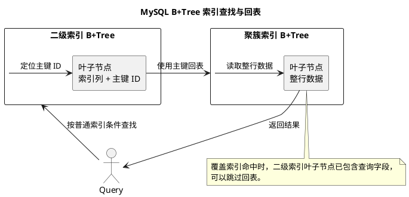

# MySQL 索引详解

## 问题索引

- Q1：MySQL 索引是什么？如何理解和设计索引？
- Q2：为什么回表代价昂贵？二级索引天然包含的主键能否作为 WHERE 条件使用？

## Q1：MySQL 索引是什么？如何理解和设计索引？

### 背景

索引是 MySQL 查询优化中最核心的基础设施。

它的本质是：

```text
用额外的数据结构，换取更快的数据定位能力。
```

没有索引时，MySQL 可能要从头到尾扫描整张表；有合适索引时，可以通过索引快速定位少量记录。

但索引不是越多越好，因为索引会带来：

- 额外磁盘空间。
- 插入、更新、删除时维护索引的成本。
- 优化器选择错误索引的可能。
- Buffer Pool 占用增加。

### 为什么 MySQL 常用 B+Tree


### PlantUML 示意图：B+Tree、聚簇索引与回表



InnoDB 常用 B+Tree 索引。

B+Tree 的特点：

- 非叶子节点只存索引键和页指针。
- 叶子节点存完整索引项。
- 叶子节点之间有链表，适合范围查询。
- 树高较低，通常 3 到 4 层可以支撑大量数据。

相比二叉树：

- 二叉树高度可能很高，磁盘 IO 次数多。

相比红黑树：

- 红黑树也是二叉结构，节点分散，磁盘页利用率不如 B+Tree。

相比 B-Tree：

- B+Tree 非叶子节点不存完整数据，一个页能放更多键，树更矮。
- B+Tree 叶子节点链表更适合范围扫描。

可以这样记：

```text
数据库索引关注的是减少磁盘 IO。
B+Tree 扇出高、树低、范围查询友好，所以适合数据库。
```

### 聚簇索引和二级索引

#### 聚簇索引

InnoDB 的主键索引就是聚簇索引。

特点：

- 叶子节点存整行数据。
- 表数据本身按主键组织。
- 一张表只能有一个聚簇索引。

例如：

```sql
select * from orders where id = 1001;
```

如果 `id` 是主键，可以通过聚簇索引直接定位整行数据。

#### 二级索引

非主键索引叫二级索引，也叫辅助索引。

二级索引叶子节点存的是：

```text
索引列值 + 主键值
```

例如有索引：

```sql
create index idx_order_no on orders(order_no);
```

执行：

```sql
select * from orders where order_no = 'O202606250001';
```

流程：

```text
1. 先通过 idx_order_no 找到对应主键 id
2. 再通过主键 id 回到聚簇索引查询整行数据
```

第二步就是回表。

### 回表

回表是指通过二级索引找到主键后，再去聚簇索引查整行数据。

回表多时，会造成大量随机 IO 或 Buffer Pool 访问压力。

例如：

```sql
select *
from orders
where dealer_id = 1001;
```

如果 `dealer_id` 命中二级索引，但需要返回所有字段，就可能对每一行回表。

优化方向：

- 只查询必要字段。
- 建覆盖索引。
- 避免低选择性索引返回大量行。

### 覆盖索引

覆盖索引指查询需要的字段都在索引里，不需要回表。

例如：

```sql
create index idx_orders_list
on orders(dealer_id, order_date, order_no, status);
```

查询：

```sql
select order_no, status
from orders
where dealer_id = 1001
  and order_date >= '2026-06-01';
```

如果查询字段都在 `idx_orders_list` 中，就可以直接从二级索引返回结果。

`EXPLAIN` 中常见表现：

```text
Extra: Using index
```

注意：`Using index` 通常表示覆盖索引，是好现象；但也要结合扫描行数判断。

### 联合索引

联合索引是多个列组成的索引。

例如：

```sql
create index idx_dealer_date_status
on orders(dealer_id, order_date, status);
```

联合索引内部按字段顺序排序：

```text
先按 dealer_id 排序
dealer_id 相同，再按 order_date 排序
order_date 相同，再按 status 排序
```

所以字段顺序非常重要。

### 最左前缀原则

联合索引遵循最左前缀原则。

索引：

```sql
create index idx_a_b_c on t(a, b, c);
```

可以较好使用索引的条件：

```sql
where a = 1
where a = 1 and b = 2
where a = 1 and b = 2 and c = 3
```

不能充分使用前缀的条件：

```sql
where b = 2
where c = 3
where b = 2 and c = 3
```

原因：

```text
B+Tree 是先按 a 排序，再按 b 排序，再按 c 排序。
如果没有 a，b 和 c 在整棵树上并不是全局有序的。
```

### 范围条件后的列

联合索引中，如果某列使用范围条件，它后面的列通常无法继续用于有序定位。

索引：

```sql
create index idx_a_b_c on t(a, b, c);
```

SQL：

```sql
select * from t
where a = 1
  and b > 10
  and c = 3;
```

通常：

- `a` 可以用于定位。
- `b` 可以用于范围扫描。
- `c` 很难继续用于缩小索引扫描范围。

但 MySQL 可能通过索引条件下推，在存储引擎层过滤 `c = 3`，减少回表。

### 索引下推

索引下推，Index Condition Pushdown，简称 ICP。

没有 ICP 时：

```text
通过索引找到候选记录
  -> 回表取整行
  -> Server 层判断剩余条件
```

有 ICP 时：

```text
通过索引找到候选记录
  -> 在存储引擎层先判断索引中能判断的条件
  -> 过滤掉不满足条件的记录
  -> 再回表
```

它的价值是减少回表次数。

`EXPLAIN` 中常见：

```text
Extra: Using index condition
```

注意：

- `Using index` 是覆盖索引。
- `Using index condition` 是索引条件下推。
- 两者不是一个意思。

### 索引选择性

选择性指索引列的区分度。

可以粗略理解为：

```text
不同值数量 / 总行数
```

选择性越高，过滤效果越好。

例如：

- 用户 ID：选择性高。
- 手机号：选择性高。
- 性别：选择性低。
- 状态：通常选择性低。

低选择性字段单独建索引，效果可能很差。

但低选择性字段作为联合索引的一部分，有时仍然有价值，例如：

```sql
create index idx_status_time on orders(status, create_time);
```

适合某些状态 + 时间范围的查询。

### 常见索引类型

#### 主键索引

```sql
primary key(id)
```

特点：

- 唯一。
- 非空。
- InnoDB 中是聚簇索引。

#### 唯一索引

```sql
create unique index uk_order_no on orders(order_no);
```

特点：

- 保证唯一性。
- 可以加速等值查询。
- 允许 NULL 的行为要结合数据库规则理解。

#### 普通索引

```sql
create index idx_dealer_id on orders(dealer_id);
```

用于加速普通查询。

#### 联合索引

```sql
create index idx_dealer_date on orders(dealer_id, order_date);
```

用于多条件查询、排序、覆盖索引设计。

#### 前缀索引

```sql
create index idx_name_prefix on customer(name(10));
```

适合较长字符串字段。

优点：

- 降低索引长度。
- 节省空间。

缺点：

- 区分度可能下降。
- 不能用于完整覆盖某些查询。

#### 全文索引

用于全文检索场景。

但复杂搜索通常更适合 Elasticsearch 等搜索引擎。

### 索引失效场景

#### 对索引列使用函数

```sql
select * from orders
where date(create_time) = '2026-06-25';
```

优化：

```sql
select * from orders
where create_time >= '2026-06-25 00:00:00'
  and create_time <  '2026-06-26 00:00:00';
```

#### 隐式类型转换

```sql
-- order_no 是 varchar，传入数字可能触发隐式转换
select * from orders where order_no = 202606250001;
```

优化：

```sql
select * from orders where order_no = '202606250001';
```

#### like 前缀通配

```sql
select * from customer where name like '%科技';
```

B+Tree 无法利用前缀有序性。

可优化：

```sql
select * from customer where name like '科技%';
```

#### 不满足最左前缀

索引：

```sql
create index idx_a_b_c on t(a, b, c);
```

SQL：

```sql
select * from t where b = 2;
```

不能充分使用联合索引。

#### or 条件部分无索引

```sql
select * from t
where a = 1
   or b = 2;
```

如果 `a` 有索引但 `b` 没索引，优化器可能选择全表扫描。

#### 低选择性导致优化器放弃索引

```sql
select * from orders where status = 'PAID';
```

如果大部分订单都是 `PAID`，走索引再回表可能不如全表扫描。

优化器可能放弃索引。

### EXPLAIN 怎么看索引

```sql
EXPLAIN
select order_no, status
from orders
where dealer_id = 1001
  and order_date >= '2026-06-01'
order by order_date desc
limit 20;
```

重点字段：

| 字段 | 含义 |
| --- | --- |
| `type` | 访问类型，`const`、`ref`、`range` 通常较好，`ALL` 风险较高 |
| `possible_keys` | 理论可能使用的索引 |
| `key` | 实际使用的索引 |
| `key_len` | 使用到的索引长度，可以辅助判断联合索引用到了几列 |
| `rows` | 预估扫描行数 |
| `filtered` | 过滤后剩余比例 |
| `Extra` | 是否覆盖索引、索引下推、文件排序、临时表 |

常见 `Extra`：

| Extra | 含义 |
| --- | --- |
| `Using index` | 覆盖索引 |
| `Using index condition` | 索引条件下推 |
| `Using where` | Server 层还要过滤 |
| `Using filesort` | 需要额外排序 |
| `Using temporary` | 使用临时表 |

### 索引设计原则

#### 优先服务高频核心 SQL

不要为了低频后台 SQL 加很多索引。

先找：

- 高频接口。
- 慢 SQL。
- P95 / P99 影响大的查询。
- 更新删除中的关键 where 条件。

#### 联合索引字段顺序

一般考虑：

```text
等值条件字段
  -> 范围条件字段
  -> 排序字段
  -> 覆盖查询字段
```

但不能机械套公式，要结合查询模式和选择性。

例如：

```sql
where dealer_id = ?
  and order_date between ? and ?
order by order_date desc
```

可以考虑：

```sql
create index idx_dealer_date on orders(dealer_id, order_date);
```

#### 避免过宽索引

联合索引不是越长越好。

索引太宽会导致：

- 磁盘空间增加。
- Buffer Pool 可缓存的索引页减少。
- 写入维护成本增加。
- 页分裂和树维护成本增加。

#### 避免重复索引

如果已有：

```sql
create index idx_a_b on t(a, b);
```

通常不需要再建：

```sql
create index idx_a on t(a);
```

因为 `idx_a_b` 的最左前缀已经可以支持 `a` 查询。

但是否保留还要看索引大小、查询频率和优化器选择。

#### 更新频繁字段谨慎建索引

索引列更新时，不只是更新数据行，还要更新对应索引结构。

频繁变化的字段如果不是高频查询条件，不适合建索引。

### 业务场景

订单列表查询：

```sql
select order_no, status, amount, order_date
from orders
where dealer_id = ?
  and order_date >= ?
  and order_date < ?
order by order_date desc
limit 20;
```

可以考虑：

```sql
create index idx_orders_dealer_date_list
on orders(dealer_id, order_date, order_no, status, amount);
```

设计原因：

- `dealer_id` 是等值过滤。
- `order_date` 支持范围和排序。
- `order_no`、`status`、`amount` 用于覆盖查询，减少回表。

注意：

- 如果 `amount` 字段较大或更新频繁，要评估是否值得放入覆盖索引。
- 如果查询字段很多，不要为了覆盖索引把所有字段都塞进去。

### 踩坑点

1. `Using index` 和 `Using index condition` 不是一个意思。
2. 联合索引字段顺序非常关键。
3. 范围条件后的列不一定能继续用于索引定位。
4. 索引能提升查询，也会拖慢写入。
5. 低选择性字段单独索引不一定有效。
6. 更新、删除语句更要注意索引，否则会扩大锁范围。
7. 不要滥用 `select *`，它会增加回表和 IO。

### 面试话术

> MySQL InnoDB 索引主要是 B+Tree。B+Tree 非叶子节点只存键和页指针，叶子节点存索引项并通过链表连接，所以树高低、磁盘 IO 少、范围查询友好。InnoDB 主键索引是聚簇索引，叶子节点存整行数据；二级索引叶子节点存索引列和主键值，通过二级索引查整行通常需要回表。联合索引遵循最左前缀原则，字段顺序很关键；覆盖索引可以避免回表，`Using index` 是覆盖索引，`Using index condition` 是索引下推，用来减少回表。索引设计要围绕高频 SQL，结合等值条件、范围条件、排序、覆盖字段和选择性，同时避免重复索引、过宽索引和在频繁更新字段上滥建索引。

## 高频追问

- Q：为什么 InnoDB 用 B+Tree？
  A：B+Tree 扇出高、树高低、磁盘 IO 少，叶子节点链表适合范围查询。

- Q：聚簇索引和二级索引区别是什么？
  A：聚簇索引叶子节点存整行数据；二级索引叶子节点存索引列和主键值，查整行通常需要回表。

- Q：什么是回表？
  A：通过二级索引找到主键后，再到聚簇索引查整行数据。

- Q：什么是覆盖索引？
  A：查询需要的字段都在索引中，可以不回表，`EXPLAIN Extra` 常见 `Using index`。

- Q：最左前缀原则是什么？
  A：联合索引按字段顺序组织，查询条件要从最左列开始连续使用，才能充分利用索引。

- Q：索引下推是什么？
  A：把可以用索引列判断的条件下推到存储引擎层先过滤，减少回表次数。

- Q：索引失效常见原因有哪些？
  A：索引列使用函数、隐式类型转换、like 前缀通配、不满足最左前缀、or 部分条件无索引、选择性太低。

## 复习清单

- [ ] 能解释 B+Tree 为什么适合数据库索引
- [ ] 能区分聚簇索引、二级索引、回表
- [ ] 能说明覆盖索引和索引下推的区别
- [ ] 能解释联合索引和最左前缀原则
- [ ] 能列出常见索引失效场景
- [ ] 能使用 EXPLAIN 判断索引效果
- [ ] 能按业务 SQL 设计联合索引

## Q2：为什么回表代价昂贵？二级索引天然包含的主键能否作为 WHERE 条件使用？

### 回表为什么贵

InnoDB 二级索引叶子节点保存的是：

~~~text
二级索引列值 + 主键值
~~~

如果查询需要返回的列不在二级索引中，执行过程通常是：

~~~text
扫描二级索引
  -> 找到候选记录的主键
  -> 根据主键访问聚簇索引
  -> 读取完整行
  -> 返回或继续过滤
~~~

回表代价高，通常不是因为“多执行了一条 SQL”，而是因为它可能造成大量随机页面访问：

1. **额外的 B+Tree 访问**：二级索引定位后，还要访问聚簇索引。
2. **访问顺序不连续**：二级索引按照二级键排序，得到的主键可能是离散的；按这些主键回表时，聚簇索引页访问不一定连续。
3. **候选行数量会放大成本**：命中 10 行和命中 100 万行，回表次数不是一个量级。
4. **缓存命中不稳定**：聚簇索引页不在 Buffer Pool 时会产生磁盘 IO，在缓存中也会消耗内存带宽和 CPU。
5. **行宽和 MVCC 成本**：读取宽行、判断可见性、必要时访问 undo 版本，都会增加单次回表成本。
6. **二级索引过滤能力不足时更严重**：低选择性条件会先产生大量候选主键，再逐个回表过滤。

因此应该关注：

~~~text
二级索引扫描候选数
  -> ICP 过滤后剩余数
  -> 实际回表数
  -> 回表页面的缓存命中与随机访问成本
~~~

`EXPLAIN` 出现 `Using index condition`，只能说明部分条件在索引层提前过滤；如果查询还需要索引之外的列，仍然会回表。只有查询字段全部被索引覆盖时，才可能出现 `Using index` 并跳过回表。

### 回表示意

~~~plantuml
@startuml
skinparam monochrome true
skinparam shadowing false

rectangle "二级索引\n(dealer_id, id)" as Secondary
rectangle "候选主键\nid=101, 805, 1207" as Keys
rectangle "聚簇索引\n按主键组织完整行" as Clustered
rectangle "查询结果" as Result

Secondary --> Keys : 扫描并过滤
Keys --> Clustered : 根据每个主键回表
Clustered --> Result : 读取完整列

note right of Keys
主键离散时，回表访问的聚簇索引页
可能分散在多个页面，产生随机 IO
end note
@enduml
~~~

### 二级索引天然包含的主键能否用于 WHERE

答案是：**能在一定条件下使用，但不能把它当成一个独立的主键索引。**

假设表上有：

~~~sql
CREATE TABLE orders (
    id BIGINT PRIMARY KEY,
    dealer_id BIGINT NOT NULL,
    status TINYINT NOT NULL,
    amount DECIMAL(12, 2) NOT NULL,
    KEY idx_dealer (dealer_id)
);
~~~

从存储结构看，`idx_dealer` 的二级索引记录可以理解为：

~~~text
(dealer_id, id)
~~~

主键 `id` 是二级索引记录的一部分，但它位于 `dealer_id` 之后。

#### 场景一：主键作为返回列使用

~~~sql
SELECT id
FROM orders
WHERE dealer_id = 1001;
~~~

可以直接从 `idx_dealer` 的叶子节点取得 `id`，无需回表，可能出现：

~~~text
Extra: Using index
~~~

这是主键作为**覆盖列**使用，而不是使用主键条件定位。

#### 场景二：先约束二级索引列，再使用主键条件

~~~sql
SELECT id, amount
FROM orders
WHERE dealer_id = 1001
  AND id BETWEEN 10000 AND 20000;
~~~

因为已经固定了最左列 `dealer_id`，索引的逻辑顺序 `(dealer_id, id)` 允许优化器在对应的 `dealer_id` 范围内继续利用 `id` 做范围过滤。MySQL InnoDB 的索引扩展能力会让优化器考虑二级索引后面隐含的主键列，具体是否采用仍由成本模型决定。

#### 场景三：二级索引列和主键等值过滤

~~~sql
SELECT id, status
FROM orders
WHERE dealer_id = 1001
  AND id = 12007;
~~~

`dealer_id` 固定后，`id` 可以作为后续索引列参与定位；如果返回字段也被索引覆盖，还可能无需回表。也可以显式建立：

~~~sql
-- 显式表达查询意图，避免依赖隐含主键扩展的可见性和成本判断。
CREATE INDEX idx_dealer_id ON orders(dealer_id, id);
~~~

对于仅包含 `dealer_id` 的原索引，隐含主键已经存在于索引记录中，但显式联合索引有利于让设计意图更清晰，也方便后续增加覆盖列；是否需要重复创建必须先检查现有索引和实际执行计划。

#### 场景四：只有主键条件，不能跳过最左前缀

~~~sql
SELECT *
FROM orders
WHERE id = 12007;
~~~

这类查询应该使用主键聚簇索引：

~~~text
PRIMARY(id) -> 直接定位完整行
~~~

不能因为 `idx_dealer` 的叶子节点也有 `id`，就认为可以通过它高效查找。`idx_dealer` 的排序首先按 `dealer_id`，没有 `dealer_id` 条件时，`id` 是后缀列，无法像独立索引那样直接形成单点查找范围。

强行使用 `idx_dealer`，通常只会变成全索引扫描，再逐条比较 `id`，反而更慢。

### 主键隐含列的使用边界

| SQL 条件 | 隐含主键可能的作用 | 是否绕过回表 |
| --- | --- | --- |
| `WHERE dealer_id=?`，只查 `id` | 作为覆盖列返回 | 是 |
| `WHERE dealer_id=? AND id=?` | 在固定二级键后继续定位 | 取决于返回列 |
| `WHERE dealer_id=? AND id BETWEEN ...` | 在二级键范围内继续做主键范围过滤 | 取决于返回列 |
| `WHERE id=?` | 不能跳过 `dealer_id` 最左前缀 | 应走主键 |
| `WHERE id=?`，强制 `idx_dealer` | 可能全索引扫描 | 否 |

还要注意：

- 联合主键表的二级索引会带上联合主键列，顺序和可利用范围要结合实际主键定义判断。
- 没有显式主键时，InnoDB 有内部隐藏聚簇键，但它不是可以写在 SQL `WHERE` 中的业务列。
- 主键较长会让所有二级索引叶子节点变宽，降低页容纳记录数，放大索引和回表成本。
- 使用隐含主键扩展时，可以通过 `EXPLAIN` 的 `key_len`、`rows`、`Extra` 和实际耗时确认优化器是否真正利用。

### 减少回表的方案

#### 1. 覆盖索引

只返回列表页必需字段，构造覆盖索引：

~~~sql
CREATE INDEX idx_order_list
ON orders(dealer_id, status, id, amount);

-- 查询列均在索引中，可能无需回表。
SELECT id, status, amount
FROM orders
WHERE dealer_id = 1001
  AND status = 1;
~~~

不要为了覆盖 `SELECT *` 把整行所有字段都塞入索引；过宽的索引会增加写放大、Buffer Pool 占用和页分裂。

#### 2. ICP

当查询无法完全覆盖，但部分过滤列在二级索引中时，ICP 可以先在索引层过滤，再对通过的记录回表。它减少的是回表次数，不一定减少索引范围扫描次数。

#### 3. MRR

对大量二级索引命中，MySQL 可能使用 Multi-Range Read 收集主键，再按更适合聚簇索引访问的顺序批量读取，降低随机回表成本。MRR 是执行层优化，不改变二级索引天然包含主键但位于后缀位置的事实。

#### 4. 先分页主键，再回表

列表查询可以先用窄索引筛选和分页主键，再根据主键批量取详情，避免一次性对大量候选项回表：

~~~sql
-- 第一步只获取本页主键，减少后续回表集合。
SELECT id
FROM orders
WHERE dealer_id = 1001
ORDER BY id
LIMIT 50;

-- 第二步按主键批量读取详情，实际应用中应保留稳定排序。
SELECT id, dealer_id, status, amount
FROM orders
WHERE id IN (101, 205, 330);
~~~

### 面试话术

> 回表是通过二级索引找到主键后，再访问聚簇索引读取完整行。它昂贵的核心原因是二级索引扫描和聚簇索引读取是两次访问，而且二级键顺序与主键顺序不同，多个候选主键可能导致大量随机页访问。InnoDB 二级索引叶子节点天然包含主键，所以主键可以作为覆盖列返回；当二级索引最左列已经固定时，主键还可能作为隐含的后续索引列参与等值或范围过滤。但只有 `WHERE id=?` 时不能跳过二级索引最左前缀，应该直接走 PRIMARY。最终是否真正利用，要结合 `EXPLAIN`、`key_len`、`rows`、`Using index` 和实际耗时判断。

### 高频追问

- Q：为什么大量回表的代价昂贵？
  A：每个候选项通常还要根据主键访问聚簇索引；二级索引顺序与主键顺序不同，候选主键离散时会访问大量不同的数据页，放大 B+Tree 查找、随机 IO、Buffer Pool 和 MVCC 判断成本。

- Q：二级索引包含主键，为什么还要回表？
  A：因为它只包含主键值，不包含其他完整列。查询需要 `amount`、`status` 等不在二级索引中的字段时，仍要根据主键访问聚簇索引。

- Q：`WHERE id=? AND dealer_id=?` 一定使用二级索引吗？
  A：不一定。主键已经能唯一定位，优化器通常可能选择 PRIMARY，再过滤 `dealer_id`；是否选择二级索引取决于返回列、成本和覆盖情况。

- Q：`WHERE id=?` 能利用 `KEY(dealer_id)` 后面的隐含主键吗？
  A：不能高效利用，因为 `dealer_id` 是最左列，缺少它时无法直接定位 `id` 后缀范围，强行使用通常是全索引扫描。

- Q：回表一定是磁盘随机 IO 吗？
  A：不一定。数据页可能已经在 Buffer Pool，也可能因主键集中而访问较连续；但候选主键离散、数据量大时，随机页访问和缓存压力会显著增加。

### 复习清单

- [ ] 能说明回表为什么可能产生大量随机页访问
- [ ] 能区分主键作为覆盖列和主键作为索引定位条件
- [ ] 能解释为什么 `WHERE id=?` 不能跳过二级索引最左前缀
- [ ] 能说明 InnoDB 隐含主键扩展的使用边界
- [ ] 能区分覆盖索引、ICP、MRR 和普通回表
- [ ] 能结合 `EXPLAIN FORMAT=JSON` 的 `used_key_parts`、传统 `key_len` 和必要的 `optimizer_trace` 判断隐含主键是否参与执行计划

