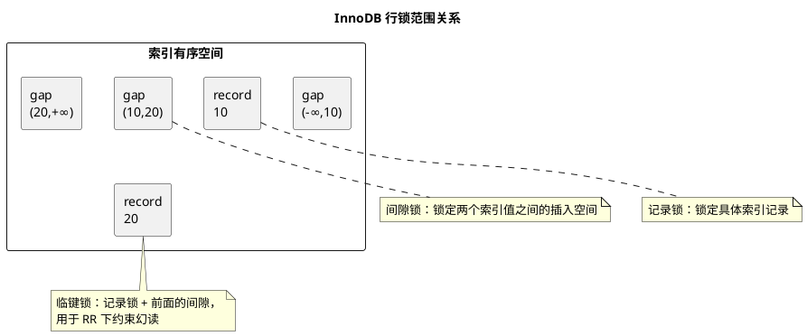

# MySQL 锁机制

## 问题索引

- Q1：MySQL 中有哪些锁？它们分别解决什么问题？
- Q2：遇到 type=index 放大锁范围并引发死锁时，如何排查和破局？

## Q1：MySQL 中有哪些锁？它们分别解决什么问题？

### 背景

MySQL 的锁要分层理解：

```text
Server 层
  -> 元数据锁 MDL
  -> 表级锁

存储引擎层，以 InnoDB 为主
  -> 行锁
  -> 记录锁
  -> 间隙锁
  -> 临键锁
  -> 插入意向锁
  -> 意向锁
```

面试里说 MySQL 锁，重点不是只背名字，而是能说清：

- 锁的粒度是什么。
- 什么 SQL 会加什么锁。
- 为什么有间隙锁和临键锁。
- 为什么索引不合适会扩大锁范围。
- 线上锁等待和死锁怎么排查。

### 按粒度分类

#### 全局锁

全局锁会锁住整个 MySQL 实例。

典型命令：

```sql
flush tables with read lock;
```

作用：

- 让整个库进入只读状态。
- 常用于全库逻辑备份场景。

影响：

- 数据更新被阻塞。
- 表结构变更被阻塞。
- 事务提交也可能受影响。

实际生产中，全局锁要非常谨慎。InnoDB 通常更推荐使用支持一致性视图的备份方式，例如 `mysqldump --single-transaction`。

#### 表级锁

表锁粒度大，锁住整张表。

显式表锁：

```sql
lock tables user read;
lock tables user write;
unlock tables;
```

特点：

- 实现简单。
- 冲突范围大。
- 并发能力差。

MyISAM 主要依赖表锁；InnoDB 支持行锁，但也会涉及表级别的 MDL 和意向锁。

#### 行级锁

行锁是 InnoDB 的核心能力。

特点：

- 粒度小。
- 并发能力强。
- 实现依赖索引。

常见触发：

```sql
update user set name = 'Tom' where id = 1;

select * from user where id = 1 for update;

select * from user where id = 1 lock in share mode;
```

注意：InnoDB 的行锁是加在索引记录上的。如果 SQL 没走索引，可能扫描大量记录并对更多记录加锁，表现上接近锁表。

### 按读写模式分类

#### 共享锁

共享锁，简称 S 锁。

多个事务可以同时持有同一行的共享锁。

```sql
select * from user where id = 1 lock in share mode;
```

特点：

- 允许其他事务读。
- 阻塞其他事务修改同一行。

#### 排他锁

排他锁，简称 X 锁。

一个事务持有某行排他锁后，其他事务不能再对这行加共享锁或排他锁。

```sql
select * from user where id = 1 for update;

update user set name = 'Tom' where id = 1;
```

特点：

- 用于修改数据。
- 阻塞其他事务对同一行的修改和加锁读。

#### 兼容关系

| 当前锁 | 请求 S 锁 | 请求 X 锁 |
| --- | --- | --- |
| S 锁 | 兼容 | 冲突 |
| X 锁 | 冲突 | 冲突 |

普通快照读不加这类行锁，它通过 MVCC 读取历史版本。

### 意向锁

意向锁是表级锁，用来表示事务接下来想在表中的某些行上加什么类型的行锁。

常见两种：

| 锁 | 含义 |
| --- | --- |
| IS | 意向共享锁，表示准备给某些行加 S 锁 |
| IX | 意向排他锁，表示准备给某些行加 X 锁 |

为什么需要意向锁？

如果没有意向锁，一个事务想给整张表加表锁时，就要扫描整张表确认有没有行锁，成本很高。

有了意向锁后：

```text
事务 A 更新某一行
  -> 先在表上加 IX
  -> 再在目标索引记录上加 X

事务 B 想加整表写锁
  -> 发现表上已有 IX
  -> 直接判断冲突，不需要扫描所有行
```

意向锁之间通常是兼容的，因为它们只是表达“意向”，真正冲突发生在行锁或表锁层面。

### InnoDB 行锁的几种形态


### PlantUML 示意图：记录锁、间隙锁与临键锁



#### 记录锁

Record Lock，锁住某条索引记录。

例如主键命中：

```sql
select * from user where id = 10 for update;
```

如果 `id = 10` 存在，InnoDB 会锁住主键索引上这条记录。

作用：

- 防止其他事务修改或删除这条记录。

#### 间隙锁

Gap Lock，锁住两个索引记录之间的间隙。

例如索引中已有：

```text
10, 20, 30
```

锁住 `(10, 20)` 这个间隙后，其他事务不能插入 `11 到 19` 之间的值。

间隙锁的核心作用：

- 防止其他事务向范围内插入新记录。
- 配合 RR 隔离级别解决当前读场景下的幻读。

#### 临键锁

Next-Key Lock = 记录锁 + 间隙锁。

它锁住的是：

```text
左开右闭区间
```

例如索引值：

```text
10, 20, 30
```

临键锁区间可以理解为：

```text
(-∞, 10]
(10, 20]
(20, 30]
(30, +∞)
```

在 RR 隔离级别下，InnoDB 当前读的范围查询通常会使用 next-key lock，既锁住已有记录，也锁住记录之间的间隙。

#### 插入意向锁

Insert Intention Lock 是一种特殊的间隙锁。

多个事务如果要插入同一个间隙中的不同位置，通常可以并发。

例如已有索引：

```text
10, 20
```

事务 A 插入 11，事务 B 插入 19，它们都在 `(10, 20)` 间隙中，但插入位置不同，插入意向锁可以提高并发。

如果这个间隙已经被其他事务的 gap lock 或 next-key lock 锁住，插入仍会被阻塞。

### 什么 SQL 会加什么锁

#### 普通 select

```sql
select * from user where id = 1;
```

普通 `select` 是快照读，主要走 MVCC，不加行锁。

#### select for update

```sql
select * from user where id = 1 for update;
```

当前读，加排他锁。

适合：

- 库存扣减。
- 账户余额变更。
- 需要先读后改，并且必须读最新版本的场景。

#### lock in share mode

```sql
select * from user where id = 1 lock in share mode;
```

当前读，加共享锁。

适合：

- 希望读到最新数据。
- 读取期间不允许其他事务修改该行。

#### update / delete

```sql
update user set name = 'Tom' where id = 1;
delete from user where id = 1;
```

当前读，加排他锁。

如果 where 条件命中唯一索引且是等值查询，锁范围通常较小。

如果是范围查询，可能加 next-key lock。

如果没有合适索引，可能扫描大量记录，锁范围会明显扩大。

### 索引对锁范围的影响

InnoDB 行锁锁的是索引记录。

#### 唯一索引等值命中

```sql
update user set name = 'Tom' where id = 10;
```

如果 `id` 是主键或唯一索引，并且记录存在，通常只锁住这一条记录。

#### 非唯一索引等值查询

```sql
update user set status = 1 where age = 18;
```

如果 `age` 是非唯一索引，可能锁住所有 `age = 18` 的索引记录，还可能涉及相关间隙，避免插入新的 `age = 18` 记录影响当前读语义。

#### 范围查询

```sql
select * from user where age between 18 and 30 for update;
```

RR 下通常会加 next-key lock，锁住范围内已有记录和间隙，阻止其他事务插入满足范围条件的新记录。

#### 无索引条件

```sql
update user set status = 1 where phone = '13800000000';
```

如果 `phone` 没有索引，InnoDB 可能扫描大量记录。

风险：

- 锁住更多记录。
- 锁等待增加。
- 线上表现接近锁表。

所以更新和删除语句的 where 条件必须尤其关注索引。

### MDL 元数据锁

MDL，Metadata Lock，是 Server 层的元数据锁。

它保护表结构和 SQL 执行之间的一致性。

例如事务查询一张表时，MySQL 会给表加 MDL 读锁；执行 DDL 时需要 MDL 写锁。

典型阻塞场景：

```text
T1 开启事务，select * from user，事务迟迟不提交
T2 alter table user add column age int，等待 MDL 写锁
T3 后续查询 user，也可能被 T2 阻塞
```

线上表现：

```sql
show full processlist;
```

如果看到：

```text
Waiting for table metadata lock
```

通常就是 MDL 阻塞。

解决方向：

- 找出长事务并提交或回滚。
- DDL 低峰执行。
- 使用在线 DDL 工具或 MySQL 原生 online DDL 能力。

### 自增锁

Auto-Increment Lock 用于自增主键分配。

不同 MySQL / InnoDB 配置下，自增锁策略不同。

关注点：

- 批量插入时可能影响并发。
- 自增主键通常顺序写入，对聚簇索引页分裂更友好。
- 分布式系统中如果不用数据库自增，需要额外考虑 ID 生成策略。

### 乐观锁和悲观锁

MySQL 层面常说的悲观锁：

```sql
select * from product where id = 1 for update;
```

先加锁，再执行业务判断和修改。

乐观锁通常通过版本号实现：

```sql
update product
set stock = stock - 1,
    version = version + 1
where id = 1
  and stock > 0
  and version = 10;
```

这里的 `version = 10` 是并发校验条件。

如果返回影响行数为 0，说明数据已经被其他事务改过，需要重试或返回失败。

适用对比：

| 方式 | 适用场景 |
| --- | --- |
| 悲观锁 | 冲突概率高，必须串行，例如库存扣减核心链路 |
| 乐观锁 | 冲突概率低，希望减少锁等待 |

### 死锁

死锁是两个或多个事务互相等待对方持有的锁。

典型例子：

```text
T1 锁住 order id = 1
T2 锁住 order id = 2
T1 再请求 order id = 2，等待 T2
T2 再请求 order id = 1，等待 T1
```

MySQL 会检测死锁，并回滚其中一个事务。

排查命令：

```sql
show engine innodb status\G
```

重点看：

- `LATEST DETECTED DEADLOCK`
- 两个事务分别执行了什么 SQL
- 等待什么锁
- 持有什么锁
- 使用了哪个索引

解决方向：

- 保证多事务更新顺序一致。
- 缩短事务时间。
- 给 where 条件加合适索引。
- 减少一次事务中锁定的数据范围。
- 捕获死锁异常后做有限重试。

### 锁等待排查命令

#### 查看当前执行

```sql
show full processlist;
```

关注：

- `State` 是否是 `Locked`、`Waiting for table metadata lock`。
- `Time` 是否持续很久。
- `Info` 是什么 SQL。

#### 查看事务

```sql
select * from information_schema.innodb_trx\G
```

关注：

- `trx_started`：事务开始时间。
- `trx_state`：事务状态。
- `trx_mysql_thread_id`：对应 processlist 的连接 ID。
- `trx_query`：事务当前 SQL。

#### 查看锁等待关系

```sql
select
    r.trx_id waiting_trx_id,
    r.trx_mysql_thread_id waiting_thread,
    r.trx_query waiting_query,
    b.trx_id blocking_trx_id,
    b.trx_mysql_thread_id blocking_thread,
    b.trx_query blocking_query
from information_schema.innodb_lock_waits w
join information_schema.innodb_trx b
    on b.trx_id = w.blocking_trx_id
join information_schema.innodb_trx r
    on r.trx_id = w.requesting_trx_id;
```

关注：

- 谁在等。
- 谁阻塞别人。
- 阻塞事务是否是长事务。
- 是否存在空闲但未提交事务。

MySQL 8.0 也可以关注 `performance_schema.data_locks` 和 `performance_schema.data_lock_waits`。

### 业务场景

#### 库存扣减

悲观锁写法：

```sql
begin;

select stock
from product
where id = 1001
for update;

update product
set stock = stock - 1
where id = 1001
  and stock > 0;

commit;
```

重点：

- `for update` 是当前读，会加排他锁。
- 事务要短，不能在事务中调用远程接口。
- `id` 必须有索引，最好是主键。

乐观锁写法：

```sql
update product
set stock = stock - 1,
    version = version + 1
where id = 1001
  and stock > 0
  and version = 10;
```

重点：

- 通过影响行数判断是否扣减成功。
- 冲突高时重试会增加压力。

#### 订单状态流转

```sql
update orders
set status = 'PAID'
where order_no = 'O202606250001'
  and status = 'WAIT_PAY';
```

这个写法本身带状态机校验，属于乐观并发控制思想。

如果影响行数为 0，说明订单不存在或状态已经被其他事务改过。

### 踩坑点

1. InnoDB 行锁锁的是索引记录，不是直接锁物理行。
2. 更新语句没有合适索引，可能导致锁范围扩大。
3. RR 下范围当前读可能出现 next-key lock，不只是锁已有记录。
4. 普通 select 是快照读，不等于加锁读。
5. `for update` 必须放在事务中才有意义，事务提交后锁释放。
6. DDL 被卡住时，要想到 MDL，不要只看行锁。
7. 死锁不能完全避免，核心是降低概率并做好重试。

### 面试话术

> MySQL 锁要分层讲。Server 层有全局锁、表锁和 MDL 元数据锁；InnoDB 层主要有行锁、意向锁、记录锁、间隙锁、临键锁和插入意向锁。普通 select 是快照读，主要走 MVCC，不加行锁；`select ... for update`、update、delete 是当前读，会加排他锁；`lock in share mode` 会加共享锁。InnoDB 行锁是加在索引记录上的，唯一索引等值命中通常只锁单条记录，范围查询在 RR 下可能加 next-key lock，锁住记录和间隙，防止当前读幻读。没有合适索引时，会扫描更多记录并扩大锁范围。线上排查锁等待可以用 `show full processlist`、`information_schema.innodb_trx`、`innodb_lock_waits` 和 `show engine innodb status`，重点找长事务、阻塞事务、死锁 SQL 和使用的索引。

## 高频追问

- Q：InnoDB 行锁一定只锁一行吗？
  A：不一定。行锁加在索引记录上，范围查询、非唯一索引、没有合适索引时都可能扩大锁范围。

- Q：普通 select 会加锁吗？
  A：普通 select 通常是快照读，走 MVCC，不加行锁。`for update` 和 `lock in share mode` 才是加锁读。

- Q：间隙锁解决什么问题？
  A：间隙锁锁住索引记录之间的范围，防止其他事务插入新记录，主要用于处理当前读场景下的幻读。

- Q：next-key lock 是什么？
  A：next-key lock 是记录锁加间隙锁，锁住左开右闭区间，既锁已有记录，也锁记录前面的间隙。

- Q：为什么 DDL 会被普通查询阻塞？
  A：因为普通查询事务会持有 MDL 读锁，DDL 需要 MDL 写锁。如果查询所在事务长期不提交，DDL 就会等待。

- Q：死锁怎么处理？
  A：先用 `show engine innodb status\G` 看最近死锁信息，再统一更新顺序、缩短事务、补充索引、减少锁范围，并在业务上对死锁异常做有限重试。

## 复习清单

- [ ] 能区分全局锁、表锁、行锁、MDL
- [ ] 能说清 S 锁、X 锁和意向锁
- [ ] 能解释记录锁、间隙锁、临键锁、插入意向锁
- [ ] 能说明普通 select、for update、update 分别如何加锁
- [ ] 能解释索引为什么影响锁范围
- [ ] 能排查锁等待和死锁
- [ ] 能结合库存扣减说明悲观锁和乐观锁

## Q2：遇到 type=index 放大锁范围并引发死锁时，如何排查和破局？

### 先纠正概念：type=index 不会直接制造死锁

`EXPLAIN` 中的 `type=index` 表示**完整扫描某棵索引**，不是按等值或有限范围定位少量索引记录。它和 `ALL` 的区别主要是扫描索引还是扫描聚簇数据，但两者都可能读取大量记录。

死锁必须满足“多个事务形成循环等待”：

~~~text
T1 持有锁 A，等待锁 B
T2 持有锁 B，等待锁 A
~~~

所以更准确的因果关系是：

~~~text
加锁 SQL 出现 type=index
  -> 扫描大量索引记录
  -> 锁定记录、主键记录或间隙的范围扩大
  -> 与其他事务的锁集合更容易重叠
  -> 加锁顺序不一致时形成等待环
  -> Deadlock
~~~

还要区分 SQL 类型：

| SQL | `type=index` 是否会产生大量行锁 |
| --- | --- |
| 普通 `SELECT` | 通常不会。它是 MVCC 快照读，不加 InnoDB 行锁 |
| `SELECT ... FOR UPDATE` | 会按访问路径加排他锁，风险明显 |
| `UPDATE`、`DELETE` | 会对扫描和命中的索引记录加锁，索引不合适时风险明显 |
| `INSERT` | 重点关注唯一键检查、插入意向锁和间隙冲突 |

因此不能看到普通查询的 `type=index` 就认定它导致了死锁，必须回到死锁日志中的加锁语句和等待关系。

### type=index 如何放大死锁概率

假设事务 T1 的批量状态更新没有合适索引，只能完整扫描某个二级索引；事务 T2 则按主键先后修改两条相同数据：

~~~plantuml
@startuml
skinparam monochrome true
skinparam shadowing false

participant "事务 T1\ntype=index 扫描" as T1
database "id=10" as R10
database "id=20" as R20
participant "事务 T2\n主键点更新" as T2

T1 -> R10 : 获得 X 锁
T2 -> R20 : 获得 X 锁
T1 -> R20 : 请求 X 锁，等待 T2
T2 -> R10 : 请求 X 锁，等待 T1
note over T1,T2 : 形成等待环，InnoDB 回滚其中一个事务
@enduml
~~~

如果 T1 能通过高选择性索引只锁定 `id=10`，它可能根本不会接触 `id=20`，等待环也就不会形成。由此可见：

- `type=index` 通常是**锁范围放大器**。
- 真正形成死锁的另一个必要条件是**事务间加锁顺序不一致**。
- 两个事务即使都访问相同数据，只要始终按相同顺序加锁，通常表现为排队等待，而不是死锁。

### 排查第一步：保留死锁现场

#### 1. 查看最近一次死锁

~~~sql
SHOW ENGINE INNODB STATUS\G
~~~

重点定位以下部分：

~~~text
LATEST DETECTED DEADLOCK
*** (1) TRANSACTION
*** (1) HOLDS THE LOCK(S)
*** (1) WAITING FOR THIS LOCK TO BE GRANTED
*** (2) TRANSACTION
*** (2) HOLDS THE LOCK(S)
*** (2) WAITING FOR THIS LOCK TO BE GRANTED
*** WE ROLL BACK TRANSACTION (...)
~~~

`SHOW ENGINE INNODB STATUS` 通常只保留最近一次死锁。低频偶发问题可以临时开启全部死锁写入 MySQL Error Log：

~~~sql
-- 临时开启，采集完成后应恢复，避免错误日志持续膨胀。
SET GLOBAL innodb_print_all_deadlocks = ON;

-- 完成问题采集后关闭。
SET GLOBAL innodb_print_all_deadlocks = OFF;
~~~

线上还应在应用日志中记录：

- 错误码 `1213`、SQLSTATE `40001`。
- 完整业务事务名称，而不只是最后一条 SQL。
- SQL 模板、关键参数、traceId、线程和连接信息。
- 事务中此前执行过的加锁 SQL及其顺序。

死锁日志展示的“当前 SQL”不一定是事务最初持锁的 SQL。只看最后一条语句，经常无法还原完整环路。

#### 2. 区分死锁与锁等待超时

| 现象 | 常见错误码 | 含义 |
| --- | --- | --- |
| Deadlock | `1213` | InnoDB 检测到等待环，立即选择一个事务回滚 |
| Lock wait timeout | `1205` | 没有检测到环，但等待锁超过 `innodb_lock_wait_timeout` |

调大 `innodb_lock_wait_timeout` 不能解决死锁；死锁检测器通常不会等到该超时才处理。

### 排查第二步：读懂日志中的锁

对每个事务分别整理四项信息：

| 项目 | 要回答的问题 |
| --- | --- |
| 当前 SQL | 正在执行哪条加锁语句，参数是什么 |
| 已持有锁 | 锁在哪张表、哪个索引、哪些记录或间隙上 |
| 正等待锁 | 等待哪个索引记录，锁模式是什么 |
| 业务顺序 | 当前 SQL 之前还修改过哪些资源 |

日志中常见字段：

- `index PRIMARY`：锁落在聚簇索引记录上。
- `index idx_xxx`：锁落在二级索引记录或其间隙上。
- `lock_mode X`：请求排他锁。
- `locks rec but not gap`：记录锁，不包含前面的间隙。
- `locks gap before rec`：间隙锁。
- `insert intention waiting`：插入意向锁正在等待间隙。
- `space id`、`page no`、`heap no`：记录的物理位置，不等同于业务主键。

一行数据可能同时涉及二级索引记录和聚簇索引记录。看到日志写着某个二级索引，不能简单理解为“只锁了二级索引，不锁数据行”。

然后画出等待图：

~~~text
T1 --等待--> T2 持有的 id=20
T2 --等待--> T1 持有的 id=10
~~~

只有找到闭环，才算确认死锁原因；仅仅看到两个事务同时更新同一张表还不够。

### 排查第三步：确认加锁 SQL 的真实访问路径

对死锁中的 `UPDATE`、`DELETE` 或加锁查询使用相同参数执行 `EXPLAIN`。`EXPLAIN` 不会真正执行 DML：

~~~sql
-- 使用线上死锁时的典型参数，确认 UPDATE 的访问路径。
EXPLAIN
UPDATE order_task
SET retry_count = retry_count + 1
WHERE tenant_id = 100
  AND biz_no = 'B202607230001'
  AND status = 0;
~~~

重点检查：

- `type` 是否为 `index` 或 `ALL`。
- `key` 实际使用哪个索引，是否与死锁日志中的 `index` 对应。
- `key_len` 是否说明联合索引只使用了很短的前缀。
- `rows` 是否远大于业务预计更新行数。
- `filtered` 是否很低，说明大量记录扫描后才被过滤。
- `Extra` 是否存在额外过滤、临时表或排序。

如果预期只修改一条记录，但计划却是：

~~~text
type=index
rows=2000000
filtered=0.01
~~~

就要继续查明为什么无法点查或范围查：

1. 缺少匹配 `WHERE` 条件的索引。
2. 没有满足联合索引最左前缀。
3. 对索引列使用函数或计算，例如 `DATE(created_at)`。
4. 字符串与数字比较导致隐式类型转换。
5. `LIKE '%keyword'` 无法使用普通 B+Tree 前缀定位。
6. `OR` 的某个分支没有可用索引。
7. 统计信息过期或数据严重倾斜，优化器误判成本。
8. 条件本身选择性太低，确实需要读取大部分数据。

辅助检查：

~~~sql
-- 查看表结构、索引顺序和字段类型。
SHOW CREATE TABLE order_task\G
SHOW INDEX FROM order_task;

-- 大批量导入或数据分布变化后，可在低峰刷新统计信息再复核计划。
ANALYZE TABLE order_task;
~~~

不要直接对线上写 SQL 使用 `EXPLAIN ANALYZE`，因为它会真实执行语句。

### 排查第四步：观察当前锁等待关系

死锁被检测后等待环已经被打破，下面的视图更适合观察仍在发生的长时间锁等待：

~~~sql
-- MySQL 8.0：查看谁在等待谁。
SELECT *
FROM performance_schema.data_lock_waits;

-- 查看锁落在哪张表、哪个索引以及锁模式。
SELECT
    ENGINE_TRANSACTION_ID,
    THREAD_ID,
    OBJECT_SCHEMA,
    OBJECT_NAME,
    INDEX_NAME,
    LOCK_TYPE,
    LOCK_MODE,
    LOCK_STATUS,
    LOCK_DATA
FROM performance_schema.data_locks;

-- sys 库将等待者和阻塞者整理为更易读的视图。
SELECT * FROM sys.innodb_lock_waits\G
~~~

同时查看事务年龄和修改规模：

~~~sql
SELECT
    trx_id,
    trx_state,
    trx_started,
    trx_mysql_thread_id,
    trx_rows_locked,
    trx_rows_modified,
    trx_query
FROM information_schema.innodb_trx
ORDER BY trx_started;
~~~

如果事务已经运行很久、锁定大量行并且还在执行远程调用，应优先处理事务边界，而不只是优化最后一条 SQL。

### 破局一：先恢复服务

#### 1. 正确重试整个事务

InnoDB 检测到死锁后会自动回滚一个牺牲事务。应用应捕获 `1213` 或对应的数据访问异常，进行有限次数重试：

~~~text
回滚整个事务
  -> 随机退避 50~200ms
  -> 重新开启一个事务
  -> 从事务入口完整重放
  -> 最多重试 2~3 次
~~~

关键要求：

- 重试的是**整个事务**，不是只重新执行报错的最后一条 SQL。
- 每次重试必须使用新事务，不能复用已经回滚的事务上下文。
- 业务操作必须幂等，避免重试造成重复扣款、重复发消息。
- 使用指数退避和随机抖动，避免并发事务立即再次碰撞。

在 Spring 中应确保“重试切面包住事务切面”，使每次尝试都重新创建事务；把重试循环写在同一个 `@Transactional` 方法内部，通常无法得到正确的新事务边界。

#### 2. 降低冲突面

线上频繁爆发时可以先：

- 暂停或降低批处理任务并发度。
- 将一次处理几万行拆成按主键游标推进的小批次。
- 暂时隔离热点租户、热点账户或热点订单。
- 缩短事务，移出 RPC、文件 IO、人工等待和非必要查询。
- 经验证后临时使用索引 Hint 固定合理访问路径，作为短期止血而非永久方案。

检测到的死锁已经由 InnoDB 自动回滚一个事务，无须再 `KILL`。只有仍存在长时间锁等待、并确认阻塞事务可以回滚时，才考虑终止阻塞连接。

### 破局二：从根因减少锁集合

#### 1. 建立与加锁条件匹配的索引

示例 SQL：

~~~sql
UPDATE order_task
SET retry_count = retry_count + 1
WHERE tenant_id = ?
  AND biz_no = ?
  AND status = 0;
~~~

如果 `(tenant_id, biz_no)` 在业务上唯一，优先表达为唯一索引：

~~~sql
-- 唯一等值定位能将访问范围收敛到单条业务记录。
ALTER TABLE order_task
ADD UNIQUE KEY uk_tenant_biz (tenant_id, biz_no);
~~~

如果业务不唯一，应根据过滤、批处理和排序方式设计联合索引，例如：

~~~sql
-- 用于按租户、状态扫描任务，并按主键稳定分批。
ALTER TABLE order_task
ADD KEY idx_tenant_status_id (tenant_id, status, id);
~~~

索引目标不是让 `EXPLAIN` 看起来更漂亮，而是让加锁语句只访问真正需要修改的记录。新增索引后必须重新检查所有竞争 SQL 的访问路径，因为不同索引也可能带来新的加锁顺序。

#### 2. 改写破坏索引定位的条件

~~~sql
-- 不推荐：对索引列计算，容易退化为完整扫描。
WHERE DATE(created_at) = '2026-07-23'

-- 推荐：使用原始列的半开范围。
WHERE created_at >= '2026-07-23 00:00:00'
  AND created_at <  '2026-07-24 00:00:00'
~~~

同时统一字段与参数类型，拆分无法有效索引的 `OR`，避免前导百分号模糊匹配进入核心加锁事务。

#### 3. 控制批量更新规模

不要在一个事务中扫描并修改几十万行。更稳妥的方式是：

1. 使用主键游标读取下一批 ID，例如每批 200~1000 条。
2. 各事务始终按主键升序处理。
3. 每批独立提交，记录断点。
4. 对失败批次做幂等重试。

不要只使用不带稳定排序的 `LIMIT`，否则不同事务可能反复命中重叠且顺序不稳定的数据集合。

### 破局三：统一所有事务的加锁顺序

仅补索引不一定能消除死锁。以下两个业务流程仍可能互锁：

~~~text
流程 A：先更新订单，再更新账户
流程 B：先更新账户，再更新订单
~~~

应统一为同一顺序，例如始终“账户 -> 订单”；批量操作多个 ID 时，所有入口都先排序，再按主键升序加锁。

还要保证竞争事务尽量使用相同索引路径。一个事务按二级索引顺序扫描，另一个事务按业务传入顺序或主键倒序更新，即使操作同一批数据，也可能形成相反的锁顺序。

对于 `IN (...)` 批量更新，不能只依赖参数列表已经排序，因为优化器和存储引擎的实际访问顺序未必等于 SQL 文本顺序。高冲突场景应通过可验证的主键范围、小批事务或逐条有序更新固定锁顺序。

### 破局四：根据锁类型做针对性调整

| 日志特征 | 主要方向 |
| --- | --- |
| 大量 `index PRIMARY` 记录锁 | 缩小记录集合、统一主键加锁顺序 |
| 二级索引 next-key/gap lock | 收紧索引范围，评估唯一索引，检查 RR 范围当前读 |
| `insert intention waiting` | 检查唯一键冲突、间隙锁和先查后插模式 |
| 同一热点主键反复冲突 | 使用原子条件更新、乐观锁、按业务键串行化或排队 |
| 长事务持锁 | 缩短事务，将 RPC 和耗时计算移出事务 |

如果死锁主要来自 RR 隔离级别下的间隙锁，并且业务允许，可以评估改为 RC，以减少多数搜索和扫描场景中的 gap lock。但 RC 不能消除记录锁死锁，也不能替代索引与统一加锁顺序。

### 推荐排查顺序

~~~text
1. 收集 SHOW ENGINE INNODB STATUS 和应用事务日志
2. 区分 1213 Deadlock 与 1205 Lock wait timeout
3. 为每个事务整理“持有什么、等待什么”
4. 画出等待环并找到相反加锁顺序
5. EXPLAIN 原始加锁 SQL，确认是否 type=index/ALL
6. 检查索引、参数类型、函数、统计信息和预估行数
7. 先重试、降并发、拆批恢复服务
8. 再通过精准索引、统一顺序、缩短事务根治
9. 使用并发压测复现并验证热门与冷门参数
10. 持续监控 1213 次数、锁等待时间和事务时长
~~~

### 常见误区

1. 把 `type=index` 当成“使用索引点查”，忽略它是完整索引扫描。
2. 认为 `type=index` 自己就能构成死锁，没有还原等待环。
3. 普通快照查询出现 `type=index`，就认定它持有大量行锁。
4. 只看死锁日志中的最后一条 SQL，不追踪整个业务事务。
5. 只补索引，不统一多个业务入口的更新顺序。
6. 只重试失败 SQL，不回滚并重试整个事务。
7. 通过调大 `innodb_lock_wait_timeout` 处理死锁。
8. 为减少间隙锁直接切换 RC，却没有评估业务隔离语义。
9. 使用 `FORCE INDEX` 永久掩盖统计信息、索引设计或 SQL 写法问题。
10. 用不稳定的 `LIMIT` 拆批，导致不同任务持续处理重叠数据。

### 面试话术

> `EXPLAIN type=index` 表示完整索引扫描，它不是死锁类型，也不会单独产生死锁。普通 SELECT 是快照读，即使全索引扫描通常也不加行锁；风险主要出现在 UPDATE、DELETE 和 SELECT FOR UPDATE。完整索引扫描会扩大访问和加锁范围，再叠加多个事务加锁顺序不一致，就可能形成循环等待。排查时先从 SHOW ENGINE INNODB STATUS 还原每个事务持有和等待的索引锁，画出等待环，再用相同参数 EXPLAIN 加锁 SQL，检查 key、rows、filtered 以及为什么退化为 type=index。短期由应用回滚并有限重试整个事务，同时降并发和拆批；长期通过精准或唯一索引缩小锁集合、统一所有入口的加锁顺序、缩短事务，并根据日志中的记录锁、gap lock 或 insert intention 做针对性修复。

### 高频追问

- Q：两个事务都按 `type=index` 扫描，一定会死锁吗？
  A：不一定。如果它们以相同顺序获取锁，通常只是后来的事务等待。只有形成“彼此持有对方需要的锁”的等待环才是死锁。

- Q：加了索引为什么还会死锁？
  A：索引只能减少或改变锁集合，无法保证事务加锁顺序一致；不同 SQL 使用不同索引、批量 ID 顺序不同、跨表更新顺序相反，仍可能形成环。

- Q：死锁发生后应该重试哪一部分？
  A：回滚并重试整个业务事务，每次使用新事务，并保证幂等、有限次数和随机退避。只重试最后一条 SQL 会丢失前序事务语义。

- Q：把隔离级别从 RR 改成 RC 能解决吗？
  A：只能减少部分 gap/next-key lock 冲突，记录锁顺序相反仍会死锁。应先根据死锁日志确认锁类型。

### 复习清单

- [ ] 能解释 `type=index` 是全索引扫描，不是死锁类型
- [ ] 能区分快照读和加锁语句出现 `type=index` 时的风险
- [ ] 能从死锁日志整理两个事务持有锁与等待锁
- [ ] 能识别记录锁、gap lock、next-key lock 和插入意向锁
- [ ] 能使用相同参数 `EXPLAIN` 死锁中的加锁 SQL
- [ ] 能从索引设计和加锁顺序两个维度解释根因
- [ ] 能说明为什么必须重试整个事务并保证幂等
- [ ] 能按止血、缩小锁集合、统一顺序、缩短事务的步骤处理

### 参考资料

- [MySQL 8.4 InnoDB Deadlocks](https://docs.oracle.com/cd/E17952_01/mysql-8.4-en/innodb-deadlocks.html)
- [MySQL 8.4 InnoDB Deadlock Detection](https://docs.oracle.com/cd/E17952_01/mysql-8.4-en/innodb-deadlock-detection.html)
- [MySQL 8.4 Locks Set by Different SQL Statements](https://docs.oracle.com/cd/E17952_01/mysql-8.4-en/innodb-locks-set.html)
- [MySQL 8.4 Performance Schema data_locks Table](https://docs.oracle.com/cd/E17952_01/mysql-8.4-en/performance-schema-data-locks-table.html)

