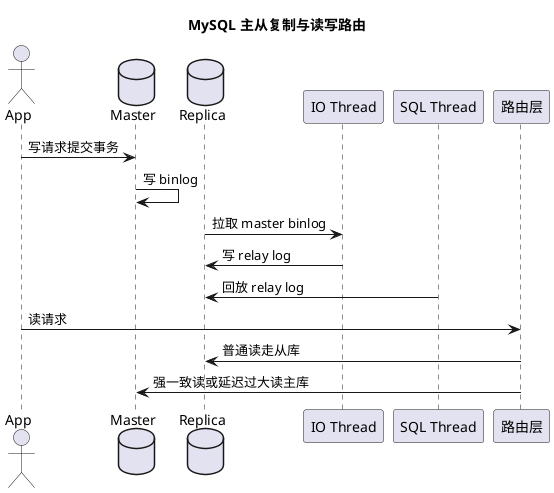

# 数据库主从与分片

## 问题索引

- Q1：数据库主从复制、读写分离和分片怎么理解？
- Q2：ShardingSphere 如何实现分片路由？按商户编码分片如何扩容并实现虚拟分槽？
- Q3：如何设计高频跨分片键查询，避免无脑全路由导致性能雪崩？
- Q4：分库分表架构下，如何确保外部回调能够反推商户分片？
- Q5：ShardingSphere 分库分表下如何设计异构索引与 CQRS 读写分离架构？
- Q6：Canal 事件只有变更字段和主键时，如何避免因缺少分片键而全路由？

## Q1：数据库主从复制、读写分离和分片怎么理解？

### 背景

单库单表随着业务增长，会遇到几个典型瓶颈：

- 单机读压力过高。
- 单机写入、存储、连接数达到上限。
- 单表数据量过大，索引维护和查询成本升高。
- 可用性不足，主库故障影响整个业务。

常见演进路线是：

```text
单库单表
  -> 主从复制
  -> 读写分离
  -> 垂直拆分
  -> 水平分库分表 / 分片
  -> 分布式事务、全局 ID、跨分片查询治理
```

### 主从复制是什么

主从复制是把主库上的数据变更同步到从库。

典型结构：

```text
应用写入
  -> 主库
  -> binlog
  -> 从库 relay log
  -> 从库重放
```

主库负责写，从库复制主库变更，提供备份、容灾和读扩展能力。

### MySQL 主从复制流程


### PlantUML 示意图：MySQL 主从复制与读写分离



主从复制核心依赖 binlog。

简化流程：

```text
1. 主库事务提交，写 binlog
2. 从库 IO 线程连接主库，拉取 binlog
3. 从库把 binlog 写入 relay log
4. 从库 SQL 线程读取 relay log
5. 从库重放日志，把数据变更应用到本地
```

更细一点：

| 组件 | 作用 |
| --- | --- |
| 主库 binlog | 记录数据变更 |
| 从库 IO thread | 从主库拉取 binlog |
| relay log | 从库存放拉取到的中继日志 |
| 从库 SQL thread | 重放 relay log |

### binlog 位点和 GTID

传统复制依赖 binlog 文件名和位置：

```text
mysql-bin.000123, position 456789
```

GTID，全称 Global Transaction Identifier，是全局事务 ID。

GTID 的好处：

- 每个事务有全局唯一编号。
- 主从切换和复制恢复更容易。
- 不需要人工精确找 binlog 位点。

面试回答可以简单说：

```text
早期主从复制基于 binlog file + position；
现在更推荐 GTID，便于故障切换和复制拓扑管理。
```

### 复制模式

#### 异步复制

主库提交事务后，不等待从库确认。

优点：

- 主库写入延迟低。
- 性能好。

缺点：

- 主库宕机时，可能有部分 binlog 没同步到从库，存在数据丢失风险。

#### 半同步复制

主库提交事务时，至少等待一个从库确认收到 binlog 后再返回成功。

优点：

- 降低主库宕机导致数据丢失的风险。

缺点：

- 写入延迟增加。
- 如果从库响应慢，主库可能退化或阻塞，取决于配置。

#### 组复制 / MGR

MySQL Group Replication 提供更强的复制一致性和故障切换能力。

复习时知道它属于更高阶的高可用复制方案即可，面试通常重点仍是 binlog 主从、延迟和读写分离。

### 主从延迟

主从延迟是主库提交后，从库还没来得及重放对应变更。

常见原因：

- 主库写入压力大，binlog 生成快。
- 从库 SQL 线程重放慢。
- 从库机器性能差。
- 大事务或批量更新导致重放时间长。
- 从库也承担大量查询，资源被抢占。
- 网络抖动。

查看延迟：

```sql
show slave status\G;
```

MySQL 8.0 新语义也可能是：

```sql
show replica status\G;
```

重点看：

- `Seconds_Behind_Master` / `Seconds_Behind_Source`
- `Slave_IO_Running` / `Replica_IO_Running`
- `Slave_SQL_Running` / `Replica_SQL_Running`
- `Relay_Log_File`
- `Exec_Master_Log_Pos`
- `Read_Master_Log_Pos`

表现判断：

| 表现 | 说明 |
| --- | --- |
| IO 线程 No | 从库拉不到主库 binlog，可能网络、账号、主库故障 |
| SQL 线程 No | 从库重放失败，可能主从数据不一致或 SQL 报错 |
| Seconds_Behind_Master 高 | 主从延迟明显 |
| Read pos 和 Exec pos 差距大 | 拉取快但重放慢 |

### 读写分离

读写分离是把写请求发到主库，把部分读请求发到从库。

典型架构：

```text
应用
  -> 数据源路由 / 中间件
      -> 主库：insert / update / delete / 强一致读
      -> 从库：普通查询、报表查询
```

收益：

- 分摊读压力。
- 从库可横向扩展。
- 报表或低实时性查询不影响主库。

风险：

- 主从延迟导致读到旧数据。
- 写后立刻读，如果走从库，可能读不到刚写入的数据。
- 事务内读写路由错误会造成一致性问题。

### 读写分离一致性方案

#### 写后读主

用户刚写完数据后，一段时间内读主库。

适合：

- 下单后查订单详情。
- 修改资料后立即刷新页面。

可以通过用户维度标记：

```text
用户发生写操作
  -> 记录 userId 短期读主
  -> TTL 3 到 5 秒
```

#### 强一致接口读主

对一致性要求高的接口，直接路由主库。

例如：

- 支付状态确认。
- 库存扣减结果。
- 订单提交结果。

#### 根据延迟动态路由

监控从库延迟，如果延迟超过阈值，暂时摘掉从库或减少读流量。

```text
Seconds_Behind_Master > 3s
  -> 从库不参与实时查询
```

#### 半同步复制

半同步能降低数据丢失风险，但不能完全消除读延迟，因为从库收到 binlog 不代表已经重放完成。

所以半同步不是“写后读从一定一致”的万能方案。

### 分片是什么

分片是把数据按规则拆到多个库或多张表。

分片通常包括：

- 垂直拆分。
- 水平拆分。
- 分库。
- 分表。

### 垂直拆分

按业务模块拆库或拆表。

例如：

```text
用户库：user、user_profile
订单库：orders、order_item
库存库：product、stock
营销库：coupon、activity
```

优点：

- 业务边界清晰。
- 降低单库复杂度。
- 不同业务可以独立扩容。

缺点：

- 跨库 join 困难。
- 跨库事务复杂。
- 需要服务层聚合。

### 水平拆分

把同一张逻辑表的数据按规则拆到多个物理表或物理库。

例如订单表：

```text
orders_0
orders_1
orders_2
orders_3
```

按 `user_id % 4` 分表：

```text
user_id = 1001 -> orders_1
user_id = 1002 -> orders_2
```

优点：

- 单表数据量下降。
- 单库压力下降。
- 可以横向扩展。

缺点：

- 跨分片查询复杂。
- 分布式事务复杂。
- 全局唯一 ID 要单独设计。
- 分页、排序、聚合成本上升。
- 扩容迁移复杂。

### 常见分片算法

#### 哈希取模

```text
shard = user_id % 16
```

优点：

- 数据分布相对均匀。
- 实现简单。

缺点：

- 扩容困难。
- 从 16 片扩到 32 片时，大量数据需要迁移。

#### 范围分片

按时间或 ID 范围拆分。

例如：

```text
orders_2025
orders_2026
```

优点：

- 适合时间范围查询。
- 历史数据归档方便。

缺点：

- 热点可能集中在最新分片。
- 写入压力可能不均衡。

#### 一致性哈希

通过哈希环减少扩容时的数据迁移量。

优点：

- 扩容迁移量相对较少。

缺点：

- 实现和运维复杂度高。
- 数据库分片场景里通常还需要中间件或路由层支持。

#### 基因法

把分片基因写入业务 ID。

例如订单 ID 中包含用户分片信息。

优点：

- 通过订单 ID 可以快速定位分片。
- 适合订单详情这类按 ID 查询场景。

缺点：

- ID 生成规则复杂。
- 分片规则变更成本高。

### 分片键怎么选

分片键决定数据怎么路由。

选择原则：

- 高频查询条件中必须包含。
- 数据分布尽量均匀。
- 不容易变更。
- 能减少跨分片查询。
- 符合业务归属关系。

常见选择：

| 业务 | 分片键 |
| --- | --- |
| 订单 | `user_id`、`buyer_id`、`tenant_id` |
| 多租户系统 | `tenant_id` |
| IM 消息 | `conversation_id`、`user_id` |
| 日志流水 | 时间 + 业务 ID |

订单系统如果主要按用户查订单，`user_id` 是常见分片键；如果后台经常按订单号查详情，则订单号最好能反推出分片。

### 分片后的典型问题

#### 跨分片查询

如果查询不带分片键，就可能广播到所有分片：

```sql
select * from orders where order_no = 'O202606250001';
```

如果 `order_no` 不能反推出分片，就可能全分片扫描。

解决：

- 订单号带分片基因。
- 建立订单号到分片的映射表。
- 使用搜索引擎承接复杂查询。
- 限制后台查询条件必须带分片键。

#### 跨分片分页排序

例如：

```sql
select * from orders
where status = 'PAID'
order by create_time desc
limit 20;
```

分片后需要：

```text
每个分片查局部 TopN
  -> 应用或中间件归并排序
  -> 取全局 TopN
```

深分页会更麻烦，因为每个分片都要查更多数据再归并。

解决：

- 游标分页。
- 限制深分页。
- ES / OLAP 承接复杂检索。
- 冗余查询维度表。

#### 分布式事务

一次业务操作可能写多个分片。

例如：

```text
创建订单
  -> 写订单分片
  -> 写优惠券分片
  -> 写库存分片
```

解决方式：

- 尽量让一次事务落到一个分片。
- 本地消息表 + MQ 最终一致。
- TCC。
- Saga。
- 避免强依赖 XA，除非场景非常明确。

#### 全局唯一 ID

分库分表后，单库自增 ID 可能冲突。

常见方案：

- 雪花算法。
- 号段模式。
- Redis / 数据库发号器。
- ShardingSphere 分布式 ID。

ID 设计还要考虑：

- 趋势递增，减少 B+Tree 页分裂。
- 是否包含业务含义或分片基因。
- 时钟回拨问题。

#### 扩容迁移

取模分片扩容最麻烦。

例如：

```text
user_id % 16
扩到
user_id % 32
```

很多数据路由结果都会变化，需要迁移。

常见扩容策略：

- 预分片：一开始逻辑分成较多片，物理库少量承载。
- 双写迁移：新旧分片同时写，校验一致后切流。
- 增量同步 + 全量迁移。
- 使用中间件管理路由。

### ShardingSphere 视角

Java 项目中常见分片中间件是 ShardingSphere。

它主要提供：

- 数据源治理。
- 分片路由。
- 读写分离。
- 分布式 ID。
- 分布式事务能力。

使用中间件的好处：

- 应用不用自己硬编码分片路由。
- SQL 解析、路由、改写、归并由中间件处理。

代价：

- SQL 支持有限制。
- 复杂 SQL 性能不可控。
- 排查问题要理解实际路由到哪些库表。
- 中间件本身引入学习和运维成本。

### 主从 + 分片整体架构

一个常见结构：

```text
应用
  -> 分片中间件 / 数据源路由
      -> shard_0 主库 -> shard_0 从库
      -> shard_1 主库 -> shard_1 从库
      -> shard_2 主库 -> shard_2 从库
      -> shard_3 主库 -> shard_3 从库
```

写请求：

```text
根据分片键定位 shard
  -> 写对应主库
```

读请求：

```text
根据分片键定位 shard
  -> 如果允许弱一致，读从库
  -> 如果要求强一致，读主库
```

### 业务场景

订单系统可以这样设计：

- 按 `user_id` 分片，满足用户查订单列表。
- 订单号生成时带分片基因，满足订单号查详情。
- 支付回调、订单状态流转读主库，避免主从延迟。
- 用户订单列表可读从库，但写后短时间读主。
- 后台复杂筛选同步到 ES，避免跨分片扫库。
- 跨订单、库存、优惠券一致性用本地消息表 + MQ 最终一致。

### 踩坑点

1. 主从复制不等于强一致，从库可能延迟。
2. 半同步只确认从库收到日志，不代表从库已经重放完成。
3. 读写分离一定要处理写后读一致性。
4. 分片键选错会导致大量跨分片查询。
5. 分片后不要随意做跨库 join、深分页、全局排序。
6. 分库分表不是越早越好，过早分片会显著增加复杂度。
7. 扩容方案要提前设计，否则取模分片后期迁移成本很高。

### 面试话术

> 数据库主从复制主要解决读扩展、备份和高可用问题。MySQL 主库提交事务后写 binlog，从库 IO 线程拉取 binlog 写入 relay log，再由 SQL 线程重放。读写分离是在主从基础上把写请求发主库、读请求发从库，但必须处理主从延迟，例如写后读主、强一致接口读主、延迟过高摘除从库。分片解决的是单库单表容量和写入瓶颈，分为垂直拆分和水平分库分表。分片键要选高频查询条件、数据分布均匀且不易变化的字段。分片后会带来跨分片查询、分页排序、全局 ID、分布式事务和扩容迁移问题，所以一般要结合业务场景谨慎引入，复杂查询可以交给 ES 或 OLAP，跨服务一致性通常用本地消息表、MQ、TCC 或 Saga 做最终一致。

## 高频追问

- Q：主从复制为什么会延迟？
  A：主库 binlog 生成快、从库拉取慢、SQL 线程重放慢、大事务、从库查询压力、网络抖动都可能造成延迟。

- Q：半同步复制能解决写后读一致性吗？
  A：不能完全解决。半同步通常只保证至少一个从库收到 binlog，不代表从库已经重放完成，读从库仍可能读旧数据。

- Q：读写分离后用户刚下单查不到订单怎么办？
  A：写后短时间读主，或者强一致接口直接读主库，也可以根据主从延迟动态决定是否读从库。

- Q：分片键怎么选？
  A：选高频查询条件中必带、分布均匀、不易变化、能减少跨分片查询的字段，例如订单常用 `user_id` 或 `tenant_id`。

- Q：分片后怎么按订单号查详情？
  A：订单号里带分片基因，或者维护订单号到分片的映射表，否则可能需要广播查询。

- Q：分库分表后怎么处理跨分片事务？
  A：优先让一次事务落在一个分片；跨分片场景用本地消息表 + MQ、TCC、Saga 等最终一致方案，尽量避免大范围 XA。

## 复习清单

- [ ] 能画出 MySQL 主从复制流程
- [ ] 能解释 binlog、relay log、IO 线程、SQL 线程
- [ ] 能说明异步复制、半同步复制差异
- [ ] 能解释主从延迟和读写分离一致性方案
- [ ] 能区分垂直拆分和水平分片
- [ ] 能说明常见分片算法和分片键选择原则
- [ ] 能列出分片后的跨分片查询、分页、事务、全局 ID、扩容问题

## Q2：ShardingSphere 如何实现分片路由？按商户编码分片如何扩容并实现虚拟分槽？

### ShardingSphere 路由的完整链路

ShardingSphere-JDBC 通常位于应用数据访问层，应用仍然向逻辑表发送 SQL。中间件通过 SQL 解析和分片规则计算目标数据节点，再执行改写后的真实 SQL，最后把多个节点结果归并为逻辑结果。

~~~plantuml
@startuml
skinparam monochrome true
skinparam shadowing false

actor App
component "ShardingSphere-JDBC" as SS
component "SQL 解析/绑定" as Parse
component "路由引擎" as Route
component "SQL 改写" as Rewrite
component "执行引擎" as Execute
component "结果归并" as Merge
database "ds_0.t_order_000" as D0
database "ds_1.t_order_001" as D1

App -> SS : 逻辑 SQL
SS -> Parse
Parse -> Route : 表名、分片键、条件
Route -> Rewrite : 目标数据节点
Rewrite -> Execute : 真实 SQL
Execute -> D0
Execute -> D1
D0 --> Merge
D1 --> Merge
Merge --> App : 逻辑结果
@enduml
~~~

关键点不是“把 SQL 转发到某个库”，而是：

1. **解析**：识别逻辑表、查询条件、连接、排序、分页和参数。
2. **路由**：根据分片键和算法计算一个或多个真实数据节点。
3. **改写**：把逻辑表改成真实库表，必要时改写分页参数和生成辅助列。
4. **执行**：单路由直接执行，多路由并发或分批执行。
5. **归并**：对结果做流式、排序、聚合、分页、分组或聚合归并。

### ShardingSphere 中常见的路由方式

| 路由方式 | 触发条件 | 结果 | 适用场景 |
| --- | --- | --- | --- |
| 精确路由 | SQL 带精确分片键 | 一个或少量数据节点 | `merchant_code = ?` |
| 范围路由 | SQL 带范围分片键 | 一段分片或多个节点 | 时间、ID 范围查询 |
| 复合路由 | 多个分片键共同决定 | 根据多个条件筛选 | 租户 + 业务类型 |
| Hint 路由 | 代码显式提供路由值 | 绕过 SQL 中缺少分片键的问题 | 已从上下文取得商户编码 |
| 广播路由 | 没有可用分片条件 | 所有相关节点 | 低频后台查询、广播表 |
| 笛卡尔路由 | 多表关联条件无法绑定 | 多节点组合执行 | 应尽量避免 |

实际使用时要特别关注：查询里有没有分片键、分片键是否被函数包裹、多个表是否配置为绑定表，以及路由后会产生多少真实 SQL。

### 按商户编码分片的基本设计

假设订单表以 `merchant_code` 作为分片键，逻辑上有：

~~~text
ds_${0..3}.t_order_${000..015}
~~~

这里可以理解为 4 个数据库、每个数据库 16 张逻辑表。常规取模方案是：

~~~text
dbIndex    = hash(merchant_code) % 4
tableIndex = hash(merchant_code) % 16
target     = ds_${dbIndex}.t_order_${tableIndex}
~~~

这种方案要求：

- 所有写入和查询都能拿到 `merchant_code`。
- 商户编码尽量稳定，不要频繁变更。
- 哈希函数在所有服务和版本中保持一致。
- 订单号、支付回调号等外部标识最好能反推出商户分片，或者有路由映射表。

### ShardingSphere 如何选择算法

典型的算法职责可以这样划分：

- `StandardShardingAlgorithm`：一个分片键做精确或范围路由。
- `ComplexKeysShardingAlgorithm`：多个分片键联合计算。
- `HintShardingAlgorithm`：由应用通过 `HintManager` 主动提供分片值。
- `Inline`：简单表达式，例如取模，不适合复杂迁移映射。
- `CLASS_BASED`：接入自定义算法，实现商户编码到目标节点的规则。

分库和分表通常是两个策略。若数据库算法和表算法分别独立取模，必须保证它们使用同一个哈希值或同一个槽位映射，否则可能把数据库和表组合到不符合预期的节点。

概念性配置如下，具体属性名要按使用的 ShardingSphere 版本校准：

~~~yaml
rules:
  - !SHARDING
    tables:
      t_order:
        actualDataNodes: ds_${0..3}.t_order_${000..015}
        databaseStrategy:
          standard:
            shardingColumn: merchant_code
            shardingAlgorithmName: merchant-slot-database
        tableStrategy:
          standard:
            shardingColumn: merchant_code
            shardingAlgorithmName: merchant-slot-table
    shardingAlgorithms:
      merchant-slot-database:
        type: CLASS_BASED
        props:
          strategy: STANDARD
          algorithmClassName: com.example.sharding.MerchantSlotDatabaseAlgorithm
      merchant-slot-table:
        type: CLASS_BASED
        props:
          strategy: STANDARD
          algorithmClassName: com.example.sharding.MerchantSlotTableAlgorithm
~~~

自定义算法的核心要求：

1. 输入相同商户编码和同一份路由快照，必须得到稳定结果。
2. 算法只做内存计算，不要在每次 SQL 路由时访问数据库或远程服务。
3. 路由映射以版本化快照加载到本地缓存，并通过配置中心或治理中心刷新。
4. 数据库算法和表算法要使用同一个 `slot -> target` 映射版本。
5. 对没有分片键的范围路由要明确返回多节点，不能假装精确路由。

### 为什么直接从取模 4 扩到取模 8 很危险

原规则：

~~~text
hash(merchant_code) % 4
~~~

扩容后：

~~~text
hash(merchant_code) % 8
~~~

大量商户的目标节点会发生变化。此时仅修改 ShardingSphere 规则会造成：

- 新请求路由到新节点，但历史数据仍在旧节点。
- 读不到旧数据或出现重复数据。
- 正在执行的事务和迁移任务使用不同路由规则。
- 迁移期间双写、补偿和回滚边界不清晰。

分片规则变更不是数据迁移。ShardingSphere 的路由算法只决定“去哪里查/写”，不会因为取模参数变化而自动把历史行安全搬完。

### 虚拟分槽的基本做法

不要让商户编码直接映射到当前物理分片，而是增加一层稳定的逻辑槽位：

~~~text
slot = hash(merchant_code) % 1024
target = slotRoute[slot]
~~~

例如：

~~~text
slot 0..1023       固定不变
slotRoute[0..255]  -> ds_0
slotRoute[256..511] -> ds_1
slotRoute[512..767] -> ds_2
slotRoute[768..1023] -> ds_3
~~~

每个物理库还可以承载固定数量的真实表：

~~~text
slot -> {dataSource: ds_2, table: t_order_007}
~~~

扩容时只改变 `slotRoute`，不改变商户到槽位的计算：

~~~text
旧：1024 个槽位 -> 4 个数据库
新：1024 个槽位 -> 8 个数据库
只迁移被重新分配的槽位
~~~

这样扩容迁移量从“几乎重新计算所有商户”变成“迁移被选中的槽位”。迁移比例取决于新旧槽位映射，通常可以通过只移动部分槽位来控制。

### 在 ShardingSphere 中实现虚拟分槽的核心结构

建议维护独立的路由元数据，而不是把目标节点硬编码在算法中：

~~~text
slot_route
----------------------------------------
slot_id | target_ds | target_table | version | state
0       | ds_2       | t_order_007  | 12      | STABLE
1       | ds_0       | t_order_001  | 12      | STABLE
2       | ds_4       | t_order_003  | 13      | MIGRATING
~~~

自定义算法只做：

~~~text
merchant_code
  -> 稳定 hash
  -> slot_id
  -> 本地 slotRoute 快照
  -> 返回 availableTargetNames 中的真实节点
~~~

实现时要注意：

- `slotRoute` 必须有本地缓存，远程查表不能放在路由热路径。
- 数据库策略和表策略必须原子切换到同一个版本。
- 未加载新版本时不能部分刷新，否则可能出现库表组合不一致。
- 旧版本快照要保留，便于回滚和处理迁移中的旧请求。
- 目标节点必须已经在 `actualDataNodes` 或当前治理配置中声明。
- 算法返回的目标名必须来自 ShardingSphere 传入的可用目标集合。

### 虚拟槽扩容不是改配置那么简单

一个可控的槽位迁移状态机如下：

~~~plantuml
@startuml
skinparam monochrome true
skinparam shadowing false

state STABLE
state BACKFILL
state CATCH_UP
state VERIFY
state SWITCHED
state ROLLBACK

STABLE --> BACKFILL : 新节点准备完成
BACKFILL : 全量复制槽位数据
BACKFILL --> CATCH_UP : 记录增量位点
CATCH_UP : 消费 binlog/CDC 或双写增量
CATCH_UP --> VERIFY : 延迟达到阈值
VERIFY : 行数、校验和、抽样业务校验
VERIFY --> SWITCHED : 发布新 slotRoute 版本
VERIFY --> ROLLBACK : 校验失败
SWITCHED --> ROLLBACK : 发现新节点异常
ROLLBACK : 切回旧路由版本
@enduml
~~~

推荐流程：

1. 增加新数据源和新表，先不切换在线路由。
2. 选定需要迁移的槽位，做全量数据复制。
3. 通过 CDC、binlog 增量同步或可靠双写追平迁移期间的变更。
4. 对源和目标做行数、校验和、抽样业务字段校验。
5. 发布新的 `slotRoute` 版本，先灰度少量商户。
6. 观察错误率、延迟、读写一致性，再扩大切换范围。
7. 保留旧数据和旧路由一段观察窗口，确认无回滚需求后再清理。

自定义分片算法不能自动完成上述全量复制、增量追平、校验和回滚；这些需要迁移工具、CDC、数据校验服务和版本化路由共同完成。

### 商户分片中的特殊风险

虚拟槽只能解决“扩容时尽量少搬数据”，不能解决单个超大商户或热点商户本身过热：

- 一个商户的所有数据仍然会落在一个槽位。
- 一个热点商户可能压满单个数据库或表。
- 迁移槽位时，热点槽位的搬迁窗口更难控制。

如果单商户规模和流量明显超出普通商户，应考虑：

- 商户级专属库或专属槽位。
- `merchant_code + order_bucket` 二级分片。
- 按时间或订单号进一步分表。
- 热点读走缓存或搜索读模型。

不要为了追求完全均匀而破坏“按商户查询能精确路由”的核心收益。

### 高频追问

- Q：ShardingSphere 从逻辑 SQL 到真实库表经历哪些步骤？
  A：先解析和绑定 SQL，再根据分片条件执行路由，随后改写真实库表 SQL、调度到目标数据节点执行，最后对多节点结果进行归并。

- Q：为什么商户编码直接取模不利于扩容？
  A：分片数量变化会让大量商户的取模结果改变，仅修改规则会使新请求访问新节点而历史数据仍留在旧节点，因此需要稳定虚拟槽和数据迁移流程。

- Q：虚拟槽能不能把一个热点商户自动拆到多个库？
  A：不能。一个商户通常仍映射到一个槽位。单商户过热需要商户内二级分片、专属槽位、按时间或订单桶拆分，或者提供专属资源。

- Q：自定义 ShardingAlgorithm 能不能直接实现扩容迁移？
  A：不能只靠算法实现。算法负责路由，数据搬迁还需要全量复制、增量同步、校验、灰度切换和回滚状态机。

### 复习清单

- [ ] 能画出 ShardingSphere 解析、路由、改写、执行、归并链路
- [ ] 能区分标准、复合、Hint、广播和笛卡尔路由
- [ ] 能说明商户编码直接取模扩容为什么会大量迁移
- [ ] 能画出 `merchant_code -> slot -> dataSource/table` 两层路由
- [ ] 能说明槽位映射为什么需要本地缓存、版本快照和原子切换
- [ ] 能说明虚拟槽扩容的全量、增量、校验、切换和回滚步骤
- [ ] 能识别单个热点商户无法仅靠虚拟槽解决
- [ ] 能通过 SQL 日志或路由预览确认精确查询实际命中的库表节点

## Q3：如何设计高频跨分片键查询，避免无脑全路由导致性能雪崩？

### 跨分片键查询的本质风险

假设订单按 `merchant_code` 分片，但后台高频查询只有 `order_no`、`buyer_id` 或 `external_no`：

~~~sql
SELECT *
FROM t_order
WHERE external_no = ?;
~~~

如果 `external_no` 无法反推出 `merchant_code`，ShardingSphere 只能把 SQL 路由到多个分片。分片数从 4 增加到 64 后，一次请求可能变成：

~~~text
1 个逻辑请求
  -> 64 个真实 SQL
  -> 64 个连接/任务
  -> 64 份结果归并
  -> 最慢分片决定尾延迟
~~~

高并发下会出现：

- 数据库连接池被广播查询占满。
- 每个分片都做相同过滤，CPU 和 IO 成倍消耗。
- 归并线程、网络缓冲和应用堆内存上涨。
- 某个慢分片拖长整个请求。
- 重试机制再次广播，形成级联放大。

所以“ShardingSphere 能路由”不等于“广播路由适合线上高频查询”。

### 优先级一：建立查询路由索引

对于订单号、外部流水号等精确查询，维护一个轻量路由索引：

~~~text
external_no
  -> merchant_code
  -> slot_id
  -> target_ds / target_table
~~~

例如：

~~~sql
CREATE TABLE order_route_index (
    external_no VARCHAR(64) PRIMARY KEY,
    merchant_code VARCHAR(64) NOT NULL,
    slot_id INT NOT NULL,
    target_ds VARCHAR(32) NOT NULL,
    target_table VARCHAR(64) NOT NULL,
    order_id BIGINT NOT NULL,
    route_version INT NOT NULL,
    created_at DATETIME NOT NULL,
    KEY idx_merchant_created (merchant_code, created_at)
);
~~~

查询流程：

~~~text
external_no
  -> Redis/路由索引表精确查目标
  -> 取得 merchant_code 或 slot_id
  -> 通过 ShardingSphere 精确路由订单分片
  -> 回源查询订单详情
~~~

路由索引不是普通缓存那么简单，需要考虑：

- 写订单与写路由索引的一致性。
- 路由变更期间的版本号。
- 索引丢失时的修复和回源兜底。
- 迁移完成后目标节点更新。
- 外部编号唯一约束应该由哪个系统最终保证。

对强一致要求高的订单号查询，可以把路由索引设计为订单写入事务的一部分；如果索引位于独立中心库，则要通过可靠消息、CDC、补偿和读修复保证最终一致。

### 优先级二：让查询入口带上分片上下文

很多后台接口实际已经知道当前商户、租户或数据权限范围。应把它作为显式查询条件，或者通过可信的路由上下文传递：

~~~sql
SELECT *
FROM t_order
WHERE merchant_code = ?
  AND external_no = ?;
~~~

如果业务 SQL 不方便增加字段，可以使用 ShardingSphere 的 Hint 路由：

~~~text
认证/数据权限上下文
  -> 得到 merchant_code
  -> HintManager 设置分片值
  -> ShardingSphere 精确路由
~~~

使用 Hint 时必须注意：

- 路由值必须来自可信的认证和数据权限上下文，不能直接信任用户传参。
- `HintManager` 通常绑定当前线程，必须在 `finally` 中关闭。
- 异步线程、线程池和响应式链路要显式传递路由上下文。
- Hint 只解决路由，不会自动解决跨分片事务和结果归并。

### 优先级三：建立按查询维度组织的读模型

如果高频查询维度与主分片键天然不同，例如订单按商户分片，但后台需要按买家、商品、状态和时间组合筛选，不要强行让交易分片承担所有查询。

可以建立：

- 按外部订单号组织的查询索引。
- 按买家或收货人组织的冗余读表。
- Elasticsearch 订单搜索索引。
- ClickHouse、Doris 等 OLAP 查询模型。

推荐链路：

~~~text
查询条件
  -> 搜索/读模型筛选出 order_id + merchant_code
  -> 按 merchant_code 分组
  -> 对目标分片做批量精确查询
  -> 应用层按搜索结果顺序归并
~~~

搜索系统不应只返回 `order_id` 却不返回分片信息，否则命中后仍然要再次全路由。读模型至少应冗余：

- 业务主键。
- 分片键或槽位。
- 需要排序和过滤的字段。
- 路由版本或数据版本。

### 优先级四：使用复合分片键和绑定表

如果查询经常同时带 `merchant_code` 和 `buyer_id`，可以让复合分片算法共同参与路由；但不要为了覆盖少量查询，把多个高基数字段都塞进分片键，导致写入分布、迁移和规则复杂度失控。

分片键联合时要明确：

- 哪些字段用于数据库路由。
- 哪些字段只用于表内索引过滤。
- 缺少哪个字段会退化为范围或广播路由。
- 多个表是否使用相同分片键和分片算法。

订单主表和订单明细表如果按同一 `order_id`/`merchant_code` 规则落在同一节点，可以配置为绑定表，减少关联查询产生的笛卡尔路由。绑定表的前提是分片规则、分片键和逻辑关联关系一致，不是任意两张表声明绑定就能避免广播。

### 受控广播是兜底，不是高频主路径

少量后台查询确实无法拿到分片键时，可以保留广播，但要做资源预算：

~~~text
请求入口
  -> 判断是否允许广播
  -> 限定时间范围、租户范围和最大分片数
  -> 每个分片只取局部 TopN
  -> 限制并发执行数和总超时
  -> 归并后返回
~~~

至少增加以下保护：

- 只允许低频后台接口使用广播。
- 强制时间范围，禁止无条件全历史扫描。
- 设置最大路由分片数，超限直接拒绝或转异步任务。
- 使用独立连接池或资源隔离，避免拖垮交易流量。
- 每个分片设置超时和取消机制。
- 对排序分页执行局部 TopN，而不是拉取全量结果。
- 限制深分页，优先使用游标分页。
- 统计真实路由分片数、SQL 数量、归并耗时和最慢分片。
- 对广播失败、超时和重试设置熔断，避免故障时再次放大。

ShardingSphere 的 SQL 展开和结果归并能帮助执行广播，但不能替代上述限流、超时、隔离和降级治理。

### 在 ShardingSphere 中落地的查询决策

可以把查询路由设计成明确的优先级：

~~~plantuml
@startuml
skinparam monochrome true
skinparam shadowing false

start
:接收查询条件;
if (包含 merchant_code?) then (是)
  :ShardingSphere 精确/复合路由;
elseif (有订单号路由索引?) then (是)
  :查 route index 得到 slot/目标分片;
  :精确路由订单分片;
elseif (读模型支持?) then (是)
  :搜索/读模型返回 order_id + merchant_code;
  :按分片分组批量回源;
else (否)
  :受控广播或转异步任务;
endif
:限流、超时、归并和监控;
stop
@enduml
~~~

落地时可按以下方式实现：

1. 精确分片条件：直接让 ShardingSphere 使用标准分片算法。
2. 已知路由但 SQL 没有分片键：在请求边界使用 Hint，并严格清理上下文。
3. 多个分片键：使用复合算法，但明确缺少条件时的退化策略。
4. 跨分片关联：配置绑定表，或者先查路由索引再分组回源。
5. 复杂搜索：将 ShardingSphere 作为交易库访问层，搜索交给 ES/读模型。
6. 无法避免的广播：通过网关或数据访问层统一做分片数、超时和并发预算。

### 监控与验证

不要只看逻辑 SQL 是否成功，要观测：

- 单次请求实际路由到的分片数量。
- SQL 改写后的真实 SQL 数量。
- 各分片执行耗时和 P99/P999。
- 归并排序、聚合、分页耗时。
- 广播查询占总请求比例。
- 连接池等待、线程池队列和数据库 CPU/IO。
- 路由索引命中率、读模型延迟和回源比例。
- 虚拟槽迁移的复制延迟、校验差异和切换版本。

开发和灰度环境应打开 SQL 日志或使用 Proxy 的 SQL 预览能力，确认一条逻辑 SQL 到底展开成了多少真实 SQL。不要仅凭应用代码中的“带了条件”判断是否实现了精确路由。

### 常见误区

1. 认为 ShardingSphere 会自动为缺少分片键的 SQL 找到正确分片。
2. 把广播路由当成普通查询路径，忽略分片数增长后的线性放大。
3. 认为虚拟槽只要修改自定义算法即可完成扩容。
4. 在自定义分片算法中每次远程查询槽位映射，导致路由路径成为新瓶颈。
5. 分库算法和分表算法使用不同 hash 或不同路由版本，产生错误库表组合。
6. 迁移期间直接切换规则，没有增量同步、校验和回滚版本。
7. 只在搜索结果中保存订单号，不保存分片键，命中后仍然全路由回源。
8. 让交易分片库承担复杂多条件搜索、全局排序和深分页。
9. 使用 Hint 时没有清理线程上下文，导致连接复用后的路由污染。
10. 绑定表规则不一致，关联查询仍然产生笛卡尔路由。

### 面试话术

> ShardingSphere 会先解析逻辑 SQL，识别逻辑表和分片条件，再通过标准、复合、Hint 等分片算法计算真实数据节点，改写成真实库表 SQL，执行后再做结果归并。按商户编码直接取模扩容会导致大量商户路由变化，因此可以固定较多虚拟槽位，例如 1024 个槽位，先计算 `hash(merchant_code) % 1024`，再通过版本化的 `slot -> 物理库表` 映射定位。扩容时只迁移重新分配的槽位，并通过全量复制、CDC 增量追平、校验、灰度切换和回滚完成，不能只改路由规则。高频跨分片键查询不能依赖广播，应优先使用订单号到分片的路由索引、Hint 路由、按查询维度建立读模型或搜索索引；无法避免的广播必须限制时间范围、分片数、并发、超时和归并规模。

### 高频追问

- Q：高频跨分片键查询如何避免无脑全路由？
  A：优先从认证上下文补充分片键；精确业务编号通过路由索引换取 `merchant_code` 或槽位；复杂组合查询交给冗余读模型或搜索引擎，并携带分片信息分组回源；只有低频兜底场景才允许受控广播。

- Q：没有分片键时，ShardingSphere 为什么不能根据索引自动定位？
  A：中间件通常只知道分片规则，不会逐分片执行索引查询来猜测数据在哪；没有可计算的路由条件就只能广播，除非业务额外维护路由索引或读模型。

- Q：为什么不直接把订单号作为分片键？
  A：如果高频查询主要按订单号，订单号可以作为分片键；但还要评估订单列表按商户/买家查询、数据均匀性、回调路由和跨维度查询成本，必要时采用商户分片 + 订单路由索引。

- Q：跨分片分页怎么做？
  A：每个分片取局部 TopN，再做全局归并；深分页会放大每个分片的扫描和归并成本，优先改为游标分页或使用搜索读模型。

### 复习清单

- [ ] 能为订单号、外部流水号设计路由索引
- [ ] 能说明跨分片键查询的路由索引、读模型和受控广播方案
- [ ] 能说明 Hint、绑定表和复合分片算法的适用边界
- [ ] 能设计分片数、并发、超时、归并和熔断保护
- [ ] 能说明搜索或读模型为什么必须返回 `order_id` 和分片键/槽位
- [ ] 能通过 SQL 日志、路由预览或监控确认逻辑 SQL 展开的真实节点数和 SQL 数量

## Q4：分库分表架构下，如何确保外部回调能够反推商户分片？

### 问题本质

订单、支付单按 `merchant_code` 分片，但支付、物流、短信等第三方回调常常只携带：

- 我方请求号或商户订单号。
- 第三方流水号。
- 第三方分配的商户号。
- 回调自定义参数。

如果这些字段不能稳定转换成 `merchant_code` 或虚拟槽位，下面这条 SQL 就缺少分片键：

~~~sql
SELECT *
FROM t_payment_order
WHERE channel_trade_no = ?;
~~~

ShardingSphere 无法因为某个分片里存在 `channel_trade_no` 索引就自动知道数据在哪，最终只能全路由。回调重试和流量突增时，全路由会把一次回调放大成 N 个分片查询。

因此，核心原则是：

> 在发起外部请求、仍然明确知道商户和业务单据时，提前建立“外部回调键 -> 商户/槽位/业务单”的确定关系；回调到达后只做解析和查表，不能临时猜测分片。

### 推荐的总体链路

~~~plantuml
@startuml
skinparam monochrome true
skinparam shadowing false

actor Merchant
participant "业务服务" as Biz
database "商户业务分片" as Shard
database "全局回调路由索引" as Route
participant "第三方渠道" as Channel
participant "回调网关/Inbox" as Callback
queue "按商户或槽位分区的 MQ" as MQ

Merchant -> Biz : 发起支付/业务请求
Biz -> Biz : 生成 merchant_request_no
Biz -> Shard : 创建业务单
Biz -> Route : 预建 request_no -> merchant/slot/order
Biz -> Channel : 携带 merchant_request_no 调用
Channel --> Biz : 返回 channel_trade_no
Biz -> Route : 补充第三方流水号别名

Channel -> Callback : 签名回调
Callback -> Callback : 验签并持久化 Inbox
Callback -> Route : 按回调键反查路由
Route --> Callback : merchant_code/slot/order_id
Callback -> MQ : 携带完整分片上下文投递
MQ -> Biz : 消费回调事件
Biz -> Shard : 带 merchant_code 精确路由并幂等更新
@enduml
~~~

这条链路有两个关键时点：

1. **调用第三方之前**：生成我方可控且全局唯一的请求号，并建立路由关系。
2. **收到第三方回调之后**：先可靠保存原始回调，再根据可信回调键解析路由，异步更新业务分片。

### 方案一：让业务单号携带分片基因

如果第三方协议保证在回调中原样返回 `merchant_request_no`，可以让请求号携带稳定的槽位信息：

~~~text
版本 + 槽位 + 时间/序列 + 校验位

示例：P1-02F-20260723-8K3M9X-C
          ^^^
          Base36 编码的 slot_id
~~~

回调时先从请求号解析 `slot_id`，再通过版本化的 `slot_id -> dataSource/table` 映射定位物理分片。

优点：

- 不依赖一次额外的中心路由查询。
- 即使 Redis 或路由索引短暂故障，仍可计算候选分片。
- 回调流量越大，纯计算方案优势越明显。

限制：

- 编码格式一旦对外使用，很难修改，必须带版本号。
- 不要直接暴露可读的商户 ID，优先编码无业务含义的虚拟槽位。
- 必须有校验位或签名，避免伪造编号把请求导向任意分片。
- 槽位扩容迁移期间要支持旧、新映射版本或迁移状态，不能只按当前物理库数量取模。

如果直接把 `hash(merchant_code) % 当前库数` 写进单号，扩容后旧单号会按新库数算出错误位置。正确做法是写入稳定虚拟槽，而不是瞬时物理库编号。

### 方案二：建立全局回调路由索引

编码不方便携带槽位，或者第三方只返回外部流水号时，应建立轻量路由索引：

~~~sql
CREATE TABLE callback_route_index (
    id BIGINT PRIMARY KEY,
    channel_code VARCHAR(32) NOT NULL,
    channel_account_no VARCHAR(64) NOT NULL,
    callback_key VARCHAR(128) NOT NULL,
    merchant_request_no VARCHAR(64) NOT NULL,
    channel_trade_no VARCHAR(128) NULL,
    merchant_code VARCHAR(64) NOT NULL,
    slot_id INT NOT NULL,
    biz_order_id BIGINT NOT NULL,
    route_version INT NOT NULL,
    status TINYINT NOT NULL DEFAULT 0,
    created_at DATETIME NOT NULL,
    updated_at DATETIME NOT NULL,
    -- 不同渠道的流水号命名空间可能重叠，唯一键必须包含渠道。
    UNIQUE KEY uk_channel_callback (channel_code, callback_key),
    UNIQUE KEY uk_channel_request (channel_code, merchant_request_no),
    -- 第三方流水号可能只在渠道账户内唯一，不能假设跨商户号全局唯一。
    UNIQUE KEY uk_channel_trade (channel_code, channel_account_no, channel_trade_no),
    KEY idx_merchant_order (merchant_code, biz_order_id)
);
~~~

这里的 `callback_key` 应采用渠道协议中最稳定、回调必传的字段：

| 回调能够返回的字段 | 路由索引设计 |
| --- | --- |
| 我方 `merchant_request_no` | 调用第三方前预建映射，优先级最高 |
| 第三方 `channel_trade_no` | 同步响应取得后补充别名映射 |
| 第三方商户号 + 外部流水号 | 使用 `(channel_account_no, channel_trade_no)` 组合键 |
| 自定义透传字段 | 放签名后的路由令牌，不放明文商户 ID |

路由索引是正确性数据，不能只存在 Redis。可使用“数据库为准、Redis 加速”的两级结构：

~~~text
callback_key
  -> Redis 路由缓存
  -> 未命中则查 callback_route_index
  -> 得到 merchant_code / slot_id / biz_order_id
  -> 在 SQL 中显式携带 merchant_code
  -> ShardingSphere 精确路由
~~~

中心路由索引也不必永远是单库单表。数据量或吞吐达到瓶颈时，可以按照 `hash(channel_code + callback_key)` 独立分片，因为回调入口天然持有这个键。它的分片规则应独立于商户业务库，避免再次出现“查路由索引也需要先知道商户”的循环依赖。

### 最稳妥的回调键选择顺序

工程上建议按以下优先级设计：

1. **我方请求号**：我方生成、调用前可落库、第三方回调原样返回。
2. **签名路由令牌**：第三方支持透传 `attach/passback/custom_data` 时使用。
3. **第三方流水号映射**：同步调用响应返回第三方流水号后建立别名。
4. **第三方商户号映射**：由渠道商户号先找到内部商户或商户组，再结合流水号定位。
5. **受控广播**：只能作为极低频人工兜底，不能成为正常回调链路。

其中第一种最可靠。因为发起调用时已经知道 `merchant_code`，也能在外部系统介入之前完成持久化。

### 为什么不能只依赖第三方流水号

如果第三方流水号只能在请求返回后拿到，会存在时序竞态：

~~~text
调用第三方
  -> 第三方业务处理成功
  -> 第三方回调先到达
  -> 我方同步响应尚未处理或映射尚未提交
  -> 回调按 channel_trade_no 查不到路由
~~~

不能因为映射暂时不存在就直接返回成功并丢弃回调，也不能立即广播所有业务分片。应组合使用：

- 调用前预建我方请求号映射，并要求第三方回传。
- 回调先写入全局 `callback_inbox`，映射未就绪时标记 `ROUTE_PENDING`。
- 短周期延迟重试路由解析，等待同步响应补齐第三方流水号别名。
- 超过阈值进入待核对队列，按渠道查询接口主动查询交易详情。
- 通过监控告警和人工补偿处理协议异常。

### 回调 URL 携带路由信息是否可行

部分渠道允许每笔请求传入回调 URL，可以携带不可伪造的短令牌：

~~~text
https://callback.example.com/payment/provider-a?route_token=...
~~~

令牌中可包含：

~~~text
version + slot_id + biz_order_id + expire_at + nonce + HMAC
~~~

但它只适合作为辅助方案：

- 必须确认第三方会完整保留查询参数。
- 令牌必须签名、设置版本和有效期，不能信任明文 `merchant_code`。
- 回调验签和路由令牌校验是两件事，都要执行。
- 很多渠道使用固定回调地址，或者不保证透传 URL 参数。

因此，即使使用路由令牌，也建议保留数据库路由索引作为审计与兜底。

### 回调网关与 Inbox 设计

回调入口不应在 HTTP 线程内执行复杂业务，更不能因暂时无法路由就让第三方持续重试并放大流量。推荐步骤：

1. 根据渠道规则验签、校验时间戳和防重放参数。
2. 提取稳定回调键，保存原始报文摘要和必要字段。
3. 使用 `(channel_code, callback_event_id)` 唯一键写入 `callback_inbox`，完成接收幂等。
4. 解析 `merchant_code`、槽位和业务单 ID。
5. 发送携带完整路由上下文的 MQ 消息，消息分区键使用商户、槽位或业务单号。
6. 持久化成功后快速响应第三方，业务处理由消费者异步完成。
7. 消费者用业务状态机或条件更新保证业务幂等。

接收幂等和业务幂等必须分开：Inbox 防止同一回调事件被重复投递，业务单状态机防止不同事件或主动查询结果重复推进状态。

### ShardingSphere 中如何精确落到商户分片

解析出 `merchant_code` 后，首选在业务 SQL 中显式加入分片键：

~~~sql
UPDATE t_payment_order
SET pay_status = 'SUCCESS',
    channel_trade_no = ?,
    paid_at = ?
WHERE merchant_code = ?
  AND id = ?
  -- 条件更新保证重复成功回调不会反复推进状态。
  AND pay_status = 'PENDING';
~~~

显式分片键有利于 SQL 审计、路由预览和问题排查。如果历史表结构或通用 DAO 无法增加分片条件，才考虑使用 `HintManager`：

~~~java
try (HintManager hintManager = HintManager.getInstance()) {
    // routeContext 来自已验签回调和持久化路由索引，不能直接采用外部明文参数。
    hintManager.addDatabaseShardingValue("t_payment_order", routeContext.merchantCode());
    hintManager.addTableShardingValue("t_payment_order", routeContext.merchantCode());

    paymentOrderRepository.markPaid(
        routeContext.orderId(),
        callback.channelTradeNo(),
        callback.paidAt()
    );
} // try-with-resources 确保清理线程绑定的 Hint，避免线程池复用导致路由污染。
~~~

如果自定义算法采用 `merchant_code -> slot -> 物理节点`，路由索引最好同时保存 `merchant_code`、`slot_id` 和 `route_version`：

- 正常查询用 `merchant_code` 走统一分片算法。
- 排查时可以核对解析槽位与索引槽位是否一致。
- 扩容迁移时根据 `route_version`、槽位状态决定旧节点、新节点或双读。
- 不能长期直接信任历史 `target_ds/target_table`，因为物理位置可能迁移。

### 路由索引如何保证一致性

按可靠程度排序：

1. 业务单和路由索引在同一数据库事务中提交。
2. 路由索引独立部署时，业务事务同时写 Outbox，再可靠投递到路由中心。
3. 调用第三方之前同步确认路由索引已经创建；失败则不发起外部调用。
4. 定时任务校验业务单与路由索引，缺失时自动补建。
5. Redis 只作缓存，缓存丢失后必须能从持久化索引恢复。

如果必须跨库，不能用“先调用第三方，稍后异步建索引”的顺序。外部调用已经产生不可回滚副作用，而路由消息可能丢失或延迟。至少要先持久化业务单和 Outbox，再由任务推进到 `ROUTE_READY` 后调用第三方。

### 分片扩容期间如何处理旧回调

外部回调可能在订单创建数天甚至数月后到达，因此扩容不能只考虑新订单：

- 单号携带的是稳定 `slot_id`，通过当前槽位映射找到新位置。
- 路由索引保留 `route_version`，迁移中记录槽位状态和新旧目标。
- 数据迁移采用全量复制、增量追平、校验、切读、停旧写流程。
- 切换窗口内允许按槽位双读，但写入只能由状态机确定唯一主节点。
- 迁移完成后更新路由缓存；不要过早删除旧索引和旧数据。
- 对长生命周期业务明确路由索引保留期限，不能早于最晚回调、退款、撤销和对账周期。

### 异常场景与兜底

| 异常 | 处理方式 |
| --- | --- |
| 路由缓存未命中 | 回源持久化路由索引并回填缓存 |
| 持久化索引暂时不存在 | Inbox 标记 `ROUTE_PENDING`，延迟重试 |
| 回调商户与路由索引不一致 | 隔离并告警，不进入业务分片 |
| 槽位处于迁移状态 | 根据迁移状态表执行新旧节点查询或读修复 |
| 第三方重复回调 | Inbox 唯一键 + 业务状态条件更新双重幂等 |
| 回调乱序 | 业务状态机校验合法迁移，必要时主动查询渠道最终状态 |
| 无任何可用回调键 | 进入人工/渠道查询兜底，禁止默认全分片广播 |

### 常见误区

1. 在回调到达后才根据第三方流水号临时搜索所有分片。
2. 只把映射放 Redis，缓存淘汰后失去路由能力。
3. 把 `merchant_code` 放在回调参数中，却不验第三方签名和映射一致性。
4. 先调用第三方，再异步创建路由索引，留下回调先到的竞态窗口。
5. 把物理库编号编码进业务单号，扩容后旧单号路由失效。
6. 回调映射表也按 `merchant_code` 分片，导致查询映射前仍然需要商户编码。
7. 路由成功后只按业务 ID 更新，不在 SQL 中携带分片键，仍触发广播。
8. 接收回调后立即返回成功，但原始事件尚未可靠落库或入队。
9. 将接收幂等等同于业务幂等，重复事件仍可能重复推进订单状态。
10. 迁移后立即删除旧槽位数据和路由版本，导致延迟回调无法补偿。

### 面试话术

> 按商户分片后，外部回调不能依赖 ShardingSphere 广播查询。最稳妥的做法是在发起第三方调用前生成我方请求号，并持久化“渠道 + 请求号 -> merchant_code、slot_id、业务单 ID、路由版本”的全局路由索引，再要求第三方在回调中原样返回请求号。业务单号也可以携带带版本和校验位的虚拟槽基因，但不要绑定当前物理库数量。回调入口先验签并写 Inbox，再通过请求号、第三方流水号别名或签名路由令牌取得商户分片上下文，消息携带该上下文，消费端在 SQL 中显式带 `merchant_code` 让 ShardingSphere 精确路由，并使用条件更新保证幂等。路由索引必须持久化，Redis 只能加速；映射未就绪时延迟重试，禁止把全路由作为正常兜底。扩容期间通过稳定槽位、路由版本和迁移状态兼容历史回调。

### 高频追问

- Q：单号携带分片基因和路由索引，应该选哪个？
  A：单号基因路由快、依赖少，但编码协议长期固化；路由索引更灵活且便于迁移、审计。核心交易通常两者结合，单号槽位用于快速定位，索引用于校验和兜底。

- Q：回调只给第三方流水号怎么办？
  A：同步响应取得流水号后建立别名映射，同时用 Inbox 承接可能先到的回调并延迟重试。更优方案是推动渠道回传我方请求号或透传签名自定义字段。

- Q：路由索引会不会成为单点瓶颈？
  A：它只保存轻量映射，可缓存、读写分离，并按 `channel_code + callback_key` 独立分片；关键是它的路由键必须在回调入口天然可得。

- Q：为什么不能相信回调里的 merchant_code？
  A：外部参数可能被伪造或配置错误。必须先验证渠道签名，再用持久化映射反查并与业务单校验，冲突时隔离处理。

- Q：收到回调后什么时候可以向第三方返回成功？
  A：至少在原始回调已经幂等、可靠地持久化到 Inbox 或等价消息存储之后；不必等待业务分片完成全部状态更新。

### 复习清单

- [ ] 能说明为什么必须在调用第三方之前建立回调路由关系
- [ ] 能设计 `channel + callback_key -> merchant/slot/order` 路由索引
- [ ] 能比较单号分片基因、全局路由索引和签名路由令牌
- [ ] 能处理第三方流水号映射晚于回调到达的时序竞态
- [ ] 能设计回调验签、Inbox、MQ、精确路由和业务幂等链路
- [ ] 能说明 Redis 不能作为路由索引唯一数据源
- [ ] 能说明扩容迁移期如何兼容历史回调和路由版本
- [ ] 能避免 Hint 线程上下文污染和缺少分片键导致的广播

## Q5：ShardingSphere 分库分表下如何设计异构索引与 CQRS 读写分离架构？

### 先区分两种“读写分离”

这个场景容易把两个概念混在一起：

| 类型 | 写入 | 读取 | 主要目标 |
| --- | --- | --- | --- |
| 数据库主从读写分离 | MySQL 主库 | MySQL 从库 | 分担读压力、提高可用性 |
| CQRS 异构读写分离 | 分片 MySQL 写模型 | ES、查询宽表、ClickHouse 等读模型 | 让读模型按查询方式重新组织数据 |

ShardingSphere 的分片和主从读写分离能力主要解决 MySQL 数据节点的路由问题。它不会自动把分片数据同步成 Elasticsearch 异构索引，也不会自动保证 MySQL 与 ES 一致。

CQRS 的核心是把职责拆开：

- **Command 写模型**：承接创建、修改、支付、退款等业务命令，维护事务、约束和状态机。
- **Query 读模型**：按照列表、搜索、聚合、排序等查询需求冗余数据，不承担最终业务事实判断。

CQRS 不等于事件溯源，也不要求一开始就拆成两个微服务。只要写模型和查询模型的职责、数据结构与一致性边界明确，就已经采用了 CQRS 思路。

### 总体架构

~~~plantuml
@startuml
skinparam monochrome true
skinparam shadowing false

actor User
component "Command API" as Command
component "Query API" as Query
component "ShardingSphere-JDBC/Proxy" as SS
database "分片 MySQL\n事实写模型" as MySQL
database "Outbox" as Outbox
queue "业务事件 MQ" as MQ
component "Projection\n投影服务" as Projection
database "Elasticsearch\n搜索读模型" as ES
database "查询宽表/OLAP\n可选读模型" as ReadDB
component "Canal/CDC\n校验与补偿" as CDC

User -> Command : 创建/修改业务
Command -> SS : 带 merchant_code 写入
SS -> MySQL
SS -> Outbox : 同事务记录事件
Outbox -> MQ : 可靠投递
MQ -> Projection
Projection -> ES : 幂等 upsert/delete
Projection -> ReadDB : 构建其他查询模型

User -> Query : 搜索/列表/统计
Query -> ES
Query -> ReadDB
Query -> SS : 强一致或详情回源

MySQL -> CDC : binlog
CDC -> Projection : 漏数校验/补偿事件
@enduml
~~~

架构中的权威关系必须固定：

~~~text
分片 MySQL = Source of Truth，决定订单真实状态
ES/查询宽表 = Projection，决定怎么高效查询和展示
~~~

例如 ES 显示“已支付”，但 MySQL 状态仍是“待支付”，支付、退款、库存等决策必须以 MySQL 或业务状态机为准。

### 为什么分库分表后需要异构索引

假设订单按 `merchant_code` 分片，而运营后台需要按以下条件组合查询：

~~~text
外部订单号 + 买家手机号 + 商品名称 + 订单状态
+ 支付时间范围 + 渠道 + 模糊搜索 + 全局排序分页
~~~

这些条件通常不都包含分片键。让 ShardingSphere 对所有分片广播 SQL 会产生：

- 查询扇出随分片数量线性增长。
- 每个分片都要占用连接、CPU 和 IO。
- 排序、聚合、分页需要跨节点归并。
- 最慢分片决定整体尾延迟。
- 深分页会在每个分片扫描大量无效数据。

异构索引把“写入时按商户组织”转换成“读取时按查询条件组织”，用一定的数据冗余和最终一致性换取稳定查询性能。

### 写模型如何设计

写模型继续由 ShardingSphere 路由到分片 MySQL，保持以下约束：

- 每个写命令必须明确 `merchant_code` 或其他主分片键。
- 聚合内需要强一致的数据尽量落在同一分片。
- 状态变化由业务状态机控制，不让 ES 反向修改交易状态。
- 写入业务数据时同步记录 Outbox 事件，避免数据库提交成功但 MQ 消息丢失。
- 事件携带业务主键、商户分片键、版本号和变更语义。

一个订单变更事件至少包含：

~~~json
{
  "eventId": "evt-20260723-001",
  "eventType": "ORDER_PAID",
  "orderId": 1008611,
  "merchantCode": "M1001",
  "slotId": 47,
  "orderVersion": 18,
  "changedFields": ["payStatus", "paidAt"],
  "occurredAt": "2026-07-23T15:30:00+08:00"
}
~~~

`merchantCode/slotId` 不能省略。它既用于投影服务回源分片 MySQL，也用于 ES 查询命中后按分片分组回源。

### 读模型如何设计

读模型不是把分片表结构原样复制到 ES，而是根据查询接口反向设计文档：

~~~text
order_search_document
  -> order_id                 业务主键
  -> merchant_code / slot_id  回源路由
  -> order_version            幂等和新旧判断
  -> display fields           列表直接展示字段
  -> filter fields            状态、渠道、时间等筛选字段
  -> search fields            商品名、收货人等全文检索字段
  -> sort fields              创建时间、支付时间等排序字段
~~~

常见读模型选择：

| 查询类型 | 合适的读模型 |
| --- | --- |
| 精确订单号定位分片 | MySQL/Redis 轻量路由索引 |
| 多条件过滤、模糊搜索、列表排序 | Elasticsearch |
| 固定条件高频列表 | 按查询维度设计的 MySQL 冗余表 |
| 大规模统计分析 | ClickHouse、Doris 等 OLAP 模型 |

不要因为已经引入 ES，就把精确主键查询、强一致查询和交易决策全部迁过去。不同读模型解决不同问题。

### 数据如何同步到异构索引

常见有三种方案：

| 方案 | 优点 | 主要问题 | 建议用途 |
| --- | --- | --- | --- |
| 应用直接双写 MySQL + ES | 链路短、可见快 | 两边无法本地事务，失败与重试复杂 | 不作为唯一可靠方案 |
| Outbox/事务消息 + MQ | 有业务语义，可控、可补偿 | 需要事件治理与投影服务 | 实时主链路 |
| Canal/Debezium 订阅 binlog | 业务侵入低，可覆盖所有 DB 变化 | 缺少业务语义，关联组装容易回查 DB | 通用同步或补偿链路 |

推荐组合：

~~~text
主链路：业务事务 -> Outbox -> MQ -> Projection -> ES
兜底链路：binlog CDC -> 漏事件检测/补偿 -> Projection -> ES
~~~

如果系统规模较小，也可以先使用 Canal + MQ + ES，但仍要实现消费幂等、版本控制、删除同步、失败重试和全量重建。不能把“Canal 能续传 binlog”理解成“ES 一定不会重复、乱序或漏更新”。

### 投影服务如何组装文档

投影有两种方式：

#### 事件携带完整快照

事件包含构建搜索文档所需字段，投影服务直接写 ES。

优点是无须回查分片库，吞吐稳定；缺点是事件较大，多个系统共同维护字段契约的成本更高。

#### 事件只携带变更通知

事件只携带 `orderId + merchantCode + version`，投影服务使用 `merchantCode` 通过 ShardingSphere 精确回源，读取最新快照后组装文档。

优点是事件简单且文档总能按当前规则重建；缺点是每条事件可能产生数据库查询。应按 `merchantCode/slotId` 分组批量回源，避免 N 条事件变成 N 次随机查询。

工程中常采用混合方式：高频、稳定字段随事件发送；关联字段由投影服务批量查询或从本地维表缓存补齐。

### 查询到底要不要回源 MySQL

根据一致性和数据完整性分三类：

#### 列表完全由 ES 返回

ES 文档包含列表展示所需全部字段，搜索后直接返回。查询最快，也不会对分片 MySQL 产生二次压力，但列表接受最终一致性。

#### ES 筛选，MySQL 回源详情

ES 只负责找到候选数据，并返回：

~~~text
order_id + merchant_code/slot_id + order_version + sort_value
~~~

应用按 `merchant_code` 分组，对少量目标分片批量查询，再按照 ES 返回顺序组装结果。

需要注意：如果一页 50 条数据分散在 40 个分片，回源仍然昂贵。应限制单页大小、并行度和超时，并评估是否让 ES 冗余更多展示字段以减少回源。

#### 强一致查询直接走写模型

支付结果确认、库存判断、退款资格、刚写入后的精确详情等强一致场景，直接携带分片键查询 MySQL，不通过 ES 判断。

可以把查询决策明确化：

~~~plantuml
@startuml
skinparam monochrome true
skinparam shadowing false

start
:接收查询请求;
if (涉及交易决策或强一致?) then (是)
  :携带 merchant_code 查询分片 MySQL;
elseif (精确编号且有路由索引?) then (是)
  :路由索引定位商户/槽位;
  :精确查询分片 MySQL;
elseif (复杂筛选/搜索/排序?) then (是)
  :查询 ES 异构索引;
  if (ES 文档字段足够?) then (是)
    :直接返回读模型结果;
  else (否)
    :按 merchant_code 分组批量回源;
  endif
else (其他)
  :查询专用宽表或 OLAP 读模型;
endif
stop
@enduml
~~~

### 如何保证最终一致性

CQRS 异构索引通常不追求 MySQL 与 ES 的分布式强事务，而是建立可观测、可修复的最终一致性闭环。

#### 幂等与乱序控制

- ES 文档 ID 使用稳定业务主键，例如 `order_id`，避免重复创建文档。
- 每个事件携带单调递增的 `order_version`。
- 投影写入只允许新版本覆盖旧版本，旧消息不能覆盖新状态。
- 相同 `eventId` 的重复消息可以安全重放。
- 删除使用带版本的删除事件或墓碑，避免旧更新让已删除文档复活。

概念性更新逻辑：

~~~text
incomingVersion > storedVersion
  -> 执行 upsert/delete
otherwise
  -> 忽略重复或乱序事件
~~~

不能只比较 `update_time`。不同服务器时间漂移、同毫秒多次更新和历史回放都可能导致判断错误，业务版本号更可靠。

#### 对账与修复

- 实时监控 DB commit 到 ES 可搜索的端到端延迟。
- 按时间窗口比较 MySQL 与 ES 的数量、主键集合、版本和关键字段摘要。
- 对差异数据发送修复事件，不直接人工修改 ES。
- 定期抽样回源校验，热点商户和高价值订单提高采样比例。
- 保留按商户、时间和 ID 范围重放事件或重建文档的能力。

#### 索引重建

字段类型、分词器或索引结构发生不兼容变化时，不要直接原地修改：

~~~text
order_search_v1 继续提供查询
  -> 创建 order_search_v2
  -> 历史数据限速回填 v2
  -> 增量事件双投影 v1/v2
  -> 校验数量、版本、抽样查询
  -> alias 原子切换到 v2
  -> 保留 v1 回滚窗口
~~~

实时同步消费者和历史回填任务必须资源隔离，防止全量重建挤占实时事件，导致新订单长时间不可搜索。

### 写后立即读如何处理

用户刚创建订单就刷新列表时，ES 可能尚未完成消费和 refresh。可根据业务要求选择：

1. 接受秒级最终一致，并在前端保留提交结果。
2. 精确详情按 `order_id + merchant_code` 回源 MySQL。
3. 对当前会话维护短期“最近写入集合”，查询 ES 后与最近写入结果合并。
4. 极少数接口使用 `refresh=wait_for`，但会增加写入响应时间，不适合默认开启。

不要为了实现所有列表请求的毫秒级写后可见，把每次 ES 写入都强制 refresh，这会明显降低索引吞吐并增加 segment merge 压力。

### ShardingSphere 与异构索引的关键衔接点

1. 写模型中的所有交易 SQL 都带 `merchant_code`，由 ShardingSphere 精确路由。
2. 领域事件必须携带 `merchant_code/slot_id`，投影服务才能精确回源。
3. ES 文档必须保存分片键或槽位，搜索命中后才能批量回源。
4. 商户虚拟槽迁移时，ES 保存稳定商户键和路由版本，不长期固化物理库表名。
5. 查询服务不能把 ES 命中结果逐条回源，应先按分片分组批量查询。
6. ShardingSphere 广播查询只保留为受控兜底，不能因 ES 故障自动把全部搜索流量切回全分片广播。

### 降级与故障边界

| 故障 | 推荐处理 |
| --- | --- |
| MQ/投影堆积 | 展示数据延迟标识，告警并扩容消费者；强一致接口走 MySQL |
| ES 短时不可用 | 精确查询按路由索引回源；复杂搜索限流或暂停，不做全分片广播 |
| MySQL 正常但 ES 漏数据 | 对账生成修复事件并幂等重放 |
| ES 文档版本高于异常回放事件 | 版本校验后拒绝旧事件覆盖 |
| 分片迁移 | 根据商户键、槽位映射和路由版本回源新节点 |
| 索引 Mapping 不兼容 | 新建版本索引、双投影、校验后切 alias |

### 常见误区

1. 认为 ShardingSphere 配置读写分离后就会自动得到 ES 异构索引。
2. 把 ES 当成业务事实源，用搜索结果直接决定支付、退款或库存状态。
3. 应用先写 MySQL 再直接写 ES，却没有 Outbox、失败补偿和对账。
4. 事件和 ES 文档不保存 `merchant_code/slot_id`，命中后仍然全分片回源。
5. 消费者只按消息到达顺序覆盖 ES，旧消息覆盖新状态。
6. 删除事件没有版本或墓碑，历史更新可能让已删除文档复活。
7. 搜索命中后逐条查询分片库，造成 N+1 和连接池抖动。
8. ES 故障时把复杂搜索无条件降级为 ShardingSphere 全路由。
9. 实时同步与全量索引重建共用线程池、MQ 和 ES 写入资源。
10. 把 CQRS 理解成必须使用事件溯源或必须拆出大量微服务。

### 面试话术

> ShardingSphere 分库分表解决的是交易写模型的数据库路由，但订单列表的多条件搜索如果缺少分片键，仍会退化成全路由。可以采用 CQRS 异构索引：分片 MySQL 作为事实写模型，继续维护事务和状态机；Elasticsearch 或查询宽表作为读模型，按搜索、过滤、排序需求冗余字段。业务事务通过 Outbox 或事务消息发布带 `orderId、merchantCode、slotId、orderVersion` 的变更事件，投影服务幂等更新 ES，Canal/CDC 用于通用同步或漏数补偿。普通列表查询 ES，强一致交易判断直接查 MySQL；需要回源时，ES 必须返回分片键，查询服务按商户分组批量访问目标分片。MySQL 与 ES 采用最终一致性，通过业务版本防乱序、对账修复、删除墓碑和版本化索引重建形成闭环。ES 故障时只能降级精确查询或限制复杂搜索，不能把搜索流量直接切成全分片广播。

### 高频追问

- Q：CQRS 异构索引和 MySQL 主从读写分离有什么区别？
  A：主从读写分离使用相同数据模型，主要分担读压力；CQRS 读模型可以使用完全不同的数据结构和存储引擎，主要解决查询维度与写入模型不一致的问题。

- Q：为什么不用应用直接双写 MySQL 和 ES？
  A：两者无法使用普通本地事务保证原子性。直接双写会遇到一边成功一边失败、重试重复和乱序问题，通常通过 Outbox/事务消息、幂等投影和对账补偿解决。

- Q：Canal 和业务事件应该选哪个？
  A：业务事件有明确语义，适合作为核心实时链路；Canal 侵入低、覆盖全面，适合通用同步或补偿。规模较小时可以先用 Canal，但一致性治理不能省略。

- Q：ES 查询后为什么还要保存 merchant_code？
  A：详情或强一致字段需要回源 MySQL 时，ShardingSphere 必须得到分片键才能精确路由，否则搜索虽然命中，回源仍会广播。

- Q：如何避免旧消息覆盖 ES 新状态？
  A：事件携带聚合版本，ES 文档保存当前版本，只有更高版本才能执行 upsert 或删除；不能只依赖消息顺序或服务器时间。

- Q：ES 故障后能否直接查询所有 MySQL 分片？
  A：精确主键查询可以通过路由索引回源；复杂搜索不能直接全路由，否则容易拖垮交易库，应限流、暂停或使用备用读模型。

### 复习清单

- [ ] 能区分 MySQL 主从读写分离与 CQRS 异构读写分离
- [ ] 能说明 ShardingSphere、分片 MySQL、投影服务和 ES 的职责边界
- [ ] 能设计包含主键、分片键和业务版本的变更事件
- [ ] 能比较 Outbox、直接双写和 binlog CDC 的优缺点
- [ ] 能判断列表直出 ES、ES 筛选后回源和强一致直查 MySQL 的边界
- [ ] 能通过业务版本、幂等、墓碑、对账和重建保证最终一致性
- [ ] 能设计索引版本化、历史回填、双投影和 alias 切换流程
- [ ] 能避免 ES 故障时把复杂查询降级为全分片广播

## Q6：Canal 事件只有变更字段和主键时，如何避免因缺少分片键而全路由？

### 问题定位

收到类似下面的 Canal 更新事件：

~~~json
{
  "type": "UPDATE",
  "data": {
    "id": 1008611,
    "pay_status": "SUCCESS"
  }
}
~~~

消费者为了重建 ES 文档执行：

~~~sql
SELECT *
FROM t_order
WHERE id = ?;
~~~

如果订单按 `merchant_code` 分片，而 `id` 不包含分片基因，ShardingSphere 无法计算目标数据节点，只能广播到所有分片。

这个问题要拆成两层：

1. **为什么事件缺少字段**：MySQL binlog 行镜像是 `MINIMAL`，或者 Canal 到 MQ 的转换层主动裁剪了字段。
2. **如何稳定获得路由**：即使不使用完整行镜像，也必须能通过全局路由索引、物理来源或状态存储取得商户分片。

不能把“查询所有分片，反正只有一个分片能查到”作为解决方案。分片数量和更新流量增长后，每条 CDC 事件都会放大成 N 条 SQL。

### 先检查 MySQL binlog 配置

Canal 解析的是 MySQL binlog。`ROW` 格式下，更新事件包含哪些列主要受 `binlog_row_image` 影响：

| 配置 | UPDATE 事件的典型行镜像 | 对 Canal 投影的影响 |
| --- | --- | --- |
| `FULL` | before/after 都包含完整行 | 未变更的 `merchant_code` 也能被解析 |
| `MINIMAL` | before 主要包含定位行所需列，after 主要包含变更列 | 常见现象就是只剩主键和变更字段 |
| `NOBLOB` | 保留非 BLOB 列，未变化的 BLOB/TEXT 可省略 | 兼顾分片键与大字段日志体积 |

检查每个分片 MySQL 实例，而不是只检查一个库：

~~~sql
SHOW VARIABLES
WHERE Variable_name IN ('binlog_format', 'binlog_row_image');
~~~

用于 Canal 行级订阅的基本配置通常是：

~~~ini
binlog_format=ROW
binlog_row_image=FULL
~~~

MySQL 8 中可以按变更流程修改持久化配置，修改前要评估权限、版本和复制拓扑：

~~~sql
-- 只影响后续新产生的 binlog，已经积压的 MINIMAL 事件不会被补全。
SET PERSIST binlog_row_image = 'FULL';
~~~

`FULL` 会增加 binlog、复制网络、Canal 解析和 MQ 消息体积，宽表、BLOB/TEXT 表尤其明显。如果业务只需要非大字段，可以评估 `NOBLOB`；如果仍希望使用 `MINIMAL`，就必须采用后文的路由索引或状态存储方案。

另一个容易混淆的参数是 `binlog_row_metadata`。它控制 binlog 是否携带更完整的列元数据，不负责把未变化的字段值补进 UPDATE 行镜像，不能代替 `binlog_row_image=FULL`。

### FULL 已开启，为什么消息里仍然只有变更字段

要分别查看三个位置：

~~~text
MySQL 原始 binlog
  -> Canal Entry/RowData
      -> Canal Client 或 Adapter 转换后的 MQ 消息
          -> 业务消费者反序列化对象
~~~

排查重点：

- Canal `RowData` 的 `beforeColumns/afterColumns` 是否已经包含 `merchant_code`。
- 转换层是否只保留了 `isUpdated=true` 的列。
- FlatMessage 的 `data`、`old` 字段是否被错误合并或裁剪。
- MQ 消息 DTO 是否只声明了变更字段，导致其他字段被忽略。
- 多个 Canal destination 是否使用了不一致的消息转换版本。

如果 Canal 原始 `afterColumns` 已经有完整行，而 MQ 消息没有，问题在消息契约或转换层，不需要修改 MySQL 参数。

### 推荐的四级路由解析

消费者不应假设每条 CDC 消息都有完整分片键，可以建立明确的解析优先级：

~~~plantuml
@startuml
skinparam monochrome true
skinparam shadowing false

start
:接收 Canal 事件并保留来源元数据;
if (after/before 包含 merchant_code?) then (是)
  :直接计算商户槽位;
elseif (全局路由索引命中?) then (是)
  :id -> merchant_code/slot;
elseif (状态存储命中?) then (是)
  :读取历史完整行/分片键;
elseif (物理来源可定位?) then (是)
  :按 source + schema + table + id\n精确回源原物理表;
else (否)
  :写入 ROUTE_PENDING/DLQ;
  :告警并等待补偿;
endif
:携带 merchant_code 精确查询 ShardingSphere;
:按版本幂等更新异构索引;
stop
@enduml
~~~

优先级可以概括为：

1. 事件行镜像中的分片键。
2. `id -> merchant_code/slot_id` 全局路由索引。
3. CDC 消费者维护的行状态或路由状态。
4. Canal 事件的物理来源库表。
5. 无法解析时进入待修复队列，禁止广播。

### 方案一：完整行镜像直接取得分片键

如果表不是特别宽、更新频率可控，最简单的方案是使用 `FULL`，并确保 Canal 消息保留完整 after image：

~~~text
UPDATE t_order SET pay_status = 'SUCCESS' WHERE id = 1008611

Canal after image
  -> id
  -> merchant_code
  -> pay_status
  -> order_version
  -> 其他完整列
~~~

消费者从 `after` 读取 `merchant_code` 后，可直接更新 ES；如果还需要关联字段，再使用：

~~~sql
SELECT ...
FROM t_order
WHERE merchant_code = ?
  AND id = ?;
~~~

这时 ShardingSphere 可以精确路由。

但 `FULL` 只对“分片键本来就在发生变更的物理表里”有效。如果订单明细表只有 `order_id`，没有 `merchant_code`，完整行镜像仍然无法凭空产生商户编码。

### 方案二：维护按主键查询的全局路由索引

如果 CDC 事件稳定包含全局业务主键，推荐维护轻量映射：

~~~text
order_id
  -> merchant_code
  -> slot_id
  -> route_version
~~~

关键点：

- 路由索引应在创建订单、明确知道商户时同步建立。
- 路由索引自身按 `order_id` 可直接查询，不能再次按 `merchant_code` 分片。
- 数据库是正确性来源，Redis 只作为加速缓存。
- 商户槽位迁移时保存 `route_version` 和迁移状态。
- 路由映射的保留周期要覆盖订单、退款、回调、CDC 重放和对账周期。

如果路由索引规模很大，可以独立按 `hash(order_id)` 分片。因为 Canal 事件天然携带 `order_id`，查询路由索引不需要广播。

这个方案比把所有表都改成 `FULL` 更可控，尤其适合宽表、大字段表和大量 UPDATE 场景。

### 方案三：保留 Canal 的物理来源信息

Canal 事件不只有行数据，还应保留能够描述来源的信息：

~~~text
destination/source_instance
schema_name
physical_table_name
primary_key
binlog_file + position 或 GTID
event_type
~~~

分库分表环境中，一条 binlog 事件已经来自某个确定的物理实例和物理表。例如：

~~~text
source_instance = mysql-shard-03
schema           = order_03
table            = t_order_012
id               = 1008611
~~~

即使行镜像没有 `merchant_code`，也可以根据来源元数据连接该物理数据源，按主键精确读取完整行，而不是让 ShardingSphere 广播所有逻辑节点。

这种方式适合作为补偿路径，但不宜成为唯一长期路由协议：

- 消费者会耦合物理拓扑和真实表名。
- 槽位迁移、双写期间可能同时收到新旧节点事件。
- 事件积压后再消费时，数据可能已经迁移到新节点。
- 同一个 schema 名可能出现在多个实例上，必须保留 source instance/destination。

因此，物理来源回源后应读取并补全 `merchant_code/slot_id/route_version`，后续仍回到统一业务路由体系。

### 方案四：消费者维护行状态存储

Flink CDC、Kafka Streams 或自研投影消费者可以维护一个按主键组织的状态表：

~~~text
(source, schema, table, id)
  -> last_full_row
  -> merchant_code
  -> order_version
  -> last_binlog_position
~~~

每次收到 `MINIMAL` 更新时，将变更字段合并到历史状态，再生成完整搜索文档。这能减少回查 MySQL，但必须具备：

- 初次全量快照或历史数据初始化，否则第一条部分更新无法补全。
- 状态存储持久化、Checkpoint 和故障恢复。
- 按 binlog 位点或业务版本处理重复和乱序。
- 删除事件与墓碑处理。
- 状态丢失后的全量重建能力。

普通 Canal Client 自己在内存里维护 `Map<id, row>` 不可靠：重启、扩容和分区再均衡都会丢状态，也无法保证同一主键始终落到同一实例。

### 更推荐的生产组合

根据系统条件选择：

| 场景 | 推荐组合 |
| --- | --- |
| 表较窄、变更量适中 | `ROW + FULL`，事件直接携带分片键 |
| 宽表或包含大字段 | `NOBLOB`，并确认非 BLOB 分片键保留 |
| 必须使用 `MINIMAL` | 全局路由索引为主，物理来源精确回源为兜底 |
| 已有成熟流处理平台 | 初始快照 + 状态存储合并部分行镜像 |
| 核心交易实时投影 | Outbox 业务事件携带分片键作为主链路，Canal 用于补偿 |

对于前一问的 CQRS 架构，最稳妥的组合是：

~~~text
实时主链路
  -> 业务事务写订单 + Outbox
  -> 事件天然携带 merchant_code/slot_id/order_version
  -> 投影 ES

CDC 兜底链路
  -> Canal 读取 binlog
  -> 通过完整行、路由索引或物理来源补全路由
  -> 对账并修复漏投影数据
~~~

这样不会把 CQRS 读模型的正确性完全绑定在某一种 binlog 行镜像配置上。

### 消费端路由解析示例

~~~java
RouteContext resolveRoute(CanalEvent event) {
    // FULL/NOBLOB 行镜像中，未变化的分片键可能直接存在于 after 或 before。
    String merchantCode = event.after().getString("merchant_code");
    if (merchantCode == null) {
        merchantCode = event.before().getString("merchant_code");
    }
    if (merchantCode != null) {
        return routeService.resolveByMerchant(merchantCode);
    }

    // 路由索引按全局主键查询，不能调用缺少分片键的逻辑表 DAO。
    RouteContext indexedRoute = routeIndex.findByOrderId(event.primaryKey());
    if (indexedRoute != null) {
        return indexedRoute;
    }

    // 最后使用 Canal 来源实例和物理表精确回源，只作为迁移兼容或补偿路径。
    RouteContext sourceRoute = physicalSourceReader.findRoute(
        event.sourceInstance(),
        event.schemaName(),
        event.tableName(),
        event.primaryKey()
    );
    if (sourceRoute != null) {
        return sourceRoute;
    }

    // 无法解析时保留事件并告警，绝不能默认执行全分片查询。
    throw new RoutePendingException(event.eventId());
}
~~~

得到路由后，查询必须显式携带分片键：

~~~sql
SELECT id, merchant_code, order_status, pay_status, order_version
FROM t_order
WHERE merchant_code = ?
  AND id = ?;
~~~

### 迁移与历史消息需要注意

- 修改 `binlog_row_image` 只影响新产生的 binlog，MQ 中已积压的部分事件仍要兼容。
- 消费代码要允许新旧消息格式同时存在，不能上线即假设所有消息都有分片键。
- 槽位迁移期间，物理来源可能是旧节点，路由索引可能已经指向新节点，要结合 `route_version` 和迁移状态判断。
- Canal HA 切换和 MQ 重试可能重复投递，ES 更新必须使用 `order_version` 幂等。
- 如果商户编码允许修改，需要将其视为数据迁移，而不是普通字段 UPDATE。
- 对 `ROUTE_PENDING` 数量、路由索引命中率、物理回源比例和全路由 SQL 数进行监控。

### 常见误区

1. 认为 Canal 天生只返回变更字段，不检查 MySQL `binlog_row_image`。
2. `FULL` 已开启，但消息转换层仍然只发送 `isUpdated=true` 的列。
3. 把 `binlog_row_metadata=FULL` 当成完整行值配置。
4. 对缺少分片键的每条事件直接查询 ShardingSphere 逻辑表。
5. 只在 Redis 保存 `order_id -> merchant_code`，缓存丢失后只能广播。
6. 丢弃 Canal destination、来源实例和物理表名，失去精确回源线索。
7. 使用 `FULL` 却不评估宽表、BLOB、复制和 MQ 消息体积。
8. 在消费者内存中维护行状态，却没有快照、Checkpoint 和重建机制。
9. 修改配置后忽略历史 binlog 和 MQ 积压消息仍然是旧格式。
10. 分片迁移时直接信任事件中的旧物理节点，不校验路由版本。

### 面试话术

> Canal 更新事件只有主键和变更字段，通常先检查 MySQL 是否使用 `binlog_format=ROW、binlog_row_image=MINIMAL`，以及 Canal 到 MQ 的转换层是否裁剪了未变化列。表较窄时可以改为 `FULL`，让 after image 包含未变化的 `merchant_code`；有大字段时可评估 `NOBLOB`。但完整行镜像不是唯一方案，也无法解决源表本身没有分片键的问题。生产上更稳妥的是维护 `order_id -> merchant_code、slot_id、route_version` 的持久化路由索引；同时保留 Canal 的 source instance、schema、物理表和 binlog 位点，映射缺失时只回源事件来源的物理表。成熟流处理平台也可以通过初始快照和状态存储合并 MINIMAL 行镜像。最终解析不到路由的事件进入 `ROUTE_PENDING` 或死信补偿，不能默认让 ShardingSphere 全分片广播。核心 CQRS 链路优先使用携带分片键和业务版本的 Outbox 事件，Canal 作为同步或对账兜底。

### 高频追问

- Q：把 `binlog_row_image` 改成 `FULL` 就彻底解决了吗？
  A：不一定。它只保证后续事件包含源表完整行；源表没有分片键、转换层裁剪字段、历史消息积压和分片迁移仍需要单独处理。

- Q：`FULL` 对性能有什么影响？
  A：会增加 binlog 体积、复制网络、Canal 解析、MQ 传输和消费者反序列化成本，宽表和大字段更新要重点评估。

- Q：为什么不能用主键直接查询 ShardingSphere？
  A：主键唯一不等于它是分片键。ShardingSphere 只能依据分片规则计算节点，无法根据每个物理表的普通索引预知数据位置。

- Q：Canal 的来源物理库表能否直接作为路由？
  A：可以用于精确回源和补偿，但它耦合物理拓扑，迁移和积压期间可能过期，因此仍应补全商户键并回到版本化业务路由。

- Q：路由索引是否会成为瓶颈？
  A：索引记录很窄，可用 Redis 加速，并按事件天然携带的 `order_id` 独立分片，不需要按商户广播。

### 复习清单

- [ ] 能解释 `FULL`、`MINIMAL`、`NOBLOB` 对 UPDATE 行镜像的影响
- [ ] 能区分 `binlog_row_image` 与 `binlog_row_metadata`
- [ ] 能排查字段是在 MySQL、Canal 还是 MQ 转换层丢失
- [ ] 能设计完整行、路由索引、状态存储、物理来源四级路由解析
- [ ] 能说明为什么全局主键唯一不等于 ShardingSphere 可以精确路由
- [ ] 能使用来源实例和物理表进行受控精确回源
- [ ] 能兼容配置变更前的历史消息和分片迁移事件
- [ ] 能确保解析失败进入补偿队列而不是全分片广播

