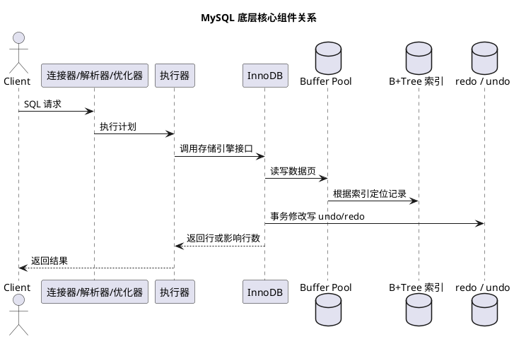

# MySQL 底层数据结构设计与核心知识点

## 问题索引

- Q1：MySQL 底层数据结构如何设计，核心知识点有哪些？
- Q2：表中存在 BLOB/TEXT 等大字段时，是否应该拆到独立表？
- Q3：InnoDB Buffer Pool 底层 LRU 链表如何做冷热分区？

## Q1：MySQL 底层数据结构如何设计，核心知识点有哪些？

### 背景

面试里问 MySQL 底层，通常不是只想听“索引用 B+Tree”，而是想看你能不能把一条 SQL 背后的数据结构、内存、磁盘、日志、事务、锁、优化器串起来。

可以按这条主线理解：

```text
SQL -> 优化器选择执行计划 -> 访问索引 B+Tree -> 读取数据页
    -> Buffer Pool 缓存页 -> 修改产生 undo/redo
    -> 事务提交写 redo/binlog -> 后台刷脏页
```

### 总体架构


### PlantUML 示意图：MySQL Server 层与 InnoDB 协作



MySQL 可以粗略分为 Server 层和存储引擎层。

| 层级 | 核心组件 | 关注点 |
| --- | --- | --- |
| Server 层 | 连接器、解析器、优化器、执行器、binlog | SQL 解析、权限、执行计划、主从复制日志 |
| 存储引擎层 | InnoDB、MyISAM 等 | 数据页、索引、事务、锁、redo/undo、Buffer Pool |

现在生产主流存储引擎是 InnoDB，因为它支持事务、行锁、崩溃恢复和 MVCC。

### 数据是怎么组织的

#### 表空间

InnoDB 数据最终落在表空间里。常见形式：

- 系统表空间。
- 独立表空间，例如 `xxx.ibd`。
- undo 表空间。
- 临时表空间。

如果开启 `innodb_file_per_table`，每张表通常会有自己的 `.ibd` 文件，里面存储该表的数据和索引。

#### Segment、Extent、Page、Row

InnoDB 磁盘结构可以按层级理解：

```text
Tablespace 表空间
  -> Segment 段
    -> Extent 区，默认 1MB
      -> Page 页，默认 16KB
        -> Row 行记录
```

| 结构 | 作用 |
| --- | --- |
| Tablespace | 逻辑上的数据文件集合 |
| Segment | 管理索引或数据的段，例如叶子段、非叶子段 |
| Extent | 连续页的分配单位，减少碎片 |
| Page | InnoDB 读写磁盘的基本单位 |
| Row | 一行真实记录 |

重点是：**InnoDB 不是一行一行读磁盘，而是以页为单位读写**。所以索引设计、顺序写、页分裂、Buffer Pool 命中率都会影响性能。

### Page 页结构

默认页大小是 16KB。一个数据页里大致包含：

```text
File Header
Page Header
Infimum / Supremum
User Records
Free Space
Page Directory
File Trailer
```

关键点：

- `User Records` 保存用户行记录。
- 页内记录按主键顺序组成单向链表。
- `Page Directory` 保存槽位，用于页内二分查找。
- 页之间通过指针形成双向链表，方便范围扫描。

所以在 B+Tree 定位到某个叶子页后，页内不是简单全扫，而是先通过页目录缩小范围，再沿记录链表查找。

### 行记录格式

InnoDB 常见行格式是 `Dynamic` 或 `Compact`。

一行记录除了业务字段，还包含额外信息：

| 内容 | 作用 |
| --- | --- |
| 变长字段长度列表 | 记录 varchar 等变长字段实际长度 |
| NULL 标志位 | 标识字段是否为 NULL |
| 记录头信息 | 记录类型、删除标记、下一条记录偏移量等 |
| 隐藏字段 `DB_TRX_ID` | 最近修改该行的事务 ID |
| 隐藏字段 `DB_ROLL_PTR` | 指向 undo log，用于构造历史版本 |
| 隐藏字段 `DB_ROW_ID` | 没有主键时 InnoDB 生成的隐藏行 ID |

这里的 `DB_TRX_ID` 和 `DB_ROLL_PTR` 是 MVCC 的基础。

### 为什么索引用 B+Tree

MySQL InnoDB 索引底层主要使用 B+Tree。

#### 和二叉树相比

二叉树每个节点只有两个分支，数据量大时树高容易变高。磁盘访问成本主要来自随机 IO，树高越高，IO 次数越多。

#### 和红黑树相比

红黑树适合内存结构，但一个节点存储的 key 少，数据量大时树高仍然偏高，不适合磁盘页模型。

#### 和 B-Tree 相比

B-Tree 非叶子节点也存数据，会降低每个页能存储的索引 key 数量。

B+Tree 的优势：

- 非叶子节点只存 key 和指针，一个页能放更多 key，树更矮。
- 真实数据都在叶子节点，查询路径稳定。
- 叶子节点天然有序并通过链表相连，适合范围查询。
- 和 InnoDB 16KB 页模型契合。

面试一句话：

> B+Tree 的本质是用更高的扇出降低树高，减少磁盘 IO，同时叶子节点链表支持高效范围查询。

### 聚簇索引和二级索引

#### 聚簇索引

InnoDB 表数据本身就是按主键组织的一棵 B+Tree。

叶子节点存储完整行数据：

```text
主键 B+Tree 叶子节点 = 主键值 + 整行数据
```

所以主键选择会影响数据物理组织。

推荐主键：

- 短。
- 稳定不更新。
- 趋势递增。

不推荐随机 UUID 直接做主键，因为容易导致页分裂、索引膨胀和缓存命中率下降。

#### 二级索引

二级索引也是 B+Tree，但叶子节点存储：

```text
二级索引字段值 + 主键值
```

如果查询字段不在二级索引里，就要先通过二级索引找到主键，再回到聚簇索引查整行，这就是回表。

### Buffer Pool

Buffer Pool 是 InnoDB 最核心的内存缓存，缓存的是数据页和索引页。

核心数据结构：

| 结构 | 作用 |
| --- | --- |
| page hash | 根据 tablespace + page no 快速定位页是否在内存 |
| free list | 管理空闲页 |
| flush list | 管理脏页，按 oldest modification 排序 |
| LRU list | 管理冷热页淘汰 |

InnoDB 的 LRU 不是简单 LRU，而是分为 young 区和 old 区，避免全表扫描把热点页全部淘汰。

查询流程：

```text
访问索引页
  -> 先查 Buffer Pool
  -> 命中：直接读内存页
  -> 未命中：从磁盘读 16KB 页放入 Buffer Pool
```

更新流程：

```text
修改 Buffer Pool 中的数据页
  -> 页变成脏页
  -> 先写 redo log 保证崩溃恢复
  -> 后台线程择机把脏页刷回磁盘
```

### redo log、undo log、binlog

#### redo log

redo log 是 InnoDB 的物理日志，记录“某个页做了什么修改”，用于崩溃恢复。

关键点：

- 顺序写，性能高。
- 先写日志，再刷脏页，这就是 WAL。
- 保证事务的持久性。
- 循环写，有 `write pos` 和 `checkpoint`。

#### undo log

undo log 是逻辑日志，记录修改前的数据版本。

作用：

- 事务回滚。
- MVCC 构造历史版本。

例如 `update name = 'B' where id = 1`，undo 里会保留旧值 `name = 'A'`，让旧事务还能读到旧版本。

#### binlog

binlog 是 Server 层日志，主要用于：

- 主从复制。
- 数据恢复。
- Canal 等增量订阅。

常见格式：

- Statement。
- Row。
- Mixed。

生产更常用 Row，因为它记录行变化，更适合主从复制和数据订阅，确定性更强。

### MVCC

MVCC 解决的是读写并发问题：读不阻塞写，写不阻塞普通快照读。

核心组成：

- 隐藏字段 `DB_TRX_ID`。
- 隐藏字段 `DB_ROLL_PTR`。
- undo log 版本链。
- Read View。

可见性判断可以简化理解：

```text
当前行版本 trx_id 是否对当前事务可见？
  可见：直接返回
  不可见：沿 undo log 找上一个历史版本
```

RC 和 RR 的关键差别：

| 隔离级别 | Read View 创建时机 | 表现 |
| --- | --- | --- |
| Read Committed | 每条 SQL 创建一次 | 每次查询可能看到别人已提交的新数据 |
| Repeatable Read | 事务第一次快照读创建 | 同一事务多次查询结果一致 |

### 锁结构

MySQL 的锁要从几个维度理解。

#### 全局锁、表锁、行锁

| 锁 | 粒度 | 场景 |
| --- | --- | --- |
| 全局锁 | 整个实例 | 全库逻辑备份 |
| 表锁 | 表级 | DDL、元数据变更、部分引擎 |
| 行锁 | 行级 | InnoDB 更新、当前读 |

#### 记录锁、间隙锁、临键锁

| 锁 | 作用 |
| --- | --- |
| 记录锁 | 锁住某条索引记录 |
| 间隙锁 | 锁住索引记录之间的间隙，防止插入 |
| 临键锁 | 记录锁 + 间隙锁，解决当前读幻读问题 |

注意：InnoDB 行锁是加在索引上的。如果 SQL 没有命中合适索引，可能扫描大量记录并扩大锁范围。

### 优化器与执行计划

优化器会根据统计信息选择执行计划。

重点看：

```sql
EXPLAIN SELECT * FROM orders WHERE user_id = 1001 AND status = 'PAID';
```

常见字段：

| 字段 | 关注点 |
| --- | --- |
| `type` | 访问类型，const/ref/range/index/ALL |
| `key` | 实际使用的索引 |
| `rows` | 预估扫描行数 |
| `filtered` | 条件过滤比例 |
| `Extra` | 是否 Using index、Using where、Using filesort、Using temporary |

执行计划不是固定的。数据量、统计信息、索引选择性变化后，优化器可能换索引。

### 核心知识点地图

#### 存储结构

- 表空间、段、区、页、行。
- 页是 InnoDB 读写磁盘的基本单位。
- 页内记录链表 + 页目录。
- 聚簇索引决定数据组织方式。

#### 索引设计

- B+Tree。
- 聚簇索引。
- 二级索引。
- 回表。
- 覆盖索引。
- 联合索引。
- 最左前缀。
- 索引下推。
- 页分裂。

#### 事务与日志

- redo log 保证持久性。
- undo log 支持回滚和 MVCC。
- binlog 支持主从复制和数据恢复。
- redo log 和 binlog 通过两阶段提交保证一致。

#### 并发控制

- MVCC。
- Read View。
- 快照读和当前读。
- 记录锁、间隙锁、临键锁。
- 死锁检测。
- MDL 元数据锁。

#### 性能优化

- Buffer Pool 命中率。
- 脏页刷盘。
- 慢 SQL。
- 执行计划。
- 索引选择性。
- 回表次数。
- 排序和临时表。

### 业务场景

#### 订单列表查询慢

典型 SQL：

```sql
SELECT id, order_no, status, pay_time
FROM orders
WHERE user_id = ?
  AND status = ?
ORDER BY pay_time DESC
LIMIT 20;
```

设计思路：

- 建联合索引 `(user_id, status, pay_time)`。
- 如果查询字段都在索引里，可以形成覆盖索引。
- `ORDER BY pay_time DESC LIMIT 20` 可以借助索引顺序减少 filesort。

#### 库存扣减超卖

推荐写法：

```sql
UPDATE sku_stock
SET stock = stock - 1
WHERE sku_id = ?
  AND stock > 0;
```

关键点：

- `sku_id` 必须有索引，最好是主键或唯一索引。
- 用 SQL 原子更新避免先查再改的并发窗口。
- 根据影响行数判断扣减是否成功。

#### 大表分页变慢

低效写法：

```sql
SELECT *
FROM orders
ORDER BY id
LIMIT 1000000, 20;
```

优化思路：

```sql
SELECT *
FROM orders
WHERE id > ?
ORDER BY id
LIMIT 20;
```

原因是深分页会扫描并丢弃大量记录，游标分页可以利用主键 B+Tree 直接定位范围。

### 踩坑点

- 主键太长会让所有二级索引变大，因为二级索引叶子节点存主键值。
- 随机主键会导致页分裂和缓存命中率下降。
- 回表次数过多会让看似命中索引的 SQL 仍然很慢。
- 联合索引顺序不匹配，会导致索引利用不充分。
- 对索引列使用函数、隐式类型转换、`like '%xxx'` 容易导致索引失效。
- 大事务会产生大量 undo log，影响 purge 和 MVCC 查询。
- 没有索引的更新会扩大锁范围，甚至引发严重锁等待。
- DDL 可能被长事务持有的 MDL 阻塞。

### 面试话术

> MySQL InnoDB 的底层可以从页、索引、缓存、日志、事务、锁这几条线讲。数据最终存储在表空间里，按段、区、页组织，默认页大小 16KB。InnoDB 的索引是 B+Tree，聚簇索引的叶子节点保存整行数据，二级索引的叶子节点保存索引列和主键值，所以二级索引查询可能需要回表。Buffer Pool 缓存数据页和索引页，更新时先改内存页并写 redo log，脏页之后再刷盘。undo log 用于回滚和 MVCC，Read View 决定事务能看到哪个版本。并发控制上，普通快照读走 MVCC，当前读和更新会加记录锁、间隙锁或临键锁。优化 SQL 时要结合 B+Tree、索引选择性、回表、排序、临时表、Buffer Pool 和锁范围一起分析。

## 高频追问

- Q：为什么 InnoDB 用 B+Tree，而不是红黑树？
  A：红黑树适合内存结构，树高相对更高；B+Tree/B+Tree 更适合磁盘页模型。B+Tree 非叶子节点只存 key 和指针，扇出大、树高低，可以减少磁盘 IO，并且叶子节点链表适合范围查询。

- Q：为什么主键建议趋势递增？
  A：聚簇索引按主键组织数据。趋势递增主键更接近顺序插入，页分裂少，Buffer Pool 命中更稳定；随机主键容易导致随机插入、页分裂和索引碎片。

- Q：二级索引为什么会回表？
  A：二级索引叶子节点没有整行数据，只保存二级索引列和主键值。如果查询字段不在二级索引中，需要拿主键回到聚簇索引查整行。

- Q：redo log 和 binlog 有什么区别？
  A：redo log 是 InnoDB 层物理日志，用于崩溃恢复；binlog 是 Server 层逻辑日志，用于主从复制和数据恢复。事务提交时通过两阶段提交保证两者一致。

- Q：MVCC 为什么能读写不互相阻塞？
  A：读操作通过 Read View 判断行版本可见性，不可见就沿 undo log 找历史版本；写操作修改当前版本并生成新的 undo 版本链，因此普通快照读不需要阻塞写。

## 复习清单

- [ ] 能画出 `SQL -> B+Tree -> Page -> Buffer Pool -> redo/undo/binlog` 主链路。
- [ ] 能解释表空间、段、区、页、行的关系。
- [ ] 能说明 B+Tree 为什么适合 MySQL 索引。
- [ ] 能区分聚簇索引、二级索引、回表、覆盖索引。
- [ ] 能说清 Buffer Pool、redo log、undo log、binlog 各自职责。
- [ ] 能说明 MVCC 的隐藏字段、undo 版本链和 Read View。
- [ ] 能结合索引解释记录锁、间隙锁、临键锁的范围。
- [ ] 能用底层结构分析慢 SQL、锁等待和大表分页问题。

## Q2：表中存在 BLOB/TEXT 等大字段时，是否应该拆到独立表？

### 结论

**不是只要字段大就必须拆表。** 是否拆分主要看：

- 大字段的平均和最大长度。
- 主链路是否经常读取它。
- 主表是否存在高频列表、范围扫描和缓存热点。
- 大字段是否独立更新、独立归档或有不同权限。
- 拆表后增加的查询、事务和一致性成本是否可接受。

通常可以这样判断：

| 场景 | 倾向方案 |
| --- | --- |
| 字段不大，几乎每次都要读取 | 保留在主表 |
| 字段很大，详情页偶尔读取，列表页不需要 | 拆成 1:1 扩展表 |
| 图片、视频、压缩包等大文件 | 对象存储，数据库只存元数据和对象 Key |
| 内容必须与主记录强事务提交 | 同库扩展表，事务内同时写入 |
| 大字段独立更新、归档、加密或权限隔离 | 独立表或独立存储 |

不要用固定的“超过 1KB/10KB 就必须拆”作为通用规则，应使用真实数据分布和查询链路验证。

### InnoDB 并不一定把整个 BLOB 放在主记录中

InnoDB 是否把长变长字段完整放在聚簇索引页内，与行格式、字段实际长度和页内空间有关。

常见区别：

| 行格式 | 长变长字段的典型处理 |
| --- | --- |
| `COMPACT` | 可能在聚簇索引记录中保留最长 768 字节前缀，其余内容放到溢出页 |
| `DYNAMIC` | 倾向把长值完整放到页外，聚簇索引记录保存约 20 字节的页外指针 |

MySQL 8.x 常见默认行格式是 `DYNAMIC`。但这不表示每个 `BLOB/TEXT` 都必然页外存储：较小的实际值可能直接保留在页内，InnoDB 会根据整行长度和页面空间决定。

可以理解为：

~~~text
聚簇索引记录
  -> 普通字段
  -> BLOB/TEXT 的页内值，或者页外指针
      -> 外部溢出页保存大字段内容
~~~

因此，大字段留在同一张表时，如果 SQL 没有查询该列，InnoDB 通常不需要读取对应的页外内容。拆表的收益不能简单描述为“否则每次查询都会把整个 BLOB 读出来”。

### 为什么大字段仍然可能拖累主表

即使使用 `DYNAMIC` 和页外存储，大字段仍可能带来以下成本：

1. **聚簇索引记录变宽**：页内值、长度信息和页外指针都会占用主记录空间，每页能容纳的行数下降。
2. **Buffer Pool 利用率下降**：高频主记录与大字段元数据共享聚簇索引页，范围扫描可能需要读取更多页。
3. **误用 `SELECT *`**：一旦查询包含大字段，必须继续读取溢出页，并产生网络传输、反序列化和 JVM 内存成本。
4. **更新日志放大**：更新大字段可能产生更多 undo、redo 和 binlog，增加主从复制、备份和恢复压力。
5. **备份与迁移变重**：数据库全量备份、逻辑导出、CDC 和数据校验都需要处理大内容。
6. **接口尾延迟波动**：不同记录的大字段长度差异很大，容易让详情接口耗时和内存使用不稳定。

需要区分：

- 二级索引不会因为主表有一个未索引的 `BLOB` 就自动保存完整 BLOB。
- 聚簇索引保存完整行或页外指针，所以主表扫描和主键回表仍会受到行宽影响。
- 把大字段拆表只能隔离这些成本，不能消除读取大字段本身所需的 IO、网络和日志成本。

### 什么时候建议拆成 1:1 扩展表

以下条件同时出现得越多，越适合拆表：

- 主表是高频核心表，例如订单、商品、消息、文档元数据。
- 90% 以上请求只需要主表的小字段。
- 大字段只在详情、下载、审计或失败排查时读取。
- 列表、分页、范围扫描对主表页密度和 Buffer Pool 很敏感。
- 大字段大小波动明显，存在数百 KB 甚至 MB 的记录。
- 大字段更新频率和主表状态更新频率不同。
- 大字段需要独立权限、加密、保留周期、归档或冷热分层。

典型设计：

~~~sql
CREATE TABLE document (
    id BIGINT PRIMARY KEY,
    title VARCHAR(256) NOT NULL,
    content_size BIGINT NOT NULL DEFAULT 0,
    content_hash CHAR(64) NULL,
    content_version INT NOT NULL DEFAULT 1,
    created_at DATETIME NOT NULL,
    updated_at DATETIME NOT NULL,
    KEY idx_updated_at (updated_at)
);

CREATE TABLE document_content (
    -- 与主表共享主键，形成 1:1 关系，也便于按主键精确查询。
    document_id BIGINT PRIMARY KEY,
    content LONGBLOB NOT NULL,
    updated_at DATETIME NOT NULL
);
~~~

主表保留 `content_size`、`content_hash`、`content_version` 等轻量元数据，列表和同步任务不必读取内容表；只有详情接口按需查询：

~~~sql
-- 列表查询只访问窄主表，不要 SELECT *。
SELECT id, title, content_size, content_version, updated_at
FROM document
WHERE updated_at >= ?
ORDER BY updated_at DESC
LIMIT 50;

-- 用户确实打开详情时，再按主键读取大字段。
SELECT content
FROM document_content
WHERE document_id = ?;
~~~

### 拆表后的结构关系

~~~plantuml
@startuml
skinparam monochrome true
skinparam shadowing false

actor Client
component "列表/搜索接口" as ListApi
component "详情/下载接口" as DetailApi
database "document\n高频元数据" as Main
database "document_content\n低频大字段" as Content
cloud "对象存储\n超大文件" as ObjectStorage

Client -> ListApi
ListApi -> Main : 只读小字段
Client -> DetailApi
DetailApi -> Main : 校验元数据/权限
DetailApi -> Content : BLOB 仍存数据库时按需读取
DetailApi -> ObjectStorage : 大文件按对象 Key 获取
@enduml
~~~

拆表后的主要收益是让主表保持更窄、更稳定，使高频列表、缓存和范围扫描不被低频大字段干扰。

### 什么时候不建议拆表

以下情况拆表收益可能小于复杂度：

- 大字段实际平均值很小，只是字段类型声明得大。
- 几乎所有业务查询都必须同时读取大字段。
- 表规模和访问量很小，没有主表扫描或 Buffer Pool 压力。
- 拆分后每个请求都要额外查询或 Join，反而增加连接和网络往返。
- 当前系统更需要简单的强事务语义，而不是读写隔离。
- 没有监控证据表明行宽、大字段读取或日志量是性能瓶颈。

在决定拆表前，可以先做成本更低的优化：

1. 禁止核心链路使用 `SELECT *`。
2. 使用 DTO/投影只读取必要列。
3. ORM 将大字段改为显式按需查询，而不是依赖不稳定的自动懒加载。
4. 对列表查询建立合理覆盖索引。
5. 检查 API 是否无意返回了大字段。

如果这些调整已经解决问题，未必需要立即拆表。

### BLOB 应该放数据库还是对象存储

对于图片、视频、音频、压缩包和大附件，通常优先使用对象存储：

~~~text
数据库
  -> object_key
  -> 文件大小、类型、hash、版本、状态

对象存储
  -> 真实二进制内容
~~~

对象存储的优势：

- 更适合大对象的上传、下载、分片和 CDN 分发。
- 不占用数据库 Buffer Pool、redo、binlog 和主从复制带宽。
- 可以独立做生命周期、冷热分层和容量扩展。

数据库 BLOB 更适合：

- 内容相对较小。
- 必须和业务行在同一数据库事务中提交。
- 需要数据库统一备份、权限和审计。
- 访问规模有限，且已经验证数据库成本可接受。

对象存储方案要额外解决“数据库提交成功但文件上传失败”或相反方向的不一致。常见做法是先上传临时对象，再在数据库事务中登记对象 Key 和状态，提交后转正式状态，并通过补偿任务清理孤儿文件。

### 如何用数据判断是否需要拆

先统计长度分布和访问模式，不要只看字段类型：

~~~sql
-- 大表执行全量统计可能很重，应在从库、低峰或抽样数据上执行。
SELECT
    COUNT(*) AS row_count,
    AVG(OCTET_LENGTH(content)) AS avg_bytes,
    MAX(OCTET_LENGTH(content)) AS max_bytes,
    SUM(content IS NULL) AS null_count
FROM document;
~~~

还要观察：

- 大字段列在接口中的实际读取比例。
- 主表列表查询的扫描页数、耗时和返回网络大小。
- Buffer Pool 命中、数据页淘汰和存储 IO。
- 更新大字段产生的 binlog、复制延迟和备份体积。
- JVM 反序列化后的对象大小、GC 和接口 P99。

判断标准应该是：拆分后是否能显著降低高频主链路的页读取、网络、内存和日志成本，而不是字段名是不是 `BLOB`。

### 已有大表如何平滑拆分

不要直接停机搬迁并删除原列。可以按以下步骤进行：

1. 创建扩展表或对象存储元数据字段。
2. 应用先支持新旧两套读取方式。
3. 开启双写，或通过 binlog/CDC 同步新增变更。
4. 按主键范围小批回填历史大字段，控制事务大小和 IO。
5. 通过行数、长度、hash 和业务抽样校验一致性。
6. 灰度切换读流量到新表，并保留旧列回退。
7. 观察完整周期后停止旧列写入。
8. 最后通过在线 DDL 或重建表回收旧列空间。

删除大字段列后，表空间不一定立即按预期缩小；是否需要重建表、是否支持在线 DDL，要结合 MySQL 版本、表大小、磁盘余量和变更工具评估。

### 常见误区

1. 看到 `BLOB/TEXT` 类型就立即拆表，不看实际平均长度和访问频率。
2. 认为大字段留在主表时，每条不查询该列的 SQL 都会读取完整页外内容。
3. 认为拆表能消除大字段自身的 IO 和网络成本。
4. 拆表后列表接口仍然 `JOIN` 内容表或 `SELECT content`，失去隔离意义。
5. 将图片视频放对象存储，却没有处理数据库与对象状态的一致性。
6. 迁移时一次事务回填大量 BLOB，导致 redo、binlog、复制延迟和锁压力暴涨。
7. 只比较数据库查询耗时，不看网络传输、JVM 内存和接口 P99。

### 面试话术

> BLOB/TEXT 等大字段不应该仅根据类型决定是否拆表。InnoDB 的 DYNAMIC 行格式会把较长的变长字段放到页外，聚簇索引记录主要保存页外指针，所以不查询该列时通常不会读取完整 BLOB。但大字段仍会影响聚簇索引页密度、Buffer Pool、日志、复制、备份和接口内存。如果大字段低频读取，而主表承担高频列表和范围扫描，适合拆成共享主键的 1:1 扩展表；图片、视频等超大文件通常放对象存储，数据库保存对象 Key、大小、hash 和状态。如果几乎每次都要读取、平均长度很小或表规模不大，拆表可能只会增加查询和一致性复杂度。最终要根据长度分布、读取比例、页扫描、IO、binlog 和接口 P99 做决定。

### 高频追问

- Q：BLOB 字段一定要拆表吗？
  A：不一定。低频读取、体积大且主表高频扫描时适合拆；几乎每次都要读取、实际值较小或表规模很小时可以保留。

- Q：不查询 BLOB 列，MySQL 会不会把完整内容读进 Buffer Pool？
  A：使用 DYNAMIC 行格式且内容页外存储时，通常只需要读取主记录所在页，不会为了未选择的列继续读取完整溢出页；较小值可能仍在页内。

- Q：拆成 1:1 表后一定更快吗？
  A：不一定。它能让高频主表更窄，但详情查询会增加一次访问或 Join；如果所有请求都需要大字段，收益可能很小。

- Q：为什么图片视频更适合对象存储？
  A：对象存储更适合大对象传输、分片、CDN、生命周期和容量扩展，也能避免占用数据库日志、复制和 Buffer Pool 资源。

- Q：拆表后如何保证一致性？
  A：强一致场景在同一数据库事务中写主表和扩展表；跨存储场景使用状态机、可靠消息、补偿和孤儿文件清理。

### 复习清单

- [ ] 能说明 `COMPACT` 与 `DYNAMIC` 对长变长字段的典型存储差异
- [ ] 能解释为什么不查询页外 BLOB 时通常不会读取完整溢出页
- [ ] 能从字段长度、读取频率、主表扫描和日志成本判断是否拆表
- [ ] 能设计共享主键的 1:1 大字段扩展表
- [ ] 能说明数据库 BLOB 与对象存储各自适用场景
- [ ] 能设计大字段拆分的双写、回填、校验、灰度和回滚流程
- [ ] 能列出 `SELECT *`、ORM 懒加载和大事务回填的风险

### 参考资料

- [MySQL 8.4 InnoDB Row Formats](https://docs.oracle.com/cd/E17952_01/mysql-8.4-en/innodb-row-format.html)
- [MySQL 8.4 DYNAMIC Row Format](https://docs.oracle.com/cd/E17952_01/mysql-8.4-en/innodb-row-format-dynamic.html)

## Q3：InnoDB Buffer Pool 底层 LRU 链表如何做冷热分区？

### 背景

Buffer Pool 的大小决定了 InnoDB 能把多少数据页留在内存里，但“哪些页留下、哪些页淘汰”由 LRU 管理。面试里说“Buffer Pool 使用 LRU”还不够，还要说明它不是严格的单链表 LRU，而是**一个 LRU 链表加一个 midpoint 边界，划分为 young/new 和 old 两个子区**，用来抵抗全表扫描、索引扫描和 read-ahead 对热点页的污染。

这里的缓存单位是 InnoDB page，默认通常为 16KB，不是单行记录。一个热点页可能包含很多行，也可能只是某个索引 B+Tree 节点。

### 核心结构：不要混淆四类链表或索引

从底层职责看，Buffer Pool 至少要区分以下结构：

| 结构 | 主要职责 | 是否决定 LRU 淘汰顺序 |
| --- | --- | --- |
| Page Hash | 用 tablespace、page number 等页标识快速判断页是否已在内存 | 否，负责定位 |
| Free List | 管理尚未装载数据页的空闲内存页框 | 否，优先提供可用页框 |
| LRU List | 管理已装载页的访问新旧程度，并提供淘汰候选 | 是 |
| Flush List | 管理脏页及其最老修改位置，用于后台刷脏和 checkpoint | 否，不等于 LRU 顺序 |

如果配置了多个 Buffer Pool instance，通常由不同实例分别维护自己的 page hash、free list、LRU list 和 flush list，以降低并发访问同一组内存管理结构的竞争。具体实例参数需要结合 MySQL 版本和配置确认，但不改变冷热分区的核心逻辑。

#### LRU 节点保存什么

可以把每个 Buffer Pool 页理解为一个带控制信息的页描述符，概念上包含：

- 页身份：表空间 ID、页号、页大小等，用于 page hash 定位。
- 页状态：是否有效、是否脏、是否正在读写、是否被固定使用。
- LRU 关系：前驱、后继、是否处于 old 子区等信息。
- 访问信息：首次访问时间或访问状态，用于判断是否应该晋升为 young。
- 修改信息：最新修改 LSN 等，用于刷脏和崩溃恢复相关处理。

源码字段和结构名会随版本变化，面试时抓住“页描述符 + page hash + 多条管理链”即可，不要把它简化成 Java 的一个 LinkedHashMap。

### LRU 链表的冷热分区

#### 1. 一个链表，两个逻辑子区

LRU 从头到尾可以抽象为：

~~~text
LRU head
  [ young/new：最近访问、希望长期保留的热点页 ]
                    |
                 midpoint
                    |
  [ old：新读入或较久未访问的页，优先作为淘汰候选 ]
LRU tail             -> 从 old 尾部选择淘汰页
~~~

这不是两个完全独立的缓存池，而是一个链表中的两个逻辑子链。InnoDB 通过 midpoint 或 old 边界指针标识分界，页还会带有是否处于 old 区的状态。

默认情况下，old 子区约占 Buffer Pool 的 3/8，也就是约 37%；young 子区约占 5/8。配置变量 innodb_old_blocks_pct 控制 old 子区比例，默认值为 37，官方文档给出的范围是 5 到 95。

#### 2. 新页先进入 old 区

发生 Buffer Pool miss 时，流程不是“读进来就放到 LRU 头部”，而是：

1. 通过 page hash 确认页不在 Buffer Pool。
2. 优先从 free list 取空闲页框；没有空闲页框时，从 LRU 尾部寻找可淘汰页。
3. 从磁盘读取数据页或接收 read-ahead 页。
4. 将新页插入 midpoint，也就是 old 子区的头部。
5. 后续访问根据访问类型、首次访问时间和 old_blocks_time 决定是否移动到 young 头部。

新页先进入 old 区的意义是：**新加载不等于热点**。如果一条报表 SQL 或一次 read-ahead 只访问某页一次，这个页没有资格长期占据 young 区。

#### 3. old 页如何晋升为 young 页

old 页再次被有效访问后，可以晋升为 young，移动到 young 子区头部。晋升代表该页已经表现出一定的复用价值。

innodb_old_blocks_time 用来限制 old 页过快晋升。它表示页首次访问后的一个时间窗口，窗口内的再次访问不会立即把页移动到 LRU 头部；默认值为 1000 毫秒。这样可以减少扫描过程中“短时间连续访问但之后不再使用”的页进入热点区。

需要注意两点：

- young 和 old 是基于 page 的访问历史，不是基于行的热度，也不是业务意义上的永久冷热标签。
- old 页不是一定会被淘汰；如果它在到达 LRU 尾部前再次满足晋升条件，仍然可以进入 young 区。

#### 4. 页面如何老化和淘汰

当其他页不断晋升或新页不断从 midpoint 插入时，长期没有访问的页会向 LRU 尾部老化。最终从 old 尾部选择淘汰候选：

1. 如果页仍被事务或线程固定使用，不能直接淘汰。
2. 如果页正在进行 IO 或状态不允许复用，需要跳过或等待。
3. 如果页是脏页，要先由后台线程刷盘，或形成待刷的 LRU 写入。
4. 页安全释放后，页框回到可复用状态，新数据页才可以装入。

因此，“LRU 尾部淘汰”是缓存页复用的主线，但脏页刷盘由 flush list 和刷脏机制协同完成，不能说 LRU 本身负责持久化。

### PlantUML 示意图：LRU 命中、晋升与淘汰

~~~plantuml
@startuml
title InnoDB Buffer Pool LRU 冷热分区与淘汰
start
:根据 page hash 查找数据页;
if (Buffer Pool 命中?) then (是)
  if (页在 old 区且达到晋升条件?) then (是)
    :移动到 young 区头部;
  else (否)
    :保留原位置并更新访问状态;
  endif
else (否)
  :从 free list 取页框;
  if (没有空闲页框?) then (是)
    :从 old 区尾部选择淘汰候选;
    if (候选页是脏页?) then (是)
      :先刷盘，再复用页框;
    else (否)
      :直接复用页框;
    endif
  endif
  :从磁盘读取并插入 midpoint;
endif
stop
@enduml
~~~

### 为什么要做冷热分区

#### 1. 解决严格 LRU 的扫描污染

如果使用严格 LRU，新读取的页直接进入头部，那么一次大表扫描会把大量只访问一次的页推到头部，原本频繁访问的订单、用户、配置页被不断挤到尾部，导致：

- OLTP 热点页被淘汰。
- 后续请求重新从磁盘读取热点页。
- Buffer Pool 命中率下降。
- 磁盘 IO、延迟和 CPU 同时上升。

midpoint 让新页先在 old 区“观察”。如果它只是一次性扫描数据，通常会在 old 区逐渐老化并被淘汰；如果它被持续复用，才晋升到 young 区。

#### 2. read-ahead 也可能污染缓存

read-ahead 会提前把预测可能访问的页读入 Buffer Pool，但预测不一定准确。没有被真正访问的预读页可能在 old 区尾部被回收，相关监控指标可以观察“evicted without access”。

所以 read-ahead 不是越多越好。顺序范围查询可能受益，随机访问或工作集较小的 OLTP 场景则要警惕预读和扫描带来的内存、IO 压力。

### 关键参数怎么理解

| 参数 | 含义 | 调大后的典型影响 | 适用判断 |
| --- | --- | --- | --- |
| innodb_old_blocks_pct | old 子区占 Buffer Pool 的比例，默认 37 | 新页和扫描页有更大的观察区，但 young 区相对变小 | 大表扫描污染明显时可评估调小；小表可完整放入内存时不必激进调整 |
| innodb_old_blocks_time | old 页首次访问后的晋升延迟窗口，默认 1000ms | 更多短时间访问不会晋升，扫描页更容易留在 old 区 | OLTP 与周期性报表扫描混合时可评估调大 |
| innodb_buffer_pool_size | Buffer Pool 总页框容量 | 可容纳更大的工作集，减少磁盘读取 | 先给操作系统、连接、排序、临时表和其他组件留足内存 |

参数不是越大越好：

- old_blocks_pct 太小，真正有复用价值的新页可能还没来得及再次访问就被淘汰。
- old_blocks_pct 太大，young 区空间变小，热点页保护能力可能下降。
- old_blocks_time 太小，扫描页可能更容易晋升；太大则会延迟真正热点页的晋升。
- Buffer Pool 太大可能挤压操作系统和其他内存，严重时发生 swap，反而使数据库变慢。

调参应先记录基线、在接近生产的负载下压测，再结合命中率、磁盘 IO、P99 和 CPU 判断，不能只看某一个变量。

#### 常见调优思路

大表扫描无法避免、且表明显大于 Buffer Pool 时，可以按以下顺序评估：

1. 优先优化 SQL、索引、扫描范围和报表执行位置，必要时将分析查询转移到只读副本或数仓。
2. 观察 old 子区大小、young-making、not-young、evicted-without-access 和物理读取。
3. 小幅降低 innodb_old_blocks_pct，让一次性扫描页只占较小的 old 区。
4. 结合压测评估提高 innodb_old_blocks_time，延缓扫描页的晋升。
5. 检查 read-ahead 是否适合当前访问模式。
6. 只有工作集确实放不下时，才考虑增加 Buffer Pool 或水平拆分负载。

### 监控与排查

可以用以下命令观察 LRU 和 Buffer Pool 状态：

~~~sql
-- 观察 LRU、young/old、刷脏和预读等整体指标。
SHOW ENGINE INNODB STATUS\G

-- 查看冷热分区相关参数；修改前要结合当前 MySQL 版本确认动态属性和权限。
SHOW VARIABLES LIKE 'innodb_old_blocks%';

-- 查询 Buffer Pool 总页数、old 页数、空闲页、脏页等快照指标。
SELECT
    POOL_SIZE,
    DATABASE_PAGES,
    OLD_DATABASE_PAGES,
    FREE_BUFFERS,
    MODIFIED_DATABASE_PAGES
FROM information_schema.INNODB_BUFFER_POOL_STATS;

-- 这些状态量是累计值，比较两个时间点的增量比单看绝对值更有意义。
SHOW GLOBAL STATUS LIKE 'Innodb_buffer_pool%';
~~~

重点关注：

- Buffer pool hit rate：请求命中内存页的情况，但要结合时间窗口和工作集大小分析。
- Pages made young / youngs/s：old 页晋升为 young 的数量或速率。
- Pages made not young / non-youngs/s：访问没有触发晋升的数量或速率。
- Old database pages：当前 LRU old 子区中的页数量。
- Pages evicted without access：预读页未被访问就被淘汰的情况。
- Pending writes: LRU：LRU 尾部脏页需要刷盘的压力。
- Innodb_buffer_pool_reads：需要从磁盘读取的页数量；应和 read requests、采样窗口及业务流量一起看。

一个常见判断是：命中率下降不一定只由 LRU 分区导致，也可能来自工作集突然增长、索引失效、全表扫描、Buffer Pool 过小、预读不匹配或刷脏压力。

### 业务场景：订单 OLTP 与周期性报表共用数据库

假设订单列表、库存扣减和用户查询持续访问少量热点索引页，同时每天有报表任务扫描数亿行：

1. OLTP 请求反复访问的页逐渐进入 young 区并保持在 LRU 前部。
2. 报表扫描加载的新页先进入 old 区；如果访问模式是一次性顺序扫描，它们应尽量不要挤占 young 区。
3. 如果扫描仍然造成命中率和 P99 明显恶化，先检查执行计划、报表索引、扫描范围、只读副本和执行时间。
4. 再通过 old_blocks_pct、old_blocks_time 和 read-ahead 参数做小幅实验。
5. 用报表前后同一时间窗口的物理读、young-making、淘汰未访问页、磁盘延迟和 OLTP P99 验证效果。

结论不是“把 old 区调大或调小就能解决所有问题”，而是让一次性访问和高复用访问在缓存中拥有不同的晋升门槛。

### 常见误区

1. 认为 young/old 是两个完全独立的缓存池。准确说法是一个 LRU 链表中的两个逻辑子区。
2. 认为 old 页一定是冷页。新读入页也先进入 old，old 更像“待观察区”。
3. 认为 LRU、free list、flush list 是同一条链。free list 管空闲页框，flush list 管脏页刷盘，LRU 管访问新旧和淘汰候选。
4. 认为 Buffer Pool 以行为单位缓存。InnoDB 主要以页为单位加载和淘汰。
5. 认为增加 Buffer Pool 就一定解决命中率问题。SQL 扫描、索引失效、工作集增长和预读问题仍然存在。
6. 只看 Buffer pool hit rate，不看物理读增量、磁盘延迟、淘汰未访问页、young-making 和业务 P99。
7. 直接在线修改 old_blocks_pct/time 后不做回归。参数效果高度依赖硬件、数据量和访问模式。
8. 认为脏页在 LRU 尾部可以直接丢弃。脏页必须先刷盘或进入可安全复用的流程，持久化由刷脏和 redo 机制共同保证。

### 面试话术

> InnoDB Buffer Pool 不是简单的严格 LRU。它维护一个页链表，并通过 midpoint 划分 young/new 和 old 两个逻辑子区。新读入的数据页先插入 old 区头部，只有后续访问满足条件才晋升到 young 区头部；长期不访问的页从 old 区尾部老化并成为淘汰候选。这样可以避免一次大表扫描或 read-ahead 把大量只访问一次的页直接推到热点区。innodb_old_blocks_pct 控制 old 区比例，默认约 37%；innodb_old_blocks_time 控制 old 页的晋升延迟，默认约 1000 毫秒。需要特别区分 page hash、free list、LRU list 和 flush list：page hash 负责定位，free list 管空闲页框，LRU 决定缓存淘汰，flush list 管脏页刷盘。调优时要结合 young/non-young、淘汰未访问页、物理读、磁盘 IO 和业务 P99，不能只改一个参数。

### 高频追问

- Q：为什么新页不直接放到 LRU 头部？
  A：新页只是被加载，不代表后续会复用。先放到 old 区可以给它一个观察期，避免全表扫描和预读页立即挤走真正热点页。

- Q：old 区是不是冷数据专属区域？
  A：不是。它包含新加载的待观察页和较久未访问的页。页被再次访问并满足晋升条件后，会移动到 young 区。

- Q：innodb_old_blocks_pct 和 innodb_old_blocks_time 有什么区别？
  A：前者控制 old 子区的空间比例，后者控制 old 页晋升的时间门槛。一个是空间隔离，一个是时间过滤，通常需要结合工作负载一起调。

- Q：LRU 尾部的脏页会直接被淘汰吗？
  A：不会直接丢弃。脏页需要先刷盘，或由刷脏线程形成待处理的 LRU 写入；只有页内容安全落盘、状态允许复用后，页框才能被重新使用。

- Q：怎么判断是 LRU 扫描污染，而不是 Buffer Pool 太小？
  A：看扫描期间物理读、淘汰未访问页、young/non-young、old 页数量、磁盘 IO 和 OLTP P99 的变化。若大查询或预读带来大量未复用页，且热点请求命中明显下降，才更像扫描污染；最终仍要用隔离扫描、调整参数和压测验证。

### 复习清单

- [ ] 能画出一个 LRU 链表及 midpoint、young、old、head、tail 的位置关系
- [ ] 能解释新页为什么先进入 old 区，以及什么条件下晋升到 young 区
- [ ] 能区分 page hash、free list、LRU list 和 flush list
- [ ] 能说清 innodb_old_blocks_pct 与 innodb_old_blocks_time 的区别
- [ ] 能解释全表扫描、索引扫描和 read-ahead 如何造成缓存污染
- [ ] 能用 SHOW ENGINE INNODB STATUS 和 Buffer Pool 统计判断 LRU 问题
- [ ] 能给出 OLTP 与报表混合负载下的调优顺序和验证指标

### 参考资料

- [MySQL 8.4 Buffer Pool](https://docs.oracle.com/cd/E17952_01/mysql-8.4-en/innodb-buffer-pool.html)
- [MySQL 8.4 Making the Buffer Pool Scan Resistant](https://docs.oracle.com/cd/E17952_01/mysql-8.4-en/innodb-performance-midpoint_insertion.html)
- [MySQL Server 8.4 buf0lru.cc](https://github.com/mysql/mysql-server/blob/8.4/storage/innobase/buf/buf0lru.cc)

