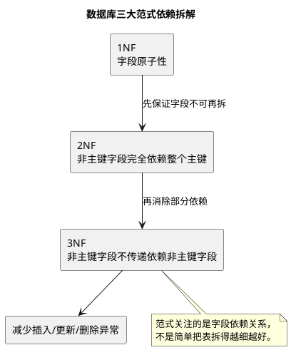

# 数据库设计三大范式

## 问题索引

- Q1：数据库设计三大范式是什么？

## Q1：数据库设计三大范式是什么？

### 背景

数据库范式是关系型数据库表结构设计的一套规范，核心目标是减少数据冗余，避免插入异常、更新异常和删除异常。

面试里问“三大范式”，不要只背“原子性、完全依赖、消除传递依赖”，更要能结合一张业务表说明：为什么拆表、拆到什么程度、什么时候又会为了性能做适度冗余。

### 核心原理


### PlantUML 示意图：三大范式的依赖关系



三大范式可以按层级理解：

```text
第一范式：字段不可再拆，保证列的原子性
第二范式：非主键字段必须完全依赖整个主键，避免只依赖联合主键的一部分
第三范式：非主键字段不能依赖其他非主键字段，避免传递依赖
```

它们解决的问题分别是：

| 范式 | 关注点 | 主要避免的问题 |
| --- | --- | --- |
| 第一范式 | 字段原子性 | 一个字段塞多个值，查询和维护困难 |
| 第二范式 | 完全依赖主键 | 联合主键场景下局部依赖导致冗余 |
| 第三范式 | 消除传递依赖 | 非主键字段之间互相依赖导致更新异常 |

### 第一范式：字段不可再拆

第一范式要求表中的每个字段都是不可再分的原子值。

反例：

| user_id | username | contact |
| --- | --- | --- |
| 1 | 张三 | 手机号:13800000000,邮箱:a@test.com |

问题是 `contact` 字段里同时存了手机号和邮箱，后续按手机号查询、校验邮箱、单独更新手机号都会很别扭。

更合理的设计：

| user_id | username | phone | email |
| --- | --- | --- | --- |
| 1 | 张三 | 13800000000 | a@test.com |

如果一个用户有多个手机号，则不应该继续加 `phone1`、`phone2`，而应该拆成子表：

```sql
CREATE TABLE user_phone (
    id BIGINT PRIMARY KEY,
    user_id BIGINT NOT NULL,
    phone VARCHAR(32) NOT NULL,
    phone_type VARCHAR(16) NOT NULL
);
```

这里 `phone` 每行只表示一个手机号，多个手机号通过多行表达。

### 第二范式：非主键字段完全依赖主键

第二范式建立在第一范式基础上，要求非主键字段必须完全依赖整个主键，而不是只依赖联合主键的一部分。

第二范式主要出现在联合主键场景。

反例：订单明细表以 `(order_id, product_id)` 作为联合主键：

| order_id | product_id | product_name | product_price | quantity |
| --- | --- | --- | --- | --- |
| 1001 | 10 | iPhone | 5999 | 2 |
| 1001 | 11 | MacBook | 12999 | 1 |

这里：

- `quantity` 依赖 `(order_id, product_id)`，因为同一个订单里的某个商品才有购买数量。
- `product_name`、`product_price` 只依赖 `product_id`，不依赖 `order_id`。

这就是局部依赖。它会导致商品名称和商品基础价格在多个订单明细中重复存储。

更规范的拆法：

```text
product(product_id, product_name, product_price)
order_item(order_id, product_id, quantity)
```

但订单系统里有一个重要例外：订单明细通常会冗余商品下单时的名称和成交价，因为商品后续改名、改价，不应该影响历史订单。

所以更贴近业务的设计可能是：

```text
product(product_id, current_name, current_price)
order_item(order_id, product_id, snapshot_name, deal_price, quantity)
```

这不是“不懂范式”，而是为了保留业务快照。

### 第三范式：非主键字段不能传递依赖

第三范式建立在第二范式基础上，要求非主键字段不能依赖其他非主键字段。

反例：

| student_id | student_name | class_id | class_name | head_teacher |
| --- | --- | --- | --- | --- |
| 1 | 小明 | C01 | 一班 | 王老师 |

主键是 `student_id`，其中：

```text
student_id -> class_id
class_id -> class_name, head_teacher
```

于是 `class_name`、`head_teacher` 对 `student_id` 形成了传递依赖。问题是一个班级有很多学生，班级名称和班主任会在多行学生记录中重复出现。

更合理的设计：

```text
student(student_id, student_name, class_id)
class(class_id, class_name, head_teacher)
```

这样修改班主任时，只需要改 `class` 表一行，不需要更新所有学生记录。

### 三类异常

范式主要是为了避免三类异常。

#### 插入异常

如果学生表里同时保存班级信息，那么没有学生时就无法单独创建班级信息。

```text
想新增一个班级，但还没有学生
  -> 如果班级信息只存在 student 表里，就没有合适位置保存
```

#### 更新异常

如果班主任名称冗余在每个学生行里，班主任更换时必须更新多行；只要漏更新一行，就会出现数据不一致。

#### 删除异常

如果某个班级最后一个学生被删除，而班级信息只存在学生表里，那么班级信息也被误删了。

### 业务场景

#### CRM 客户与联系人

客户表和联系人表通常要拆开：

```text
customer(customer_id, customer_name, customer_level)
contact(contact_id, customer_id, name, phone, email)
```

原因是一个客户可能有多个联系人。如果把联系人电话、邮箱直接塞到客户表，既违反第一范式，也不利于维护多个联系人。

#### 订单与商品

订单明细一般会保留商品快照：

```text
order_item(order_id, product_id, product_name_snapshot, deal_price, quantity)
```

从严格范式看，商品名称可以从商品表拿；但从业务正确性看，历史订单必须展示下单时的商品名称和成交价，所以这里适度反范式是合理的。

#### 报表和查询宽表

高频报表可能会建宽表或汇总表，例如：

```text
order_summary(order_id, customer_name, total_amount, pay_status, create_time)
```

这样会牺牲部分范式，换取查询性能和系统解耦。关键是要有同步机制、数据校验和补偿能力。

### 解决方案

设计表结构时可以按这个步骤思考：

1. 先识别实体：用户、订单、商品、客户、联系人、班级等。
2. 再识别关系：一对一、一对多、多对多。
3. 字段先归属到真正所属的实体上。
4. 一对多关系拆子表，多对多关系拆中间表。
5. 对高频查询、历史快照、报表统计再考虑反范式冗余。
6. 冗余字段必须明确来源、同步方式、修复方式和一致性要求。

例如多对多学生选课：

```text
student(student_id, student_name)
course(course_id, course_name)
student_course(student_id, course_id, score)
```

`score` 放在中间表，是因为成绩依赖的是“某个学生选了某门课”这个关系，而不是单独依赖学生或课程。

### 踩坑点

1. 第一范式不是要求“字段越细越好”，而是字段值在当前业务语义下不可再拆。
2. 第二范式重点看联合主键；如果表是单字段主键，通常不会有“依赖主键一部分”的问题。
3. 第三范式不是禁止所有冗余，而是提醒不要无意识冗余。
4. 订单、账单、合同这类历史数据，常常需要保存快照字段，不能简单按范式强行关联最新主数据。
5. 报表宽表、搜索索引、缓存表通常是有意识的反范式设计，必须配套同步和对账。
6. 范式解决一致性和维护性问题，不直接等于性能最优。

### 面试话术

可以这样回答：

> 数据库三大范式主要用来减少冗余，避免插入异常、更新异常和删除异常。第一范式要求字段原子化，比如手机号和邮箱不要塞在同一个 contact 字段里。第二范式要求非主键字段完全依赖主键，主要针对联合主键，不能只依赖联合主键的一部分，例如订单明细里数量依赖订单和商品两个维度，但商品名称只依赖商品 ID。第三范式要求非主键字段不能依赖其他非主键字段，比如学生表里只存班级 ID，不应该同时存班级名称和班主任，否则班级信息变化要更新很多学生行。实际项目里不会机械追求最高范式，像订单商品名称、成交价要保存历史快照，报表宽表也会为了查询性能做反范式设计，但冗余字段必须有明确的数据来源、同步机制和一致性校验。

### 高频追问

- Q：三大范式分别解决什么问题？
  A：第一范式解决字段非原子问题；第二范式解决联合主键下的局部依赖问题；第三范式解决非主键字段之间的传递依赖问题。

- Q：范式越高越好吗？
  A：不一定。范式越高，数据冗余越少，维护一致性更容易，但表拆得太细会增加 Join 成本和查询复杂度。工程上要在一致性、性能和复杂度之间取舍。

- Q：什么是反范式设计？
  A：反范式是有意识地冗余部分字段，减少 Join 或保留历史快照。例如订单明细冗余商品名称和成交价，报表系统冗余客户名称和订单金额。

- Q：订单明细表里保存商品名称是不是违反范式？
  A：从严格范式看，商品名称依赖商品 ID，可以从商品表查；但订单需要展示下单时快照，商品后续改名不能影响历史订单，所以这是合理的业务冗余。

- Q：如何控制反范式带来的数据不一致？
  A：要明确主数据来源，设计同步机制，例如事务内同步、MQ 异步同步、定时对账、补偿任务，并监控同步失败。

### 复习清单

- [ ] 能用一句话说清第一范式、第二范式、第三范式。
- [ ] 能举出字段非原子、局部依赖、传递依赖的例子。
- [ ] 能说明插入异常、更新异常、删除异常。
- [ ] 能解释订单明细为什么常常保留商品快照。
- [ ] 能说明范式和反范式在工程中的取舍。

