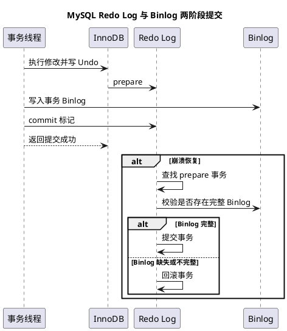

# MySQL 日志与崩溃恢复

## 问题索引

- Q1：Redo Log、Undo Log、Binlog 分别解决什么问题？
- Q2：MySQL 为什么需要 Binlog 与 Redo Log 两阶段提交？崩溃后如何恢复？

## Q1：Redo Log、Undo Log、Binlog 分别解决什么问题？

**一句话结论：** Redo Log 保证 InnoDB 已提交修改能够恢复，Undo Log 支持回滚和 MVCC，Binlog 记录逻辑变更并服务于复制与增量恢复；三者职责不同，不能互相替代。

| 日志 | 记录内容 | 主要用途 | 生命周期/归属 |
| --- | --- | --- | --- |
| Redo Log | 页的物理变化 | 崩溃恢复、WAL | InnoDB |
| Undo Log | 旧版本和回滚信息 | 回滚、MVCC | InnoDB |
| Binlog | 逻辑变更事件 | 主从复制、PITR、CDC | MySQL Server |

### 写入边界

```text
修改页 -> 写 Redo Log Buffer
      -> 写 Undo 以支持回滚和版本读取
      -> 提交阶段协调 Redo 与 Binlog
      -> 根据刷盘策略持久化
```

参数如 `innodb_flush_log_at_trx_commit`、`sync_binlog` 会影响性能和宕机后的丢失窗口，不能只说“设置为 1 就绝对不丢”，还要结合硬件、电源和复制拓扑。

## Q2：MySQL 为什么需要 Binlog 与 Redo Log 两阶段提交？崩溃后如何恢复？

**一句话结论：** 两阶段提交保证事务在 Redo Log 和 Binlog 中的提交状态一致，避免主从复制和崩溃恢复对同一事务得出不同结论。

### 典型流程



恢复时重点判断处于 `prepare` 状态的事务：如果 Binlog 中存在完整事务记录，说明事务已经进入提交链路，应继续提交；否则回滚，避免只恢复了 InnoDB 页而复制日志缺失。

### 面试追问

- Q：为什么不能只用 Binlog 恢复？
  A：Binlog 主要是逻辑日志，InnoDB 需要 Redo Log 进行页级快速恢复；只依赖 Binlog 恢复成本高且不适合正常崩溃恢复路径。
- Q：为什么不能只用 Redo Log 做主从复制？
  A：Redo Log 与存储引擎页结构绑定，不适合作为跨版本、跨引擎的逻辑复制协议。

## 复习清单

- [ ] 能准确区分 Redo、Undo 和 Binlog。
- [ ] 能画出两阶段提交和崩溃恢复判断路径。
- [ ] 能说明刷盘参数影响的是性能和丢失窗口，而不是脱离硬件的绝对保证。
