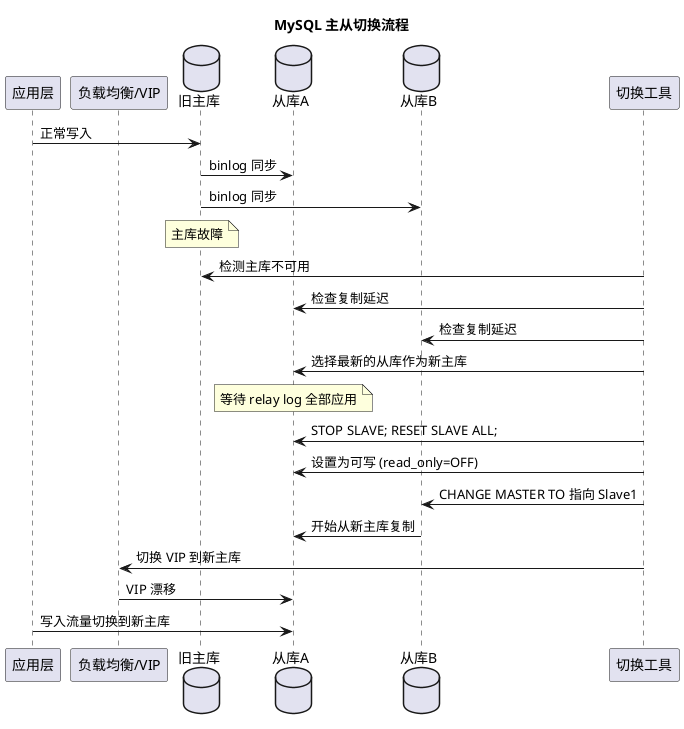
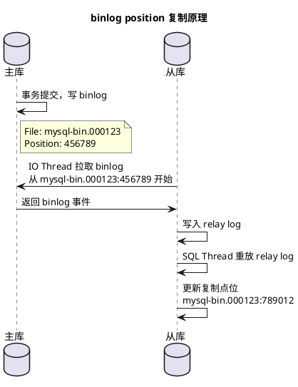
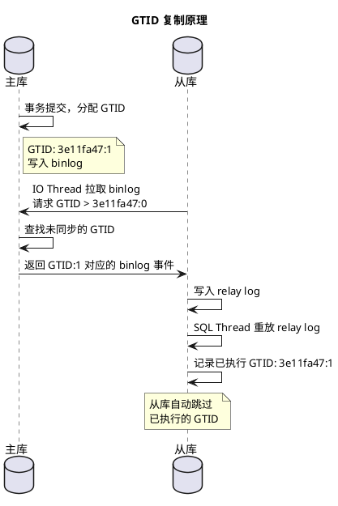
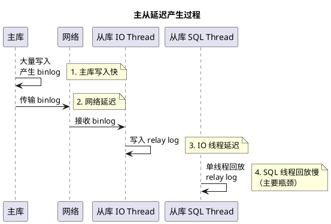
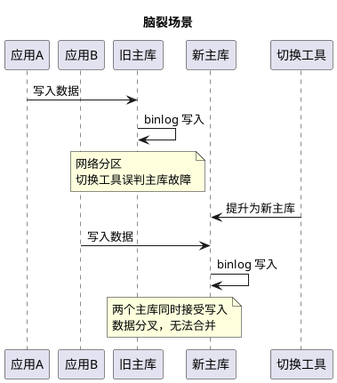
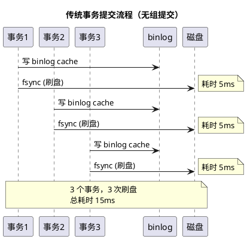
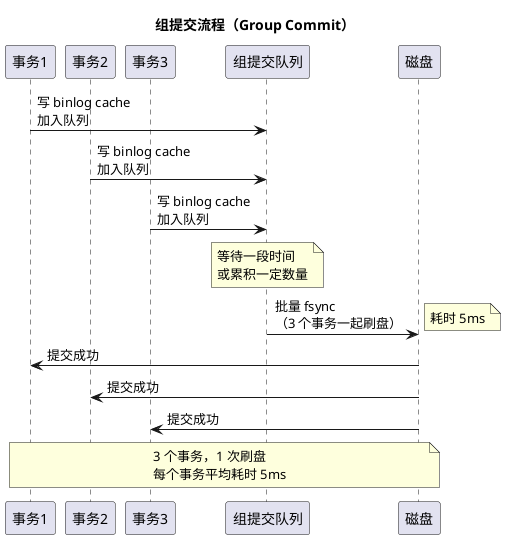
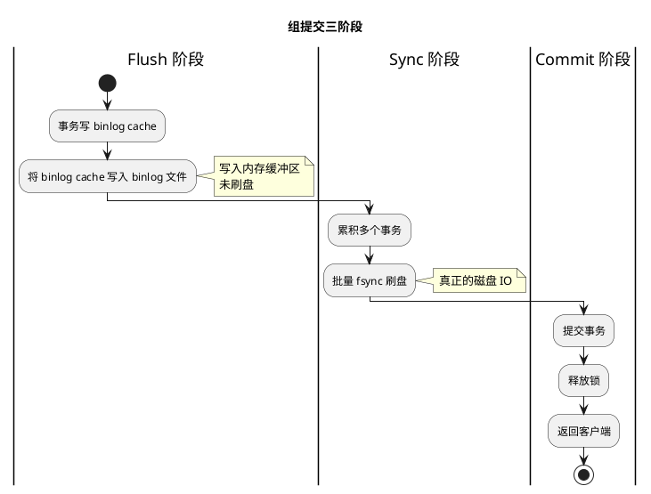
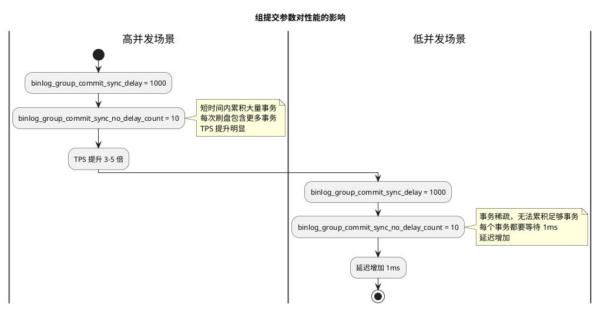

# MySQL 主从复制与切换

## 问题索引

- Q1：MySQL 主从切换原理是什么？如何保证切换后数据一致性？
- Q2：binlog position 和 GTID 的区别是什么？各自的使用场景？
- Q3：MySQL 主从切换常见问题有哪些？如何规避主从延迟、数据不一致、脑裂？
- Q4：MySQL 组提交机制是什么？binlog_group_commit_sync_delay 和 binlog_group_commit_sync_no_delay_count 如何影响性能？

## Q1：MySQL 主从切换原理是什么？如何保证切换后数据一致性？

### 背景

在 MySQL 主从架构中，主库负责写入，从库负责读取和备份。当主库发生故障时，需要将某个从库提升为新主库，这个过程称为主从切换（Failover）。主从切换是高可用架构的核心能力，直接关系到业务连续性和数据一致性。

### 核心原理

#### 主从切换流程



#### 主从切换核心步骤

1. **检测主库故障**
   - 心跳探测超时
   - 连接失败或响应超时
   - 主库服务进程不存在

2. **选择新主库**
   - 选择复制延迟最小的从库
   - 选择数据最完整的从库（GTID 或 binlog position 最新）
   - 优先选择同机房、同可用区的从库

3. **等待从库应用完所有 relay log**
   ```sql
   -- 检查从库是否已应用完所有 relay log
   SHOW SLAVE STATUS\G
   
   -- 关键字段
   -- Relay_Log_File: relay log 文件名
   -- Relay_Log_Pos: relay log 当前位置
   -- Exec_Master_Log_Pos: 已执行到主库 binlog 的位置
   ```

4. **提升从库为主库**
   ```sql
   -- 停止复制
   STOP SLAVE;
   
   -- 重置复制信息
   RESET SLAVE ALL;
   
   -- 设置为可写
   SET GLOBAL read_only = OFF;
   SET GLOBAL super_read_only = OFF;
   ```

5. **重新配置其他从库**
   ```sql
   -- 基于 binlog position
   CHANGE MASTER TO
     MASTER_HOST='new_master_ip',
     MASTER_PORT=3306,
     MASTER_USER='repl_user',
     MASTER_PASSWORD='repl_password',
     MASTER_LOG_FILE='mysql-bin.000123',
     MASTER_LOG_POS=456789;
   
   -- 基于 GTID
   CHANGE MASTER TO
     MASTER_HOST='new_master_ip',
     MASTER_PORT=3306,
     MASTER_USER='repl_user',
     MASTER_PASSWORD='repl_password',
     MASTER_AUTO_POSITION=1;
   
   START SLAVE;
   ```

6. **切换应用流量**
   - VIP 漂移（Virtual IP）
   - DNS 解析更新
   - 应用配置动态刷新
   - 中间件路由切换（如 MHA、Orchestrator、ProxySQL）

#### 数据一致性保证

| 保证方式 | 说明 | 适用场景 |
| --- | --- | --- |
| **半同步复制** | 主库事务提交前，至少等待一个从库确认接收 binlog | 对数据一致性要求高的场景 |
| **GTID 自动跳过** | 基于 GTID，从库自动跳过已执行的事务 | 简化切换后复制拓扑管理 |
| **relay log 完全应用** | 切换前确保从库应用完所有 relay log | 防止切换后数据丢失 |
| **双主互备** | 两个主库互为主从，切换时无需重新配置 | 需要快速切换的场景 |

### 业务场景

1. **主库硬件故障**
   - 主库服务器宕机、磁盘损坏
   - 需要快速切换到从库恢复业务

2. **主库性能瓶颈**
   - 主库负载过高，需要切换到性能更好的从库
   - 主库升级硬件，需要临时切换

3. **机房网络故障**
   - 主库所在机房网络故障，需要切换到其他机房的从库
   - 跨地域容灾切换

4. **计划性维护**
   - 主库操作系统升级、MySQL 版本升级
   - 需要停机维护，提前切换到从库

### 解决方案

#### 使用 MHA（Master High Availability）

MHA 是 MySQL 高可用切换工具，支持自动故障检测和主从切换。

```bash
# MHA 配置示例
[server default]
manager_log=/var/log/mha/app1.log
manager_workdir=/var/log/mha/app1
master_binlog_dir=/var/lib/mysql
remote_workdir=/tmp
ssh_user=mha
repl_user=repl
repl_password=repl123
ping_interval=3
shutdown_script=/usr/local/bin/master_ip_failover

[server1]
hostname=192.168.1.10
port=3306
candidate_master=1

[server2]
hostname=192.168.1.11
port=3306
candidate_master=1

[server3]
hostname=192.168.1.12
port=3306
```

#### 使用 Orchestrator

Orchestrator 是 MySQL 复制拓扑管理和自动故障转移工具，提供 Web UI 和 API。

```json
{
  "RecoveryPeriodBlockSeconds": 300,
  "RecoveryIgnoreHostnameFilters": [],
  "RecoverMasterClusterFilters": ["*"],
  "RecoverIntermediateMasterClusterFilters": ["*"],
  "OnFailureDetectionProcesses": [
    "echo 'Detected {failureType} on {failureCluster}' >> /tmp/recovery.log"
  ],
  "PreFailoverProcesses": [
    "/usr/local/bin/pre_failover.sh {failureCluster} {failureDescription}"
  ],
  "PostMasterFailoverProcesses": [
    "/usr/local/bin/vip_manager.sh {successorHost} {successorPort}"
  ]
}
```

#### 应用层配置

```java
// 使用数据源中间件支持主从切换
@Configuration
public class DataSourceConfig {
    
    @Bean
    public DataSource dataSource() {
        // 配置多数据源
        Map<Object, Object> targetDataSources = new HashMap<>();
        targetDataSources.put("master", masterDataSource());
        targetDataSources.put("slave1", slave1DataSource());
        targetDataSources.put("slave2", slave2DataSource());
        
        DynamicDataSource dynamicDataSource = new DynamicDataSource();
        dynamicDataSource.setTargetDataSources(targetDataSources);
        dynamicDataSource.setDefaultTargetDataSource(masterDataSource());
        
        return dynamicDataSource;
    }
    
    // 监听 VIP 变化或使用域名解析
    // 主库故障后，VIP 自动漂移到新主库
    private DataSource masterDataSource() {
        DruidDataSource dataSource = new DruidDataSource();
        dataSource.setUrl("jdbc:mysql://db-master-vip:3306/test");
        dataSource.setUsername("app_user");
        dataSource.setPassword("app_password");
        
        // 配置连接池故障重试
        dataSource.setConnectionErrorRetryAttempts(3);
        dataSource.setBreakAfterAcquireFailure(true);
        
        return dataSource;
    }
}
```

### 踩坑点

1. **切换时数据丢失**
   - **问题**：主库故障时，部分 binlog 未同步到从库
   - **规避**：使用半同步复制（semi-sync replication），确保至少一个从库确认收到 binlog

2. **切换后从库数据不一致**
   - **问题**：多个从库的复制进度不一致，选择的新主库不是数据最新的
   - **规避**：切换前对比所有从库的 GTID 或 binlog position，选择最新的从库

3. **旧主库复活后的双写问题**
   - **问题**：旧主库恢复后，应用同时写入旧主库和新主库，导致数据冲突
   - **规避**：切换后立即隔离旧主库（断网、停止服务），确保旧主库不再接收写入

4. **应用连接池未及时切换**
   - **问题**：VIP 切换后，应用连接池仍然持有旧连接，导致写入失败
   - **规避**：配置连接池的故障检测和自动重连，或主动触发连接池刷新

## Q2：binlog position 和 GTID 的区别是什么？各自的使用场景？

### 背景

MySQL 主从复制需要标识复制的进度，早期使用 binlog 文件名和位置（binlog position），MySQL 5.6 引入了 GTID（Global Transaction Identifier）。两者是主从复制点位管理的两种方式。

### 核心原理

#### binlog position

binlog position 是基于 binlog 文件名和文件内偏移量的复制点位。

```text
mysql-bin.000123, position 456789
```

**工作原理**：



**特点**：
- 依赖文件名和偏移量
- 主从切换时需要手动找到新主库的 binlog position
- 复制拓扑变化时，需要人工计算和调整点位
- 容易出错，特别是在多级复制、复制拓扑重构场景

#### GTID

GTID 是全局唯一的事务 ID，格式为 `server_uuid:transaction_id`。

```text
3e11fa47-71ca-11e1-9e33-c80aa9429562:1-5
```

**工作原理**：



**特点**：
- 每个事务有全局唯一 ID
- 主从切换时，从库自动找到复制点位（MASTER_AUTO_POSITION=1）
- 支持多级复制、复制拓扑重构
- 避免重复执行事务
- 简化运维操作

#### 对比表

| 特性 | binlog position | GTID |
| --- | --- | --- |
| **复制点位** | 文件名 + 偏移量 | 全局唯一事务 ID |
| **主从切换** | 需要手动找点位 | 自动定位点位 |
| **多级复制** | 需要逐级计算点位 | 自动处理 |
| **复制拓扑重构** | 复杂，容易出错 | 简单，自动对齐 |
| **事务去重** | 不支持 | 自动去重 |
| **运维复杂度** | 高 | 低 |
| **兼容性** | 所有版本 | MySQL 5.6+ |
| **限制** | 无特殊限制 | 不支持某些 SQL（如 CREATE TABLE ... SELECT） |

### 业务场景

#### binlog position 适用场景

1. **MySQL 5.5 及更早版本**
   - GTID 在 MySQL 5.6 才引入
   - 旧版本只能使用 binlog position

2. **特殊 SQL 需求**
   - 需要使用 `CREATE TABLE ... SELECT`
   - 需要在事务中操作非事务表
   - 这些 SQL 在 GTID 模式下不支持或有限制

3. **简单主从结构**
   - 只有一主一从，不涉及复杂拓扑变化
   - 不需要频繁切换

#### GTID 适用场景

1. **高可用架构**
   - 需要频繁主从切换
   - 使用 MHA、Orchestrator 等自动切换工具
   - 切换时间要求短，不能容忍人工找点位

2. **多级复制**
   - 主库 -> 从库 -> 从库的从库
   - GTID 自动对齐，无需逐级计算点位

3. **复制拓扑重构**
   - 需要动态调整复制关系
   - 例如：从库 A 原本从主库 M 复制，现在改为从从库 B 复制
   - GTID 自动找到正确的同步点

4. **数据一致性要求高**
   - GTID 自动去重，避免重复执行事务
   - 防止主从切换后数据不一致

### 解决方案

#### 启用 GTID

```ini
# my.cnf 配置
[mysqld]
# 启用 GTID
gtid_mode = ON
enforce_gtid_consistency = ON

# binlog 配置
log_bin = mysql-bin
binlog_format = ROW
server_id = 1

# 建议同时启用
log_slave_updates = ON
```

#### 从 binlog position 迁移到 GTID

```sql
-- 1. 在主库和所有从库上设置
SET GLOBAL enforce_gtid_consistency = WARN;

-- 2. 观察一段时间，检查日志中是否有不兼容的 SQL
-- 3. 如果没有问题，继续设置
SET GLOBAL enforce_gtid_consistency = ON;

-- 4. 启用 GTID（需要重启或在线切换）
SET GLOBAL gtid_mode = OFF_PERMISSIVE;
SET GLOBAL gtid_mode = ON_PERMISSIVE;
SET GLOBAL gtid_mode = ON;

-- 5. 在从库上切换为 GTID 复制
STOP SLAVE;
CHANGE MASTER TO MASTER_AUTO_POSITION = 1;
START SLAVE;
```

#### GTID 主从切换示例

```sql
-- 在新主库上
STOP SLAVE;
RESET SLAVE ALL;
SET GLOBAL read_only = OFF;

-- 在其他从库上
STOP SLAVE;
CHANGE MASTER TO
  MASTER_HOST = 'new_master_ip',
  MASTER_PORT = 3306,
  MASTER_USER = 'repl_user',
  MASTER_PASSWORD = 'repl_password',
  MASTER_AUTO_POSITION = 1;  -- 自动定位 GTID
START SLAVE;

-- 检查复制状态
SHOW SLAVE STATUS\G
```

### 踩坑点

1. **GTID 空洞问题**
   - **问题**：主库上某些 GTID 被跳过，导致从库无法同步
   - **原因**：手动执行 `SET GTID_NEXT` 后忘记执行事务
   - **规避**：避免手动设置 GTID，使用 `GTID_NEXT=AUTOMATIC`

2. **GTID 不兼容的 SQL**
   - **问题**：`CREATE TABLE ... SELECT` 在 GTID 模式下报错
   - **原因**：该语句包含 DDL 和 DML，GTID 要求原子性
   - **规避**：拆分为两条语句：`CREATE TABLE` + `INSERT INTO ... SELECT`

3. **从 binlog position 切换到 GTID 时从库断开**
   - **问题**：切换过程中从库复制中断
   - **原因**：切换步骤不正确，主从 GTID 模式不一致
   - **规避**：按照官方文档逐步切换，先设置 `OFF_PERMISSIVE`，再设置 `ON_PERMISSIVE`，最后设置 `ON`

4. **旧主库复活后 GTID 冲突**
   - **问题**：旧主库恢复后，其 GTID 集合与新主库冲突
   - **规避**：旧主库复活后，必须先清理数据，重新作为从库加入，或手动注入 GTID 集合对齐

## Q3：MySQL 主从切换常见问题有哪些？如何规避主从延迟、数据不一致、脑裂？

### 背景

MySQL 主从架构在实际运维中会遇到多种问题，最常见的是主从延迟、数据不一致和脑裂。这些问题直接影响业务的可用性和数据一致性，需要在架构设计、配置优化和运维流程中充分考虑。

### 核心原理

#### 主从延迟

主从延迟是指从库应用 binlog 的速度慢于主库产生 binlog 的速度，导致从库数据落后于主库。

**延迟来源**：



**延迟表现**：

```sql
-- 查看主从延迟
SHOW SLAVE STATUS\G

-- 关键字段
Seconds_Behind_Master: 120  -- 从库落后主库 120 秒
```

**延迟影响**：
- 读写分离架构中，从库读到旧数据
- 主从切换时，需要等待从库应用完 relay log，延长切换时间
- 监控报警频繁触发

#### 数据不一致

数据不一致是指主库和从库的数据不相同，可能由多种原因导致。

**不一致场景**：

| 场景 | 原因 | 表现 |
| --- | --- | --- |
| **主库 binlog 丢失** | 主库故障时，部分 binlog 未同步到从库 | 从库缺少数据 |
| **从库 SQL 执行失败** | 从库环境不一致（如字段长度、约束） | 从库复制中断 |
| **从库手动写入** | 误操作在从库上执行了写入 SQL | 从库有额外数据 |
| **binlog_format 不当** | 使用 STATEMENT 格式，SQL 执行结果不确定 | 主从数据不同 |
| **跳过错误** | 使用 `sql_slave_skip_counter` 跳过错误事务 | 从库缺少数据 |

#### 脑裂

脑裂是指主从切换过程中，旧主库和新主库同时接受写入，导致数据分叉。

**脑裂场景**：



**脑裂危害**：
- 两个主库的数据无法自动合并
- 业务数据不一致，需要人工介入修复
- 可能导致数据永久丢失

### 业务场景

1. **大促场景下主从延迟**
   - 主库写入 QPS 激增，从库回放速度跟不上
   - 从库延迟达到几分钟甚至几小时
   - 用户查询订单时，看到的是旧数据

2. **主从切换时数据不一致**
   - 主库故障，切换到从库
   - 发现从库缺少部分订单数据
   - 用户投诉订单丢失

3. **双写导致脑裂**
   - 主库网络抖动，切换工具误判为故障
   - 切换到从库，但旧主库仍然可写
   - 部分应用写入旧主库，部分应用写入新主库
   - 数据分叉，无法合并

### 解决方案

#### 规避主从延迟

##### 1. 使用并行复制

MySQL 5.7+ 支持基于 GTID 的并行复制，从库可以并行应用 binlog。

```ini
# my.cnf 配置
[mysqld]
# 启用并行复制
slave_parallel_type = LOGICAL_CLOCK
slave_parallel_workers = 8  -- 并行回放线程数

# 或使用基于库的并行复制（MySQL 5.6+）
slave_parallel_type = DATABASE
slave_parallel_workers = 8
```

**原理**：
- `LOGICAL_CLOCK`：基于组提交，同一组提交的事务可以并行回放
- `DATABASE`：不同数据库的事务可以并行回放

##### 2. 主库启用组提交

主库启用组提交，可以让更多事务在同一组提交，从库并行回放效率更高。

```ini
# my.cnf 配置（详见 Q4）
[mysqld]
binlog_group_commit_sync_delay = 1000       -- 延迟 1ms 提交
binlog_group_commit_sync_no_delay_count = 10  -- 累积 10 个事务后提交
```

##### 3. 优化从库硬件

- 使用 SSD，提升 IO 性能
- 增加 CPU 核心数，支持更多并行回放线程
- 增加内存，减少磁盘 IO

##### 4. 读写分离时强制读主库

对于数据一致性要求高的业务，强制读主库。

```java
@Service
public class OrderService {
    
    @Autowired
    private DataSource masterDataSource;
    
    @Autowired
    private DataSource slaveDataSource;
    
    // 写入后立即查询，强制读主库
    @Transactional
    public void createOrder(Order order) {
        // 写入主库
        orderMapper.insert(order);
        
        // 写入后立即查询，使用主库
        Order result = queryFromMaster(order.getId());
    }
    
    // 普通查询，可以读从库
    public Order queryOrder(Long orderId) {
        return orderMapper.selectById(orderId);
    }
}
```

##### 5. 使用半同步复制

半同步复制确保至少一个从库确认接收 binlog，减少主从延迟。

```sql
-- 主库启用半同步复制
INSTALL PLUGIN rpl_semi_sync_master SONAME 'semisync_master.so';
SET GLOBAL rpl_semi_sync_master_enabled = 1;
SET GLOBAL rpl_semi_sync_master_timeout = 1000;  -- 超时 1 秒

-- 从库启用半同步复制
INSTALL PLUGIN rpl_semi_sync_slave SONAME 'semisync_slave.so';
SET GLOBAL rpl_semi_sync_slave_enabled = 1;
```

#### 规避数据不一致

##### 1. 启用半同步复制

确保至少一个从库确认接收 binlog，主库故障时不丢失数据。

##### 2. 使用 GTID

GTID 自动去重，避免重复执行事务。

##### 3. 使用 ROW 格式 binlog

ROW 格式记录每一行的变更，避免 STATEMENT 格式的不确定性。

```ini
# my.cnf 配置
[mysqld]
binlog_format = ROW
```

##### 4. 从库设置为只读

防止误操作在从库上执行写入 SQL。

```sql
SET GLOBAL read_only = ON;
SET GLOBAL super_read_only = ON;  -- 限制 SUPER 权限用户
```

##### 5. 定期数据校验

使用 `pt-table-checksum` 定期校验主从数据一致性。

```bash
# 安装 Percona Toolkit
yum install percona-toolkit

# 校验主从数据
pt-table-checksum \
  --host=master_ip \
  --user=checksum_user \
  --password=checksum_password \
  --databases=mydb \
  --replicate=percona.checksums

# 修复不一致数据
pt-table-sync \
  --execute \
  --replicate=percona.checksums \
  --sync-to-master \
  slave_ip
```

#### 规避脑裂

##### 1. 使用 Fencing 机制

Fencing 是指在切换前，先隔离旧主库，确保旧主库不再接受写入。

**方法**：
- **STONITH（Shoot The Other Node In The Head）**：直接关闭旧主库服务器
- **网络隔离**：断开旧主库的网络连接
- **数据库层隔离**：在旧主库上执行 `SET GLOBAL read_only = ON`

```bash
# 切换前执行 Fencing 脚本
#!/bin/bash
OLD_MASTER_IP=$1

# 方法 1：设置旧主库为只读
mysql -h $OLD_MASTER_IP -u admin -p -e "SET GLOBAL read_only = ON; SET GLOBAL super_read_only = ON;"

# 方法 2：停止旧主库服务
ssh $OLD_MASTER_IP "systemctl stop mysqld"

# 方法 3：断开旧主库网络
ssh $OLD_MASTER_IP "iptables -A INPUT -p tcp --dport 3306 -j DROP"
```

##### 2. 使用共识算法

使用 Raft、Paxos 等共识算法，确保同一时刻只有一个主库。

**工具**：
- **MySQL Group Replication**：基于 Paxos 的多主复制
- **Galera Cluster**：基于共识的多主同步复制
- **PXC（Percona XtraDB Cluster）**：Galera Cluster 的 Percona 版本

##### 3. 使用 Quorum（法定票数）

切换时，必须获得半数以上节点的同意，才能提升新主库。

```json
// Orchestrator 配置
{
  "RecoverMasterClusterFilters": ["*"],
  "MinimumReplicaLagForRecover": 10,  // 从库延迟小于 10 秒才能参与投票
  "FailureDetectionPeriodBlockSeconds": 60  // 60 秒内不重复切换
}
```

##### 4. 应用层双重检查

应用层在写入前，检查当前节点是否为主库。

```java
@Service
public class OrderService {
    
    @Autowired
    private JdbcTemplate jdbcTemplate;
    
    public void createOrder(Order order) {
        // 检查当前节点是否为主库
        if (!isMaster()) {
            throw new IllegalStateException("当前节点不是主库，禁止写入");
        }
        
        // 写入主库
        orderMapper.insert(order);
    }
    
    private boolean isMaster() {
        String result = jdbcTemplate.queryForObject(
            "SELECT @@read_only AS is_readonly", String.class);
        return "0".equals(result);
    }
}
```

### 踩坑点

1. **并行复制配置不当**
   - **问题**：设置 `slave_parallel_workers` 过大，导致从库 CPU 100%
   - **规避**：根据从库 CPU 核心数设置，建议不超过核心数的 2 倍

2. **半同步复制超时设置过长**
   - **问题**：`rpl_semi_sync_master_timeout` 设置过长，主库写入延迟增加
   - **规避**：根据网络延迟和业务容忍度设置，建议 100ms ~ 1000ms

3. **切换时未执行 Fencing**
   - **问题**：切换工具直接提升新主库，未隔离旧主库，导致脑裂
   - **规避**：切换脚本中强制执行 Fencing，确保旧主库不可写

4. **数据校验工具对主库影响**
   - **问题**：`pt-table-checksum` 在主库上执行全表扫描，影响业务
   - **规避**：在业务低峰期执行，或在从库上校验（使用 `--recursion-method`）

## Q4：MySQL 组提交机制是什么？binlog_group_commit_sync_delay 和 binlog_group_commit_sync_no_delay_count 如何影响性能？

### 背景

MySQL 事务提交时，需要将 binlog 刷盘（fsync）以保证持久性。每次刷盘都是一次昂贵的 IO 操作，高并发场景下频繁刷盘会成为性能瓶颈。MySQL 引入了组提交（Group Commit）机制，将多个事务的 binlog 一次性刷盘，大幅提升吞吐量。

### 核心原理

#### 传统提交流程



**问题**：
- 每个事务都需要一次 fsync
- 磁盘 IOPS 成为瓶颈
- TPS 受限于磁盘 fsync 速度

#### 组提交流程



**优势**：
- 多个事务共享一次 fsync
- 减少磁盘 IO 次数
- 提升 TPS

#### 组提交三阶段

MySQL 5.7+ 的组提交分为三个阶段：



| 阶段 | 说明 | 耗时 |
| --- | --- | --- |
| **Flush** | 将 binlog cache 写入 binlog 文件（内存缓冲区） | 快 |
| **Sync** | 批量 fsync 刷盘 | 慢（主要瓶颈） |
| **Commit** | 提交事务，释放锁 | 快 |

#### 组提交参数

##### binlog_group_commit_sync_delay

延迟刷盘时间，单位微秒（us），默认 0。

**作用**：
- 在 Sync 阶段，等待 N 微秒，让更多事务加入组提交队列
- 增加每次刷盘的事务数量，提升吞吐量
- 代价是增加事务提交延迟

**示例**：

```ini
# my.cnf 配置
[mysqld]
binlog_group_commit_sync_delay = 1000  -- 延迟 1ms（1000 微秒）
```

**效果**：
- 假设事务 A 进入 Sync 阶段，等待 1ms
- 在这 1ms 内，事务 B、C、D 也进入 Sync 阶段
- 1ms 后，A、B、C、D 一起刷盘

##### binlog_group_commit_sync_no_delay_count

累积事务数量阈值，默认 0。

**作用**：
- 在 Sync 阶段，如果累积的事务数达到 N，立即刷盘，不再等待 `binlog_group_commit_sync_delay`
- 避免延迟过长影响低并发场景

**示例**：

```ini
# my.cnf 配置
[mysqld]
binlog_group_commit_sync_delay = 1000  -- 延迟 1ms
binlog_group_commit_sync_no_delay_count = 10  -- 累积 10 个事务后立即刷盘
```

**效果**：
- 如果 1ms 内累积了 10 个事务，立即刷盘，不再等待
- 如果 1ms 内累积不到 10 个事务，等待 1ms 后刷盘

#### 组提交与性能的关系



**总结**：
- 高并发场景：组提交效果明显，TPS 提升 3-5 倍
- 低并发场景：延迟增加，TPS 提升不明显

### 业务场景

1. **高并发写入场景**
   - 秒杀、抢购、大促期间
   - 主库 TPS 达到瓶颈
   - 需要提升吞吐量

2. **批量导入场景**
   - 批量导入订单、用户数据
   - 每个事务都需要刷盘，导致导入速度慢
   - 启用组提交可以大幅提升导入速度

3. **主从复制优化**
   - 主库启用组提交，从库并行复制效率更高
   - 同一组提交的事务可以并行回放
   - 减少主从延迟

### 解决方案

#### 推荐配置

```ini
# my.cnf 配置
[mysqld]
# 组提交参数
binlog_group_commit_sync_delay = 1000       -- 延迟 1ms
binlog_group_commit_sync_no_delay_count = 10  -- 累积 10 个事务后立即刷盘

# binlog 配置
log_bin = mysql-bin
binlog_format = ROW
sync_binlog = 1  -- 每次提交都刷盘（持久性保证）

# 其他优化
innodb_flush_log_at_trx_commit = 1  -- 每次提交都刷 redo log
transaction_isolation = READ-COMMITTED  -- 减少锁冲突
```

#### 性能测试

使用 sysbench 测试组提交效果。

```bash
# 安装 sysbench
yum install sysbench

# 准备测试数据
sysbench /usr/share/sysbench/oltp_insert.lua \
  --mysql-host=127.0.0.1 \
  --mysql-port=3306 \
  --mysql-user=test \
  --mysql-password=test \
  --mysql-db=testdb \
  --tables=10 \
  --table-size=10000 \
  prepare

# 测试 1：不启用组提交
sysbench /usr/share/sysbench/oltp_insert.lua \
  --mysql-host=127.0.0.1 \
  --mysql-port=3306 \
  --mysql-user=test \
  --mysql-password=test \
  --mysql-db=testdb \
  --tables=10 \
  --threads=100 \
  --time=60 \
  run

# 测试 2：启用组提交
# 修改 my.cnf
# binlog_group_commit_sync_delay = 1000
# binlog_group_commit_sync_no_delay_count = 10
# 重启 MySQL

sysbench /usr/share/sysbench/oltp_insert.lua \
  --mysql-host=127.0.0.1 \
  --mysql-port=3306 \
  --mysql-user=test \
  --mysql-password=test \
  --mysql-db=testdb \
  --tables=10 \
  --threads=100 \
  --time=60 \
  run
```

**测试结果示例**：

| 配置 | TPS | 平均延迟 |
| --- | --- | --- |
| 不启用组提交 | 2000 | 50ms |
| 启用组提交（delay=1000, count=10） | 8000 | 12.5ms |

#### 监控组提交效果

```sql
-- 查看 binlog 状态
SHOW BINARY LOGS;

-- 查看当前 binlog 位置
SHOW MASTER STATUS;

-- 查看 binlog 事件
SHOW BINLOG EVENTS IN 'mysql-bin.000123' LIMIT 10;

-- 查看组提交统计（MySQL 5.7+）
SHOW STATUS LIKE 'Binlog_group_commit%';

-- 关键指标
Binlog_group_commit_trigger_count   -- 触发组提交的次数
Binlog_group_commit_trigger_timeout -- 触发超时的次数
Binlog_group_commit_trigger_lock_wait -- 触发锁等待的次数
```

### 踩坑点

1. **延迟设置过大**
   - **问题**：`binlog_group_commit_sync_delay` 设置为 10ms，低并发时每个事务都要等待 10ms
   - **规避**：建议设置为 1ms ~ 2ms，同时配合 `binlog_group_commit_sync_no_delay_count`

2. **count 设置过小**
   - **问题**：`binlog_group_commit_sync_no_delay_count` 设置为 2，高并发时频繁触发，组提交效果不明显
   - **规避**：根据并发量设置，建议 10 ~ 50

3. **sync_binlog = 0 导致数据丢失**
   - **问题**：为了性能，设置 `sync_binlog = 0`，主库故障时 binlog 未刷盘，数据丢失
   - **规避**：建议 `sync_binlog = 1`，结合组提交保证性能和持久性

4. **组提交与半同步复制冲突**
   - **问题**：启用半同步复制后，组提交效果减弱
   - **原因**：半同步复制需要等待从库确认，延长了提交时间
   - **规避**：适当增加 `rpl_semi_sync_master_timeout`，平衡性能和一致性

## 面试追问

### Q1 追问

- Q：主从切换时，如何确保选择的新主库数据最完整？
  A：对比所有从库的 GTID 集合或 binlog position，选择 GTID 最新或 position 最大的从库。同时检查 `Seconds_Behind_Master`，选择延迟最小的从库。

- Q：VIP 漂移和 DNS 切换各有什么优缺点？
  A：VIP 漂移切换速度快（秒级），但需要主从在同一网段。DNS 切换灵活，支持跨机房，但切换慢（依赖 DNS TTL 和客户端缓存），一般需要分钟级。

- Q：双主互备架构如何避免循环复制？
  A：启用 `log_slave_updates = ON` 和 `replicate_same_server_id = OFF`。从库收到的 binlog 事件会带有原主库的 `server_id`，从库不会再将该事件复制回原主库。

### Q2 追问

- Q：GTID 模式下，如何跳过一个有问题的事务？
  A：不能使用 `sql_slave_skip_counter`。需要在从库上手动注入一个空事务，占用该 GTID。
  ```sql
  SET GTID_NEXT = '3e11fa47-71ca-11e1-9e33-c80aa9429562:10';
  BEGIN; COMMIT;
  SET GTID_NEXT = 'AUTOMATIC';
  START SLAVE;
  ```

- Q：从 GTID 模式切换回 binlog position 模式需要注意什么？
  A：需要重启 MySQL，且切换过程中会中断复制。一般不建议切换回 binlog position，除非遇到 GTID 不兼容的 SQL。

- Q：GTID 模式下，为什么不支持 `CREATE TABLE ... SELECT`？
  A：该语句包含 DDL 和 DML，MySQL 无法为其分配单个 GTID。GTID 要求每个事务只能是 DDL 或 DML，不能混合。

### Q3 追问

- Q：主从延迟超过 1 小时，如何快速追赶？
  A：1) 临时关闭从库的 binlog（`sql_log_bin = OFF`），减少写入开销。2) 增加 `slave_parallel_workers`。3) 如果延迟过大无法追赶，考虑重新搭建从库（使用 `mysqldump` 或 `xtrabackup`）。

- Q：如何判断是否发生了脑裂？
  A：检查是否有多个节点的 `read_only = OFF`。使用 `SHOW VARIABLES LIKE 'read_only'` 和 `SHOW VARIABLES LIKE 'server_uuid'` 确认。同时检查应用日志，是否有写入失败或冲突报错。

- Q：pt-table-checksum 如何工作？
  A：在主库上逐表执行 `CHECKSUM TABLE` 或 `CRC32` 计算，将结果写入主库的 `percona.checksums` 表。从库通过复制也会计算 checksum 并写入本地 `percona.checksums` 表。对比主从的 checksum 结果，发现不一致的表和行。

### Q4 追问

- Q：组提交对主从复制有什么影响？
  A：主库启用组提交后，同一组提交的事务在 binlog 中连续记录，从库可以并行回放（`slave_parallel_type = LOGICAL_CLOCK`），减少主从延迟。

- Q：binlog_group_commit_sync_delay 为什么单位是微秒，而不是毫秒？
  A：为了更精细的控制。高并发场景下，延迟 100 微秒（0.1ms）和 1000 微秒（1ms）对组提交效果影响很大。

- Q：sync_binlog 的不同取值有什么影响？
  A：
  - `sync_binlog = 0`：MySQL 不主动刷盘，交给操作系统决定。性能最好，但主库故障时可能丢失数据。
  - `sync_binlog = 1`：每次提交都刷盘。持久性最好，但性能差。结合组提交可以平衡性能和持久性。
  - `sync_binlog = N`：每 N 个事务刷盘一次。折中方案，但仍有丢失数据风险。

## 复习清单

- [ ] 能画出主从切换流程图，说明每个步骤的作用
- [ ] 能对比 binlog position 和 GTID 的区别，说出各自的使用场景
- [ ] 能说明主从延迟的产生原因和优化方法（并行复制、组提交、半同步）
- [ ] 能解释脑裂的原因和规避方法（Fencing、Quorum、共识算法）
- [ ] 能说明组提交的三阶段（Flush、Sync、Commit）和参数作用
- [ ] 能推荐 `binlog_group_commit_sync_delay` 和 `binlog_group_commit_sync_no_delay_count` 的合理配置
- [ ] 能说明半同步复制与组提交的关系
- [ ] 能使用 `pt-table-checksum` 校验主从数据一致性
- [ ] 能处理 GTID 模式下跳过错误事务的场景
- [ ] 能根据业务场景选择异步复制、半同步复制、同步复制（MGR、Galera）
