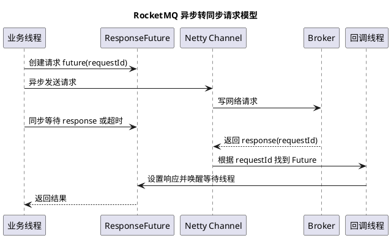

# RocketMQ 异步转同步机制

## 问题索引

- Q1：RocketMQ 的异步转同步机制

## Q1：RocketMQ 的异步转同步机制

### 背景

RocketMQ 中常说的“异步转同步”，主要出现在 Remoting 通信层：底层网络通信基于 Netty，是事件驱动、异步非阻塞的；但上层 API 可以提供 `invokeSync` 这种同步调用语义，让业务线程像调用本地方法一样等待 Broker 返回结果。

所以它不是把网络 IO 真的变成阻塞 IO，而是用“请求编号 + Future + 等待/唤醒”的方式，把异步响应包装成同步结果。

### 核心原理


### PlantUML 示意图：异步请求转同步等待



RocketMQ 客户端向 Broker 发送请求时，会给每个请求生成一个唯一的 `opaque`。这个 `opaque` 可以理解为请求 ID，用来把响应和请求关联起来。

同步调用的大致流程是：

1. 创建 `ResponseFuture`，里面保存 `opaque`、超时时间、开始时间、响应结果、异常原因、回调等信息。
2. 把 `ResponseFuture` 放入 `responseTable`，通常是 `ConcurrentHashMap<Integer, ResponseFuture>`。
3. 通过 Netty 的 `channel.writeAndFlush(request)` 异步发送请求。
4. 当前业务线程调用 `waitResponse(timeoutMillis)` 等待响应，底层常见实现是 `CountDownLatch.await()`。
5. Broker 返回响应后，Netty IO 线程收到 `RemotingCommand`。
6. 根据响应里的 `opaque` 从 `responseTable` 找到对应的 `ResponseFuture`。
7. 设置响应结果，移除 `responseTable` 中的记录，并唤醒等待线程。
8. 业务线程拿到响应，继续执行；如果超时或发送失败，则抛出异常。

核心结构可以这样理解：

| 结构 | 作用 |
| --- | --- |
| `opaque` | 请求和响应的关联 ID |
| `ResponseFuture` | 保存一次请求的等待状态、响应结果、异常、回调 |
| `responseTable` | 全局请求表，用 `opaque` 找到等待中的请求 |
| `CountDownLatch` | 同步调用里阻塞业务线程，响应回来后唤醒 |
| `writeAndFlush` | Netty 异步发送请求 |
| `processResponseCommand` | Netty 收到响应后匹配并完成 Future |

### 伪代码理解

```java
public RemotingCommand invokeSync(Channel channel, RemotingCommand request, long timeoutMillis) {
    int opaque = request.getOpaque();

    // ResponseFuture 保存本次请求的等待状态和响应结果。
    // 同步调用没有回调，所以 callback 传 null。
    ResponseFuture future = new ResponseFuture(opaque, timeoutMillis, null);

    // responseTable 是请求编号到 Future 的映射。
    // 响应回来时，Netty IO 线程会根据 opaque 找到它。
    responseTable.put(opaque, future);

    try {
        // Netty 的发送动作本身是异步的，不会等 Broker 处理完成。
        // 这里只是把数据写入 Channel，并注册发送完成监听。
        channel.writeAndFlush(request).addListener(sendFuture -> {
            if (!sendFuture.isSuccess()) {
                // 如果发送失败，要标记 Future 并唤醒等待线程，避免业务线程一直等到超时。
                future.setSendRequestOK(false);
                future.setCause(sendFuture.cause());
                future.putResponse(null);
            }
        });

        // 同步语义在这里形成：业务线程等待 Broker 响应或超时。
        RemotingCommand response = future.waitResponse(timeoutMillis);
        if (response == null) {
            throw new RuntimeException("request timeout or send failed");
        }
        return response;
    } finally {
        // 不管成功、失败还是超时，都要清理请求表，避免内存泄漏。
        responseTable.remove(opaque);
    }
}

public void processResponseCommand(RemotingCommand response) {
    int opaque = response.getOpaque();

    // Broker 响应回来后，用同一个 opaque 找到当初等待的 Future。
    ResponseFuture future = responseTable.remove(opaque);
    if (future != null) {
        // 设置响应结果，并通过 CountDownLatch 唤醒 invokeSync 中等待的业务线程。
        future.putResponse(response);

        // 如果是 invokeAsync，这里会提交或执行回调；invokeSync 一般没有 callback。
        future.executeInvokeCallback();
    }
}
```

### 同步、异步、单向的区别

RocketMQ Remoting 层通常可以抽象为三种调用方式：

| 调用方式 | 行为 | 典型场景 |
| --- | --- | --- |
| `invokeSync` | 发送请求后等待 Broker 响应 | 同步发送消息、查询路由、拉取消息 |
| `invokeAsync` | 发送请求后立即返回，响应回来执行回调 | 异步发送消息、提升吞吐 |
| `invokeOneway` | 只发送请求，不等待响应 | 心跳、日志类或允许丢失确认的场景 |

同步发送消息时，业务侧看到的是 `producer.send()` 阻塞等待 `SendResult`；但底层网络写出仍然是 Netty 异步完成的。同步只是调用线程通过 `ResponseFuture` 等待结果。

异步发送消息时，调用线程不会等待响应，只注册 `SendCallback`。Broker 响应回来后，由 Remoting 层根据 `opaque` 找到 `ResponseFuture`，再触发回调。

单向发送不关心响应结果，通常不会把请求长期放入 `responseTable` 等待 Broker 返回。

### 为什么要这样设计

#### 统一通信模型

RocketMQ 不需要为同步、异步各写一套网络通信逻辑。底层都走 Netty 异步 IO，上层通过是否等待、是否注册回调来形成不同调用语义。

#### 提高 IO 线程效率

Netty IO 线程只负责收发和分发事件，不应该长期阻塞等待 Broker 业务处理。真正等待的是调用方业务线程。

#### 支持超时和请求关联

`ResponseFuture` 记录开始时间和超时时间，配合定时扫描可以清理超时请求，避免响应丢失后请求表一直膨胀。

#### 支持并发请求

同一个 Channel 上可以同时发送多个请求。响应可能乱序回来，但只要 `opaque` 唯一，就能正确匹配到各自的 `ResponseFuture`。

### 业务场景

在业务项目中可以这样表达：

“我们使用 RocketMQ 时，生产者同步发送并不是底层 socket 阻塞等待，而是 RocketMQ Remoting 基于 Netty 异步通信封装出来的同步语义。发送请求时会生成 `opaque`，把 `ResponseFuture` 放到 `responseTable`，业务线程等待结果；Broker 响应回来后，Netty IO 线程根据 `opaque` 找到 Future，设置结果并唤醒等待线程。”

如果项目里出现消息发送超时、Broker 响应慢、客户端堆内存上涨，可以沿着这个机制排查：

1. 看 Broker 是否处理慢，导致响应迟迟不返回。
2. 看客户端是否有大量同步发送线程阻塞。
3. 看 `responseTable` 是否存在大量未完成请求。
4. 看异步发送是否被信号量限流，例如 `semaphoreAsync`。
5. 看网络写失败后是否及时唤醒等待线程。

### 踩坑点

#### 不要在 Netty IO 线程里做同步等待

如果在 IO 线程里调用同步等待，可能导致 IO 线程无法继续处理响应，轻则吞吐下降，重则形成类似死锁的等待链路。

#### 超时不代表 Broker 一定没处理

客户端等待超时只代表规定时间内没有拿到响应。Broker 可能已经处理成功，只是响应慢、网络抖动或客户端超时清理了 `ResponseFuture`。所以消息发送超时后，不能简单认为一定失败，需要结合业务幂等和消息查询能力判断。

#### 响应晚到可能找不到 Future

如果请求已经超时并从 `responseTable` 移除，后续响应再回来时，客户端可能找不到对应的 `ResponseFuture`。这类晚到响应通常只能记录日志，不能再唤醒原来的业务线程。

#### 异步回调不要做重活

异步发送的回调里不要直接做耗时 DB、远程调用或复杂计算。否则可能拖慢回调线程或 IO 事件处理链路。更稳妥的方式是把重逻辑投递到业务线程池。

### 面试追问

- Q：RocketMQ 同步发送是不是阻塞 IO？
  A：不是。底层仍然是 Netty 异步非阻塞 IO。同步语义是通过 `ResponseFuture` 和等待唤醒机制封装出来的，阻塞的是业务调用线程，不是网络 IO 模型本身。

- Q：为什么响应乱序回来也不会错？
  A：因为请求和响应都带同一个 `opaque`。客户端收到响应后用 `opaque` 从 `responseTable` 找到对应的 `ResponseFuture`，所以不依赖响应顺序。

- Q：同步发送超时是否代表消息一定失败？
  A：不一定。可能 Broker 已经写入成功但响应丢失或晚到，也可能 Broker 未处理成功。因此业务上要做幂等，必要时通过消息查询、业务状态表或补偿任务确认最终状态。

- Q：`invokeSync` 和 `invokeAsync` 底层差异是什么？
  A：两者底层都通过 Netty 异步发送请求，也都会用 `ResponseFuture` 关联响应。区别是 `invokeSync` 发送后当前线程等待结果，`invokeAsync` 注册回调后立即返回，响应回来后触发回调。

- Q：为什么需要 `responseTable`？
  A：一个客户端可能并发发送大量请求，响应也可能乱序回来。`responseTable` 用 `opaque` 管理所有未完成请求，是请求响应匹配、超时清理、异常唤醒的核心结构。

## 复习清单

- [ ] 能讲清“底层异步 IO，上层同步语义”
- [ ] 能画出 `opaque -> ResponseFuture -> responseTable -> wait/notify` 流程
- [ ] 能区分 `invokeSync`、`invokeAsync`、`invokeOneway`
- [ ] 能说明同步发送超时为什么不等于消息一定失败
- [ ] 能结合项目排查发送超时、响应慢、客户端阻塞问题

