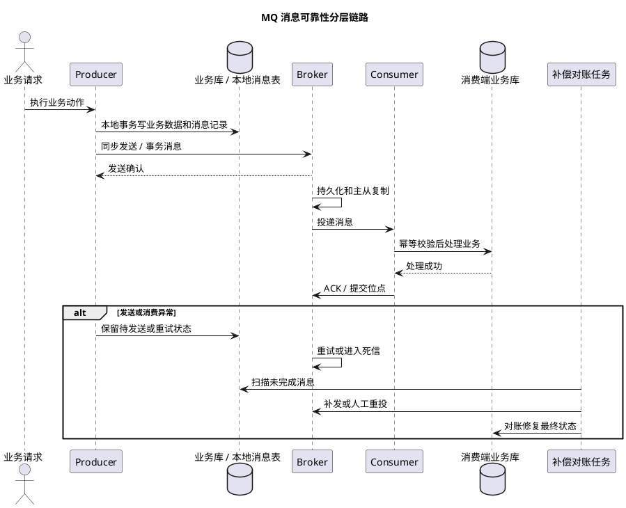
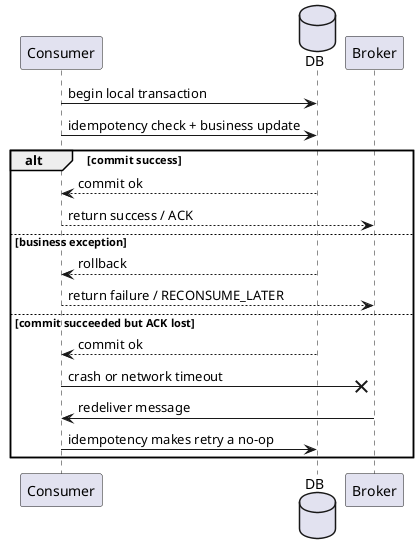
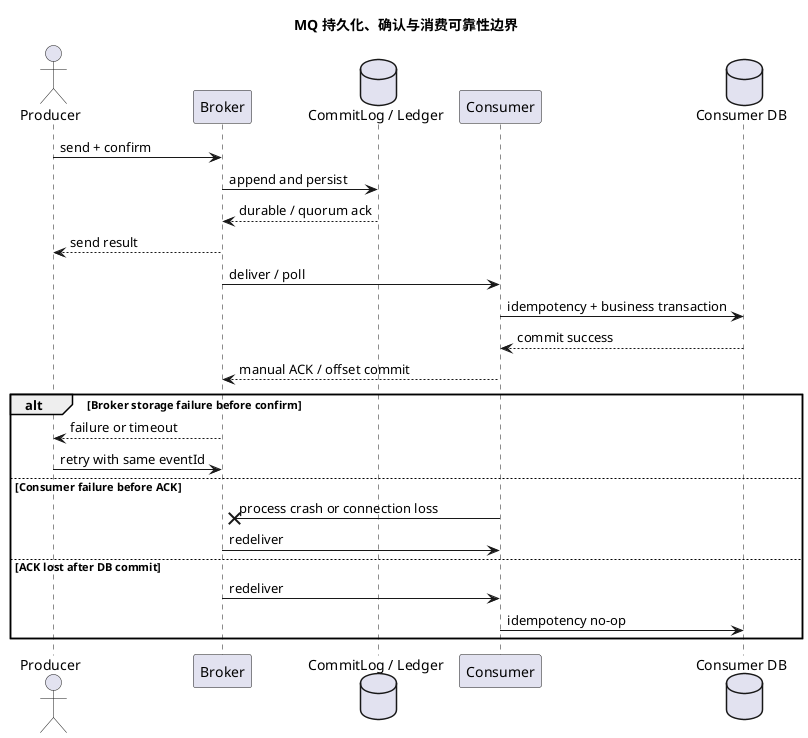

# MQ 消息可靠性

## 问题索引

- Q1：MQ 怎么保证消息不丢失？
- Q2：事务半消息怎么回查事务状态？
- Q3：如果回查一直返回 UNKNOWN，Broker 最终怎么处理？业务侧如何防止半消息长期悬挂？
- Q4：扫描任务多实例部署时，如何避免多个节点同时补发同一条消息？
- Q5：消费者 ACK 之后，本地事务回滚了怎么处理？
- Q6：MQ 刷盘、消息丢失场景和分布式可靠性设计怎么做？

## Q1：MQ 怎么保证消息不丢失？

### 背景

MQ 消息不丢失不能只靠 MQ 自己保证。一次消息从业务系统发出，到最终被消费完成，至少经过四段链路：

1. 生产者本地业务数据写入。
2. 生产者发送消息到 Broker。
3. Broker 持久化和复制消息。
4. 消费者拉取、处理并提交消费位点。

任何一段异常，都可能表现为“消息丢了”：

- 本地事务提交了，但消息没发出去。
- 消息发送了，但 Broker 没落盘。
- Broker 主节点宕机，消息还没同步到从节点。
- 消费者拿到消息后业务处理失败，但位点已经提交。
- 消费者处理成功，但业务状态被重复消息或乱序消息覆盖。

所以面试里回答“MQ 怎么保证消息不丢失”，要按链路分层回答：**生产者可靠投递、Broker 可靠存储、消费者可靠消费、业务兜底对账**。

### 核心原理

MQ 的可靠性目标通常不是“绝对不丢”，而是通过确认、持久化、重试、幂等、对账，把丢失概率压到足够低，并且让异常可发现、可恢复。

可以按下面这张表理解：

| 阶段 | 可能丢失点 | 解决手段 |
| --- | --- | --- |
| 业务库到 MQ | 本地事务成功但发送失败 | 本地消息表、事务消息、Outbox |
| Producer 到 Broker | 网络抖动、发送超时、客户端宕机 | 同步发送、发送确认、失败重试、消息唯一键 |
| Broker 存储 | 未刷盘宕机、主从未同步 | 同步刷盘、主从同步复制、多副本、Broker 高可用 |
| Consumer 消费 | 业务失败但位点提交 | 处理成功后再 ACK、失败重试、死信队列 |
| 业务落库 | 重复、乱序、并发覆盖 | 幂等、状态机、唯一索引、版本号 |
| 兜底恢复 | 长时间不一致 | 对账、补偿任务、告警、人工重投 |

### PlantUML 示意图



### 生产者如何保证不丢

#### 1. 本地事务和发消息之间要有可靠衔接

最容易被忽略的问题是：业务数据写库成功了，但消息还没发出去，应用就宕机了。

错误做法：

```text
1. 插入订单
2. 提交事务
3. 发送 MQ
4. 应用在第 2 步和第 3 步之间宕机
```

这时订单已经存在，但下游永远收不到消息。

常见解决方案：

- **本地消息表**：同一个本地事务里写业务表和消息表，事务提交后再异步发送消息。
- **RocketMQ 事务消息**：先发送半消息，再执行本地事务，最后提交或回滚半消息。
- **Outbox / CDC**：业务事件写入本地库，通过 binlog 监听投递到 MQ。

本地消息表示例：

```sql
CREATE TABLE mq_message (
  id BIGINT PRIMARY KEY,
  biz_key VARCHAR(128) NOT NULL UNIQUE,
  topic VARCHAR(128) NOT NULL,
  body TEXT NOT NULL,
  status TINYINT NOT NULL,
  retry_count INT NOT NULL DEFAULT 0,
  create_time DATETIME NOT NULL,
  update_time DATETIME NOT NULL,
  INDEX idx_status_time(status, update_time)
);
```

```java
@Transactional
public void createOrder(CreateOrderCommand command) {
    // 1. 业务数据和消息记录必须在同一个本地事务内提交，保证二者原子性
    Order order = orderFactory.create(command);
    orderMapper.insert(order);

    // 2. bizKey 用于后续发送重试、消费幂等和人工排查
    MqMessage message = MqMessage.pending(
        order.getOrderNo(),
        "order-created-topic",
        JsonUtils.toJson(new OrderCreatedEvent(order.getOrderNo()))
    );
    mqMessageMapper.insert(message);
}

public void scanAndSendPendingMessages() {
    // 3. 扫描待发送消息，避免应用在事务提交后宕机导致消息永久丢失
    List<MqMessage> messages = mqMessageMapper.selectPendingLimit(100);
    for (MqMessage message : messages) {
        try {
            // 4. 使用同步发送拿到 Broker 确认；发送超时不能直接当成功
            SendResult result = rocketMQTemplate.syncSend(message.getTopic(), message.getBody());
            if (result.getSendStatus() == SendStatus.SEND_OK) {
                mqMessageMapper.markSent(message.getId());
            }
        } catch (Exception ex) {
            // 5. 失败只增加重试次数，不能删除消息；超过阈值后告警人工介入
            mqMessageMapper.increaseRetryCount(message.getId(), ex.getMessage());
        }
    }
}
```

#### 2. 发送端要等待 Broker 确认

如果业务要求消息可靠，不建议使用只管发不管结果的 `oneway`。

推荐：

- 关键业务使用同步发送，拿到 Broker ACK。
- 异步发送必须在回调里处理成功和失败。
- 失败要重试，重试仍失败要落库或告警。
- 每条消息要有业务唯一键，方便查重和补偿。

注意：发送超时不一定代表 Broker 没收到。可能 Broker 已经写入成功，只是响应丢了或晚到了。所以发送端重试后，消费者必须幂等。

### Broker 如何保证不丢

#### 1. 消息持久化

Broker 收到消息后，需要写入磁盘，例如 RocketMQ 写入 CommitLog。只有消息可靠落盘，Broker 宕机后才能恢复。

常见刷盘策略：

- **异步刷盘**：性能好，但 Broker 宕机时可能丢失还在 PageCache 中、没来得及刷盘的消息。
- **同步刷盘**：Broker 等消息刷到磁盘后再返回成功，可靠性更高，但吞吐和延迟会受影响。

如果是订单、支付、库存这类核心业务，更倾向同步刷盘或至少配合主从复制和业务兜底。

#### 2. 主从复制 / 多副本

即使消息已经写入主节点，如果主节点立刻宕机，而消息还没同步到从节点，也可能在故障切换后丢失。

常见策略：

- **异步复制**：性能好，但主节点宕机时可能丢失少量未同步消息。
- **同步复制**：主从都确认后再返回成功，可靠性更高，但延迟更高。
- **多副本机制**：通过多数派确认提高可用性和可靠性。

面试中可以说：Broker 层要通过持久化、刷盘策略、主从复制、多副本和故障切换降低消息丢失风险，但可靠性越高，通常吞吐和延迟成本越高。

### 消费者如何保证不丢

#### 1. 业务处理成功后再 ACK

消费者最典型的丢消息场景是：消息已经被拉取，消费位点已经提交，但业务处理失败或应用宕机。

正确原则：

- 先执行业务逻辑。
- 业务成功落库后再返回消费成功。
- 业务失败要抛异常或返回失败，让 MQ 触发重试。

RocketMQ 中，消费者处理失败后，消息会进入重试 Topic，多次重试失败后进入死信队列。

#### 2. 消费失败要重试和死信

消费端不能静默吞异常。

常见处理：

- 网络超时、下游暂时不可用：允许重试，最好配合退避策略。
- 参数错误、业务规则不满足：重试价值低，应尽快进入死信或异常表。
- 死信消息要告警、入库、支持人工重投。

#### 3. 消费者必须幂等

只要引入重试，就一定可能重复消费。

幂等手段：

- 业务唯一键，例如 `orderNo`、`paymentNo`、`eventId`。
- 数据库唯一索引兜底。
- 消费记录表。
- 状态机校验。
- 乐观锁版本号。
- Redis SETNX 做短期防重，但数据库要兜底。

示例：

```java
@Transactional
public void consume(OrderCreatedEvent event) {
    // 1. eventId 是消息级唯一键，用于识别重复投递
    if (consumeLogMapper.exists(event.getEventId())) {
        return;
    }

    // 2. 业务更新要带状态条件，避免重复消息或乱序消息覆盖新状态
    int updated = orderMapper.updateStatusIfCurrent(
        event.getOrderNo(),
        OrderStatus.CREATED,
        OrderStatus.PAID
    );

    if (updated == 1) {
        // 3. 业务成功后记录消费日志；同一个本地事务提交，保证幂等记录和业务状态一致
        consumeLogMapper.insert(event.getEventId(), event.getOrderNo());
        return;
    }

    // 4. 更新失败时要区分重复、乱序和异常，不能直接吞掉所有问题
    Order order = orderMapper.selectByOrderNo(event.getOrderNo());
    if (order != null && order.getStatus() == OrderStatus.PAID) {
        consumeLogMapper.insertIgnore(event.getEventId(), event.getOrderNo());
        return;
    }

    throw new IllegalStateException("order status is not ready, orderNo=" + event.getOrderNo());
}
```

### 业务兜底如何保证最终不丢

即使 Producer、Broker、Consumer 都做了可靠性设计，也要承认线上总会有极端异常：

- 发送端超时，无法判断 Broker 是否收到。
- 消费端异常进入死信。
- 消息格式升级导致老消息反序列化失败。
- 人工修数据造成状态不一致。
- 第三方系统回调丢失。

所以核心业务要有兜底：

- 本地消息表定时扫描未发送、发送失败、长时间未确认的消息。
- 死信队列监控和人工重投平台。
- 对账任务比对上下游业务状态。
- 异常表记录无法自动修复的数据。
- 告警通知研发或业务人员介入。

例如支付场景：

1. 支付成功回调更新本地支付单。
2. 写本地消息表发送 `PAY_SUCCESS`。
3. 订单服务消费消息推进订单状态。
4. 消费失败进入重试和死信。
5. 对账任务定期比对支付渠道账单和本地订单状态。
6. 发现支付成功但订单未支付，自动补发消息或进入人工处理。

### 面试追问

- Q：MQ 能不能做到绝对不丢消息？
  A：工程上通常不说绝对不丢，而是通过发送确认、持久化、同步刷盘、主从复制、消费 ACK、重试、死信、幂等和对账，把风险降到可接受，并保证异常可恢复。

- Q：生产者发送成功就一定不会丢吗？
  A：不一定。要看 Broker 是否已经持久化、是否同步复制，以及发送成功语义是什么。发送超时也不一定失败，可能 Broker 已经收到但响应丢失，所以消费端必须幂等。

- Q：Broker 异步刷盘有什么风险？
  A：消息可能只在 PageCache 中，还没刷到磁盘。此时 Broker 宕机，可能丢失这部分消息。

- Q：消费者为什么要处理成功后再 ACK？
  A：如果先 ACK 再处理业务，消费者宕机或业务失败后，MQ 会认为消息已消费成功，不再投递，消息就真的丢了。

- Q：为什么有了重试还要死信队列？
  A：有些错误重试也不会恢复，例如参数不兼容、业务规则错误。死信队列可以把长期失败的消息隔离出来，避免无限重试拖垮系统，同时提供告警和人工修复入口。

- Q：为什么消息可靠性一定要配合幂等？
  A：可靠投递通常依赖重试，重试会带来重复消息。没有幂等，解决了“不丢”，又会引入“重复扣减、重复发货、重复通知”等更严重问题。

### 复习清单

- [ ] 能按 Producer、Broker、Consumer、业务兜底四段解释消息可靠性。
- [ ] 能说明本地事务和发消息之间为什么会丢消息。
- [ ] 能讲清本地消息表、事务消息、Outbox 分别解决什么问题。
- [ ] 能说明同步刷盘、异步刷盘、同步复制、异步复制的取舍。
- [ ] 能回答为什么消费成功后再 ACK。
- [ ] 能说明重试为什么必须配合幂等。
- [ ] 能结合死信队列、告警、对账解释最终兜底。

## Q2：事务半消息怎么回查事务状态？

### 背景

RocketMQ 事务消息用于解决“本地事务”和“发送消息”之间的一致性问题。

正常流程是：

```text
1. Producer 发送半消息到 Broker
2. Broker 保存半消息成功，但暂时不投递给 Consumer
3. Producer 执行本地事务
4. Producer 根据本地事务结果提交或回滚半消息
5. Broker 收到 COMMIT 后才让 Consumer 可见，收到 ROLLBACK 则丢弃半消息
```

问题在于第 4 步可能失败，例如：

- Producer 执行本地事务成功，但发送 `COMMIT` 请求时网络超时。
- Producer 执行本地事务成功后宕机，还没来得及通知 Broker。
- Broker 收到了半消息，但长时间没有收到 `COMMIT` 或 `ROLLBACK`。

此时 Broker 不知道这条半消息到底该投递还是丢弃，就会主动向 Producer 发起事务状态回查。

### 核心原理

事务回查的关键点是：**Broker 回查时，Producer 不能重新执行业务，只能根据业务唯一键查询本地事务最终状态**。

回查一般依赖消息里的业务唯一键，例如：

- `orderNo`
- `paymentNo`
- `bizKey`
- `transactionId`

Producer 在本地事务中必须落一条可查询的业务记录或事务日志。Broker 回查时，Producer 根据这个唯一键查本地库，然后返回三种结果：

| 回查结果 | 含义 | Broker 处理 |
| --- | --- | --- |
| `COMMIT` | 本地事务已成功提交 | 提交半消息，消息对 Consumer 可见 |
| `ROLLBACK` | 本地事务明确失败或已回滚 | 回滚半消息，Consumer 不可见 |
| `UNKNOWN` | 当前还不能确定事务结果 | Broker 稍后继续回查，超过阈值后按失败或丢弃策略处理 |

注意：`UNKNOWN` 不是“失败”，而是“暂时无法确认”。比如本地事务正在执行、数据库短暂不可用、事务记录还没查到但也不能确认失败。

### 业务场景

以创建订单后发送 `OrderCreatedEvent` 为例：

1. 发送半消息，消息体里带 `orderNo`。
2. 执行本地事务：创建订单、写订单状态、写本地事务日志。
3. 本地事务成功，Producer 返回 `COMMIT`。
4. 如果第 3 步结果没有通知到 Broker，Broker 稍后回查。
5. 回查方法根据 `orderNo` 查询订单表或事务日志。
6. 订单存在且状态有效，返回 `COMMIT`。
7. 订单不存在且事务日志标记失败，返回 `ROLLBACK`。
8. 数据库异常或状态不确定，返回 `UNKNOWN`，等待下次回查。

### 解决方案

#### 1. 本地事务执行时要写可回查记录

如果只写业务表，有时很难区分“业务确实失败”和“查询条件不完整”。更稳的做法是写一张事务日志表。

```sql
CREATE TABLE transaction_log (
  transaction_id VARCHAR(64) PRIMARY KEY,
  biz_key VARCHAR(128) NOT NULL UNIQUE,
  biz_type VARCHAR(64) NOT NULL,
  status VARCHAR(32) NOT NULL,
  create_time DATETIME NOT NULL,
  update_time DATETIME NOT NULL
);
```

状态可以设计为：

- `PROCESSING`：本地事务处理中。
- `COMMITTED`：本地事务已提交。
- `ROLLBACKED`：本地事务已失败或回滚。

#### 2. 执行本地事务

```java
public LocalTransactionState executeLocalTransaction(Message message, Object arg) {
    String orderNo = message.getProperty("orderNo");
    String transactionId = message.getProperty("transactionId");

    try {
        // 1. 本地事务里同时写业务表和事务日志，保证回查时能根据 transactionId 找到最终状态
        orderService.createOrderInTransaction(orderNo, transactionId);

        // 2. 返回 COMMIT 后，Broker 会提交半消息，让消费者可见
        return LocalTransactionState.COMMIT_MESSAGE;
    } catch (BizException ex) {
        // 3. 明确的业务失败可以返回 ROLLBACK，Broker 会丢弃半消息
        transactionLogService.markRollback(transactionId, ex.getMessage());
        return LocalTransactionState.ROLLBACK_MESSAGE;
    } catch (Exception ex) {
        // 4. 系统异常时不要草率回滚消息，因为本地事务可能已经提交但响应丢失
        // 返回 UNKNOWN，让 Broker 后续回查本地事务日志
        return LocalTransactionState.UNKNOW;
    }
}
```

#### 3. 回查事务状态

```java
public LocalTransactionState checkLocalTransaction(MessageExt message) {
    String transactionId = message.getProperty("transactionId");
    String orderNo = message.getProperty("orderNo");

    try {
        // 1. 回查只做查询，不重新创建订单、不重新扣库存、不重新执行业务动作
        TransactionLog log = transactionLogMapper.selectByTransactionId(transactionId);

        if (log == null) {
            // 2. 查不到日志不一定代表失败，可能是本地事务还没写完或数据库短暂异常后的间隙
            // 为避免误删半消息，先返回 UNKNOWN，等待下一次回查或兜底任务处理
            return LocalTransactionState.UNKNOW;
        }

        if ("COMMITTED".equals(log.getStatus())) {
            // 3. 本地事务已经提交，通知 Broker 提交半消息
            return LocalTransactionState.COMMIT_MESSAGE;
        }

        if ("ROLLBACKED".equals(log.getStatus())) {
            // 4. 本地事务明确失败，通知 Broker 回滚半消息
            return LocalTransactionState.ROLLBACK_MESSAGE;
        }

        if ("PROCESSING".equals(log.getStatus())) {
            // 5. 本地事务仍在处理中，不能提交也不能回滚，继续等待回查
            return LocalTransactionState.UNKNOW;
        }

        // 6. 未识别状态要保守处理，避免错误回滚一条实际已经成功的业务消息
        return LocalTransactionState.UNKNOW;
    } catch (Exception ex) {
        // 7. 数据库查询异常时返回 UNKNOWN，避免因为短暂故障导致 Broker 回滚消息
        return LocalTransactionState.UNKNOW;
    }
}
```

### 踩坑点

#### 1. 回查不能重新执行业务

回查方法可能被 Broker 调用多次。如果在回查里重新创建订单、重新扣库存、重新调用第三方接口，就会引发重复下单、重复扣减、重复通知。

回查只能查本地最终状态，然后返回 `COMMIT`、`ROLLBACK` 或 `UNKNOWN`。

#### 2. 查不到记录不要立即 ROLLBACK

查不到事务日志可能有几种原因：

- 本地事务还没执行到写日志。
- 数据库短暂不可用。
- Producer 正在重启。
- 日志写入失败但业务表写入成功。

如果直接返回 `ROLLBACK`，可能会把本来应该投递的消息回滚掉。更稳的策略是先返回 `UNKNOWN`，结合最大回查次数、异常表和人工告警兜底。

#### 3. 本地事务日志要和业务数据同事务提交

如果业务表提交成功，但事务日志没提交，回查时就可能误判。因此事务日志最好和业务表在同一个本地事务内写入。

#### 4. 回查接口要轻量、幂等、可观测

回查是 Broker 的补偿机制，不应该写复杂业务逻辑。

建议：

- 只查本地库或事务日志。
- 增加回查次数、返回状态、异常原因日志。
- 对长期 `UNKNOWN` 的事务做告警。
- 定时任务扫描事务日志和消息状态，做最终兜底。

### 面试追问

- Q：半消息为什么消费者不可见？
  A：因为 Broker 还不知道本地事务最终结果。只有 Producer 提交事务消息后，半消息才会转为可投递消息；如果回滚，Consumer 永远看不到。

- Q：Broker 什么情况下发起回查？
  A：Broker 保存半消息后，长时间没有收到 Producer 的 `COMMIT` 或 `ROLLBACK`，或者提交/回滚请求丢失，就会定时向 Producer 回查本地事务状态。

- Q：回查时查什么？
  A：查本地事务最终状态，通常根据 `transactionId`、`orderNo`、`bizKey` 查事务日志表或业务主表。回查不能重新执行业务。

- Q：什么时候返回 `UNKNOWN`？
  A：本地事务还在处理中、事务日志暂时查不到、数据库短暂异常、状态无法确认时返回 `UNKNOWN`，让 Broker 后续继续回查。

- Q：为什么不能查不到记录就回滚？
  A：因为查不到可能是短暂不可见或日志异常，并不一定代表本地事务失败。直接回滚可能导致业务已成功但消息被丢弃。

- Q：事务消息是否还需要消费者幂等？
  A：需要。事务消息主要解决生产端本地事务和消息投递的一致性，不解决消费端重复消费、消费失败重试和业务并发更新问题。

### 复习清单

- [ ] 能讲清半消息、提交、回滚、回查的完整流程。
- [ ] 能说明回查查的是本地事务最终状态，不是重新执行业务。
- [ ] 能区分 `COMMIT`、`ROLLBACK`、`UNKNOWN`。
- [ ] 能说明为什么查不到事务日志不能立刻回滚。
- [ ] 能设计事务日志表支持回查。
- [ ] 能回答事务消息为什么仍然需要消费端幂等和业务对账。

## Q3：如果回查一直返回 UNKNOWN，Broker 最终怎么处理？业务侧如何防止半消息长期悬挂？

### 背景

`UNKNOWN` 的语义是“当前还不能判断本地事务最终结果”。它适合处理短暂不确定场景，例如数据库抖动、Producer 重启、本地事务仍在执行。

但如果回查一直返回 `UNKNOWN`，半消息就会长期停留在 Broker 的事务消息流程里，Consumer 看不到，业务状态也无法继续向下游推进。

所以这里要分两层看：

- **Broker 层**：不会无限期相信 `UNKNOWN`，会按配置做有限次数回查。
- **业务层**：不能等 Broker 替你兜底，必须用事务日志扫描任务把不确定状态推进到明确终态。

### Broker 最终会怎么处理

RocketMQ Broker 保存半消息后，如果长时间没有收到 Producer 的 `COMMIT` 或 `ROLLBACK`，会定时发起事务回查。

常见配置包括：

- `transactionTimeOut`：半消息超过多久未确认后开始回查。
- `transactionCheckInterval`：Broker 扫描并触发回查的间隔。
- `transactionCheckMax`：最大回查次数，常见默认值是 15 次，具体以当前 RocketMQ 版本和 Broker 配置为准。

如果 Producer 每次都返回 `UNKNOWN`，Broker 会继续回查；当超过最大回查次数后，Broker 通常会丢弃这条半消息并打印错误日志，消息不会投递给 Consumer。

注意：这里的“丢弃”不是业务事务回滚，也不是帮业务做补偿。它只是 Broker 侧认为这条半消息无法再确认，最终不再投递。因此业务侧不能把“Broker 最大回查次数”当成可靠兜底。

### 为什么业务侧必须处理

一直 `UNKNOWN` 可能对应几种情况：

| 本地真实状态 | 回查一直 UNKNOWN 的原因 | 风险 |
| --- | --- | --- |
| 本地事务已成功 | 事务日志状态没更新、回查逻辑异常、数据库查询失败 | Broker 最终丢弃半消息，下游永远收不到 |
| 本地事务已失败 | 回查逻辑一直查不到明确失败状态 | 半消息长期占用检查流程 |
| 本地事务卡在处理中 | 线程卡死、DB 锁等待、应用重启中断 | 业务主流程悬挂 |
| 状态不一致 | 业务表成功但事务日志缺失 | 回查无法判断，可能误丢消息 |

其中最危险的是：**本地业务已经提交成功，但 Broker 因多次 UNKNOWN 最终丢弃半消息**。这会导致生产端业务成功，下游没有消息，最终一致链路断掉。

### 事务日志表设计

事务日志不要只记录 `COMMITTED` 和 `ROLLBACKED`，还要支持扫描、告警和补偿。

```sql
CREATE TABLE transaction_log (
  transaction_id VARCHAR(64) PRIMARY KEY,
  biz_key VARCHAR(128) NOT NULL UNIQUE,
  biz_type VARCHAR(64) NOT NULL,
  status VARCHAR(32) NOT NULL,
  check_count INT NOT NULL DEFAULT 0,
  compensate_count INT NOT NULL DEFAULT 0,
  last_check_time DATETIME NULL,
  last_error VARCHAR(512) NULL,
  create_time DATETIME NOT NULL,
  update_time DATETIME NOT NULL,
  INDEX idx_status_time(status, update_time)
);
```

常见状态：

- `PROCESSING`：本地事务开始执行，但还没确认最终结果。
- `COMMITTED`：本地事务已提交，半消息应该提交。
- `ROLLBACKED`：本地事务已失败，半消息应该回滚。
- `UNKNOWN_TIMEOUT`：长时间无法确认，需要告警或人工处理。
- `COMPENSATED`：已经通过补偿消息或人工操作修复。

### 回查方法如何配合事务日志

回查方法本身仍然只做轻量查询。

```java
public LocalTransactionState checkLocalTransaction(MessageExt message) {
    String transactionId = message.getProperty("transactionId");

    TransactionLog log = transactionLogMapper.selectByTransactionId(transactionId);
    if (log == null) {
        // 查不到日志时先返回 UNKNOWN，避免把可能已成功的业务消息误回滚
        return LocalTransactionState.UNKNOW;
    }

    if ("COMMITTED".equals(log.getStatus())) {
        // 事务日志已经被业务事务或扫描任务修正为成功，Broker 可以提交半消息
        return LocalTransactionState.COMMIT_MESSAGE;
    }

    if ("ROLLBACKED".equals(log.getStatus())) {
        // 明确失败才返回回滚，避免误伤已成功的业务
        return LocalTransactionState.ROLLBACK_MESSAGE;
    }

    // PROCESSING、UNKNOWN_TIMEOUT 等状态都不能直接提交或回滚
    return LocalTransactionState.UNKNOW;
}
```

### 扫描任务如何防止长期悬挂

扫描任务的目标不是“替 Broker 回查”，而是把本地不确定事务推进成明确状态，让后续回查能返回 `COMMIT` 或 `ROLLBACK`。如果 Broker 半消息已经过期或被丢弃，扫描任务还要能补发普通业务消息。

核心流程：

1. 定时扫描 `PROCESSING` 且更新时间超过阈值的事务日志。
2. 根据 `biz_key` 查询业务主表，判断本地事务真实结果。
3. 如果业务主表已成功，更新事务日志为 `COMMITTED`。
4. 如果能确认业务失败，更新事务日志为 `ROLLBACKED`。
5. 如果仍然无法确认，增加 `check_count`，超过阈值标记 `UNKNOWN_TIMEOUT` 并告警。
6. 对 `COMMITTED` 但下游长期未收到的场景，补发普通消息或写本地消息表等待投递。

示例：

```java
public void scanHangingTransactions() {
    // 1. 扫描长时间停留在 PROCESSING 的事务，避免半消息一直依赖 Broker 回查
    List<TransactionLog> logs = transactionLogMapper.selectHanging(
        "PROCESSING",
        LocalDateTime.now().minusMinutes(5),
        100
    );

    for (TransactionLog log : logs) {
        try {
            repairOneTransaction(log);
        } catch (Exception ex) {
            // 2. 扫描任务异常不能吞掉，要记录错误并累计次数，方便告警和人工介入
            transactionLogMapper.recordScanError(log.getTransactionId(), ex.getMessage());
        }
    }
}

@Transactional
public void repairOneTransaction(TransactionLog log) {
    // 3. 用业务唯一键查询主业务结果，不能重新执行业务动作
    Order order = orderMapper.selectByOrderNo(log.getBizKey());

    if (order != null && order.isCreatedSuccess()) {
        // 4. 业务已经成功，先把事务日志修正为 COMMITTED
        transactionLogMapper.markCommitted(log.getTransactionId());

        // 5. 如果担心 Broker 半消息已超过最大回查次数被丢弃，可以写本地消息表补发普通消息
        // 消费端必须依赖 eventId/orderNo 做幂等，避免半消息后来又提交导致重复消费
        localMessageMapper.insertIgnore(
            log.getBizKey(),
            "order-created-topic",
            JsonUtils.toJson(new OrderCreatedEvent(log.getBizKey()))
        );
        return;
    }

    if (canConfirmBusinessRollback(log)) {
        // 6. 只有能明确判断本地业务失败时，才标记 ROLLBACKED
        transactionLogMapper.markRollbacked(log.getTransactionId(), "business rollback confirmed");
        return;
    }

    // 7. 仍无法确认时，累计次数；超过阈值进入 UNKNOWN_TIMEOUT 并触发告警
    int count = transactionLogMapper.increaseCheckCount(log.getTransactionId());
    if (count >= 10) {
        transactionLogMapper.markUnknownTimeout(log.getTransactionId());
        alarmService.alertTransactionUnknown(log.getTransactionId(), log.getBizKey());
    }
}
```

### 补发消息会不会重复

会有重复可能。

例如扫描任务判断本地事务成功，于是补发了一条普通消息；但 Broker 后续某次回查又拿到 `COMMIT`，半消息也被投递了。下游就会收到两条语义相同的消息。

这不是坏事，而是可靠消息常见取舍：**宁可重复，不可丢失；重复由消费端幂等解决**。

因此补发消息必须满足：

- 消息携带同一个 `eventId` 或同一个业务唯一键。
- 消费端有消费日志表或业务唯一索引。
- 业务状态机禁止重复推进。
- 补发消息和原事务消息语义一致。

### 踩坑点

#### 1. 不要让 UNKNOWN 无限持续

`UNKNOWN` 只能作为短期不确定状态，不能成为长期业务状态。长期 `UNKNOWN` 必须告警，否则问题会藏在 Broker 回查机制里，直到半消息被丢弃才暴露。

#### 2. 不要指望 Broker 帮业务补偿

Broker 最多决定半消息是否继续回查、提交、回滚或丢弃。它不知道订单、库存、支付这些业务语义，也不会帮你重新发送业务事件。

#### 3. 补偿消息必须幂等

只要补发消息，就要默认可能和原事务消息重复。消费端没有幂等，补偿就会从“防丢”变成“重复扣减”。

#### 4. 扫描任务要防并发重复处理

如果多个实例同时扫描同一条 `PROCESSING` 事务，可能重复补发消息。可以用以下方式控制：

- DB 乐观锁：`WHERE status = 'PROCESSING' AND version = ?`。
- 分布式锁：按 `transactionId` 或 `bizKey` 加锁。
- 分片扫描：不同实例扫描不同 hash 段。
- 本地消息表唯一键：`biz_key` 唯一索引兜底。

### 面试追问

- Q：一直返回 UNKNOWN，Broker 会无限回查吗？
  A：不会。Broker 会按配置的最大回查次数处理，超过后通常丢弃半消息并记录错误日志，消息不会投递给 Consumer。

- Q：Broker 丢弃半消息是否等于本地事务回滚？
  A：不是。Broker 只处理消息可见性，不会回滚业务数据库。如果本地事务已经提交，但半消息最终被丢弃，就需要业务侧扫描和补偿。

- Q：业务侧怎么防止长期 UNKNOWN？
  A：用事务日志表记录本地事务状态，定时扫描长时间 `PROCESSING` 的事务，根据业务主表判断真实结果，修正为 `COMMITTED` 或 `ROLLBACKED`；无法判断则标记 `UNKNOWN_TIMEOUT` 并告警。

- Q：如果本地事务成功，但 Broker 半消息已经被丢弃怎么办？
  A：业务侧通过本地消息表或补偿任务补发一条普通业务消息。消费端用业务唯一键、消费日志和状态机保证幂等。

- Q：补发消息和原半消息都投递了怎么办？
  A：允许重复投递，但消费端必须幂等。可靠消息的基本取舍是至少一次投递，业务侧负责去重。

### 复习清单

- [ ] 能说明 Broker 不会无限回查 UNKNOWN。
- [ ] 能区分 Broker 丢弃半消息和业务事务回滚。
- [ ] 能设计事务日志扫描任务把 PROCESSING 推进到 COMMITTED 或 ROLLBACKED。
- [ ] 能说明本地事务成功但半消息丢弃时如何补发普通消息。
- [ ] 能回答补发消息为什么一定要配合消费端幂等。

## Q4：扫描任务多实例部署时，如何避免多个节点同时补发同一条消息？

### 背景

事务日志扫描任务通常会部署在多个应用实例上。这样做能提高可用性：某个实例挂了，其他实例还能继续扫描。但它也会带来并发问题：

```text
实例 A 扫到 transaction_id = T1
实例 B 也扫到 transaction_id = T1
A 判断本地事务已成功，补发消息
B 也判断本地事务已成功，再补发一次消息
```

如果消费端幂等做得好，重复补发不一定造成业务错误；但大量重复补发会增加 MQ 压力、消费压力和排查成本。所以扫描任务要尽量做到：**少抢同一批数据，抢到了才执行，执行落库要幂等，最终靠唯一键兜底**。

### 核心原则

不要只依赖一种手段。更稳的设计是四层防线：

| 层级 | 目标 | 常用手段 |
| --- | --- | --- |
| 分片扫描 | 减少多个实例扫到同一批数据 | 按 `hash(biz_key)`、实例编号、时间窗口分片 |
| 任务抢占 | 保证同一条记录只有一个实例处理 | DB 乐观锁、状态 CAS、`SELECT FOR UPDATE SKIP LOCKED` |
| 执行保护 | 防止复杂补偿逻辑并发执行 | Redisson 分布式锁 |
| 结果兜底 | 即使并发执行，也只能落一条消息 | 本地消息表唯一键、消费端幂等 |

推荐优先级：

1. **本地消息表唯一键必须有**，这是最后防线。
2. **DB 乐观锁 / 状态抢占优先用**，简单、可靠、和事务日志天然在同一个数据库里。
3. **分片扫描用于降低竞争**，适合任务量大、多实例部署。
4. **Redisson 用于跨库、跨资源、重补偿逻辑**，不要把它当成唯一一致性保障。

### 方案一：DB 状态抢占

给事务日志增加 `version`、`locked_by`、`locked_until` 等字段。

```sql
ALTER TABLE transaction_log
  ADD COLUMN version BIGINT NOT NULL DEFAULT 0,
  ADD COLUMN locked_by VARCHAR(64) NULL,
  ADD COLUMN locked_until DATETIME NULL;
```

扫描时先查候选记录，再用条件更新“抢占”。

```sql
UPDATE transaction_log
SET status = 'SCANNING',
    locked_by = #{instanceId},
    locked_until = DATE_ADD(NOW(), INTERVAL 2 MINUTE),
    version = version + 1,
    update_time = NOW()
WHERE transaction_id = #{transactionId}
  AND status = 'PROCESSING'
  AND version = #{version};
```

判断规则：

- 更新行数为 `1`：当前实例抢占成功，可以继续处理。
- 更新行数为 `0`：说明别的实例已经抢到或状态已变化，当前实例直接跳过。

Java 伪代码：

```java
public void scanHangingTransactions(String instanceId) {
    // 1. 先查候选记录。这里查出来不代表已经拥有处理权，只是发现可能需要处理。
    List<TransactionLog> candidates = transactionLogMapper.selectHanging("PROCESSING", 100);

    for (TransactionLog log : candidates) {
        // 2. 用 status + version 做 CAS 抢占，避免多个实例同时处理同一条事务。
        boolean acquired = transactionLogMapper.tryAcquire(
            log.getTransactionId(),
            log.getVersion(),
            instanceId,
            LocalDateTime.now().plusMinutes(2)
        );

        if (!acquired) {
            // 3. 抢占失败说明别的实例已经处理或状态已改变，不能继续补发。
            continue;
        }

        try {
            repairOneTransaction(log.getTransactionId(), instanceId);
        } catch (Exception ex) {
            // 4. 处理失败要释放或延长锁状态，并记录错误，避免记录永久卡在 SCANNING。
            transactionLogMapper.markScanFailed(log.getTransactionId(), ex.getMessage());
        }
    }
}
```

这个方案的优点是简单、可审计、和数据库事务天然结合；缺点是高并发扫描时 DB 更新竞争会增加。

### 方案二：本地消息表唯一键兜底

即使两个实例都执行到补发阶段，本地消息表也必须用唯一键拦住重复消息。

```sql
CREATE TABLE local_message (
  id BIGINT PRIMARY KEY,
  event_id VARCHAR(128) NOT NULL UNIQUE,
  biz_key VARCHAR(128) NOT NULL,
  topic VARCHAR(128) NOT NULL,
  body TEXT NOT NULL,
  status VARCHAR(32) NOT NULL,
  create_time DATETIME NOT NULL,
  update_time DATETIME NOT NULL,
  UNIQUE KEY uk_biz_topic(biz_key, topic)
);
```

补发时使用 `insertIgnore` 或捕获唯一键冲突。

```java
@Transactional
public void compensateCommittedTransaction(TransactionLog log) {
    // 1. eventId 保持稳定，保证重复补偿时落到同一条唯一键上。
    String eventId = "order-created:" + log.getBizKey();

    // 2. insertIgnore 让并发补发变成“只有一个成功插入，其余自然忽略”。
    int inserted = localMessageMapper.insertIgnore(
        eventId,
        log.getBizKey(),
        "order-created-topic",
        JsonUtils.toJson(new OrderCreatedEvent(log.getBizKey()))
    );

    if (inserted == 1) {
        // 3. 只有真正插入成功的实例负责后续投递，避免重复发送。
        transactionLogMapper.markCompensated(log.getTransactionId());
    }
}
```

这层是兜底，不应该省。因为 DB 抢占、Redisson 锁、分片扫描都可能因为超时、重启、网络抖动出现边界情况，唯一键是最可靠的落库防线。

### 方案三：Redisson 分布式锁

当补偿逻辑比较重，或者涉及多个资源时，可以按 `transactionId` 或 `bizKey` 加分布式锁。

```java
public void repairWithRedisson(TransactionLog log) {
    String lockKey = "tx-compensate:" + log.getTransactionId();
    RLock lock = redissonClient.getLock(lockKey);

    boolean locked = false;
    try {
        // 1. waitTime 控制最多等多久，避免扫描线程大量阻塞。
        // 2. leaseTime 要覆盖一次补偿的最长耗时，避免锁过早释放导致并发执行。
        locked = lock.tryLock(1, 30, TimeUnit.SECONDS);
        if (!locked) {
            return;
        }

        // 3. 拿到锁后仍然要查一次最新状态，防止锁等待期间事务已被其他实例处理。
        TransactionLog latest = transactionLogMapper.selectByTransactionId(log.getTransactionId());
        if (!"PROCESSING".equals(latest.getStatus()) && !"UNKNOWN_TIMEOUT".equals(latest.getStatus())) {
            return;
        }

        repairOneTransaction(latest.getTransactionId(), getCurrentInstanceId());
    } catch (InterruptedException ex) {
        // 4. 线程被中断时要恢复中断标记，避免上层线程池无法感知中断。
        Thread.currentThread().interrupt();
    } finally {
        // 5. 只释放当前线程持有的锁，避免误释放别的线程续期后的锁。
        if (locked && lock.isHeldByCurrentThread()) {
            lock.unlock();
        }
    }
}
```

Redisson 的优点是实现方便，适合跨实例互斥；缺点是引入 Redis 依赖，Redis 抖动时可能影响扫描任务。它适合做执行保护，但不应替代 DB 状态和唯一键。

### 方案四：分片扫描

分片扫描的目标是减少多个实例扫同一批数据。

常见方式：

- 按实例编号分片：`hash(biz_key) % total_shards = shard_index`。
- 按时间窗口分片：不同实例扫描不同创建时间段。
- 使用调度平台分片参数，例如 XXL-JOB 的 shard index / shard total。

SQL 示例：

```sql
SELECT *
FROM transaction_log
WHERE status = 'PROCESSING'
  AND update_time < #{timeout}
  AND MOD(CRC32(biz_key), #{totalShards}) = #{shardIndex}
ORDER BY update_time ASC
LIMIT 100;
```

分片扫描能降低竞争，但不能作为唯一防线。因为实例扩缩容、分片参数变化、任务重跑都可能让同一条数据被不同实例扫到，所以仍然需要 DB 抢占和唯一键。

### 推荐落地组合

核心业务推荐组合：

```text
分片扫描减少竞争
        ↓
DB 乐观锁抢占 transaction_log
        ↓
按 bizKey / transactionId 加 Redisson 锁，保护重补偿逻辑
        ↓
写 local_message，依赖 eventId / bizKey 唯一索引兜底
        ↓
消费者用消费日志 + 状态机保证最终幂等
```

如果系统规模不大，可以先用：

```text
DB 乐观锁抢占 + 本地消息表唯一键 + 消费端幂等
```

如果补偿逻辑跨多个外部系统，或者补偿期间会做较重的查询和状态判断，再加 Redisson。

### 踩坑点

#### 1. 分布式锁不是最终一致性的唯一保障

锁可能因为超时、续期失败、Redis 抖动、应用 Full GC 等原因失效。所以补发消息仍然要依赖本地消息表唯一键和消费端幂等兜底。

#### 2. leaseTime 不能乱设

`leaseTime` 太短，补偿还没执行完锁就释放；太长，实例宕机后其他实例要等很久才能接手。可以结合 Redisson watchdog 自动续期，但仍要设置业务超时和告警。

#### 3. 抢占后要有超时释放

如果实例抢占后宕机，记录可能停留在 `SCANNING`。需要 `locked_until`，让其他实例能在超时后重新抢占。

#### 4. 先查再处理不是并发安全

多个实例都能查到同一条记录，所以“查到了就处理”不安全。必须有条件更新抢占，或者使用数据库行锁机制。

### 面试追问

- Q：多实例扫描如何避免重复补发？
  A：优先用分片扫描减少竞争，再用 DB 乐观锁或状态 CAS 抢占处理权，补发落本地消息表时用唯一键兜底，消费端再做幂等。

- Q：Redisson 分布式锁能不能替代 DB 唯一键？
  A：不能。分布式锁是执行期互斥，唯一键是结果兜底。锁可能失效或超时，唯一键能保证最终只落一条补发消息。

- Q：为什么还需要消费者幂等？
  A：即使补发侧尽量去重，原半消息和补偿消息仍可能都投递成功。MQ 可靠性通常是至少一次投递，最终去重必须在消费者业务侧完成。

- Q：DB 乐观锁怎么抢占？
  A：用 `UPDATE ... WHERE status = 'PROCESSING' AND version = ?`。更新成功才有处理权，更新失败说明状态已被其他实例改变。

- Q：分片扫描有什么风险？
  A：分片只能减少碰撞，不能保证互斥。实例扩缩容、任务重跑、分片参数变化都可能产生重复扫描，所以还要配合抢占和唯一键。

### 复习清单

- [ ] 能说明多实例扫描为什么会重复补发。
- [ ] 能讲清分片扫描、DB 乐观锁、Redisson、本地消息表唯一键各自解决的问题。
- [ ] 能写出 `status + version` 的 DB 抢占 SQL。
- [ ] 能解释为什么 Redisson 不能替代唯一键。
- [ ] 能说明补发消息最终仍依赖消费端幂等和状态机。

## Q5：消费者 ACK 之后，本地事务回滚了怎么处理？

### 先给结论

MQ 的 ACK/提交位点和业务数据库的本地事务通常不是同一个事务，不能自动原子提交。正确顺序必须是：

```text
收到消息
    -> 开启本地事务
    -> 幂等判断 + 业务数据更新
    -> 本地事务提交成功
    -> 返回消费成功 / ACK / 提交消费位点
```

如果 ACK 已经被 Broker 接受，之后数据库事务又回滚，Broker 不会因为数据库回滚而自动撤销 ACK，也不会自动把消息恢复到原位置。这是一个已经设计错误或事务集成失效的异常窗口，不能靠 MQ 重试机制补救。

### 两个故障窗口

| 时序 | 结果 | 正确处理 |
| --- | --- | --- |
| ACK 先成功，数据库后回滚 | 消费位点前进，但业务变更不存在，可能形成消息逻辑丢失 | 不能撤销 ACK；依赖事件审计、生产端 Outbox、业务对账和按 `eventId` 重放修复 |
| 数据库先提交，ACK 超时或进程宕机 | 消息会再次投递，业务可能重复执行 | 消费端用唯一键、消费日志、状态机或版本号幂等 |
| 数据库回滚，未发送 ACK | Broker 认为消费失败，按策略重新投递 | 返回失败或 `RECONSUME_LATER`，让 Broker 负责重试 |
| 事务执行中进程宕机 | 数据库事务通常回滚，ACK 未完成 | 等待可见性/重试时间后重新投递，仍需要幂等 |



### 正确的消费实现

消费代码应该让“本地事务完成”成为返回消费成功的前置条件。下面是与具体 MQ 客户端无关的 Java 伪代码：

```java
public ConsumeResult consume(MessageExt message) {
    try {
        transactionTemplate.executeWithoutResult(status -> {
            String eventId = message.getProperty("eventId"); // 稳定业务事件 ID，重复投递必须保持不变

            // 消费日志和业务更新放在同一个本地事务中，唯一键负责拦截已成功处理的事件。
            if (!consumeLogRepository.insertIfAbsent(eventId)) {
                return; // 已处理过的重复消息直接视为空操作，但仍要正常返回成功
            }

            orderService.applyEvent(message); // 业务异常要抛出，让事务回滚，而不是吞掉后 ACK
            consumeLogRepository.markSuccess(eventId);
        }); // execute 返回时本地事务已经提交；提交异常会以异常形式抛出

        return ConsumeResult.SUCCESS; // 监听器返回成功后，容器再发送 ACK 或提交消费位点
    } catch (Exception ex) {
        return ConsumeResult.RETRY_LATER; // 失败时不要 ACK，让 MQ 按重试策略再次投递
    }
}
```

实际使用 Spring 时要注意事务代理边界：

- `@Transactional` 方法必须经过 Spring 代理调用，不能依赖同类自调用开启事务。
- 不要在事务方法体内手动 ACK，再等待方法返回后由框架提交数据库事务。
- 要确认监听容器是在事务提交成功后才把成功结果转换为 ACK；如果框架没有提供事务感知能力，可以用 `TransactionTemplate` 显式包住数据库操作，并在它正常返回后再返回消费成功。
- `afterCommit` 适合触发提交后的通知或刷新状态，但不能把“ACK 已发送”误认为数据库和 MQ 已经形成分布式原子事务。

### 如果已经 ACK，后来才发现本地事务回滚

先接受一个事实：**ACK 没有通用的回滚接口**。处理方式是走业务修复，而不是期待 Broker 自动重投：

1. 通过日志、链路追踪和事务监控确认 `eventId`、消费组、ACK 时间和数据库回滚原因。
2. 从生产端 Outbox、本地消息表或业务源表确认该事件是否仍然存在。若存在，按原 `eventId` 生成修复/重放消息。
3. 消费端必须用唯一索引或状态机幂等。修复消息和可能已经成功的历史投递使用同一个业务事件 ID，避免把修复变成重复扣减。
4. RocketMQ 的消费位点重置或按时间重放只能作为受控的应急手段，因为它可能重复该位点之后的一批正常消息；重放前要评估范围、暂停并发、做好审计。
5. 如果 ACK 前后没有业务事件审计或 Outbox，系统可能无法知道哪些消息落入了“ACK 成功、业务回滚”的窗口，这正是必须在设计阶段消除该顺序错误的原因。

### 外部副作用怎么办

数据库事务回滚只能回滚同一数据库事务内的 SQL，不能撤销已经发出的 HTTP、短信、Redis 写入或第三方扣款。消费处理应优先把业务状态和待发送的后续动作写入本地 Outbox，再由独立投递器执行外部调用；外部接口还要传递幂等键，并设计查询、补偿或对账接口。

### 踩坑点

- 把“监听器返回成功”放在 `@Transactional` 方法体内部的手动 ACK 之前，导致数据库还没提交就确认消息。
- 认为 ACK 成功后数据库异常会自动触发 MQ 重试；MQ 看不到本地数据库的回滚。
- 只处理“ACK 先于提交”的丢失窗口，却没有做消费幂等，导致“提交成功、ACK 丢失”时重复扣库存或重复发券。
- 把消费日志单独提交在业务事务之外，业务回滚后却留下“已消费”记录，后续修复消息被错误过滤。
- 直接重置整个消费组位点修复一条消息，没有限定时间范围和业务幂等，造成大范围重复消费。
- 用分布式锁替代事务和唯一键；锁只能减少并发，不能撤销已经发出的 ACK 或外部副作用。

### 面试追问

- Q：为什么推荐“数据库提交后再 ACK”，这两个动作仍然不是原子的吗？
  A：是的，它仍然不是分布式原子操作。这样设计后，故障窗口从“可能丢消息”变成“可能重复消息”；重复可以通过消费幂等、唯一键和状态机安全处理，丢失则通常无法自动恢复。

- Q：数据库提交成功后进程在 ACK 前宕机，会不会丢消息？
  A：一般不会，ACK 未完成时 Broker 会再次投递；但业务会被重复调用，所以必须用稳定 `eventId` 和幂等处理。

- Q：ACK 已经成功但数据库回滚，能不能重新提交消费位点？
  A：不能把它当作常规自动方案。应优先从 Outbox 或业务源按 `eventId` 重放；位点重置是运维应急手段，会引入一批消息的重复消费风险。

### 复习清单

- [ ] 能画出“本地事务提交 -> ACK”的正确时序。
- [ ] 能解释 ACK 先成功、事务后回滚为什么会造成逻辑丢失。
- [ ] 能解释事务提交成功、ACK 丢失为什么必须按至少一次消费处理。
- [ ] 能说明 Spring `@Transactional` 与监听容器 ACK 时机的代理边界。
- [ ] 能设计 eventId、消费日志/唯一键、Outbox 和业务重放的修复闭环。

## Q6：MQ 刷盘、消息丢失场景和分布式可靠性设计怎么做？

### 背景

“消息已经发送成功”至少可能指三件不同的事：

1. Producer 收到了 Broker 的发送确认。
2. Broker 把消息写入了自己的持久化日志，并满足当前刷盘/复制策略。
3. Consumer 完成了业务处理并确认消息。

只看其中一个确认都不能证明整条链路不丢。尤其要区分 **Producer Confirm、Broker 持久化、Consumer ACK**，它们分别解决发送、存储和消费阶段的问题。

### Broker 刷盘机制对比

| MQ | Broker 存储与刷盘 | 提高可靠性的配置组合 | 主要风险 |
| --- | --- | --- | --- |
| RocketMQ | 消息追加到 CommitLog，通常先进入 PageCache；异步刷盘由后台线程刷盘，同步刷盘等待刷盘完成 | `SYNC_FLUSH` + `SYNC_MASTER` 或可靠的多副本方案 | 异步刷盘或异步复制时，Broker/机器同时故障可能丢失尚未落盘或复制的消息 |
| RabbitMQ | Durable Queue + persistent message 才能在重启后恢复；Publisher Confirm 表示 Broker 已接受并按队列类型处理 | 持久化消息、持久化队列、Publisher Confirm；关键场景使用 Quorum Queue | 只设置 durable 队列但消息非 persistent，或只依赖 Consumer ACK，都不能保证生产端不丢 |
| Kafka | 追加到分区日志，主要依赖操作系统 PageCache 和副本复制，不按每条消息都调用 fsync | `acks=all`、`min.insync.replicas`、Producer 幂等、关闭不安全的 unclean leader election | 只用 `acks=1` 或 ISR 不足时仍接受写入，主节点故障可能丢失最近数据 |
| Pulsar | 消息由 Broker 写入 BookKeeper Ledger，通过 ensemble/write/ack quorum 持久化 | 合理的写入/确认 quorum、多副本、生产发送确认 | Ledger 副本或确认 quorum 配置不足时，节点故障可能影响可恢复性 |

### RocketMQ 的刷盘和复制

RocketMQ 典型写入链路可以理解为：

```text
Producer
    -> Broker 接收消息
    -> 写入 CommitLog / PageCache
    -> ASYNC_FLUSH：后台刷盘
       或 SYNC_FLUSH：等待刷盘完成
    -> ASYNC_MASTER：先返回再复制
       或 SYNC_MASTER：复制确认后再返回
    -> Producer 收到发送结果
```

`ASYNC_FLUSH` 吞吐高、延迟低，但 Broker 进程或主机在 PageCache 刷盘前异常时可能丢失最近消息；`SYNC_FLUSH` 会把刷盘等待纳入发送链路，可靠性更高但受磁盘 fsync 延迟影响。同步刷盘也不等于多副本安全，主节点磁盘损坏仍需要复制或备份兜底。

### RabbitMQ 的确认边界

RabbitMQ 至少有两种容易混淆的确认：

- **Publisher Confirm**：生产者确认 Broker 已接受消息并完成当前存储语义，解决 Producer 到 Broker 的发送结果未知问题。
- **Consumer ACK**：消费者确认业务消息已经处理完成，解决 Broker 是否可以从队列中删除/推进投递状态的问题。

持久化消息通常还要同时满足：队列 durable、消息 delivery mode 为 persistent、生产者等待 confirm。只打开消费者手动 ACK，不能防止消息在生产发送或 Broker 存储阶段丢失。

### Kafka 与 Pulsar 的复制确认

Kafka 不把每条消息都同步刷盘作为主要可靠性手段，而是通过分区副本和 ISR 提高可恢复性：

```text
Producer acks=all
    -> Leader 写入
    -> ISR 副本同步
    -> 满足 min.insync.replicas 后返回确认
```

如果 `acks=all` 但 `min.insync.replicas` 配得过低，实际上仍可能只有很少副本确认；如果允许不在 ISR 的旧副本强行竞选 Leader，可能回退到旧日志，造成已确认消息丢失。因此可靠性要同时看 Producer、ISR、最小同步副本和 Leader 选举策略。

Pulsar 通常把持久化交给 BookKeeper 的 Ledger 和 quorum，Producer 确认表示消息已达到当前写入确认条件；Consumer ACK 仍然只代表消费进度，不会替代 Ledger 的副本可靠性。

### 常见消息丢失场景

| 阶段 | 典型错误 | 结果 | 解决方案 |
| --- | --- | --- | --- |
| 业务库到 MQ | 先提交业务库，之后发送 MQ，应用在两步之间宕机 | 业务成功但没有消息 | 本地消息表、Outbox、事务消息 |
| Producer 到 Broker | 使用 oneway、忽略发送异常、超时后状态不落库 | 消息可能未到 Broker，也可能重复发送 | 同步/异步 Confirm、失败重试、稳定 `eventId`、对账 |
| Broker 存储 | 异步刷盘期间进程或机器宕机 | PageCache 中的消息可能丢失 | 同步刷盘、可靠副本、持久化磁盘和备份 |
| Broker 故障切换 | 主节点已确认但副本未同步，旧副本被提升 | 最近消息在切换后消失 | 同步复制/ISR、多副本、谨慎 Leader 选举 |
| Consumer 自动确认 | 消息刚投递到客户端就 ACK，业务代码还未完成 | 消费者宕机后消息不再重投 | 手动 ACK，业务提交成功后再确认 |
| Consumer 位点提交 | 业务线程异步执行，主线程提前提交 offset | 业务失败但位点已经前移 | 提交连续成功 offset，失败不提交 |
| 死信治理 | DLQ 没有监控、重投和审计 | 消息看似没丢，实际长期无人处理 | DLQ 告警、根因分类、限速重投和对账 |

### 为什么手动 ACK 能防止消费阶段丢失

自动 ACK 的危险时序是：

```text
Broker 投递消息
    -> 客户端立即 ACK
    -> 业务线程处理消息
    -> 进程宕机或业务回滚
    -> Broker 认为消息已经完成，不再投递
```

手动 ACK 的正确时序是：

```text
Broker 投递消息
    -> Consumer 开启本地事务
    -> 幂等校验 + 业务落库
    -> 本地事务提交成功
    -> 手动 ACK / 提交 offset
```

如果业务失败、进程宕机或 ACK 前连接断开，Broker 会保留未确认状态并按产品机制重新投递。这样把“ACK 先于业务成功”的丢失窗口转换成了“业务成功但 ACK 丢失”的重复窗口，后者需要消费幂等解决。

手动 ACK 不是越早越好，也不是打开开关就自动可靠：

- ACK 必须发生在业务提交之后。
- ACK 失败要允许重复投递，不能因此回滚已经提交的业务。
- ACK 之前的外部 HTTP、短信、扣款等副作用仍需幂等或补偿。
- 对 Kafka，等价动作是只提交已经连续处理成功的 offset；不能把 RabbitMQ 的 ACK API 直接套到 Kafka。

### MQ 分布式可靠性设计

推荐把可靠性拆成五层：

```text
业务事务层：业务表 + Outbox / 本地消息表同库提交
        -> Producer 层：Confirm、重试、稳定 eventId
        -> Broker 层：持久化、刷盘、副本、故障切换
        -> Consumer 层：手动 ACK、事务提交后确认、重试/DLQ
        -> 业务兜底层：幂等、对账、补偿、人工重投
```

落地时应满足：

1. **同一业务事件只有一个逻辑 ID**。发送重试、Broker 重投和人工重投都复用 `eventId`。
2. **生产端不把超时当成失败删除**。超时消息进入 `PENDING/UNKNOWN`，由扫描任务查询、重试或对账。
3. **Broker 使用可靠存储和副本策略**。核心业务按吞吐预算选择同步刷盘/同步复制或多数派确认。
4. **消费端在本地事务提交后 ACK**。消费日志、业务状态和唯一键尽量在同一个本地事务中写入。
5. **所有重试都要有上限和 DLQ**。DLQ 记录原 Topic、消费组、业务 ID、异常、首次失败和最近重试时间。
6. **用指标证明可靠性**。至少监控 Confirm 失败、发送超时、Broker 堆积、最老消息年龄、Unacked/未提交 offset、重试率、DLQ 和对账差异。



### 踩坑点

- 把 Producer Confirm 当成 Consumer 业务成功；二者处于不同链路。
- 只设置 durable queue，忘记 RabbitMQ 消息本身的 persistent 属性和 Publisher Confirm。
- 只设置 Kafka `acks=all`，却没有检查 `min.insync.replicas` 和不安全 Leader 选举。
- 认为同步刷盘能解决业务库和 MQ 的原子性；刷盘只解决 Broker 存储，不解决业务事务边界。
- 手动 ACK 写在异步线程提交业务之前，形式上是手动 ACK，实际仍然会丢消息。
- 重试时生成新的业务 ID，导致消费端无法识别同一事件，重复扣减或重复发货。
- 只依赖消息保留时间，长期失败消息过期后没有任何对账和补偿记录。

### 面试追问

- Q：为什么开启手动 ACK 就能防丢？
  A：它只能防止消费端在业务处理前确认消息。正确做法是业务事务提交后再 ACK；生产端发送、Broker 刷盘和副本故障仍要用 Confirm、持久化、复制和 Outbox 解决。

- Q：同步刷盘是不是绝对不丢？
  A：不是。它降低 Broker 进程/主机异常导致的 PageCache 丢失风险，但磁盘、控制器、机房、复制、业务库和人工操作仍可能造成丢失，核心业务还要做副本和对账。

- Q：业务提交成功但 ACK 失败，应该回滚业务吗？
  A：不要回滚已提交的本地事务。让消息重复投递，使用 `eventId`、唯一索引和状态机保证第二次消费为空操作。

- Q：MQ 的分布式设计如何保证高可用？
  A：通过 Topic 分片、Broker 多副本、Leader/主从故障切换、Producer 路由重试、Consumer Group 负载均衡和位点/ACK 管理提供可用性；最终一致性仍依赖幂等、重试、死信和对账。

### 复习清单

- [ ] 能区分 Producer Confirm、Broker 持久化和 Consumer ACK。
- [ ] 能比较 RocketMQ、RabbitMQ、Kafka、Pulsar 的刷盘/副本确认机制。
- [ ] 能列出生产、Broker、消费和死信治理四类丢失场景。
- [ ] 能解释为什么手动 ACK 必须晚于本地事务提交。
- [ ] 能设计 Outbox、稳定 eventId、幂等、重试、DLQ 和对账闭环。
