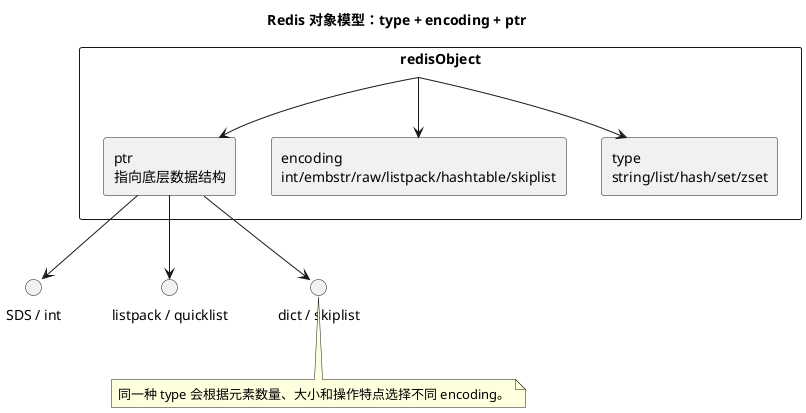

# Redis 基础与底层数据结构

## 问题索引

- Q1：Redis 基础能力和底层数据结构有哪些？如何理解它们的使用场景？
- Q2：Redis 主从、Sentinel、Cluster、热 key、大 key 和危险命令有哪些风险？
- Q3：Redis 热 key 如何发现和治理？
- Q4：Redis 内存淘汰策略是怎么统计访问频率的？
- Q5：Redis 缓存穿透和缓存雪崩是什么？如何治理？
- Q6：Redis 主从、哨兵和 Cluster 集群分别解决什么问题？
- Q7：Redis Cluster 模式下如何动态扩容？需要注意哪些问题？

## Q1：Redis 基础能力和底层数据结构有哪些？如何理解它们的使用场景？

### 背景

Redis 面试经常从“Redis 为什么快”开始，但真正要答好，需要把这几条线串起来：

```text
数据类型 -> 底层编码 -> 对象模型 -> 单线程事件循环 -> 过期淘汰 -> 持久化 -> 高可用
```

Redis 不是简单的 Key-Value 缓存。它提供多种数据结构，并根据数据规模和内容自动选择不同的底层编码，以兼顾内存和性能。

### Redis 为什么快

常见原因：

- 主要操作在内存中完成。
- 单线程执行命令，避免多线程锁竞争。
- I/O 多路复用处理大量连接。
- 数据结构设计高效。
- 底层编码会按场景优化内存，例如 listpack、intset、skiplist。
- 网络协议 RESP 简单。

注意：Redis 单线程主要指命令执行主流程，后台持久化、异步删除、网络 I/O 在新版本中可能有其他线程辅助。

### Redis 对象模型


### PlantUML 示意图：Redis 对象模型与编码选择



Redis 每个 key 和 value 都是对象。

value 对象大致包含：

```text
type      逻辑类型，例如 string/list/hash/set/zset
encoding  底层编码，例如 int/embstr/raw/listpack/hashtable/skiplist
ptr       指向真实数据结构
lru/lfu   淘汰策略相关信息
refcount  引用计数
```

可以用命令查看底层编码：

```bash
OBJECT ENCODING key
```

例如：

```text
String -> int / embstr / raw
Hash   -> listpack / hashtable
Set    -> intset / hashtable
ZSet   -> listpack / skiplist
```

### String

String 是 Redis 最基础的数据类型，可以存：

- 字符串。
- 数字。
- JSON。
- 二进制数据。

常见命令：

```bash
SET user:1 "Tom"
GET user:1
INCR counter
SETEX token:1 3600 abc
```

#### 底层编码

String 主要编码：

| 编码 | 场景 |
| --- | --- |
| int | 值是整数且能用 long 表示 |
| embstr | 短字符串，一次内存分配 |
| raw | 长字符串，SDS 单独分配 |

Redis 字符串底层是 SDS，Simple Dynamic String。

SDS 相比 C 字符串的优点：

- 记录长度，获取长度 O(1)。
- 二进制安全，可以包含 `\0`。
- 自动扩容，减少频繁内存分配。
- 防止缓冲区溢出。

#### 业务场景

- 缓存对象 JSON。
- 分布式锁 value。
- 计数器。
- 验证码。
- token。

注意：大对象 JSON 会造成网络传输、序列化和内存压力，不适合无限膨胀。

### List

List 是有序列表。

常见命令：

```bash
LPUSH queue a
RPOP queue
LRANGE queue 0 10
```

#### 底层编码

Redis 早期 List 使用 ziplist + linkedlist，后来主要演进为 quicklist，Redis 7 中 ziplist 被 listpack 逐步替代。

quicklist 可以理解为：

```text
双向链表 + 每个节点里存一个紧凑列表
```

好处：

- 比纯链表更省内存。
- 比纯连续数组更容易两端插入删除。
- 适合队列场景。

#### 业务场景

- 简单队列。
- 最新消息列表。
- 时间线。

注意：复杂消息队列更推荐专业 MQ，Redis List 不提供完整可靠投递、消费确认和死信能力。

### Hash

Hash 适合存对象字段。

常见命令：

```bash
HSET user:1 name Tom age 18
HGET user:1 name
HGETALL user:1
HINCRBY user:1 score 10
```

#### 底层编码

Hash 主要编码：

| 编码 | 场景 |
| --- | --- |
| listpack | 字段少、字段和值较短 |
| hashtable | 字段多或字段较大 |

listpack 是连续紧凑结构，适合小对象，节省内存。

hashtable 适合字段多、随机访问频繁的场景。

#### 业务场景

- 用户资料。
- 商品基础属性。
- 配置项。
- 统计维度计数。

注意：`HGETALL` 对大 Hash 有风险，可能阻塞 Redis 主线程。

### Set

Set 是无序不重复集合。

常见命令：

```bash
SADD black:user 1001
SISMEMBER black:user 1001
SREM black:user 1001
SINTER set1 set2
```

#### 底层编码

Set 主要编码：

| 编码 | 场景 |
| --- | --- |
| intset | 元素都是整数且数量较少 |
| hashtable | 元素非整数或数量较多 |

intset 是紧凑整数集合，节省内存。

#### 业务场景

- 黑名单。
- 标签集合。
- 用户关注关系。
- 去重。
- 预约名单精确判断。

注意：大集合的交并差运算要谨慎，可能阻塞。

### ZSet

ZSet 是有序集合，每个成员有一个 score。

常见命令：

```bash
ZADD rank 100 user1
ZRANGE rank 0 9 WITHSCORES
ZREVRANGE rank 0 9 WITHSCORES
ZRANGEBYSCORE rank 80 100
```

#### 底层编码

ZSet 主要编码：

| 编码 | 场景 |
| --- | --- |
| listpack | 元素少且较短 |
| skiplist + dict | 元素多或较大 |

skiplist 跳表支持按 score 范围查询，dict 支持按 member O(1) 查 score。

#### 为什么用跳表

跳表可以理解为多层有序链表。

优点：

- 实现比红黑树简单。
- 支持范围查询。
- 插入、删除、查找平均 O(logN)。
- 顺序遍历方便。

#### 业务场景

- 排行榜。
- 延迟任务时间排序。
- 热度排序。
- 分数范围查询。

注意：排行榜只取 TopN 时很适合；但全量大范围扫描要控制分页。

### Bitmap

Bitmap 本质上是 String 的 bit 操作。

常见命令：

```bash
SETBIT sign:202606 1001 1
GETBIT sign:202606 1001
BITCOUNT sign:202606
```

业务场景：

- 用户签到。
- 活跃用户统计。
- 是否预约。
- 布尔状态压缩存储。

限制：

- offset 要可控。
- 如果 userId 很大且稀疏，会浪费空间。

### HyperLogLog

HyperLogLog 用于基数统计，也就是估算不重复元素数量。

常见命令：

```bash
PFADD uv:20260628 user1 user2
PFCOUNT uv:20260628
```

特点：

- 内存极小。
- 有误差。
- 适合 UV 统计。

不适合：

- 要精确判断某个用户是否存在。
- 要列出所有元素。

### Stream

Stream 是 Redis 5 引入的消息流结构。

常见能力：

- 消息追加。
- 消费组。
- ACK。
- Pending List。
- 按 ID 读取。

常见命令：

```bash
XADD order-stream * orderId 1001
XGROUP CREATE order-stream g1 0
XREADGROUP GROUP g1 c1 COUNT 10 STREAMS order-stream >
XACK order-stream g1 1700000000000-0
```

适合：

- 轻量消息流。
- 小规模异步任务。
- 审计事件。

但复杂可靠消息、跨服务高吞吐场景仍更推荐 RocketMQ、RabbitMQ 等专业 MQ。

### Dict 字典

Redis 数据库本身就是一个大字典：

```text
key -> redisObject
```

Hash、Set、ZSet 内部也会用 dict。

dict 采用哈希表，支持渐进式 rehash。

#### 渐进式 rehash

扩容或缩容时，如果一次性搬迁所有数据，会阻塞主线程。

Redis 使用渐进式 rehash：

```text
同时维护 ht[0] 和 ht[1]
每次读写顺便搬迁一部分 bucket
后台定期也搬一部分
直到迁移完成
```

这样把一次大开销拆成很多小开销。

### 过期删除

Redis 支持 TTL。

```bash
EXPIRE key 60
TTL key
```

过期删除主要有：

| 策略 | 说明 |
| --- | --- |
| 惰性删除 | 访问 key 时发现过期才删除 |
| 定期删除 | 后台周期性抽样删除过期 key |

Redis 不会为每个 key 单独创建定时器，否则内存和 CPU 成本太高。

### 内存淘汰

当内存达到 `maxmemory`，Redis 根据策略淘汰数据。

常见策略：

| 策略 | 含义 |
| --- | --- |
| noeviction | 不淘汰，写入报错 |
| allkeys-lru | 所有 key 中淘汰最近最少使用 |
| volatile-lru | 只淘汰设置 TTL 的 key |
| allkeys-lfu | 所有 key 中淘汰低频访问 |
| volatile-ttl | 优先淘汰快过期的 key |
| allkeys-random | 随机淘汰 |

缓存场景常见：

```text
allkeys-lru 或 allkeys-lfu
```

业务强依赖缓存不丢的场景，要慎用淘汰，最好区分缓存 Redis 和状态 Redis。

### 持久化

Redis 持久化主要有 RDB 和 AOF。

#### RDB

RDB 是快照。

优点：

- 文件紧凑。
- 恢复较快。
- 适合备份。

缺点：

- 两次快照之间的数据可能丢失。

#### AOF

AOF 记录写命令。

优点：

- 数据安全性更高。
- 可配置每秒 fsync。

缺点：

- 文件更大。
- 需要 rewrite。

常见生产配置：

```text
appendonly yes
appendfsync everysec
```

### 高可用

Redis 高可用常见形态：

- 主从复制。
- Sentinel。
- Cluster。

关注点：

- 主从异步复制可能丢数据。
- Sentinel 切主存在短暂不可用。
- Cluster 支持分片，但多 key 操作要关注 hash slot。
- 脑裂时要关注旧主继续写入风险。

### 业务场景选型

| 场景 | 推荐结构 |
| --- | --- |
| 用户 token | String |
| 商品详情缓存 | String JSON / Hash |
| 黑名单 | Set / 布隆过滤器辅助 |
| 预约名单 | Set / Bitmap |
| 排行榜 | ZSet |
| 延迟任务 | ZSet / 时间轮 / MQ 延迟消息 |
| UV 统计 | HyperLogLog |
| 签到 | Bitmap |
| 简单消息流 | Stream |
| 分布式锁 | String + SET NX PX |

### 踩坑点

- 大 key：大 String、大 Hash、大 Set 会阻塞和增加网络开销。
- 热 key：单 key QPS 过高会打爆单线程。
- `KEYS *`：生产禁用，使用 `SCAN`。
- `HGETALL` 大 Hash 风险高。
- 缓存和状态混用同一个 Redis，淘汰策略可能误删关键状态。
- 分布式锁必须设置过期时间和唯一 value，释放锁要校验 value。
- `DEL` 大 key 可能阻塞，优先考虑 `UNLINK`。

### 面试话术

> Redis 的基础可以从数据类型、底层编码和运行机制来讲。常见类型有 String、List、Hash、Set、ZSet、Bitmap、HyperLogLog、Stream。String 底层是 SDS，会按 int、embstr、raw 编码优化；Hash 小对象用 listpack，大对象用 hashtable；Set 小整数集合用 intset，否则用 hashtable；ZSet 小集合用 listpack，大集合用 skiplist + dict。Redis 快主要因为数据在内存、命令单线程执行避免锁竞争、I/O 多路复用、数据结构高效。它还通过惰性删除和定期删除处理过期 key，通过 LRU/LFU 等策略做内存淘汰，通过 RDB/AOF 做持久化，通过主从、Sentinel、Cluster 做高可用。实际使用时要关注大 key、热 key、缓存一致性、淘汰策略和持久化取舍。

## Q2：Redis 主从、Sentinel、Cluster、热 key、大 key 和危险命令有哪些风险？

### 背景

Redis 线上问题很多不是“命令不会用”，而是对它的高可用边界和单线程执行模型理解不够。

这些风险可以归为两类：

```text
高可用一致性风险：主从异步复制、Sentinel 切主、Cluster hash slot
单线程阻塞风险：热 key、大 key、KEYS、HGETALL、DEL
```

### 主从异步复制为什么可能丢数据

Redis 主从复制默认是异步复制。

写入流程可以简化为：

```text
客户端写 Master
Master 返回 OK
Master 异步把写命令复制给 Replica
Replica 回放命令
```

问题在于：**Master 返回 OK 时，并不代表 Replica 已经收到这条数据。**

如果出现：

```text
T1 客户端写 Master：SET order:1 PAID -> OK
T2 Master 宕机
T3 Replica 被提升为新 Master
```

如果 `order:1` 还没复制到 Replica，新 Master 就没有这条数据，这就产生数据丢失。

#### 线上表现

- 写成功后切主，数据消失。
- 分布式锁刚写入，主节点宕机后锁丢失。
- 幂等 Key 写入成功但故障后重复请求未被拦住。
- 缓存数据短暂回退。

#### 降低风险

- 重要写入不要只依赖 Redis，DB 唯一索引或状态机兜底。
- 使用 `min-replicas-to-write` 和 `min-replicas-max-lag` 限制孤立主继续写。
- 对强一致资源，避免把 Redis 当唯一事实源。
- 业务层做对账和补偿。

注意：这些配置只能降低风险，会牺牲可用性，不能把 Redis 主从变成强一致系统。

### Sentinel 切主为什么会短暂不可用

Sentinel 负责监控 Master，发现故障后选举并切换主从。

切主过程大致是：

```text
Sentinel 主观下线
多个 Sentinel 达成客观下线
选举 Sentinel leader
选择一个 Replica 提升为新 Master
其他 Replica 改为复制新 Master
客户端收到新主地址并重连
```

这个过程需要时间。

短暂不可用来自：

- 故障检测需要时间。
- Sentinel 选举需要时间。
- Replica 晋升需要时间。
- 客户端连接旧 Master 失败。
- 客户端需要刷新拓扑并重连新 Master。
- 切换期间可能出现连接超时、READONLY、写失败。

#### 线上表现

- Redis 短时间连接失败。
- 写请求报错。
- 客户端报 `READONLY You can't write against a read only replica`。
- 业务接口 RT 抖动。
- 少量请求失败或触发重试。

#### 应对

- 客户端使用支持 Sentinel 的连接池，自动感知新主。
- 业务层对 Redis 写失败有降级策略。
- 写路径要幂等，避免重试导致重复业务。
- 核心状态不要只存 Redis。
- 监控切主事件、连接错误、READONLY 错误。

### Cluster 多 key 为什么要关注 hash slot

Redis Cluster 把整个 key 空间分成 16384 个 hash slot。

```text
key -> CRC16(key) % 16384 -> slot -> node
```

每个节点负责一部分 slot。

单 key 操作很自然，但多 key 操作要求这些 key 在同一个 slot。

例如：

```bash
MGET user:1 user:2
```

如果两个 key 落在不同 slot，Cluster 无法在一个节点上完成这个多 key 命令，可能报：

```text
CROSSSLOT Keys in request don't hash to the same slot
```

#### hash tag

Redis Cluster 支持 hash tag：

```text
order:{1001}:detail
order:{1001}:items
```

只对 `{}` 中的内容计算 slot，所以这两个 key 会落到同一个 slot。

适合：

- 同一订单多个 key 需要事务或批量操作。
- 同一用户多个 key 需要 Lua 原子处理。

#### 注意

不要滥用 hash tag 把大量 key 强行打到一个 slot，否则会造成数据倾斜和热点节点。

### 热 key 为什么会打爆单线程

热 key 指某个 key 被极高频访问。

例如：

```text
商品详情 product:1001
秒杀库存 seckill:stock:1
首页配置 homepage:config
明星直播间状态 live:room:hot
```

Redis 命令执行主流程是单线程。即使 Redis 整体 QPS 很高，一个超热点 key 也可能让某个 Redis 实例的 CPU、网络、带宽被打满。

#### 线上表现

- Redis 单核 CPU 飙高。
- 某个分片 QPS 极高，其他分片很闲。
- 请求 RT 飙升。
- 连接池排队。
- 慢查询增多。

#### 解决方案

- 本地缓存：Caffeine、本地内存缓存热点只读数据。
- 多级缓存：本地缓存 + Redis + DB。
- 热 key 拆分：例如 `hot:key:0 ~ hot:key:N`。
- 读写分离：读请求走副本，但要接受复制延迟。
- 限流和降级：热点接口快速失败或返回降级数据。
- 预热和随机过期时间，避免同时失效。

注意：如果是库存这类强一致热点写 key，不能简单拆分，必须考虑总量一致性和对账。

### KEYS * 为什么生产禁用

`KEYS pattern` 会遍历 Redis 当前库中所有 key。

```bash
KEYS *
```

问题：

- 时间复杂度 O(N)。
- Redis 主线程执行期间会阻塞其他命令。
- key 很多时可能导致 Redis 卡顿甚至超时。

生产上要用 `SCAN`。

```bash
SCAN 0 MATCH user:* COUNT 1000
```

`SCAN` 的特点：

- 渐进式遍历。
- 每次只返回一部分。
- 不保证一次遍历期间结果完全一致。
- 可能返回重复 key，业务侧要能容忍。

### HGETALL 大 Hash 为什么风险高

`HGETALL key` 会一次性返回 Hash 的所有字段和值。

如果 Hash 很大：

- Redis 主线程要遍历大量 field。
- 网络一次性返回大量数据。
- 客户端反序列化和内存压力变大。
- 慢请求阻塞后续命令。

例如一个用户购物车 Hash 有几十个字段没问题；但如果一个大 Hash 有几十万字段，`HGETALL` 就很危险。

#### 替代方案

- 只取需要字段：`HMGET`。
- 分批扫描：`HSCAN`。
- 拆 key：按业务维度拆成多个小 Hash。
- 控制单个 Hash field 数量。

```bash
HSCAN big:hash 0 COUNT 500
```

### DEL 大 key 为什么会阻塞，UNLINK 为什么更好

`DEL key` 删除 key 时，需要释放 key 对应的内存。

如果 key 很大：

```text
大 List
大 Set
大 Hash
大 ZSet
```

释放内存本身可能很耗时，而 Redis 主线程会被阻塞。

`UNLINK key` 的思路是：

```text
主线程把 key 从 keyspace 解除关联
后台线程异步释放内存
```

所以 `UNLINK` 对大 key 更友好。

注意：

- `UNLINK` 不是让删除变成不存在延迟。对客户端来说 key 会很快不可见。
- 它只是把内存释放放到后台。

### 面试话术

> Redis 主从复制默认是异步的，Master 返回写成功不代表 Replica 已经同步，所以 Master 宕机切主时可能丢掉未复制的数据。Sentinel 切主也不是瞬时完成，需要故障检测、选举、提升新主、客户端重连，所以会有短暂不可用。Cluster 通过 16384 个 hash slot 分片，多 key 操作必须落在同一个 slot，否则会 CROSSSLOT，可以用 hash tag 控制但不能滥用。单线程模型下要特别关注热 key 和大 key：热 key 会把单个分片 CPU 或带宽打满，大 key 会让 HGETALL、DEL 等命令阻塞主线程。生产禁用 KEYS，用 SCAN 渐进遍历；大 Hash 避免 HGETALL，用 HMGET/HSCAN；删除大 key 优先 UNLINK，让后台线程异步释放内存。

## Q3：Redis 热 key 如何发现和治理？

### 背景

热 key 指某一个或少数几个 key 被大量访问，导致单个 Redis 实例、单个 Cluster 分片、单个网络链路或客户端连接池成为瓶颈。

典型场景：

- 秒杀商品库存、活动资格、预约状态。
- 首页配置、热门商品详情、爆款活动页。
- 黑名单、风控规则、会员权益配置。
- 大促期间某个用户、订单、商品被集中查询。

热 key 的问题不只是 Redis CPU 高。它可能表现为：

- 某个 Redis 分片 CPU 飙高，其他分片很闲。
- 网卡出入流量打满。
- 客户端连接池等待变长。
- 接口 RT 抖动，但 DB 并不慢。
- Sentinel 或 Cluster 切换后热点迁移，新节点马上被打满。

### 如何发现热 key

发现热 key 要分层看：业务入口、客户端、Redis 服务端、代理层和监控平台。

#### 从业务入口发现

先看接口维度：

- 哪些接口 QPS 突然升高。
- 哪些接口 RT 上升但 DB 慢 SQL 没增加。
- 哪些活动、商品、用户、地区或渠道集中访问。
- 日志中某些业务 ID 出现频率异常高。

如果项目有统一埋点，可以按业务 key 做 TopN 统计：

```text
/api/seckill/detail?activityId=1001 -> product:1001
/api/home/config -> homepage:config
/api/user/right -> user:right:vip:10086
```

这种方式的好处是能把 Redis key 反推回业务场景，后续治理不会只停留在缓存层。

#### 从客户端发现

在应用侧 Redis SDK 或缓存组件中增加 key 访问统计，按时间窗口聚合 TopN。

常见统计维度：

- key 或 key 前缀。
- 命令类型，例如 `GET`、`HGET`、`ZREVRANGE`。
- 调用接口。
- 平均耗时、P95、P99。
- 命中次数。

示例：

```text
1 分钟窗口内统计：
cache:product:1001 -> GET 120000 次
seckill:stock:2001 -> DECR 50000 次
blacklist:user -> SISMEMBER 80000 次
```

客户端统计最适合长期治理，因为它能定位“是谁在访问这个 key”。

#### 从 Redis 服务端发现

查看整体压力：

```bash
# 查看 Redis 实例整体状态，重点关注 ops、CPU、连接数、内存和网络相关指标
redis-cli -h 127.0.0.1 -p 6379 INFO
```

关注点：

- `instantaneous_ops_per_sec`：瞬时 QPS 是否异常升高。
- `connected_clients`：连接数是否异常。
- `used_cpu_sys`、`used_cpu_user`：CPU 是否持续升高。
- `total_net_input_bytes`、`total_net_output_bytes`：网络流量是否异常。
- `keyspace_hits`、`keyspace_misses`：缓存命中情况。

查看命令统计：

```bash
# 查看各命令累计调用次数和耗时，用于判断热点集中在哪类命令
redis-cli -h 127.0.0.1 -p 6379 INFO commandstats
```

关注点：

- `cmdstat_get`、`cmdstat_hget`、`cmdstat_mget` 是否明显偏高。
- `usec_per_call` 是否升高。
- 是否有 `hgetall`、`smembers`、`zrange` 等大范围命令。

使用 `hotkeys`：

```bash
# 需要 Redis 使用 LFU 淘汰策略时更有参考价值，用来采样发现访问频率高的 key
redis-cli -h 127.0.0.1 -p 6379 --hotkeys
```

注意：

- `--hotkeys` 依赖 LFU 计数信息，通常需要配置 `maxmemory-policy` 为 LFU 类策略，例如 `allkeys-lfu` 或 `volatile-lfu`。
- 它是采样和近似结果，不是绝对精确的全量统计。

使用 `MONITOR` 要非常谨慎：

```bash
# 只建议短时间在低峰或测试环境使用，生产长时间执行会明显增加 Redis 压力
redis-cli -h 127.0.0.1 -p 6379 MONITOR
```

关注点：

- 高频重复出现的 key。
- 高频重复出现的命令。
- 请求来源 IP。

生产建议：

- 只短时间采样。
- 尽量在从库或旁路环境分析。
- 更推荐客户端埋点、代理层统计或云厂商热 key 分析工具。

#### 从 Cluster 分片发现

如果是 Redis Cluster，要看是否某个分片特别忙。

```bash
# 查看集群节点和 slot 分布，结合监控判断热点是否集中在某个节点
redis-cli -c -h 127.0.0.1 -p 6379 CLUSTER NODES
```

关注点：

- 是否只有某个 master 节点 CPU、QPS、网络特别高。
- 热 key 是否通过 hash tag 被人为集中到同一个 slot。
- 是否存在热点 slot。

Cluster 场景下，热 key 不一定是“数据量不均”，也可能是“访问量不均”。即使每个节点内存差不多，单个热 key 仍然可能压垮某个分片。

#### 从慢查询发现

```bash
# 查看 Redis 慢查询日志，适合发现大 key、大范围命令和阻塞型操作
redis-cli -h 127.0.0.1 -p 6379 SLOWLOG GET 20
```

关注点：

- 是否有 `HGETALL`、`SMEMBERS`、`LRANGE 0 -1`、`ZRANGE` 大范围查询。
- 慢查询 key 是否与业务热点一致。
- 慢的是单 key 高频，还是大 key 单次执行慢。

热 key 和大 key 经常一起出现，但本质不同：

| 类型 | 核心问题 | 表现 |
| --- | --- | --- |
| 热 key | 访问次数太高 | CPU、网络、连接池被打满 |
| 大 key | 单次处理太重 | 慢查询、阻塞、网络大包 |
| 热大 key | 又热又大 | 最危险，容易拖垮实例 |

### 如何治理热 key

治理思路要先区分读热点、写热点、读写混合热点。

#### 读热点：本地缓存和多级缓存

只读或低频变更的数据，优先使用多级缓存：

```text
请求 -> 本地缓存 Caffeine -> Redis -> DB
```

适合：

- 首页配置。
- 商品详情。
- 活动规则。
- 字典数据。
- 风控黑名单快照。

关键点：

- 本地缓存设置短 TTL，避免长时间脏读。
- 变更时通过 MQ、配置中心、Redis Pub/Sub 或版本号通知失效。
- 本地缓存要设置最大容量，避免 JVM 内存膨胀。
- 热点数据可以提前预热。

#### 读热点：副本读和只读节点扩展

如果业务可以接受短暂复制延迟，可以把读流量打到 Redis replica。

适合：

- 商品详情。
- 活动配置。
- 榜单展示。
- 非强一致用户画像。

注意：

- 主从复制是异步的，读副本可能读到旧数据。
- 关键状态不要只读副本，例如支付状态、库存扣减结果。
- 客户端要能区分强一致读和弱一致读。

#### 读热点：热 key 拆分

对只读或可合并的数据，可以把一个 key 拆成多个副本 key：

```text
product:1001:0
product:1001:1
product:1001:2
...
product:1001:N
```

读取时随机访问其中一个：

```text
index = hash(userId) % N
GET product:1001:{index}
```

好处：

- 把访问压力分散到多个 key。
- Cluster 下如果不使用相同 hash tag，可以进一步分散到多个 slot。

风险：

- 多副本更新复杂。
- 数据一致性变弱。
- 不适合强一致扣减类 key。

#### 写热点：削峰和异步化

写热点比读热点更难，因为写操作通常有一致性要求。

常见方案：

- 接口限流，控制进入 Redis 的请求量。
- MQ 排队，削平瞬时峰值。
- Redis Lua 保证单次判断和扣减原子性。
- DB 状态机和唯一索引兜底。
- 批量合并写，例如计数类场景先本地聚合再定期写 Redis。

适合：

- 秒杀库存扣减。
- 抢券。
- 点赞数、浏览量、热度值。

注意：

- 库存不能简单拆成多个 key 后随便扣，否则容易超卖或对账复杂。
- 可以按库存桶拆分，但要设计总量约束、桶间回补、最终对账和异常补偿。

#### 热点预热和动态识别

热点往往不是固定的，应该有预热和自动发现机制。

预热方式：

- 活动开始前把商品、库存、规则、黑名单、资格名单加载到 Redis。
- 将热点商品详情加载到本地缓存。
- 提前建立连接池，避免流量进来时冷启动。

动态识别方式：

- 客户端统计 key TopN。
- 网关按业务参数统计 TopN。
- Redis 代理层统计热点 key。
- 监控告警触发热点 key 自动加入本地缓存。

### 排查流程

线上发现 Redis RT 升高时，可以按这个顺序排查：

```text
1. 看接口监控：确认是哪些业务接口变慢。
2. 看 Redis 分片监控：确认是否某个实例 CPU/QPS/网络异常。
3. 看 commandstats：确认主要压力来自哪些命令。
4. 看客户端 TopN 或短时采样：定位具体 key 或 key 前缀。
5. 看 key 大小和命令类型：区分热 key、大 key、热大 key。
6. 制定治理方案：读热点用多级缓存/副本/拆分，写热点用限流/MQ/Lua/状态机。
```

### 踩坑点

- 不要一上来就扩容 Redis。扩容能缓解整体容量和分片压力，但单个热 key 仍可能集中在一个 slot。
- 不要对强一致写热点盲目做多副本 key，否则容易引入超卖、重复扣减和对账问题。
- 本地缓存要有失效机制，否则热 key 治好了，但业务读到旧数据。
- `MONITOR` 不能长时间在线上跑，可能把问题放大。
- 读副本能扩展读能力，但要接受主从延迟。
- 热 key 发现最好在客户端或代理层长期建设，只靠故障时临时命令不够稳定。

### 面试话术

> Redis 热 key 的排查我会先看业务接口和 Redis 分片监控，判断是不是某个实例 CPU、QPS 或网络异常；再看 `INFO commandstats` 判断主要压力来自 GET、HGET 还是其他命令；如果有客户端埋点或代理层统计，会按时间窗口看 key TopN；必要时短时间用 `SLOWLOG`、`--hotkeys` 或 `MONITOR` 辅助定位。治理上要先区分读热点和写热点：读热点可以用本地缓存、多级缓存、读副本、热点 key 拆分和预热；写热点要更谨慎，通常结合限流、MQ 削峰、Lua 原子扣减、DB 状态机和对账补偿。Cluster 扩容不是万能的，因为单个热 key 仍会落在单个 slot 上，核心还是要把访问压力从单点打散，或者在业务入口削峰。

## Q4：Redis 内存淘汰策略是怎么统计访问频率的？

### 背景

Redis 内存淘汰策略里，容易混淆的是 LRU 和 LFU：

| 策略 | 关注点 | 是否统计访问频率 |
| --- | --- | --- |
| `allkeys-lru` / `volatile-lru` | 最近是否访问 | 不统计频率，只记录近似最近访问时间 |
| `allkeys-lfu` / `volatile-lfu` | 最近一段时间访问是否频繁 | 统计近似访问频率 |
| `allkeys-random` / `volatile-random` | 随机 | 不统计 |
| `volatile-ttl` | 谁更快过期 | 不统计 |

所以，“Redis 淘汰策略怎么统计频率”主要问的是 LFU，也就是 Least Frequently Used。

### LFU 不是精确计数

Redis 的 LFU 不会给每个 key 维护一个无限增长的访问次数。原因很简单：

- key 数量可能非常大，精确计数内存成本高。
- 高频 key 计数会无限膨胀。
- 很久以前热过的 key 如果不衰减，会长期占据缓存。

所以 Redis LFU 采用的是：

```text
8 位近似访问计数器 + 16 位最近衰减时间
```

Redis 对象头里有一个 `lru` 字段。在 LRU 策略下，它表示最近访问时间；在 LFU 策略下，这个字段会被拆成两部分：

```text
高 16 位：ldt，last decrement time，最近一次衰减时间，单位是分钟
低 8 位：logc，logarithmic counter，近似访问频率计数器
```

8 位计数器最大只能到 255，因此它天然不是精确访问次数。

### 访问时如何增加频率

当 key 被访问时，Redis 会尝试增加 LFU 计数器，但不是每次访问都加 1，而是**概率递增**。

逻辑可以理解为：

```text
访问 key
  -> 先根据时间衰减旧 counter
  -> 再按概率决定 counter 是否 +1
```

counter 越大，继续增加的概率越低。这样可以避免超级热 key 的 counter 很快打满。

近似公式可以理解为：

```text
p = 1 / (counter * lfu-log-factor + 1)
```

实际实现里还会考虑初始计数值。`lfu-log-factor` 越大，counter 增长越慢。

例如：

- 刚开始访问时，counter 较低，比较容易增长。
- 访问很多次后，counter 较高，再增长就越来越难。
- 最终 counter 最高到 255。

这就是 Redis LFU 的“对数计数”思想：访问频率越高，计数增长越慢，用很小的 8 位空间表达大致热度。

### 为什么需要时间衰减

如果一个 key 曾经很热，但后来没人访问了，它不应该永远留在内存里。

Redis 通过 `lfu-decay-time` 做衰减。它表示经过多少分钟后，LFU counter 衰减一次。

可以理解为：

```text
当前时间 - 上次衰减时间 >= lfu-decay-time
  -> counter 按经过的周期下降
```

例如：

```text
lfu-decay-time = 1
```

表示大约每 1 分钟会产生一个衰减周期。一个 key 长时间不访问，counter 会慢慢降低，最终变成冷 key。

注意：衰减不是后台线程每分钟扫描所有 key 去减。Redis 通常是在 key 被访问、被采样比较、被淘汰判断时，顺便计算它距离上次衰减过去了多久，再更新 counter。

### 淘汰时怎么选择 key

Redis 淘汰不是全量扫描所有 key 找最小频率，而是使用采样。

大致过程：

```text
内存超过 maxmemory
  -> 从候选 key 中随机采样若干个
  -> 计算这些 key 的 LFU counter
  -> 优先淘汰 counter 更低的 key
  -> 如果频率接近，再结合其他信息做比较
```

采样数量受配置影响：

```text
maxmemory-samples
```

采样数越大，淘汰结果越接近真正的 LFU，但 CPU 开销也越高。

### 相关配置

常见配置：

```text
maxmemory-policy allkeys-lfu
lfu-log-factor 10
lfu-decay-time 1
maxmemory-samples 5
```

含义：

| 配置 | 作用 |
| --- | --- |
| `maxmemory-policy` | 选择淘汰策略，例如 `allkeys-lfu` |
| `lfu-log-factor` | 控制访问计数增长速度，越大增长越慢 |
| `lfu-decay-time` | 控制频率衰减周期，单位分钟 |
| `maxmemory-samples` | 淘汰时随机采样 key 的数量 |

调参思路：

- 热点变化很快：适当降低 `lfu-decay-time`，让旧热点更快降温。
- 热点相对稳定：可以适当提高 `lfu-decay-time`，避免热点 key 被过早淘汰。
- 访问量特别大：可以提高 `lfu-log-factor`，避免 counter 太快打满。
- 想让淘汰更准确：适当提高 `maxmemory-samples`。

### LFU 和热 key 统计的关系

`redis-cli --hotkeys` 通常依赖 LFU 计数信息，因此在 LFU 淘汰策略下更有参考价值。

但要注意：

- LFU counter 是近似值，不是精确 QPS。
- 它受衰减时间影响。
- 它只能说明 key 的相对热度。
- 做业务热点治理时，最好结合客户端埋点、网关统计和 Redis 指标。

### 踩坑点

- LFU 不是精确访问次数，不能拿 counter 当真实 QPS。
- LRU 策略不统计频率，只关注最近访问时间。
- `lfu-decay-time` 太大，旧热点可能长期不被淘汰。
- `lfu-decay-time` 太小，稳定热点可能频繁降温。
- `lfu-log-factor` 太小，counter 容易快速打满。
- 淘汰是采样近似，不是全量排序。

### 面试话术

> Redis 的 LFU 不是精确统计访问次数，而是近似频率统计。Redis 对象的 `lru` 字段在 LFU 策略下会拆成两部分：高 16 位记录最近衰减时间，低 8 位记录近似访问频率 counter。key 被访问时，Redis 会先根据 `lfu-decay-time` 做时间衰减，再按概率增加 counter，counter 越大继续增加的概率越低，这由 `lfu-log-factor` 控制。淘汰时 Redis 也不会全量扫描，而是随机采样若干 key，比较它们的 LFU counter，优先淘汰频率低的。这个设计用很小的内存成本实现了近似 LFU，同时通过衰减避免历史热点长期占着内存。

## Q5：Redis 缓存穿透和缓存雪崩是什么？如何治理？

### 背景

Redis 缓存问题里最容易混淆的是穿透、击穿、雪崩：

| 问题 | 核心含义 | 典型表现 |
| --- | --- | --- |
| 缓存穿透 | 查询不存在的数据，缓存和 DB 都没有 | 大量请求直接打 DB |
| 缓存击穿 | 某个热点 key 过期，瞬间大量请求回源 DB | 单个热点 key 把 DB 打爆 |
| 缓存雪崩 | 大量 key 同时失效，或 Redis 整体不可用 | 大面积请求回源 DB |

这三个问题都会导致 DB 压力暴涨，但触发原因不同，治理方案也不同。

### 缓存穿透

缓存穿透指请求查询的数据本来就不存在。

例如：

```text
GET product:-1
GET user:999999999999
GET order:fake_id
```

请求流程：

```text
查 Redis -> miss
查 DB -> 不存在
不写缓存
下次同样请求继续查 DB
```

如果攻击者不断构造不存在的 key，就会绕过缓存，直接打 DB。

#### 典型场景

- 恶意请求随机用户 ID、订单 ID、商品 ID。
- 前端参数被篡改。
- 爬虫枚举不存在的数据。
- 业务没有做参数合法性校验。

#### 治理方案一：参数校验

在进入缓存和 DB 之前先做基础校验：

- ID 是否为正数。
- ID 长度是否合理。
- 枚举值是否合法。
- 商户是否有权限访问该订单。
- 订单号格式是否符合规则。

很多穿透请求可以在网关或服务入口直接拦掉。

#### 治理方案二：缓存空值

DB 查询不存在时，也写一个短 TTL 的空值：

```text
cache key -> NULL
TTL = 30s / 60s / 5min
```

下次再查相同不存在 key 时，直接从缓存返回空结果，不再打 DB。

注意：

- 空值 TTL 不能太长，否则真实数据后续创建后可能短时间查不到。
- 空值缓存要区分“不存在”和“缓存没有命中”。
- 对攻击者随机构造海量 key 的场景，空值缓存可能造成缓存污染。

#### 治理方案三：布隆过滤器

布隆过滤器适合拦截“绝大多数不存在 key”。

流程：

```text
请求进入
  -> 先查布隆过滤器
  -> 判断一定不存在：直接返回空
  -> 判断可能存在：再查 Redis
  -> Redis miss 再查 DB
```

特点：

- 布隆过滤器可能误判存在。
- 布隆过滤器不会误判不存在。
- 适合商品 ID、订单 ID、用户 ID 这类集合判断。

注意：如果数据会删除，普通布隆过滤器不支持删除，可以考虑布谷鸟过滤器或 Counting Bloom Filter。

#### 治理方案四：限流和风控

如果穿透来自恶意请求，还要做：

- IP 限流。
- 用户限流。
- 设备限流。
- 黑名单。
- 验证码。
- 网关 WAF。

缓存层不是唯一防线。

### 缓存雪崩

缓存雪崩指大量缓存同一时间失效，或者 Redis 整体不可用，导致请求同时回源 DB。

常见两种情况：

```text
大量 key 同时过期
Redis 集群故障或网络故障
```

#### 情况一：大量 key 同时过期

例如活动开始前批量预热商品缓存，并统一设置：

```text
TTL = 3600s
```

一小时后这些 key 同时过期，大量请求同时打到 DB，形成雪崩。

治理方案：

- TTL 加随机值。
- 热点 key 永不过期，后台异步刷新。
- 分批预热。
- 多级缓存。
- 回源限流。

TTL 随机化：

```text
TTL = baseTtl + random(0, jitter)
```

例如：

```text
TTL = 3600s + random(0, 600s)
```

这样 key 不会在同一秒集中失效。

#### 情况二：Redis 整体不可用

Redis 故障时，如果所有请求都直接查 DB，DB 可能被瞬间打垮。

治理方案：

- Redis Sentinel / Cluster 保证高可用。
- 本地缓存兜底热点数据。
- 限流和降级。
- 熔断 Redis 访问，避免线程堆积。
- 非核心查询返回默认值或稍后重试。
- 核心写链路不要依赖 Redis 做唯一事实源。

降级示例：

| 场景 | 降级 |
| --- | --- |
| 商品详情 | 返回本地缓存旧数据 |
| 首页配置 | 返回默认配置 |
| 排行榜 | 返回上一周期快照 |
| 订单查询 | 尽量查 DB，但必须限流 |
| 秒杀库存 | Redis 不可用时暂停抢购或低比例放行 |

### 缓存击穿

虽然你问的是穿透和雪崩，但面试里通常会追问击穿。

缓存击穿指某个热点 key 过期，大量请求同时回源 DB。

例如：

```text
product:1001 是爆款商品
缓存刚好过期
1 万个请求同时查 DB
```

治理方案：

- 互斥锁，只允许一个线程回源 DB。
- 热点 key 逻辑过期，后台异步刷新。
- 热点 key 永不过期，变更时主动更新。
- 本地缓存 + Redis 多级缓存。

逻辑过期思路：

```text
缓存 value = data + expireTime

读取时：
  -> 如果未逻辑过期，直接返回
  -> 如果逻辑过期，先返回旧数据
  -> 后台只放一个线程刷新缓存
```

适合允许短暂旧数据的场景，例如商品详情、活动规则、首页配置。

### 三者对比

| 问题 | 原因 | 影响范围 | 主要方案 |
| --- | --- | --- | --- |
| 穿透 | 查不存在的数据 | 大量随机 key | 参数校验、空值缓存、布隆过滤器、限流 |
| 击穿 | 单个热点 key 过期 | 单个热点 key | 互斥锁、逻辑过期、热点永不过期 |
| 雪崩 | 大量 key 同时过期或 Redis 故障 | 大面积 key | 随机 TTL、多级缓存、限流降级、高可用 |

### 业务场景

#### B 端订单查询

订单查询容易出现穿透：

- 商户传入不属于自己的订单号。
- 爬虫枚举订单号。
- 用户误输不存在订单。

治理：

- 先校验商户权限和订单号格式。
- 对不存在订单短 TTL 缓存空值。
- 对异常频率商户或 IP 限流。
- 查询必须带 `merchantId`，避免跨商户扫库。

#### 秒杀活动

秒杀容易出现击穿和雪崩：

- 活动库存、商品详情、用户资格是热点 key。
- 活动开始前大量 key 统一预热，可能统一过期。

治理：

- 活动 key TTL 加随机值。
- 热点规则本地缓存。
- 库存 key 不靠自然过期驱动一致性。
- Redis 异常时快速失败或暂停抢购。

### 踩坑点

- 空值缓存 TTL 太长，真实数据创建后短时间查不到。
- 空值缓存没有大小控制，被随机 key 攻击打爆 Redis。
- 布隆过滤器误判存在，仍可能少量请求打到 DB。
- 大量 key 统一 TTL，容易制造雪崩。
- Redis 故障时所有请求直接回源 DB，等于把 DB 当缓存抗流量。
- 热点 key 过期没有互斥保护，会形成击穿。
- 逻辑过期返回旧数据，要确认业务能接受短暂不一致。

### 面试话术

> 缓存穿透是查询不存在的数据，Redis miss 后 DB 也查不到，如果不处理，下次同样请求还会打 DB，恶意随机 key 会绕过缓存。治理上先做参数校验和权限校验，再对不存在数据缓存短 TTL 空值，对于大规模 ID 判断可以加布隆过滤器，恶意流量还要配合限流和风控。缓存雪崩是大量 key 同时过期，或者 Redis 整体不可用，导致大量请求同时回源 DB。治理上要避免统一 TTL，给过期时间加随机值，热点 key 可以逻辑过期或后台刷新，同时做 Redis 高可用、多级缓存、限流、熔断和降级。面试里还要区分击穿：击穿是单个热点 key 过期，通常用互斥锁、逻辑过期或热点永不过期解决。

## Q6：Redis 主从、哨兵和 Cluster 集群分别解决什么问题？

### 背景

Redis 高可用经常会提到三个概念：

```text
主从复制：解决读扩展和数据副本问题
哨兵 Sentinel：解决主节点故障后的自动切主问题
Cluster：解决数据分片、容量扩展和集群高可用问题
```

它们不是同一个层面的东西。

| 形态 | 解决重点 | 是否自动切主 | 是否数据分片 |
| --- | --- | --- | --- |
| 主从复制 | 数据副本、读扩展 | 否 | 否 |
| Sentinel | 主从架构自动故障转移 | 是 | 否 |
| Cluster | 分片扩容 + 高可用 | 是 | 是 |

### 主从复制

主从复制是一个 master 搭配一个或多个 replica。

```text
客户端写 Master
Master 异步复制命令给 Replica
Replica 回放命令
```

作用：

- 提供数据副本。
- 支持读写分离。
- 为故障切换提供候选节点。
- 降低单个 master 的读压力。

典型结构：

```text
Master
  -> Replica 1
  -> Replica 2
```

#### 复制过程

复制分两类：

| 类型 | 说明 |
| --- | --- |
| 全量复制 | 从节点第一次同步或复制偏移量差太多时，主节点生成 RDB 给从节点 |
| 增量复制 | 主节点把复制积压缓冲区里的命令继续发给从节点 |

大致流程：

```text
Replica 连接 Master
  -> 发送同步请求
  -> Master 判断能否增量复制
  -> 不能增量则生成 RDB 做全量复制
  -> 后续写命令异步同步给 Replica
```

#### 风险

Redis 主从复制默认是异步复制。

风险是：

```text
Master 写成功并返回客户端
写命令还没复制给 Replica
Master 宕机
Replica 被提升为新 Master
刚才那次写入丢失
```

所以主从复制不能提供强一致，只能提供最终一致和读扩展。

#### 使用场景

- 读多写少场景。
- 缓存副本。
- 配合 Sentinel 做高可用。
- 非强一致读场景。

注意：订单状态、库存扣减、分布式锁这类强一致约束，不能只依赖 Redis 主从保证正确性。

### Sentinel 哨兵

Sentinel 是 Redis 主从架构上的高可用组件。

它本身不存业务数据，主要负责：

- 监控 master 和 replica。
- 判断 master 是否下线。
- 多个 Sentinel 投票选举。
- 自动把某个 replica 提升为新 master。
- 通知客户端新的 master 地址。

典型结构：

```text
Sentinel 1
Sentinel 2
Sentinel 3

Master
  -> Replica 1
  -> Replica 2
```

#### 下线判断

Sentinel 有两种下线：

| 类型 | 含义 |
| --- | --- |
| 主观下线 | 单个 Sentinel 认为 master 不可用 |
| 客观下线 | 多个 Sentinel 达成共识，认为 master 不可用 |

流程：

```text
Sentinel 定期 ping Master
  -> 某个 Sentinel 认为 Master 超时，标记主观下线
  -> 多个 Sentinel 互相确认
  -> 达到 quorum 后标记客观下线
  -> 选举 Sentinel leader
  -> leader 选择一个 Replica 晋升为 Master
  -> 其他 Replica 改为复制新 Master
```

#### 优点

- 主节点故障后自动切换。
- 客户端可以感知新 master。
- 不需要人工手动改主从关系。

#### 风险

- 切主期间会短暂不可用。
- 主从异步复制仍可能丢数据。
- 不做数据分片，容量仍受单 master 限制。
- 客户端必须支持 Sentinel 模式，否则无法自动发现新 master。

#### 使用场景

- 单业务 Redis 数据量不大。
- 需要自动切主。
- 不需要 Redis 水平分片。
- 希望部署和运维复杂度低于 Cluster。

### Redis Cluster

Redis Cluster 是 Redis 官方分布式集群方案。

它解决两个问题：

```text
数据分片
故障自动转移
```

Cluster 把 key 空间分成 16384 个 hash slot：

```text
slot = CRC16(key) % 16384
```

每个 master 负责一部分 slot。

例如：

```text
Master A：slot 0 - 5460
Master B：slot 5461 - 10922
Master C：slot 10923 - 16383
```

每个 master 再配 replica：

```text
Master A -> Replica A1
Master B -> Replica B1
Master C -> Replica C1
```

### Cluster 请求路由

客户端访问某个 key 时，先计算 slot，然后找到负责该 slot 的节点。

如果请求打错节点，Redis 会返回：

```text
MOVED
```

客户端更新 slot 映射后，重新请求正确节点。

迁移 slot 时可能遇到：

```text
ASK
```

表示 slot 正在迁移，客户端临时访问目标节点。

### Cluster 多 key 限制

Cluster 下多 key 操作要求 key 在同一个 slot。

否则会报：

```text
CROSSSLOT Keys in request don't hash to the same slot
```

可以用 hash tag：

```text
order:{1001}:detail
order:{1001}:items
```

只对 `{1001}` 计算 slot，因此两个 key 会落到同一个 slot。

注意：hash tag 不能滥用，否则会把大量 key 打到同一个 slot，形成热点。

### Cluster 故障转移

Cluster 中每个 master 通常有 replica。

当某个 master 故障：

```text
其他节点通过 gossip 发现 master 不可用
  -> 达成故障判断
  -> 故障 master 的 replica 发起选举
  -> 某个 replica 晋升为新 master
  -> 接管原 master 的 slot
```

Cluster 能自动切主，但仍然是异步复制，所以也存在主节点写入未复制就宕机导致数据丢失的问题。

#### Cluster 主从切换核心流程

Cluster 模式下，主从切换不是 Sentinel 发起的，而是 Redis Cluster 节点之间通过 cluster bus 和 gossip 协议完成。

核心流程：

```text
1. 节点之间互相 PING/PONG，交换集群状态
2. 某个 master 长时间无响应，被部分节点标记为 PFAIL
3. 多个 master 达成共识后，把它标记为 FAIL
4. 故障 master 的 replica 判断自己是否有资格发起选举
5. replica 向其他 master 请求投票
6. 获得多数 master 投票的 replica 晋升为新 master
7. 新 master 接管原 master 的 hash slot
8. 新拓扑通过 gossip 传播给整个集群
9. 客户端收到 MOVED 后刷新 slot 路由表
10. 原 master 如果恢复，会变成新 master 的 replica
```

##### 1. PFAIL：疑似下线

Cluster 节点之间会定期发送 `PING`、`PONG`，并在消息中携带自己知道的集群状态。

如果某个节点在 `cluster-node-timeout` 时间内没有响应，其他节点会先把它标记为：

```text
PFAIL = possible fail，疑似下线
```

PFAIL 是单个节点视角，不代表整个集群已经确认它挂了。

##### 2. FAIL：客观下线

当足够多的 master 节点都认为某个 master 疑似下线时，集群会把它标记为：

```text
FAIL = confirmed fail，确认下线
```

这里强调 master 节点，是因为 Cluster 的故障确认和投票主要依赖 master。

如果无法获得多数 master 的确认，集群不会轻易切主，避免网络分区时出现多个 master 同时服务同一批 slot。

##### 3. replica 发起选举

被判定 FAIL 的 master 如果有 replica，这些 replica 会尝试发起故障转移。

不是所有 replica 同时无脑抢主。通常复制偏移量更新、更接近原 master 的 replica 更有优势，会更早发起选举。

可以理解为：

```text
数据越新的 replica
  -> 等待时间越短
  -> 更有机会先发起投票
```

这样可以尽量选择数据更新的 replica，降低数据丢失概率。

##### 4. master 投票

候选 replica 会向其他 master 请求投票。

每个 master 在一个配置纪元中通常只投一票。获得多数 master 投票的 replica，可以晋升为新 master。

这里会涉及：

```text
configEpoch
```

`configEpoch` 可以理解为集群配置版本。新的 master 会带着更新的配置版本接管 slot，其他节点通过更高的 epoch 判断哪份拓扑更新。

##### 5. 新 master 接管 slot

replica 晋升后，会接管原 master 负责的 hash slot。

例如原来：

```text
Master A：slot 0 - 5460
Replica A1：复制 Master A
```

Master A 故障后：

```text
Replica A1 晋升为 Master A1
Master A1 接管 slot 0 - 5460
```

新 master 会通过 cluster bus 广播自己已经接管这些 slot。

##### 6. 客户端刷新路由

Cluster 客户端通常维护一份 slot 到节点的映射。

故障转移后，如果客户端还访问旧节点或旧路由，Redis 会返回：

```text
MOVED slot newHost:newPort
```

客户端收到 `MOVED` 后刷新本地 slot 路由表，后续请求发往新 master。

所以生产上必须使用支持 Redis Cluster 的客户端，例如 Lettuce、Jedis Cluster、Redisson 等。

##### 7. 原 master 恢复

如果原 master 后续恢复，它发现自己的配置纪元落后，并且原来的 slot 已经被新 master 接管，就不会继续作为 master 提供服务。

它通常会变成新 master 的 replica，重新同步数据。

### Cluster 主从切换的风险

风险主要有：

- 异步复制导致数据丢失。
- 切换期间短暂不可用。
- 没有可用 replica 时，该 master 负责的 slot 无法自动恢复。
- 多数 master 不可达时，故障转移无法完成。
- 客户端不支持 Cluster 或没有及时刷新 slot 路由，会持续访问失败。

### 计划内切换

如果是运维主动切换，而不是 master 故障，可以使用手动 failover 思路，让 replica 尽量先追平 master，再切主。

计划内切换比故障切换更安全，因为可以先控制写入、等待复制追平、再完成角色切换。

### Cluster 优点

- 支持水平扩容。
- 支持数据分片。
- 自动故障转移。
- 单节点压力更低。
- 适合大容量和高吞吐缓存场景。

### Cluster 风险

- 多 key 操作受 slot 限制。
- 分布式事务能力弱。
- 客户端需要支持 Cluster 协议。
- resharding、slot 迁移有运维复杂度。
- 热 key 仍可能打爆单个 slot 或单个 master。
- 异步复制仍可能丢数据。

### 三者怎么选

| 场景 | 建议 |
| --- | --- |
| 单机缓存，数据可丢，业务简单 | 单实例或主从 |
| 数据量不大，但要求自动切主 | 主从 + Sentinel |
| 数据量大，需要水平扩容 | Redis Cluster |
| 多 key 操作很多且必须原子 | 尽量避免 Cluster，或设计 hash tag |
| 强一致库存、订单、锁 | Redis 只能做辅助，DB/状态机/唯一约束兜底 |

### 面试话术

> Redis 主从、哨兵和 Cluster 解决的是不同层面的问题。主从复制是一个 master 多个 replica，主要解决数据副本和读扩展，但不能自动切主，也不能分片，而且复制默认异步，主节点宕机可能丢数据。Sentinel 是主从架构上的高可用组件，负责监控、主观下线、客观下线、选举和自动故障转移，但它不做数据分片，容量仍受单 master 限制。Redis Cluster 是官方分布式集群方案，把 key 空间分成 16384 个 slot，不同 master 负责不同 slot，并通过 replica 做故障转移。Cluster 支持水平扩容，但多 key 操作要求落在同一个 slot，异步复制下仍可能丢数据。所以选型上，数据量不大用主从 + Sentinel，容量和吞吐要求高用 Cluster，强一致业务不能只依赖 Redis。

## Q7：Redis Cluster 模式下如何动态扩容？需要注意哪些问题？

### 背景

Redis Cluster 扩容不是“加一台机器就结束”。因为 Cluster 的数据分布依赖 16384 个 hash slot。

真正的扩容包含两件事：

```text
1. 把新 Redis 节点加入集群
2. 把一部分 slot 和对应数据迁移到新节点
```

如果只加节点，不迁移 slot，新节点没有负责任何 slot，也不会承担读写流量。

### 扩容前检查

扩容前先看集群状态：

```bash
# 查看集群节点、slot 分布、主从关系和节点状态。
redis-cli -c -h 127.0.0.1 -p 6379 CLUSTER NODES
```

```bash
# 查看集群整体状态，确认所有 slot 都被覆盖。
redis-cli -c -h 127.0.0.1 -p 6379 CLUSTER INFO
```

重点确认：

- `cluster_state:ok`。
- 16384 个 slot 都有归属。
- 没有 fail、handshake、noaddr 节点。
- 主从复制正常。
- 没有大规模迁移或故障转移正在进行。
- 客户端支持 Cluster 和路由刷新。

### 第一步：准备新节点

新节点必须开启 cluster 模式。

典型配置：

```conf
cluster-enabled yes
cluster-config-file nodes.conf
cluster-node-timeout 15000
appendonly yes
```

启动新 Redis 实例后，新节点一开始还不属于集群。

### 第二步：把新 master 加入集群

使用 `redis-cli --cluster add-node`：

```bash
# 把 10.0.0.4:6379 加入已有集群，10.0.0.1:6379 是集群中任意一个已存在节点。
redis-cli --cluster add-node 10.0.0.4:6379 10.0.0.1:6379
```

加入后，新节点只是集群成员，但还没有 slot。

可以再次查看：

```bash
# 查看新节点是否已经出现在集群拓扑中。
redis-cli -c -h 10.0.0.1 -p 6379 CLUSTER NODES
```

此时新节点通常显示为 master，但 slot 范围为空。

### 第三步：迁移 slot

迁移 slot 才是真正把流量迁到新节点。

可以用：

```bash
# 交互式迁移 slot，把一部分 slot 从老 master 迁移到新 master。
redis-cli --cluster reshard 10.0.0.1:6379
```

交互中通常需要指定：

```text
要迁移多少个 slot
目标节点 nodeId
源节点 nodeId，或从所有 master 平均迁移
```

迁移过程本质是：

```text
源节点把某个 slot 标记为 MIGRATING
目标节点把该 slot 标记为 IMPORTING
逐个迁移这个 slot 下的 key
迁移完成后更新 slot 归属
集群通过 gossip 传播新拓扑
```

迁移期间客户端可能收到：

| 响应 | 含义 |
| --- | --- |
| `ASK` | slot 正在迁移，客户端临时访问目标节点 |
| `MOVED` | slot 归属已经变化，客户端需要刷新路由 |

所以客户端必须正确支持 Redis Cluster 协议。

### 第四步：给新 master 添加 replica

生产环境不能只加 master，不加 replica。

给新 master 添加从节点：

```bash
# 把 10.0.0.5:6379 作为 replica 加入，并复制指定 master。
redis-cli --cluster add-node 10.0.0.5:6379 10.0.0.1:6379 --cluster-slave --cluster-master-id <new-master-node-id>
```

扩容后结构应该类似：

```text
Master A -> Replica A1
Master B -> Replica B1
Master C -> Replica C1
Master D -> Replica D1
```

### 第五步：重平衡 slot

如果 slot 分布不均，可以执行 rebalance：

```bash
# 根据各 master 的 slot 数进行重平衡。
redis-cli --cluster rebalance 10.0.0.1:6379
```

注意：slot 数均衡不等于数据量均衡，也不等于 QPS 均衡。因为不同 slot 里的 key 数量、key 大小、访问热度可能差异很大。

### 扩容时需要注意的点

#### 1. 加节点不等于扩容完成

新节点没有 slot，就不会处理业务 key。

必须迁移 slot：

```text
add-node 只是加入集群
reshard 才是迁移数据和流量
```

#### 2. 扩容不能解决单个热 key

Cluster 扩容能分散不同 slot 的数据和流量，但单个热 key 仍然只在一个 slot、一个 master 上。

如果问题是：

```text
product:hot:1001
```

单 key QPS 太高，扩容 master 数量不一定解决。

需要：

- 本地缓存。
- 多级缓存。
- 热 key 拆分。
- 读副本。
- 限流降级。

#### 3. hash tag 可能导致 slot 倾斜

如果大量 key 使用同一个 hash tag：

```text
order:{global}:1
order:{global}:2
order:{global}:3
```

这些 key 会落到同一个 slot，扩容也很难分散。

hash tag 应该按业务局部使用，例如同一订单相关 key 放在同 slot，而不是全局共用一个 tag。

#### 4. 迁移 big key 风险高

slot 迁移是按 key 迁移。big key 会导致：

- 迁移耗时长。
- 网络流量突增。
- 源节点或目标节点阻塞压力升高。
- 客户端请求 RT 抖动。

扩容前应先扫描 big key，必要时先拆分。

#### 5. 迁移期间要关注 ASK/MOVED

客户端必须支持：

- `MOVED` 后刷新 slot 路由表。
- `ASK` 后临时访问迁移目标节点。

如果客户端 Cluster 支持不好，扩容期间会出现大量请求失败。

#### 6. 控制迁移节奏

不要在业务高峰一次性迁移大量 slot。

建议：

- 低峰迁移。
- 分批迁移。
- 观察 Redis CPU、网络、延迟、慢查询。
- 观察业务 RT 和错误率。
- 迁移异常可以暂停。

#### 7. 扩容前后都要检查高可用

扩容后要确认：

- 每个 master 都有 replica。
- replica 分布在不同机器或可用区。
- 没有 master 和 replica 在同一故障域。
- `cluster_state` 是 ok。
- slot 全覆盖。

#### 8. slot 均衡不代表容量均衡

Redis Cluster 按 slot 分布，但每个 slot 的数据量不一定一样。

例如：

```text
slot 1000 里有大量大 key
slot 2000 里只有少量小 key
```

即使每个 master 分到的 slot 数一样，内存和 QPS 也可能不均衡。

需要结合：

- 每个节点内存。
- 每个节点 QPS。
- 每个节点网络。
- hot key。
- big key。

### 动态扩容推荐流程

```text
1. 评估当前瓶颈：容量、QPS、连接数、热 key、big key
2. 准备新 master 和 replica
3. add-node 加入新 master
4. add-node --cluster-slave 加入 replica
5. 低峰分批 reshard slot 到新 master
6. 观察 ASK/MOVED、RT、错误率、CPU、网络、内存
7. rebalance 做 slot 重平衡
8. 验证 cluster_state、slot 覆盖、主从关系
9. 更新监控和容量基线
```

### 面试话术

> Redis Cluster 动态扩容分两步：先把新节点加入集群，再迁移 slot。只执行 `add-node` 时，新 master 还没有负责任何 hash slot，不会承担读写流量；必须通过 `reshard` 把部分 slot 从老 master 迁移到新 master。迁移时源节点会把 slot 标记为 migrating，目标节点标记为 importing，slot 下的 key 会被逐步迁移；客户端可能收到 `ASK` 或 `MOVED`，所以必须使用支持 Cluster 的客户端。扩容后还要给新 master 添加 replica，并检查 slot 是否全覆盖、主从是否正常。需要注意的是，扩容只能分散不同 slot 的压力，不能解决单个热 key；hash tag 滥用会造成 slot 倾斜；big key 迁移会带来阻塞和网络抖动；slot 数均衡也不代表内存和 QPS 均衡，所以扩容前要先排查 hot key、big key 和节点资源。

## 高频追问

- Q：Redis 单线程为什么还快？
  A：主要操作在内存中完成，命令执行单线程避免锁竞争，I/O 多路复用处理连接，数据结构也针对场景做了优化。

- Q：String 底层为什么不用普通 C 字符串？
  A：Redis 使用 SDS，能 O(1) 获取长度、二进制安全、自动扩容，并避免缓冲区溢出。

- Q：ZSet 为什么用跳表？
  A：跳表实现简单，平均 O(logN) 插入删除查询，天然支持范围遍历，比红黑树更容易实现范围查询。

- Q：Hash 什么时候从 listpack 变成 hashtable？
  A：当字段数量或字段长度超过配置阈值时，会从紧凑编码转为 hashtable，以换取更好的随机访问性能。

- Q：Redis 过期 key 是不是到期立刻删除？
  A：不是。Redis 主要通过惰性删除和定期抽样删除处理过期 key，不会为每个 key 建一个定时器。

- Q：Redis 主从复制为什么会丢数据？
  A：因为复制是异步的，主库写成功返回时，从库可能还没收到。主库此时宕机并切主，未复制的数据就会丢。

- Q：Cluster 多 key 操作为什么会 CROSSSLOT？
  A：因为多个 key 可能落在不同 hash slot，对应不同节点。Redis Cluster 无法跨节点原子执行多 key 命令。

- Q：SCAN 能完全替代 KEYS 吗？
  A：SCAN 更适合生产渐进遍历，但它不保证强一致快照，可能返回重复 key，也可能受遍历期间新增删除影响。

- Q：UNLINK 和 DEL 的区别是什么？
  A：DEL 在主线程同步释放内存，大 key 可能阻塞；UNLINK 先从 keyspace 解除关联，再由后台线程异步释放内存。

- Q：Redis Cluster 扩容能彻底解决热 key 吗？
  A：不能。扩容可以分散不同 key 和 slot 的压力，但单个热 key 仍然只落在一个 slot、一个 master 上，仍需要本地缓存、多副本拆分、读副本、限流或业务削峰。

- Q：Redis LFU 的访问频率是精确次数吗？
  A：不是。Redis LFU 使用 8 位近似计数器，访问时按概率递增，并根据 `lfu-decay-time` 做时间衰减，只能表达相对热度。

- Q：缓存穿透、击穿、雪崩怎么区分？
  A：穿透是查不存在的数据，大量请求绕过缓存打 DB；击穿是单个热点 key 过期，大量请求同时回源；雪崩是大量 key 同时过期或 Redis 整体不可用，导致大面积回源。

- Q：Redis Sentinel 和 Cluster 的区别是什么？
  A：Sentinel 是主从架构的自动故障转移方案，不做数据分片；Cluster 既做数据分片，也做故障转移，适合容量和吞吐需要水平扩展的场景。

- Q：Redis Cluster 加节点后为什么还没有分担流量？
  A：因为新节点刚加入时没有负责任何 slot。必须执行 reshard 或 rebalance，把部分 slot 和对应 key 迁移到新节点后，它才会承担读写流量。

## 复习清单

- [ ] 能说清 Redis 常见数据类型和业务场景。
- [ ] 能区分 String 的 int、embstr、raw 编码。
- [ ] 能说明 Hash、Set、ZSet 在小数据和大数据下的底层编码变化。
- [ ] 能解释 SDS、dict、skiplist、quicklist/listpack 的作用。
- [ ] 能说明 Redis 为什么快。
- [ ] 能说清过期删除、内存淘汰、RDB/AOF、高可用的核心点。
- [ ] 能结合业务场景选择 Set、Bitmap、ZSet、Stream、HyperLogLog。
- [ ] 能解释 Redis 主从异步复制为什么可能丢数据。
- [ ] 能说明 Sentinel 切主为什么会短暂不可用。
- [ ] 能回答 Cluster 多 key 操作和 hash slot 的关系。
- [ ] 能说清热 key、大 key、KEYS、HGETALL、DEL 的线上风险和替代方案。
- [ ] 能说清 Redis 热 key 的发现路径、排查命令和治理方案。
- [ ] 能解释 Redis LFU 如何用 8 位 counter、概率递增和时间衰减统计访问频率。
- [ ] 能区分缓存穿透、击穿、雪崩，并说明各自治理方案。
- [ ] 能说清 Redis 主从、Sentinel、Cluster 的职责、流程、风险和选型。
- [ ] 能说清 Redis Cluster 动态扩容的 add-node、reshard、rebalance 流程和风险点。

