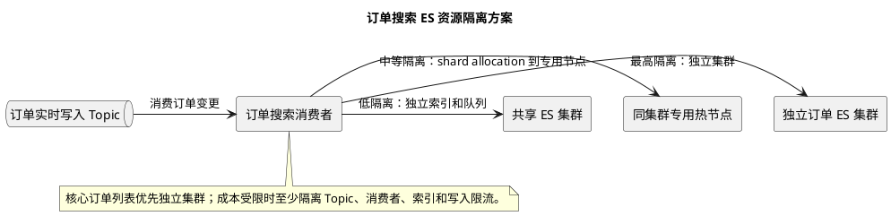

# ES 订单搜索资源隔离方案

## 问题索引

- Q1：订单搜索共用 ES 被其他业务影响时，独立集群、专用节点、独立索引和队列三种资源隔离方案如何取舍？

## Q1：订单搜索共用 ES 被其他业务影响时，独立集群、专用节点、独立索引和队列三种资源隔离方案如何取舍？

### 背景

B 端商户订单聚合系统中，订单来自淘宝、京东、拼多多、自营 APP 等多个渠道，按商户维度分库分表。由于列表筛选条件多，订单查询依赖 ES 搜索读模型。

当前问题是多个业务共用同一个 ES。当其他业务出现批量写入、重建索引、复杂聚合或突发查询时，订单搜索写入延迟被放大，导致第三方订单已经进入系统，但 B 端列表页长时间查询不到。

订单搜索是 B 端核心链路，资源隔离可以分三层：

```text
方案一：独立订单 ES 集群
方案二：同集群专用节点 + shard allocation
方案三：独立索引 + 独立 MQ / 消费者 / 写入队列
```

隔离强度从高到低，成本也从高到低。

### 方案一：独立订单 ES 集群


### PlantUML 示意图：订单搜索资源隔离层级



#### 方案说明

为订单搜索单独建设 ES 集群：

```text
order-search-es-cluster
  -> 只承载订单搜索索引
  -> 独立 master / data / coordinating 节点
  -> 独立监控、扩容、限流和变更窗口
```

订单链路：

```text
订单变更事件
  -> 订单搜索投影服务
  -> 独立订单 ES 集群
  -> B 端订单列表查询
```

其他业务系统的 ES 写入、查询、聚合、重建索引不会直接影响订单搜索集群。

#### 隔离能力

| 资源 | 是否隔离 |
| --- | --- |
| CPU | 是 |
| 内存 | 是 |
| 磁盘 IO | 是 |
| 网络带宽 | 基本隔离，取决于部署 |
| thread pool | 是 |
| segment merge | 是 |
| cluster state | 是 |
| 查询和写入限流 | 是 |

这是隔离最彻底的方案。

#### 优点

- 订单搜索不被其他业务拖垮。
- 可以单独设置 refresh interval、shard 数、副本数、ILM 策略。
- 可以单独扩容订单搜索热点。
- 故障半径清晰，其他业务重建索引不会影响订单列表。
- 运维监控指标更清晰，例如订单写入延迟、bulk rejected、查询 RT。

#### 缺点

- 机器和运维成本最高。
- 需要单独容量规划。
- 需要单独处理高可用、备份、监控、告警。
- 如果订单业务体量暂时不大，资源利用率可能偏低。

#### 适用场景

- 订单列表是核心业务入口。
- 订单不可见会直接影响商户履约、客服、售后。
- 共享 ES 已经出现分钟级甚至小时级延迟。
- 订单搜索有明确 SLA。
- 其他业务流量不可控。

#### 关键设计点

订单索引建议按时间拆分：

```text
order_search_2026_06
order_search_2026_07
```

查询时必须带：

```text
merchantId
timeRange
```

可以使用 `merchantId` 做 routing，减少跨 shard 查询：

```text
routing = merchantId
```

冷热索引分层：

```text
hot：近 30 天，高 refresh、高副本、高优先级
warm：近 3 到 6 个月，普通 refresh
cold：更早历史，低副本、低频查询、限流
```

### 方案二：同集群专用节点 + shard allocation

#### 方案说明

如果暂时不能建设独立 ES 集群，可以在同一个 ES 集群内划分订单专用 data 节点，通过索引分配规则让订单索引只落到订单节点。

逻辑形态：

```text
shared-es-cluster
  -> order data nodes
  -> other business data nodes
  -> shared master nodes
```

订单索引：

```text
order_search_2026_06
  -> 只分配到 order data nodes
```

其他业务索引：

```text
product_search
log_search
report_search
  -> 分配到 other business data nodes
```

#### 隔离能力

| 资源 | 是否隔离 |
| --- | --- |
| data 节点 CPU | 部分隔离 |
| data 节点内存 | 部分隔离 |
| data 节点磁盘 IO | 部分隔离 |
| segment merge | 部分隔离 |
| thread pool | 节点级隔离 |
| master / cluster state | 不隔离 |
| 协调节点压力 | 取决于查询入口 |
| 集群级故障 | 不隔离 |

这个方案能隔离数据节点资源，但不能隔离整个集群控制面。

#### 优点

- 成本低于独立集群。
- 可以明显降低其他业务写入和 merge 对订单 data 节点的影响。
- 迁移成本相对可控。
- 可以作为独立集群前的过渡方案。

#### 缺点

- master 节点、cluster state、集群元数据仍共享。
- 如果其他业务创建大量索引或频繁改 mapping，仍可能影响整个集群。
- 如果查询入口共用 coordinating node，复杂查询仍可能互相影响。
- 运维边界没有独立集群清晰。

#### 适用场景

- 当前还不能立刻上独立 ES 集群。
- 订单系统需要一定隔离，但成本受限。
- 共享 ES 的主要问题来自 data 节点写入、查询、merge 竞争。
- 集群中其他业务索引数量和 mapping 变更仍可控。

#### 关键设计点

给节点打业务标签：

```text
node.attr.biz: order
```

订单索引只分配到订单节点：

```json
{
  "index.routing.allocation.require.biz": "order"
}
```

查询入口也最好隔离：

```text
order-search-service
  -> order coordinating nodes
  -> order data nodes
```

否则订单查询虽然数据在订单节点，但协调层仍可能被其他业务复杂查询拖慢。

### 方案三：独立索引 + 独立 MQ / 消费者 / 写入队列

#### 方案说明

这是成本最低的隔离方案。ES 仍然共用一个集群，但订单系统拥有独立索引、独立 MQ Topic、独立消费者、独立 bulk 写入队列。

链路：

```text
OrderChangedEvent
  -> order-search-topic
  -> order-search-consumer
  -> order_search_* index
```

历史回填也单独拆 Topic：

```text
order-search-realtime-topic
order-search-backfill-topic
```

#### 隔离能力

| 资源 | 是否隔离 |
| --- | --- |
| MQ 积压 | 是 |
| 消费者线程池 | 是 |
| 应用侧 bulk 队列 | 是 |
| ES 索引 | 是 |
| ES 节点 CPU | 否 |
| ES 磁盘 IO | 否 |
| ES thread pool | 否 |
| segment merge | 否 |
| cluster state | 否 |

它只能隔离应用侧链路，不能隔离 ES 集群底层资源。

#### 优点

- 改造成本最低。
- 可以快速把实时同步和历史回填拆开。
- 能避免回填任务把实时订单同步消费者拖死。
- 可以对订单写入做独立限流、重试、监控。

#### 缺点

- 其他业务打爆 ES 时，订单写入仍然会被影响。
- ES bulk rejected、磁盘 IO、merge、GC、search pressure 仍共享。
- 只能算止血方案，不是根治方案。

#### 适用场景

- 短期无法调整 ES 集群。
- 需要先解决回填拖慢实时订单的问题。
- 当前瓶颈主要在 MQ、消费者和写入队列，而不是 ES 节点资源。
- 作为方案一或方案二落地前的过渡。

#### 关键设计点

实时和回填必须拆开：

```text
order-search-realtime-topic：新订单、支付、发货、售后
order-search-backfill-topic：字段回填、历史修复、重刷任务
```

回填消费者必须限速：

```text
按 ES bulk rejected、写入 RT、MQ lag 动态调整消费速率
```

实时同步优先级高于回填：

```text
实时同步延迟超过阈值
  -> 自动暂停或降低回填消费速率
```

### 三种方案对比

| 维度 | 独立订单 ES 集群 | 同集群专用节点 | 独立索引和队列 |
| --- | --- | --- | --- |
| 隔离强度 | 最强 | 中等 | 最弱 |
| 成本 | 高 | 中 | 低 |
| 改造周期 | 长 | 中 | 短 |
| 能否隔离其他业务突发写入 | 能 | 部分能 | 不能 |
| 能否隔离 cluster state | 能 | 不能 | 不能 |
| 能否快速止血 | 一般 | 中 | 强 |
| 适合长期核心链路 | 适合 | 可过渡 | 不适合单独长期依赖 |

推荐路线：

```text
短期：独立 Topic / 消费者 / bulk 队列，拆实时和回填
中期：同集群专用订单节点，隔离 data 节点资源
长期：订单搜索独立 ES 集群，建立完整 SLA
```

### 监控指标

无论选哪种方案，都要监控：

- MQ lag：实时订单同步积压。
- ES bulk rejected：写入是否被拒绝。
- index refresh time：刷新是否拖慢。
- segment merge time：合并是否挤占 IO。
- search latency：订单列表查询 RT。
- indexing latency：单条订单写入 ES 耗时。
- thread pool queue：write/search 队列。
- heap、GC、磁盘水位、CPU、IO。

关键业务指标：

```text
订单入库时间 -> ES 可查询时间
```

这个指标比单独看 MQ lag 或 ES 写入成功率更有意义。

### 面试话术

> 订单搜索被共享 ES 影响时，我会按隔离强度分三种方案。第一种是独立订单 ES 集群，CPU、内存、IO、thread pool、cluster state 都隔离，最适合订单列表这种 B 端核心链路，但成本最高。第二种是在同一个 ES 集群内划分订单专用 data 节点，通过 shard allocation 让订单索引只落到订单节点，能隔离部分 data 节点资源，但 master、cluster state 和协调层仍共享，适合作为过渡方案。第三种是独立索引、MQ Topic、消费者和 bulk 队列，成本最低，能快速拆分实时同步和历史回填，但不能隔离 ES 底层资源，只能止血。我的落地路线通常是短期先拆实时和回填通道，中期做专用节点，长期给订单搜索独立 ES 集群，并以“订单入库到 ES 可查询”的端到端延迟作为核心 SLA。

## 复习清单

- [ ] 能说清三种 ES 资源隔离方案的边界。
- [ ] 能解释为什么独立索引和队列不能隔离 ES 底层资源。
- [ ] 能说明同集群专用节点为什么仍然共享 cluster state。
- [ ] 能判断什么时候必须建设独立订单 ES 集群。
- [ ] 能设计实时同步和历史回填的优先级隔离。
- [ ] 能列出订单搜索 ES 的关键监控指标。

