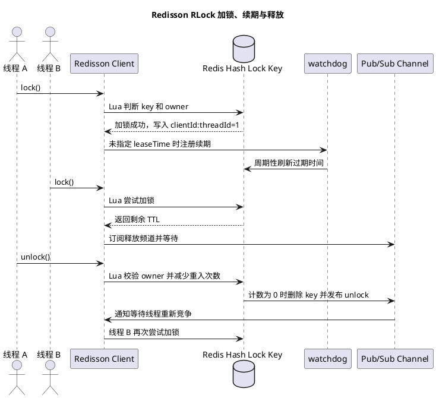
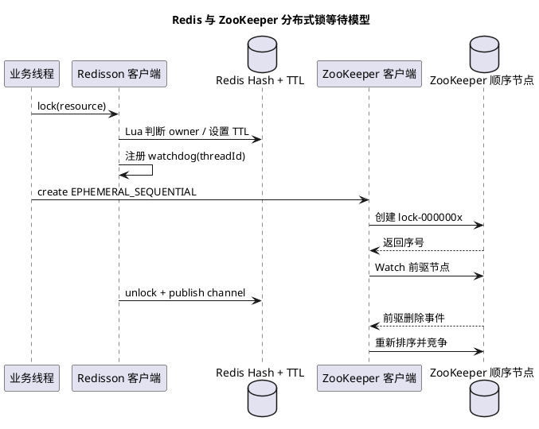

# Redisson 核心原理与集群分布式锁

## 问题索引

- Q1：Redisson 有哪些核心功能？它如何处理 Redis Cluster 下的分布式锁？
- Q2：watchdog 何时启动、如何续期？业务线程阻塞很久导致锁不释放怎么办？
- Q3：Redis 主从切换导致 Redisson 锁丢失怎么办？
- Q4：Redisson 订阅释放频道是否基于 Redis？Pub/Sub 可靠吗？如何同时支持通知唤醒和定时唤醒？
- Q5：RSemaphore 的底层数据结构与运行流程是什么？
- Q6：Redlock 的核心算法、适用场景和争议点是什么？
- Q7：Redisson 分布式锁和 ZooKeeper 分布式锁有什么区别？watchdog 如何关联锁 Key 和线程？

## Q1：Redisson 有哪些核心功能？它如何处理 Redis Cluster 下的分布式锁？

### 背景

Redisson 是一个基于 Redis 的 Java 客户端，但它不只是简单封装 `GET`、`SET` 命令，而是把 Redis 封装成一组分布式对象和分布式并发工具。

常见使用场景：

- 分布式锁。
- 延迟队列。
- 分布式限流。
- 分布式集合。
- 分布式信号量。
- 分布式缓存。
- Redis Cluster、Sentinel、主从等部署模式接入。

面试里最常问的是：

```text
Redisson 分布式锁怎么实现？
可重入怎么实现？
锁过期怎么办？
释放锁怎么保证只能释放自己的锁？
Redis Cluster 下锁怎么处理？
主从切换会不会导致锁丢失？
```

### Redisson 核心功能

#### 分布式锁

常见锁类型：

| 类型 | 说明 |
| --- | --- |
| `RLock` | 可重入分布式锁 |
| `RFairLock` | 公平锁 |
| `RReadWriteLock` | 读写锁 |
| `RMultiLock` | 多把锁组合 |
| `RedLock` | 多 Redis 节点投票式锁 |

#### 分布式同步工具

| 工具 | 说明 |
| --- | --- |
| `RSemaphore` | 分布式信号量 |
| `RPermitExpirableSemaphore` | 带过期时间的许可 |
| `RCountDownLatch` | 分布式倒计时门闩 |
| `RRateLimiter` | 分布式限流器 |

#### 分布式集合和缓存

| 类型 | 说明 |
| --- | --- |
| `RMap` | 分布式 Map |
| `RMapCache` | 支持 TTL、maxIdle 的 Map |
| `RSet` | 分布式 Set |
| `RList` | 分布式 List |
| `RQueue` | 队列 |
| `RDelayedQueue` | 延迟队列 |

#### 底层通信

Redisson 底层基于 Netty，支持：

- 异步命令发送。
- 连接池。
- Pub/Sub。
- Redis Cluster slot 路由。
- Sentinel 自动发现 master。
- Lua 脚本执行。

### RLock 的核心数据结构

Redisson 的可重入锁通常不是简单的 String，而是 Redis Hash。

锁 key：

```text
myLock
```

Hash 结构可以理解为：

```text
myLock:
  clientId:threadId -> reentrantCount
```

其中：

| 字段 | 含义 |
| --- | --- |
| `clientId` | Redisson 客户端实例唯一 ID |
| `threadId` | 当前线程 ID |
| `reentrantCount` | 当前线程重入次数 |

这样同一个线程重复加锁时，不会阻塞自己，而是增加重入次数。

### 加锁原理

Redisson 加锁核心依赖 Lua 脚本保证原子性。

加锁逻辑可以理解为：

```text
如果锁 key 不存在：
  创建 hash
  写入 clientId:threadId = 1
  设置过期时间
  加锁成功

如果锁 key 存在，但 owner 是当前线程：
  reentrantCount + 1
  刷新过期时间
  加锁成功

否则：
  返回锁剩余 TTL
  当前线程等待
```

为什么用 Lua：

- 判断锁是否存在。
- 判断 owner 是否当前线程。
- 设置重入次数。
- 设置过期时间。

这些步骤必须原子执行，不能拆成多条 Redis 命令。

### PlantUML 示意图



### 释放锁原理

释放锁也用 Lua。

释放逻辑：

```text
如果锁不存在：
  返回释放成功或空结果

如果 owner 不是当前线程：
  不允许释放

如果 owner 是当前线程：
  reentrantCount - 1
  如果 reentrantCount > 0：
      只更新计数和过期时间
  如果 reentrantCount == 0：
      删除锁 key
      发布 unlock 消息
```

释放时必须校验 owner，否则一个线程可能误删另一个线程的锁。

### watchdog 看门狗

如果调用：

```java
RLock lock = redissonClient.getLock("order:lock:1001");
lock.lock();
```

没有显式指定 leaseTime，Redisson 会启动 watchdog。

watchdog 的作用：

```text
当前线程仍持有锁
  -> 定期续期锁过期时间
  -> 防止业务执行时间过长导致锁自动过期
```

默认锁过期时间通常是 30 秒，watchdog 会周期性续期。

如果 JVM 崩溃、进程退出、线程不再持有锁，watchdog 停止续期，锁最终会自动过期，避免死锁。

### Pub/Sub 唤醒等待线程

如果线程加锁失败，不会一直疯狂自旋 Redis。

流程：

```text
线程 A 持有锁
线程 B 加锁失败，订阅锁释放频道
线程 A 释放锁，发布 unlock 消息
线程 B 收到消息后再次尝试加锁
```

这样比无脑轮询更省 Redis 压力。

注意：收到 unlock 消息不代表一定拿到锁，只代表可以重新竞争。

### 基础使用示例

```java
RLock lock = redissonClient.getLock("order:lock:" + orderId);

boolean locked = false;
try {
    // waitTime：最多等待 3 秒获取锁，避免请求无限阻塞。
    // leaseTime：锁 30 秒后自动释放，适合能预估执行时间的任务。
    locked = lock.tryLock(3, 30, TimeUnit.SECONDS);
    if (!locked) {
        // 没拿到锁时直接返回或降级，避免线程长时间堆积。
        throw new BizException("订单处理中，请稍后重试");
    }

    // 这里放必须互斥执行的业务逻辑，例如同一订单状态流转。
    processOrder(orderId);
} finally {
    // 只在当前线程确实持有锁时释放，避免误删别人的锁。
    if (locked && lock.isHeldByCurrentThread()) {
        lock.unlock();
    }
}
```

### Redis Cluster 下 Redisson 分布式锁怎么处理

#### 单个锁 key

对于单个 `RLock`，Redisson 会根据 lock key 计算 Redis Cluster slot，把命令路由到负责该 slot 的 master。

例如：

```text
lock key = order:lock:1001
slot = CRC16(key) % 16384
请求路由到负责该 slot 的 master
```

加锁、续期、释放锁的 Lua 脚本都在这个 master 上执行。

因此，单个锁在 Cluster 下仍然可以依赖单 key Lua 原子性。

#### 多个 key 同一个 Lua 的限制

Redis Cluster 要求同一个 Lua 脚本访问的多个 key 必须在同一个 slot。

如果业务需要多个相关 key 在同一个脚本里处理，要使用 hash tag：

```text
order:{1001}:lock
order:{1001}:state
order:{1001}:token
```

`{1001}` 中的内容会作为 slot 计算依据，因此这些 key 会落到同一个 slot。

注意：不要把所有锁都写成：

```text
lock:{global}:xxx
```

否则会把大量锁打到同一个 slot，形成热点 master。

#### 多把锁

如果业务需要同时持有多把锁，可以使用 `RMultiLock`。

但要理解它的代价：

- 多把锁不是一个 Redis 单脚本原子完成。
- 获取过程中如果某一把失败，需要释放已经拿到的锁。
- 锁越多，失败和超时概率越高。
- 设计上应尽量避免跨资源大范围加锁。

### Cluster 主从切换下锁安全吗

这是 Redisson 分布式锁最关键的风险点。

Redis Cluster 内部仍然是 master 异步复制给 replica。

风险流程：

```text
线程 A 在 Master 上加锁成功
Master 返回成功
锁 key 还没复制给 Replica
Master 宕机
Replica 晋升为新 Master
新 Master 上没有这把锁
线程 B 又加锁成功
```

这会导致两个线程都认为自己拿到了锁。

所以要明确：

```text
Redisson RLock 基于 Redis 单节点或单 master 的原子性
不等于强一致分布式锁
```

它适合缓存重建、防重复提交、普通业务互斥、低风险并发控制。

如果是资金、库存、订单最终状态这类强一致场景，不能只靠 Redis 锁保证正确性，必须加：

- DB 唯一索引。
- DB 条件更新。
- 状态机 CAS。
- 幂等表。
- fencing token。
- 业务对账补偿。

### fencing token

fencing token 是更可靠的防护思路。

流程：

```text
每次成功获取锁时，生成一个单调递增 token
业务写 DB 或调用下游时带上 token
下游只接受更大的 token
旧 token 即使继续执行，也会被拒绝
```

例如：

```text
线程 A 拿到 token = 10
线程 A 因 GC 暂停很久
锁过期
线程 B 拿到 token = 11
线程 B 成功写入
线程 A 恢复后尝试写入 token = 10
DB 发现 10 < 11，拒绝旧写入
```

这样可以防止“锁过期后旧线程继续执行”。

### RedLock 和 MultiLock

Redisson 支持多节点锁思路，例如 RedLock、MultiLock。

它的目标是降低单个 Redis master 故障导致锁丢失的概率。

但要注意：

- RedLock 不是所有场景都能替代强一致锁。
- 网络延迟、时钟、GC 暂停、主从切换都可能影响安全性。
- 对强一致业务，仍建议用 DB 状态机、唯一索引和 fencing token 做最终保护。

### 业务场景

#### 适合 Redisson 锁

- 防止缓存击穿时多个线程同时回源 DB。
- 防止同一用户短时间重复提交。
- 控制同一订单的非核心重复处理。
- 定时任务多实例竞争执行权。
- 临时互斥的幂等保护。

#### 不适合只靠 Redisson 锁

- 金额扣减。
- 库存最终扣减。
- 订单最终状态流转。
- 分布式事务一致性。
- 要求严格线性一致的业务。

这些场景可以使用 Redisson 锁降低并发冲突，但最终正确性必须落到 DB 或状态机。

### 踩坑点

- 手写 `SETNX` 后忘记设置过期时间，可能死锁。
- 释放锁不校验 owner，可能删掉别人的锁。
- 业务执行时间超过 leaseTime，锁提前释放。
- 使用 `lock.lock()` 但业务线程阻塞很久，watchdog 续期导致锁长期不释放。
- Redis 主从切换导致锁丢失，还误以为 Redisson 是强一致锁。
- 多资源加锁顺序不一致，可能造成死锁或长时间等待。
- 锁粒度太粗，把系统并发打成串行。

### 面试话术

> Redisson 是基于 Redis 的分布式对象和并发工具客户端，常用能力有分布式锁、读写锁、公平锁、信号量、限流器、延迟队列、分布式集合和缓存。以 `RLock` 为例，它底层通常用 Redis Hash 保存锁 owner 和重入次数，field 是 `clientId:threadId`，value 是重入次数。加锁和释放锁都通过 Lua 脚本保证原子性，加锁时如果锁不存在就写入 owner 并设置过期时间，如果 owner 是当前线程就增加重入次数；释放时必须校验 owner，只能释放自己的锁。没有指定 leaseTime 时，Redisson 会通过 watchdog 自动续期，防止业务没执行完锁就过期；等待锁的线程通过 Pub/Sub 被唤醒，避免频繁轮询。Redis Cluster 下，单个锁 key 会被路由到负责该 slot 的 master，Lua 在该 master 上原子执行；如果多个 key 要放在同一个脚本里，需要用 hash tag 保证同 slot。但 Redis Cluster 主从复制仍是异步的，如果 master 加锁成功后还没复制就宕机，锁可能丢失，所以 Redisson 锁不等于强一致锁。强一致业务要用 DB 条件更新、唯一索引、状态机 CAS 或 fencing token 兜底。

## Q2：watchdog 何时启动、如何续期？业务线程阻塞很久导致锁不释放怎么办？

### watchdog 何时启动

watchdog 只在一种典型场景下启动：

```text
加锁成功
且调用方没有显式指定 leaseTime
```

例如：

```java
RLock lock = redissonClient.getLock("order:lock:1001");

// 没有指定 leaseTime，Redisson 会在加锁成功后启用 watchdog 自动续期。
lock.lock();
```

如果显式指定了 leaseTime：

```java
RLock lock = redissonClient.getLock("order:lock:1001");

// 指定 30 秒后自动释放，Redisson 不会一直帮你续期。
lock.lock(30, TimeUnit.SECONDS);
```

这种情况下锁到期自动释放，watchdog 不会无限续期。

### watchdog 怎么启动

Redisson 加锁成功后，会把锁注册到内部续期任务中。

可以理解为：

```text
lock() 成功
  -> Redis 中写入锁 key，并设置默认过期时间
  -> Redisson 本地记录当前锁和 threadId
  -> 调度一个续期任务
  -> 周期性检查当前客户端是否还持有锁
  -> 如果仍持有锁，则执行 pexpire 续期
```

续期不是业务线程自己睡眠执行，而是 Redisson 客户端内部的定时任务调度。

### 由谁管理这个线程

watchdog 续期任务由 Redisson 客户端内部管理，底层依赖 Redisson 的调度器和 Netty 事件体系。

可以理解为：

```text
业务线程负责执行业务代码
Redisson 内部调度线程负责定期续期
Redis 负责保存锁 key 和 TTL
```

所以业务线程即使在执行耗时方法，只要 JVM 还活着、Redisson 客户端没有关闭、续期任务能正常运行，watchdog 仍然可能继续续期。

### 续期频率

Redisson 默认锁看门狗时间通常是 30 秒，也就是：

```text
lockWatchdogTimeout = 30s
```

续期任务一般会按这个时间的一部分周期去续期，例如大约每 10 秒续一次，把锁 TTL 重新刷新到 30 秒。

核心目标是：

```text
业务没执行完
  -> 锁不要提前过期
```

### 业务线程阻塞很久会怎样

如果业务线程阻塞很久，但 JVM 没死，Redisson 内部续期任务还正常运行，那么锁会一直被续期。

结果是：

```text
锁一直不释放
其他线程一直拿不到锁
```

这既是 watchdog 的优点，也是风险。

优点：

- 防止正常长事务执行时锁提前过期。

风险：

- 业务线程死循环、外部接口永久卡住、线程池阻塞时，锁会被长期续期。

### 怎么避免锁长期不释放

#### 1. 可预估耗时的任务显式指定 leaseTime

如果业务最大执行时间可控，优先用：

```java
RLock lock = redissonClient.getLock("order:lock:" + orderId);

boolean locked = false;
try {
    // waitTime 控制等待锁的时间，leaseTime 控制锁最长持有时间。
    locked = lock.tryLock(3, 30, TimeUnit.SECONDS);
    if (!locked) {
        throw new BizException("订单处理中，请稍后重试");
    }

    // 业务必须保证在 leaseTime 内完成，或能接受锁到期后的并发风险。
    processOrder(orderId);
} finally {
    // 释放前确认当前线程仍持有锁，避免误释放。
    if (locked && lock.isHeldByCurrentThread()) {
        lock.unlock();
    }
}
```

这样不会无限续期。

#### 2. 对业务执行加超时控制

不要让持锁逻辑里出现无限等待：

- 外部 HTTP 调用设置超时。
- RPC 调用设置超时。
- DB 查询设置超时。
- 线程池任务设置超时。
- 长循环要能被中断。

#### 3. 缩小锁粒度和锁内逻辑

锁内只放真正需要互斥的逻辑。

不要在锁内做：

- 慢查询。
- 大批量循环。
- 远程长调用。
- 不确定耗时的文件处理。

#### 4. 增加监控

需要监控：

- 锁持有时间。
- 加锁等待时间。
- 加锁失败次数。
- watchdog 续期失败。
- 业务线程卡住。

#### 5. 强一致场景加 fencing token

即使锁长期续期或过期后旧线程继续执行，也要让下游能拒绝旧请求。

```text
新请求 token 更大
旧请求 token 更小
DB 或下游只接受更大的 token
```

### 面试话术

> Redisson watchdog 不是一创建锁对象就启动，而是加锁成功且没有显式指定 leaseTime 时才启动。Redisson 会给锁设置默认过期时间，并在客户端内部注册续期任务，通常按 watchdog 超时时间的三分之一左右周期续期。续期任务由 Redisson 内部调度和 Netty 事件体系管理，不是业务线程自己续期。所以业务线程即使阻塞，只要 JVM 和 Redisson 客户端还活着，锁可能一直续期。这个机制能防止业务没执行完锁提前过期，但也可能让卡死的业务长期占锁。工程上要么显式指定 leaseTime，要么给锁内逻辑加超时、缩小锁粒度、监控锁持有时间，并在强一致场景用 fencing token 或 DB 状态机兜底。

## Q3：Redis 主从切换导致 Redisson 锁丢失怎么办？

### 为什么会丢锁

Redisson 的 `RLock` 本质上是写 Redis master。

Redis 主从复制通常是异步的：

```text
线程 A 在 Master 加锁成功
Master 返回成功
锁 key 还没复制到 Replica
Master 宕机
Replica 晋升为新 Master
新 Master 上没有锁 key
线程 B 又加锁成功
```

此时 A 和 B 都可能认为自己拿到了锁。

这不是 Redisson Lua 原子性能解决的问题。Lua 只能保证在单个 master 上加锁过程原子，不能保证主从复制强一致。

### 处理原则

结论先说：

```text
不能把 Redis / Redisson 锁当成强一致锁
```

主从切换导致锁丢失，只能降低概率和做业务兜底。

### 方案一：业务最终正确性兜底

强一致业务必须有最终防线：

| 场景 | 兜底 |
| --- | --- |
| 一人一单 | DB 唯一索引 |
| 库存扣减 | DB 条件更新 |
| 订单状态流转 | 状态机 CAS |
| 消息消费 | 幂等表 |
| 外部写入 | fencing token |

Redisson 锁只减少并发冲突，不作为最终正确性来源。

### 方案二：fencing token

每次拿锁时生成单调递增 token。

业务写入时带 token：

```text
token = 101
```

DB 或下游只接受比当前版本更大的 token。

如果旧锁持有者恢复后继续执行：

```text
旧 token = 100
当前 token = 101
拒绝旧写入
```

这样可以处理：

- 锁过期后旧线程继续执行。
- 主从切换导致两个线程都认为拿到锁。
- 长 GC 暂停后旧线程恢复。

### 方案三：提高 Redis 复制安全性

可以配置或使用：

```text
WAIT
min-replicas-to-write
min-replicas-max-lag
```

作用：

- 尽量让写入复制到一定数量的 replica。
- replica 落后太多时，master 拒绝写入。

局限：

- 只能降低丢锁概率。
- 会增加延迟。
- 会降低可用性。
- 仍然不能把 Redis 变成强一致系统。

### 方案四：MultiLock / RedLock

Redisson 支持多锁方案，尝试在多个 Redis 节点上加锁。

目标是降低单个 master 故障导致锁丢失的概率。

但它仍然有边界：

- 网络分区会增加复杂性。
- GC 暂停仍可能导致锁过期。
- 时钟和超时判断会影响安全性。
- 仍不能替代业务最终一致性保护。

所以强一致场景不要只回答“用 RedLock 就行”，要继续说 DB、状态机、fencing token 兜底。

### 面试话术

> Redis 主从切换导致锁丢失，本质原因是 Redis 主从复制异步。Redisson 在 master 上用 Lua 加锁成功，只代表这个 master 上原子成功，不代表锁已经同步到 replica。如果 master 在同步前宕机，replica 晋升后可能没有锁，其他线程能再次加锁。这个问题不能靠 Lua 解决。工程上要把 Redisson 锁定位成降低并发冲突的工具，而不是强一致锁。可以用 `WAIT`、`min-replicas-to-write` 降低概率，用 MultiLock 或 RedLock 提高容错，但最终还是要靠 DB 唯一索引、条件更新、状态机 CAS、幂等表和 fencing token 保证业务正确。

## Q4：Redisson 订阅释放频道是否基于 Redis？Pub/Sub 可靠吗？如何同时支持通知唤醒和定时唤醒？

### 是否基于 Redis

是的。Redisson 等待锁释放时，会使用 Redis Pub/Sub。

大致流程：

```text
线程 A 持有锁
线程 B 加锁失败
线程 B 订阅锁对应的释放频道
线程 A 释放锁
释放锁 Lua 删除锁 key，并 publish unlock 消息
线程 B 收到消息后被唤醒，再次尝试加锁
```

释放锁和发布消息通常在 Lua 脚本里一起完成，保证：

```text
删除锁
发布 unlock 消息
```

这两个动作在 Redis 上原子执行。

### Redis Pub/Sub 可靠吗

Redis Pub/Sub 不是可靠消息队列。

它的特点是：

- 不持久化。
- 不保存离线消息。
- 客户端断线期间消息会丢。
- 订阅还没建立好时，之前发布的消息收不到。
- 消息没有 ack 和重试机制。

所以 Redisson 不能只依赖 Pub/Sub 通知唤醒。

### Redisson 为什么还能工作

Redisson 的等待锁机制不是“只等通知”，而是：

```text
通知唤醒 + 定时唤醒
```

加锁失败时，Redis Lua 会返回锁剩余 TTL。

等待线程会做两件事：

1. 订阅释放频道，等待 unlock 消息。
2. 根据 TTL 或剩余 waitTime 设置等待超时。

可以理解为：

```text
收到 unlock 消息
  -> 立刻醒来重试加锁

没收到 unlock 消息
  -> 等 TTL 或等待时间到期
  -> 定时醒来重试加锁
```

这就解决了 Pub/Sub 不可靠的问题：通知丢了，线程最多晚一点醒来，不会永远睡死。

### 具体等待流程

```text
tryAcquire()
  -> 成功：返回
  -> 失败：返回锁剩余 TTL

subscribe unlock channel
  -> 订阅成功后进入等待

等待期间：
  -> 如果收到 unlock 消息，立即唤醒
  -> 如果没收到消息，按 TTL / waitTime 定时唤醒

醒来后：
  -> 再次 tryAcquire()
  -> 成功则获得锁
  -> 失败则继续订阅和等待
```

注意：收到 unlock 消息不代表一定能拿到锁。多个等待线程都会被唤醒，最终仍然要重新竞争，只有一个线程能加锁成功。

### Cluster 下订阅怎么处理

Redis Cluster 下，锁 key 会路由到负责该 slot 的 master。

Redisson 会处理锁 key 对应节点和释放频道的订阅关系。

使用者需要关注的是：

- 客户端必须使用 Redisson Cluster 模式配置。
- 锁相关 key 尽量设计清晰。
- 多 key 同脚本场景要用 hash tag 保证同 slot。

### 为什么不直接轮询

如果所有等待线程都不断轮询：

```text
while true:
  tryLock()
```

Redis 压力会很大。

Pub/Sub 的价值是：

```text
锁释放时主动通知等待者
```

定时唤醒的价值是：

```text
通知不可靠时兜底重试
```

二者结合，既减少无效轮询，又避免通知丢失导致永久等待。

### 面试话术

> Redisson 等待锁释放时确实使用 Redis Pub/Sub。加锁失败后，线程会订阅锁对应的释放频道；释放锁时，Redisson 的 Lua 脚本会校验 owner、删除锁 key，并 publish unlock 消息，等待线程收到消息后重新竞争锁。但 Redis Pub/Sub 不是可靠消息队列，它不持久化、不断线重放、没有 ack，订阅前发布的消息也收不到。所以 Redisson 不会只依赖通知，它会结合锁剩余 TTL 或 waitTime 做定时唤醒。收到 unlock 消息就提前醒来重试；没收到消息也会在 TTL 或等待超时后醒来重试。这样通知是性能优化，定时重试是可靠性兜底。

## Q5：RSemaphore 的底层数据结构与运行流程是什么？

### 背景

`RSemaphore` 是 Redisson 提供的分布式信号量，用来控制某类资源的并发访问数量。

它和 `RLock` 的区别：

| 对比 | RLock | RSemaphore |
| --- | --- | --- |
| 控制对象 | 互斥访问 | 并发许可数量 |
| 是否可重入 | 是 | 不是重入锁语义 |
| 是否记录 owner | 记录 `clientId:threadId` | 通常不记录 owner |
| 是否 watchdog 续期 | 有 | 普通 `RSemaphore` 没有锁式 watchdog |
| 释放限制 | 只能 owner 释放 | 语义上任何持有方都应按约定释放 |

适合场景：

- 限制同时执行的任务数。
- 控制同一类外部接口并发。
- 控制同时导出、上传、生成报表的数量。
- 多实例服务共享一个并发额度。

### 底层数据结构

普通 `RSemaphore` 的核心可以理解为一个 Redis 计数器。

Redis key：

```text
my:semaphore
```

value：

```text
剩余许可数量
```

例如总共有 5 个许可：

```text
my:semaphore = 5
```

获取 1 个许可后：

```text
my:semaphore = 4
```

释放 1 个许可后：

```text
my:semaphore = 5
```

它不像 `RLock` 那样用 Hash 保存 owner 和重入次数。

### 初始化许可

通常先初始化许可数量：

```java
RSemaphore semaphore = redissonClient.getSemaphore("report:export:semaphore");

// 只在信号量不存在时设置许可总数，避免重复启动服务时覆盖已有许可。
semaphore.trySetPermits(10);
```

注意：不要每次启动都无脑 set 成固定值，否则可能覆盖运行中的真实许可数量。

### 获取许可流程

获取许可要保证判断和扣减是原子的。

核心逻辑可以理解为 Lua：

```text
读取当前 permits
如果 permits >= 请求数量：
    permits -= 请求数量
    获取成功
否则：
    获取失败，等待释放通知或超时重试
```

如果不用 Lua，拆成：

```text
GET permits
DECR permits
```

就会出现并发超发许可的问题。

### 释放许可流程

释放许可时：

```text
permits += 释放数量
publish 释放通知
```

等待中的线程收到通知后，再次尝试获取许可。

注意：收到通知不等于一定能获取成功，因为可能多个线程同时被唤醒，最终还是要重新竞争。

### 等待流程

`RSemaphore` 的等待流程和锁类似，也会结合 Pub/Sub 和超时等待。

```text
tryAcquire()
  -> 许可足够：扣减许可，返回成功
  -> 许可不足：订阅释放频道，进入等待

release()
  -> 增加许可
  -> publish 消息

等待线程
  -> 收到消息后醒来重试
  -> 或等待超时后醒来重试
```

Redis Pub/Sub 仍然不是可靠消息，所以通知只是加速唤醒，超时重试才是兜底。

### 使用示例

```java
RSemaphore semaphore = redissonClient.getSemaphore("third-api:limit");

// 初始化许可数量时要小心，trySetPermits 只在 key 不存在时生效。
semaphore.trySetPermits(20);

boolean acquired = false;
try {
    // 最多等待 3 秒获取一个许可，避免请求一直阻塞。
    acquired = semaphore.tryAcquire(1, 3, TimeUnit.SECONDS);
    if (!acquired) {
        throw new BizException("系统繁忙，请稍后重试");
    }

    // 这里访问受限资源，例如第三方接口或报表导出。
    callThirdPartyApi();
} finally {
    if (acquired) {
        // RSemaphore 不像 RLock 那样校验线程 owner，必须保证只释放自己成功获取的许可。
        semaphore.release(1);
    }
}
```

### 和 RPermitExpirableSemaphore 的区别

普通 `RSemaphore` 的许可没有独立过期时间。

如果服务获取许可后宕机，但没有执行 `release()`：

```text
许可可能泄漏
剩余 permits 变少
后续并发额度被永久占用
```

如果需要许可自动过期，可以考虑：

```text
RPermitExpirableSemaphore
```

它会给每个 permit 一个 permitId，并支持过期释放，更适合“客户端可能崩溃但许可需要自动回收”的场景。

### Cluster 下如何运行

在 Redis Cluster 下，普通 `RSemaphore` 的计数 key 会落到某个 slot，对应某个 master。

```text
semaphore key -> slot -> master
```

获取和释放许可的 Lua 在这个 master 上执行。

因此单个 semaphore key 的扣减是原子的。

但同样存在 Redis 主从异步复制风险：

```text
Master 扣减许可成功
扣减还没复制到 Replica
Master 宕机
Replica 晋升为新 Master
许可数量可能回退
```

所以强一致资源不能只靠 `RSemaphore`。

### 常见问题

#### 1. release 多了会怎样

普通信号量语义下，`release()` 会增加许可。

如果业务没有控制好：

```text
没 acquire 成功也 release
重复 release
异常分支多 release
```

就可能让许可数量变大，突破原本并发限制。

所以代码里必须用 `acquired` 标记，只释放成功拿到的许可。

#### 2. 服务宕机会怎样

普通 `RSemaphore` 没有 owner 和自动过期许可，服务宕机可能导致许可泄漏。

解决：

- 使用 `RPermitExpirableSemaphore`。
- 业务层设计补偿任务。
- 对许可状态做监控和重置。
- 对短任务使用明确超时和 finally release。

#### 3. 是否公平

普通 `RSemaphore` 更关注许可数量，不保证严格公平排队。

如果要强公平，需要评估 Redisson 是否提供对应公平语义的工具，或者用队列加工作线程模型实现。

### 业务场景

适合：

- 同时最多 20 个报表导出。
- 同时最多 100 个第三方 API 调用。
- 同时最多 5 个大文件上传。
- 多实例服务共享一个全局并发额度。

不适合单独承担：

- 金额扣减最终一致性。
- 库存最终扣减。
- 订单状态最终约束。
- 需要严格 owner 和 fencing 的强一致操作。

### 面试话术

> `RSemaphore` 是 Redisson 的分布式信号量，底层可以理解为 Redis 中的一个许可计数器。初始化时设置 permits，获取许可时通过 Lua 原子判断当前 permits 是否足够，足够就扣减，不足就订阅释放频道等待；释放许可时增加 permits，并 publish 通知等待线程重新竞争。它和 `RLock` 不一样，`RLock` 用 Hash 保存 owner 和重入次数，而普通 `RSemaphore` 主要保存剩余许可数，不强调线程 owner，也没有锁式 watchdog。因此使用时必须保证只在 acquire 成功后 release，否则可能把许可加多；如果服务宕机没释放许可，普通信号量可能泄漏，这时可以考虑 `RPermitExpirableSemaphore`。Redis Cluster 下 semaphore key 落到某个 slot，Lua 在对应 master 上原子执行，但主从异步复制仍可能导致切主后许可数回退，所以强一致资源仍要靠 DB、状态机或幂等兜底。

## Q6：Redlock 的核心算法、适用场景和争议点是什么？

### 背景

普通 Redis 分布式锁常见问题是：

```text
客户端在 master 加锁成功
锁还没复制到 replica
master 宕机
replica 晋升为新 master
新 master 上没有锁
其他客户端再次加锁成功
```

Redlock 的目标是降低单个 Redis master 故障导致锁丢失的概率。

它的基本思想是：

```text
不要只依赖一个 Redis master
而是同时向多个相互独立的 Redis master 加锁
获得多数派成功才算拿到锁
```

### 部署前提

Redlock 原始思路要求多个 Redis 节点相互独立。

例如 5 个独立 master：

```text
Redis A
Redis B
Redis C
Redis D
Redis E
```

注意：这不是一个普通 Redis Cluster 的 5 个分片，也不是一个 master 的多个 replica。

它强调：

- 节点尽量独立。
- 故障相互独立。
- 不依赖单个主从复制链路。

### 加锁流程

假设有 5 个 Redis 独立节点，锁过期时间是 `ttl`。

客户端加锁流程：

```text
1. 记录开始时间 startTime
2. 依次向 5 个 Redis 节点尝试加锁
3. 每个节点使用相同 lockKey 和唯一 randomValue
4. 单节点加锁使用 SET key value NX PX ttl
5. 每个节点加锁超时时间要很短，避免卡太久
6. 统计成功加锁的节点数量
7. 如果成功数量 >= 3，且总耗时 < ttl，则认为加锁成功
8. 否则认为加锁失败，并释放所有已经加成功的节点
```

多数派公式：

```text
quorum = floor(N / 2) + 1
```

如果 N = 5：

```text
quorum = 3
```

### 为什么要判断总耗时

假设锁 TTL 是 10 秒，但客户端加锁花了 9.8 秒才拿到 3 个节点。

虽然多数派成功，但锁几乎要过期了。

所以 Redlock 还要求：

```text
当前时间 - startTime < ttl
```

并计算剩余有效时间：

```text
validityTime = ttl - elapsedTime - drift
```

`drift` 是时钟漂移和网络误差预留。

如果有效时间太短，即使多数派成功，也不应该认为自己安全拿到了锁。

### 解锁流程

释放锁时，要向所有 Redis 节点发送解锁命令。

注意：不是只释放成功加锁的多数派节点，而是尽量释放全部节点。

释放时必须校验 value：

```text
只有 Redis 中的 value == 当前客户端 randomValue
才允许删除锁 key
```

否则可能误删其他客户端后续获得的锁。

### Redlock 解决了什么

Redlock 相比单 Redis 锁，主要降低了单点故障风险。

例如：

```text
Redis A 加锁成功后宕机
但 Redis B、C、D 仍然持有锁
其他客户端无法获得多数派
```

它想解决的是：

```text
单个 master 锁丢失，不应该立刻导致全局锁丢失
```

### Redlock 没解决什么

Redlock 不能完全解决所有分布式一致性问题。

典型风险：

- 客户端长时间 GC 暂停。
- 网络延迟极大。
- 网络分区。
- 业务执行时间超过锁有效期。
- 客户端拿到锁后失联，但业务继续执行。
- 下游系统不校验 fencing token。

例如：

```text
客户端 A 获得 Redlock
A 发生长时间 STW 或业务卡顿
锁过期
客户端 B 获得 Redlock
B 完成写入
A 恢复后继续写入
```

如果下游不校验 fencing token，A 的旧写入仍可能覆盖 B。

### Redlock 的争议点

Redlock 最大争议是：它是否足以作为强一致分布式锁。

保守理解：

```text
Redlock 可以提升 Redis 锁的容错性
但不能替代共识系统或数据库约束
```

如果业务是“效率锁”，例如防止重复缓存重建、减少重复任务执行，Redlock 可以考虑。

如果业务是“正确性锁”，例如资金扣减、库存最终扣减、订单最终状态，不能只靠 Redlock。

### Redlock 和 fencing token

强一致场景建议使用 fencing token。

流程：

```text
客户端获得锁
  -> 同时获得一个单调递增 token
  -> 写 DB 或调用下游时带 token
  -> 下游只接受比当前版本更大的 token
```

这样即使旧客户端锁过期后继续执行，也会被拒绝。

```text
A token = 10
A 卡顿
B token = 11
B 写入成功
A 恢复后带 token = 10 写入
DB 拒绝
```

### Redlock、MultiLock、单 Redis 锁对比

| 方案 | 思路 | 优点 | 风险 |
| --- | --- | --- | --- |
| 单 Redis 锁 | 一个 Redis master 上加锁 | 简单、性能好 | master 切换可能丢锁 |
| MultiLock | 多把锁都成功才算成功 | 更严格，但成功率低 | 任意节点失败都影响加锁 |
| Redlock | 多个独立 Redis 节点多数派成功 | 降低单点锁丢失风险 | 仍受超时、网络、GC、业务续写影响 |
| DB 状态机 / fencing token | 下游按版本拒绝旧写 | 正确性更强 | 实现复杂度更高 |

### 适用场景

适合：

- 防止缓存击穿的重复构建。
- 定时任务多实例抢占执行权。
- 允许少量重复执行但希望降低概率的任务。
- 普通业务互斥，最终有幂等兜底。

不适合单独承担：

- 资金扣减。
- 库存最终扣减。
- 订单最终状态变更。
- 分布式事务正确性。
- 任何旧请求写入会造成严重后果的场景。

### 面试话术

> Redlock 是 Redis 分布式锁的一种多数派方案。它不是只向一个 Redis master 加锁，而是向多个相互独立的 Redis master 加锁，例如 5 个节点中至少 3 个加锁成功，并且总耗时小于锁 TTL，才认为加锁成功。每个节点加锁仍然是 `SET key value NX PX ttl`，value 必须是唯一随机值，释放时要向所有节点执行校验 value 后删除，避免误删别人的锁。Redlock 的价值是降低单个 Redis master 故障导致锁丢失的概率，但它不是强一致锁。网络分区、GC 暂停、锁过期后旧客户端继续执行等问题仍然存在。强一致场景不能只靠 Redlock，要结合 DB 条件更新、唯一索引、状态机 CAS 或 fencing token，让下游拒绝旧 token 的写入。

## Q7：Redisson 分布式锁和 ZooKeeper 分布式锁有什么区别？watchdog 如何关联锁 Key 和线程？

### 核心对比

| 对比项 | Redisson `RLock` | ZooKeeper 分布式锁 |
| --- | --- | --- |
| 所有权载体 | Redis Hash 的 `clientId:threadId` field 和重入次数 | `/locks/resource/lock-000000000x` 临时顺序节点 |
| 原子操作 | Redis Lua 在单个 slot/master 上完成判断、计数、过期和删除 | ZooKeeper 的顺序节点、会话和 ZAB 一致性 |
| 等待方式 | 订阅释放 Pub/Sub channel，同时按 TTL 定时重试 | 只 Watch 自己前面的节点，前驱删除后重新竞争 |
| 自动释放 | watchdog 续期；客户端/进程失活后 TTL 到期 | Session 过期后 Ephemeral 节点自动删除 |
| 公平性 | 普通 `RLock` 不保证严格公平，`RFairLock` 另有公平语义 | 临时顺序节点天然按序竞争，公平性更清晰 |
| 性能与延迟 | Redis 内存操作，吞吐和延迟通常更好 | 需要 ZooKeeper 集群确认，强一致成本和延迟更高 |
| 主要风险 | Redis 主从异步复制切主可能丢锁；GC 后旧线程仍可能继续执行 | Session 失效、连接抖动和 Watch 重注册；集群依赖多数派存活 |

两者都不能单独替代业务正确性约束。金额、库存、订单状态等场景仍应使用 DB 条件更新、唯一索引、状态机或 fencing token，锁只负责降低并发冲突。

### ZooKeeper 锁的典型流程

ZooKeeper 的经典锁实现不是让所有客户端同时 Watch 根节点，而是使用临时顺序节点：

```text
1. 所有客户端在 /locks/order 下创建 EPHEMERAL_SEQUENTIAL 节点
2. 按序号排序，最小节点获得锁
3. 其他客户端只 Watch 自己前面的那个节点
4. 前驱节点删除后，当前客户端被唤醒并重新检查序号
5. Session 断开并超过 sessionTimeout，临时节点自动删除
```

只监听前驱节点可以避免“羊群效应”：一个锁释放时，不会让所有等待者同时访问 ZooKeeper。Watcher 是一次性通知，收到事件后要重新读取状态并重新注册 Watch，不能把一次通知当成永久监听。



### Redisson watchdog 如何实现

watchdog 是 Redisson 客户端侧的续期调度，不是 Redis 服务端自动运行的守护线程，也不是依赖 Redis Keyspace Notification：

```text
lock() 成功且未指定 leaseTime
    -> Redis Hash 写入 owner field，并设置 lockWatchdogTimeout
    -> Redisson 调用 scheduleExpirationRenewal(threadId)
    -> LockRenewalScheduler 按 lockName 维护续期任务
    -> LockTask 周期执行 Lua
    -> 仍存在 owner field 时 PEXPIRE 刷新 TTL
    -> owner field 不存在时移除本地续期记录
```

当前实现中，`lockWatchdogTimeout` 常见默认值为 30 秒，续期任务通常按约三分之一的时间间隔执行，也就是大约 10 秒一次。实际调度还受客户端版本、批量大小、Netty 线程和 Redis 响应延迟影响，不能把 10 秒当成业务 SLA。

### 如何关联对应的 Key 和线程

Redisson 同时保存两层信息：

#### Redis 侧：锁 Key 与 owner field

假设锁名是 `order:lock:1001`，Redis Hash 可以抽象为：

```text
key:   order:lock:1001
field: <redisson-client-uuid>:<threadId>
value: reentrantCount
ttl:   lockWatchdogTimeout
```

`lock()` 调用时，Redisson 取得当前 Java 线程的 `Thread.currentThread().getId()`，再与客户端 UUID 组合成 owner field。Lua 用 `HEXISTS key field` 判断当前线程是否仍然是 owner，用 `HINCRBY` 实现重入，用 `PEXPIRE` 刷新整个锁 Key 的 TTL。

#### 客户端侧：续期任务与线程映射

Redisson 内部会按原始锁名维护续期表，可以抽象成：

```text
renewalMap[rawLockName]
    -> LockEntry
       -> threadId -> lockName / owner field
```

加锁成功后调用 `LockRenewalScheduler.renewLock(name, threadId, lockName)`；解锁成功或确认不再持有锁后调用 `cancelLockRenewal(name, threadId)`。续期任务批量取出锁名和线程 ID，执行 Lua：

```text
如果 HEXISTS(lockKey, ownerField)：
    PEXPIRE(lockKey, internalLockLeaseTime)
    保留续期记录
否则：
    删除该 threadId 的本地续期记录
```

所以 Redisson 并不是通过 Redis 反向查询“哪个 Java 线程持有 Key”，而是**加锁调用时由客户端主动把当前线程 ID 写入 owner field，并在本地续期表中登记映射**。Redis 只保存可跨实例校验的 owner 字段，Java 线程对象本身不会被存进 Redis。

### 解锁、通知与线程校验

解锁时仍然使用当前线程 ID 生成 owner field：

1. Lua 检查 Hash 中是否存在该 field。
2. 重入次数大于 1 时只减计数并刷新 TTL。
3. 重入次数减到 0 时删除 field/Key，并向锁对应的 Pub/Sub channel 发布释放通知。
4. Redisson 取消当前锁名和线程 ID 的续期登记。
5. 等待线程收到通知后重新竞争；通知丢失时仍依靠 TTL/等待超时唤醒。

如果线程 A 加锁、线程 B 解锁，B 生成的 owner field 不匹配，Redisson 会拒绝释放并抛出 `IllegalMonitorStateException`。这也是为什么不能把 `RLock` 当成“只要知道 key 就能删除”的普通 Redis Key。

### 监听 Key 和线程时的常见误区

- watchdog 不使用 Redis `WATCH` 命令；`WATCH` 是事务乐观监视机制，不是锁续期监听。
- watchdog 不要求开启 Redis Keyspace Notification；它由 Redisson 定时任务主动执行 Lua 续期。
- Pub/Sub channel 只负责通知等待者“可以重新竞争”，不负责传递 owner 线程，也不保证通知持久化。
- `Thread.currentThread().getId()` 只在当前客户端 JVM 内有意义，跨实例识别还必须带 Redisson client UUID。
- 业务线程长时间 GC、JVM 停顿或 Redisson 事件线程阻塞，可能导致续期失败；锁过期后旧线程仍可能继续执行，强一致场景要用 fencing token 拦截旧写入。

### 选型建议

| 场景 | 建议 |
| --- | --- |
| 高吞吐、短临界区、已有 Redis 集群 | Redisson `RLock`，配合幂等和 DB 条件更新 |
| 需要按等待顺序公平竞争 | ZooKeeper 临时顺序节点，或评估 `RFairLock` |
| 需要客户端失联自动释放 | 两者都可以；Redisson 依赖 watchdog/TTL，ZooKeeper 依赖 Session + Ephemeral 节点 |
| 强一致资源写入 | 锁 + fencing token + DB 条件更新，不能只依赖任一锁实现 |
| 不能接受 Redis 主从切换丢锁 | 评估 ZooKeeper/共识系统，并保留业务幂等和对账 |

### 参考资料

- [Redisson 分布式锁与同步器文档](https://redisson.pro/docs/data-and-services/locks-and-synchronizers/)
- [RedissonLock.java](https://github.com/redisson/redisson/blob/master/redisson/src/main/java/org/redisson/RedissonLock.java)：锁 owner、续期注册和解锁入口。
- [LockRenewalScheduler.java](https://github.com/redisson/redisson/blob/master/redisson/src/main/java/org/redisson/renewal/LockRenewalScheduler.java)：续期任务管理。
- [LockTask.java](https://github.com/redisson/redisson/blob/master/redisson/src/main/java/org/redisson/renewal/LockTask.java)：按 owner field 检查并执行 `PEXPIRE`。
- [ZooKeeper Recipes：Locks](https://zookeeper.apache.org/doc/current/recipes.html#sc_recipes_Locks)：临时顺序节点和前驱 Watch 方案。

## 高频追问

- Q：Redisson 可重入锁怎么实现？
  A：底层用 Redis Hash 保存 `clientId:threadId -> reentrantCount`，同一线程重复加锁时增加计数，释放时减少计数，计数为 0 才删除锁。

- Q：watchdog 解决什么问题？
  A：解决业务执行时间超过锁默认过期时间导致锁提前释放的问题。线程仍持有锁时，watchdog 会自动续期；进程宕机后 watchdog 停止，锁最终过期。

- Q：Redis Cluster 下 Redisson 锁会不会因为切主丢失？
  A：可能。Cluster 主从复制是异步的，master 加锁成功但锁还没复制到 replica 时宕机，新 master 可能没有这把锁，其他线程可能重新加锁成功。

- Q：强一致业务能不能只靠 Redisson 锁？
  A：不建议。Redisson 锁适合降低并发冲突，但最终正确性要靠 DB 唯一索引、条件更新、状态机、幂等表或 fencing token。

- Q：Redisson 等锁时 Pub/Sub 消息丢了怎么办？
  A：不会永久等待。Redisson 等待锁释放时同时依赖 Pub/Sub 通知和 TTL 定时唤醒，通知丢了也会到期重试。

- Q：RSemaphore 和 RLock 最大区别是什么？
  A：`RLock` 是互斥锁，会记录 owner 和重入次数；`RSemaphore` 是许可计数器，控制同时进入的数量，普通信号量不强调 owner，也没有锁式 watchdog。

- Q：Redlock 能不能作为强一致锁？
  A：不建议。Redlock 能降低单个 Redis 节点故障导致锁丢失的概率，但不能解决 GC 暂停、网络分区、锁过期后旧客户端继续写入等问题，强一致场景仍要 fencing token 或 DB 约束兜底。

## 复习清单

- [ ] 能说清 Redisson 的核心功能和常见分布式对象。
- [ ] 能解释 `RLock` 的 Redis Hash 结构。
- [ ] 能说明加锁、重入、释放锁为什么要用 Lua。
- [ ] 能讲清 watchdog 的续期机制和风险。
- [ ] 能解释 Pub/Sub 在锁等待中的作用。
- [ ] 能说明 Redis Cluster 下单锁 key 如何路由到 slot。
- [ ] 能回答 Cluster 主从切换为什么可能导致锁丢失。
- [ ] 能说明 fencing token 如何防止旧锁持有者继续写入。
- [ ] 能说清 watchdog 何时启动、由谁续期，以及业务线程长期阻塞的风险。
- [ ] 能说明 Redis Pub/Sub 不可靠时 Redisson 如何通过定时唤醒兜底。
- [ ] 能说明 `RSemaphore` 的许可计数器、Lua 原子扣减、释放通知和许可泄漏风险。
- [ ] 能讲清 Redlock 的多数派加锁流程、有效期判断、释放流程和争议边界。
- [ ] 能比较 Redisson 与 ZooKeeper 锁的所有权、等待、自动释放和故障语义。
- [ ] 能说明 watchdog 如何用 `lockName + threadId` 维护续期，并通过 Lua 检查 owner field。
